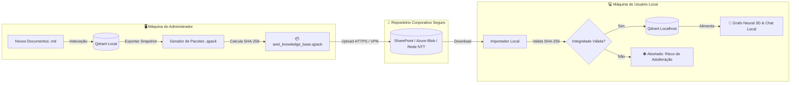
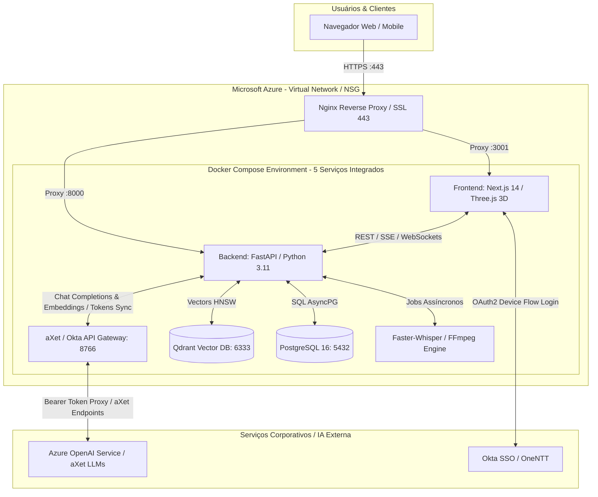

# 🧠 AXET-NEURALGRAPH-3D

> **Plataforma Neural 3D & Sistema de RAG Corporativo de Alta Performance**  
> *Ambiente Privado de Recuperação Aumentada por Geração (RAG), Análise Multimodal de Documentos/Vídeos e Visualização Neuroanatômica em Grafo 3D.*

---

## 📋 Sumário
1. [Visão Geral](#-visão-geral)
2. [Instalação e Execução Local Rápida (Windows & Mac)](#-instalação-e-execução-local-rápida)
3. [Arquitetura Local Estrita & Sincronização Segura de Dados (Opção 1)](#-arquitetura-local-estrita--sincronização-segura-de-dados-opção-1)
   - [Por que a Opção 1 Protege Contra Vazamento de Informação](#por-que-a-opção-1-protege-contra-vazamento-de-informação)
   - [Fluxo de Trabalho do Administrador (Exportação & Assinatura)](#fluxo-de-trabalho-do-administrador-exportação--assinatura)
   - [Fluxo de Trabalho do Usuário Local (Sincronização & Restauração)](#fluxo-de-trabalho-do-usuário-local-sincronização--restauração)
   - [Garantias Criptográficas e Integridade SHA-256](#garantias-criptográficas-e-integridade-sha-256)
4. [Arquitetura Geral da Solução](#-arquitetura-geral-da-solução)
5. [Matriz de Tecnologias & Dependências](#-matriz-de-tecnologias--dependências)
6. [Dimensionamento Recomendado no Azure Cloud](#-dimensionamento-recomendado-no-azure-cloud)
7. [Guia de Instalação Passo a Passo no Azure](#-guia-de-instalação-passo-a-passo-no-azure)
   - [Fase 1: Provisionamento da Máquina Virtual (Azure CLI)](#fase-1-provisionamento-da-máquina-virtual-azure-cli)
   - [Fase 2: Instalação das Ferramentas Base (Docker, Compose, Git)](#fase-2-instalação-das-ferramentas-base-docker-compose-git)
   - [Fase 3: Clonagem e Configuração do Repositório](#fase-3-clonagem-e-configuração-do-repositório)
   - [Fase 4: Configuração de Variáveis de Ambiente (.env)](#fase-4-configuração-de-variáveis-de-ambiente-env)
   - [Fase 5: Inicialização e Subida dos Containers](#fase-5-inicialização-e-subida-dos-containers)
   - [Fase 6: Proxy Reverso Nginx & Certificado SSL HTTPS Gratuito](#fase-6-proxy-reverso-nginx--certificado-ssl-https-gratuito)
8. [Primeiro Acesso & Validação do Sistema](#-primeiro-acesso--validação-do-sistema)
9. [Rotinas de Operação, Logs & Backup](#-rotinas-de-operação-logs--backup)
10. [Neuroplasticidade Sintética & Aprendizado Cognitivo Autônomo (Cenário 1)](#-neuroplasticidade-sintética--aprendizado-cognitivo-autônomo-cenário-1)
    - [Auto-Correção Cognitiva em Tempo Real](#auto-correção-cognitiva-em-tempo-real-durante-o-chat)
    - [Federação via GitHub com Zero Impacto de Permissões](#federação-via-github-com-zero-impacto-de-permissões-cenário-1)
    - [Curadoria pelo Master Admin & Compilação de Pacotes (.pack)](#curadoria-pelo-master-admin--compilação-de-pacotes-pack)
    - [Distribuição Global Instantânea via Releases (< 2s)](#distribuição-global-instantânea-via-releases--2s)
11. [Estratégia de Sincronização Dual Git](#-estratégia-de-sincronização-dual-git)

---

## 🌟 Visão Geral

O **AXET-NEURALGRAPH-3D** é uma plataforma corporativa completa desenvolvida para transformar acervos complexos de documentação técnica, regras de negócio e arquivos de mídia em um ecossistema interativo de inteligência:

- **🌌 Grafo Neural 3D Anatômico**: Renderização tridimensional em Three.js encapsulada por uma casca vítrea holográfica de encéfalo humano real (`brain.glb`), distribuindo documentos com fidelidade neuroanatômica (Lobos Frontal, Parietal, Occipital, Temporal, Cerebelo e Tronco Encefálico).
- **🔒 RAG de Domínio Estrito e Confiável**: Algoritmo de busca vetorial híbrida com blindagem semântica rigorosa que impede respostas alucinadas ou externas à base local indexada.
- **🎥 Processamento Multimodal de Vídeos**: Pipeline automatizado que extrai áudio via `FFmpeg`, transcreve offline via `faster-whisper`, amostra frames visuais de tela e gera documentação estruturada com OCR analítico.
- **⚖️ Matriz Regulatória & Glossário De ➔ Para**: Módulo administrativo de gestão de leis por país, thesaurus semântico e equivalências conceituais do mercado segurador.
- **🔐 Autenticação Corporativa Híbrida**: Suporte nativo a JWT, gestão de sessões, auditoria administrativa e integração via Okta SSO (Device Flow OneNTT).

---

## 🚀 Instalação e Execução Local Rápida

### 🪟 No Windows (Instalador One-Click via WSL2)
O Windows 10/11 roda o pipeline com aceleração total de hardware via WSL2 sem exigir comandos manuais de Linux:

1. **Clone o repositório ou baixe o ZIP:**
   ```bash
   git clone https://github.com/gcostabe/AXET-NEURALGRAPH-3D.git
   cd AXET-NEURALGRAPH-3D
   ```
2. **Dê duplo clique no arquivo `instalar_windows.bat`:**
   - Detecta e habilita o subsistema WSL2 e Ubuntu automaticamente;
   - Instala Docker Engine, Compose e dependências essenciais em segundo plano;
   - Compila e inicializa os 5 containers da solução (`frontend`, `backend`, `gateway`, `postgres`, `qdrant`);
   - Cria um atalho **`Iniciar AXET-NEURALGRAPH-3D.bat`** na sua **Área de Trabalho (Desktop)**.
3. **Uso diário**: Dê duplo clique no atalho da Área de Trabalho. Ele inicia o pipeline e abre o navegador automaticamente em **`http://localhost:3001/`**.

---

### 🍏 No macOS (Instalador One-Click)
O macOS executa a solução de forma nativa e conteinerizada:

1. **Clone o repositório:**
   ```bash
   git clone https://github.com/gcostabe/AXET-NEURALGRAPH-3D.git
   cd AXET-NEURALGRAPH-3D
   ```
2. **Execute o script de configuração inicial:**
   ```bash
   ./setup_mac.sh
   ```
   - Valida Docker Desktop, Colima e utilitários via Homebrew;
   - Configura as variáveis de ambiente `.env` e gera chaves criptográficas de segurança;
   - Inicializa os 5 containers via Docker Compose;
   - Cria o atalho clicável **`Iniciar AXET-NEURALGRAPH-3D.command`** na sua **Mesa (Desktop)**.
3. **Uso diário**: Dê duplo clique no atalho da Mesa ou execute `./iniciar_mac.command`. Ele conecta os serviços e abre o navegador em **`http://localhost:3001/`**.

---

## 🛡️ Arquitetura Local Estrita & Sincronização Segura de Dados (Opção 1)

### Por que a Opção 1 Protege Contra Vazamento de Informação

Para organizações que lidam com propriedade intelectual confidencial, regras de negócio sigilosas ou conformidade com LGPD/GDPR, o **AXET-NEURALGRAPH-3D** implementa uma arquitetura **100% Local-First (Air-Gapped Ready)**:

1. **Isolamento Total no Localhost**:
   - Toda a pilha (Frontend, Backend, PostgreSQL, Qdrant e Gateway) roda com binds locais estritos (`127.0.0.1`). Nenhuma porta é exposta para a rede pública.
   - Perguntas, chats, sinapses cognitivas e histórico de navegação **jamais saem da máquina do usuário**.
2. **Zero Textos Brutos Distribuídos**:
   - Os usuários finais **não precisam receber os arquivos de texto puro (`.md`)**.
   - Eles recebem exclusivamente a **base vetorial compactada e pré-indexada (`.qpack`)**, contendo apenas vetores multidimensionais, representações semânticas e metadados estruturados.
3. **Zero Consumo de Tokens/Custo de Embedding no Cliente**:
   - As máquinas dos clientes não precisam de GPU, CPU pesada ou créditos de API para calcular embeddings ao receber uma atualização. A restauração no Qdrant é atômica e instantânea (média de 5 a 50 segundos para dezenas de milhares de pontos).

---

### Diagrama de Fluxo: Distribuição Segura de Conhecimento (Opção 1)



---

### Fluxo de Trabalho do Administrador (Exportação & Assinatura)

O Administrador (`gcostabe@emeal.nttdata.com` ou `gustavo.costa.berbert@nttdata.com`) é a autoridade central de curadoria da base:

1. **Indexar Novos Documentos**:
   - Adicione ou atualize arquivos `.md` na pasta `data/sources/` ou pelo painel **"📁 Fontes & Ingestão"**.
   - O pipeline processa e gera os embeddings no Qdrant local da máquina do Admin.
2. **Gerar o Pacote Assinado (`.qpack`)**:
   - No Painel Admin, acesse a aba **"📦 Base & Snapshots"** (`/admin`).
   - Clique em **"🚀 Gerar Novo Pacote (.qpack)"**.
   - O sistema realiza um snapshot atômico do Qdrant, extrai os nós/sinapses do grafo neural do Postgres, empacota com compressão inteligente (redução de até 85% do tamanho original) e calcula a assinatura **SHA-256**.
3. **Disponibilizar o Pacote**:
   - Na tabela de pacotes, clique em **"⬇️ Baixar"** e copie o **SHA-256**.
   - Salve o arquivo na rede corporativa segura, Teams, SharePoint ou Azure Blob interno da NTT DATA.

> **💡 Via Linha de Comando (CLI):**
> O Admin também pode gerar o pacote diretamente via terminal:
> ```bash
> curl -X POST http://localhost:8000/admin/snapshots/export \
>   -H "Authorization: Bearer <TOKEN_ADMIN>"
> ```

---

### Fluxo de Trabalho do Usuário Local (Sincronização & Restauração)

O usuário comum tem três formas extremamente simples e seguras de aplicar a atualização:

#### Método A: Pela Interface Web (Recomendado — 1 Clique)
1. Com a aplicação aberta em `http://localhost:3001/`, clique no botão **"📦 Base Local"** no cabeçalho superior (ou abra pelo menu do perfil: *"Sincronizar Base Local"*).
2. Arraste e solte o arquivo `.qpack` recebido (ou selecione-o no disco).
3. *(Opcional)* Cole o checksum SHA-256 fornecido pelo Admin para verificação estrita.
4. Clique em **"🚀 Restaurar e Sincronizar"**.
5. Em segundos, o sistema restaura o Qdrant, reconecta o grafo neural 3D e exibe a confirmação de pontos atualizados.

#### Método B: Via Script One-Click (macOS / Linux / Windows)
Se o usuário preferir atualizar via terminal:
- **No macOS / Linux:**
  ```bash
  ./atualizar_base.sh caminho/do/arquivo.qpack
  ```
- **No Windows:**
  Dê duplo clique no script `atualizar_base.bat` ou execute no CMD:
  ```cmd
  atualizar_base.bat caminho\do\arquivo.qpack
  ```
O script verifica o status do Docker, valida o pacote, autentica localmente e aplica a restauração exibindo telemetria completa.

#### Método C: Atualização Automática na Inicialização
Basta colocar o arquivo de atualização com o nome `auto_import.qpack` na pasta:
```text
data/snapshots/auto_import.qpack
```
Ao dar duplo clique no atalho da Área de Trabalho (**`Iniciar AXET-NEURALGRAPH-3D`**), o lançador detecta o pacote, aplica a sincronização silenciosa antes de abrir o navegador e renomeia o arquivo para `.imported`.

---

### Garantias Criptográficas e Integridade SHA-256

- **Prevenção de Man-in-the-Middle (MitM) & Adulteração**:
  Cada pacote contém um manifesto interno com o hash SHA-256 exato dos vetores e metadados. Se qualquer byte do arquivo for alterado ou corrompido durante o download, a rotina de importação detecta a discrepância e **rejeita imediatamente a operação**, preservando a integridade da base local existente.
- **Transação Atômica**:
  A restauração do Qdrant utiliza o modo `priority="snapshot"`, garantindo que a base antiga continue atendendo normalmente até que o novo snapshot esteja 100% verificado e carregado na memória.

---

## 🏗️ Arquitetura Geral da Solução



---

## 🛠️ Matriz de Tecnologias & Dependências

### 1. Frontend Web (SPA / SSR)
| Tecnologia | Versão | Finalidade |
| :--- | :--- | :--- |
| **Next.js** | `14.2.35` | Framework React com App Router, server-rendering e rotas otimizadas |
| **React & React-DOM** | `18.3.1` | Biblioteca de componentes reativos e interfaces fluidas |
| **Three.js** | `0.186.0` | Motor gráfico WebGL para o Grafo Neural e Casca Holográfica 3D |
| **GLTFLoader** | Nativo Three.js | Carregador binário para a malha encefálica anatômica (`brain.glb`) |
| **Tailwind CSS** | `3.4.1` | Framework CSS utilitário para layout corporativo responsivo |
| **Lucide React** | `1.47.0` | Conjunto de ícones vetoriais modernos |
| **React-Markdown & Remark-GFM**| `10.1.0 / 4.0.1` | Renderizador Markdown para respostas da IA com tabelas e código |

### 2. Backend API & Engine
| Tecnologia | Versão | Finalidade |
| :--- | :--- | :--- |
| **Python** | `3.11-slim` | Runtime de alto desempenho para APIs assíncronas e processamento |
| **FastAPI** | `0.115.0` | Framework web assíncrono para endpoints REST, SSE e telemetria |
| **Uvicorn** | `0.30.6` | Servidor ASGI de alta performance com suporte a concurrency |
| **SQLAlchemy & Asyncpg** | `2.0.35 / 0.29.0` | ORM assíncrono para persistência de dados no PostgreSQL |
| **Alembic** | `1.13.3` | Sistema de versionamento e migrações de esquema de banco de dados |
| **Pydantic & Settings** | `2.9.2 / 2.5.2` | Validação estrita de contratos de dados e injeção de configurações |
| **Python-JOSE & Passlib** | `3.3.0 / 1.7.4` | Criptografia bcrypt, autenticação baseada em JWT e autorização RBAC |
| **Watchdog** | `5.0.3` | Monitoramento contínuo de alterações no sistema de arquivos |

### 3. Motores de IA, Multimodal & Banco de Dados
| Tecnologia | Versão | Finalidade |
| :--- | :--- | :--- |
| **Qdrant Client** | `1.11.1` | Banco vetorial especializado em busca semântica aproximada (HNSW Cosine) |
| **Sentence-Transformers** | `3.1.1` | Geração local de embeddings densos (`BAAI/bge-m3` ou modelos customizados) |
| **Faster-Whisper** | `1.2.1` | Motor de transcrição automática de voz baseado no CTranslate2 (offline) |
| **FFmpeg** | Nativo Linux | Extração de áudio 16kHz e amostragem periódica de frames visuais de vídeo |
| **Pillow (PIL)** | `10.4.0+` | Processamento de imagens capturadas de telas para análise visual multimodal |
| **PostgreSQL** | `16-alpine` | Banco relacional para usuários, sessões, auditoria e grafo relacional |

### 4. aXet / Okta Local AI Gateway (Embedado na Solução)
| Componente / Recurso | Detalhes | Finalidade |
| :--- | :--- | :--- |
| **`gateway/local_ai_gateway.py`** | Python 3.11 Stdlib | Proxy reverso corporativo autônomo (zero dependências pip externas) |
| **OpenAI Compatible Endpoint** | `/codex/v1/chat/completions` | Adaptação para modelos aXet (ex.: `gpt-5.6-terra-high`, `gpt-4o`) |
| **Anthropic Compatible Endpoint** | `/v1/messages` | Proxy para chamadas Bedrock/Claude via aXet |
| **Sincronização de Tokens Okta** | `/auth/tokens` & `/auth/status` | Ingestão e renovação automática de tokens Bearer corporativos |
| **Container Dedicado** | `gateway:8766` | Isolamento em microsserviço no Docker Compose conectado ao backend |

---

## 💻 Dimensionamento Recomendado no Azure Cloud

Para obter o melhor equilíbrio entre custo, latência e estabilidade, recomendamos os seguintes perfis de infraestrutura no Microsoft Azure:

| Perfil | SKU Azure VM | vCPUs | Memória | Armazenamento | Cenário de Uso |
| :--- | :--- | :--- | :--- | :--- | :--- |
| **Padrão Corporativo (Recomendado)** | `Standard_D4s_v5` | 4 | 16 GB | 128 GB SSD Premium | Indexação textual, Whisper CPU (int8) e até 50 usuários simultâneos. |
| **Multimodal de Alta Escala (GPU)** | `Standard_NC4as_T4_v3` | 4 | 28 GB (1x NVIDIA T4 16GB) | 256 GB SSD Premium | Transcrição em lote de dezenas de horas de vídeo com aceleração CUDA. |
| **Homologação / Testes Pequenos** | `Standard_B4ms` | 4 | 16 GB | 64 GB SSD Standard | Testes internos com carga reduzida e validação conceitual. |

> ⚠️ **Atenção**: Recomenda-se no mínimo **16 GB de memória RAM** na VM para que o container do Next.js (build estático) e os modelos do Whisper/Embeddings rodem sem risco de *Out Of Memory (OOM)*.

---

## 🚀 Guia de Instalação Passo a Passo no Azure

### Fase 1: Provisionamento da Máquina Virtual (Azure CLI)

Você pode executar os comandos abaixo diretamente no seu **Azure Cloud Shell** ou terminal local com `az cli`:

```bash
# 1. Definir variáveis do ambiente
RESOURCE_GROUP="rg-axet-neuralgraph-prod"
LOCATION="eastus2" # ou brazilsouth
VM_NAME="vm-axet-neuralgraph"
VM_SIZE="Standard_D4s_v5"
ADMIN_USER="azureuser"

# 2. Criar o Resource Group
az group create --name $RESOURCE_GROUP --location $LOCATION

# 3. Criar a Rede Virtual e Subnet
az network vnet create \
  --resource-group $RESOURCE_GROUP \
  --name vnet-axet \
  --address-prefix 10.0.0.0/16 \
  --subnet-name snet-axet \
  --subnet-prefix 10.0.1.0/24

# 4. Criar o Grupo de Segurança de Rede (NSG) e abrir portas essenciais
az network nsg create --resource-group $RESOURCE_GROUP --name nsg-axet

# Liberar SSH (22), HTTP (80), HTTPS (443), e opcionalmente Frontend Direto (3001)
az network nsg rule create --resource-group $RESOURCE_GROUP --nsg-name nsg-axet --name Allow-SSH --priority 1000 --direction Inbound --access Allow --protocol Tcp --destination-port-ranges 22
az network nsg rule create --resource-group $RESOURCE_GROUP --nsg-name nsg-axet --name Allow-HTTP --priority 1010 --direction Inbound --access Allow --protocol Tcp --destination-port-ranges 80
az network nsg rule create --resource-group $RESOURCE_GROUP --nsg-name nsg-axet --name Allow-HTTPS --priority 1020 --direction Inbound --access Allow --protocol Tcp --destination-port-ranges 443
az network nsg rule create --resource-group $RESOURCE_GROUP --nsg-name nsg-axet --name Allow-Frontend --priority 1030 --direction Inbound --access Allow --protocol Tcp --destination-port-ranges 3001

# 5. Provisionar a Máquina Virtual Ubuntu 22.04 LTS
az vm create \
  --resource-group $RESOURCE_GROUP \
  --name $VM_NAME \
  --image Ubuntu2204 \
  --size $VM_SIZE \
  --admin-username $ADMIN_USER \
  --generate-ssh-keys \
  --vnet-name vnet-axet \
  --subnet snet-axet \
  --nsg nsg-axet \
  --os-disk-size-gb 128 \
  --public-ip-sku Standard

# 6. Obter o IP Público gerado
PUBLIC_IP=$(az vm show -d -g $RESOURCE_GROUP -n $VM_NAME --query publicIps -o tsv)
echo "Máquina provisionada com sucesso! IP Público: $PUBLIC_IP"
```

---

### Fase 2: Instalação das Ferramentas Base (Docker, Compose, Git)

Conecte-se na VM via SSH:
```bash
ssh azureuser@$PUBLIC_IP
```

Dentro da VM Azure, execute o script de instalação oficial do Docker Engine e Compose:

```bash
# Atualizar repositórios do sistema
sudo apt-get update && sudo apt-get upgrade -y

# Instalar utilitários essenciais
sudo apt-get install -y apt-transport-https ca-certificates curl gnupg lsb-release git htop ufw

# Adicionar repositório oficial do Docker
sudo mkdir -p /etc/apt/keyrings
curl -fsSL https://download.docker.com/linux/ubuntu/gpg | sudo gpg --dearmor -o /etc/apt/keyrings/docker.gpg
echo "deb [arch=$(dpkg --print-architecture) signed-by=/etc/apt/keyrings/docker.gpg] https://download.docker.com/linux/ubuntu $(lsb_release -cs) stable" | sudo tee /etc/apt/sources.list.d/docker.list > /dev/null

# Instalar Docker Engine e Docker Compose Plugin
sudo apt-get update
sudo apt-get install -y docker-ce docker-ce-cli containerd.io docker-compose-plugin

# Permitir que o usuário execute Docker sem sudo
sudo usermod -aG docker $USER
newgrp docker

# Validar versões
docker --version
docker compose version
```

---

### Fase 3: Clonagem e Configuração do Repositório

```bash
# Navegar para o diretório de aplicações
cd ~
git clone https://github.com/gcostabe/AXET-NEURALGRAPH-3D.git app
cd app

# Criar a pasta de fontes de documentos
mkdir -p data/sources
```

---

### Fase 4: Configuração de Variáveis de Ambiente (.env)

Crie o arquivo `.env` a partir do template de produção:

```bash
cp .env.example .env
nano .env
```

Ajuste as seguintes variáveis-chave para o ambiente Azure:

```ini
# ── Fontes & Armazenamento ─────────────────────────────────
SOURCES_ROOT=./data/sources

# ── Qdrant Vector DB ──────────────────────────────────────
QDRANT_HOST=qdrant
QDRANT_PORT=6333
QDRANT_COLLECTION=rag_documents

# ── PostgreSQL Relacional ──────────────────────────────────
POSTGRES_HOST=postgres
POSTGRES_PORT=5432
POSTGRES_DB=rag_local_reef
POSTGRES_USER=rag_user
POSTGRES_PASSWORD=SuaSenhaForteAzurePostgres2026!

# ── Embeddings ─────────────────────────────────────────────
# "local" usa o modelo local BAAI/bge-m3; "api" consome gateway
EMBEDDING_MODE=api
EMBEDDING_API_URL=http://gateway:8766/codex
EMBEDDING_API_KEY=axet-local-adapter

# ── LLM Gateway (Embedado na Solução via Container 'gateway') ─
LLM_PROVIDER=openai
LLM_GATEWAY_URL=http://gateway:8766/codex
LLM_GATEWAY_API_KEY=axet-local-adapter
LLM_MODEL=gpt-5.6-terra-high
GATEWAY_HOST_URL=http://gateway:8766

# ── Autenticação & Segurança ──────────────────────────────
JWT_SECRET=gere_uma_chave_aleatoria_longa_com_openssl_rand_hex_32
JWT_ACCESS_TOKEN_TTL_MINUTES=30
JWT_REFRESH_TOKEN_TTL_DAYS=7
BOOTSTRAP_ADMIN_EMAIL=admin@seudominio.com.br

# ── Aplicação & CORS ──────────────────────────────────────
ENVIRONMENT=production
# Adicione aqui o IP público da VM ou o domínio com HTTPS
CORS_ALLOWED_ORIGINS=http://localhost:3001,http://SEU_IP_PUBLICO:3001,https://seu-dominio.com.br

# ── URL Pública da API para o Frontend ────────────────────
NEXT_PUBLIC_API_URL=http://SEU_IP_PUBLICO:8000
```

> 💡 **Dica de Segurança**: Para gerar um `JWT_SECRET` seguro, execute no terminal:
> ```bash
> openssl rand -hex 32
> ```

---

### Fase 5: Inicialização e Subida dos Containers

Compile e suba todos os **5 microserviços** (Qdrant, PostgreSQL, aXet Gateway, Backend FastAPI e Frontend Next.js):

```bash
# 1. Compilar imagens locais e inicializar em segundo plano (-d)
docker compose up -d --build

# 2. Verificar se todos os 5 containers estão "Up"
docker compose ps

# 3. Acompanhar os logs de inicialização do gateway e backend
docker compose logs -f gateway backend
```

Saída esperada:
```text
✔ Container app-qdrant-1    Running
✔ Container app-postgres-1  Running
✔ Container app-gateway-1   Running
✔ Container app-backend-1   Running
✔ Container app-frontend-1  Running
```

---

### Fase 6: Proxy Reverso Nginx & Certificado SSL HTTPS Gratuito

Para rodar em padrão corporativo com domínio próprio e HTTPS na porta padrão `443`:

```bash
# Instalar Nginx e Certbot
sudo apt-get install -y nginx certbot python3-certbot-nginx

# Criar a configuração do site no Nginx
sudo nano /etc/nginx/sites-available/axet-neuralgraph
```

Cole a seguinte configuração:

```nginx
server {
    listen 80;
    server_name seu-dominio.com.br;

    client_max_body_size 500M;

    # Frontend (Next.js & Grafo 3D)
    location / {
        proxy_pass http://127.0.0.1:3001;
        proxy_http_version 1.1;
        proxy_set_header Upgrade $http_upgrade;
        proxy_set_header Connection 'upgrade';
        proxy_set_header Host $host;
        proxy_cache_bypass $http_upgrade;
        proxy_set_header X-Real-IP $remote_addr;
        proxy_set_header X-Forwarded-For $proxy_add_x_forwarded_for;
        proxy_set_header X-Forwarded-Proto $scheme;
    }

    # Backend API e SSE Streams
    location ~ ^/(api|admin|auth|chat|conversations|health|knowledge|docs|openapi.json) {
        proxy_pass http://127.0.0.1:8000;
        proxy_http_version 1.1;
        proxy_set_header Connection '';
        proxy_buffering off;
        proxy_cache off;
        proxy_read_timeout 600s;
        proxy_set_header Host $host;
        proxy_set_header X-Real-IP $remote_addr;
        proxy_set_header X-Forwarded-For $proxy_add_x_forwarded_for;
        proxy_set_header X-Forwarded-Proto $scheme;
    }
}
```

Ative o site e gere o certificado Let's Encrypt automático:
```bash
sudo ln -s /etc/nginx/sites-available/axet-neuralgraph /etc/nginx/sites-enabled/
sudo rm -f /etc/nginx/sites-enabled/default
sudo nginx -t && sudo systemctl reload nginx

# Emitir certificado SSL
sudo certbot --nginx -d seu-dominio.com.br
```

---

## 🎯 Primeiro Acesso & Validação do Sistema

1. Abra seu navegador em:
   - **Interface Web**: `https://seu-dominio.com.br` (ou `http://SEU_IP_PUBLICO:3001`)
   - **Documentação Interativa Swagger**: `http://SEU_IP_PUBLICO:8000/docs`
2. Na tela de Login:
   - Cadastre seu primeiro usuário na aba **Registrar**, ou faça login com o admin configurado em `BOOTSTRAP_ADMIN_EMAIL`.
   - Caso utilize o **Okta SSO**, clique em **"Entrar com SSO Okta (OneNTT)"** e complete o fluxo de autorização de dispositivo.
3. No menu superior:
   - Clique em **Grafo 3D** para explorar o encéfalo translúcido renderizado com os documentos indexados.
   - Navegue em 360°, filtre por lobos corticais (Parietal, Frontal, Temporal, Cerebelo) e inspecione as conexões sinápticas.

---

## 🛡️ Rotinas de Operação, Logs & Backup

### Visualização de Logs em Tempo Real
```bash
# Todos os containers
docker compose logs -f

# Apenas backend
docker compose logs -f backend

# Apenas frontend
docker compose logs -f frontend
```

### Reiniciar ou Reconstruir após Atualizações
```bash
# Reinício rápido
docker compose restart

# Reconstrução total sem downtime excessivo
docker compose build
docker compose up -d
```

### Rotina de Backup (PostgreSQL + Qdrant)
Crie um script `backup.sh`:
```bash
#!/bin/bash
BACKUP_DIR="/home/azureuser/backups/$(date +%Y%m%d_%H%M%S)"
mkdir -p "$BACKUP_DIR"

# 1. Dump do banco relacional
docker exec app-postgres-1 pg_dump -U rag_user -d rag_local_reef > "$BACKUP_DIR/postgres_dump.sql"

# 2. Snapshot dos dados do Qdrant
docker exec app-qdrant-1 tar -czf - /qdrant/storage > "$BACKUP_DIR/qdrant_snapshot.tar.gz"

# 3. Compactar backup completo
tar -czf "$BACKUP_DIR.tar.gz" -C "$BACKUP_DIR" .
rm -rf "$BACKUP_DIR"

echo "Backup concluído: $BACKUP_DIR.tar.gz"
# Opcional: Enviar para Azure Blob Storage via azcopy ou az storage blob upload
```

---

## 🧠 Neuroplasticidade Sintética & Aprendizado Cognitivo Autônomo (Cenário 1)

O **AXET-NEURALGRAPH-3D** implementa uma capacidade pioneira de **Neuroplasticidade Sintética**: a habilidade do assistente inteligente de identificar falhas em seu próprio raciocínio em tempo real, auto-retificar-se e mutar a estrutura do Grafo Neural e da Memória Vetorial local imediatamente — sem necessidade de re-ingestão manual ou intervenção do usuário.

```
       [Conversa com Usuário]
                 │
                 ▼
     [Auto-Reflexão Autônoma]
  "Identifiquei um equívoco preliminar..."
                 │
        ┌────────┴────────┐
        ▼                 ▼
[Grafo Relacional]  [Memória Vetorial Qdrant]
Novo Nó ⚡           Chunk Vetorizado com
Aresta RETIFICA_    Prioridade Canônica Absoluta
CONCEITO            no Topo do Contexto RAG
        │
        ▼
[Visualização Instantânea no Chat]
"🧠 Aprendizado Ocorrido • Nova Sinapse no Grafo Neural"
        │
        ▼ (Cenário 1: Federação Git Sem Permissões)
 ┌────────────────────────────────────────────────────────┐
 │ 1. Outbox Local & GitHub Issues (Zero Permissões)      │
 │ 2. Curadoria & Aprovação pelo Master Admin             │
 │ 3. Compilação do Pacote Global (.pack)                 │
 │ 4. Distribuição Pública via Releases (< 2s p/ Todos)   │
 └────────────────────────────────────────────────────────┘
```

---

### Auto-Correção Cognitiva em Tempo Real durante o Chat

1. **Detecção Intrínseca (Sem Indução do Interlocutor)**:
   - Se o modelo detectar inconsistência entre seu raciocínio e a base canônica, ele expressa a retificação e emite internamente um bloco de aprendizado neural.
   - O backend extrai o conceito retificado, o equívoco superado e a diretriz canônica consolidada.
2. **Mutação Dinâmica do Grafo**:
   - Cria um nó permanente em `KnowledgeEntity` (`APRENDIZADO_COGNITIVO` com prefixo `⚡`).
   - Conecta uma aresta em `KnowledgeEdge` com a relação de alta voltagem `RETIFICA_CONCEITO` (peso `2.5+`).
   - Vetoriza a sinapse diretamente no Qdrant com metadados `is_cognitive_learning: true`.
3. **Card Visual Interativo no Chat**:
   - Imediatamente abaixo da resposta do assistente surge o card elegante:  
     `🧠 Aprendizado ocorrido • Nova Sinapse no Grafo Neural`
   - O card exibe o conceito, o equívoco superado (tachado) e a nova regra canônica em destaque.
4. **Prioridade Absoluta nas Próximas Perguntas**:
   - Em perguntas subsequentes (feitas pelo mesmo usuário ou qualquer usuário da máquina), o buscador RAG injeta as sinapses consolidadas no topo absoluto do prompt (`### [APRENDIZADOS E RETIFICAÇÕES CONSOLIDADAS PELO SISTEMA]`). A retificação se sobrepõe a documentos legados ou diretrizes anteriores.

---

### Federação via GitHub com Zero Impacto de Permissões (Cenário 1)

O maior desafio em ambientes corporativos com centenas de estações instaladas é como **coletar aprendizados de todos os apps e redistribuí-los sem exigir que colaboradores sejam adicionados como desenvolvedores no repositório Git**.

O **Cenário 1** resolve essa governança com impacto zero de credenciais:

| Vetor de Fluxo | Mecanismo de Transporte | Requisito de Permissão do Usuário Final | Garantia de Governança |
| :--- | :--- | :--- | :--- |
| **Outgoing (Envio de Aprendizado)** | Outbox local `data/learnings/outbox/` + GitHub Issues API (label `cognitive-learning`) | **ZERO permissões**. Não precisa de conta no GitHub, nem commit, nem acesso de colaborador. | Telemetria estrita e auditável. Bloqueio total a escritas no código fonte. |
| **Curadoria & Aprovação** | Painel Administrativo -> Aba "Curadoria de Sinapses" | Restrito exclusivamente ao **Master Admin** (`gcostabe@emeal.nttdata.com` / `gustavo.costa.berbert@nttdata.com`). | Nenhuma sinapse duvidosa é propagada sem validação técnica humana. |
| **Incoming (Propagação Global)** | Download de `axet_cognitive_synapses_latest.pack` via GitHub Releases Assets (HTTP GET público) | **ZERO autenticação**. Pure HTTP GET anônimo. | Atualização instantânea em < 2 segundos para todas as máquinas clientes. |

---

### Curadoria pelo Master Admin & Compilação de Pacotes (.pack)

No Painel Administrativo (`/admin` -> Aba **🧠 Curadoria de Sinapses Cognitivas**):
1. **Quadro de Triagem**:
   - Lista todas as sinapses reportadas pelas instâncias clientes ou capturadas das GitHub Issues.
   - Permite visualizar o conceito, equívoco e a correção canônica.
2. **Aprovação & Refinamento**:
   - O Master Admin pode editar o texto canônico para garantir redação formal corporativa.
   - Ao clicar em **"Aprovar Sinapse"**, o nó e a aresta são promovidos a canônicos no banco relacional e a Issue correspondente no GitHub é encerrada automaticamente com comentário de homologação.
3. **Compilação de Pacote 1-Clique**:
   - O botão **"📦 Compilar Pacote Global (.pack)"** consolida todas as sinapses aprovadas em um arquivo delta leve (`axet_cognitive_synapses_latest.pack`, tipicamente menor que 100 KB).
   - O arquivo pode ser publicado diretamente como asset nas Releases corporativas do GitHub ou baixado localmente.

---

### Distribuição Global Instantânea via Releases (< 2s)

1. **Sincronização 1-Clique no Cliente**:
   - No painel administrativo ou em rotinas de inicialização agendadas, a aplicação executa um `GET` contra a URL de release oficial:
     ```
     https://github.com/gcostabe/AXET-NEURALGRAPH-3D/releases/latest/download/axet_cognitive_synapses_latest.pack
     ```
2. **Injeção Atômica sem Overhead**:
   - A máquina cliente decodifica o arquivo `.pack` (JSON estruturado);
   - Grava as entidades e arestas no PostgreSQL local;
   - Realiza upsert vetorial no Qdrant local;
   - O ciclo completo de sincronização de dezenas de aprendizados ocorre em **menos de 2 segundos**, com zero consumo de tokens e sem reprocessar documentos brutos.
3. **Importação Manual Offline**:
   - Em redes restritas ou sem acesso à internet, o usuário ou administrador pode usar o botão **"Importar Arquivo .pack / .json"** para carregar o delta manualmente via pendrive ou pasta corporativa.

---

## 🔄 Estratégia de Sincronização Dual Git

O repositório local está configurado com **Push Dual Simultâneo**. Toda vez que um desenvolvedor executa `git push origin main`, o Git envia automaticamente os commits para os dois repositórios oficiais:

1. **Repositório Primário**: `https://github.com/gberbert/RAG-LOCAL-REEF.git`
2. **Repositório AXET-NEURALGRAPH-3D**: `https://github.com/gcostabe/AXET-NEURALGRAPH-3D.git`

Para verificar ou ajustar as URLs remotas a qualquer momento:
```bash
git remote -v
```

---

## 📄 Licença & Conformidade
Desenvolvido para ambientes corporativos **NTT DATA / MAPFRE**. Uso restrito e protegido por diretrizes de governança e sigilo operacional.