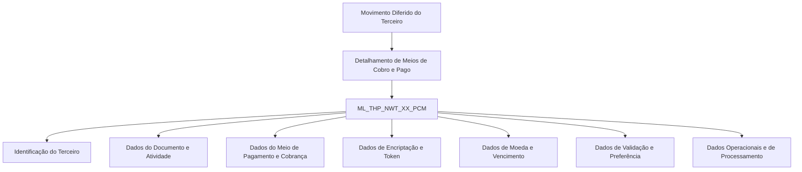

# Relatório de Ingestão de Documento para RAG

**Arquivo de origem:** `01-Mod_02-Terceros_02-Ope_01-Comun_01-Procesos-Masivos_02-Tecnica_DETALLAR-InFor-Medios-de-Cobro-y-Pago-TECNICA.PDF`
**Data de processamento:** 21/09/2026 03:47:15
**Modelo de interpretação:** gpt-5.6-terra (axet-code)
**Prompt utilizado:** [analise_documento_rag.md](file:///Users/gcostabe/dev/AGENTE-CONTEXT-GEN/prompts/analise_documento_rag.md)

---

# Detalhamento dos Meios de Cobro e Pago no Movimento Diferido do Terceiro — Visão Técnica

## 1. Metadados do Documento
- **Arquivo de Origem:** Não identificado no conteúdo fornecido
- **Tipo de Documento:** Especificação Técnica
- **Domínio / Sistema:** Movimento Diferido do Terceiro; Meios de Cobro e Pago
- **Público-Alvo:** Desenvolvedores, Arquitetos, Analistas Funcionais e Operação
- **Data/Versão Identificada:** Não identificada

---

## 2. Resumo Executivo & Contexto de Negócio

O documento descreve tecnicamente o detalhamento de informações de meios de cobrança e pagamento vinculadas ao movimento diferido de um terceiro. O foco apresentado é o modelo de dados que registra essas informações, sem detalhar fluxos de interface, contratos de API, métodos HTTP ou processos de integração.

A operação utiliza a tabela `ML_THP_NWT_XX_PCM`, identificada como “BUZÓN MEDIOS DE PAGO Y COBRO”. O documento lista as colunas envolvidas na operação e classifica se cada coluna muda valor, se possui valor/motivo identificado e se é obrigatória.

Os atributos cobrem identificação do terceiro, documento, atividade, sequência do meio de pagamento e cobrança, tipo e classe do meio, entidade, zona geográfica, titularidade, valor encriptado, chave de encriptação, token, moeda, vencimento, validação e preferência do meio de pagamento e cobrança.

Também são listados atributos operacionais e de processamento, incluindo usuário de atualização, data de modificação, hilo de processamento, situação do processo, ação de origem, identificador interno de erro, observação, identificador do terceiro, entidade bancária e dados encriptados.

> **Nota de Análise:** O documento apresenta somente a estrutura tabular e descrições parciais de campos. Não detalha tipos físicos de banco de dados, chaves primárias, chaves estrangeiras, regras de preenchimento condicionais, tecnologias de persistência, ambientes, URLs, APIs ou fluxos transacionais completos.

---

## 3. Arquitetura, Componentes & Tecnologias Envolvidas

O único componente técnico explicitamente identificado é a tabela `ML_THP_NWT_XX_PCM`, utilizada como repositório de informações de meios de pagamento e cobrança no contexto do movimento diferido do terceiro.

| Componente | Papel identificado |
| :--- | :--- |
| `ML_THP_NWT_XX_PCM` | Tabela descrita como “BUZÓN MEDIOS DE PAGO Y COBRO”. Armazena atributos relacionados ao terceiro, ao meio de cobrança/pagamento e ao processamento da operação. |
| Terceiro | Entidade de negócio associada ao movimento diferido e aos meios de pagamento e cobrança. |
| Movimento Diferido | Contexto funcional no qual são detalhados os meios de cobrança e pagamento. |
| Meio de Pagamento e Cobrança | Entidade representada por atributos de identificação, tipo, classe, valor encriptado, token, moeda, vencimento, validação, preferência e estado. |



> **Nota de Análise:** O diagrama representa exclusivamente o agrupamento conceitual dos campos citados. O documento não descreve chamadas entre sistemas, integrações, microsserviços ou fluxo efetivo de persistência.

---

## 4. Regras de Negócio, Especificações Funcionais & Processos

### 4.1 Entidade persistida

A operação utiliza a tabela `ML_THP_NWT_XX_PCM`, descrita como `BUZÓN MEDIOS DE PAGO Y COBRO`.

### 4.2 Indicadores de alteração

Para todos os campos listados, a coluna “CAMBIA VALOR” possui o valor `S`. Portanto, conforme a estrutura apresentada, todos os atributos relacionados são marcados como campos cujo valor muda.

### 4.3 Obrigatoriedade identificada

Os seguintes atributos são marcados como obrigatórios (`SI`) no conteúdo fornecido:

- `BTC_IDN_VAL`
- `SQN_VAL`
- `CMP_VAL`
- `THP_DCM_TYP_VAL`
- `THP_DCM_VAL`
- `THP_ACV_VAL`
- `PCM_SQN_VAL`
- `VLD_DAT`
- `PCM_TYP_VAL`
- `PCM_CSS_VAL`
- `ENT_TYP_VAL`
- `CNY_VAL`
- `HLR_NAM`
- `PCM_VAL`
- `TKN_TYP_VAL`
- `MVM_PCM_TYP_VAL`
- `MVM_PCM_USE_TYP_VAL`
- `CRN_VAL`
- `PCM_CCK`
- `DFL_PCM`
- `PCM_FAV`
- `DSB_ROW`
- `USR_VAL`
- `MDF_DAT`

Os seguintes atributos são marcados como não obrigatórios (`NO`):

- `PCM_KEY_VAL`
- `TKN_VAL`
- `EXP_MNH`
- `EXP_YER`
- `PRC_THD_VAL`
- `PRC_STS_VAL`
- `ACN_ORG_VAL`
- `ERR_IDN_VAL`
- `OBS_VAL`
- `IDN_THP_VAL`
- `BNE_VAL`
- `ECR_DAA`

### 4.4 Restrições e limitações documentadas

- O campo `PCM_VAL` é descrito como valor encriptado do meio de pagamento e cobrança.
- O campo `PCM_KEY_VAL` é descrito como chave de encriptação do meio de pagamento e cobrança, porém não é obrigatório.
- O campo `TKN_VAL` é descrito como token de cobrança e não é obrigatório.
- Os campos `EXP_MNH` e `EXP_YER` representam, respectivamente, mês e ano de vencimento; ambos não são obrigatórios.
- O campo `DSB_ROW` é associado a uma fila desabilitada.
- Os campos `PRC_THD_VAL`, `PRC_STS_VAL`, `ACN_ORG_VAL`, `ERR_IDN_VAL` e `OBS_VAL` armazenam informações de processamento, situação, ação de origem, erro e observação, sem obrigatoriedade indicada.

> **Nota de Análise:** O documento não informa regras condicionais, por exemplo, se campos de vencimento são exigidos para determinados tipos de meio de pagamento, nem define valores permitidos para tipo, classe, moeda, situação ou uso do movimento.

---

## 5. Tabelas de Parâmetros, Ambientes e Estruturas de Dados

| Item / Parâmetro | Descrição / Função | Tipo / Valores / Formato | Ambiente / Observações |
| :--- | :--- | :--- | :--- |
| `ML_THP_NWT_XX_PCM` | Buzón de meios de pagamento e cobrança. | Tabela. | Tabela envolvida na operação. |
| `BTC_IDN_VAL` | Identificação, conforme texto parcial “IDENTIF”. | Não informado. Obrigatório: `SI`. | Muda valor: `S`; motivo/valor: `N.A.` |
| `SQN_VAL` | Sequência, conforme texto parcial “SECUE”. | Não informado. Obrigatório: `SI`. | Muda valor: `S`; motivo/valor: `N.A.` |
| `CMP_VAL` | Campo descrito parcialmente como “COMPA”. | Não informado. Obrigatório: `SI`. | Muda valor: `S`; motivo/valor: `N.A.` |
| `THP_DCM_TYP_VAL` | Tipo de documento do terceiro. | Não informado. Obrigatório: `SI`. | Muda valor: `S`; motivo/valor: `N.A.` |
| `THP_DCM_VAL` | Documento do terceiro. | Não informado. Obrigatório: `SI`. | Muda valor: `S`; motivo/valor: `N.A.` |
| `THP_ACV_VAL` | Atividade do terceiro. | Não informado. Obrigatório: `SI`. | Muda valor: `S`; motivo/valor: `N.A.` |
| `PCM_SQN_VAL` | Sequência do meio de pagamento e cobrança. | Não informado. Obrigatório: `SI`. | Muda valor: `S`; motivo/valor: `N.A.` |
| `VLD_DAT` | Data de validade. | Não informado. Obrigatório: `SI`. | Muda valor: `S`; motivo/valor: `N.A.` |
| `PCM_TYP_VAL` | Tipo de meio de pagamento e cobrança. | Não informado. Obrigatório: `SI`. | Muda valor: `S`; motivo/valor: `N.A.` |
| `PCM_CSS_VAL` | Classe de meio de pagamento e cobrança. | Não informado. Obrigatório: `SI`. | Muda valor: `S`; motivo/valor: `N.A.` |
| `ENT_TYP_VAL` | Tipo de entidade. | Não informado. Obrigatório: `SI`. | Muda valor: `S`; motivo/valor: `N.A.` |
| `CNY_VAL` | Zona geográfica. | Não informado. Obrigatório: `SI`. | Muda valor: `S`; motivo/valor: `N.A.` |
| `HLR_NAM` | Titular. | Não informado. Obrigatório: `SI`. | Muda valor: `S`; motivo/valor: `N.A.` |
| `PCM_VAL` | Valor encriptado do meio de pagamento e cobrança. | Não informado. Obrigatório: `SI`. | Muda valor: `S`; motivo/valor: `N.A.` |
| `PCM_KEY_VAL` | Chave de encriptação do meio de pagamento e cobrança. | Não informado. Obrigatório: `NO`. | Muda valor: `S`; motivo/valor: `N.A.` |
| `TKN_TYP_VAL` | Tipo de token. | Não informado. Obrigatório: `SI`. | Muda valor: `S`; motivo/valor: `N.A.` |
| `TKN_VAL` | Token de cobrança. | Não informado. Obrigatório: `NO`. | Muda valor: `S`; motivo/valor: `N.A.` |
| `MVM_PCM_TYP_VAL` | Tipo de movimento. | Não informado. Obrigatório: `SI`. | Muda valor: `S`; motivo/valor: `N.A.` |
| `MVM_PCM_USE_TYP_VAL` | Tipo de uso do movimento de meio de pagamento e cobrança. | Não informado. Obrigatório: `SI`. | Muda valor: `S`; motivo/valor: `N.A.` |
| `CRN_VAL` | Moeda. | Não informado. Obrigatório: `SI`. | Muda valor: `S`; motivo/valor: `N.A.` |
| `EXP_MNH` | Mês de vencimento. | Não informado. Obrigatório: `NO`. | Muda valor: `S`; motivo/valor: `N.A.` |
| `EXP_YER` | Ano de vencimento. | Não informado. Obrigatório: `NO`. | Muda valor: `S`; motivo/valor: `N.A.` |
| `PCM_CCK` | Meio de pagamento e cobrança validado. | Não informado. Obrigatório: `SI`. | Muda valor: `S`; motivo/valor: `N.A.` |
| `DFL_PCM` | Meio de pagamento e cobrança por defeito. | Não informado. Obrigatório: `SI`. | Muda valor: `S`; motivo/valor: `N.A.` |
| `PCM_FAV` | Meio de pagamento e cobrança preferido. | Não informado. Obrigatório: `SI`. | Muda valor: `S`; motivo/valor: `N.A.` |
| `DSB_ROW` | Fila desabilitada. | Não informado. Obrigatório: `SI`. | Muda valor: `S`; motivo/valor: `N.A.` |
| `USR_VAL` | Usuário que atualiza a fila. | Não informado. Obrigatório: `SI`. | Muda valor: `S`; motivo/valor: `N.A.` |
| `MDF_DAT` | Data de modificação. | Não informado. Obrigatório: `SI`. | Muda valor: `S`; motivo/valor: `N.A.` |
| `PRC_THD_VAL` | Hilo de processamento. | Não informado. Obrigatório: `NO`. | Muda valor: `S`; motivo/valor: `N.A.` |
| `PRC_STS_VAL` | Situação do processo. | Não informado. Obrigatório: `NO`. | Muda valor: `S`; motivo/valor: `N.A.` |
| `ACN_ORG_VAL` | Ação de origem. | Não informado. Obrigatório: `NO`. | Muda valor: `S`; motivo/valor: `N.A.` |
| `ERR_IDN_VAL` | Identificador interno de erro. | Não informado. Obrigatório: `NO`. | Muda valor: `S`; motivo/valor: `N.A.` |
| `OBS_VAL` | Observação. | Não informado. Obrigatório: `NO`. | Muda valor: `S`; motivo/valor: `N.A.` |
| `IDN_THP_VAL` | Identificador do terceiro. | Não informado. Obrigatório: `NO`. | Muda valor: `S`; motivo/valor: `N.A.` |
| `BNE_VAL` | Entidade bancária. | Não informado. Obrigatório: `NO`. | Muda valor: `S`; motivo/valor: `N.A.` |
| `ECR_DAA` | Dados encriptados. | Não informado. Obrigatório: `NO`. | Muda valor: `S`; motivo/valor: `N.A.` |

---

## 6. Bateria de Perguntas & Respostas para RAG (FAQ Sintético)

### P1: Qual tabela armazena os meios de pagamento e cobrança no movimento diferido do terceiro?
**R:** A tabela identificada no documento é `ML_THP_NWT_XX_PCM`, descrita como `BUZÓN MEDIOS DE PAGO Y COBRO`.

### P2: Quais campos identificam o documento do terceiro?
**R:** O documento lista `THP_DCM_TYP_VAL` como tipo de documento do terceiro e `THP_DCM_VAL` como documento do terceiro. Ambos são marcados como obrigatórios.

### P3: Quais atributos representam o meio de pagamento e cobrança?
**R:** Os atributos apresentados incluem `PCM_SQN_VAL`, `PCM_TYP_VAL`, `PCM_CSS_VAL`, `PCM_VAL`, `PCM_KEY_VAL`, `PCM_CCK`, `DFL_PCM` e `PCM_FAV`. Eles representam sequência, tipo, classe, valor encriptado, chave de encriptação, validação, meio por defeito e meio preferido.

### P4: O valor do meio de pagamento e cobrança é obrigatório?
**R:** Sim. O campo `PCM_VAL`, descrito como valor encriptado do meio de pagamento e cobrança, é marcado como obrigatório (`SI`).

### P5: A chave de encriptação do meio de pagamento e cobrança é obrigatória?
**R:** Não. O campo `PCM_KEY_VAL`, descrito como chave de encriptação do meio de pagamento e cobrança, é marcado como não obrigatório (`NO`).

### P6: Quais campos estão relacionados ao token de cobrança?
**R:** O documento lista `TKN_TYP_VAL` para o tipo de token, marcado como obrigatório, e `TKN_VAL` para o token de cobrança, marcado como não obrigatório.

### P7: Os dados de vencimento são obrigatórios?
**R:** Não. Os campos `EXP_MNH`, referente ao mês de vencimento, e `EXP_YER`, referente ao ano de vencimento, são ambos marcados como não obrigatórios.

### P8: Como o documento representa o meio de pagamento e cobrança padrão e preferido?
**R:** O campo `DFL_PCM` representa o meio de pagamento e cobrança por defeito, enquanto `PCM_FAV` representa o meio de pagamento e cobrança preferido. Ambos são obrigatórios.

### P9: Quais campos armazenam informações de processamento e erro?
**R:** Os campos relacionados ao processamento são `PRC_THD_VAL` para hilo de processamento, `PRC_STS_VAL` para situação do processo, `ACN_ORG_VAL` para ação de origem, `ERR_IDN_VAL` para identificador interno de erro e `OBS_VAL` para observação. Todos são marcados como não obrigatórios.

### P10: Quais informações de auditoria da fila são registradas?
**R:** O documento identifica `DSB_ROW` como fila desabilitada, `USR_VAL` como usuário que atualiza a fila e `MDF_DAT` como data de modificação. Os três campos são marcados como obrigatórios.

### P11: O documento especifica os tipos físicos das colunas da tabela?
**R:** Não. O conteúdo fornece nomes de colunas, descrições parciais, indicador de alteração de valor e obrigatoriedade, mas não informa tipos físicos, tamanhos, domínios ou valores permitidos.

### P12: O documento define APIs, URLs ou integrações para a tabela `ML_THP_NWT_XX_PCM`?
**R:** Não. O conteúdo não apresenta métodos HTTP, contratos JSON, URLs, ambientes, portas, serviços externos ou mecanismos de integração.

---

## 7. Glossário de Termos, Siglas & Conceitos-Chave

- **`ML_THP_NWT_XX_PCM`:** Tabela envolvida na operação, descrita como “BUZÓN MEDIOS DE PAGO Y COBRO”.
- **Terceiro (`THP`):** Entidade de negócio associada a documento, atividade e identificação na estrutura apresentada.
- **PCM:** Prefixo utilizado em campos associados a meios de pagamento e cobrança.
- **Cobro:** Cobrança.
- **Pago:** Pagamento.
- **Movimento Diferido:** Contexto funcional citado no título do documento para o detalhamento de meios de cobrança e pagamento.
- **Token:** Informação identificada pelos campos `TKN_TYP_VAL` e `TKN_VAL`.
- **Encriptação:** Proteção de dados associada a `PCM_VAL`, `PCM_KEY_VAL` e `ECR_DAA`.
- **Moeda:** Informação representada pelo campo `CRN_VAL`.
- **Fila desabilitada:** Conceito associado ao campo `DSB_ROW`.
- **Hilo de processamento:** Informação de processamento associada ao campo `PRC_THD_VAL`.
- **Situação do processo:** Estado de processamento associado ao campo `PRC_STS_VAL`.

---

## 8. Notas Críticas, Riscos & Limitações

- O documento não identifica o arquivo de origem, a data, a versão, o autor ou o sistema corporativo proprietário.
- As descrições de diversas colunas estão truncadas na extração, por exemplo: `BTC_IDN_VAL`, `SQN_VAL`, `CMP_VAL` e `CNY_VAL`.
- Não são informados tipos físicos, tamanhos, chaves, índices, relacionamentos, constraints ou valores de domínio da tabela.
- Não há detalhamento de regras de negócio condicionais ou validações de consistência entre campos.
- Não são descritos fluxos operacionais, APIs, integrações, contratos, URLs, portas, ambientes ou responsáveis técnicos.
- Os campos `PCM_VAL`, `PCM_KEY_VAL` e `ECR_DAA` indicam dados encriptados, mas o documento não especifica algoritmo, estratégia de gestão de chaves ou mecanismo de proteção.
- A marcação `S` em “CAMBIA VALOR” é uniforme para todos os campos, mas o documento não explica a semântica operacional completa desse indicador.
- A estrutura deve ser complementada por documentação de modelo físico, catálogo de dados e contratos de integração antes de ser usada para implementação ou operação autônoma.

---

## 9. Conteúdo Bruto Estruturado (Referência Fiel)

```text
--- [PÁGINA 1 DE 4] ---

DETALLAR Información de los Medios de
Cobro y Pago en el Movimiento Diferido del
Tercero (Visión Técnica)
Modelo de datos involucrado
La tabla que interviene en esta operación es:
TABLA DESCRIPCIÓN
ML_THP_NWT_XX_PCM BUZÓN MEDIOS DE PAGO Y COBRO
COLUMNA CAMBIA
VALOR
MOTIVO/VALOR OBLIGATORIA COMEN
BTC_IDN_VAL S N.A. SI IDENTIF
SQN_VAL S N.A. SI SECUE
CMP_VAL S N.A. SI COMPA
THP_DCM_TYP_VAL S N.A. SI TIPO DE
DOCUM
 /
 RS
Inicio Soluciones APIs Documentación Zeus
ES


--- [PÁGINA 2 DE 4] ---

COLUMNA CAMBIA
VALOR
MOTIVO/VALOR OBLIGATORIA COMEN
DEL TE
THP_DCM_VAL S N.A. SI DOCUM
DEL TE
THP_ACV_VAL S N.A. SI ACTIVID
TERCE
PCM_SQN_VAL S N.A. SI SECUE
MEDIO
Y COBR
VLD_DAT S N.A. SI FECHA
PCM_TYP_VAL S N.A. SI TIPO M
PAGO Y
PCM_CSS_VAL S N.A. SI CLASE
PAGO Y
ENT_TYP_VAL S N.A. SI TIPO EN
CNY_VAL S N.A. SI ZONA U
GEOGR
HLR_NAM S N.A. SI TITULA
PCM_VAL S N.A. SI VALOR
ENCRIP
DEL ME
PAGO Y
PCM_KEY_VAL S N.A. NO CLAVE
ENCRIP
DEL ME
PAGO Y


--- [PÁGINA 3 DE 4] ---

COLUMNA CAMBIA
VALOR
MOTIVO/VALOR OBLIGATORIA COMEN
TKN_TYP_VAL S N.A. SI TIPO DE
TKN_VAL S N.A. NO TOKEN
COBRO
COBRO
MVM_PCM_TYP_VAL S N.A. SI TIPO
MOVIM
MVM_PCM_USE_TYP_VAL S N.A. SI TIPO DE
DEL
MOVIM
MEDIO
Y COBR
CRN_VAL S N.A. SI MONED
EXP_MNH S N.A. NO MES
VENCIM
EXP_YER S N.A. NO AÑO
VENCIM
PCM_CCK S N.A. SI MEDIO
Y COBR
VALIDA
DFL_PCM S N.A. SI MEDIO
Y COBR
DEFECT
PCM_FAV S N.A. SI MEDIO
Y COBR
PREFER
DSB_ROW S N.A. SI FILA
DESHA


--- [PÁGINA 4 DE 4] ---

COLUMNA CAMBIA
VALOR
MOTIVO/VALOR OBLIGATORIA COMEN
USR_VAL S N.A. SI USUAR
ACTUA
FILA
MDF_DAT S N.A. SI FECHA
MODIFI
PRC_THD_VAL S N.A. NO HILO
PRC_STS_VAL S N.A. NO SITUAC
PROCE
ACN_ORG_VAL S N.A. NO ACCIÓN
ERR_IDN_VAL S N.A. NO IDENTIF
INTERN
ERROR
OBS_VAL S N.A. NO OBSER
IDN_THP_VAL S N.A. NO IDENTIF
TERCE
BNE_VAL S N.A. NO ENTIDA
BANCA
ECR_DAA S N.A. NO DATOS
ENCRIP
```

---

## Conteúdo Bruto Extraído (Original Completo)

```text
--- [PÁGINA 1 DE 4] ---

DETALLAR Información de los Medios de
Cobro y Pago en el Movimiento Diferido del
Tercero (Visión Técnica)
Modelo de datos involucrado
La tabla que interviene en esta operación es:
TABLA DESCRIPCIÓN
ML_THP_NWT_XX_PCM BUZÓN MEDIOS DE PAGO Y COBRO
COLUMNA CAMBIA
VALOR
MOTIVO/VALOR OBLIGATORIA COMEN
BTC_IDN_VAL S N.A. SI IDENTIF
SQN_VAL S N.A. SI SECUE
CMP_VAL S N.A. SI COMPA
THP_DCM_TYP_VAL S N.A. SI TIPO DE
DOCUM
 / 
 RS
Inicio Soluciones APIs Documentación Zeus
ES


--- [PÁGINA 2 DE 4] ---

COLUMNA CAMBIA
VALOR
MOTIVO/VALOR OBLIGATORIA COMEN
DEL TE
THP_DCM_VAL S N.A. SI DOCUM
DEL TE
THP_ACV_VAL S N.A. SI ACTIVID
TERCE
PCM_SQN_VAL S N.A. SI SECUE
MEDIO 
Y COBR
VLD_DAT S N.A. SI FECHA 
PCM_TYP_VAL S N.A. SI TIPO M
PAGO Y
PCM_CSS_VAL S N.A. SI CLASE 
PAGO Y
ENT_TYP_VAL S N.A. SI TIPO EN
CNY_VAL S N.A. SI ZONA U
GEOGR
HLR_NAM S N.A. SI TITULA
PCM_VAL S N.A. SI VALOR
ENCRIP
DEL ME
PAGO Y
PCM_KEY_VAL S N.A. NO CLAVE
ENCRIP
DEL ME
PAGO Y


--- [PÁGINA 3 DE 4] ---

COLUMNA CAMBIA
VALOR
MOTIVO/VALOR OBLIGATORIA COMEN
TKN_TYP_VAL S N.A. SI TIPO DE
TKN_VAL S N.A. NO TOKEN 
COBRO
COBRO
MVM_PCM_TYP_VAL S N.A. SI TIPO
MOVIM
MVM_PCM_USE_TYP_VAL S N.A. SI TIPO DE
DEL
MOVIM
MEDIO 
Y COBR
CRN_VAL S N.A. SI MONED
EXP_MNH S N.A. NO MES
VENCIM
EXP_YER S N.A. NO AÑO
VENCIM
PCM_CCK S N.A. SI MEDIO 
Y COBR
VALIDA
DFL_PCM S N.A. SI MEDIO 
Y COBR
DEFECT
PCM_FAV S N.A. SI MEDIO 
Y COBR
PREFER
DSB_ROW S N.A. SI FILA
DESHA


--- [PÁGINA 4 DE 4] ---

COLUMNA CAMBIA
VALOR
MOTIVO/VALOR OBLIGATORIA COMEN
USR_VAL S N.A. SI USUAR
ACTUA
FILA
MDF_DAT S N.A. SI FECHA
MODIFI
PRC_THD_VAL S N.A. NO HILO
PRC_STS_VAL S N.A. NO SITUAC
PROCE
ACN_ORG_VAL S N.A. NO ACCIÓN
ERR_IDN_VAL S N.A. NO IDENTIF
INTERN
ERROR
OBS_VAL S N.A. NO OBSER
IDN_THP_VAL S N.A. NO IDENTIF
TERCE
BNE_VAL S N.A. NO ENTIDA
BANCA
ECR_DAA S N.A. NO DATOS
ENCRIP
```
