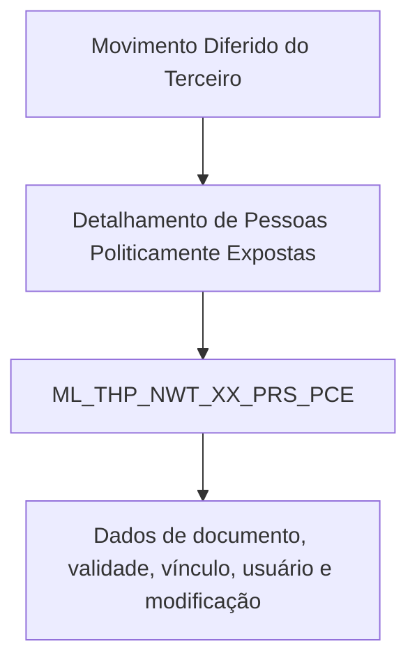

# Relatório de Ingestão de Documento para RAG

**Arquivo de origem:** `01-Mod_02-Terceros_02-Ope_01-Comun_01-Procesos-Masivos_02-Tecnica_DETALLAR-InFor-Personas-P-Expuestas-TECNICA.PDF`
**Data de processamento:** 21/09/2026 03:47:07
**Modelo de interpretação:** gpt-5.6-terra (axet-code)
**Prompt utilizado:** [analise_documento_rag.md](file:///Users/gcostabe/dev/AGENTE-CONTEXT-GEN/prompts/analise_documento_rag.md)

---

# Detalhamento de Pessoas Politicamente Expostas no Movimento Diferido do Terceiro — Visão Técnica

## 1. Metadados do Documento
- **Arquivo de Origem:** Não identificado — conteúdo fornecido no prompt.
- **Tipo de Documento:** Especificação Técnica.
- **Domínio / Sistema:** Movimento Diferido do Terceiro; Pessoas Politicamente Expostas.
- **Público-Alvo:** Desenvolvedores, Arquitetos, Analistas Funcionais e Operação.
- **Data/Versão Identificada:** Não identificada.

---

## 2. Resumo Executivo & Contexto de Negócio

O documento descreve o detalhamento técnico de informações de Pessoas Politicamente Expostas no contexto do Movimento Diferido do Terceiro. O foco explícito é o modelo de dados envolvido na operação.

A operação utiliza a tabela `ML_THP_NWT_XX_PRS_PCE`, identificada como “tabla buzón de personas expuestas políticamente”. O conteúdo apresenta colunas da estrutura, indicando que os respectivos valores sofrem alteração (`S`) e se cada campo é obrigatório.

A extração disponível contém descrições parcialmente fragmentadas, provavelmente por quebra de linhas, colunas ou OCR. Ainda assim, permite identificar campos relacionados a identificação, sequência, componente, documento, data de validade, situação de processamento, vínculo de pessoa exposta, relação documental, usuário, data de modificação, ação de origem e identificação de erro.

**Nota de Análise:** o conteúdo não descreve operações CRUD, métodos HTTP, contratos de integração, regras de cálculo, valores aceitos, tipos físicos de banco de dados, chaves, índices, nem o significado expandido de todas as abreviações.

---

## 3. Arquitetura, Componentes & Tecnologias Envolvidas

| Componente | Papel identificado | Detalhamento disponível |
| :--- | :--- | :--- |
| Movimento Diferido do Terceiro | Contexto funcional/técnico da operação | Não detalhado além do título. |
| Pessoas Politicamente Expostas | Entidade de negócio tratada | Armazenada em tabela de buzón. |
| `ML_THP_NWT_XX_PRS_PCE` | Tabela envolvida na operação | Identificada como tabela de Pessoas Politicamente Expostas. |



**Nota de Análise:** o documento não apresenta tecnologias, servidores, ambientes, APIs, microsserviços ou mecanismos de integração adicionais.

---

## 4. Regras de Negócio, Especificações Funcionais & Processos

1. A operação de detalhamento de Pessoas Politicamente Expostas utiliza a tabela `ML_THP_NWT_XX_PRS_PCE`.
2. A tabela é caracterizada como uma “tabla buzón de personas expuestas políticamente”.
3. As colunas listadas possuem marcação `S` na coluna “Cambia valor”, conforme a extração apresentada.
4. Campos obrigatórios identificados:
   - `BTC_IDN_VAL`
   - `SQN_VAL`
   - `CMP_VAL`
   - `THP_DCM_TYP_VAL`
   - `THP_DCM_VAL`
   - `VLD_DAT`
   - `FML_CBR`
   - `DSB_ROW`
   - `USR_VAL`
   - `MDF_DAT`
5. Campos não obrigatórios identificados:
   - `PRC_THD_VAL`
   - `PRC_STS_VAL`
   - `PCE_PST_RLN_VAL`
   - `PRS_PCE_RGS_DAT`
   - `PRS_PCE_RMV_DAT`
   - `PRS_PCE_RLT_DCM_TYP_VAL`
   - `PRS_PCE_RLT_DCM_VAL`
   - `ACN_ORG_VAL`
   - `ERR_IDN_VAL`

**Nota de Análise:** a fonte não explica as regras que determinam quando os campos não obrigatórios devem ser preenchidos, nem o comportamento esperado para dados inválidos.

---

## 5. Tabelas de Parâmetros, Ambientes e Estruturas de Dados

| Item / Parâmetro | Descrição / Função | Tipo / Valores / Formato | Ambiente / Observações |
| :--- | :--- | :--- | :--- |
| `ML_THP_NWT_XX_PRS_PCE` | Tabela envolvida na operação; tabela buzón de Pessoas Politicamente Expostas | Não informado | Modelo de dados do Movimento Diferido do Terceiro |
| `BTC_IDN_VAL` | Texto extraído sugere identificação de lote | Não informado; obrigatório | “IDE” aparece fragmentado na extração |
| `SQN_VAL` | Texto extraído sugere sequência | Não informado; obrigatório | “SE” aparece fragmentado na extração |
| `CMP_VAL` | Texto extraído sugere componente | Não informado; obrigatório | “CO / RS” aparece fragmentado na extração |
| `THP_DCM_TYP_VAL` | Tipo de documento | Não informado; obrigatório | “TIP DO TE” aparece fragmentado |
| `THP_DCM_VAL` | Documento | Não informado; obrigatório | “DO TE” aparece fragmentado |
| `VLD_DAT` | Data de validade | Não informado; obrigatório | “FE” aparece fragmentado |
| `PRC_THD_VAL` | Campo de processamento | Não informado; não obrigatório | “HIL” aparece fragmentado |
| `PRC_STS_VAL` | Campo de situação de processamento | Não informado; não obrigatório | “SIT PR” aparece fragmentado |
| `PCE_PST_RLN_VAL` | Relação de posto de Pessoa Politicamente Exposta | Não informado; não obrigatório | “CO CA PE” aparece fragmentado |
| `FML_CBR` | Indicador relacionado a familiaridade/cobertura | Não informado; obrigatório | “IND FAM ES CO” aparece fragmentado |
| `PRS_PCE_RGS_DAT` | Data de registro de Pessoa Politicamente Exposta | Não informado; não obrigatório | “FE CO EX PO” aparece fragmentado |
| `PRS_PCE_RMV_DAT` | Data de remoção de Pessoa Politicamente Exposta | Não informado; não obrigatório | “FE CO EX PO” aparece fragmentado |
| `PRS_PCE_RLT_DCM_TYP_VAL` | Tipo de documento relacionado à Pessoa Politicamente Exposta | Não informado; não obrigatório | “TIP DO RE PE” aparece fragmentado |
| `PRS_PCE_RLT_DCM_VAL` | Documento relacionado à Pessoa Politicamente Exposta | Não informado; não obrigatório | “CO DO RE PE” aparece fragmentado |
| `DSB_ROW` | Indicador ou flag de linha | Não informado; obrigatório | “FIL DE” aparece fragmentado |
| `USR_VAL` | Usuário associado à ação | Não informado; obrigatório | “US AC FIL” aparece fragmentado |
| `MDF_DAT` | Data de modificação | Não informado; obrigatório | “FE MO” aparece fragmentado |
| `ACN_ORG_VAL` | Ação de origem | Não informado; não obrigatório | “AC” aparece fragmentado |
| `ERR_IDN_VAL` | Identificador de erro | Não informado; não obrigatório | “IDE INT ER” aparece fragmentado |

---

## 6. Bateria de Perguntas & Respostas para RAG (FAQ Sintético)

### P1: Qual tabela armazena as informações de Pessoas Politicamente Expostas nesta operação?
**R:** A tabela identificada no documento é `ML_THP_NWT_XX_PRS_PCE`, descrita como tabela buzón de Pessoas Politicamente Expostas.

### P2: Em qual contexto funcional a tabela `ML_THP_NWT_XX_PRS_PCE` é utilizada?
**R:** A tabela `ML_THP_NWT_XX_PRS_PCE` é apresentada no contexto de detalhamento de Pessoas Politicamente Expostas no Movimento Diferido do Terceiro.

### P3: O campo `BTC_IDN_VAL` é obrigatório?
**R:** Sim. O documento marca `BTC_IDN_VAL` como obrigatório.

### P4: O campo `VLD_DAT` é obrigatório na estrutura de Pessoas Politicamente Expostas?
**R:** Sim. `VLD_DAT` consta como campo obrigatório; a extração sugere que está relacionado a uma data de validade, mas não informa formato nem regra de validação.

### P5: O campo `PRC_STS_VAL` precisa sempre ser preenchido?
**R:** Não. O documento classifica `PRC_STS_VAL` como não obrigatório.

### P6: Quais campos relacionados ao documento da Pessoa Politicamente Exposta não são obrigatórios?
**R:** Os campos `PRS_PCE_RLT_DCM_TYP_VAL` e `PRS_PCE_RLT_DCM_VAL` são apresentados como não obrigatórios. A extração sugere que representam, respectivamente, o tipo e o valor de um documento relacionado à Pessoa Politicamente Exposta.

### P7: O documento define os tipos de dados físicos das colunas?
**R:** Não. A extração identifica nomes de colunas, indicação de obrigatoriedade e textos descritivos fragmentados, mas não apresenta tipos físicos como `VARCHAR`, `DATE`, `NUMBER` ou equivalentes.

### P8: Há uma coluna para registrar o usuário associado à alteração?
**R:** Sim. A coluna `USR_VAL` é listada como obrigatória e o texto extraído sugere relação com usuário e ação de arquivo.

### P9: Existe um campo para data de modificação?
**R:** Sim. A coluna `MDF_DAT` é listada como obrigatória e seu texto descritivo fragmentado sugere “fecha modificación”.

### P10: A estrutura contempla identificação de erro?
**R:** Sim. A coluna `ERR_IDN_VAL` aparece como não obrigatória e seu texto associado sugere identificação de erro interno.

---

## 7. Glossário de Termos, Siglas & Conceitos-Chave

- **PCE:** Pessoas Politicamente Expostas, conforme o título e a descrição da tabela.
- **Movimento Diferido do Terceiro:** Contexto funcional citado no título do documento; sem detalhamento adicional.
- **Tabela buzón:** Descrição atribuída à tabela `ML_THP_NWT_XX_PRS_PCE`; o comportamento operacional do buzón não é especificado.
- **`VLD_DAT`:** Campo obrigatório que, pelo texto fragmentado, aparenta estar relacionado a data de validade.
- **`USR_VAL`:** Campo obrigatório aparentemente relacionado ao usuário.
- **`MDF_DAT`:** Campo obrigatório aparentemente relacionado à data de modificação.
- **`ERR_IDN_VAL`:** Campo não obrigatório aparentemente relacionado à identificação de erro.

---

## 8. Notas Críticas, Riscos & Limitações

- A extração contém palavras e descrições fragmentadas, limitando a interpretação inequívoca de alguns campos.
- Não há detalhamento de tipos físicos, domínios de valores, chaves primárias, chaves estrangeiras, índices ou restrições de integridade.
- Não há contratos de API, métodos HTTP, integrações, URLs, ambientes ou rotas de log.
- Não há definição explícita para as siglas incorporadas aos nomes de colunas.
- Não há detalhamento de regras de preenchimento condicional para os campos classificados como não obrigatórios.
- O diagrama Mermaid representa apenas a relação explicitamente sustentada entre o contexto funcional, a entidade PCE e a tabela identificada.

---

## 9. Conteúdo Bruto Estruturado (Referência Fiel)

```text
--- [PÁGINA 1 DE 3] ---

DETALLAR Información de Personas
Políticamente Expuestas en el Movimiento
Diferido del Tercero (Visión Técnica)
Modelo de datos involucrado
La tabla que interviene en esta operación es:
TABLA DESCRIPCIÓN
ML_THP_NWT_XX_PRS_PCE TABLA BUZON DE PERSONAS EXPUESTAS
POLITICAMENTE
COLUMNA CAMBIA
VALOR
MOTIVO/VALOR OBLIGATORIA CO
BTC_IDN_VAL S N.A. SI IDE
SQN_VAL S N.A. SI SE
CMP_VAL S N.A. SI CO
 /
 RS
Inicio Soluciones APIs Documentación Zeus
ES


--- [PÁGINA 2 DE 3] ---

COLUMNA CAMBIA
VALOR
MOTIVO/VALOR OBLIGATORIA CO
THP_DCM_TYP_VAL S N.A. SI TIP
DO
TE
THP_DCM_VAL S N.A. SI DO
TE
VLD_DAT S N.A. SI FE
PRC_THD_VAL S N.A. NO HIL
PRC_STS_VAL S N.A. NO SIT
PR
PCE_PST_RLN_VAL S N.A. NO CO
CA
PE
FML_CBR S N.A. SI IND
FAM
ES
CO
PRS_PCE_RGS_DAT S N.A. NO FE
CO
EX
PO
PRS_PCE_RMV_DAT S N.A. NO FE
CO
EX
PO
PRS_PCE_RLT_DCM_TYP_VAL S N.A. NO TIP
DO
RE
PE


--- [PÁGINA 3 DE 3] ---

COLUMNA CAMBIA
VALOR
MOTIVO/VALOR OBLIGATORIA CO
PRS_PCE_RLT_DCM_VAL S N.A. NO CO
DO
RE
PE
DSB_ROW S N.A. SI FIL
DE
USR_VAL S N.A. SI US
AC
FIL
MDF_DAT S N.A. SI FE
MO
ACN_ORG_VAL S N.A. NO AC
ERR_IDN_VAL S N.A. NO IDE
INT
ER
```

---

## Conteúdo Bruto Extraído (Original Completo)

```text
--- [PÁGINA 1 DE 3] ---

DETALLAR Información de Personas
Políticamente Expuestas en el Movimiento
Diferido del Tercero (Visión Técnica)
Modelo de datos involucrado
La tabla que interviene en esta operación es:
TABLA DESCRIPCIÓN
ML_THP_NWT_XX_PRS_PCE TABLA BUZON DE PERSONAS EXPUESTAS
POLITICAMENTE
COLUMNA CAMBIA
VALOR
MOTIVO/VALOR OBLIGATORIA CO
BTC_IDN_VAL S N.A. SI IDE
SQN_VAL S N.A. SI SE
CMP_VAL S N.A. SI CO
 / 
 RS
Inicio Soluciones APIs Documentación Zeus
ES


--- [PÁGINA 2 DE 3] ---

COLUMNA CAMBIA
VALOR
MOTIVO/VALOR OBLIGATORIA CO
THP_DCM_TYP_VAL S N.A. SI TIP
DO
TE
THP_DCM_VAL S N.A. SI DO
TE
VLD_DAT S N.A. SI FE
PRC_THD_VAL S N.A. NO HIL
PRC_STS_VAL S N.A. NO SIT
PR
PCE_PST_RLN_VAL S N.A. NO CO
CA
PE
FML_CBR S N.A. SI IND
FAM
ES
CO
PRS_PCE_RGS_DAT S N.A. NO FE
CO
EX
PO
PRS_PCE_RMV_DAT S N.A. NO FE
CO
EX
PO
PRS_PCE_RLT_DCM_TYP_VAL S N.A. NO TIP
DO
RE
PE


--- [PÁGINA 3 DE 3] ---

COLUMNA CAMBIA
VALOR
MOTIVO/VALOR OBLIGATORIA CO
PRS_PCE_RLT_DCM_VAL S N.A. NO CO
DO
RE
PE
DSB_ROW S N.A. SI FIL
DE
USR_VAL S N.A. SI US
AC
FIL
MDF_DAT S N.A. SI FE
MO
ACN_ORG_VAL S N.A. NO AC
ERR_IDN_VAL S N.A. NO IDE
INT
ER
```
