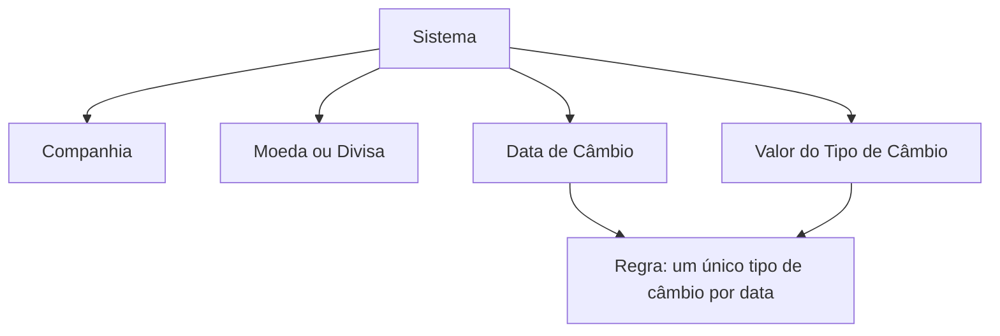

# Relatório de Ingestão de Documento para RAG

**Arquivo de origem:** `01-TRON_01-Doc_01-Mod_01-Comunes_01-Def_01-Moneda_DEFINIR-Tipo-de-Cambio.pdf`
**Data de processamento:** 21/09/2026 03:48:45
**Modelo de interpretação:** gpt-5.6-terra (axet-code)
**Prompt utilizado:** [analise_documento_rag.md](file:///Users/gcostabe/dev/AGENTE-CONTEXT-GEN/prompts/analise_documento_rag.md)

---

# Definição de Tipos de Câmbio de Divisas do Sistema

## 1. Metadados do Documento
- **Arquivo de Origem:** Não identificado
- **Tipo de Documento:** Especificação Funcional
- **Domínio / Sistema:** Tipos de câmbio, moedas e divisas do Sistema
- **Público-Alvo:** Analistas funcionais, operação e desenvolvimento
- **Data/Versão Identificada:** Não identificada

---

## 2. Resumo Executivo & Contexto de Negócio

O documento descreve a definição de tipos de câmbio para divisas no Sistema. A funcionalidade associa uma definição de câmbio a uma companhia e a uma moeda ou divisa específica.

A configuração possui propriedades gerais, que identificam a companhia e a moeda envolvidas, e propriedades operativas, que registram a data de câmbio e o valor do tipo de câmbio aplicável nessa data.

A regra operacional central estabelece que o Sistema permite a captura de apenas um único tipo de câmbio para uma data determinada. Essa restrição impede o registro simultâneo de múltiplos valores de câmbio para a mesma referência de data.

O documento recomenda a leitura complementar do documento funcional “Definición de Monedas”, pois a interpretação isolada da especificação de tipos de câmbio pode conduzir a erro.

---

## 3. Arquitetura, Componentes & Tecnologias Envolvidas

O conteúdo não descreve arquitetura de software, integrações, tecnologias, APIs, ambientes, servidores ou microsserviços. O documento apresenta exclusivamente a estrutura funcional da definição de tipos de câmbio no Sistema.



> **Nota de Análise:** O documento não detalha persistência de dados, telas, métodos HTTP, contratos JSON, integrações externas ou critérios técnicos de cálculo do câmbio.

---

## 4. Regras de Negócio, Especificações Funcionais & Processos

1. A definição de uma divisa deve indicar o código da companhia sobre a qual a definição está sendo realizada.
2. A definição de uma divisa deve indicar o código da moeda ou divisa que está sendo configurada.
3. A data de câmbio indica a data na qual o Sistema obtém o câmbio médio de compra e venda da divisa.
4. O valor do tipo de câmbio representa o importe do tipo de câmbio da divisa para uma data específica.
5. O Sistema permite a captura de somente um tipo de câmbio para uma data determinada.
6. A leitura do documento “Definición de Monedas” é recomendada para evitar interpretações incorretas ou incompletas da tabela de tipos de câmbio.

---

## 5. Tabelas de Parâmetros, Ambientes e Estruturas de Dados

| Item / Parâmetro | Descrição / Função | Tipo / Valores / Formato | Ambiente / Observações |
| :--- | :--- | :--- | :--- |
| Companhia | Indica o código da companhia sobre a qual está sendo realizada a definição da divisa. | Código de companhia; formato não detalhado. | Propriedade geral. |
| Moeda | Indica o código da moeda ou divisa que está sendo definida. | Código de moeda ou divisa; formato não detalhado. | Propriedade geral. |
| Data de Câmbio | Indica a data na qual o Sistema obtém o câmbio médio de compra e venda da divisa. | Data; formato não detalhado. | Propriedade operativa. |
| Valor do Tipo de Câmbio | Indica o importe do tipo de câmbio da divisa para uma data específica. | Valor monetário; precisão e moeda de expressão não detalhadas. | Propriedade operativa. |
| Unicidade do tipo de câmbio | Restringe o cadastro a um único tipo de câmbio por data determinada. | Regra de validação funcional. | Não são detalhadas as chaves de unicidade nem mensagens de erro. |
| Documento relacionado | Documento recomendado para leitura complementar. | “Definición de Monedas”. | Necessário para interpretação contextual completa. |

---

## 6. Bateria de Perguntas & Respostas para RAG (FAQ Sintético)

### P1: Qual informação identifica a companhia na definição de uma divisa?
**R:** A propriedade **Companhia** informa ao Sistema o código da companhia sobre a qual está sendo realizada a definição da divisa.

### P2: Qual informação identifica a moeda configurada no tipo de câmbio?
**R:** A propriedade **Moeda** informa o código da moeda ou divisa que está sendo definida no Sistema.

### P3: O que representa a Data de Câmbio?
**R:** A **Data de Câmbio** indica a data em que o Sistema obtém o câmbio médio de compra e venda da divisa.

### P4: O que representa o Valor do Tipo de Câmbio?
**R:** O **Valor do Tipo de Câmbio** indica o importe do tipo de câmbio de uma divisa para uma data específica.

### P5: É permitido cadastrar mais de um tipo de câmbio para a mesma data?
**R:** Não. O Sistema somente permite a captura de um único tipo de câmbio para uma data determinada.

### P6: A regra de unicidade se aplica à moeda ou à data?
**R:** O texto afirma explicitamente que o Sistema permite somente um tipo de câmbio para uma data determinada. O documento não detalha se a validação também considera companhia, moeda ou outros atributos como parte da chave de unicidade.

### P7: O documento informa como o câmbio médio de compra e venda é calculado?
**R:** Não. O documento apenas afirma que a Data de Câmbio indica quando o Sistema obtém o câmbio médio de compra e venda da divisa; não detalha fórmula, origem dos dados ou processo de cálculo.

### P8: Existe documentação complementar recomendada para o cadastro de tipos de câmbio?
**R:** Sim. O documento recomenda a leitura de **“Definición de Monedas”**, pois a interpretação isolada da especificação de tipos de câmbio pode conduzir a erro.

### P9: O documento informa APIs ou contratos de integração para consulta de tipos de câmbio?
**R:** Não. Não há detalhamento de APIs, métodos HTTP, contratos JSON, integrações, servidores ou tecnologias.

### P10: Quais propriedades pertencem à definição funcional de tipos de câmbio?
**R:** As propriedades gerais são **Companhia** e **Moeda**. As propriedades operativas são **Data de Câmbio** e **Valor do Tipo de Câmbio**.

---

## 7. Glossário de Termos, Siglas & Conceitos-Chave

- **Companhia:** Código da companhia sobre a qual a definição da divisa é realizada.
- **Divisa:** Moeda definida e tratada pelo Sistema no contexto de tipos de câmbio.
- **Moeda:** Código da moeda ou divisa configurada.
- **Data de Câmbio:** Data em que o Sistema obtém o câmbio médio de compra e venda de uma divisa.
- **Tipo de Câmbio:** Valor associado a uma divisa para uma data específica.
- **Valor do Tipo de Câmbio:** Importe do tipo de câmbio de uma divisa em uma data determinada.

---

## 8. Notas Críticas, Riscos & Limitações

- O documento não identifica arquivo de origem, versão, data de publicação ou responsável funcional.
- O documento não detalha o formato dos códigos de companhia e moeda.
- O documento não especifica a origem do câmbio médio de compra e venda.
- O documento não apresenta regras de arredondamento, precisão decimal, vigência, fuso horário ou tratamento de feriados.
- O documento não esclarece se a unicidade do tipo de câmbio é validada apenas pela data ou pela combinação de companhia, moeda e data.
- O documento não descreve telas, permissões, mensagens de validação, APIs, persistência ou integrações.
- A interpretação completa depende da leitura complementar de “Definición de Monedas”.

---

## 9. Conteúdo Bruto Estruturado (Referência Fiel)

```text
--- [PÁGINA 1 DE 2] ---

DEFINICIÓN de Tipos de Cambio de las Divisas
del Sistema
Propiedades Generales
Compañía
Esta propiedad le indica al sistema el código de la compañía sobre la que se está realizando la
definición de la Divisa.
Moneda
Esta propiedad indica el código de la Moneda o Divisa que se está definiendo.
Propiedades Operativas
Fecha de Cambio
Este Atributo indica en el Sistema la fecha en la que se obtiene el cambio medio de compra y venta
de la Divisa.
Valor del Tipo de Cambio
Este Atributo indica en el Sistema el Importe del Tipo de cambio de la Divisa para una fecha
específica.
Vínculos
 /
 CF
Home Solutions APIs Documentation Zeus
EN


--- [PÁGINA 2 DE 2] ---

Relación de Directrices y Documentos funcionales cuya lectura recomendada para evitar que la
interpretación aislada del presente documento pueda conducir a error.
Definición de Monedas
Preguntas frecuentes
(1) ¿Existe alguna aclaración operativa que deba ser tomada en consideración en el uso y definición
de la tabla de Tipos de Cambio de las Divisas del Sistema?
El Sistema solamente permite la captura de un único tipo de cambio a una fecha determinada.
```

---

## Conteúdo Bruto Extraído (Original Completo)

```text
--- [PÁGINA 1 DE 2] ---

DEFINICIÓN de Tipos de Cambio de las Divisas
del Sistema
Propiedades Generales
Compañía
Esta propiedad le indica al sistema el código de la compañía sobre la que se está realizando la
definición de la Divisa.
Moneda
Esta propiedad indica el código de la Moneda o Divisa que se está definiendo.
Propiedades Operativas
Fecha de Cambio
Este Atributo indica en el Sistema la fecha en la que se obtiene el cambio medio de compra y venta
de la Divisa.
Valor del Tipo de Cambio
Este Atributo indica en el Sistema el Importe del Tipo de cambio de la Divisa para una fecha
específica.
Vínculos
 / 
 CF
Home Solutions APIs Documentation Zeus
EN


--- [PÁGINA 2 DE 2] ---

Relación de Directrices y Documentos funcionales cuya lectura recomendada para evitar que la
interpretación aislada del presente documento pueda conducir a error.
Definición de Monedas
Preguntas frecuentes
(1) ¿Existe alguna aclaración operativa que deba ser tomada en consideración en el uso y definición
de la tabla de Tipos de Cambio de las Divisas del Sistema?
El Sistema solamente permite la captura de un único tipo de cambio a una fecha determinada.
```
