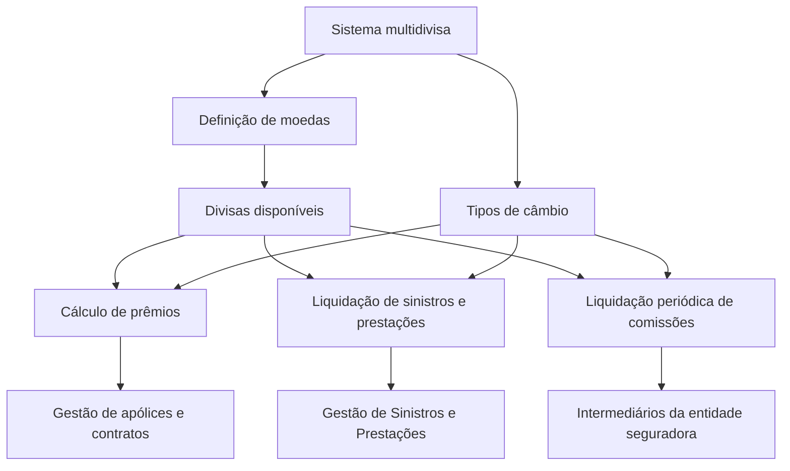

# Relatório de Ingestão de Documento para RAG

**Arquivo de origem:** `01-TRON_01-Doc_01-Mod_01-Comunes_01-Def_01-Moneda_Def-Moneda.pdf`
**Data de processamento:** 21/09/2026 03:48:00
**Modelo de interpretação:** gpt-5.6-terra (axet-code)
**Prompt utilizado:** [analise_documento_rag.md](file:///Users/gcostabe/dev/AGENTE-CONTEXT-GEN/prompts/analise_documento_rag.md)

---

# Definição de Moedas em Sistema Multidivisa

## 1. Metadados do Documento
- **Arquivo de Origem:** Não identificado
- **Tipo de Documento:** Especificação Técnica
- **Domínio / Sistema:** Sistema multidivisa — gestão de apólices, contratos, sinistros, prestações e comissões
- **Público-Alvo:** Negócio, desenvolvedores e operação
- **Data/Versão Identificada:** Não identificada

---

## 2. Resumo Executivo & Contexto de Negócio

O documento descreve a necessidade de definição de moedas em um sistema multidivisa. O sistema permite codificar relações entre divisas para suportar operações corporativas que envolvem diferentes moedas.

As relações entre divisas são utilizadas, entre outros exemplos, no cálculo de prêmios durante a gestão de apólices e contratos. O documento também relaciona a funcionalidade ao pagamento de liquidações de expedientes de sinistros no processo de Gestão de Sinistros e Prestações.

Outro uso identificado é a liquidação periódica de comissões destinadas aos intermediários da entidade seguradora. Para permitir essas operações, o sistema deve definir quais divisas estarão disponíveis e quais tipos de câmbio serão aplicáveis.

O conteúdo apresenta os tópicos “Moedas do Sistema”, “Definição de Moedas” e “Tipos de Câmbio”, sem detalhar campos, regras de cálculo, interfaces, contratos de API ou procedimentos operacionais.

---

## 3. Arquitetura, Componentes & Tecnologias Envolvidas

Os elementos funcionais explicitamente citados são:

| Componente / Processo | Função identificada |
| :--- | :--- |
| Sistema multidivisa | Permite codificar a relação entre divisas. |
| Moedas do Sistema | Tópico listado no documento; sem detalhamento adicional. |
| Definição de Moedas | Tópico listado para determinar quais divisas serão utilizadas. |
| Tipos de Câmbio | Necessários para operar a relação entre as divisas definidas. |
| Gestão de apólices e contratos | Processo que pode utilizar relações entre divisas para cálculos de prêmios. |
| Gestão de Sinistros e Prestações | Processo que pode utilizar relações entre divisas para pagamentos de liquidações. |
| Liquidação periódica de comissões | Processo destinado a intermediários da entidade seguradora. |
| Home Solutions APIs Documentation Zeus | Texto de navegação ou identificação exibido no conteúdo; função não detalhada. |



> **Nota de Análise:** O documento não especifica tecnologias de implementação, bancos de dados, métodos HTTP, contratos JSON, ambientes, URLs operacionais ou serviços responsáveis pela manutenção de moedas e tipos de câmbio.

---

## 4. Regras de Negócio, Especificações Funcionais & Processos

1. O sistema possui característica multidivisa.
2. O sistema deve permitir a codificação da relação entre divisas.
3. As relações entre divisas podem ser utilizadas no cálculo de prêmios do processo de gestão de apólices e contratos.
4. As relações entre divisas podem ser utilizadas no pagamento das liquidações de expedientes de sinistros.
5. O pagamento de liquidações está associado ao Processo de Gestão de Sinistros e Prestações.
6. As relações entre divisas podem ser utilizadas na liquidação periódica de comissões.
7. As comissões periódicas são direcionadas aos intermediários da entidade seguradora.
8. Devem ser definidas as divisas que serão utilizadas pelo sistema.
9. Devem ser definidos os tipos de câmbio aplicáveis às divisas.

> **Nota de Análise:** O documento não apresenta critérios de validação, fórmula de conversão, periodicidade exata dos tipos de câmbio, fonte de cotação, regras de arredondamento, moeda base, política de vigência ou tratamento de exceções.

---

## 5. Tabelas de Parâmetros, Ambientes e Estruturas de Dados

| Item / Parâmetro | Descrição / Função | Tipo / Valores / Formato | Ambiente / Observações |
| :--- | :--- | :--- | :--- |
| Divisas | Moedas que podem ser utilizadas nas operações do sistema. | Não especificado | Devem ser definidas. |
| Relação entre divisas | Codificação de relacionamento entre moedas para operações multidivisa. | Não especificado | Utilizada em cálculos e liquidações. |
| Tipos de câmbio | Elementos necessários para operar entre divisas. | Não especificado | Devem ser definidos; não há fórmula ou fonte de cotação descrita. |
| Cálculo de prêmios | Exemplo de operação que pode utilizar relações entre divisas. | Processo de gestão de apólices e contratos | Sem regras de cálculo detalhadas. |
| Liquidação de sinistros | Exemplo de operação que pode utilizar relações entre divisas. | Processo de Gestão de Sinistros e Prestações | Sem critérios de conversão detalhados. |
| Liquidação de comissões | Liquidação periódica destinada aos intermediários da entidade seguradora. | Processo periódico | Periodicidade não especificada. |
| Home Solutions APIs Documentation Zeus | Texto exibido no conteúdo bruto. | Não especificado | Não há detalhes técnicos sobre APIs ou Zeus. |
| CF | Texto exibido no conteúdo bruto. | Não especificado | Significado não definido no documento. |
| EN | Texto exibido no conteúdo bruto. | Não especificado | Pode representar um elemento de idioma ou navegação, mas o documento não confirma essa interpretação. |

---

## 6. Bateria de Perguntas & Respostas para RAG (FAQ Sintético)

### P1: Qual é o objetivo da definição de moedas no sistema?
**R:** O objetivo é definir quais divisas poderão ser utilizadas pelo sistema multidivisa e definir os tipos de câmbio necessários para operar relações entre essas divisas.

### P2: Para quais processos corporativos as relações entre divisas podem ser utilizadas?
**R:** As relações entre divisas podem ser utilizadas no cálculo de prêmios da gestão de apólices e contratos, no pagamento de liquidações de expedientes de sinistros e na liquidação periódica de comissões para intermediários da entidade seguradora.

### P3: Como a funcionalidade multidivisa apoia a gestão de apólices e contratos?
**R:** O documento informa que as relações entre divisas podem ser usadas para efetuar cálculos de prêmios no processo de gestão de apólices e contratos. Não são detalhadas fórmulas, moedas-base ou regras de arredondamento.

### P4: Qual processo utiliza moedas para liquidações de sinistros?
**R:** O documento associa o pagamento das liquidações dos expedientes de sinistros ao Processo de Gestão de Sinistros e Prestações.

### P5: Quem recebe as comissões mencionadas no documento?
**R:** As comissões periódicas são liquidadas para os intermediários da entidade seguradora.

### P6: O documento define quais moedas são suportadas?
**R:** Não. O documento afirma que é necessário definir quais serão as divisas, mas não lista códigos, nomes ou moedas específicas.

### P7: O documento especifica os tipos de câmbio disponíveis?
**R:** Não. O documento indica que os tipos de câmbio devem ser definidos, mas não apresenta categorias, valores, periodicidade, origem da cotação ou regras de vigência.

### P8: Existem APIs ou contratos técnicos documentados para a manutenção de moedas?
**R:** Não. Embora o conteúdo apresente o texto “Home Solutions APIs Documentation Zeus”, não há métodos HTTP, endpoints, contratos JSON, autenticação ou regras de integração descritos.

### P9: O documento informa como deve ser calculada a conversão entre duas moedas?
**R:** Não. O conteúdo apenas estabelece a necessidade de definir relações entre divisas e tipos de câmbio; não há fórmula de conversão ou regra de cálculo apresentada.

### P10: Qual é a principal dependência funcional para suportar operações multidivisa?
**R:** A principal dependência funcional descrita é a definição das divisas que serão utilizadas e dos respectivos tipos de câmbio.

---

## 7. Glossário de Termos, Siglas & Conceitos-Chave

- **Divisa:** Moeda utilizada em relações de conversão e operações do sistema multidivisa.
- **Sistema multidivisa:** Sistema que permite codificar relações entre diferentes divisas.
- **Tipo de câmbio:** Elemento que deve ser definido para operar relações entre divisas.
- **Prêmio:** Elemento calculado no processo de gestão de apólices e contratos, citado como possível uso das relações entre divisas.
- **Expediente de sinistro:** Item relacionado ao pagamento de liquidações no Processo de Gestão de Sinistros e Prestações.
- **Intermediário:** Destinatário das liquidações periódicas de comissões da entidade seguradora.
- **APIs:** Termo exibido no texto “Home Solutions APIs Documentation Zeus”; o documento não define seu significado ou contrato técnico.
- **CF:** Sigla exibida no conteúdo bruto sem definição.
- **EN:** Sigla exibida no conteúdo bruto sem definição.
- **Zeus:** Identificador exibido em “Home Solutions APIs Documentation Zeus”; função não detalhada.

---

## 8. Notas Críticas, Riscos & Limitações

- O documento não identifica o arquivo de origem, data, versão, autor ou responsável pela manutenção das regras de moedas.
- Não há lista de moedas, códigos monetários, moeda base, relações permitidas ou restrições de combinação entre divisas.
- Não são informadas fórmulas de conversão, regras de arredondamento, vigência, data de cotação, periodicidade de atualização ou fonte dos tipos de câmbio.
- Não há definição de permissões, perfis responsáveis, trilha de auditoria ou processo operacional para manutenção de moedas e tipos de câmbio.
- O conteúdo não detalha APIs, interfaces, campos de dados, contratos de integração, logs, ambientes ou tratamento de falhas.
- Os tópicos “Monedas del Sistema”, “Definición de Monedas” e “Tipos de Cambio” são apresentados sem detalhamento adicional.

---

## 9. Conteúdo Bruto Estruturado (Referência Fiel)

```text
--- [PÁGINA 1 DE 1] ---

DEFINICIÓN de las MONEDAS
Contexto
El sistema por ser multidivisa, permite codificar la relación de Divisas en los que se podrán efectuar,
por ejemplo, los cálculos de las primas en el proceso de gestión de pólizas y contratos, el pago de las
liquidaciones de los expedientes de Siniestros en el Proceso de Gestión de Siniestros y
Prestaciones, la liquidación de comisiones periódica que se ha de realizar a los intermediarios de la
entidad aseguradora ...
Para ello se deben definir cuales van a ser éstas divisas y los tipos de cambio de las mismas.
Monedas del Sistema
Definición de Monedas
Tipos de Cambio
Tipos de Cambio
 / 
 CF
Home Solutions APIs Documentation Zeus
EN
```

---

## Conteúdo Bruto Extraído (Original Completo)

```text
--- [PÁGINA 1 DE 1] ---

DEFINICIÓN de las MONEDAS
Contexto
El sistema por ser multidivisa, permite codificar la relación de Divisas en los que se podrán efectuar,
por ejemplo, los cálculos de las primas en el proceso de gestión de pólizas y contratos, el pago de las
liquidaciones de los expedientes de Siniestros en el Proceso de Gestión de Siniestros y
Prestaciones, la liquidación de comisiones periódica que se ha de realizar a los intermediarios de la
entidad aseguradora ...
Para ello se deben definir cuales van a ser éstas divisas y los tipos de cambio de las mismas.
Monedas del Sistema
Definición de Monedas
Tipos de Cambio
Tipos de Cambio
 / 
 CF
Home Solutions APIs Documentation Zeus
EN
```
