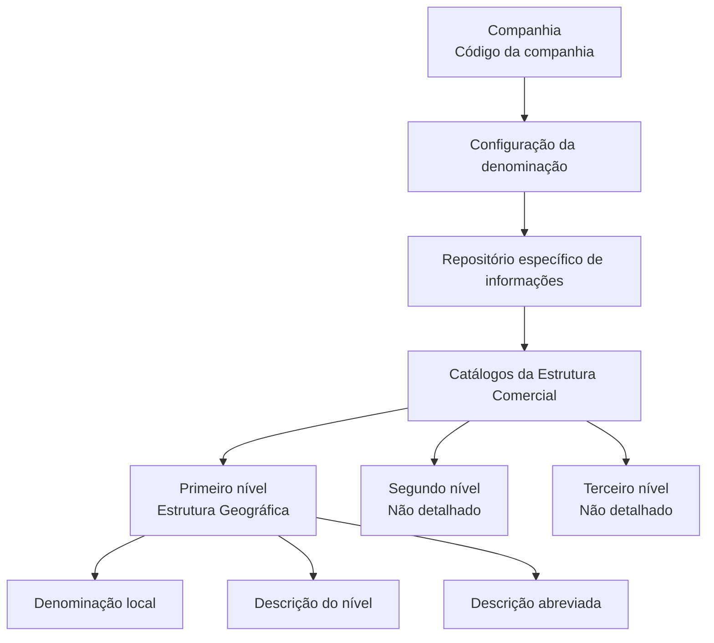

# Relatório de Ingestão de Documento para RAG

**Arquivo de origem:** `01-TRON_01-Doc_01-Mod_01-Comunes_01-Def_02-Estructura-Comercial_DEFINIR-Denominacion-Nivel-Estructura-Comercial.pdf`
**Data de processamento:** 21/09/2026 09:01:51
**Modelo de interpretação:** gpt-5.6-terra (axet-code)
**Prompt utilizado:** [analise_documento_rag.md](file:///Users/gcostabe/dev/AGENTE-CONTEXT-GEN/prompts/analise_documento_rag.md)

---

# Denominações dos Níveis da Estrutura Comercial — Propriedades Gerais

## 1. Metadados do Documento
- **Arquivo de Origem:** Não identificado
- **Tipo de Documento:** Especificação Funcional
- **Domínio / Sistema:** Estrutura Comercial / Estrutura Geográfica
- **Público-Alvo:** Analistas funcionais, equipes de configuração e operação
- **Data/Versão Identificada:** Não identificada

---

## 2. Resumo Executivo & Contexto de Negócio

O conteúdo descreve a funcionalidade de definição das denominações dos níveis pertencentes à Estrutura Comercial de uma entidade. O sistema permite adaptar os nomes dos três níveis mantidos nos catálogos de estrutura comercial às nomenclaturas e costumes locais.

As denominações são mantidas em um repositório específico de informação. O documento informa que esse repositório é inicialmente entregue vazio nas instalações, exigindo configuração conforme a realidade organizacional da companhia.

A configuração é associada a uma companhia por meio de seu código. Para cada nível da estrutura, existem atributos para denominação local, descrição e descrição abreviada.

O material também referencia o documento funcional “Estructura Comercial” como leitura recomendada. O texto disponível não apresenta detalhamento de telas, regras de persistência, permissões, contratos de integração ou comportamento para os segundo e terceiro níveis.

---

## 3. Arquitetura, Componentes & Tecnologias Envolvidas

O texto cita os seguintes elementos funcionais:

- Sistema com núcleo funcional de configuração.
- Catálogos que contêm a Estrutura Comercial.
- Repositório específico de informações para denominações.
- Companhia, identificada por código.
- Três níveis da Estrutura Comercial.
- Primeiro nível da estrutura geográfica, citado na descrição dos atributos disponíveis.



> **Nota de Análise:** O documento descreve componentes funcionais, mas não identifica tecnologias, APIs, bancos de dados, ambientes, URLs, servidores ou protocolos de integração.

---

## 4. Regras de Negócio, Especificações Funcionais & Processos

1. O núcleo do sistema contempla uma funcionalidade para denominar os três níveis dos catálogos que compõem a Estrutura Comercial.
2. As denominações podem ser configuradas de acordo com nomes e costumes locais.
3. As informações de denominação são armazenadas em um repositório específico.
4. O repositório é inicialmente fornecido vazio nas instalações.
5. A propriedade **Compañía** informa o código da companhia para a qual a configuração de denominação do nível da estrutura comercial está sendo realizada.
6. O atributo **Clave del Nivel de la Estructura** contém a denominação local que identificará o primeiro nível da estrutura geográfica.
7. O atributo **Descripción del Nivel de la Estructura** contém a denominação local que identificará o primeiro nível da estrutura geográfica.
8. O atributo **Descripción Abreviada del Nivel de la Estructura** contém a abreviatura da denominação local que identificará o primeiro nível da estrutura geográfica.
9. A leitura do documento funcional **Estructura Comercial** é recomendada para evitar interpretações incorretas decorrentes da análise isolada deste conteúdo.

> **Nota de Análise:** O trecho fornecido não especifica as diferenças funcionais entre “Clave del Nivel de la Estructura” e “Descripción del Nivel de la Estructura”, embora ambos sejam descritos como denominação local do primeiro nível geográfico.

---

## 5. Tabelas de Parâmetros, Ambientes e Estruturas de Dados

| Item / Parâmetro | Descrição / Função | Tipo / Valores / Formato | Ambiente / Observações |
| :--- | :--- | :--- | :--- |
| Companhia | Indica o código da companhia sobre a qual é realizada a configuração da denominação do nível da estrutura comercial. | Código da companhia; formato não informado. | Aplicável à configuração por companhia. |
| Chave do Nível da Estrutura | Contém a denominação local para identificação do primeiro nível da estrutura geográfica. | Texto; formato não informado. | Primeiro nível geográfico. |
| Descrição do Nível da Estrutura | Contém a denominação local para identificação do primeiro nível da estrutura geográfica. | Texto; formato não informado. | Primeiro nível geográfico. |
| Descrição Abreviada do Nível da Estrutura | Contém a abreviatura da denominação local para identificação do primeiro nível da estrutura geográfica. | Texto abreviado; tamanho não informado. | Primeiro nível geográfico. |
| Repositório de informações | Armazena as denominações dos três níveis da Estrutura Comercial. | Repositório específico; tecnologia não informada. | Entregue inicialmente sem conteúdo. |
| Catálogos da Estrutura Comercial | Contêm os três níveis que podem receber denominações locais. | Estrutura funcional; formato não informado. | Relacionados à Estrutura Comercial da entidade. |
| Documento relacionado | “Estructura Comercial”, recomendado para leitura complementar. | Documento funcional. | Necessário para reduzir risco de interpretação isolada. |

---

## 6. Bateria de Perguntas & Respostas para RAG (FAQ Sintético)

### P1: Qual é o objetivo da funcionalidade de denominações da Estrutura Comercial?
**R:** A funcionalidade permite configurar, conforme nomes e costumes locais, as denominações dos três níveis existentes nos catálogos da Estrutura Comercial de uma entidade.

### P2: Onde são mantidas as denominações dos níveis da Estrutura Comercial?
**R:** As denominações são mantidas em um repositório específico de informações. O documento informa que esse repositório é entregue inicialmente vazio nas instalações.

### P3: Para que serve o atributo Companhia?
**R:** O atributo Companhia indica o código da companhia sobre a qual está sendo realizada a configuração da denominação de um nível da Estrutura Comercial.

### P4: O que representa a Chave do Nível da Estrutura?
**R:** A Chave do Nível da Estrutura contém a denominação local pela qual será identificado o primeiro nível da estrutura geográfica.

### P5: O que representa a Descrição do Nível da Estrutura?
**R:** A Descrição do Nível da Estrutura contém a denominação local pela qual será identificado o primeiro nível da estrutura geográfica, conforme a descrição fornecida no documento.

### P6: Para que serve a Descrição Abreviada do Nível da Estrutura?
**R:** A Descrição Abreviada do Nível da Estrutura contém a abreviatura da denominação local usada para identificar o primeiro nível da estrutura geográfica.

### P7: Quantos níveis da Estrutura Comercial podem receber denominações locais?
**R:** O documento informa que o sistema permite denominar os três níveis presentes nos catálogos que compõem a Estrutura Comercial.

### P8: O repositório de denominações já possui dados ao ser instalado?
**R:** Não. O documento informa que o repositório específico de informações é inicialmente entregue às instalações vazio de conteúdo.

### P9: O documento detalha como configurar o segundo e o terceiro nível da Estrutura Comercial?
**R:** Não. O trecho disponível menciona três níveis, mas somente descreve atributos associados ao primeiro nível da estrutura geográfica.

### P10: Existe documentação complementar recomendada?
**R:** Sim. O documento recomenda a leitura de “Estructura Comercial”, pois a interpretação isolada do conteúdo atual pode conduzir a erros.

---

## 7. Glossário de Termos, Siglas & Conceitos-Chave

- **Estrutura Comercial:** Estrutura organizada em três níveis, mantida em catálogos e passível de receber denominações locais.
- **Estrutura Geográfica:** Estrutura cujo primeiro nível é citado na definição dos atributos de denominação, descrição e abreviatura.
- **Companhia:** Entidade identificada por código para a qual a configuração das denominações é realizada.
- **Denominação local:** Nome utilizado para identificar um nível de estrutura conforme nomes e costumes locais.
- **Descrição abreviada:** Abreviatura da denominação local utilizada para identificar um nível da estrutura.
- **Repositório específico:** Local de armazenamento das informações de denominação dos níveis da Estrutura Comercial.
- **Catálogos:** Estruturas que contêm os níveis da Estrutura Comercial.

---

## 8. Notas Críticas, Riscos & Limitações

- O repositório de denominações é inicialmente vazio; a configuração é necessária para que nomenclaturas locais estejam disponíveis.
- O texto não detalha formatos, tamanhos máximos, obrigatoriedade, validações ou valores permitidos para os atributos.
- O texto não descreve fluxos de aprovação, perfis de acesso, trilhas de auditoria ou responsáveis pela manutenção.
- Não há especificação de tecnologia, banco de dados, interface, serviços, endpoints, ambientes ou integração.
- Existe potencial ambiguidade entre os atributos “Chave do Nível da Estrutura” e “Descrição do Nível da Estrutura”, pois ambos possuem a mesma descrição no conteúdo disponível.
- O documento recomenda consulta complementar ao material “Estructura Comercial”; analisar este trecho isoladamente pode gerar interpretação incorreta.

---

## 9. Conteúdo Bruto Estruturado (Referência Fiel)

```text
--- [PÁGINA 1 DE 2] ---

DEFINICIÓN de las Denominaciones de los
Niveles de la Estructura Comercial
Propiedades Generales
Funcionalmente, el núcleo del Sistema contempla la facilidad de poder denominar (de acuerdo con
los nombres y costumbres locales) las denominaciones de los Tres Niveles en los Catálogos que
contienen la Estructura Comercial de la entidad, en un repositorio de información específico que se
entrega inicialmente a las instalaciones vacío de contenido.
Compañía.
Esta propiedad le indica al sistema el código de la compañía sobre la que se está realizando la
configuración de la Denominación del Nivel de la estructura comercial.
Clave del Nivel de la Estructura
Este atributo contiene la denominación local por la cual será identificada el Primer Nivel de la
estructura Geográfica.
Descripción del Nivel de la Estructura
Este atributo contiene la denominación local por la cual será identificada el Primer Nivel de la
estructura Geográfica.
Descripción Abreviada del Nivel de la Estructura
 / 
 CF
Home Solutions APIs Documentation Zeus
EN

--- [PÁGINA 2 DE 2] ---

Este atributo contiene la abreviatura de la denominación local por la cual será identificada el Primer
Nivel de la estructura Geográfica.
Vínculos
Relación de Directrices y Documentos funcionales cuya lectura recomendada para evitar que la
interpretación aislada del presente documento pueda conducir a error.
Estructura Comercial
Preguntas frecuentes
Ejemplo:
```

---

## Conteúdo Bruto Extraído (Original Completo)

```text
--- [PÁGINA 1 DE 2] ---

DEFINICIÓN de las Denominaciones de los
Niveles de la Estructura Comercial
Propiedades Generales
Funcionalmente, el núcleo del Sistema contempla la facilidad de poder denominar (de acuerdo con
los nombres y costumbres locales) las denominaciones de los Tres Niveles en los Catálogos que
contienen la Estructura Comercial de la entidad, en un repositorio de información específico que se
entrega inicialmente a las instalaciones vacío de contenido.
Compañía.
Esta propiedad le indica al sistema el código de la compañía sobre la que se está realizando la
configuración de la Denominación del Nivel de la estructura comercial.
Clave del Nivel de la Estructura
Este atributo contiene la denominación local por la cual será identificada el Primer Nivel de la
estructura Geográfica.
Descripción del Nivel de la Estructura
Este atributo contiene la denominación local por la cual será identificada el Primer Nivel de la
estructura Geográfica.
Descripción Abreviada del Nivel de la Estructura
 / 
 CF
Home Solutions APIs Documentation Zeus
EN


--- [PÁGINA 2 DE 2] ---

Este atributo contiene la abreviatura de la denominación local por la cual será identificada el Primer
Nivel de la estructura Geográfica.
Vínculos
Relación de Directrices y Documentos funcionales cuya lectura recomendada para evitar que la
interpretación aislada del presente documento pueda conducir a error.
Estructura Comercial
Preguntas frecuentes
Ejemplo:
```
