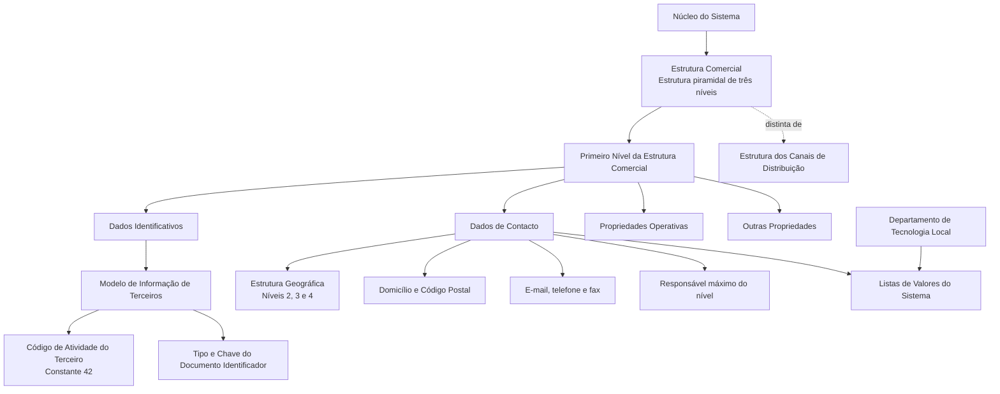

# Definição do Primeiro Nível da Estrutura Comercial

## 1. Metadados do Documento
- **Arquivo de Origem:** Não identificado no conteúdo extraído
- **Tipo de Documento:** Especificação Funcional
- **Domínio / Sistema:** Estrutura Comercial da entidade MAPFRE; núcleo do Sistema; Modelo de Informação de Terceiros
- **Público-Alvo:** Analistas funcionais, equipes de configuração, Tecnologia Local, desenvolvedores e operação
- **Data/Versão Identificada:** Não identificada

---

## 2. Resumo Executivo & Contexto de Negócio

O documento define os atributos e características do **Primeiro Nível da Estrutura Comercial** da entidade MAPFRE no núcleo do Sistema. A Estrutura Comercial é apresentada como uma estrutura piramidal de três níveis, com repositórios de informação específicos inicialmente entregues sem conteúdo nas instalações.

O objetivo funcional é permitir a identificação, configuração e manutenção do primeiro nível dessa estrutura comercial. A especificação organiza os dados em quatro grupos: **Dados Identificativos**, **Dados de Contacto**, **Propriedades Operativas** e **Outras Propriedades**.

A identificação do Primeiro Nível da Estrutura Comercial está integrada ao Novo Modelo de Informação de Terceiros. Nesse modelo, os níveis da estrutura comercial possuem uma chave de atividade específica e devem ser identificados por tipo de documento identificador e chave associada. A atividade do primeiro nível possui a constante obrigatória `42`, que não pode ser modificada.

A configuração também contempla localização geográfica, endereço, meios de contacto corporativos, responsável máximo do nível, observações e propriedades operacionais de inabilitação e emissão. Parte da configuração, especialmente os valores de tipo de domicílio, requer adequação local por meio dos catálogos de Listas de Valores do Sistema.

O documento diferencia a Estrutura Comercial da Estrutura dos Canais de Distribuição. A primeira está associada à organização comercial e à combinação de fatores de produção para maximizar a criação de valor da entidade; a segunda atende a uma necessidade corporativa específica de obtenção do Margem de Contribuição por Cliente Distribuidor.

---

## 3. Arquitetura, Componentes & Tecnologias Envolvidas

Os componentes e conceitos funcionais explicitamente citados são:

- **Núcleo do Sistema:** Disponibiliza a capacidade de codificar a Estrutura Comercial da entidade MAPFRE.
- **Estrutura Comercial:** Estrutura piramidal de três níveis.
- **Primeiro Nível da Estrutura Comercial:** Entidade funcional detalhada pelo documento.
- **Modelo de Informação de Terceiros:** Modelo no qual os níveis da Estrutura Comercial são identificados com chave de atividade, tipo de documento identificador e chave associada.
- **Atividade de Terceiros:** Referência funcional associada ao código de atividade `42` para o Primeiro Nível da Estrutura Comercial.
- **Documentos Identificadores:** Referência funcional para identificação dos níveis da estrutura comercial.
- **Estrutura Geográfica:** Fonte das chaves geográficas de segundo, terceiro e quarto níveis.
- **Listas de Valores:** Catálogos do Sistema que devem conter valores locais para atributos como Tipo de Domicílio.
- **Departamento de Tecnologia Local:** Responsável por identificar nos catálogos do Sistema os valores de uso local para o Tipo de Domicílio.
- **Estrutura dos Canais de Distribuição:** Estrutura distinta da Estrutura Comercial, voltada à obtenção do Margem de Contribuição por Cliente Distribuidor.
- **Organização Comercial:** Configuração associada à combinação de capital, trabalho, recursos e tecnologia em atividades de criação de valor.



**Nota de Análise:** O documento descreve entidades funcionais, atributos e dependências de configuração, mas não detalha arquitetura técnica de aplicações, APIs, métodos HTTP, contratos JSON, bases de dados, servidores, URLs, portas, tecnologias de implementação ou fluxos de integração entre microsserviços.

---

## 4. Regras de Negócio, Especificações Funcionais & Processos

### 4.1 Estrutura Comercial

1. O núcleo do Sistema permite codificar a Estrutura Comercial da entidade MAPFRE.
2. A Estrutura Comercial possui uma estrutura piramidal de três níveis.
3. Os repositórios específicos de informação são inicialmente entregues às instalações sem conteúdo.
4. O documento trata exclusivamente dos atributos e características do Primeiro Nível da Estrutura Comercial.

### 4.2 Identificação do Primeiro Nível

1. O atributo **Compañía** contém o código da companhia sobre a qual está sendo realizada a definição do Primeiro Nível da Estrutura Comercial.
2. O atributo **Código de Actividad del Tercero** indica o código da atividade de terceiro associada ao Primeiro Nível da Estrutura Comercial.
3. No Novo Modelo de Informação de Terceiros, os níveis da estrutura são identificados no Sistema por uma chave de atividade específica.
4. O valor do Código de Atividade do Terceiro é a constante `42`.
5. A constante `42` corresponde a uma das atividades pertencentes ao núcleo.
6. O valor `42` não pode ser modificado.
7. Os níveis da Estrutura Comercial devem ser identificados no Sistema por um tipo de documento identificador e uma chave associada, de forma coerente com a informação de outras Pessoas Físicas ou Jurídicas.
8. O Tipo de Documento Identificador possui valor `THP` quando não houver documentos identificadores próprios associados.
9. Caso a atividade `42` não possua qualquer tipo de documento identificador associado, o Sistema atribui ao atributo Tipo de Documento Identificador o valor definido na configuração dos parâmetros da instalação.
10. A Chave do Primeiro Nível contém o código pelo qual o Primeiro Nível da Estrutura Comercial será identificado no Sistema.
11. A Denominação do Primeiro Nível contém o nome pelo qual o Primeiro Nível é identificado no Sistema.
12. A Abreviatura do Primeiro Nível contém o nome abreviado que pode identificar o Primeiro Nível da Estrutura Comercial.

### 4.3 Localização Geográfica e Domicílio

1. O Segundo Nível da Estrutura Geográfica contém a chave do segundo nível geográfico onde está localizado o Primeiro Nível da Estrutura Comercial.
2. O Terceiro Nível da Estrutura Geográfica contém a chave do terceiro nível geográfico onde está localizado o Primeiro Nível da Estrutura Comercial.
3. O Quarto Nível da Estrutura Geográfica contém a chave do quarto nível geográfico onde está localizado o Primeiro Nível da Estrutura Comercial.
4. O Nome do Quarto Nível da Estrutura Geográfica contém informação correspondente ao quarto nível geográfico.
5. Como nem todos os países possuem o mesmo nível de detalhe geográfico, o Nome do Quarto Nível pode conter informação complementar.
6. O Tipo de Domicílio deve conter a tipologia do domicílio do Primeiro Nível da Estrutura Comercial de acordo com a configuração, uso e exploração local pretendidos.
7. O documento apresenta como exemplos de Tipo de Domicílio: Calle, Avenida, Cerrada, Carretera e Paseo.
8. O Departamento de Tecnologia Local deve identificar os valores locais de Tipo de Domicílio nos catálogos do Sistema que representam as Listas de Valores.
9. Os valores predefinidos pelo núcleo podem não corresponder aos valores mais usuais no país.
10. Os valores de Tipo de Domicílio possuem utilização transversal na aplicação; não são exclusivos da configuração do Primeiro Nível da Estrutura Comercial.
11. Os atributos de Domicílio contêm o detalhe do endereço do Primeiro Nível de acordo com a localização geográfica e a tipologia de domicílio capturadas.
12. O Código Postal contém a chave do código postal onde está localizado o domicílio do Primeiro Nível.
13. O Apartado Postal contém a chave da caixa postal associada ao Primeiro Nível, normalmente localizada em uma agência de correios, permitindo o recebimento de correspondência e pacotes sem informar o endereço físico concreto.

### 4.4 Contactos e Responsável

1. A Direção de Correio Eletrónico contém o endereço de e-mail corporativo do Primeiro Nível da Estrutura Comercial.
2. Nome e Apelidos do Responsável do Nível contêm o nome e os sobrenomes do responsável máximo pelo nível definido da Estrutura Comercial.
3. O Prefixo Telefónico do País contém o prefixo telefónico nacional associado ao número corporativo do nível.
4. O documento apresenta os exemplos `+34` para Espanha, `+52` para México e `+54` para Argentina.
5. O Prefixo Zonal Telefónico contém o prefixo zonal associado ao número corporativo do nível.
6. O documento apresenta como exemplos o prefixo `91` para Madrid, `93` para Barcelona, `81` para Monterrey, Nuevo León, e `55` para Ciudad de México.
7. O Número Fax contém o número telefónico do fax corporativo do nível.
8. O Número Telefónico contém o número telefónico correspondente ao telefone corporativo do nível.

### 4.5 Propriedades Operativas e Outras Propriedades

1. O atributo Observações pode conter informação adicional ou complementar considerada pertinente na configuração do Primeiro Nível da Estrutura Comercial.
2. A propriedade Inhabilitación informa ao Sistema que a chave do Primeiro Nível está inabilitada para utilização na captura e/ou modificação dos níveis da Estrutura Comercial.
3. A propriedade Emisión estabelece se o código representa um Código Real ou um Nível Genérico.
4. Somente pode existir um único registro com a propriedade Emisión sem ativação.
5. A propriedade Emisión é de uso interno, criada pelo núcleo e destinada ao núcleo da Aplicação.

### 4.6 Relação com Estrutura dos Canais de Distribuição

1. Os usos da Estrutura Comercial e da Estrutura dos Canais de Distribuição não possuem a mesma finalidade funcional.
2. A configuração da Estrutura dos Canais de Distribuição atende à necessidade corporativa de obter o Margem de Contribuição por Cliente Distribuidor.
3. A configuração da Organização Comercial atende a funções que combinam fatores de produção, incluindo capital, trabalho, recursos e tecnologia.
4. A finalidade da Organização Comercial é maximizar o processo de criação de valor da entidade.

---

## 5. Tabelas de Parâmetros, Ambientes e Estruturas de Dados

| Item / Parâmetro | Descrição / Função | Tipo / Valores / Formato | Ambiente / Observações |
| :--- | :--- | :--- | :--- |
| Compañía | Código da companhia sobre a qual se realiza a definição do Primeiro Nível da Estrutura Comercial | Código da companhia | Não detalhado |
| Código de Actividad del Tercero | Identifica a atividade de terceiro associada ao Primeiro Nível da Estrutura Comercial | Constante `42` | Valor pertencente ao núcleo; não pode ser modificado |
| Tipo Documento Identificador | Tipo de documento utilizado para identificar os níveis da Estrutura Comercial | `THP` quando não houver documentos identificadores próprios associados | Se a atividade `42` não tiver documento identificador associado, o Sistema usa o valor configurado nos parâmetros da instalação |
| Clave del Documento Identificador | Código relacionado ao documento identificador | Código do Tipo de Documento Identificador, conforme texto extraído | O texto descreve o atributo como contendo o código do Tipo de Documento Identificador |
| Clave del Primer Nivel | Código identificador do Primeiro Nível da Estrutura Comercial | Código | Utilizado para identificar o Primeiro Nível no Sistema |
| Denominación del Primer Nivel | Nome identificador do Primeiro Nível | Nome | Utilizado no Sistema |
| Abreviatura del Primer Nivel | Nome abreviado para identificação do Primeiro Nível | Texto abreviado | Não detalhado |
| Segundo Nivel de la Estructura Geográfica | Chave do segundo nível geográfico onde o Primeiro Nível está localizado | Chave geográfica | Não detalhado |
| Tercer Nivel de la Estructura Geográfica | Chave do terceiro nível geográfico onde o Primeiro Nível está localizado | Chave geográfica | Não detalhado |
| Cuarto Nivel de la Estructura Geográfica | Chave do quarto nível geográfico onde o Primeiro Nível está localizado | Chave geográfica | Não detalhado |
| Nombre del Cuarto Nivel de la Estructura Geográfica | Informação correspondente ao quarto nível geográfico | Texto | Pode conter informação complementar quando o país não possuir esse nível de detalhe |
| Tipo de Domicilio | Tipologia do endereço do Primeiro Nível | Exemplos: Calle, Avenida, Cerrada, Carretera, Paseo | Valores devem ser identificados pelo Departamento de Tecnologia Local nas Listas de Valores do Sistema |
| Domicilio | Detalhe do endereço do Primeiro Nível | Dados de endereço | Associado à localização geográfica e à tipologia de domicílio capturadas |
| Código Postal | Chave do código postal do domicílio do Primeiro Nível | Chave de código postal | Não detalhado |
| Apartado Postal | Chave de caixa postal associada ao Primeiro Nível | Chave de apartado postal | Normalmente localizada em uma agência de correios |
| Dirección Correo Electrónico | Endereço de e-mail corporativo do Primeiro Nível | E-mail corporativo | Não detalhado |
| Nombre y Apellidos Responsable del nivel | Nome e sobrenomes do responsável máximo pelo nível | Texto | Mantido no repositório de configuração |
| Prefijo Telefónico del País | Prefixo nacional do telefone corporativo | Exemplos: `+34`, `+52`, `+54` | Exemplos correspondem a Espanha, México e Argentina |
| Prefijo Zonal Telefónico | Prefixo zonal do telefone corporativo | Exemplos: `91`, `93`, `81`, `55` | Exemplos correspondem a Madrid, Barcelona, Monterrey e Ciudad de México |
| Número Fax | Número de fax corporativo do nível | Número telefónico | Não detalhado |
| Número Telefónico | Número de telefone corporativo do nível | Número telefónico | Não detalhado |
| Observaciones | Informação adicional ou complementar da configuração | Texto livre | Capturada quando considerada pertinente |
| Inhabilitación | Indica que a chave do Primeiro Nível não pode ser usada em captura e/ou modificação | Propriedade de estado | Afeta a utilização da chave nos níveis da Estrutura Comercial |
| Emisión | Define se o código é Código Real ou Nível Genérico | Propriedade interna | Somente um único registro pode existir com esta propriedade sem ativação |

### Referências Funcionais Relacionadas

| Item / Referência | Descrição / Função | Tipo / Valores / Formato | Ambiente / Observações |
| :--- | :--- | :--- | :--- |
| Actividades de Terceros | Documento funcional relacionado | Referência documental | Leitura recomendada |
| Documentos Identificadores | Documento funcional relacionado | Referência documental | Leitura recomendada |
| Estructura Geográfica | Documento funcional relacionado | Referência documental | Leitura recomendada |
| Preguntas frecuentes | Conteúdo de esclarecimentos operacionais | Referência documental | Leitura recomendada |

---

## 6. Bateria de Perguntas & Respostas para RAG (FAQ Sintético)

### P1: Qual é o objetivo do documento sobre o Primeiro Nível da Estrutura Comercial?
**R:** O documento tem como objetivo apresentar os atributos e as características do Primeiro Nível da Estrutura Comercial da entidade MAPFRE. A especificação organiza a configuração desse nível em Dados Identificativos, Dados de Contacto, Propriedades Operativas e Outras Propriedades.

### P2: Qual é o valor do Código de Atividade do Terceiro para o Primeiro Nível da Estrutura Comercial?
**R:** O Código de Atividade do Terceiro possui o valor constante `42`. Esse valor corresponde a uma atividade do núcleo do Sistema e não pode ser modificado.

### P3: Quando o Tipo de Documento Identificador do Primeiro Nível deve possuir o valor THP?
**R:** O Tipo de Documento Identificador deve possuir o valor `THP` quando o Primeiro Nível da Estrutura Comercial não tiver documentos identificadores próprios associados.

### P4: O que ocorre se a atividade 42 não tiver nenhum tipo de documento identificador associado?
**R:** Quando a atividade `42` não tiver um tipo de documento identificador associado, o Sistema atribui ao atributo Tipo de Documento Identificador o valor definido na configuração dos parâmetros da instalação.

### P5: Como o Primeiro Nível da Estrutura Comercial é identificado no Sistema?
**R:** O Primeiro Nível é identificado por sua Chave do Primeiro Nível, que contém o código de identificação no Sistema. Além disso, o Novo Modelo de Informação de Terceiros estabelece identificação por chave de atividade específica, tipo de documento identificador e chave associada.

### P6: Quais níveis da Estrutura Geográfica podem ser associados ao Primeiro Nível da Estrutura Comercial?
**R:** O documento prevê associação do Primeiro Nível às chaves do segundo, terceiro e quarto níveis da Estrutura Geográfica. O Nome do Quarto Nível pode também armazenar informação complementar quando determinado país não possuir esse nível de detalhe geográfico.

### P7: Quem deve configurar os valores de Tipo de Domicílio usados localmente?
**R:** O Departamento de Tecnologia Local deve identificar nos catálogos do Sistema, que representam as Listas de Valores, os valores de Tipo de Domicílio aplicáveis ao país. Essa configuração é necessária porque os valores predefinidos pelo núcleo podem não ser usuais localmente.

### P8: Quais exemplos de Tipo de Domicílio são apresentados no documento?
**R:** O documento apresenta como exemplos de Tipo de Domicílio: Calle, Avenida, Cerrada, Carretera e Paseo. Esses exemplos não esgotam os valores possíveis; os valores devem ser definidos nos catálogos do Sistema para uso local e transversal.

### P9: Quais dados de contacto corporativo podem ser armazenados para o Primeiro Nível?
**R:** Podem ser armazenados e-mail corporativo, nome e sobrenomes do responsável máximo, prefixo telefónico do país, prefixo zonal telefónico, número de fax corporativo e número telefónico corporativo.

### P10: Para que serve a propriedade Inhabilitación?
**R:** A propriedade Inhabilitación indica ao Sistema que a chave do Primeiro Nível da Estrutura Comercial está inabilitada para utilização na captura e/ou na modificação dos níveis da Estrutura Comercial.

### P11: O que a propriedade Emisión define?
**R:** A propriedade Emisión estabelece se o código do Primeiro Nível representa um Código Real ou um Nível Genérico. É uma propriedade de uso interno, criada pelo núcleo e destinada ao uso interno do núcleo da Aplicação.

### P12: Existe alguma restrição para registros com a propriedade Emisión?
**R:** Sim. O documento estabelece que somente pode existir um único registro com a propriedade Emisión sem ativação.

### P13: A Estrutura Comercial e a Estrutura dos Canais de Distribuição possuem a mesma finalidade?
**R:** Não. A Estrutura dos Canais de Distribuição atende à necessidade corporativa de obter o Margem de Contribuição por Cliente Distribuidor. A Organização Comercial atende a funções que combinam fatores de produção, como capital, trabalho, recursos e tecnologia, para maximizar a criação de valor da entidade.

---

## 7. Glossário de Termos, Siglas & Conceitos-Chave

- **MAPFRE:** Entidade mencionada como detentora da Estrutura Comercial configurada no núcleo do Sistema.
- **Primeiro Nível da Estrutura Comercial:** Nível da estrutura piramidal comercial cujos atributos são definidos no documento.
- **Estrutura Comercial:** Estrutura piramidal de três níveis utilizada para codificar a organização comercial da entidade.
- **Modelo de Informação de Terceiros:** Modelo em que os níveis da Estrutura Comercial são identificados por chave de atividade específica, tipo de documento identificador e chave associada.
- **Atividade de Terceiros:** Conceito associado ao código de atividade usado para identificar os níveis da Estrutura Comercial no Sistema.
- **THP:** Valor de Tipo de Documento Identificador utilizado quando não existem documentos identificadores próprios associados, conforme a regra descrita.
- **Código de Atividade `42`:** Valor constante da atividade do Primeiro Nível da Estrutura Comercial; pertence ao núcleo e não pode ser alterado.
- **Documento Identificador:** Tipo de documento e chave associada utilizados para identificação dos níveis da Estrutura Comercial.
- **Estrutura Geográfica:** Estrutura que fornece os níveis geográficos segundo, terceiro e quarto associados ao Primeiro Nível da Estrutura Comercial.
- **Tipo de Domicílio:** Tipologia do endereço do Primeiro Nível, configurada por valores em Listas de Valores do Sistema.
- **Listas de Valores:** Catálogos do Sistema nos quais devem ser identificados os valores locais de atributos como Tipo de Domicílio.
- **Apartado Postal:** Caixa postal associada ao Primeiro Nível, normalmente situada em agência de correios.
- **Inhabilitación:** Propriedade que inabilita a utilização da chave do Primeiro Nível para captura e/ou modificação da Estrutura Comercial.
- **Emisión:** Propriedade interna que estabelece se o código é Código Real ou Nível Genérico.
- **Código Real:** Classificação possível do código conforme a propriedade Emisión; o documento não fornece detalhamento adicional.
- **Nível Genérico:** Classificação possível do código conforme a propriedade Emisión; o documento não fornece detalhamento adicional.
- **Margem de Contribuição por Cliente Distribuidor:** Finalidade corporativa atribuída à configuração da Estrutura dos Canais de Distribuição.

---

## 8. Notas Críticas, Riscos & Limitações

- O documento não identifica nome do arquivo de origem, data, versão, autor, sistema técnico específico ou ambiente de implantação.
- Não são descritos serviços, APIs, métodos HTTP, contratos de integração, estruturas JSON, bases de dados, tecnologias de desenvolvimento, servidores, URLs, portas ou mecanismos de autenticação.
- A definição textual da **Clave del Documento Identificador** indica que o atributo contém o código do Tipo de Documento Identificador. O documento não esclarece se existe uma chave de documento distinta do tipo de documento.
- O documento determina que o código de atividade `42` é constante e não pode ser modificado. Alterações locais que tentem modificar esse valor violariam a regra do núcleo.
- Os valores de Tipo de Domicílio devem ser identificados pela Tecnologia Local nos catálogos de Listas de Valores. Configurações locais incompletas ou inadequadas podem afetar a consistência transversal da aplicação.
- Os valores predefinidos pelo núcleo para Tipo de Domicílio podem não corresponder ao uso comum de cada país.
- O Nome do Quarto Nível da Estrutura Geográfica pode ser complementar, pois nem todos os países possuem o mesmo nível de detalhe geográfico.
- A propriedade Emisión possui regra de unicidade para registros sem ativação, mas o documento não detalha o significado operacional de “sem ativar”, o mecanismo de validação nem o comportamento do Sistema em caso de violação.
- A propriedade Inhabilitación impede o uso da chave na captura e/ou modificação dos níveis da Estrutura Comercial, mas o documento não detalha se a inabilitação afeta consultas, histórico ou integrações.
- A página 6 está vazia ou contém apenas elementos visuais/imagem, sem conteúdo textual extraível.

---

## 9. Conteúdo Bruto Estruturado (Referência Fiel)

```text
--- [PÁGINA 1 DE 6] ---

DEFINICIÓN del Primer Nivel de la Estructura
Comercial
Contexto
Funcionalmente, el núcleo del Sistema cuenta con la posibilidad de codificar la estructura Comercial
de la entidad MAPFRE en una estructura piramidal de tres niveles con repositorios de información
específicos que se entregan inicialmente a las instalaciones vacíos de contenido.
Objetivo
Conocer los atributos y características del Primer Nivel de la Estructura Comercial.
Datos Identificativos
Datos de Contacto
Propiedades Operativas
Otras Propiedades
Datos Identificativos
Compañía
Este Atributo del Primer Nivel de la Estructura Comercial contiene el código de la compañía sobre la
que se está realizando su definición.
Código de Actividad del Tercero
 /
 CF
Home Solutions APIs Documentation Zeus
EN


--- [PÁGINA 2 DE 6] ---

Esta propiedad indicará el código de la Actividad del Tercero que se asocian al primer nivel de la
estructura comercial puesto que en el Nuevo Modelo de Información de Terceros, los niveles de la
estructura se identifican en el sistema con una clave de actividad específica.
NOTA: Su valor es la constante '42' puesto que esta es una de las actividades que corresponden al
núcleo y por ello no puede ser modificado.
Tipo Documento Identificador
En el nuevo Modelo de Información de Terceros y por coherencia con la información del del resto de
Personas Físicas o Jurídicas los niveles de la estructura comercial se deben identificar en el sistema
con un tipo de documento identificativo y una clave asociada.
El valor del tipo de documento identificativo es THP siempre y cuando no tengan asociados
documentos identificativos propios.
Clave del Documento Identificador
En el nuevo Modelo de Información de Terceros y por coherencia con la información del del resto de
Personas Físicas o Jurídicas los niveles de la estructura comercial se deben identificar en el sistema
con un tipo de documento identificativo y una clave asociada.
Este atributo contendrá el código del Tipo de documento Identificador.
Clave del Primer Nivel
Este atributo contiene el código por el que se identificará el Primer Nivel de la Estructura Comercial
en el Sistema.
Denominación del Primer Nivel
Este atributo contiene el nombre por el que se identifica al Primer Nivel de la Estructura Comercial
en el Sistema.
Abreviatura del Primer Nivel
Este atributo contiene el nombre abreviado por el que se puede identificar al Primer Nivel de la
Estructura Comercial.
Datos de Contacto
Segundo Nivel de la Estructura Geográfica
Este atributo contiene la clave del segundo nivel de la Estructura Geográfica en la que está ubicado
el primer nivel de la Estructura Comercial.


--- [PÁGINA 3 DE 6] ---

Tercer Nivel de la Estructura Geográfica
Este atributo contiene la clave del tercer nivel de la Estructura Geográfica en la que está ubicado el
primer nivel de la Estructura Comercial.
Cuarto Nivel de la Estructura Geográfica
Este atributo contiene la clave del cuarto nivel de la Estructura Geográfica en la que está ubicado el
primer nivel de la Estructura Comercial.
Nombre del Cuarto Nivel de la Estructura Geográfica
Este atributo contiene información que corresponde al cuarto nivel de la estructura geográfica si bien
y puesto que no en todos los países se cuenta con este nivel de detalle, puede contener información
complementaria.
Tipo de Domicilio
Este atributo ha de contener la tipología del Domicilio del primer nivel de la Estructura Comercial de
acuerdo con la configuración, uso y explotación que posteriormente se quiera realizar localmente.
A modo de ejemplo sus valores podrían ser:
Calle.
Avenida.
Cerrada.
Carretera.
Paseo.
...
NOTA: Es necesario que el Departamento de Tecnología Local identifique sus valores en los
catálogos del Sistema que identifican las Listas de Valores puesto que los valores prefijados por el
núcleo pueden no ser aquellos de uso común en el país, teniendo en mente además que los valores
serán de uso transversal en la aplicación y no de uso específico para la configuración del primer
nivel de la estructura comercial.
Domicilio
Estos Atributos contienen la información de detalle del domicilio del primer nivel de la estructura
comercial de acuerdo con la ubicación geográfica y tipología del domicilio capturados.
Código Postal
Este atributo contiene la clave del Código Postal en donde está ubicada el Domicilio del primer nivel
de la estructura comercial.


--- [PÁGINA 4 DE 6] ---

Apartado Postal
Este atributo contiene la clave del Apartado Postal perteneciente al primer nivel de la estructura
comercial, normalmente ubicado en una oficina de Correos, que le permite recibir correspondencia y
paquetes sin tener que entregar la dirección física concreta.
Dirección Correo Electrónico
Este atributo contiene la dirección de correo electrónico corporativo del primer nivel de la estructura
comercial.
Nombre y Apellidos Responsable del nivel
Estos atributos del repositorio de configuración contienen el nombre y los apellidos del responsable
máximo del nivel de la estructura comercial definida.
Prefijo Telefónico del País
Este atributo contiene el Prefijo del País Telefónico correspondiente al número telefónico Corporativo
del nivel de la estructura comercial.
A modo de ejemplo, en España el prefijo es +34,g en México +52 y en Argentina +54.
Prefijo Zonal Telefónico
Este atributo contiene el Prefijo Zonal Telefónico que corresponde al número telefónico Corporativo
del nivel de la estructura comercial.
A modo de ejemplo,
En España el prefijo zonal de Madrid es el 91, el de Barcelona 93, ...
En México la Clave Lada local que corresponde a Monterrey, Nuevo León es 81, la de Ciudad de
México es 55,...
Número Fax
Este atributo contiene el Número Telefónico del Fax Corporativo del nivel de la estructura comercial.
Número Telefónico
Este atributo contiene el Número Telefónico que corresponde al Teléfono Corporativo del nivel de la
estructura comercial.
Propiedades Operativas
Observaciones


--- [PÁGINA 5 DE 6] ---

Este atributo puede contener información adicional/complementaria que se estime oportuno capturar
en la configuración del primer nivel de la estructura comercial.
Otras Propiedades
Inhabilitación
Esta propiedad indica en el Sistema que la clave del primer nivel de la estructura comercial está
inhabilitada para ser utilizada en la captura y/o modificación de los niveles de la estructura comercial.
Emisión
Este Atributo del Primer Nivel de la Estructura Comercial establece si el Código es un Código Real o
un Nivel Genérico (solamente puede existir un único Registro con esta Propiedad sin activar).
NOTA: Esta propiedad es de uso interno, creada por y para uso del núcleo de la Aplicación.
Vínculos
Relación de Directrices y Documentos funcionales cuya lectura recomendada para evitar que la
interpretación aislada del presente documento pueda conducir a error.
Actividades de Terceros
Documentos Identificadores
Estructura Geográfica
Preguntas frecuentes
1 ¿Existe alguna aclaración operativa que deba ser tomada en consideración en la configuración, uso
y definición de la tabla de primeros niveles de la estructura comercial en el sistema?
Siempre y cuando la actividad 42 asignada al primer nivel de la estructura comercial no tuviera
asociada ningún tipo de documento identificador, el valor que el sistema asignará en el atributo del
Tipo de Documento Identificador será aquel que se define en la configuración realizada en los
parámetros de la instalación.
2 ¿Se pueden solapar los usos de la Estructura Comercial y la Estructura de canales de Distribución?
La Configuración de la Estructura de los Canales de distribución obedece a una necesidad
Corporativa concreta para la obtención del Margen de Contribución por Cliente Distribuidor,
mientras que la Configuración de la Organización Comercial obedece a funciones en las que se
combinan factores de producción (capital, trabajo, recursos, tecnología, etc.) con actividades que
maximizan el proceso de creación de valor de la entidad.


--- [PÁGINA 6 DE 6] ---

[Página em branco ou apenas elementos visuais/imagem]
```
