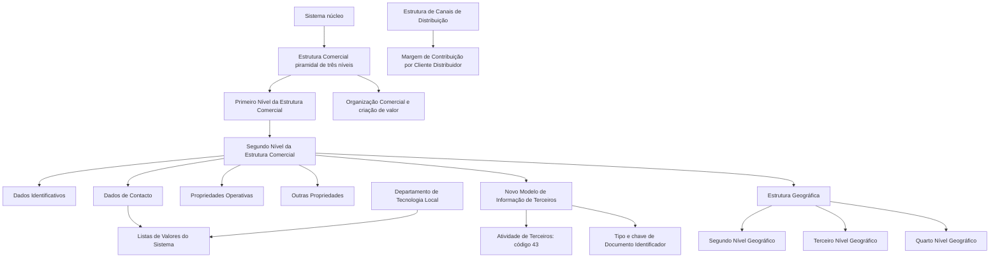

# Definição do Segundo Nível da Estrutura Comercial

## 1. Metadados do Documento
- **Arquivo de Origem:** Não identificado — conteúdo bruto fornecido pelo usuário
- **Tipo de Documento:** Especificação Técnica / Funcional
- **Domínio / Sistema:** Configuração da Estrutura Comercial no sistema MAPFRE; Novo Modelo de Informação de Terceiros
- **Público-Alvo:** Desenvolvedores, Arquitetos, Operação, Tecnologia Local e equipes funcionais
- **Data/Versão Identificada:** Não identificada

---

## 2. Resumo Executivo & Contexto de Negócio

O documento define os atributos e propriedades necessários para configurar o segundo nível da Estrutura Comercial de uma entidade MAPFRE. O núcleo do sistema suporta a codificação da estrutura comercial em uma pirâmide de três níveis, cujos repositórios de informação são inicialmente entregues vazios às instalações.

A definição do segundo nível da Estrutura Comercial é organizada em quatro grupos: Dados Identificativos, Dados de Contacto, Propriedades Operativas e Outras Propriedades. A especificação descreve o significado de cada atributo utilizado para identificar, localizar, contactar, operar e controlar a disponibilidade de um segundo nível comercial.

No Novo Modelo de Informação de Terceiros, os níveis da Estrutura Comercial são identificados mediante uma chave de atividade específica, um tipo de documento identificador e uma chave associada. Para o segundo nível, o Código de Atividade do Terceiro possui o valor constante `43`, pois corresponde a uma atividade do núcleo do sistema e não pode ser alterado.

O documento também delimita a separação entre a Estrutura Comercial e a Estrutura de Canais de Distribuição. A Estrutura de Canais de Distribuição atende à necessidade corporativa de obter a Margem de Contribuição por Cliente Distribuidor, enquanto a Organização Comercial está associada à combinação de fatores de produção e atividades voltadas à criação de valor pela entidade.

---

## 3. Arquitetura, Componentes & Tecnologias Envolvidas

Os componentes funcionais explicitamente citados são:

- **Sistema núcleo:** disponibiliza a estrutura comercial piramidal de três níveis.
- **Estrutura Comercial:** estrutura hierárquica com Primeiro, Segundo e Terceiro Níveis.
- **Segundo Nível da Estrutura Comercial:** objeto principal da configuração descrita.
- **Primeiro Nível da Estrutura Comercial:** nível ao qual o Segundo Nível é associado.
- **Novo Modelo de Informação de Terceiros:** modelo no qual os níveis da estrutura são identificados por atividade e documento identificador.
- **Atividade de Terceiros:** referência de atividade associada aos níveis da estrutura comercial.
- **Documentos Identificadores:** referência para tipo e chave de documento identificador.
- **Estrutura Geográfica:** estrutura usada para localizar geograficamente o Segundo Nível Comercial.
- **Listas de Valores do Sistema:** catálogos nos quais a Tecnologia Local deve identificar valores de Tipo de Domicílio.
- **Estrutura de Canais de Distribuição:** estrutura corporativa distinta da Estrutura Comercial.
- **Parâmetros da instalação:** configuração que pode definir o Tipo de Documento Identificador em condição específica.



> **Nota de Análise:** O documento não detalha interfaces, métodos HTTP, contratos JSON, tecnologias de implementação, bancos de dados, ambientes técnicos, URLs ou rotas de logs.

---

## 4. Regras de Negócio, Especificações Funcionais & Processos

### 4.1 Estrutura Comercial e escopo

1. O sistema núcleo permite codificar a Estrutura Comercial da entidade MAPFRE como uma estrutura piramidal de três níveis.
2. Os repositórios de informação dessa estrutura são inicialmente entregues vazios às instalações.
3. O documento trata especificamente da configuração do **Segundo Nível da Estrutura Comercial**.
4. O Segundo Nível deve estar associado a um Primeiro Nível da Estrutura Comercial por meio da respetiva chave.

### 4.2 Identificação no Novo Modelo de Informação de Terceiros

1. Os níveis da Estrutura Comercial devem ser identificados com uma chave de atividade específica.
2. Os níveis da Estrutura Comercial devem ser identificados com um Tipo de Documento Identificador e uma chave associada.
3. A utilização de Tipo de Documento Identificador e Chave do Documento Identificador é coerente com a identificação de outras Pessoas Físicas ou Jurídicas no Novo Modelo de Informação de Terceiros.
4. O Código de Atividade do Terceiro associado ao Segundo Nível possui o valor constante `43`.
5. O valor `43` não pode ser modificado porque corresponde a uma atividade pertencente ao núcleo do sistema.

### 4.3 Regra para Tipo de Documento Identificador

1. Quando a atividade `43` atribuída ao Primeiro Nível da Estrutura Comercial não possuir nenhum Tipo de Documento Identificador associado, o sistema atribuirá ao atributo **Tipo de Documento Identificador** o valor definido na configuração dos parâmetros da instalação.
2. O documento não descreve qual é o valor configurado nos parâmetros da instalação; apenas define a regra de atribuição.

### 4.4 Regras de localização e contacto

1. O Segundo Nível pode ser associado a chaves do segundo, terceiro e quarto níveis da Estrutura Geográfica.
2. O Nome do Quarto Nível da Estrutura Geográfica pode conter informação complementar quando não houver esse grau de detalhe no país.
3. O Tipo de Domicílio deve refletir a configuração, o uso e a exploração local pretendidos para o domicílio do Segundo Nível.
4. A Tecnologia Local deve identificar os valores de Tipo de Domicílio nos catálogos de Listas de Valores do Sistema.
5. Os valores de Tipo de Domicílio definidos pelo núcleo podem não ser os mais usuais no país.
6. Os valores de Tipo de Domicílio são transversais à aplicação e não são exclusivos da configuração do Segundo Nível da Estrutura Comercial.
7. Os atributos de Domicílio armazenam o detalhe do endereço conforme a localização geográfica e a tipologia de domicílio capturadas.
8. O endereço de correio eletrónico deve corresponder ao correio eletrónico corporativo do Segundo Nível.
9. Os atributos Nome e Apelidos do Responsável do Nível armazenam a identificação do responsável máximo pelo nível configurado.
10. O Prefixo Telefónico do País, o Prefixo Zonal Telefónico, o Número de Fax e o Número Telefónico representam informações de contacto corporativo do nível.

### 4.5 Propriedades operativas e controlo de uso

1. O atributo **Observações** pode armazenar informação adicional ou complementar relevante para a configuração do Segundo Nível.
2. A propriedade **Inhabilitación** informa ao sistema que a chave do Segundo Nível está inabilitada para uso na captura e/ou modificação de níveis da Estrutura Comercial.
3. A propriedade **Emisión** define se o código do Segundo Nível é um Código Real ou um Nível Genérico.
4. Para cada dupla Primeiro Nível / Segundo Nível existente, pode existir somente um único registo com a propriedade **Emisión** não ativada.
5. A propriedade **Emisión** é interna, criada pelo núcleo da aplicação e destinada ao uso interno desse núcleo.

### 4.6 Separação entre Estrutura Comercial e Canais de Distribuição

| Estrutura | Necessidade corporativa descrita |
| :--- | :--- |
| Estrutura de Canais de Distribuição | Obtenção da Margem de Contribuição por Cliente Distribuidor |
| Organização Comercial / Estrutura Comercial | Combinação de fatores de produção — capital, trabalho, recursos e tecnologia — com atividades que maximizam o processo de criação de valor da entidade |

---

## 5. Tabelas de Parâmetros, Ambientes e Estruturas de Dados

### 5.1 Dados Identificativos

| Item / Parâmetro | Descrição / Função | Tipo / Valores / Formato | Ambiente / Observações |
| :--- | :--- | :--- | :--- |
| Compañía | Contém o código da companhia sobre a qual é realizada a definição do Segundo Nível da Estrutura Comercial. | Código de companhia | Não detalhado |
| Código de Actividad del Tercero | Indica o código da Atividade de Terceiro associada ao Segundo Nível da Estrutura Comercial. | Constante `43` | Não pode ser modificado; corresponde a atividade do núcleo |
| Tipo Documento Identificador | Contém o tipo de documento identificador usado para identificar o nível no sistema. | Tipo de documento | Em condição específica, recebe o valor definido nos parâmetros da instalação |
| Clave del Documento Identificador | Contém a chave associada ao Tipo de Documento Identificador. | Chave de documento | Parte da identificação no Novo Modelo de Informação de Terceiros |
| Clave del Primer Nivel | Contém o código que identifica o Primeiro Nível ao qual o Segundo Nível estará associado. | Código de nível | Associação hierárquica |
| Clave del Segundo Nivel | Contém o código que identifica o Segundo Nível no sistema. | Código de nível | Identificador do Segundo Nível |
| Denominación del Segundo Nivel | Contém o nome pelo qual o Segundo Nível é identificado no sistema. | Nome | Não detalhado |
| Abreviatura del Segundo Nivel | Contém a descrição abreviada que permite identificar o Segundo Nível. | Descrição abreviada | Não detalhado |

### 5.2 Dados de Contacto e localização

| Item / Parâmetro | Descrição / Função | Tipo / Valores / Formato | Ambiente / Observações |
| :--- | :--- | :--- | :--- |
| Segundo Nivel de la Estructura Geográfica | Chave do segundo nível geográfico onde está localizado o Segundo Nível Comercial. | Chave geográfica | Não detalhado |
| Tercer Nivel de la Estructura Geográfica | Chave do terceiro nível geográfico onde está localizado o Segundo Nível Comercial. | Chave geográfica | Não detalhado |
| Cuarto Nivel de la Estructura Geográfica | Chave do quarto nível geográfico onde está localizado o Segundo Nível Comercial. | Chave geográfica | Não detalhado |
| Nombre del Cuarto Nivel de la Estructura Geográfica | Informação do quarto nível geográfico; pode receber informação complementar caso o país não possua tal detalhamento. | Texto | Pode complementar a ausência do quarto nível local |
| Tipo de Domicilio | Tipologia de domicílio do Segundo Nível Comercial. | Exemplos: Calle, Avenida, Cerrada, Carretera, Paseo | Tecnologia Local deve identificar valores nas Listas de Valores do Sistema |
| Domicilio | Detalhe do domicílio conforme localização geográfica e tipologia capturada. | Atributos de endereço | O documento não especifica subcampos |
| Código Postal | Chave do código postal onde está localizado o domicílio. | Chave de código postal | Não detalhado |
| Apartado Postal | Chave do apartado postal do Segundo Nível, normalmente localizado em uma agência de correios. | Chave de apartado postal | Permite receber correspondências e pacotes sem entregar o endereço físico concreto |
| Dirección Correo Electrónico | Endereço corporativo de correio eletrónico do Segundo Nível. | Endereço de e-mail | Uso corporativo |
| Nombre y Apellidos Responsable del nivel | Nome e apelidos do responsável máximo do nível da Estrutura Comercial. | Texto | Atributos do repositório de configuração |
| Prefijo Telefónico del País | Prefixo telefónico nacional do número corporativo do nível. | Exemplos: Espanha `+34`, México `+52`, Argentina `+54` | Exemplos fornecidos pelo documento |
| Prefijo Zonal Telefónico | Prefixo zonal do número corporativo do Segundo Nível. | Exemplos: Madrid `91`, Barcelona `93`, Monterrey `81`, Cidade do México `55` | Exemplos fornecidos pelo documento |
| Número Fax | Número telefónico do fax corporativo do nível. | Número telefónico | Não detalhado |
| Número Telefónico | Número do telefone corporativo do nível. | Número telefónico | Não detalhado |

### 5.3 Propriedades operativas e outras propriedades

| Item / Parâmetro | Descrição / Função | Tipo / Valores / Formato | Ambiente / Observações |
| :--- | :--- | :--- | :--- |
| Observaciones | Armazena informação adicional ou complementar considerada pertinente na configuração do Segundo Nível. | Texto livre | Não detalhado |
| Inhabilitación | Indica que a chave do Segundo Nível está inabilitada para captura e/ou modificação de níveis da Estrutura Comercial. | Propriedade / estado | Restringe o uso da chave no sistema |
| Emisión | Estabelece se o código identificador é Código Real ou Nível Genérico. | Propriedade / estado | Apenas um registo sem a propriedade ativada por dupla Primeiro/Segundo Nível; uso interno do núcleo |

### 5.4 Referências documentais recomendadas

| Documento / Tema relacionado | Finalidade da referência |
| :--- | :--- |
| Actividades de Terceros | Apoiar a interpretação das atividades associadas aos níveis |
| Documentos Identificadores | Apoiar a interpretação do tipo e da chave de documento identificador |
| Estructura Geográfica | Apoiar a interpretação dos níveis geográficos associados ao Segundo Nível |

---

## 6. Bateria de Perguntas & Respostas para RAG (FAQ Sintético)

### P1: Qual é o objeto funcional principal do documento?
**R:** O documento descreve a configuração do Segundo Nível da Estrutura Comercial da entidade MAPFRE. A Estrutura Comercial é suportada pelo sistema núcleo como uma estrutura piramidal de três níveis, e o documento detalha os atributos identificativos, de contacto, operativos e de controlo desse segundo nível.

### P2: Qual é o código de Atividade de Terceiro do Segundo Nível da Estrutura Comercial?
**R:** O Código de Atividade do Terceiro associado ao Segundo Nível da Estrutura Comercial possui o valor constante `43`. Esse valor não pode ser modificado porque corresponde a uma das atividades pertencentes ao núcleo do sistema.

### P3: Como o Segundo Nível da Estrutura Comercial é associado ao Primeiro Nível?
**R:** A associação é realizada pelo atributo **Clave del Primer Nivel**, que contém o código identificador do Primeiro Nível da Estrutura Comercial ao qual o Segundo Nível estará associado.

### P4: O que acontece se a atividade 43 do Primeiro Nível não tiver Tipo de Documento Identificador associado?
**R:** Nessa condição, o sistema atribui ao atributo **Tipo Documento Identificador** o valor definido na configuração dos parâmetros da instalação. O documento não informa qual é esse valor, apenas estabelece a regra de atribuição.

### P5: Quais atributos identificam o Segundo Nível no Novo Modelo de Informação de Terceiros?
**R:** O Segundo Nível é identificado por uma chave de atividade específica, por um Tipo de Documento Identificador e por uma chave associada ao documento identificador. Essa abordagem mantém coerência com a identificação de outras Pessoas Físicas ou Jurídicas.

### P6: Quais níveis da Estrutura Geográfica podem ser associados ao Segundo Nível Comercial?
**R:** O Segundo Nível Comercial pode estar associado às chaves do segundo, terceiro e quarto níveis da Estrutura Geográfica. Também existe o atributo Nome do Quarto Nível da Estrutura Geográfica, que pode conter informação complementar quando determinado país não possuir esse nível de detalhe.

### P7: Quem deve configurar os valores de Tipo de Domicílio?
**R:** O Departamento de Tecnologia Local deve identificar os valores de Tipo de Domicílio nos catálogos do sistema que identificam as Listas de Valores. O documento alerta que os valores predefinidos pelo núcleo podem não ser os de uso mais comum em cada país.

### P8: Os valores de Tipo de Domicílio são exclusivos da configuração do Segundo Nível da Estrutura Comercial?
**R:** Não. Os valores de Tipo de Domicílio devem ser considerados de uso transversal na aplicação. Portanto, não devem ser definidos como valores específicos apenas para a configuração do Segundo Nível da Estrutura Comercial.

### P9: Qual é a finalidade da propriedade Inhabilitación?
**R:** A propriedade **Inhabilitación** indica ao sistema que a chave do Segundo Nível da Estrutura Comercial está inabilitada para utilização na captura e/ou na modificação dos níveis da Estrutura Comercial.

### P10: O que a propriedade Emisión determina?
**R:** A propriedade **Emisión** determina se o código que identifica o Segundo Nível é um Código Real ou um Nível Genérico. Só pode existir um único registo com essa propriedade não ativada para cada dupla Primeiro Nível / Segundo Nível existente. Trata-se de uma propriedade de uso interno do núcleo da aplicação.

### P11: Qual é a diferença entre a Estrutura Comercial e a Estrutura de Canais de Distribuição?
**R:** A Estrutura de Canais de Distribuição responde à necessidade corporativa de obter a Margem de Contribuição por Cliente Distribuidor. Já a Organização Comercial responde a funções que combinam capital, trabalho, recursos e tecnologia com atividades destinadas a maximizar a criação de valor da entidade.

### P12: Que informações de contacto corporativo podem ser configuradas para o Segundo Nível?
**R:** Podem ser configurados o endereço de correio eletrónico corporativo, nome e apelidos do responsável máximo, prefixo telefónico do país, prefixo zonal telefónico, número de fax e número telefónico corporativo. Também podem ser configurados domicílio, código postal e apartado postal.

---

## 7. Glossário de Termos, Siglas & Conceitos-Chave

- **Apartado Postal:** chave associada a uma caixa postal, normalmente localizada em uma agência de correios, que permite receber correspondências e pacotes sem fornecer o endereço físico concreto.
- **Atividade de Terceiros:** atividade específica usada para identificar os níveis da Estrutura Comercial no Novo Modelo de Informação de Terceiros.
- **Código Real:** classificação possível para o código que identifica o Segundo Nível, conforme a propriedade Emisión.
- **Emisión:** propriedade interna do núcleo que define se o código do Segundo Nível é Código Real ou Nível Genérico.
- **Estrutura Comercial:** estrutura piramidal de três níveis usada para codificar a organização comercial da entidade.
- **Estrutura de Canais de Distribuição:** estrutura configurada para atender à necessidade corporativa de obtenção da Margem de Contribuição por Cliente Distribuidor.
- **Estrutura Geográfica:** organização de localização composta, no contexto do documento, por segundo, terceiro e quarto níveis geográficos.
- **Inhabilitación:** propriedade que inabilita a chave de um Segundo Nível para captura e/ou modificação de níveis da Estrutura Comercial.
- **Listas de Valores:** catálogos do sistema nos quais a Tecnologia Local deve identificar valores aplicáveis, como os valores de Tipo de Domicílio.
- **MAPFRE:** entidade mencionada como detentora da Estrutura Comercial configurada no sistema.
- **Nível Genérico:** classificação possível para o código que identifica o Segundo Nível, conforme a propriedade Emisión.
- **Novo Modelo de Informação de Terceiros:** modelo em que níveis da Estrutura Comercial são identificados por atividade, tipo de documento identificador e chave associada.
- **Primeiro Nível:** nível superior da Estrutura Comercial ao qual o Segundo Nível é associado.
- **Segundo Nível:** nível da Estrutura Comercial objeto da especificação.
- **Tecnologia Local:** departamento responsável por identificar valores locais nos catálogos de Listas de Valores do Sistema.
- **Tipo de Documento Identificador:** tipo de documento utilizado, juntamente com uma chave associada, para identificar níveis da Estrutura Comercial.

---

## 8. Notas Críticas, Riscos & Limitações

- O documento não identifica o nome do arquivo de origem, autor, data, versão, ambiente ou produto técnico específico.
- Não há detalhamento de telas, APIs, serviços, contratos de integração, bases de dados, permissões, URLs, rotas de log ou procedimentos operacionais de implantação.
- O sistema núcleo entrega inicialmente os repositórios de informação vazios; o documento não descreve o processo de carga inicial nem os responsáveis por esse preenchimento.
- O valor do Código de Atividade do Terceiro é rigidamente definido como `43` e não pode ser alterado.
- A regra para preenchimento de Tipo de Documento Identificador depende da configuração de parâmetros da instalação; os valores desses parâmetros não estão documentados.
- Os valores de Tipo de Domicílio requerem identificação pela Tecnologia Local nas Listas de Valores do Sistema. A ausência dessa configuração local pode comprometer a adequação aos usos nacionais.
- Os valores de Tipo de Domicílio têm uso transversal na aplicação; alterações locais podem ter impacto além da configuração da Estrutura Comercial.
- A propriedade Emisión é de uso interno do núcleo, e a restrição de unicidade para registos com propriedade não ativada deve ser respeitada por dupla Primeiro Nível / Segundo Nível.
- O documento recomenda consultar Atividades de Terceiros, Documentos Identificadores e Estrutura Geográfica para evitar interpretações isoladas incorretas.
- O conteúdo menciona “Home Solutions APIs Documentation Zeus” no fim da primeira página, mas não detalha a relação desse texto com a configuração do Segundo Nível da Estrutura Comercial.

---

## 9. Conteúdo Bruto Estruturado (Referência Fiel)

```text
--- [PÁGINA 1 DE 6] ---

DEFINICIÓN del Segundo Nivel de la Estructura
Comercial
Objetivo
Funcionalmente, el núcleo del Sistema cuenta con la posibilidad de codificar la estructura Comercial
de la entidad MAPFRE en una estructura piramidal de tres niveles con repositorios de información
específicos que se entregan inicialmente a las instalaciones vacíos de contenido.
En este documento concretamente nos referimos a la configuración en el sistema del segundo nivel
de la estructura comercial
Datos Identificativos
Datos de Contacto
Propiedades Operativas
Otras Propiedades
Datos Identificativos
Compañía
Este Atributo del Segundo Nivel de la Estructura Comercial contiene el código de la compañía sobre
la que se está realizando su definición.
Código de Actividad del Tercero
 /
 CF
Home Solutions APIs Documentation Zeus
EN


--- [PÁGINA 2 DE 6] ---

Esta propiedad indicará el código de la Actividad del Tercero que se asocian al segundo nivel de la
estructura comercial puesto que en el Nuevo Modelo de Información de Terceros, los niveles de la
estructura se identifican en el sistema con una clave de actividad específica.
NOTA: Su valor es la constante '43' puesto que esta es una de las actividades que corresponden al
núcleo y por ello no puede ser modificado.
Tipo Documento Identificador
En el nuevo Modelo de Información de Terceros y por coherencia con la información del del resto de
Personas Físicas o Jurídicas los niveles de la estructura comercial se deben identificar en el sistema
con un tipo de documento identificativo y una clave asociada.
Este atributo contendrá el Tipo de documento Identificador.
Clave del Documento Identificador
En el nuevo Modelo de Información de Terceros y por coherencia con la información del del resto de
Personas Físicas o Jurídicas los niveles de la estructura comercial se deben identificar en el sistema
con un tipo de documento identificativo y una clave asociada.
Este atributo contendrá la clave del Tipo de documento Identificador.
Clave del Primer Nivel
Este atributo contiene el código por el que se identifica el Primer Nivel de la Estructura Comercial en
el Sistema y al que estará asociado el Segundo Nivel de la estructura.
Clave del Segundo Nivel
Este atributo contiene el código por el que se identificará el Segundo Nivel de la Estructura
Comercial en el Sistema.
Denominación del Segundo Nivel
Este atributo contiene el nombre por el que se identifica al Segundo Nivel de la Estructura Comercial
en el Sistema.
Abreviatura del Segundo Nivel
Este atributo contiene la descripción abreviada por la cual se puede identificar al Segundo Nivel de la
Estructura Comercial.
Datos de Contacto
Segundo Nivel de la Estructura Geográfica


--- [PÁGINA 3 DE 6] ---

Este atributo contiene la clave del segundo nivel de la Estructura Geográfica en la que está ubicado
el Segundo nivel de la Estructura Comercial.
Tercer Nivel de la Estructura Geográfica
Este atributo contiene la clave del tercer nivel de la Estructura Geográfica en la que está ubicado el
Segundo nivel de la Estructura Comercial.
Cuarto Nivel de la Estructura Geográfica
Este atributo contiene la clave del cuarto nivel de la Estructura Geográfica en la que está ubicado el
Segundo nivel de la Estructura Comercial.
Nombre del Cuarto Nivel de la Estructura Geográfica
Este atributo contiene información que corresponde al cuarto nivel de la estructura geográfica si bien
y puesto que no en todos los países se cuenta con este nivel de detalle, puede contener información
complementaria.
Tipo de Domicilio
Este atributo ha de contener la tipología del Domicilio del Segundo nivel de la Estructura Comercial
de acuerdo con la configuración, uso y explotación que posteriormente se quiera realizar localmente.
A modo de ejemplo sus valores podrían ser:
Calle.
Avenida.
Cerrada.
Carretera.
Paseo.
...
NOTA: Es necesario que el Departamento de Tecnología Local identifique sus valores en los
catálogos del Sistema que identifican las Listas de Valores puesto que los valores prefijados por el
núcleo pueden no ser aquellos de uso común en el país, teniendo en mente además que los valores
serán de uso transversal en la aplicación y no de uso específico para la configuración del Segundo
nivel de la estructura comercial.
Domicilio
Estos Atributos contienen la información de detalle del domicilio del Segundo nivel de la estructura
comercial de acuerdo con la ubicación geográfica y tipología del domicilio capturados.


--- [PÁGINA 4 DE 6] ---

Código Postal
Este atributo contiene la clave del Código Postal en donde está ubicada el Domicilio del Segundo
nivel de la estructura comercial.
Apartado Postal
Este atributo contiene la clave del Apartado Postal perteneciente al Segundo nivel de la estructura
comercial, normalmente ubicado en una oficina de Correos, que le permite recibir correspondencia y
paquetes sin tener que entregar la dirección física concreta.
Dirección Correo Electrónico
Este atributo contiene la dirección de correo electrónico corporativo del Segundo nivel de la
estructura comercial.
Nombre y Apellidos Responsable del nivel
Estos atributos del repositorio de configuración contienen el nombre y los apellidos del responsable
máximo del nivel de la estructura comercial definida.
Prefijo Telefónico del País
Este atributo contiene el Prefijo del País Telefónico correspondiente al número telefónico Corporativo
del nivel de la estructura comercial.
A modo de ejemplo, en España el prefijo es +34,g en México +52 y en Argentina +54.
Prefijo Zonal Telefónico
Este atributo contiene el Prefijo Zonal Telefónico que corresponde al número telefónico Corporativo
del Segundo nivel de la estructura comercial.
A modo de ejemplo,
En España el prefijo zonal de Madrid es el 91, el de Barcelona 93, ...
En México la Clave Lada local que corresponde a Monterrey, Nuevo León es 81, la de Ciudad de
México es 55,...
Número Fax
Este atributo contiene el Número Telefónico del Fax Corporativo del nivel de la estructura comercial.
Número Telefónico
Este atributo contiene el Número Telefónico que corresponde al Teléfono Corporativo del nivel de la
estructura comercial.


--- [PÁGINA 5 DE 6] ---

Propiedades Operativas
Observaciones
Este atributo puede contener información adicional/complementaria que se estime oportuno capturar
en la configuración del Segundo nivel de la estructura comercial.
Otras Propiedades
Inhabilitación
Esta propiedad indica en el Sistema que la clave del Segundo nivel de la estructura comercial está
inhabilitada para ser utilizada en la captura y/o modificación de los niveles de la estructura comercial.
Emisión
Esta propiedad del Segundo Nivel de la Estructura Comercial establece si el Código que lo identifica
es un Código Real o un Nivel Genérico (solamente puede existir un único Registro con esta
Propiedad sin activar por cada dupla Primer/Segundo Nivel de la estructura existente).
NOTA: Esta propiedad es de uso interno, creada por y para uso del núcleo de la Aplicación.
Vínculos
Relación de Directrices y Documentos funcionales cuya lectura recomendada para evitar que la
interpretación aislada del presente documento pueda conducir a error.
Actividades de Terceros
Documentos Identificadores
Estructura Geográfica
Preguntas frecuentes
1 ¿Existe alguna aclaración operativa que deba ser tomada en consideración en la configuración, uso
y definición de la tabla de Segundos niveles de la estructura comercial en el sistema?
Siempre y cuando la actividad 43 asignada al primer nivel de la estructura comercial no tuviera
asociada ningún tipo de documento identificador, el valor que el sistema asignará en el atributo del
Tipo de Documento Identificador será aquel que se define en la configuración realizada en los
parámetros de la instalación.
2. ¿Se pueden solapar los usos de la Estructura Comercial y la Estructura de canales de
Distribución?


--- [PÁGINA 6 DE 6] ---

La Configuración de la Estructura de los Canales de distribución obedece a una necesidad
Corporativa concreta para la obtención del Margen de Contribución por Cliente Distribuidor,
mientras que la Configuración de la Organización Comercial obedece a funciones en las que se
combinan factores de producción (capital, trabajo, recursos, tecnología, etc.) con actividades que
maximizan el proceso de creación de valor de la entidad.
```
