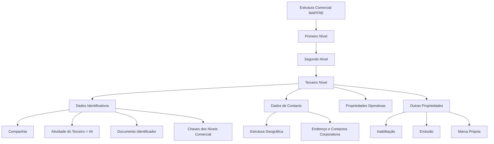

# Definição do Terceiro Nível da Estrutura Comercial MAPFRE

## 1. Metadados do Documento
- **Arquivo de Origem:** Não identificado — conteúdo bruto fornecido pelo usuário
- **Tipo de Documento:** Especificação Técnica / Funcional
- **Domínio / Sistema:** Núcleo do Sistema MAPFRE — Estrutura Comercial e Modelo de Informação de Terceiros
- **Público-Alvo:** Desenvolvedores, Arquitetos, Equipes de Configuração, Tecnologia Local e Operação
- **Data/Versão Identificada:** Não identificada

---

## 2. Resumo Executivo & Contexto de Negócio

O documento define os atributos de configuração do **Terceiro Nível da Estrutura Comercial** da entidade MAPFRE no núcleo do sistema. A Estrutura Comercial é modelada de forma piramidal em três níveis e possui repositórios de informação específicos, inicialmente entregues às instalações sem conteúdo.

O Terceiro Nível da Estrutura Comercial é identificado por dados de companhia, atividade de terceiro, documento identificador, chaves de relacionamento hierárquico e denominações. O nível também concentra informações de localização geográfica, endereço, contato corporativo, responsável, propriedades operacionais e propriedades adicionais.

A documentação estabelece regras relevantes para a consistência do modelo. A atividade de terceiro associada ao Terceiro Nível possui valor constante `44` e não pode ser modificada. Além disso, a propriedade de emissão diferencia códigos reais de níveis genéricos e restringe a existência de um único registro sem essa propriedade ativada para cada combinação existente de Primeiro, Segundo e Terceiro Níveis.

O documento também delimita responsabilidades locais. O Departamento de Tecnologia Local deve identificar, nos catálogos e Listas de Valores do sistema, os valores aplicáveis ao atributo **Tipo de Domicílio**, pois os valores predefinidos pelo núcleo podem não ser usuais em todos os países. A configuração deve considerar que esses valores terão uso transversal na aplicação.

---

## 3. Arquitetura, Componentes & Tecnologias Envolvidas

O documento descreve um modelo funcional de dados e configuração para a Estrutura Comercial MAPFRE. Não há especificação de microsserviços, APIs, tecnologias de infraestrutura, protocolos, URLs, bancos de dados, métodos HTTP ou contratos JSON.

Os componentes funcionais explicitamente citados são:

| Componente / Conceito | Papel descrito |
| :--- | :--- |
| Núcleo do Sistema | Permite codificar a Estrutura Comercial da entidade MAPFRE em uma estrutura piramidal de três níveis. |
| Estrutura Comercial | Estrutura organizacional piramidal com Primeiro, Segundo e Terceiro Níveis. |
| Terceiro Nível da Estrutura Comercial | Objeto central da configuração descrita no documento; pode representar escritório ou sucursal comercial. |
| Modelo de Informação de Terceiros | Modelo no qual os níveis da estrutura são identificados por atividade específica, tipo de documento identificador e chave associada. |
| Estrutura Geográfica | Fonte das chaves de Segundo, Terceiro e Quarto Níveis geográficos associados ao Terceiro Nível Comercial. |
| Listas de Valores | Catálogos do sistema nos quais a Tecnologia Local deve identificar valores de Tipo de Domicílio. |
| Estrutura de Canais de Distribuição | Estrutura voltada à obtenção da Margem de Contribuição por Cliente Distribuidor. |
| Organização Comercial | Configuração voltada a funções que combinam fatores de produção e atividades de criação de valor. |



> **Nota de Análise:** O documento descreve atributos funcionais e relações hierárquicas, mas não detalha persistência de dados, interfaces de integração, métodos HTTP, contratos JSON, tecnologias de implementação ou fluxos técnicos entre sistemas.

---

## 4. Regras de Negócio, Especificações Funcionais & Processos

### 4.1 Estrutura Comercial

1. O núcleo do sistema permite codificar a Estrutura Comercial da entidade MAPFRE em uma estrutura piramidal de três níveis.
2. Os repositórios de informação específicos são entregues inicialmente às instalações sem conteúdo.
3. O documento trata especificamente da configuração do Terceiro Nível da Estrutura Comercial.
4. O Terceiro Nível possui associação indireta ao Primeiro Nível e associação identificável ao Segundo Nível da Estrutura Comercial.

### 4.2 Identificação do Terceiro Nível

1. O atributo **Companhia** contém o código da companhia para a qual a definição do Terceiro Nível está sendo realizada.
2. O atributo **Código de Atividade do Terceiro** indica a atividade de terceiro associada ao Terceiro Nível.
3. No Modelo de Informação de Terceiros, os níveis da estrutura são identificados por uma chave de atividade específica.
4. O valor do Código de Atividade do Terceiro é a constante `44`.
5. A atividade `44` corresponde a uma das atividades do núcleo e não pode ser modificada.
6. O Terceiro Nível deve possuir um Tipo de Documento Identificador e uma chave associada, em coerência com a informação das demais pessoas físicas ou jurídicas.
7. O atributo **Tipo Documento Identificador** armazena o tipo de documento utilizado para identificar o nível.
8. O atributo **Clave del Documento Identificador** armazena a chave associada ao Tipo de Documento Identificador.
9. O atributo **Clave del Primer Nivel** identifica o Primeiro Nível da Estrutura Comercial ao qual o Terceiro Nível estará associado indiretamente.
10. O atributo **Clave del Segundo Nivel** identifica o Segundo Nível da Estrutura Comercial.
11. O atributo **Clave del Tercer Nivel** identifica o Terceiro Nível da Estrutura Comercial.
12. O atributo **Denominación del Tercer Nivel** armazena o nome de identificação do Terceiro Nível.
13. O atributo **Abreviatura del Tercer Nivel** armazena a descrição abreviada do Terceiro Nível.

### 4.3 Dados de Contacto e Localização

1. O Terceiro Nível deve poder ser associado ao Segundo, Terceiro e Quarto Níveis da Estrutura Geográfica.
2. O atributo **Nombre del Cuarto Nivel de la Estructura Geográfica** pode armazenar informação correspondente ao quarto nível geográfico.
3. Como nem todos os países possuem esse nível de detalhamento, o Nome do Quarto Nível Geográfico pode conter informação complementar.
4. O atributo **Tipo de Domicilio** deve conter a tipologia do endereço do Terceiro Nível, conforme a configuração, uso e exploração local desejados.
5. Exemplos de valores de Tipo de Domicílio apresentados pelo documento: Calle, Avenida, Cerrada, Carretera e Paseo.
6. A Tecnologia Local deve identificar os valores de Tipo de Domicílio nas Listas de Valores do sistema.
7. Os valores predefinidos pelo núcleo podem não corresponder aos valores de uso comum no país.
8. Os valores de Tipo de Domicílio possuem uso transversal na aplicação; não são de uso exclusivo da configuração do Terceiro Nível.
9. Os atributos de **Domicilio** contêm o detalhamento do endereço conforme a localização geográfica e a tipologia de endereço capturada.
10. O **Código Postal** armazena a chave do código postal onde o endereço do Terceiro Nível está localizado.
11. O **Apartado Postal** armazena a chave da caixa postal vinculada ao Terceiro Nível, normalmente localizada em uma agência dos correios.
12. A caixa postal permite receber correspondência e pacotes sem fornecer o endereço físico concreto.
13. A **Dirección Correo Electrónico** armazena o endereço de correio eletrônico corporativo do Terceiro Nível.
14. Os atributos **Nombre y Apellidos Responsable del nivel** armazenam nome e sobrenomes do responsável máximo pelo nível configurado.
15. O **Prefijo Telefónico del País** armazena o prefixo de país do número telefônico corporativo.
16. O **Prefijo Zonal Telefónico** armazena o prefixo zonal relacionado ao número telefônico corporativo do Terceiro Nível.
17. O **Número Fax** armazena o número do fax corporativo.
18. O **Número Telefónico** armazena o número de telefone corporativo.

### 4.4 Propriedades Operativas

1. O atributo **Observaciones** pode conter informações adicionais ou complementares consideradas necessárias para a configuração do Terceiro Nível da Estrutura Comercial.

### 4.5 Outras Propriedades

1. A propriedade **Inhabilitación** indica que a chave do Terceiro Nível está inabilitada para uso na captura e/ou modificação dos níveis da Estrutura Comercial.
2. A propriedade **Emisión** indica se o código identificador do Terceiro Nível é um Código Real ou um Nível Genérico.
3. Só pode existir um único registro com a propriedade Emisión sem ativação para cada combinação existente de Primeiro, Segundo e Terceiro Níveis.
4. A propriedade Emisión é de uso interno, criada pelo núcleo da aplicação e destinada ao uso do próprio núcleo.
5. A propriedade **Tipo de Distribución** está descontinuada e obsoleta no núcleo do sistema.
6. A propriedade Tipo de Distribución não pode ser usada nem reutilizada para nenhuma finalidade de âmbito local.
7. Originalmente, Tipo de Distribución indicava a forma de distribuição contábil dos saldos de cosseguro/resseguro de uma oficina: por Entidade, Setor, Subsetor ou Ramo Contábil.
8. A propriedade **Fecha de Apertura** armazena a data oficial de abertura da oficina ou sucursal comercial.
9. A propriedade **Marca Propia** indica se sucursais ou escritórios do Terceiro Nível pertencem à companhia.
10. A Marca Propia permite distinguir escritórios pertencentes à companhia de escritórios associados ou externos à Organização Comercial interna MAPFRE.

### 4.6 Perguntas Frequentes e Regras Associadas

1. Se a atividade `43`, atribuída ao Primeiro Nível da Estrutura Comercial, não possuir nenhum Tipo de Documento Identificador associado, o sistema atribuirá ao atributo Tipo de Documento Identificador o valor definido nos parâmetros de instalação.
2. A Estrutura de Canais de Distribuição atende a uma necessidade corporativa específica: obtenção da Margem de Contribuição por Cliente Distribuidor.
3. A Organização Comercial atende a funções que combinam fatores de produção — capital, trabalho, recursos e tecnologia, entre outros — com atividades que maximizam o processo de criação de valor da entidade.
4. A documentação recomenda a leitura das diretrizes e documentos funcionais relacionados: **Actividades de Terceros** e **Estructura Geográfica**.

---

## 5. Tabelas de Parâmetros, Ambientes e Estruturas de Dados

| Item / Parâmetro | Descrição / Função | Tipo / Valores / Formato | Ambiente / Observações |
| :--- | :--- | :--- | :--- |
| Companhia | Código da companhia para a qual o Terceiro Nível é definido. | Código de companhia | Não detalhado. |
| Código de Atividade do Terceiro | Indica a atividade de terceiro associada ao Terceiro Nível. | Constante `44` | Não pode ser modificada; atividade do núcleo. |
| Tipo Documento Identificador | Tipo de documento usado para identificar o Terceiro Nível. | Tipo de documento | Integrado ao Modelo de Informação de Terceiros. |
| Clave del Documento Identificador | Chave associada ao Tipo de Documento Identificador. | Chave de documento | Integrado ao Modelo de Informação de Terceiros. |
| Clave del Primer Nivel | Código que identifica o Primeiro Nível relacionado indiretamente ao Terceiro Nível. | Código | Estrutura Comercial. |
| Clave del Segundo Nivel | Código que identifica o Segundo Nível. | Código | Estrutura Comercial. |
| Clave del Tercer Nivel | Código que identifica o Terceiro Nível. | Código | Estrutura Comercial. |
| Denominación del Tercer Nivel | Nome de identificação do Terceiro Nível. | Texto | Estrutura Comercial. |
| Abreviatura del Tercer Nivel | Descrição abreviada de identificação do Terceiro Nível. | Texto | Estrutura Comercial. |
| Segundo Nivel de la Estructura Geográfica | Chave do segundo nível geográfico onde o Terceiro Nível está localizado. | Chave geográfica | Dados de Contacto. |
| Tercer Nivel de la Estructura Geográfica | Chave do terceiro nível geográfico onde o Terceiro Nível está localizado. | Chave geográfica | Dados de Contacto. |
| Cuarto Nivel de la Estructura Geográfica | Chave do quarto nível geográfico onde o Terceiro Nível está localizado. | Chave geográfica | Dados de Contacto. |
| Nombre del Cuarto Nivel de la Estructura Geográfica | Informação do quarto nível geográfico ou informação complementar. | Texto | Pode ser complementar quando o país não possui quarto nível de detalhe. |
| Tipo de Domicilio | Tipologia do endereço do Terceiro Nível. | Exemplos: Calle, Avenida, Cerrada, Carretera, Paseo | Valores devem ser identificados localmente nas Listas de Valores; uso transversal. |
| Domicilio | Detalhes do endereço do Terceiro Nível. | Dados de endereço | Conforme localização geográfica e tipologia de endereço. |
| Código Postal | Chave do código postal do endereço. | Chave de código postal | Dados de Contacto. |
| Apartado Postal | Chave da caixa postal do Terceiro Nível. | Chave de caixa postal | Permite receber correspondências e pacotes sem informar endereço físico concreto. |
| Dirección Correo Electrónico | Endereço eletrônico corporativo do Terceiro Nível. | Endereço de e-mail | Dados de Contacto. |
| Nombre y Apellidos Responsable del nivel | Nome e sobrenomes do responsável máximo pelo nível. | Texto | Repositório de configuração. |
| Prefijo Telefónico del País | Prefixo telefônico do país do telefone corporativo. | Exemplos: Espanha `+34`, México `+52`, Argentina `+54` | O texto original contém `+34,g` para Espanha; provável erro tipográfico preservado na referência bruta. |
| Prefijo Zonal Telefónico | Prefixo zonal do telefone corporativo. | Exemplos: Madrid `91`, Barcelona `93`, Monterrey `81`, Cidade do México `55` | Dados de Contacto. |
| Número Fax | Número do fax corporativo. | Número telefônico | Dados de Contacto. |
| Número Telefónico | Número de telefone corporativo. | Número telefônico | Dados de Contacto. |
| Observaciones | Informações adicionais ou complementares da configuração. | Texto livre | Propriedades Operativas. |
| Inhabilitación | Indica que a chave do Terceiro Nível não pode ser utilizada na captura e/ou modificação da estrutura. | Propriedade de inabilitação | Outras Propriedades. |
| Emisión | Define se o código é real ou representa nível genérico. | Propriedade interna | Apenas um registro sem ativação por combinação Primeiro/Segundo/Terceiro Níveis. |
| Tipo de Distribución | Propriedade histórica de distribuição contábil de saldos de cosseguro/resseguro. | Descontinuada / obsoleta | Não usar nem reutilizar localmente. |
| Fecha de Apertura | Data oficial de abertura da oficina ou sucursal. | Data | Outras Propriedades. |
| Marca Propia | Indica se escritório ou sucursal pertence à companhia. | Indicador | Distingue unidades próprias de unidades associadas ou externas. |
| Atividade do Primeiro Nível | Atividade associada ao Primeiro Nível, relevante para regra de documento identificador. | Valor citado: `43` | Se não houver tipo de documento associado, o sistema utiliza parâmetro da instalação. |

---

## 6. Bateria de Perguntas & Respostas para RAG (FAQ Sintético)

### P1: Qual é o objetivo do documento sobre o Terceiro Nível da Estrutura Comercial?
**R:** O documento define a configuração do Terceiro Nível da Estrutura Comercial da entidade MAPFRE no núcleo do sistema. Ele descreve os atributos identificativos, dados de contato, propriedades operativas e outras propriedades aplicáveis a esse nível da estrutura comercial piramidal.

### P2: Qual valor deve ser usado para o Código de Atividade do Terceiro no Terceiro Nível?
**R:** O Código de Atividade do Terceiro deve possuir o valor constante `44`. O documento informa que a atividade `44` corresponde a uma atividade do núcleo do sistema e, por esse motivo, não pode ser modificada.

### P3: Como o Terceiro Nível é identificado no Modelo de Informação de Terceiros?
**R:** No Modelo de Informação de Terceiros, o Terceiro Nível é identificado por uma atividade específica, por um Tipo de Documento Identificador e por uma chave associada a esse tipo de documento. Também são mantidas as chaves do Primeiro, Segundo e Terceiro Níveis da Estrutura Comercial.

### P4: O que acontece se a atividade 43 do Primeiro Nível não possuir Tipo de Documento Identificador associado?
**R:** Se a atividade `43` atribuída ao Primeiro Nível da Estrutura Comercial não tiver nenhum Tipo de Documento Identificador associado, o sistema atribuirá ao atributo Tipo de Documento Identificador o valor definido nos parâmetros de instalação.

### P5: Quem deve definir os valores do atributo Tipo de Domicílio?
**R:** O Departamento de Tecnologia Local deve identificar os valores adequados de Tipo de Domicílio nos catálogos do sistema que identificam as Listas de Valores. Essa responsabilidade existe porque os valores predefinidos pelo núcleo podem não ser os de uso comum em cada país.

### P6: Os valores de Tipo de Domicílio podem ser criados exclusivamente para o Terceiro Nível da Estrutura Comercial?
**R:** Não. O documento afirma que os valores de Tipo de Domicílio terão uso transversal na aplicação e não devem ser tratados como valores exclusivos da configuração do Terceiro Nível da Estrutura Comercial.

### P7: Qual é a finalidade da propriedade Inhabilitación?
**R:** A propriedade Inhabilitación indica ao sistema que a chave do Terceiro Nível da Estrutura Comercial está inabilitada para uso na captura e/ou modificação dos níveis da estrutura comercial.

### P8: Como funciona a propriedade Emisión no Terceiro Nível?
**R:** A propriedade Emisión determina se o código que identifica o Terceiro Nível é um Código Real ou um Nível Genérico. Pode existir somente um registro com essa propriedade sem ativação para cada combinação existente de Primeiro, Segundo e Terceiro Níveis. A propriedade é interna e destinada ao núcleo da aplicação.

### P9: A propriedade Tipo de Distribución pode ser usada em uma configuração local?
**R:** Não. A funcionalidade Tipo de Distribución está descontinuada e obsoleta no núcleo do sistema. O documento determina expressamente que ela não pode ser usada ou reutilizada para nenhuma finalidade de âmbito local.

### P10: Qual era o uso original da propriedade Tipo de Distribución?
**R:** Originalmente, Tipo de Distribución indicava a forma de realização contábil da distribuição dos saldos de cosseguro e resseguro de uma oficina. As alternativas mencionadas são: por Entidade, Setor, Subsetor ou Ramo Contábil.

### P11: Qual é a função da propriedade Marca Propia?
**R:** Marca Propia indica se as sucursais ou escritórios correspondentes ao Terceiro Nível pertencem à companhia. A propriedade permite reconhecer unidades próprias e diferenciá-las de escritórios associados ou externos à Organização Comercial interna MAPFRE.

### P12: A Estrutura Comercial e a Estrutura de Canais de Distribuição possuem a mesma finalidade?
**R:** Não. A Estrutura de Canais de Distribuição atende a uma necessidade corporativa concreta de obtenção da Margem de Contribuição por Cliente Distribuidor. A Organização Comercial atende a funções que combinam fatores de produção, como capital, trabalho, recursos e tecnologia, para maximizar a criação de valor da entidade.

---

## 7. Glossário de Termos, Siglas & Conceitos-Chave

- **MAPFRE:** Entidade mencionada como referência da Estrutura Comercial configurada no sistema.
- **Estrutura Comercial:** Estrutura piramidal de três níveis utilizada para codificar a organização comercial da entidade.
- **Primeiro Nível:** Primeiro nível da Estrutura Comercial; possui atividade `43` mencionada em uma regra de Tipo de Documento Identificador.
- **Segundo Nível:** Segundo nível da Estrutura Comercial, identificado por código próprio.
- **Terceiro Nível:** Nível da Estrutura Comercial tratado no documento; pode corresponder a escritório ou sucursal comercial.
- **Modelo de Informação de Terceiros:** Modelo no qual níveis de estrutura são identificados por atividade, tipo de documento identificador e chave associada.
- **Atividade do Terceiro:** Código de atividade associado ao Terceiro Nível; possui valor fixo `44`.
- **Tipo de Documento Identificador:** Tipo de documento utilizado para identificar o Terceiro Nível no sistema.
- **Estrutura Geográfica:** Estrutura que fornece referências de segundo, terceiro e quarto níveis geográficos para localização do Terceiro Nível Comercial.
- **Tipo de Domicílio:** Tipologia de endereço, como Calle, Avenida, Cerrada, Carretera ou Paseo.
- **Listas de Valores:** Catálogos do sistema nos quais valores de uso transversal, como Tipo de Domicílio, devem ser identificados.
- **Apartado Postal:** Caixa postal vinculada ao Terceiro Nível para recebimento de correspondências e pacotes.
- **Inhabilitación:** Propriedade que impede o uso da chave do Terceiro Nível para captura e/ou modificação dos níveis comerciais.
- **Emisión:** Propriedade interna que diferencia Código Real de Nível Genérico.
- **Código Real:** Código identificador do Terceiro Nível classificado pela propriedade Emisión como real.
- **Nível Genérico:** Nível classificado pela propriedade Emisión como genérico.
- **Tipo de Distribución:** Propriedade obsoleta que originalmente indicava o critério contábil de distribuição de saldos de cosseguro/resseguro.
- **Marca Propia:** Indicador de pertencimento de uma sucursal ou escritório à companhia.
- **Margem de Contribuição por Cliente Distribuidor:** Finalidade corporativa associada à Estrutura de Canais de Distribuição.
- **Cosseguro / Resseguro:** Saldos cuja distribuição contábil era originalmente associada ao atributo Tipo de Distribución.

---

## 8. Notas Críticas, Riscos & Limitações

- O documento não especifica APIs, integrações, contratos de dados, mecanismos de persistência, tecnologias de implementação, autenticação, autorização, ambientes ou rotas de logs.
- O valor da atividade do Terceiro Nível é fixo em `44`; tentativas de alteração violariam a regra definida pelo núcleo.
- A configuração de Tipo de Domicílio depende da atuação do Departamento de Tecnologia Local nos catálogos e Listas de Valores do sistema.
- Valores predefinidos pelo núcleo para Tipo de Domicílio podem não ser adequados ao contexto local de cada país.
- Valores de Tipo de Domicílio são transversais na aplicação; alterações locais podem impactar outros usos do sistema.
- A propriedade Emisión possui restrição de unicidade para registros sem ativação, por combinação de Primeiro, Segundo e Terceiro Níveis.
- A propriedade Tipo de Distribución está explicitamente descontinuada e obsoleta; seu uso ou reutilização local é proibido pelo documento.
- A interpretação isolada deste documento pode conduzir a erro. A documentação recomenda consultar também **Actividades de Terceros** e **Estructura Geográfica**.
- **Nota de Análise:** O documento cita a interface “Search Home Solutions Architectures APIs Events Components Cloud Documentation Zeus Reef Help News”, mas não fornece contexto funcional ou técnico suficiente para caracterizá-la como componente da solução.

---

## 9. Conteúdo Bruto Estruturado (Referência Fiel)

```text
--- [PÁGINA 1 DE 4] ---

DEFINICIÓN Nivel3 Estructura Comercial
Objetivo
Funcionalmente, el núcleo del Sistema cuenta con la posibilidad de codificar la estructura Comercial de la entidad MAPFRE en una estructura piramidal de
tres niveles con repositorios de información específicos que se entregan inicialmente a las instalaciones vacíos de contenido.
En este documento concretamente nos referimos a la configuración en el sistema del tercer nivel de la estructura comercial
Datos Identificativos
Datos de Contacto
Propiedades Operativas
Otras Propiedades
Datos Identificativos
Compañía
Este Atributo del Tercer Nivel de la Estructura Comercial contiene el código de la compañía sobre la que se está realizando su definición.
Código de Actividad del Tercero
Esta propiedad indicará el código de la Actividad del Tercero que se asocian al Tercer nivel de la estructura comercial puesto que en el Nuevo Modelo de
Información de Terceros, los niveles de la estructura se identifican en el sistema con una clave de actividad específica.
NOTA: Su valor es la constante '44' puesto que esta es una de las actividades que corresponden al núcleo y por ello no puede ser modificado.
Tipo Documento Identificador
En el nuevo Modelo de Información de Terceros y por coherencia con la información del del resto de Personas Físicas o Jurídicas los niveles de la estructura
comercial se deben identificar en el sistema con un tipo de documento identificativo y una clave asociada.
Este atributo contendrá el Tipo de documento Identificador.
Clave del Documento Identificador
En el nuevo Modelo de Información de Terceros y por coherencia con la información del del resto de Personas Físicas o Jurídicas los niveles de la estructura
comercial se deben identificar en el sistema con un tipo de documento identificativo y una clave asociada.
Este atributo contendrá la clave del Tipo de documento Identificador.
Clave del Primer Nivel
Este atributo contiene el código por el que se identifica el Primer Nivel de la Estructura Comercial en el Sistema y al que estará asociado indirectamente el
Tercer Nivel de la estructura.
Clave del Segundo Nivel
Este atributo contiene el código por el que se identificará el Segundo Nivel de la Estructura Comercial en el Sistema.
Clave del Tercer Nivel
 /
 CF
Search Home Solutions Architectures APIs Events Components Cloud Documentation Zeus Reef Help News
EN

--- [PÁGINA 2 DE 4] ---

Este atributo contiene el código por el que se identificará el Tercer Nivel de la Estructura Comercial en el Sistema.
Denominación del Tercer Nivel
Este atributo contiene el nombre por el que se identifica al Tercer Nivel de la Estructura Comercial en el Sistema.
Abreviatura del Tercer Nivel
Este atributo contiene la descripción abreviada por la cual se puede identificar al Tercer Nivel de la Estructura Comercial.
Datos de Contacto
Segundo Nivel de la Estructura Geográfica
Este atributo contiene la clave del segundo nivel de la Estructura Geográfica en la que está ubicado el Tercer nivel de la Estructura Comercial.
Tercer Nivel de la Estructura Geográfica
Este atributo contiene la clave del tercer nivel de la Estructura Geográfica en la que está ubicado el Tercer nivel de la Estructura Comercial.
Cuarto Nivel de la Estructura Geográfica
Este atributo contiene la clave del cuarto nivel de la Estructura Geográfica en la que está ubicado el Tercer nivel de la Estructura Comercial.
Nombre del Cuarto Nivel de la Estructura Geográfica
Este atributo contiene información que corresponde al cuarto nivel de la estructura geográfica si bien y puesto que no en todos los países se cuenta con este
nivel de detalle, puede contener información complementaria.
Tipo de Domicilio
Este atributo ha de contener la tipología del Domicilio del Tercer nivel de la Estructura Comercial de acuerdo con la configuración, uso y explotación que
posteriormente se quiera realizar localmente.
A modo de ejemplo sus valores podrían ser:
Calle.
Avenida.
Cerrada.
Carretera.
Paseo.
...
NOTA: Es necesario que el Departamento de Tecnología Local identifique sus valores en los catálogos del Sistema que identifican las Listas de Valores
puesto que los valores prefijados por el núcleo pueden no ser aquellos de uso común en el país, teniendo en mente además que los valores serán de uso
transversal en la aplicación y no de uso específico para la configuración del Tercer nivel de la estructura comercial.
Domicilio
Estos Atributos contienen la información de detalle del domicilio del Tercer nivel de la estructura comercial de acuerdo con la ubicación geográfica y tipología
del domicilio capturados.
Código Postal
Este atributo contiene la clave del Código Postal en donde está ubicada el Domicilio del Tercer nivel de la estructura comercial.
Apartado Postal
Este atributo contiene la clave del Apartado Postal perteneciente al Tercer nivel de la estructura comercial, normalmente ubicado en una oficina de Correos,
que le permite recibir correspondencia y paquetes sin tener que entregar la dirección física concreta.
Dirección Correo Electrónico
Este atributo contiene la dirección de correo electrónico corporativo del Tercer nivel de la estructura comercial.
Nombre y Apellidos Responsable del nivel
Estos atributos del repositorio de configuración contienen el nombre y los apellidos del responsable máximo del nivel de la estructura comercial definida.

--- [PÁGINA 3 DE 4] ---

Prefijo Telefónico del País
Este atributo contiene el Prefijo del País Telefónico correspondiente al número telefónico Corporativo del nivel de la estructura comercial.
A modo de ejemplo, en España el prefijo es +34,g en México +52 y en Argentina +54.
Prefijo Zonal Telefónico
Este atributo contiene el Prefijo Zonal Telefónico que corresponde al número telefónico Corporativo del Tercer nivel de la estructura comercial.
A modo de ejemplo,
En España el prefijo zonal de Madrid es el 91, el de Barcelona 93, ...
En México la Clave Lada local que corresponde a Monterrey, Nuevo León es 81, la de Ciudad de México es 55,...
Número Fax
Este atributo contiene el Número Telefónico del Fax Corporativo del nivel de la estructura comercial.
Número Telefónico
Este atributo contiene el Número Telefónico que corresponde al Teléfono Corporativo del nivel de la estructura comercial.
Propiedades Operativas
Observaciones
Este atributo puede contener información adicional/complementaria que se estime oportuno capturar en la configuración del Tercer nivel de la estructura
comercial.
Otras Propiedades
Inhabilitación
Esta propiedad indica en el Sistema que la clave del Tercer nivel de la estructura comercial está inhabilitada para ser utilizada en la captura y/o modificación
de los niveles de la estructura comercial.
Emisión
Esta propiedad del Tercer Nivel de la Estructura Comercial establece si el Código que lo identifica es un Código Real o un Nivel Genérico (solamente puede
existir un único Registro con esta Propiedad sin activar por cada combinación de Primer/Segundo y Tercer Nivel de la estructura existente).
NOTA: Esta propiedad es de uso interno, creada por y para uso del núcleo de la Aplicación.
Tipo de Distribución
La funcionalidad de esta propiedad está descontinuada y obsoleta en el núcleo del sistema por lo que no se puede usar o reutilizar para ningún propósito de
ámbito local.
NOTA: Originalmente la definición de esta propiedad en el Tercer Nivel de la Estructura Comercial le indicaba al sistema la manera en la que se iba a realizar
a nivel contable la distribución de los saldos de coaseguro/reaseguro de la Oficina: Por Entidad, Sector, Subsector o Ramo Contable,
Fecha de Apertura
Esta propiedad contiene la fecha oficial de apertura de la Oficina/Sucursal Comercial.
Marca Propia
Este atributo se utiliza para indicar si las sucursales/oficinas correspondientes al tercer nivel de la estructura comercial pertenecen o no a la compañía puesto
que pueden existir oficinas "asociadas" o "externas" a la Organización Comercial interna de MAPFRE.
Vínculos
Relación de Directrices y Documentos funcionales cuya lectura recomendada para evitar que la interpretación aislada del presente documento pueda
conducir a error.
Actividades de Terceros
Estructura Geográfica

--- [PÁGINA 4 DE 4] ---

Preguntas frecuentes
1 ¿Existe alguna aclaración operativa que deba ser tomada en consideración en la configuración, uso y definición de la tabla de Segundos niveles de la
estructura comercial en el sistema?
Siempre y cuando la actividad 43 asignada al primer nivel de la estructura comercial no tuviera asociada ningún tipo de documento identificador, el valor que
el sistema asignará en el atributo del Tipo de Documento Identificador será aquel que se define en la configuración realizada en los parámetros de la
instalación.
2 ¿Se pueden solapar los usos de la Estructura Comercial y la Estructura de canales de Distribución?
La Configuración de la Estructura de los Canales de distribución obedece a una necesidad Corporativa concreta para la obtención del Margen de
Contribución por Cliente Distribuidor, mientras que la Configuración de la Organización Comercial obedece a funciones en las que se combinan factores de
producción (capital, trabajo, recursos, tecnología, etc.) con actividades que maximizan el proceso de creación de valor de la entidad.
```
