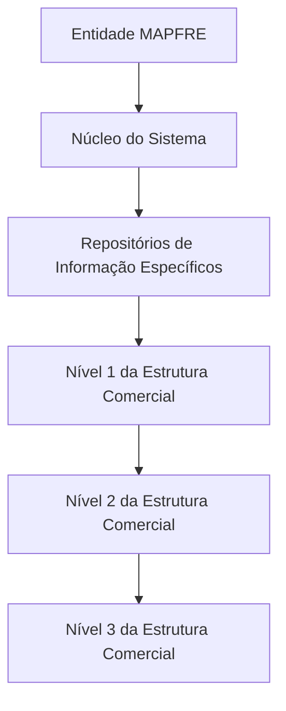

# Relatório de Ingestão de Documento para RAG

**Arquivo de origem:** `01-TRON_01-Doc_01-Mod_01-Comunes_01-Def_02-Estructura-Comercial_Def-Estructura-Comercial.pdf`
**Data de processamento:** 21/09/2026 03:49:03
**Modelo de interpretação:** gpt-5.6-terra (axet-code)
**Prompt utilizado:** [analise_documento_rag.md](file:///Users/gcostabe/dev/AGENTE-CONTEXT-GEN/prompts/analise_documento_rag.md)

---

# Estrutura Comercial de Entidades MAPFRE — Definição, Modelos Organizacionais e Níveis Hierárquicos

## 1. Metadados do Documento
- **Arquivo de Origem:** Não identificado
- **Tipo de Documento:** Especificação Funcional
- **Domínio / Sistema:** Estrutura Comercial de entidades MAPFRE
- **Público-Alvo:** Negócio, Arquitetos, Desenvolvedores e Operação
- **Data/Versão Identificada:** Não identificada

---

## 2. Resumo Executivo & Contexto de Negócio

O documento descreve modelos de organização comercial aplicáveis a empresas e contextualiza o uso desses modelos em entidades seguradoras MAPFRE. A organização comercial deve ser adaptada aos objetivos, à estrutura, às necessidades, à dimensão e à atividade de cada empresa.

São apresentados cinco modelos usuais de organização comercial: por funções, por produtos, geográfica, por clientes e mista. Cada modelo estabelece uma forma distinta de separar departamentos e distribuir responsabilidades comerciais, considerando especialização funcional, linhas de produtos, territórios geográficos ou segmentos de clientes.

Para entidades seguradoras MAPFRE, o documento afirma que as organizações comerciais tradicionalmente possuem estrutura geográfica ou mista, conforme o tamanho da companhia. O material não define critérios objetivos para selecionar um desses modelos, nem detalha processos operacionais associados a cada tipo de estrutura.

No contexto funcional do sistema, o núcleo possibilita codificar a estrutura comercial de uma entidade MAPFRE como uma estrutura piramidal de três níveis. Os dados são mantidos em repositórios de informação específicos, inicialmente entregues às instalações sem conteúdo.

---

## 3. Arquitetura, Componentes & Tecnologias Envolvidas

O documento identifica os seguintes elementos funcionais:

- **Núcleo do Sistema:** componente que permite codificar a estrutura comercial da entidade MAPFRE.
- **Repositórios de informação específicos:** locais destinados ao armazenamento da estrutura comercial codificada.
- **Estrutura comercial piramidal:** modelo hierárquico com três níveis.
- **Entidade MAPFRE:** organização cuja estrutura comercial pode ser cadastrada no sistema.

O texto não identifica tecnologias, linguagens, bancos de dados, interfaces, microsserviços, métodos HTTP, contratos de integração, URLs, ambientes ou mecanismos de autenticação.



> **Nota de Análise:** o documento informa que a estrutura é piramidal e possui três níveis, mas não detalha as regras de relacionamento, cardinalidade, nomenclatura específica das unidades comerciais nem o processo técnico de carga ou manutenção dos repositórios.

---

## 4. Regras de Negócio, Especificações Funcionais & Processos

### Modelos de organização comercial

1. A organização comercial de uma empresa deve ser adaptada aos objetivos, estrutura, necessidades, dimensão e atividade da empresa.
2. O documento apresenta cinco formas usuais de organização comercial:
   - Por funções.
   - Por produtos.
   - Geográfica.
   - Por clientes.
   - Mista.

### Organização comercial por funções

A organização comercial por funções separa as atividades empresariais em diferentes departamentos. Em cada departamento são executadas funções segundo o princípio de especialização. Todos os departamentos são coordenados pela direção ou por níveis superiores.

### Organização comercial por produtos

A organização comercial por produtos aplica-se a companhias que comercializam produtos muito diferentes entre si ou diversas linhas de produtos diferentes. O modelo atribui um departamento a cada produto ou linha de produtos. Cada produto também é organizado funcionalmente.

### Organização comercial geográfica

A organização comercial geográfica subdivide a empresa em diferentes departamentos, sendo estabelecido um departamento para cada zona geográfica em que a empresa desenvolve atividade. Esse modelo é eficaz quando a empresa atua em territórios muito diferentes, nos quais as circunstâncias demandam ações comerciais diferenciadas.

### Organização comercial por clientes

A organização comercial por clientes é estabelecida quando a empresa comercializa produtos para grupos de clientes significativamente diferenciados. Os exemplos apresentados são:

- Grandes superfícies.
- Varejistas.
- Agrupamentos de pequenos varejistas.
- Grandes empresas.
- Administração pública.

### Organização comercial mista

A organização comercial mista tende a ocorrer quando as empresas atingem grandes dimensões e a organização passa a ser mais complexa. Nesse cenário, podem ser combinadas diferentes estruturas organizacionais.

O exemplo fornecido combina uma organização geográfica por zonas com uma estrutura, dentro de cada zona, organizada por clientes ou por produtos.

### Aplicação em entidades seguradoras MAPFRE

Tradicionalmente, as entidades seguradoras MAPFRE utilizam organizações comerciais com estrutura:

- Geográfica; ou
- Mista.

A escolha entre estrutura geográfica ou mista ocorre em função do tamanho da companhia, embora o documento não apresente limiares, métricas ou regras formais para essa decisão.

### Codificação da estrutura comercial no sistema

1. O núcleo do sistema permite codificar a estrutura comercial da entidade MAPFRE.
2. A estrutura comercial é representada como uma pirâmide de três níveis.
3. A codificação é realizada em repositórios de informação específicos.
4. Os repositórios são entregues inicialmente às instalações sem conteúdo.
5. Os níveis identificados são:
   - Nível 1 / Estrutura Comercial.
   - Nível 2 / Estrutura Comercial.
   - Nível 3 / Estrutura Comercial.

---

## 5. Tabelas de Parâmetros, Ambientes e Estruturas de Dados

| Item / Parâmetro | Descrição / Função | Tipo / Valores / Formato | Ambiente / Observações |
| :--- | :--- | :--- | :--- |
| Organização comercial | Estrutura organizacional adaptada aos objetivos, estrutura, necessidades, dimensão e atividade de uma empresa | Por funções, por produtos, geográfica, por clientes ou mista | O documento não define parâmetros de configuração |
| Organização por funções | Separa atividades empresariais em departamentos especializados | Departamentos funcionais coordenados pela direção ou níveis superiores | Baseada no princípio de especialização |
| Organização por produtos | Atribui departamentos a produtos ou linhas de produtos | Produto ou linha de produtos; organização funcional por produto | Indicada para produtos muito diferentes ou múltiplas linhas |
| Organização geográfica | Subdivide a empresa por zonas geográficas | Um departamento por zona geográfica | Eficaz em territórios com circunstâncias comerciais diferenciadas |
| Organização por clientes | Estrutura departamentos conforme grupos diferenciados de clientes | Grandes superfícies, varejistas, agrupamentos de pequenos varejistas, grandes empresas e administração pública | Não há critérios adicionais de segmentação |
| Organização mista | Combina modelos de organização comercial | Exemplo: geográfica por zonas, combinada com clientes ou produtos dentro de cada zona | Associada a empresas de grande dimensão e maior complexidade |
| Entidades seguradoras MAPFRE | Entidades às quais se aplica a estrutura comercial discutida | Estrutura geográfica ou mista | A escolha depende do tamanho da companhia; critérios não detalhados |
| Núcleo do sistema | Permite codificar a estrutura comercial da entidade MAPFRE | Capacidade funcional do sistema | Tecnologias e interfaces não identificadas |
| Repositórios de informação específicos | Armazenam a estrutura comercial codificada | Repositórios inicialmente vazios | Tipo de repositório não identificado |
| Nível 1 / Estrutura Comercial | Primeiro nível da estrutura piramidal | Nível hierárquico | Sem nomenclatura organizacional adicional |
| Nível 2 / Estrutura Comercial | Segundo nível da estrutura piramidal | Nível hierárquico | Sem regras de vínculo detalhadas |
| Nível 3 / Estrutura Comercial | Terceiro nível da estrutura piramidal | Nível hierárquico | Sem regras de vínculo detalhadas |

---

## 6. Bateria de Perguntas & Respostas para RAG (FAQ Sintético)

### P1: Qual é o objetivo da organização comercial descrita no documento?
**R:** A organização comercial deve estruturar as atividades da empresa de forma adaptada aos seus objetivos, necessidades, estrutura, dimensão e atividade. O documento apresenta modelos funcionais, por produtos, geográficos, por clientes e mistos.

### P2: Quais são os modelos de organização comercial apresentados?
**R:** O documento apresenta cinco modelos: organização por funções, por produtos, geográfica, por clientes e mista.

### P3: Como funciona uma organização comercial por funções?
**R:** A organização por funções separa as atividades da empresa em diferentes departamentos. Cada departamento executa funções especializadas, e todos os departamentos são coordenados pela direção ou por níveis superiores.

### P4: Quando a organização comercial por produtos é indicada?
**R:** A organização por produtos é aplicável a companhias que comercializam produtos muito diferentes entre si ou várias linhas de produtos. Cada produto ou linha de produtos recebe um departamento próprio e também é organizado funcionalmente.

### P5: Em que situação a organização comercial geográfica é considerada eficaz?
**R:** A organização geográfica é eficaz quando a empresa opera em territórios muito diferentes, nos quais circunstâncias específicas exigem ações comerciais diferenciadas. O modelo estabelece um departamento para cada zona geográfica de atuação.

### P6: Quais grupos de clientes são citados como exemplo para uma organização comercial por clientes?
**R:** O documento cita grandes superfícies, varejistas, agrupamentos de pequenos varejistas, grandes empresas e administração pública como exemplos de grupos de clientes diferenciados.

### P7: O que caracteriza uma organização comercial mista?
**R:** A organização comercial mista ocorre quando empresas alcançam grandes dimensões e a estrutura organizacional se torna mais complexa. Ela combina diferentes modelos, como organização geográfica por zonas e organização por clientes ou produtos dentro de cada zona.

### P8: Quais tipos de estrutura comercial são tradicionalmente usados por entidades seguradoras MAPFRE?
**R:** O documento informa que entidades seguradoras MAPFRE tradicionalmente utilizam estruturas comerciais geográficas ou mistas, de acordo com o tamanho da companhia.

### P9: Como o sistema representa a estrutura comercial de uma entidade MAPFRE?
**R:** O núcleo do sistema permite codificar a estrutura comercial da entidade MAPFRE como uma estrutura piramidal de três níveis, armazenada em repositórios de informação específicos.

### P10: Quais são os níveis da estrutura comercial codificada pelo sistema?
**R:** A estrutura comercial possui três níveis: Nível 1 / Estrutura Comercial, Nível 2 / Estrutura Comercial e Nível 3 / Estrutura Comercial.

### P11: Os repositórios da estrutura comercial já possuem conteúdo na instalação inicial?
**R:** Não. O documento informa que os repositórios de informação específicos são entregues inicialmente às instalações vazios de conteúdo.

### P12: O documento detalha APIs, tecnologias ou contratos de integração para a estrutura comercial?
**R:** Não. O documento não informa APIs, métodos HTTP, contratos JSON, tecnologias, bancos de dados, URLs, ambientes ou mecanismos de integração relacionados à codificação da estrutura comercial.

---

## 7. Glossário de Termos, Siglas & Conceitos-Chave

- **MAPFRE:** organização mencionada no documento no contexto de entidades seguradoras e suas estruturas comerciais.
- **Estrutura Comercial:** organização hierárquica e funcional adotada para distribuir atividades, responsabilidades ou unidades relacionadas à atividade comercial.
- **Organização por Funções:** modelo que separa atividades em departamentos especializados por função.
- **Organização por Produtos:** modelo que organiza departamentos por produto ou linha de produtos.
- **Organização Geográfica:** modelo que organiza departamentos segundo zonas geográficas de atuação.
- **Organização por Clientes:** modelo que estrutura a organização conforme grupos diferenciados de clientes.
- **Organização Mista:** combinação de dois ou mais modelos de organização comercial.
- **Estrutura Piramidal:** representação hierárquica composta, neste documento, por três níveis.
- **Repositórios de Informação Específicos:** repositórios destinados a armazenar a estrutura comercial codificada.
- **CF:** termo exibido no conteúdo bruto, sem definição no documento.
- **APIs:** termo exibido no conteúdo bruto como parte de “Home Solutions APIs Documentation Zeus”, sem detalhamento funcional ou técnico.

---

## 8. Notas Críticas, Riscos & Limitações

- O documento não identifica o arquivo de origem, autor, data, versão ou responsável pela manutenção.
- Não há detalhamento técnico sobre o núcleo do sistema, os repositórios de informação específicos ou os mecanismos de persistência.
- Não são informados campos de cadastro, chaves, relações hierárquicas, regras de integridade, permissões, trilhas de auditoria ou processos de manutenção da estrutura comercial.
- A estrutura piramidal possui três níveis, mas o documento não define a semântica organizacional, o relacionamento ou a cardinalidade entre Nível 1, Nível 2 e Nível 3.
- A seleção entre estrutura geográfica e mista para entidades seguradoras MAPFRE é associada ao tamanho da companhia, mas não há métricas, critérios ou limiares definidos.
- Não há especificações de APIs, URLs, métodos HTTP, contratos de dados, ambientes, servidores, logs ou procedimentos operacionais.
- O trecho “Home Solutions APIs Documentation Zeus” aparece no conteúdo bruto, mas não é contextualizado nem relacionado explicitamente à estrutura comercial.

---

## 9. Conteúdo Bruto Estruturado (Referência Fiel)

```text
--- [PÁGINA 1 DE 2] ---

DEFINICIÓN de la ESTRUCTURA COMERCIAL
Contexto
Todas las Empresas tienen una Organización Comercial adaptada a sus objetivos, estructura,
necesidades, dimensión y actividad.
Las formas más usuales de Organización Comercial de una compañía son:
Por Funciones.
Por Productos.
Geográfica.
Por Clientes y
Mixta.
La Organización Comercial por Funciones consiste en separar las actividades de la empresa en
diferentes departamentos, en cada uno de ellos se realizan funciones según el principio de
especialización y, a su vez, todos los departamentos están coordinados por la dirección o niveles
superiores.
La Organización Comercial por Productos se aplica a compañías que comercializan productos muy
diferentes entre sí, o varias líneas de productos diferentes. Consiste en asignar un departamento a
cada producto o línea de productos y, a su vez, cada producto se organiza funcionalmente.
La Organización Comercial Geográfica consiste en subdividir la empresa en varios departamentos,
uno para cada zona geográfica en la que la empresa desarrolla su actividad. Esta Organización es
 / 
 CF
Home Solutions APIs Documentation Zeus
EN


--- [PÁGINA 2 DE 2] ---

eficaz cuando la empresa actúa en territorios muy diferentes donde, por ejemplo, las circunstancias
motivan actuaciones comerciales diferenciadas.
La Organización Comercial por Clientes se establece cuando la empresa vende productos a grupos
de clientes muy diferenciados, por ejemplo, a grandes superficies, detallistas, agrupaciones de
minoristas, a grandes empresas, a la administración pública,...
La Organización Comercial Mixta suele darse cuando las empresas alcanzan grandes dimensiones,
la organización se va haciendo cada vez más complicada y surgen las estructuras mixtas: pueden
adoptar una Organización Geográfica por zonas y dentro de cada una de ellas se pueden organizar
por Clientes o por Productos,...
Tradicionalmente en el caso de las entidades aseguradoras de MAPFRE las organizaciones
comerciales suelen tener una estructura Geográfica o Mixta en función del tamaño de la compañía.
Denominaciones de los Niveles de la Estructura Comercial
Denominaciones de los Niveles de la Estructura Comercial
Niveles de la Estructura Comercial
Funcionalmente, el núcleo del Sistema cuenta con la posibilidad de codificar la estructura comercial
de la entidad MAPFRE en una estructura piramidal de tres niveles en repositorios de información
específicos que se entregan inicialmente a las instalaciones vacíos de contenido:
Nivel 1 / Estructura Comercial
Nivel 2 / Estructura Comercial
Nivel 3 / Estructura Comercial
```

---

## Conteúdo Bruto Extraído (Original Completo)

```text
--- [PÁGINA 1 DE 2] ---

DEFINICIÓN de la ESTRUCTURA COMERCIAL
Contexto
Todas las Empresas tienen una Organización Comercial adaptada a sus objetivos, estructura,
necesidades, dimensión y actividad.
Las formas más usuales de Organización Comercial de una compañía son:
Por Funciones.
Por Productos.
Geográfica.
Por Clientes y
Mixta.
La Organización Comercial por Funciones consiste en separar las actividades de la empresa en
diferentes departamentos, en cada uno de ellos se realizan funciones según el principio de
especialización y, a su vez, todos los departamentos están coordinados por la dirección o niveles
superiores.
La Organización Comercial por Productos se aplica a compañías que comercializan productos muy
diferentes entre sí, o varias líneas de productos diferentes. Consiste en asignar un departamento a
cada producto o línea de productos y, a su vez, cada producto se organiza funcionalmente.
La Organización Comercial Geográfica consiste en subdividir la empresa en varios departamentos,
uno para cada zona geográfica en la que la empresa desarrolla su actividad. Esta Organización es
 / 
 CF
Home Solutions APIs Documentation Zeus
EN


--- [PÁGINA 2 DE 2] ---

eficaz cuando la empresa actúa en territorios muy diferentes donde, por ejemplo, las circunstancias
motivan actuaciones comerciales diferenciadas.
La Organización Comercial por Clientes se establece cuando la empresa vende productos a grupos
de clientes muy diferenciados, por ejemplo, a grandes superficies, detallistas, agrupaciones de
minoristas, a grandes empresas, a la administración pública,...
La Organización Comercial Mixta suele darse cuando las empresas alcanzan grandes dimensiones,
la organización se va haciendo cada vez más complicada y surgen las estructuras mixtas: pueden
adoptar una Organización Geográfica por zonas y dentro de cada una de ellas se pueden organizar
por Clientes o por Productos,...
Tradicionalmente en el caso de las entidades aseguradoras de MAPFRE las organizaciones
comerciales suelen tener una estructura Geográfica o Mixta en función del tamaño de la compañía.
Denominaciones de los Niveles de la Estructura Comercial
Denominaciones de los Niveles de la Estructura Comercial
Niveles de la Estructura Comercial
Funcionalmente, el núcleo del Sistema cuenta con la posibilidad de codificar la estructura comercial
de la entidad MAPFRE en una estructura piramidal de tres niveles en repositorios de información
específicos que se entregan inicialmente a las instalaciones vacíos de contenido:
Nivel 1 / Estructura Comercial
Nivel 2 / Estructura Comercial
Nivel 3 / Estructura Comercial
```
