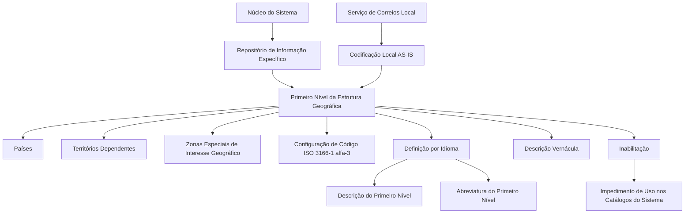

# Definição da Matriz de Âmbitos e Áreas Geográficas — Primeiro Nível da Estrutura Geográfica

## 1. Metadados do Documento
- **Arquivo de Origem:** `Não identificado no conteúdo fornecido`
- **Tipo de Documento:** Especificação Funcional
- **Domínio / Sistema:** Sistema — Estrutura Geográfica / Catálogos
- **Público-Alvo:** Negócio, Analistas Funcionais, Operação e Administradores de Catálogos
- **Data/Versão Identificada:** Não identificada

---

## 2. Resumo Executivo & Contexto de Negócio

O documento descreve a definição do **Primeiro Nível da Estrutura Geográfica** no núcleo do Sistema. Esse nível possui um repositório de informação específico e contém informação referente a países, territórios dependentes e zonas especiais de interesse geográfico.

A especificação define propriedades para cadastrar, identificar, descrever e controlar o uso das chaves geográficas. Entre as propriedades estão idioma, código, descrição, descrição vernácula, abreviatura e inabilitação.

O documento estabelece que os códigos configurados para o Primeiro Nível devem corresponder à norma **ISO 3166-1 alfa-3**, publicada pela Organização Internacional de Normalização. Essa regra padroniza a representação de países, territórios dependentes e zonas geográficas especiais no Sistema.

A documentação também recomenda, para codificação, uso e definição local do catálogo de Categorias, utilizar as codificações realizadas pelo Serviço de Correios Local e carregá-las no Sistema **AS-IS**, isto é, tal como foram produzidas pelo serviço local.

---

## 3. Arquitetura, Componentes & Tecnologias Envolvidas

O documento cita os seguintes elementos funcionais:

| Componente / Conceito | Descrição |
| :--- | :--- |
| Núcleo do Sistema | Componente que permite codificar o Primeiro Nível da Estrutura Geográfica. |
| Repositório de informação específico | Repositório destinado à informação do Primeiro Nível da Estrutura Geográfica. |
| Primeiro Nível da Estrutura Geográfica | Nível que contém informação de países, territórios dependentes e zonas especiais de interesse geográfico. |
| Catálogos do Sistema | Catálogos nos quais um código de nível inabilitado não pode ser utilizado. |
| Serviço de Correios Local | Fonte recomendada para codificações locais a serem carregadas AS-IS no Sistema. |
| ISO 3166-1 alfa-3 | Norma utilizada para os códigos configurados no Primeiro Nível. |
| Home Solutions APIs Documentation Zeus | Texto presente no conteúdo extraído; não há detalhamento funcional adicional sobre esse elemento. |



**Nota de Análise:** o conteúdo não descreve tecnologias de implementação, métodos HTTP, contratos de integração, bancos de dados, URLs de ambiente, autenticação ou interfaces de programação.

---

## 4. Regras de Negócio, Especificações Funcionais & Processos

### 4.1. Codificação do Primeiro Nível da Estrutura Geográfica

1. O núcleo do Sistema possui a capacidade de codificar o Primeiro Nível da Estrutura Geográfica em um repositório de informação específico.
2. O Primeiro Nível contém informações de países.
3. Os códigos configurados no Sistema para esse Primeiro Nível devem corresponder à norma ISO 3166-1 alfa-3.
4. A norma ISO 3166-1 alfa-3 é indicada para representar:
   - Países;
   - Territórios dependentes;
   - Zonas especiais de interesse geográfico.

### 4.2. Propriedades Gerais

1. A propriedade **Idioma** identifica o idioma empregado na definição do nível da estrutura.
2. A propriedade **Código do Primeiro Nível** identifica a chave utilizada para identificar o Primeiro Nível da Estrutura Geográfica no Sistema.
3. A propriedade **Descrição do Primeiro Nível** contém a denominação ou descrição da chave do nível conforme o idioma usado na definição.
4. A propriedade **Descrição Vernácula do Primeiro Nível** contém a denominação ou descrição do Primeiro Nível da Estrutura Geográfica no idioma vernáculo.
5. A propriedade **Abreviatura do Primeiro Nível** contém a denominação ou descrição abreviada do Primeiro Nível, conforme o idioma usado na definição.
6. A propriedade **Inabilitação** estabelece que um Código do Nível inabilitado não pode ser empregado nos catálogos do Sistema.

### 4.3. Recomendação Operacional Local

A recomendação apresentada para codificação, uso e definição local do catálogo de Categorias consiste em utilizar as codificações produzidas pelo Serviço de Correios Local e carregá-las no Sistema AS-IS.

**Nota de Análise:** o documento não detalha o processo técnico de carga, responsáveis pela aprovação, frequência de atualização, mecanismo de validação ou critérios para tratamento de divergências nas codificações do Serviço de Correios Local.

---

## 5. Tabelas de Parâmetros, Ambientes e Estruturas de Dados

| Item / Parâmetro | Descrição / Função | Tipo / Valores / Formato | Ambiente / Observações |
| :--- | :--- | :--- | :--- |
| Idioma | Identifica o idioma empregado na definição do nível da estrutura. | Códigos que identificam idiomas, como espanhol, inglês e turco. | O documento apresenta exemplos, mas não define uma lista completa de códigos. |
| Código do Primeiro Nível | Identifica a chave do Primeiro Nível da Estrutura Geográfica no Sistema. | ISO 3166-1 alfa-3. | Aplicável a países, territórios dependentes e zonas especiais de interesse geográfico. |
| Descrição do Primeiro Nível | Contém a denominação ou descrição da chave do nível. | Texto conforme o idioma utilizado na definição. | Associada ao idioma da definição. |
| Descrição Vernácula do Primeiro Nível | Contém a denominação ou descrição do Primeiro Nível no idioma vernáculo. | Texto. | Reflete o idioma vernáculo da estrutura geográfica. |
| Abreviatura do Primeiro Nível | Contém a denominação ou descrição abreviada do Primeiro Nível. | Texto abreviado conforme o idioma usado na definição. | Associada ao idioma da definição. |
| Inabilitação | Define que o Código do Nível não pode ser utilizado nos catálogos do Sistema. | Estado de inabilitação. | Impede o emprego do código nos catálogos do Sistema. |
| Codificação local | Codificação recomendada para uso e definição local do catálogo de Categorias. | Codificações do Serviço de Correios Local. | Deve ser carregada AS-IS no Sistema. |

### Exemplos apresentados para idioma espanhol

| Chave do Primeiro Nível | Descrição Vernácula | Abreviatura |
| :--- | :--- | :--- |
| PAN | Panamá | Pan. |
| USA | Estados Unidos / United States of America | USA |
| ESP | España | Esp. |
| MEX | México / Estados Unidos Mexicanos | Méx |
| ... | ... | ... |

**Nota de Análise:** a extração apresenta “Estados Unidos” e “United States of America” associados ao código `USA`, bem como “México” e “Estados Unidos Mexicanos” associados ao código `MEX`. O documento não esclarece formalmente se esses pares representam descrições por idioma, descrições vernáculas ou variações de denominação.

---

## 6. Bateria de Perguntas & Respostas para RAG (FAQ Sintético)

### P1: Qual é a finalidade do Primeiro Nível da Estrutura Geográfica no Sistema?
**R:** O Primeiro Nível da Estrutura Geográfica permite codificar, em um repositório de informação específico do núcleo do Sistema, informações sobre países, territórios dependentes e zonas especiais de interesse geográfico.

### P2: Qual norma deve ser usada para configurar os códigos do Primeiro Nível da Estrutura Geográfica?
**R:** Os códigos do Primeiro Nível devem corresponder à norma ISO 3166-1 alfa-3, publicada pela Organização Internacional de Normalização.

### P3: Que entidades geográficas são representadas pela configuração baseada em ISO 3166-1 alfa-3?
**R:** A configuração baseada em ISO 3166-1 alfa-3 representa países, territórios dependentes e zonas especiais de interesse geográfico.

### P4: O que a propriedade Idioma representa na definição de um nível geográfico?
**R:** A propriedade Idioma identifica o idioma empregado na definição do nível da Estrutura Geográfica. O documento apresenta como exemplos códigos que identificam idiomas como espanhol, inglês e turco.

### P5: Qual é a função do Código do Primeiro Nível?
**R:** O Código do Primeiro Nível identifica a chave que será usada para identificar o Primeiro Nível da Estrutura Geográfica dentro do Sistema.

### P6: Qual é a diferença entre Descrição do Primeiro Nível e Descrição Vernácula do Primeiro Nível?
**R:** A Descrição do Primeiro Nível contém a denominação ou descrição da chave conforme o idioma utilizado na definição. A Descrição Vernácula do Primeiro Nível contém a denominação ou descrição do Primeiro Nível da Estrutura Geográfica conforme o idioma vernáculo.

### P7: Como deve ser utilizada a Abreviatura do Primeiro Nível?
**R:** A Abreviatura do Primeiro Nível deve conter a denominação ou descrição abreviada do Primeiro Nível, de acordo com o idioma empregado na definição.

### P8: O que acontece quando um Código do Nível é inabilitado?
**R:** Quando a propriedade Inabilitação estabelece que um Código do Nível está inabilitado, esse código não pode ser empregado nos catálogos do Sistema.

### P9: Qual prática operacional é recomendada para a codificação local do catálogo de Categorias?
**R:** O documento recomenda utilizar as codificações realizadas pelo Serviço de Correios Local e carregá-las AS-IS no Sistema.

### P10: O documento especifica como realizar tecnicamente a carga das codificações do Serviço de Correios Local?
**R:** Não. O documento recomenda que as codificações do Serviço de Correios Local sejam carregadas AS-IS, mas não descreve interface, mecanismo técnico, frequência de carga, validações ou procedimentos de tratamento de erro.

### P11: Quais exemplos de códigos de Primeiro Nível são apresentados no documento?
**R:** O documento apresenta os códigos `PAN`, `USA`, `ESP` e `MEX` como exemplos, com descrições e abreviaturas associadas no contexto de uma definição em espanhol.

### P12: O documento detalha APIs, métodos HTTP ou contratos JSON para a Estrutura Geográfica?
**R:** Não. Embora o texto extraído contenha a expressão “Home Solutions APIs Documentation Zeus”, não há detalhamento de APIs, métodos HTTP, endpoints, contratos JSON, autenticação ou integração técnica.

---

## 7. Glossário de Termos, Siglas & Conceitos-Chave

- **AS-IS:** Expressão usada para indicar que as codificações do Serviço de Correios Local devem ser carregadas no Sistema tal como foram produzidas, sem transformação descrita no documento.
- **Código do Primeiro Nível:** Chave que identifica o Primeiro Nível da Estrutura Geográfica no Sistema.
- **Descrição Vernácula:** Denominação ou descrição do Primeiro Nível da Estrutura Geográfica conforme o idioma vernáculo.
- **Estrutura Geográfica:** Estrutura organizada em níveis para representação geográfica no Sistema.
- **ISO 3166-1 alfa-3:** Norma indicada pelo documento para codificar países, territórios dependentes e zonas especiais de interesse geográfico.
- **Primeiro Nível:** Nível da Estrutura Geográfica que contém a informação de países.
- **Serviço de Correios Local:** Entidade cujas codificações locais são recomendadas como modelo para carregamento no Sistema.
- **Inabilitação:** Propriedade que impede o uso de um Código do Nível nos catálogos do Sistema.
- **Catálogos do Sistema:** Catálogos nos quais códigos inabilitados não podem ser empregados.

---

## 8. Notas Críticas, Riscos & Limitações

- O documento não identifica nome do arquivo de origem, autor, data, versão, responsável ou histórico de alterações.
- O documento não descreve tecnologia de persistência, modelo físico de dados, APIs, integrações, endpoints, autenticação, ambientes ou rotas de log.
- O documento não apresenta o conjunto completo de códigos de idioma aceitos pelo Sistema.
- O documento não informa se o Sistema valida automaticamente a conformidade dos códigos com a norma ISO 3166-1 alfa-3.
- O documento não define o fluxo de aprovação, atualização, exclusão ou reabilitação de códigos geográficos.
- A recomendação de carga AS-IS das codificações do Serviço de Correios Local não detalha mecanismos de ingestão, reconciliação, periodicidade, validação ou tratamento de inconsistências.
- Há referência a documentos funcionais relacionados — “Denominaciones Locales de los Niveles de la Estructura Geográfica” e “Preguntas frecuentes” —, mas esses documentos não foram fornecidos.
- **Nota de Análise:** o documento lista “Home Solutions APIs Documentation Zeus”, mas não oferece detalhamento adicional que permita determinar sua relação funcional ou técnica com a Estrutura Geográfica.

---

## 9. Conteúdo Bruto Estruturado (Referência Fiel)

```text
--- [PÁGINA 1 DE 3] ---

DEFINICIÓN de la MATRIZ DE ÁMBITOS y
ÁREAS GEOGRÁFICAS
Propiedades Generales
Funcionalmente, el núcleo del Sistema cuenta con la posibilidad de codificar el Primer Nivel de la
estructura Geográfica en un repositorio de información específico.
Idioma
Esta propiedad identifica el Idioma empleado en la definición del Nivel de la estructura, como por
ejemplo con los códigos que identifiquen a los idiomas español, inglés, turco,...
Código del Primer Nivel
Este atributo identifica la clave que identificará al Primer Nivel de la estructura Geográfica en el
Sistema.
NOTA: Puesto que este Primer Nivel contiene la información de los Países, los códigos que se han
de configurar en el sistema son aquellos correspondientes a la Norma ISO 3166-1 alfa-3 publicada
por la Organización Internacional de Normalización, para representar países, territorios dependientes
y zonas especiales de interés geográfico.
Descripción del Primer Nivel
Esta propiedad contiene la denominación o descripción de la clave del Nivel, de acuerdo con el
idioma utilizado en la definición.
 / 
 CF
Home Solutions APIs Documentation Zeus
EN


--- [PÁGINA 2 DE 3] ---

Descripción Vernácula del Primer Nivel
Esta propiedad contiene la denominación o descripción del Primer Nivel de la Estructura Geográfica
de acuerdo con el idioma vernáculo.
Abreviatura del Primer Nivel
Esta propiedad contiene la denominación o descripción abreviada del Primer Nivel, de acuerdo con el
idioma utilizado en la definición.
A modo de ejemplo y si el Idioma utilizado en la definición es el español:
Clave del Primer
Nivel
Descripción Vernáculo Abreviatura
PAN Panamá Panamá Pan.
USA Estados
Unidos
United States of America USA
ESP España España Esp.
MEX México Estados Unidos
Mexicanos
Méx
... ... ...
Otras Propiedades
Inhabilitación
Esta propiedad establece que el Código del Nivel está inhabilitado para poder ser empleado en los
catálogos del Sistema.
Vínculos
Relación de Directrices y Documentos funcionales cuya lectura recomendada para evitar que la
interpretación aislada del presente documento pueda conducir a error.
Denominaciones Locales de los Niveles de la Estructura Geográfica
Preguntas frecuentes


--- [PÁGINA 3 DE 3] ---

(1) ¿Existe alguna recomendación operativa que deba ser tomada en consideración localmente en la
codificación, uso y definición del catálogo de Categorías en el Sistema?
Una práctica que se recomienda como modelo es utilizar las codificaciones realizadas por el Servicio
de Correos Local y cargarlas AS-IS en el Sistema.
Audiencia
```
