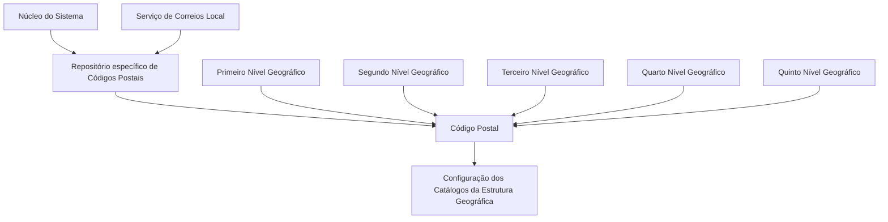

# Definição de Códigos Postais Associados à Estrutura Geográfica

## 1. Metadados do Documento
- **Arquivo de Origem:** Não identificado no texto fornecido
- **Tipo de Documento:** Especificação Técnica / Funcional
- **Domínio / Sistema:** Estrutura Geográfica e codificação de Códigos Postais
- **Público-Alvo:** Não identificado explicitamente; o conteúdo é aplicável à configuração e manutenção da Estrutura Geográfica
- **Data/Versão Identificada:** Não identificada

---

## 2. Resumo Executivo & Contexto de Negócio

O documento define propriedades para cadastrar e manter Códigos Postais associados a uma Estrutura Geográfica composta por cinco níveis. O núcleo do Sistema permite codificar esses Códigos Postais em um repositório de informação específico, entregue inicialmente sem conteúdo.

Cada Código Postal é relacionado por meio das chaves do Primeiro, Segundo, Terceiro, Quarto e Quinto Níveis da Estrutura Geográfica. O documento apresenta exemplos para Espanha, Madrid, incluindo casos de múltiplos Códigos Postais para uma mesma combinação de níveis geográficos.

A especificação também prevê atributos descritivos, como a descrição do Código Postal e a descrição vernácula do Quarto Nível. A coerência entre o idioma da descrição do Código Postal e o idioma usado no Primeiro Nível geográfico é explicitamente recomendada.

Há controles de operação por meio das propriedades **Inhabilitación** e **Nivel Real**. A primeira impede o uso do Código Postal na configuração dos catálogos da Estrutura Geográfica; a segunda diferencia Códigos Postais reais de níveis genéricos e possui uso interno do núcleo da Aplicação.

O documento recomenda que a codificação seja carregada e mantida ao longo do tempo a partir do Serviço de Correios Local. Também referencia documentos funcionais e diretrizes relacionados, especialmente sobre denominações locais dos níveis da Estrutura Geográfica.

---

## 3. Arquitetura, Componentes & Tecnologias Envolvidas

O documento não descreve tecnologias, microsserviços, bancos de dados, APIs, contratos HTTP, URLs, servidores ou ambientes. A arquitetura apresentada é funcional e baseada em um repositório específico de informação para os Códigos Postais vinculados à Estrutura Geográfica.

### Componentes e conceitos identificados

| Componente / Conceito | Função identificada |
| :--- | :--- |
| Núcleo do Sistema / Aplicação | Possui a possibilidade de codificar Códigos Postais associados à Estrutura Geográfica. |
| Repositório de informação específico | Armazena a codificação dos Códigos Postais; é entregue inicialmente vazio. |
| Estrutura Geográfica | Estrutura organizada em Primeiro, Segundo, Terceiro, Quarto e Quinto Níveis. |
| Código Postal | Chave associada aos cinco níveis da Estrutura Geográfica. |
| Serviço de Correios Local | Fonte recomendada para carga e manutenção das codificações postais. |
| Catálogos da Estrutura Geográfica | Configurações nas quais um Código Postal inabilitado não pode ser empregado. |



> **Nota de Análise:** O documento não detalha o modelo físico do repositório, os métodos de manutenção, os contratos de integração, os tipos de dados dos campos ou os mecanismos técnicos usados pelo núcleo da Aplicação.

---

## 4. Regras de Negócio, Especificações Funcionais & Processos

### 4.1 Codificação de Códigos Postais

1. O núcleo do Sistema permite codificar Códigos Postais associados à Estrutura Geográfica.
2. A codificação ocorre em um repositório de informação específico.
3. O repositório é entregue inicialmente vazio de conteúdo.
4. O Código Postal é associado aos cinco níveis da Estrutura Geográfica:
   - Primeiro Nível;
   - Segundo Nível;
   - Terceiro Nível;
   - Quarto Nível;
   - Quinto Nível.

### 4.2 Chaves dos níveis geográficos

Cada atributo de código identifica um nível específico da Estrutura Geográfica:

1. **Código do Primeiro Nível:** identifica o Primeiro Nível da Estrutura Geográfica.
2. **Código do Segundo Nível:** identifica o Segundo Nível da Estrutura Geográfica.
3. **Código do Terceiro Nível:** identifica o Terceiro Nível da Estrutura Geográfica.
4. **Código do Quarto Nível:** identifica o Quarto Nível da Estrutura Geográfica.
5. **Código do Quinto Nível:** identifica o Quinto Nível da Estrutura Geográfica.

### 4.3 Associação do Código Postal

O atributo Código Postal contém a chave que identifica o Código Postal associado aos cinco níveis da Estrutura Geográfica.

O exemplo fornecido utiliza a definição em espanhol para o Primeiro Nível, com a combinação:

- `ESP - España`
- `13 - Madrid`
- `28 - Madrid`

O documento demonstra que:

- Pode existir mais de um Código Postal para uma mesma combinação de chaves geográficas.
- O Quinto Nível pode ser representado por valores como `ZZZZ - Todas las Calles`, `ZZZZ - Todos los Distritos`, `0001 - Barriada 1` e `0A0B - No aplica`.
- A informação dos exemplos foi obtida de **Correos**.

### 4.4 Descrição do Código Postal

A propriedade **Descripción del Código Postal** contém a denominação ou descrição do Código Postal.

A denominação deve, por coerência, estar em consonância com o idioma utilizado na definição do Primeiro Nível da Estrutura Geográfica ao qual o Código Postal está associado.

### 4.5 Descrição vernácula do Quarto Nível

A propriedade **Descripción Vernácula del Cuarto Nivel** contém a denominação ou descrição do Quarto Nível da Estrutura Geográfica de acordo com o idioma vernáculo do Primeiro Nível geográfico ao qual esse Quarto Nível pertence.

### 4.6 Inabilitação

A propriedade **Inhabilitación** estabelece que o Código Postal está inabilitado para ser utilizado na configuração dos catálogos da Estrutura Geográfica.

> **Nota de Análise:** O documento não especifica os valores permitidos para a propriedade Inhabilitación, nem descreve o comportamento operacional de consulta, edição ou reabilitação de um registro inabilitado.

### 4.7 Nível Real

A propriedade **Nivel Real** estabelece se o Código Postal é:

- um **Código Real**; ou
- um **Nível Genérico**.

Pode existir um único registro com essa propriedade não ativada para cada subconjunto formado pelo Primeiro, Terceiro e Quarto Níveis da Estrutura Geográfica.

A propriedade Nivel Real é de uso interno, criada pelo e para uso do núcleo da Aplicação.

### 4.8 Recomendação operacional

A prática considerada modélica pelo documento é carregar e manter ao longo do tempo as codificações realizadas pelo Serviço de Correios Local.

### 4.9 Documentação relacionada

A interpretação do documento não deve ocorrer de forma isolada. A leitura recomendada inclui:

- **Denominaciones Locales de los Niveles de la Estructura Geográfica**;
- **Preguntas frecuentes**.

---

## 5. Tabelas de Parâmetros, Ambientes e Estruturas de Dados

### 5.1 Propriedades da codificação de Código Postal

| Item / Parâmetro | Descrição / Função | Tipo / Valores / Formato | Ambiente / Observações |
| :--- | :--- | :--- | :--- |
| Código do Primeiro Nível | Chave que identifica o Primeiro Nível da Estrutura Geográfica. | Não especificado. | Participa da associação do Código Postal à Estrutura Geográfica. |
| Código do Segundo Nível | Chave que identifica o Segundo Nível da Estrutura Geográfica. | Não especificado. | Participa da associação do Código Postal à Estrutura Geográfica. |
| Código do Terceiro Nível | Chave que identifica o Terceiro Nível da Estrutura Geográfica. | Não especificado. | Participa da associação do Código Postal à Estrutura Geográfica. |
| Código do Quarto Nível | Chave que identifica o Quarto Nível da Estrutura Geográfica. | Não especificado. | Participa da associação do Código Postal à Estrutura Geográfica. |
| Código do Quinto Nível | Chave que identifica o Quinto Nível da Estrutura Geográfica. | Não especificado. | Participa da associação do Código Postal à Estrutura Geográfica. |
| Código Postal | Chave que identifica o Código Postal associado aos cinco níveis geográficos. | Exemplos: `28607`, `28801`, `28802`, `28803`, `28100`, `28108`, `28921`. | Informação de exemplo obtida de Correos. |
| Descrição do Código Postal | Denominação ou descrição do Código Postal. | Texto; formato não especificado. | Deve estar em consonância com o idioma do Primeiro Nível associado. |
| Descrição Vernácula do Quarto Nível | Denominação ou descrição do Quarto Nível segundo o idioma vernáculo do Primeiro Nível correspondente. | Texto; formato não especificado. | Associada ao idioma vernáculo do Primeiro Nível geográfico. |
| Inhabilitación | Define que o Código Postal não pode ser usado na configuração dos catálogos da Estrutura Geográfica. | Valores não especificados. | Impede emprego do Código Postal nos catálogos geográficos. |
| Nivel Real | Define se o Código Postal é real ou corresponde a um nível genérico. | Ativado ou não ativado; representação técnica não especificada. | Uso interno do núcleo da Aplicação. |

### 5.2 Exemplos de associação geográfica e Código Postal

| Chaves dos Níveis 1 / 2 / 3 / 4 | Chave / Nome do Quinto Nível | Código Postal | Observações |
| :--- | :--- | :--- | :--- |
| `ESP - 13 - 28 - 0001` | `ZZZZ - Todas las Calles` | `28607` | Exemplo para Espanha e Madrid. |
| `ESP - 13 - 28 - 0002` | `ZZZZ - Todos los Distritos` | `28801` | Exemplo para Espanha e Madrid. |
| `ESP - 13 - 28 - 0002` | `ZZZZ - Todos los Distritos` | `28802` | Mesmo conjunto de chaves do exemplo anterior, com Código Postal distinto. |
| `ESP - 13 - 28 - 0002` | `0001 - Barriada 1` | `28803` | Exemplo para Espanha e Madrid. |
| `ESP - 13 - 28 - 0003` | `ZZZZ - Todos los Distritos` | `28100` | Exemplo para Espanha e Madrid. |
| `ESP - 13 - 28 - 0003` | `ZZZZ - Todos los Distritos` | `28108` | Mesmo conjunto de chaves do exemplo anterior, com Código Postal distinto. |
| `ESP - 13 - 28 - 0004` | `0A0B - No aplica` | `28921` | Exemplo para Espanha e Madrid. |

### 5.3 Ambientes, servidores e integrações

| Item / Parâmetro | Descrição / Função | Tipo / Valores / Formato | Ambiente / Observações |
| :--- | :--- | :--- | :--- |
| Ambientes técnicos | Não identificados. | Não aplicável. | O documento não apresenta desenvolvimento, homologação, produção ou URLs. |
| Servidores | Não identificados. | Não aplicável. | O documento não apresenta hosts, portas ou rotas. |
| Integração com Correos | Correos é indicado como fonte da informação dos exemplos. | Mecanismo não especificado. | Não há contrato, frequência, interface ou processo de integração descrito. |
| Serviço de Correios Local | Fonte recomendada para carga e manutenção das codificações. | Não especificado. | Recomendação operacional; não há mecanismo técnico descrito. |

---

## 6. Bateria de Perguntas & Respostas para RAG (FAQ Sintético)

### P1: Qual é a finalidade do repositório específico de Códigos Postais?
**R:** O repositório específico armazena a codificação dos Códigos Postais associados à Estrutura Geográfica. O documento informa que esse repositório é entregue inicialmente vazio de conteúdo.

### P2: Quais níveis geográficos são usados para associar um Código Postal?
**R:** Um Código Postal é associado ao Primeiro, Segundo, Terceiro, Quarto e Quinto Níveis da Estrutura Geográfica. Cada nível possui uma chave de identificação correspondente.

### P3: O que representa a propriedade Código Postal?
**R:** A propriedade Código Postal contém a chave que identifica o Código Postal associado aos cinco níveis da Estrutura Geográfica.

### P4: Pode haver mais de um Código Postal para a mesma combinação de níveis geográficos?
**R:** Sim. Os exemplos mostram que a combinação `ESP - 13 - 28 - 0002` com o Quinto Nível `ZZZZ - Todos los Distritos` possui os Códigos Postais `28801` e `28802`. A combinação `ESP - 13 - 28 - 0003` com o mesmo Quinto Nível também possui os Códigos Postais `28100` e `28108`.

### P5: Como a descrição de um Código Postal deve considerar o idioma?
**R:** A descrição ou denominação do Código Postal deve, por coerência, estar em consonância com o idioma utilizado na definição do Primeiro Nível da Estrutura Geográfica ao qual o Código Postal está associado.

### P6: O que é a Descrição Vernácula do Quarto Nível?
**R:** A Descrição Vernácula do Quarto Nível contém a denominação ou descrição do Quarto Nível da Estrutura Geográfica de acordo com o idioma vernáculo do Primeiro Nível geográfico ao qual esse Quarto Nível pertence.

### P7: Qual é o efeito da propriedade Inhabilitación?
**R:** A propriedade Inhabilitación estabelece que o Código Postal está inabilitado para ser empregado na configuração dos catálogos da Estrutura Geográfica.

### P8: O que a propriedade Nivel Real diferencia?
**R:** A propriedade Nivel Real estabelece se o Código Postal é um Código Real ou um Nível Genérico. O documento informa que pode existir um único registro com a propriedade não ativada para cada subconjunto formado pelo Primeiro, Terceiro e Quarto Níveis geográficos.

### P9: A propriedade Nivel Real deve ser manipulada por usuários funcionais?
**R:** O documento informa que Nivel Real é uma propriedade de uso interno, criada pelo e para uso do núcleo da Aplicação. Não há instruções adicionais sobre sua manipulação por usuários funcionais.

### P10: Qual é a recomendação operacional para manter a codificação dos Códigos Postais?
**R:** A prática modélica indicada é carregar e manter ao longo do tempo as codificações realizadas pelo Serviço de Correios Local.

### P11: Qual é a origem da informação apresentada nos exemplos de Códigos Postais?
**R:** O documento declara que a informação dos exemplos foi obtida de Correos.

### P12: Quais documentos relacionados devem ser consultados para evitar interpretação isolada?
**R:** O documento recomenda a leitura de **Denominaciones Locales de los Niveles de la Estructura Geográfica** e de **Preguntas frecuentes**, para evitar que a interpretação isolada do documento conduza a erro.

---

## 7. Glossário de Termos, Siglas & Conceitos-Chave

- **Código Postal:** Chave que identifica um Código Postal associado aos cinco níveis da Estrutura Geográfica.
- **Estrutura Geográfica:** Estrutura composta por Primeiro, Segundo, Terceiro, Quarto e Quinto Níveis geográficos.
- **Primeiro Nível:** Primeiro nível da Estrutura Geográfica, identificado por uma chave e associado a um idioma de definição.
- **Segundo Nível:** Segundo nível da Estrutura Geográfica, identificado por uma chave.
- **Terceiro Nível:** Terceiro nível da Estrutura Geográfica, identificado por uma chave.
- **Quarto Nível:** Quarto nível da Estrutura Geográfica, identificado por uma chave e passível de descrição vernácula.
- **Quinto Nível:** Quinto nível da Estrutura Geográfica, identificado por uma chave.
- **Descrição Vernácula:** Denominação ou descrição no idioma vernáculo do Primeiro Nível geográfico correspondente.
- **Inhabilitación:** Propriedade que impede o uso de um Código Postal na configuração dos catálogos da Estrutura Geográfica.
- **Nivel Real:** Propriedade interna que determina se o Código Postal é um Código Real ou um Nível Genérico.
- **Código Real:** Classificação possível definida pela propriedade Nivel Real.
- **Nível Genérico:** Classificação possível definida pela propriedade Nivel Real.
- **Correos:** Fonte indicada para a informação dos exemplos apresentados no documento.
- **Serviço de Correios Local:** Serviço cujas codificações devem ser carregadas e mantidas ao longo do tempo, conforme recomendação operacional.
- **ESP:** Código apresentado no exemplo para Espanha; o documento associa `ESP` a `España`.

---

## 8. Notas Críticas, Riscos & Limitações

- O repositório de Códigos Postais é entregue inicialmente vazio; a disponibilidade de dados depende da carga inicial e da manutenção posterior.
- O documento recomenda a carga e manutenção baseada nas codificações do Serviço de Correios Local, mas não detalha frequência, responsabilidades, validações, mecanismos de integração ou controles de qualidade.
- A informação dos exemplos foi obtida de Correos; não são apresentadas regras de atualização, vigência ou tratamento de divergências entre fontes.
- Não são especificados tipos de dados, tamanhos, obrigatoriedade, chaves únicas, índices ou relacionamentos físicos do repositório.
- Não são descritos métodos de consulta, criação, alteração, exclusão, aprovação ou auditoria de Códigos Postais.
- A propriedade Nivel Real possui regra de unicidade para registros não ativados dentro de subconjuntos formados pelo Primeiro, Terceiro e Quarto Níveis, mas o documento não descreve como essa restrição é tecnicamente validada.
- A propriedade Inhabilitación impede o uso na configuração de catálogos, porém o documento não especifica seu impacto sobre registros já configurados.
- O documento não apresenta arquitetura técnica, ambientes, servidores, integrações técnicas, APIs, logs, permissões ou matriz de responsabilidades.
- A interpretação isolada é explicitamente desaconselhada; devem ser consultados os documentos sobre denominações locais dos níveis da Estrutura Geográfica e perguntas frequentes.

---

## 9. Conteúdo Bruto Estruturado (Referência Fiel)

```text
--- [PÁGINA 1 DE 3] ---

DEFINICIÓN de Códigos Postales
Propiedades Generales
Funcionalmente, el núcleo del Sistema cuenta con la posibilidad de codificar los Códigos Postales
asociados a la estructura Geográfica en un repositorio de información específico que se entrega
inicialmente a las instalaciones vacío de contenido.
Código del Primer Nivel
Este atributo contiene la clave que identificará el Primer Nivel de la estructura Geográfica.
Código del Segundo Nivel
Este atributo contiene la clave que identificará el Segundo Nivel de la estructura Geográfica.
Código del Tercer Nivel
Este atributo contiene la clave que identificará el Tercer Nivel de la estructura Geográfica.
Código del Cuarto Nivel
Este atributo contiene la clave que identificará el Cuarto Nivel de la estructura Geográfica.
Código del Quinto Nivel
Este atributo sostiene la clave que identifica al Quinto Nivel de la estructura Geográfica.
 /
 CF
Home Solutions APIs Documentation Zeus
EN


--- [PÁGINA 2 DE 3] ---

Código Postal
Esta Propiedad contiene la clave que identifica el Código Postal asociado a los cinco niveles de la
estructura geográfica.
A modo de ejemplo y si el Idioma utilizado en la definición del Primer Nivel de la Estructura es el
español para ESP - España / 13 - Madrid y 28 - Madrid:
Claves de Niveles ½/¾ Clave/Nombre 5º Nivel Código Postal
ESP - 13 - 28 - 0001 ZZZZ - Todas las Calles 28607
... ... ...
ESP - 13 - 28 - 0002 ZZZZ - Todos los Distritos 28801
ESP - 13 - 28 - 0002 ZZZZ - Todos los Distritos 28802
ESP - 13 - 28 - 0002 0001 - Barriada 1 28803
... ... ...
ESP - 13 - 28 - 0003 ZZZZ - Todos los Distritos 28100
ESP - 13 - 28 - 0003 ZZZZ - Todos los Distritos 28108
... ... ...
ESP - 13 - 28 - 0004 0A0B - No aplica 28921
... ... ...
NOTA: Información obtenida de Correos
Descripción del Código Postal
Esta propiedad contiene la denominación o descripción del Código Postal (denominación que por
coherencia debería estar en consonancia con el idioma utilizado en la definición del primer nivel de la
estructura al que está asociado).
Descripción Vernácula del Cuarto Nivel


--- [PÁGINA 3 DE 3] ---

Esta propiedad contiene la denominación o descripción del Cuarto Nivel de la Estructura Geográfica
de acuerdo con el idioma vernáculo del Primer Nivel de la estructura geográfica al que pertenezca.
Otras Propiedades
Inhabilitación
Esta propiedad establece que el Código Postal está inhabilitado para poder ser empleado en la
configuración de los catálogos de la Estructura Geográfica.
Nivel Real
Esta propiedad establece que el Código Postal es un Código Real o un Nivel Genérico (puede existir
un único Registro con esta Propiedad sin activar por cada subconjunto conformado por el Primer,
Tercer y Cuarto Niveles de la estructura Geográfica)
NOTA: Esta propiedad es de uso interno, creada por y para uso del núcleo de la Aplicación.
Vínculos
Relación de Directrices y Documentos funcionales cuya lectura recomendada para evitar que la
interpretación aislada del presente documento pueda conducir a error.
Denominaciones Locales de los Niveles de la Estructura Geográfica
Preguntas frecuentes
(1) ¿Existe alguna recomendación operativa que deba ser tomada en consideración localmente en la
codificación, uso y definición de los Códigos Postales de la Estructura Geográfica?
Una práctica modélica es cargar y mantener en el tiempo las codificaciones realizadas por el Servicio
de Correos Local.
Audiencia
```
