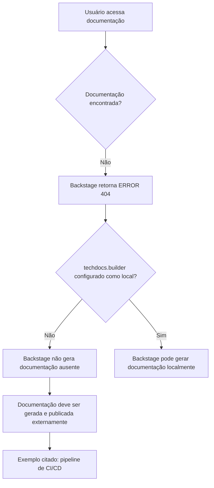

# Página de Erro 404 do Backstage TechDocs — Documentação Não Encontrada

## 1. Metadados do Documento
- **Arquivo de Origem:** `Não identificado`
- **Tipo de Documento:** `Não identificado; conteúdo extraído corresponde a uma página de erro`
- **Domínio / Sistema:** `Backstage / TechDocs`
- **Público-Alvo:** `Desenvolvedores, Arquitetos, Operação`
- **Data/Versão Identificada:** `Não identificada`

---

## 2. Resumo Executivo & Contexto de Negócio

O conteúdo registra uma página de erro HTTP 404 informando que a documentação solicitada não foi encontrada. A página pertence a uma instância do Backstage que apresenta navegação para “Home”, “Solutions”, “APIs”, “Documentation” e “Zeus”.

A mensagem técnica indica que a configuração `techdocs.builder` não está definida como `local`. Portanto, essa instância do Backstage não gerará documentação quando os documentos não forem encontrados.

O texto orienta que a documentação dos projetos deve ser gerada e publicada por um processo externo, com um pipeline de CI/CD citado como exemplo. Como alternativa, a configuração `techdocs.builder` pode ser alterada para `local`, permitindo a geração da documentação pela própria instância do Backstage.

Não há detalhes sobre o projeto, a documentação ausente, a configuração efetiva, o pipeline responsável, URLs de publicação ou procedimentos operacionais de correção.

---

## 3. Arquitetura, Componentes & Tecnologias Envolvidas

Os componentes e termos identificados são:

| Componente / Termo | Papel descrito |
| :--- | :--- |
| Backstage | Aplicação que exibe a página de erro e hospeda a navegação de documentação. |
| TechDocs | Recurso citado pela configuração `techdocs.builder`. |
| `techdocs.builder` | Configuração que não está definida como `local`. |
| Gerador externo | Processo externo responsável por gerar e publicar documentação quando o builder não é local. |
| CI/CD pipeline | Exemplo de processo externo para geração e publicação de documentação. |
| Documentação do projeto | Conteúdo que deveria estar gerado e publicado para ser exibido. |
| Zeus | Item presente na navegação da página. Não há detalhamento adicional. |



> **Nota de Análise:** O conteúdo não informa como o Backstage localiza documentos, quais repositórios estão envolvidos, nem como o processo externo de CI/CD é implementado.

---

## 4. Regras de Negócio, Especificações Funcionais & Processos

1. A solicitação de documentação resultou em `ERROR 404: Page not found`.
2. A instância Backstage apresentada não gera documentos ausentes porque `techdocs.builder` não está configurado como `local`.
3. Quando a documentação não for encontrada nessa configuração, a documentação do projeto deve ser:
   1. Gerada por um processo externo.
   2. Publicada por um processo externo.
4. Um pipeline de CI/CD é apresentado como exemplo de processo externo de geração e publicação.
5. Como alternativa à geração externa, a configuração `techdocs.builder` pode ser modificada para `local`.
6. A página disponibiliza a orientação “Go back” e solicita contato com o suporte caso o erro seja considerado um defeito.

> **Nota de Análise:** O documento não define responsáveis, critérios de publicação, comandos, formatos de documentação, localização dos artefatos ou etapas concretas do pipeline CI/CD.

---

## 5. Tabelas de Parâmetros, Ambientes e Estruturas de Dados

| Item / Parâmetro | Descrição / Função | Tipo / Valores / Formato | Ambiente / Observações |
| :--- | :--- | :--- | :--- |
| Código de erro | Indica que a página solicitada não foi encontrada. | `ERROR 404` | Exibido pela página Backstage. |
| `techdocs.builder` | Configuração que determina a geração de documentação pela instância. | Valor citado: `local` | O texto afirma que a configuração não está definida como `local`. |
| Geração externa | Alternativa para gerar documentação não encontrada pelo Backstage. | Processo externo | CI/CD é citado como exemplo. |
| Publicação externa | Etapa necessária para disponibilizar a documentação gerada. | Processo externo | Deve ocorrer junto da geração da documentação. |
| Backstage | Aplicação que apresenta o erro e a navegação. | Sistema / aplicação | Referenciado explicitamente no texto. |
| TechDocs | Recurso associado à configuração `techdocs.builder`. | Componente de documentação | Não há detalhamento adicional. |
| Navegação | Itens exibidos na página. | `Home`, `Solutions`, `APIs`, `Documentation`, `Zeus`, `EN` | Não há descrição funcional dos itens. |

---

## 6. Bateria de Perguntas & Respostas para RAG (FAQ Sintético)

### P1: Qual erro foi apresentado ao acessar a documentação?
**R:** A página apresentou `ERROR 404: Page not found`, indicando que a documentação ou página solicitada não foi encontrada.

### P2: Por que a instância Backstage não gera a documentação ausente?
**R:** O texto informa que `techdocs.builder` não está configurado como `local`. Nessa condição, a instância Backstage não gera documentos quando eles não são encontrados.

### P3: O que deve ocorrer quando a documentação não é encontrada e `techdocs.builder` não é local?
**R:** A documentação do projeto deve ser gerada e publicada por algum processo externo. O conteúdo cita um pipeline de CI/CD como exemplo desse processo.

### P4: Qual alternativa permite gerar documentação pela própria instância Backstage?
**R:** A alternativa indicada é alterar `techdocs.builder` para `local`, permitindo que a documentação seja gerada por essa instância Backstage.

### P5: O conteúdo especifica como configurar `techdocs.builder`?
**R:** Não. O conteúdo apenas informa que `techdocs.builder` não está definido como `local` e sugere alterá-lo para esse valor; não há arquivo, comando ou procedimento de configuração apresentado.

### P6: Há detalhes sobre o pipeline de CI/CD responsável pela publicação da documentação?
**R:** Não. O pipeline de CI/CD é citado somente como exemplo de processo externo para gerar e publicar documentação. Não são informadas ferramentas, estágios, repositórios ou comandos.

### P7: Quais elementos de navegação aparecem na página de erro?
**R:** A página apresenta os itens “Home”, “Solutions”, “APIs”, “Documentation”, “Zeus” e “EN”.

### P8: O que a página recomenda quando o usuário acredita que o erro é um defeito?
**R:** A página orienta o usuário a entrar em contato com o suporte caso considere que o problema seja um bug.

### P9: O documento identifica qual projeto possui documentação ausente?
**R:** Não. O conteúdo apenas menciona “the project's docs”, sem identificar o nome do projeto, serviço, repositório ou documento solicitado.

### P10: O erro 404 confirma que houve falha no CI/CD?
**R:** Não. O conteúdo não confirma falha em CI/CD. Ele apenas informa que uma documentação não encontrada deve ser gerada e publicada externamente, citando CI/CD como exemplo.

---

## 7. Glossário de Termos, Siglas & Conceitos-Chave

- **404:** Código de erro exibido para indicar que a página solicitada não foi encontrada.
- **Backstage:** Aplicação mencionada como a instância que exibe a página de erro e pode gerar documentação quando configurada adequadamente.
- **TechDocs:** Recurso de documentação associado ao parâmetro `techdocs.builder`.
- **`techdocs.builder`:** Configuração citada para definir a geração de documentação pelo Backstage.
- **`local`:** Valor de configuração mencionado como necessário para que a instância Backstage gere documentação localmente.
- **CI/CD:** Pipeline citado como exemplo de processo externo para geração e publicação de documentação.
- **Documentação do projeto:** Artefato que deve estar gerado e publicado para ser encontrado pela instância Backstage.

---

## 8. Notas Críticas, Riscos & Limitações

- O conteúdo é uma página de erro, não uma especificação técnica completa.
- Não há identificação do arquivo de origem, projeto, repositório, serviço ou documento ausente.
- Não há confirmação de que um pipeline de CI/CD exista ou tenha falhado; CI/CD é apenas apresentado como exemplo.
- Não são fornecidos detalhes de configuração, valores atuais completos, arquivos de manifesto, comandos ou permissões.
- Não há URLs de ambientes, rotas de logs, versões de componentes, responsáveis ou SLA de suporte.
- A configuração `techdocs.builder` diferente de `local` cria dependência de um processo externo para disponibilização da documentação.

---

## 9. Conteúdo Bruto Estruturado (Referência Fiel)

```text
--- [PÁGINA 1 DE 1] ---

ERROR 404: j: Page not found.
Note that techdocs.builder is not set to 'local' in
your config, which means this Backstage app will
not generate docs if they are not found. Make sure
the project's docs are generated and published by
some external process (e.g. CI/CD pipeline). Or
change techdocs.builder to 'local' to generate docs
from this Backstage instance.
Looks like someone
dropped the mic!
Go back... or please  if you
think this is a bug.
contact support
 / 
 CF
Home Solutions APIs Documentation Zeus
EN
```
