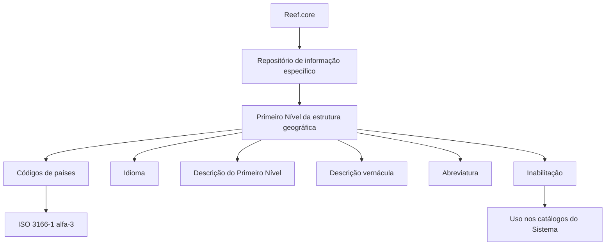

# Definição da Matriz de Correlações de Âmbitos Geográficos no Reef.core

## 1. Metadados do Documento
- **Arquivo de Origem:** Não informado; conteúdo bruto fornecido no prompt.
- **Tipo de Documento:** Especificação Técnica.
- **Domínio / Sistema:** Reef.core — estrutura geográfica e matriz de correlações de âmbitos geográficos.
- **Público-Alvo:** Não identificado; o documento apresenta a seção “Audiencia”, mas não informa os destinatários.
- **Data/Versão Identificada:** Não identificada.

---

## 2. Resumo Executivo & Contexto de Negócio

O documento descreve propriedades para a definição do Primeiro Nível da estrutura geográfica no sistema Reef.core. O Reef.core permite codificar esse Primeiro Nível em um repositório de informação específico.

O Primeiro Nível contém informações de países. Por esse motivo, o documento estabelece que os códigos configurados devem corresponder à norma ISO 3166-1 alfa-3, publicada pela Organização Internacional de Normalização, para representar países, territórios dependentes e zonas especiais de interesse geográfico.

A especificação define atributos de identificação, idioma, descrições em diferentes contextos linguísticos, abreviaturas e inabilitação de códigos. Esses atributos permitem que uma mesma entidade geográfica possua representação compatível com o idioma empregado na definição e com o idioma vernáculo.

O documento também referencia vínculos com diretrizes e documentos funcionais cuja leitura é recomendada. A finalidade declarada desses vínculos é evitar interpretações incorretas decorrentes da leitura isolada desta especificação.

---

## 3. Arquitetura, Componentes & Tecnologias Envolvidas

O conteúdo não descreve arquitetura de software, integrações, protocolos, APIs, ambientes técnicos, bancos de dados ou microsserviços. O único sistema citado é o **Reef.core**, no contexto de um repositório específico para codificação do Primeiro Nível da estrutura geográfica.

Os componentes conceituais identificados são:

| Componente / Conceito | Papel descrito |
| :--- | :--- |
| Reef.core | Sistema que permite codificar o Primeiro Nível da estrutura geográfica em um repositório de informação específico. |
| Primeiro Nível da estrutura geográfica | Nível que contém informações sobre países. |
| Matriz de correlações de âmbitos geográficos | Tema indicado pelo título do documento; o conteúdo fornecido detalha propriedades gerais do Primeiro Nível. |
| ISO 3166-1 alfa-3 | Norma indicada para os códigos de países, territórios dependentes e zonas especiais de interesse geográfico. |
| Catálogos do Sistema | Destino de uso dos códigos de nível; códigos inabilitados não podem ser empregados nesses catálogos. |
| Diretrizes e documentos funcionais | Materiais relacionados cuja leitura é recomendada para prevenir interpretação isolada incorreta. |



> *Nota de Análise: O documento não detalha o modelo de dados físico, os métodos de manutenção, APIs, telas, controles de acesso, contratos de integração ou mecanismos de persistência do Reef.core.*

---

## 4. Regras de Negócio, Especificações Funcionais & Processos

### 4.1 Codificação do Primeiro Nível geográfico

1. O Reef.core possui a capacidade de codificar o Primeiro Nível da estrutura geográfica em um repositório de informação específico.
2. O Primeiro Nível contém informações de países.
3. Os códigos configurados para esse Primeiro Nível devem corresponder à norma **ISO 3166-1 alfa-3**.
4. A norma mencionada é publicada pela Organização Internacional de Normalização.
5. A finalidade indicada para os códigos ISO 3166-1 alfa-3 é representar:
   - Países;
   - Territórios dependentes;
   - Zonas especiais de interesse geográfico.

### 4.2 Propriedades de idioma e denominação

1. A propriedade **Idioma** identifica o idioma empregado na definição do nível da estrutura.
2. O documento exemplifica códigos que podem identificar idiomas como espanhol, inglês e turco, sem especificar a norma ou o formato técnico desses códigos.
3. A **Descrição do Primeiro Nível** contém a denominação ou descrição da chave do nível conforme o idioma empregado na definição.
4. A **Descrição Vernácula do Primeiro Nível** contém a denominação ou descrição do Primeiro Nível conforme o idioma vernáculo.
5. A **Abreviatura do Primeiro Nível** contém a denominação ou descrição abreviada do Primeiro Nível conforme o idioma empregado na definição.

### 4.3 Identificação do nível

1. O **Código do Primeiro Nível** identifica a chave que representará o Primeiro Nível da estrutura geográfica no sistema.
2. A chave deve seguir a codificação ISO 3166-1 alfa-3 quando utilizada para os países do Primeiro Nível.

### 4.4 Inabilitação

1. A propriedade **Inabilitação** define que o Código do Nível fica inabilitado para uso nos catálogos do Sistema.
2. O documento não especifica se a inabilitação remove, preserva, arquiva ou apenas bloqueia registros previamente existentes.

### 4.5 Vínculos documentais

1. O documento apresenta uma seção de vínculos.
2. Essa seção é definida como uma relação de diretrizes e documentos funcionais cuja leitura é recomendada.
3. A leitura dos documentos relacionados é recomendada para evitar que a interpretação isolada deste documento leve a erros.
4. O conteúdo fornecido cita **“Denominaciones Locales de los Niveles de la Estructura Geográfica”** como referência relacionada.

---

## 5. Tabelas de Parâmetros, Ambientes e Estruturas de Dados

### 5.1 Propriedades do Primeiro Nível da estrutura geográfica

| Item / Parâmetro | Descrição / Função | Tipo / Valores / Formato | Ambiente / Observações |
| :--- | :--- | :--- | :--- |
| Idioma | Identifica o idioma empregado na definição do nível da estrutura. | Códigos de idioma; exemplos citados: espanhol, inglês e turco. | O documento não informa a norma, tamanho ou formato técnico do código de idioma. |
| Código do Primeiro Nível | Identifica a chave que representará o Primeiro Nível da estrutura geográfica no sistema. | ISO 3166-1 alfa-3 para informações de países. | O Primeiro Nível contém países, territórios dependentes e zonas especiais de interesse geográfico. |
| Descrição do Primeiro Nível | Contém a denominação ou descrição da chave do nível de acordo com o idioma empregado na definição. | Texto descritivo. | Não há restrições de tamanho, caracteres ou obrigatoriedade informadas. |
| Descrição Vernácula do Primeiro Nível | Contém a denominação ou descrição do Primeiro Nível conforme o idioma vernáculo. | Texto descritivo. | O documento diferencia a descrição vernácula da descrição no idioma utilizado na definição. |
| Abreviatura do Primeiro Nível | Contém a denominação ou descrição abreviada do Primeiro Nível conforme o idioma empregado na definição. | Texto abreviado. | Não há regra de tamanho ou padronização da abreviatura informada. |
| Inabilitação | Estabelece que o Código do Nível está inabilitado para uso nos catálogos do Sistema. | Estado de inabilitação; formato não informado. | Não são detalhados os efeitos sobre registros existentes nem as condições de reabilitação. |
| Vínculos | Relaciona diretrizes e documentos funcionais recomendados. | Referências documentais. | A leitura é recomendada para evitar interpretações incorretas do documento isolado. |

### 5.2 Exemplos apresentados para idioma espanhol

| Chave do Primeiro Nível | Descrição | Descrição Vernácula | Abreviatura |
| :--- | :--- | :--- | :--- |
| PAN | Panamá | Panamá | Pan. |
| USA | Estados Unidos | United States of America | USA |
| ESP | España | España | Esp. |
| MEX | México | Estados Unidos Mexicanos | Méx |
| ... | ... | ... | ... |

### 5.3 Ambientes, servidores e rotas

| Item / Parâmetro | Descrição / Função | Tipo / Valores / Formato | Ambiente / Observações |
| :--- | :--- | :--- | :--- |
| Ambientes técnicos | Não identificados no conteúdo fornecido. | Não aplicável. | O documento não informa desenvolvimento, homologação, produção, URLs, servidores ou portas. |
| Rotas de logs | Não identificadas no conteúdo fornecido. | Não aplicável. | O documento não informa caminhos, ferramentas ou políticas de logs. |
| APIs | Não detalhadas no conteúdo fornecido. | Não aplicável. | O trecho “Home Solutions APIs Documentation Zeus” aparece no conteúdo extraído, sem contexto funcional ou técnico suficiente para caracterizá-lo como componente da especificação. |

---

## 6. Bateria de Perguntas & Respostas para RAG (FAQ Sintético)

### P1: Qual é a finalidade do Primeiro Nível da estrutura geográfica no Reef.core?
**R:** O Primeiro Nível da estrutura geográfica no Reef.core contém informações sobre países. O Reef.core permite que esse nível seja codificado em um repositório de informação específico.

### P2: Qual padrão de código deve ser utilizado para configurar países no Primeiro Nível?
**R:** Os códigos configurados para o Primeiro Nível devem corresponder à norma ISO 3166-1 alfa-3, indicada pelo documento para representar países, territórios dependentes e zonas especiais de interesse geográfico.

### P3: O que representa o Código do Primeiro Nível no sistema?
**R:** O Código do Primeiro Nível identifica a chave que representará o Primeiro Nível da estrutura geográfica no sistema. Como o nível contém informações de países, essa chave deve utilizar os códigos correspondentes à norma ISO 3166-1 alfa-3.

### P4: Qual é a função do atributo Idioma na definição da estrutura geográfica?
**R:** O atributo Idioma identifica o idioma empregado na definição do nível da estrutura geográfica. O documento menciona, como exemplos, códigos que identificam os idiomas espanhol, inglês e turco, mas não define o padrão técnico desses códigos.

### P5: Qual é a diferença entre Descrição do Primeiro Nível e Descrição Vernácula do Primeiro Nível?
**R:** A Descrição do Primeiro Nível contém a denominação ou descrição da chave do nível conforme o idioma utilizado na definição. A Descrição Vernácula do Primeiro Nível contém a denominação ou descrição do Primeiro Nível conforme o idioma vernáculo.

### P6: Como a abreviatura do Primeiro Nível deve ser preenchida?
**R:** A Abreviatura do Primeiro Nível deve conter a denominação ou descrição abreviada do nível, de acordo com o idioma empregado na definição. O documento apresenta exemplos como “Pan.” para Panamá, “Esp.” para España e “Méx” para México.

### P7: O que acontece quando um Código do Nível é marcado como inabilitado?
**R:** Quando a propriedade Inabilitação estabelece que um Código do Nível está inabilitado, esse código não pode ser empregado nos catálogos do Sistema. O documento não detalha efeitos adicionais, como exclusão, arquivamento ou reabilitação.

### P8: Quais são os exemplos de códigos geográficos apresentados no documento?
**R:** O documento apresenta os exemplos PAN para Panamá, USA para Estados Unidos, ESP para España e MEX para México. Esses exemplos são mostrados no contexto de uma definição cujo idioma empregado é o espanhol.

### P9: Por que o documento recomenda consultar diretrizes e documentos funcionais relacionados?
**R:** O documento recomenda a leitura de diretrizes e documentos funcionais relacionados para evitar que a interpretação isolada desta especificação conduza a erros.

### P10: O documento define APIs, URLs, servidores ou ambientes do Reef.core?
**R:** Não. O conteúdo fornecido não detalha APIs, métodos HTTP, contratos JSON, URLs, servidores, portas, ambientes técnicos ou rotas de logs do Reef.core.

### P11: A norma ISO 3166-1 alfa-3 é mencionada para quais entidades geográficas?
**R:** A norma ISO 3166-1 alfa-3 é mencionada para representar países, territórios dependentes e zonas especiais de interesse geográfico.

---

## 7. Glossário de Termos, Siglas & Conceitos-Chave

- **Reef.core:** Sistema citado no documento, com capacidade de codificar o Primeiro Nível da estrutura geográfica em um repositório de informação específico.
- **Primeiro Nível:** Primeiro nível da estrutura geográfica; contém informação sobre países.
- **Código do Primeiro Nível:** Chave que identifica o Primeiro Nível da estrutura geográfica no sistema.
- **ISO 3166-1 alfa-3:** Norma publicada pela Organização Internacional de Normalização e indicada para a codificação de países, territórios dependentes e zonas especiais de interesse geográfico.
- **Descrição Vernácula:** Denominação ou descrição do Primeiro Nível conforme o idioma vernáculo.
- **Inabilitação:** Propriedade que torna o Código do Nível indisponível para uso nos catálogos do Sistema.
- **Catálogos do Sistema:** Catálogos nos quais códigos de nível inabilitados não podem ser utilizados.
- **Vínculos:** Relação de diretrizes e documentos funcionais recomendados para complementar a interpretação da especificação.
- **PAN:** Exemplo apresentado para Panamá.
- **USA:** Exemplo apresentado para Estados Unidos.
- **ESP:** Exemplo apresentado para España.
- **MEX:** Exemplo apresentado para México.

---

## 8. Notas Críticas, Riscos & Limitações

- O documento não identifica data, versão, autoria ou público-alvo efetivo.
- O documento não especifica o formato técnico dos códigos de idioma, embora cite espanhol, inglês e turco como exemplos.
- O documento não detalha modelo de dados, entidades, campos obrigatórios, tamanhos máximos, validações de caracteres ou mecanismos de persistência.
- O documento não detalha fluxos de criação, alteração, consulta, exclusão, aprovação ou reabilitação de códigos geográficos.
- A propriedade Inabilitação informa apenas a impossibilidade de emprego nos catálogos do Sistema; não descreve impactos em dados já existentes.
- Não são informados APIs, métodos HTTP, contratos JSON, integrações, URLs, ambientes, servidores, portas, autenticação ou rotas de logs.
- A referência a “Home Solutions APIs Documentation Zeus” aparece no texto extraído sem explicação contextual suficiente para associá-la formalmente à funcionalidade documentada.
- A pergunta frequente sobre recomendações operacionais locais é respondida como **“N/A”**; portanto, o documento não fornece recomendações operacionais locais adicionais.
- A leitura de “Denominaciones Locales de los Niveles de la Estructura Geográfica” é recomendada como material complementar para reduzir o risco de interpretação incorreta do documento de forma isolada.

---

## 9. Conteúdo Bruto Estruturado (Referência Fiel)

```text
--- [PÁGINA 1 DE 3] ---

DEFINICIÓN de la MATRIZ de
CORRELACIONES de ÁMBITOS
GEOGRÁFICOS
Propiedades Generales
Reef.core cuenta con la posibilidad de codificar el Primer Nivel de la estructura Geográfica en un
repositorio de información específico.
Idioma
Esta propiedad identifica el Idioma empleado en la definición del Nivel de la estructura, como por
ejemplo con los códigos que identifiquen a los idiomas español, inglés, turco,...
Código del Primer Nivel
Este atributo identifica la clave que identificará al Primer Nivel de la estructura Geográfica en el
Sistema.
NOTA: Puesto que este Primer Nivel contiene la información de los Países, los códigos que se han
de configurar en el sistema son aquellos correspondientes a la Norma ISO 3166-1 alfa-3 publicada
por la Organización Internacional de Normalización, para representar países, territorios dependientes
y zonas especiales de interés geográfico.
Descripción del Primer Nivel
 / 
 CF
Home Solutions APIs Documentation Zeus
EN


--- [PÁGINA 2 DE 3] ---

Esta propiedad contiene la denominación o descripción de la clave del Nivel, de acuerdo con el
idioma utilizado en la definición.
Descripción Vernácula del Primer Nivel
Esta propiedad contiene la denominación o descripción del Primer Nivel de la Estructura Geográfica
de acuerdo con el idioma vernáculo.
Abreviatura del Primer Nivel
Esta propiedad contiene la denominación o descripción abreviada del Primer Nivel, de acuerdo con el
idioma utilizado en la definición.
A modo de ejemplo y si el Idioma utilizado en la definición es el español:
Clave del Primer
Nivel
Descripción Vernáculo Abreviatura
PAN Panamá Panamá Pan.
USA Estados
Unidos
United States of America USA
ESP España España Esp.
MEX México Estados Unidos
Mexicanos
Méx
... ... ...
Otras Propiedades
Inhabilitación
Esta propiedad establece que el Código del Nivel está inhabilitado para poder ser empleado en los
catálogos del Sistema.
Vínculos
Relación de Directrices y Documentos funcionales cuya lectura recomendada para evitar que la
interpretación aislada del presente documento pueda conducir a error.
Denominaciones Locales de los Niveles de la Estructura Geográfica


--- [PÁGINA 3 DE 3] ---

Preguntas frecuentes
(1) ¿Existe alguna recomendación operativa que deba ser tomada en consideración localmente en la
codificación, uso y definición de Correlaciones y ámbitos geográficos?
N/A
Audiencia
```
