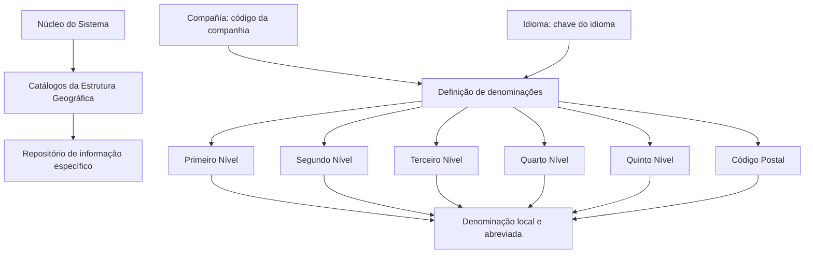
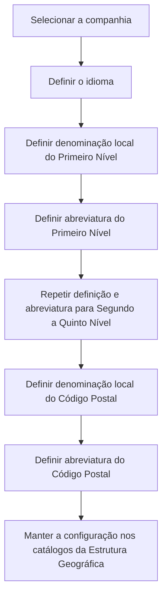

# Definição das Denominações dos Níveis da Estrutura Geográfica

## 1. Metadados do Documento
- **Arquivo de Origem:** `Não identificado — texto bruto fornecido pelo usuário`
- **Tipo de Documento:** `Especificação Funcional`
- **Domínio / Sistema:** `Estrutura Geográfica; catálogos geográficos`
- **Público-Alvo:** `Negócio, analistas funcionais, administradores de catálogos e equipes de instalação`
- **Data/Versão Identificada:** `Não identificada`

---

## 2. Resumo Executivo & Contexto de Negócio

O documento define como o núcleo do sistema permite configurar as denominações locais dos cinco níveis de uma Estrutura Geográfica e do Código Postal. A configuração deve respeitar nomes, usos e costumes locais, permitindo que uma mesma estrutura lógica seja apresentada com terminologia adequada a cada instalação.

A definição das denominações ocorre em catálogos da Estrutura Geográfica armazenados em um repositório de informação específico. Segundo o documento, esse repositório é inicialmente entregue às instalações sem conteúdo.

A configuração é contextualizada por companhia e idioma. A propriedade **Compañía** identifica o código da companhia para a qual a definição está sendo realizada; a propriedade **Idioma** identifica a chave do idioma utilizada nas descrições dos níveis geográficos.

O documento apresenta exemplos para as instalações TRN - España/Núcleo, EUR - MAPFRE Chile e MMX - MAPFRE México. Os exemplos demonstram que os níveis lógicos Primeiro a Quinto podem receber denominações distintas, como País, Região, Província, Município, Distrito, Comunas, Localidades, Entidades Federativas e Colonias.

Não são fornecidos detalhes sobre telas, APIs, métodos HTTP, contratos JSON, persistência física, permissões de alteração ou processos de publicação dessas configurações. A finalidade documentada limita-se à definição funcional das denominações locais e abreviadas.

---

## 3. Arquitetura, Componentes & Tecnologias Envolvidas

O documento cita os seguintes elementos funcionais:

- **Núcleo do Sistema:** contempla a capacidade de designar denominações para os níveis geográficos.
- **Catálogos da Estrutura Geográfica:** catálogos que contêm a estrutura geográfica configurável.
- **Repositório de informação específico:** local onde os catálogos são mantidos; é entregue inicialmente vazio às instalações.
- **Companhia:** contexto organizacional identificado por código.
- **Idioma:** contexto linguístico associado às descrições dos níveis.
- **Instalações:** TRN - España/Núcleo, EUR - MAPFRE Chile e MMX - MAPFRE México.

> **Nota de Análise:** O documento não especifica tecnologias, bancos de dados, microsserviços, integrações, endpoints, URLs, protocolos, versões ou ambientes técnicos.



---

## 4. Regras de Negócio, Especificações Funcionais & Processos

1. O núcleo do sistema deve permitir a designação das denominações dos cinco níveis da Estrutura Geográfica.
2. As denominações devem considerar nomes, usos e costumes locais.
3. As denominações são definidas em catálogos que contêm a Estrutura Geográfica.
4. Os catálogos ficam em um repositório de informação específico.
5. O repositório de informação é inicialmente entregue às instalações sem conteúdo.
6. A propriedade **Compañía** identifica o código da companhia sobre a qual a definição das denominações está sendo realizada.
7. A propriedade **Idioma** representa a chave do idioma usada para definir as descrições dos níveis da Estrutura Geográfica.
8. O documento apresenta espanhol, inglês e turco como exemplos de idiomas que podem ser utilizados na definição.
9. Cada um dos cinco níveis geográficos possui:
   - uma **descrição**, correspondente à denominação local do nível;
   - uma **descrição abreviada**, correspondente à abreviatura da denominação local do nível.
10. O Código Postal também possui:
    - uma **descrição**, correspondente à denominação local do Código Postal;
    - uma **descrição abreviada**, correspondente à abreviatura da denominação local do Código Postal.
11. Os exemplos apresentados usam o idioma espanhol para demonstrar as denominações locais em diferentes instalações.

### Fluxo funcional de definição



> **Nota de Análise:** O documento não detalha validações obrigatórias, regras de unicidade, tamanhos máximos, formatos permitidos, responsáveis pela aprovação ou comportamento do sistema em caso de ausência de uma denominação.

---

## 5. Tabelas de Parâmetros, Ambientes e Estruturas de Dados

| Item / Parâmetro | Descrição / Função | Tipo / Valores / Formato | Ambiente / Observações |
| :--- | :--- | :--- | :--- |
| Compañía | Indica o código da companhia sobre a qual é realizada a definição das denominações da Estrutura Geográfica. | Código da companhia; formato não especificado. | Aplicável à definição por companhia. |
| Idioma | Chave do idioma utilizada para definir as descrições dos níveis da Estrutura Geográfica. | Chave de idioma; exemplos: espanhol, inglês e turco. | Aplicável às descrições locais. |
| Descripción del Primer Nivel | Contém a denominação local pela qual o Primeiro Nível da Estrutura Geográfica será identificado. | Texto; formato não especificado. | Configuração da Estrutura Geográfica. |
| Descripción Abreviada del Primer Nivel | Contém a abreviatura da denominação local do Primeiro Nível. | Texto; formato não especificado. | Configuração da Estrutura Geográfica. |
| Descripción del Segundo Nivel | Contém a denominação local pela qual o Segundo Nível será identificado. | Texto; formato não especificado. | Configuração da Estrutura Geográfica. |
| Descripción Abreviada del Segundo Nivel | Contém a abreviatura da denominação local do Segundo Nível. | Texto; formato não especificado. | Configuração da Estrutura Geográfica. |
| Descripción del Tercer Nivel | Contém a denominação local pela qual o Terceiro Nível será identificado. | Texto; formato não especificado. | Configuração da Estrutura Geográfica. |
| Descripción Abreviada del Tercer Nivel | Contém a abreviatura da denominação local do Terceiro Nível. | Texto; formato não especificado. | Configuração da Estrutura Geográfica. |
| Descripción del Cuarto Nivel | Contém a denominação local pela qual o Quarto Nível será identificado. | Texto; formato não especificado. | Configuração da Estrutura Geográfica. |
| Descripción Abreviada del Cuarto Nivel | Contém a abreviatura da denominação local do Quarto Nível. | Texto; formato não especificado. | Configuração da Estrutura Geográfica. |
| Descripción del Quinto Nivel | Contém a denominação local pela qual o Quinto Nível será identificado. | Texto; formato não especificado. | Configuração da Estrutura Geográfica. |
| Descripción Abreviada del Quinto Nivel | Contém a abreviatura da denominação local do Quinto Nível. | Texto; formato não especificado. | Configuração da Estrutura Geográfica. |
| Descripción del Código Postal | Contém a denominação local pela qual o Código Postal será identificado na Estrutura Geográfica. | Texto; formato não especificado. | Configuração da Estrutura Geográfica. |
| Descripción Abreviada del Código Postal | Contém a abreviatura da denominação local do Código Postal. | Texto; formato não especificado. | Configuração da Estrutura Geográfica. |

### Denominações locais por instalação

| Instalação | Nível da Estrutura | Denominação Local |
| :--- | :--- | :--- |
| TRN - España/Núcleo | Primeiro Nível | País |
| TRN - España/Núcleo | Segundo Nível | Comunidad/Ciudad Autónoma |
| TRN - España/Núcleo | Terceiro Nível | Provincia |
| TRN - España/Núcleo | Quarto Nível | Municipio/Localidad |
| TRN - España/Núcleo | Quinto Nível | Distrito |
| TRN - España/Núcleo | Código Postal | Código Postal |
| EUR - MAPFRE Chile | Primeiro Nível | País |
| EUR - MAPFRE Chile | Segundo Nível | Región |
| EUR - MAPFRE Chile | Terceiro Nível | Provincia |
| EUR - MAPFRE Chile | Quarto Nível | Comunas |
| EUR - MAPFRE Chile | Quinto Nível | Localidades |
| EUR - MAPFRE Chile | Código Postal | Código Postal |
| MMX - MAPFRE México | Primeiro Nível | País |
| MMX - MAPFRE México | Segundo Nível | Entidades Federativas |
| MMX - MAPFRE México | Terceiro Nível | Municipios / Demarcación Territorial |
| MMX - MAPFRE México | Quarto Nível | Localidades / Delegaciones |
| MMX - MAPFRE México | Quinto Nível | Colonias |
| MMX - MAPFRE México | Código Postal | Código Postal |

---

## 6. Bateria de Perguntas & Respostas para RAG (FAQ Sintético)

### P1: Qual é a finalidade da definição das denominações dos níveis da Estrutura Geográfica?
**R:** A finalidade é permitir que o núcleo do sistema designe os nomes dos cinco níveis da Estrutura Geográfica e do Código Postal de acordo com os nomes, usos e costumes locais de cada instalação.

### P2: Onde são mantidas as denominações da Estrutura Geográfica?
**R:** As denominações são definidas em catálogos que contêm a Estrutura Geográfica, armazenados em um repositório de informação específico entregue inicialmente às instalações sem conteúdo.

### P3: Qual é a função da propriedade Compañía?
**R:** A propriedade **Compañía** informa o código da companhia para a qual está sendo realizada a definição das denominações da Estrutura Geográfica.

### P4: Qual é a função da propriedade Idioma?
**R:** A propriedade **Idioma** é a chave do idioma utilizada para definir as descrições dos níveis da Estrutura Geográfica. O documento cita espanhol, inglês e turco como exemplos.

### P5: Quais informações devem ser configuradas para cada nível geográfico?
**R:** Para cada um dos cinco níveis, devem ser configuradas uma descrição com a denominação local do nível e uma descrição abreviada com a abreviatura dessa denominação local.

### P6: O Código Postal é tratado como um nível configurável no documento?
**R:** Sim. Além dos cinco níveis da Estrutura Geográfica, o documento estabelece uma descrição local e uma descrição abreviada específicas para o Código Postal.

### P7: Como o Segundo Nível é denominado na instalação TRN - España/Núcleo?
**R:** Na instalação TRN - España/Núcleo, o Segundo Nível é denominado **Comunidad/Ciudad Autónoma**.

### P8: Como o Quarto e o Quinto Níveis são denominados na instalação EUR - MAPFRE Chile?
**R:** Na instalação EUR - MAPFRE Chile, o Quarto Nível é denominado **Comunas** e o Quinto Nível é denominado **Localidades**.

### P9: Como os níveis intermediários são denominados na instalação MMX - MAPFRE México?
**R:** Na instalação MMX - MAPFRE México, o Segundo Nível é **Entidades Federativas**, o Terceiro Nível é **Municipios / Demarcación Territorial**, o Quarto Nível é **Localidades / Delegaciones** e o Quinto Nível é **Colonias**.

### P10: O documento define APIs, URLs ou métodos HTTP para configurar a Estrutura Geográfica?
**R:** Não. O documento não apresenta APIs, endpoints, URLs, métodos HTTP, contratos JSON, tecnologias de integração ou detalhes técnicos de implementação.

### P11: O documento informa quais validações devem ser aplicadas às descrições e abreviaturas?
**R:** Não. O texto descreve a finalidade das descrições e abreviaturas, mas não informa obrigatoriedade, tamanhos máximos, formatos, regras de unicidade ou validações de conteúdo.

### P12: Qual recomendação documental é apresentada para evitar interpretação isolada incorreta?
**R:** O documento recomenda a leitura da relação de diretrizes e documentos funcionais vinculados, pois a interpretação isolada do documento atual pode conduzir a erro. Entre os vínculos exibidos estão **Estructura Geográfica**, **Preguntas frecuentes** e **(1) Audiencia**.

---

## 7. Glossário de Termos, Siglas & Conceitos-Chave

- **Estrutura Geográfica:** Estrutura composta por cinco níveis geográficos e por Código Postal, cujas denominações podem variar localmente.
- **Primeiro Nível:** Primeiro nível lógico da Estrutura Geográfica; nos exemplos, denominado País.
- **Segundo Nível:** Segundo nível lógico da Estrutura Geográfica; recebe denominações como Comunidad/Ciudad Autónoma, Región ou Entidades Federativas.
- **Terceiro Nível:** Terceiro nível lógico da Estrutura Geográfica; recebe denominações como Provincia ou Municipios / Demarcación Territorial.
- **Quarto Nível:** Quarto nível lógico da Estrutura Geográfica; recebe denominações como Municipio/Localidad, Comunas ou Localidades / Delegaciones.
- **Quinto Nível:** Quinto nível lógico da Estrutura Geográfica; recebe denominações como Distrito, Localidades ou Colonias.
- **Código Postal:** Elemento adicional da Estrutura Geográfica com denominação local e abreviada configuráveis.
- **Compañía:** Propriedade que indica o código da companhia relacionada à definição.
- **Idioma:** Chave linguística empregada na definição das descrições dos níveis.
- **Denominação Local:** Nome pelo qual um nível geográfico é identificado em determinado contexto local.
- **Descrição Abreviada:** Abreviatura da denominação local de um nível geográfico ou do Código Postal.
- **TRN - España/Núcleo:** Instalação citada como exemplo de denominações geográficas na Espanha/Núcleo.
- **EUR - MAPFRE Chile:** Instalação citada como exemplo de denominações geográficas no Chile.
- **MMX - MAPFRE México:** Instalação citada como exemplo de denominações geográficas no México.
- **MAPFRE:** Termo presente nos nomes das instalações EUR - MAPFRE Chile e MMX - MAPFRE México; o documento não expande ou define a sigla/nome.

---

## 8. Notas Críticas, Riscos & Limitações

- O repositório de informação específico é entregue inicialmente vazio às instalações; o documento não descreve o processo de carga inicial ou governança dos dados.
- As denominações dependem de companhia e idioma, mas o texto não informa como o sistema trata configurações ausentes, duplicadas ou conflitantes.
- Não há especificação de permissões, papéis de usuário, trilha de auditoria ou fluxo de aprovação para manutenção das denominações.
- Não são documentados formatos, limites de caracteres, obrigatoriedade ou validações das descrições e abreviaturas.
- Não há detalhes sobre integração entre os catálogos da Estrutura Geográfica e outros sistemas.
- Os exemplos de instalações estão apresentados apenas em espanhol; o texto menciona outros idiomas, mas não apresenta exemplos para inglês ou turco.
- O documento recomenda a leitura de diretrizes e documentos funcionais relacionados para evitar erro de interpretação quando analisado isoladamente.

---

## 9. Conteúdo Bruto Estruturado (Referência Fiel)

```text
--- [PÁGINA 1 DE 4] ---

DEFINICIÓN de las Denominaciones de los
Niveles de la Estructura Geográfica
Propiedades Generales
Funcionalmente, el núcleo del Sistema contempla la facilidad de poder Designar (de acuerdo con los
nombres, usos y costumbres locales) las denominaciones de los Cinco Niveles en los Catálogos que
contienen la Estructura Geográfica en un repositorio de información específico que se entrega
inicialmente a las instalaciones vacío de contenido.
Compañía.
Esta propiedad le indica al sistema el código de la compañía sobre la que se está realizando la
definición de las denominaciones de la estructura geográfica.
Idioma.
Esta propiedad es la clave del Idioma empleado en la definición de las descripciones de los niveles
de la Estructura Geográfica, como por ejemplo: español, inglés, turco, ...
Descripción del Primer Nivel
Este atributo contiene la denominación local por la cual será identificada el Primer Nivel de la
estructura Geográfica.
Descripción Abreviada del Primer Nivel
 / 
 CF
Home Solutions APIs Documentation Zeus
EN


--- [PÁGINA 2 DE 4] ---

Este atributo contiene la abreviatura de la denominación local por la cual será identificada el Primer
Nivel de la estructura Geográfica.
Descripción del Segundo Nivel
Este atributo contiene la denominación local por la cual será identificada el Segundo Nivel de la
estructura Geográfica.
Descripción Abreviada del Segundo Nivel
Este atributo contiene la abreviatura de la denominación local por la cual será identificada el Segundo
Nivel de la estructura Geográfica.
Descripción del Tercer Nivel
Este atributo contiene la denominación local por la cual será identificada el Tercer Nivel de la
estructura Geográfica.
Descripción Abreviada del Tercer Nivel
Este atributo contiene la abreviatura de la denominación local por la cual será identificada el Tercer
Nivel de la estructura Geográfica.
Descripción del Cuarto Nivel
Este atributo contiene la denominación local por la cual será identificada el Cuarto Nivel de la
estructura Geográfica.
Descripción Abreviada del Cuarto Nivel
Este atributo contiene la abreviatura de la denominación local por la cual será identificada el Cuarto
Nivel de la estructura Geográfica.
Descripción del Quinto Nivel
Este atributo contiene la denominación local por la cual será identificada el Quinto Nivel de la
estructura Geográfica.
Descripción Abreviada del Quinto Nivel
Este atributo contiene la abreviatura de la denominación local por la cual será identificada el Quinto
Nivel de la estructura Geográfica.
Descripción del Código Postal


--- [PÁGINA 3 DE 4] ---

Este atributo contiene la denominación local por la cual será identificada el Código Postal de la
estructura Geográfica.
Descripción Abreviada del Código Postal
Este atributo contiene la abreviatura de la denominación local por la cual será identificada el Código
Postal de la estructura Geográfica.
A modo de ejemplo y si el Idioma utilizado en la definición es el español:
Instalación Nivel de la
Estructura
Denominación Local
TRN - España/Núcleo Primer Nivel País
Segundo Nivel Comunidad/Ciudad Autónoma
Tercer Nivel Provincia
Cuarto Nivel Municipio/Localidad
Quinto Nivel Distrito
Código Postal Código Postal
EUR - MAPFRE Chile Primer Nivel País
Segundo Nivel Región
Tercer Nivel Provincia
Cuarto Nivel Comunas
Quinto Nivel Localidades
Código Postal Código Postal


--- [PÁGINA 4 DE 4] ---

Instalación Nivel de la
Estructura
Denominación Local
MMX - MAPFRE
México
Primer Nivel País
Segundo Nivel Entidades Federativas
Tercer Nivel Municipios / Demarcación
Territorial
Cuarto Nivel Localidades / Delegaciones
Quinto Nivel Colonias
Código Postal Código Postal
Vínculos
Relación de Directrices y Documentos funcionales cuya lectura recomendada para evitar que la
interpretación aislada del presente documento pueda conducir a error.
Estructura Geográfica
Preguntas frecuentes
(1)
Audiencia
```
