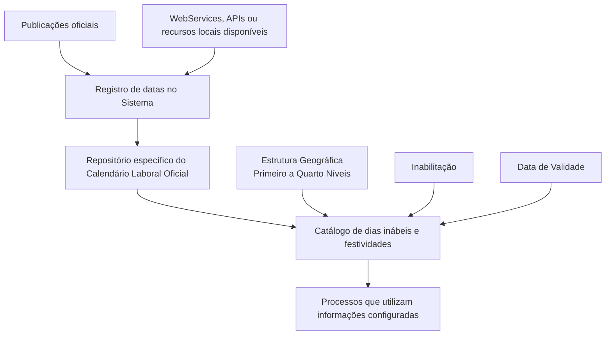

# Relatório de Ingestão de Documento para RAG

**Arquivo de origem:** `01-TRON_01-Doc_01-Mod_01-Comunes_01-Def_03-Estructura-geografica_DEFINIR-Dias-Inhabiles-y-Festivos.pdf`
**Data de processamento:** 21/09/2026 08:58:14
**Modelo de interpretação:** gpt-5.6-terra (axet-code)
**Prompt utilizado:** [analise_documento_rag.md](file:///Users/gcostabe/dev/AGENTE-CONTEXT-GEN/prompts/analise_documento_rag.md)

---

# Definição do Calendário Oficial — Dias Inábeis e Festivos da Estrutura Geográfica

## 1. Metadados do Documento
- **Arquivo de Origem:** Não identificado no conteúdo fornecido.
- **Tipo de Documento:** Especificação Funcional.
- **Domínio / Sistema:** Calendário Laboral Oficial e Estrutura Geográfica da Entidade.
- **Público-Alvo:** Equipes responsáveis pela configuração e utilização do catálogo de calendário oficial.
- **Data/Versão Identificada:** Não identificada.

---

## 2. Resumo Executivo & Contexto de Negócio

O documento descreve a definição funcional do Calendário Laboral Oficial, destinado a identificar dias inábeis e festividades aplicáveis aos diferentes níveis da Estrutura Geográfica de uma entidade. O Sistema disponibiliza um repositório específico para codificação dessas informações, inicialmente entregue sem conteúdo nas instalações.

A configuração do calendário associa uma data considerada inábil ou festiva a até quatro níveis da Estrutura Geográfica. Essa associação permite representar calendários distintos conforme a localização geográfica configurada no catálogo.

O documento estabelece propriedades para controlar a utilização operacional dos registros. A propriedade de inabilitação impede que uma data registrada seja empregada por processos que usem informações do catálogo. A data de validade determina a partir de quando o registro passa a operar no Sistema e suporta a manutenção de histórico de mudanças.

Como orientação operacional, o documento recomenda registrar datas conforme suas publicações oficiais e, quando disponível localmente, utilizar WebServices, APIs ou mecanismos equivalentes para realizar o registro. O documento também referencia a leitura complementar da configuração da Estrutura Geográfica para evitar interpretações isoladas.

---

## 3. Arquitetura, Componentes & Tecnologias Envolvidas

O conteúdo identifica os seguintes componentes funcionais:

- **Sistema:** núcleo que permite codificar o Calendário Laboral Oficial.
- **Repositório de informação específico:** local destinado ao armazenamento da configuração do calendário.
- **Catálogo:** conjunto configurável de registros de dias inábeis e festividades.
- **Estrutura Geográfica:** estrutura composta por Primeiro, Segundo, Terceiro e Quarto Níveis.
- **Processos consumidores:** processos que utilizam, de uma ou outra forma, a informação configurada no catálogo.
- **Publicações oficiais:** fonte recomendada para registro das datas do calendário.
- **WebServices e APIs:** mecanismos mencionados como possíveis recursos locais para registro das datas.



> **Nota de Análise:** O documento menciona possíveis WebServices e APIs, mas não detalha endpoints, métodos HTTP, contratos, autenticação, formatos de dados ou responsáveis técnicos.

---

## 4. Regras de Negócio, Especificações Funcionais & Processos

### 4.1. Objetivo funcional

O núcleo do Sistema permite codificar o Calendário Laboral Oficial para identificar:

- Dias inábeis.
- Festividades.
- Aplicabilidade dessas datas aos diferentes níveis da Estrutura Geográfica da Entidade.

O repositório de informação utilizado para esse fim é entregue inicialmente vazio nas instalações.

### 4.2. Associação geográfica

Cada registro de data inábil ou festividade pode identificar níveis da Estrutura Geográfica por meio das respectivas chaves:

1. Código do Primeiro Nível.
2. Código do Segundo Nível.
3. Código do Terceiro Nível.
4. Código do Quarto Nível.

O documento não estabelece se todos os quatro níveis são obrigatórios, nem define regras de precedência entre registros configurados em diferentes níveis geográficos.

### 4.3. Definição de data não laborável

A propriedade **Fecha Inhábil o Festivo** contém a data considerada inábil ou de festividade para a Estrutura Geográfica registrada.

### 4.4. Inabilitação do registro

A propriedade **Inhabilitación** estabelece que a data registrada fica inabilitada para emprego nos processos que utilizam, direta ou indiretamente, a informação configurada no catálogo.

O documento não detalha:

- Valores permitidos para a propriedade de inabilitação.
- Forma de ativação ou desativação.
- Comportamento de processos já executados antes da inabilitação.
- Critérios de auditoria da mudança.

### 4.5. Vigência e histórico

A propriedade **Fecha de Validez** informa ao Sistema a data a partir da qual o registro que contém a data inábil ou festividade torna-se operacional.

O uso correto da data de validade permite manter histórico das alterações realizadas nas configurações do catálogo.

### 4.6. Processo operacional recomendado

1. Identificar a publicação oficial aplicável ao calendário.
2. Registrar no Sistema as datas do calendário conforme a publicação oficial.
3. Associar a data à Estrutura Geográfica correspondente por meio dos códigos de nível disponíveis.
4. Definir a data de validade para determinar quando o registro entra em operação.
5. Aplicar a propriedade de inabilitação quando a data não puder ser utilizada pelos processos consumidores.
6. Quando houver recursos locais disponíveis, utilizar possíveis WebServices, APIs ou mecanismos equivalentes para registrar o calendário.

---

## 5. Tabelas de Parâmetros, Ambientes e Estruturas de Dados

| Item / Parâmetro | Descrição / Função | Tipo / Valores / Formato | Ambiente / Observações |
| :--- | :--- | :--- | :--- |
| Calendário Laboral Oficial | Configuração utilizada para identificar dias inábeis e festividades. | Catálogo funcional. | Associado aos níveis da Estrutura Geográfica. |
| Repositório de informação específico | Repositório destinado à codificação do Calendário Laboral Oficial. | Repositório de configuração. | Entregue inicialmente vazio nas instalações. |
| Código do Primeiro Nível | Chave que identifica o Primeiro Nível da Estrutura Geográfica. | Chave/código. | Formato não detalhado. |
| Código do Segundo Nível | Chave que identifica o Segundo Nível da Estrutura Geográfica. | Chave/código. | Formato não detalhado. |
| Código do Terceiro Nível | Chave que identifica o Terceiro Nível da Estrutura Geográfica. | Chave/código. | Formato não detalhado. |
| Código do Quarto Nível | Chave que identifica o Quarto Nível da Estrutura Geográfica. | Chave/código. | Formato não detalhado. |
| Fecha Inhábil o Festivo | Data considerada inábil ou de festividade na Estrutura Geográfica registrada. | Data. | Formato da data não detalhado. |
| Inhabilitación | Determina que a data registrada fica inabilitada para uso nos processos consumidores do catálogo. | Propriedade de controle. | Valores e comportamento técnico não detalhados. |
| Fecha de Validez | Define a data a partir da qual o registro torna-se operacional no Sistema. | Data. | Permite histórico de alterações do catálogo. |
| Publicação oficial | Fonte recomendada para registrar as datas do calendário. | Referência externa. | Tipo, autoridade e mecanismo de consulta não detalhados. |
| WebServices / APIs | Recursos que podem ser utilizados localmente para registrar datas do calendário. | Integração potencial. | Contratos e disponibilidade não detalhados. |

---

## 6. Bateria de Perguntas & Respostas para RAG (FAQ Sintético)

### P1: Qual é o objetivo do Calendário Laboral Oficial no Sistema?
**R:** O Calendário Laboral Oficial permite codificar e identificar dias inábeis e festividades aplicáveis aos diferentes níveis da Estrutura Geográfica da Entidade, utilizando um repositório específico de informações.

### P2: Como o Sistema é entregue em relação ao repositório do Calendário Laboral Oficial?
**R:** O repositório de informação específico utilizado para codificar o Calendário Laboral Oficial é entregue inicialmente vazio de conteúdo nas instalações.

### P3: Quais níveis geográficos podem ser identificados em um registro de calendário?
**R:** O documento lista quatro níveis da Estrutura Geográfica: Primeiro Nível, Segundo Nível, Terceiro Nível e Quarto Nível. Cada nível possui um código que contém a chave de identificação correspondente.

### P4: O que representa a propriedade “Fecha Inhábil o Festivo”?
**R:** A propriedade “Fecha Inhábil o Festivo” contém a data considerada inábil ou de festividade na Estrutura Geográfica registrada.

### P5: Qual é o efeito da propriedade “Inhabilitación” em uma data do calendário?
**R:** A propriedade “Inhabilitación” estabelece que a data registrada fica inabilitada para ser empregada nos processos que utilizam, de uma ou outra forma, as informações configuradas no catálogo.

### P6: Para que serve a “Fecha de Validez” no catálogo de calendário?
**R:** A “Fecha de Validez” informa a data a partir da qual o registro contendo a data inábil ou festividade passa a operar no Sistema. Seu uso correto permite manter histórico das alterações feitas nas configurações do catálogo.

### P7: Qual prática operacional é recomendada para o registro das datas do calendário?
**R:** Recomenda-se registrar no Sistema as datas do calendário de acordo com a respectiva publicação oficial.

### P8: O documento recomenda o uso de integrações para registrar datas do calendário?
**R:** Sim. O documento recomenda utilizar possíveis WebServices, APIs ou recursos equivalentes que possam ser disponibilizados localmente para realizar o registro das datas. Não são detalhados os contratos ou métodos dessas integrações.

### P9: Qual documento relacionado deve ser consultado para evitar interpretação isolada?
**R:** O documento indica a “Configuración de la Estructura Geográfica” como relação de diretrizes e documentos funcionais cuja leitura é recomendada para evitar que a interpretação isolada do conteúdo conduza a erro.

### P10: O documento define o formato dos códigos geográficos e das datas?
**R:** Não. O documento identifica os códigos dos quatro níveis da Estrutura Geográfica e as propriedades de data, mas não especifica formatos, tamanhos, obrigatoriedade, regras de validação ou valores permitidos.

---

## 7. Glossário de Termos, Siglas & Conceitos-Chave

- **Calendário Laboral Oficial:** Catálogo configurável utilizado para identificar dias inábeis e festividades aplicáveis à Estrutura Geográfica.
- **Dia Inábil:** Data configurada como não utilizável pelos processos que consomem a informação do catálogo, conforme a propriedade de inabilitação.
- **Festividade:** Data considerada festiva na Estrutura Geográfica registrada.
- **Estrutura Geográfica:** Estrutura da Entidade composta por níveis geográficos identificados por códigos.
- **Primeiro Nível:** Primeiro nível da Estrutura Geográfica, identificado por uma chave.
- **Segundo Nível:** Segundo nível da Estrutura Geográfica, identificado por uma chave.
- **Terceiro Nível:** Terceiro nível da Estrutura Geográfica, identificado por uma chave.
- **Quarto Nível:** Quarto nível da Estrutura Geográfica, identificado por uma chave.
- **Inhabilitación:** Propriedade que estabelece que uma data registrada fica inabilitada para utilização em processos consumidores do catálogo.
- **Fecha de Validez:** Data a partir da qual um registro de data inábil ou festividade torna-se operacional no Sistema.
- **WebServices:** Mecanismos de integração mencionados como possíveis recursos locais para registrar informações do calendário.
- **API:** Recurso de integração mencionado como possível meio local para registrar informações do calendário.

---

## 8. Notas Críticas, Riscos & Limitações

- O repositório do Calendário Laboral Oficial é entregue inicialmente vazio, exigindo carga e governança operacional antes que processos consumidores possam utilizar informações de calendário.
- O documento não define obrigatoriedade, formato, tamanho ou regras de validação para os códigos dos quatro níveis geográficos.
- O documento não especifica se um registro pode abranger apenas parte dos níveis geográficos, nem define prioridades entre calendários de níveis distintos.
- O documento não detalha valores possíveis, implementação técnica ou efeitos temporais da propriedade de inabilitação.
- O documento não informa formato de data, fuso horário, calendário civil adotado ou regras para datas recorrentes.
- A recomendação de uso de WebServices e APIs não contém contratos técnicos, endpoints, métodos, autenticação ou mecanismos de tratamento de erro.
- A interpretação isolada do documento pode conduzir a erro; a leitura da documentação de configuração da Estrutura Geográfica é expressamente recomendada.

---

## 9. Conteúdo Bruto Estruturado (Referência Fiel)

```text
--- [PÁGINA 1 DE 2] ---

DEFINICIÓN del Calendario Oficial - Días
Inhábiles y Festivos
Objetivo
Funcionalmente, el núcleo del Sistema cuenta con la posibilidad de codificar el Calendario Laboral
Oficial identificando los días Inhábiles y las Festividades que corresponden a los distintos niveles de
la Estructura Geográfica de la Entidad en un repositorio de información específico que se entrega
inicialmente a las instalaciones vacío de contenido.
Propiedades
Otras Propiedades
Propiedades
Código del Primer Nivel
Este atributo contiene la clave que identificará el Primer Nivel de la estructura Geográfica.
Código del Segundo Nivel
Este atributo contiene la clave que identificará el Segundo Nivel de la estructura Geográfica.
Código del Tercer Nivel
Este atributo contiene la clave que identificará el Tercer Nivel de la estructura Geográfica.
 / 
 CF
Home Solutions APIs Documentation Zeus
EN


--- [PÁGINA 2 DE 2] ---

Código del Cuarto Nivel
Este atributo contiene la clave que identificará el Cuarto Nivel de la estructura Geográfica.
Fecha Inhábil o Festivo
Esta Propiedad contiene la Fecha que se considera Inhábil o Festividad en la Estructura Geográfica
registrada.
Otras Propiedades
Inhabilitación
Esta propiedad establece que la Fecha registrada está inhabilitada para poder ser empleada en los
procesos que utilicen de una u otra forma la información configurada en el catálogo.
Fecha de Validez
Esta propiedad le indica al Sistema la fecha a partir de la cual el registro que contiene la fecha Inhábil
o Festividad está operativa en el sistema por lo que su correcto uso permite tener un histórico de los
cambios efectuados en las configuraciones del catálogo.
Vínculos
Relación de Directrices y Documentos funcionales cuya lectura recomendada para evitar que la
interpretación aislada del presente documento pueda conducir a error.
Configuración de la Estructura Geográfica
Preguntas frecuentes
(1) ¿Existe alguna recomendación operativa que deba ser tomada en consideración localmente en la
codificación, uso y definición del Calendario Oficial asociado a la Estructura Geográfica?
Una práctica que se recomienda es registrar en el Sistema las fechas del calendario de acuerdo con
su publicación oficial y mediante el uso de los posibles WebServices, API's, ... que pudieran
proporcionarse localmente para realizarlo.
```

---

## Conteúdo Bruto Extraído (Original Completo)

```text
--- [PÁGINA 1 DE 2] ---

DEFINICIÓN del Calendario Oficial - Días
Inhábiles y Festivos
Objetivo
Funcionalmente, el núcleo del Sistema cuenta con la posibilidad de codificar el Calendario Laboral
Oficial identificando los días Inhábiles y las Festividades que corresponden a los distintos niveles de
la Estructura Geográfica de la Entidad en un repositorio de información específico que se entrega
inicialmente a las instalaciones vacío de contenido.
Propiedades
Otras Propiedades
Propiedades
Código del Primer Nivel
Este atributo contiene la clave que identificará el Primer Nivel de la estructura Geográfica.
Código del Segundo Nivel
Este atributo contiene la clave que identificará el Segundo Nivel de la estructura Geográfica.
Código del Tercer Nivel
Este atributo contiene la clave que identificará el Tercer Nivel de la estructura Geográfica.
 / 
 CF
Home Solutions APIs Documentation Zeus
EN


--- [PÁGINA 2 DE 2] ---

Código del Cuarto Nivel
Este atributo contiene la clave que identificará el Cuarto Nivel de la estructura Geográfica.
Fecha Inhábil o Festivo
Esta Propiedad contiene la Fecha que se considera Inhábil o Festividad en la Estructura Geográfica
registrada.
Otras Propiedades
Inhabilitación
Esta propiedad establece que la Fecha registrada está inhabilitada para poder ser empleada en los
procesos que utilicen de una u otra forma la información configurada en el catálogo.
Fecha de Validez
Esta propiedad le indica al Sistema la fecha a partir de la cual el registro que contiene la fecha Inhábil
o Festividad está operativa en el sistema por lo que su correcto uso permite tener un histórico de los
cambios efectuados en las configuraciones del catálogo.
Vínculos
Relación de Directrices y Documentos funcionales cuya lectura recomendada para evitar que la
interpretación aislada del presente documento pueda conducir a error.
Configuración de la Estructura Geográfica
Preguntas frecuentes
(1) ¿Existe alguna recomendación operativa que deba ser tomada en consideración localmente en la
codificación, uso y definición del Calendario Oficial asociado a la Estructura Geográfica?
Una práctica que se recomienda es registrar en el Sistema las fechas del calendario de acuerdo con
su publicación oficial y mediante el uso de los posibles WebServices, API's, ... que pudieran
proporcionarse localmente para realizarlo.
```
