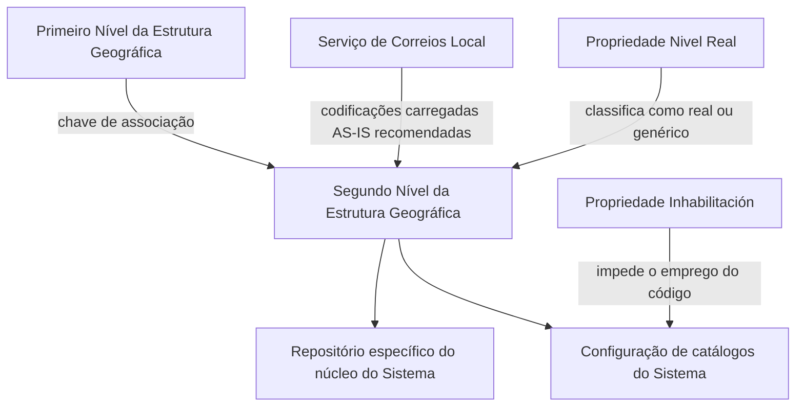

# Relatório de Ingestão de Documento para RAG

**Arquivo de origem:** `01-TRON_01-Doc_01-Mod_01-Comunes_01-Def_03-Estructura-geografica_DEFINIR-Nivel2-Estructura-Geografica.pdf`
**Data de processamento:** 21/09/2026 08:59:07
**Modelo de interpretação:** gpt-5.6-terra (axet-code)
**Prompt utilizado:** [analise_documento_rag.md](file:///Users/gcostabe/dev/AGENTE-CONTEXT-GEN/prompts/analise_documento_rag.md)

---

# Definição do Segundo Nível da Estrutura Geográfica

## 1. Metadados do Documento
- **Arquivo de Origem:** Não identificado no conteúdo fornecido
- **Tipo de Documento:** Especificação Técnica / Funcional
- **Domínio / Sistema:** Estrutura Geográfica do Sistema; referências extraídas a “Home Solutions APIs Documentation Zeus”
- **Público-Alvo:** Não identificado
- **Data/Versão Identificada:** Não identificada

---

## 2. Resumo Executivo & Contexto de Negócio

O documento define as propriedades funcionais usadas para codificar o **Segundo Nível da Estrutura Geográfica**, exemplificado por estados ou divisões administrativas equivalentes. O núcleo do Sistema disponibiliza um repositório específico para esse nível geográfico, inicialmente entregue sem conteúdo nas instalações.

Cada registro de Segundo Nível deve estar vinculado a um Primeiro Nível da Estrutura Geográfica por meio da respectiva chave. Além de código e descrição, a definição contempla descrição vernácula e abreviatura, com orientação para que os textos estejam coerentes com o idioma adotado no Primeiro Nível associado.

A especificação também estabelece propriedades de controle: **Inhabilitación**, que impede o uso de um código de Segundo Nível na configuração dos catálogos do Sistema; e **Nivel Real**, que classifica o código como nível real ou genérico. A propriedade Nivel Real é declarada como uso interno do núcleo da Aplicação.

Como recomendação operacional local, o documento sugere adotar as codificações do Serviço de Correios Local e carregá-las no Sistema no formato **AS-IS**, isto é, sem alteração descrita pelo documento.

---

## 3. Arquitetura, Componentes & Tecnologias Envolvidas

Os elementos explicitamente identificados no documento são:

- **Núcleo do Sistema / Núcleo da Aplicação:** componente que disponibiliza o repositório específico para o Segundo Nível da Estrutura Geográfica e utiliza internamente a propriedade Nivel Real.
- **Repositório de informação específico:** repositório destinado à codificação dos segundos níveis da Estrutura Geográfica.
- **Estrutura Geográfica:** estrutura hierárquica que contém, ao menos, Primeiro Nível e Segundo Nível.
- **Catálogos do Sistema:** configurações que não podem empregar códigos de Segundo Nível marcados como inabilitados.
- **Serviço de Correios Local:** fonte recomendada para codificações locais a serem carregadas AS-IS.
- **Home Solutions APIs Documentation Zeus:** texto presente na extração, sem detalhamento de função, integração, tecnologia, URL ou relação operacional com a Estrutura Geográfica.



> *Nota de Análise: o documento não descreve tecnologias de implementação, APIs, métodos HTTP, contratos JSON, bancos de dados, ambientes, URLs ou mecanismos de integração.*

---

## 4. Regras de Negócio, Especificações Funcionais & Processos

### 4.1 Repositório do Segundo Nível

1. O núcleo do Sistema pode codificar os segundos níveis da Estrutura Geográfica.
2. A codificação ocorre em um repositório de informação específico.
3. Esse repositório é inicialmente entregue às instalações sem conteúdo.

### 4.2 Vínculo hierárquico

1. Cada código de Segundo Nível deve pertencer a uma chave de Primeiro Nível da Estrutura Geográfica.
2. O atributo **Código do Primeiro Nível** identifica a chave do Primeiro Nível ao qual pertence o Segundo Nível configurado.
3. O atributo **Código do Segundo Nível** identifica especificamente a chave do Segundo Nível associada, no catálogo, à chave de Primeiro Nível.

### 4.3 Denominações e idioma

1. A **Descrição do Segundo Nível** contém a denominação ou descrição do Segundo Nível.
2. A descrição deve manter coerência com o idioma utilizado na definição do Primeiro Nível ao qual está associada.
3. A **Descrição Vernácula do Segundo Nível** contém a denominação ou descrição no idioma vernáculo.
4. A **Abreviatura do Segundo Nível** contém uma denominação ou descrição abreviada.
5. A abreviatura deve estar em consonância com o idioma empregado na definição do Primeiro Nível associado.

### 4.4 Inhabilitación

1. A propriedade **Inhabilitación** estabelece que o Código do Segundo Nível da Estrutura Geográfica está inabilitado.
2. Um código inabilitado não pode ser empregado na configuração dos catálogos do Sistema.

### 4.5 Nivel Real

1. A propriedade **Nivel Real** determina se o Código do Segundo Nível da Estrutura Geográfica é um **Nível Real** ou um **Nível Genérico**.
2. Pode existir somente um registro com essa propriedade sem ativar para cada Primeiro Nível da Estrutura.
3. A propriedade Nivel Real é de uso interno.
4. A propriedade foi criada pelo e para o uso do núcleo da Aplicação.

### 4.6 Recomendação operacional local

1. Recomenda-se utilizar como modelo as codificações realizadas pelo Serviço de Correios Local.
2. Recomenda-se carregar as codificações no Sistema no formato AS-IS.
3. O documento não especifica procedimentos técnicos, formato de importação, validações de carga ou mecanismo para obtenção dos dados do Serviço de Correios Local.

---

## 5. Tabelas de Parâmetros, Ambientes e Estruturas de Dados

| Item / Parâmetro | Descrição / Função | Tipo / Valores / Formato | Ambiente / Observações |
| :--- | :--- | :--- | :--- |
| Repositório de informação específico | Repositório destinado à codificação dos segundos níveis da Estrutura Geográfica | Não especificado | Entregue inicialmente vazio às instalações |
| Código do Primeiro Nível | Identifica a chave do Primeiro Nível ao qual pertence o Segundo Nível configurado | Chave / código; formato não especificado | Define a associação hierárquica |
| Código do Segundo Nível | Identifica a chave do Segundo Nível associada no catálogo à chave do Primeiro Nível | Chave / código; formato não especificado | Associado a um Primeiro Nível |
| Descrição do Segundo Nível | Denominação ou descrição do Segundo Nível | Texto | Deve ser coerente com o idioma do Primeiro Nível associado |
| Descrição Vernácula do Segundo Nível | Denominação ou descrição no idioma vernáculo | Texto | Não há formato adicional especificado |
| Abreviatura do Segundo Nível | Denominação ou descrição abreviada do Segundo Nível | Texto abreviado | Deve estar em consonância com o idioma do Primeiro Nível associado |
| Inhabilitación | Indica que o código está impedido de uso nos catálogos do Sistema | Propriedade de controle; valores não especificados | Impede o emprego do Código do Segundo Nível na configuração de catálogos |
| Nivel Real | Determina se o código é Nível Real ou Nível Genérico | Propriedade de classificação; valores não especificados | Uso interno do núcleo da Aplicação |
| Registro sem Nivel Real ativado | Restrição por Primeiro Nível | Máximo de um registro | Pode existir um único registro com a propriedade sem ativar por cada Primeiro Nível |
| Serviço de Correios Local | Fonte recomendada de codificações locais | Não especificado | Recomenda-se carga AS-IS no Sistema |
| ESP - 001 | Exemplo de chave de Primeiro e Segundo Nível | Código apresentado no exemplo | Descrição: Andalucía; descrição vernácula: Andalucía; abreviatura: AN |
| ESP - 002 | Exemplo de chave de Primeiro e Segundo Nível | Código apresentado no exemplo | Descrição: Aragón; descrição vernácula: Albacete; abreviatura: AR |
| ESP - 009 | Exemplo de chave de Primeiro e Segundo Nível | Código apresentado no exemplo | Descrição: Cataluña; descrição vernácula: Catalunya; abreviatura: CAT |

---

## 6. Bateria de Perguntas & Respostas para RAG (FAQ Sintético)

### P1: Qual é a finalidade do repositório específico da Estrutura Geográfica?
**R:** O repositório específico permite ao núcleo do Sistema codificar os segundos níveis da Estrutura Geográfica. O documento informa que esse repositório é entregue inicialmente vazio de conteúdo às instalações.

### P2: Como um Segundo Nível da Estrutura Geográfica é associado a um Primeiro Nível?
**R:** A associação é definida pelo atributo Código do Primeiro Nível, que contém a chave identificadora do Primeiro Nível ao qual pertence a chave de Segundo Nível que está sendo configurada.

### P3: O que identifica o Código do Segundo Nível da Estrutura Geográfica?
**R:** O Código do Segundo Nível identifica especificamente a chave do Segundo Nível da Estrutura Geográfica. No catálogo, essa chave está associada à chave do Primeiro Nível correspondente.

### P4: Qual é a regra de idioma para a Descrição do Segundo Nível?
**R:** A Descrição do Segundo Nível deve conter a sua denominação ou descrição e deve estar coerente com o idioma utilizado na definição do Primeiro Nível da Estrutura Geográfica ao qual está associada.

### P5: Para que serve a Descrição Vernácula do Segundo Nível?
**R:** A Descrição Vernácula do Segundo Nível contém a denominação ou descrição do Segundo Nível da Estrutura Geográfica de acordo com o idioma vernáculo.

### P6: Um código marcado com Inhabilitación pode ser usado nos catálogos do Sistema?
**R:** Não. A propriedade Inhabilitación estabelece que o Código do Segundo Nível está inabilitado para ser empregado na configuração dos catálogos do Sistema.

### P7: O que a propriedade Nivel Real classifica?
**R:** A propriedade Nivel Real estabelece se o Código do Segundo Nível da Estrutura Geográfica é um Nível Real ou um Nível Genérico. O documento declara que essa propriedade é de uso interno do núcleo da Aplicação.

### P8: Qual é a restrição indicada para registros sem a propriedade Nivel Real ativada?
**R:** Pode existir um único registro com a propriedade Nivel Real sem ativar para cada Primeiro Nível da Estrutura Geográfica.

### P9: Qual recomendação o documento fornece para a codificação geográfica local?
**R:** O documento recomenda utilizar como modelo as codificações realizadas pelo Serviço de Correios Local e carregá-las AS-IS no Sistema.

### P10: O documento especifica como importar ou validar as codificações do Serviço de Correios Local?
**R:** Não. O documento apenas recomenda o uso das codificações do Serviço de Correios Local e a carga AS-IS. Não são detalhados formatos de importação, interfaces, validações ou processos técnicos de carga.

---

## 7. Glossário de Termos, Siglas & Conceitos-Chave

- **Estrutura Geográfica:** estrutura hierárquica composta, no conteúdo analisado, por Primeiro Nível e Segundo Nível.
- **Primeiro Nível:** nível geográfico identificado por uma chave e ao qual um Segundo Nível é associado.
- **Segundo Nível:** nível geográfico codificado no repositório específico do Sistema e associado a um Primeiro Nível.
- **Código do Primeiro Nível:** chave que identifica o Primeiro Nível de pertencimento do Segundo Nível configurado.
- **Código do Segundo Nível:** chave que identifica especificamente o Segundo Nível associado a um Primeiro Nível.
- **Descrição Vernácula:** denominação ou descrição no idioma vernáculo.
- **Inhabilitación:** propriedade que torna o Código do Segundo Nível inabilitado para uso na configuração dos catálogos do Sistema.
- **Nivel Real:** propriedade interna que determina se um Código de Segundo Nível é Nível Real ou Nível Genérico.
- **Nível Genérico:** classificação mencionada como alternativa ao Nível Real; o documento não fornece definição adicional.
- **AS-IS:** orientação de carregar as codificações do Serviço de Correios Local tal como realizadas, sem transformação descrita no documento.
- **Serviço de Correios Local:** fonte recomendada para codificações geográficas locais.
- **ESP:** código exibido nos exemplos de chaves de Primeiro e Segundo Nível; o documento não explicita seu significado.

---

## 8. Notas Críticas, Riscos & Limitações

- O repositório de informação específico é entregue inicialmente vazio; o documento não descreve a estratégia de povoamento inicial.
- O texto recomenda utilizar codificações do Serviço de Correios Local, mas não descreve fonte, governança, periodicidade de atualização, processo de homologação ou critérios de qualidade desses dados.
- O documento não informa formatos técnicos dos códigos, limites de tamanho, obrigatoriedade dos campos, chaves únicas, persistência de dados ou interfaces de manutenção.
- A propriedade Nivel Real é declarada como interna ao núcleo da Aplicação, porém sua semântica operacional completa e seus impactos nos catálogos não são detalhados.
- A restrição “pode existir um único Registro com esta Propriedade sem ativar por cada Primeiro Nível” contém ambiguidade de redação sobre a propriedade Nivel Real; a formulação foi preservada sem interpretação adicional.
- A extração contém as referências “CF”, “Home Solutions APIs Documentation Zeus”, “EN” e “Audiencia”, sem contexto funcional suficiente para determinar seu significado ou relação com a especificação.
- Os exemplos apresentados possuem possível inconsistência textual: para `ESP - 002`, a descrição é “Aragón” e a descrição vernácula é “Albacete”. O documento foi reproduzido fielmente, sem correção inferida.

---

## 9. Conteúdo Bruto Estruturado (Referência Fiel)

```text
--- [PÁGINA 1 DE 3] ---

DEFINICIÓN del Segundo Nivel de la Estructura
Geográfica (Estados)
Propiedades Generales
Funcionalmente, el núcleo del Sistema cuenta con la posibilidad de codificar los segundos niveles de
la estructura Geográfica en un repositorio de información específico que se entrega inicialmente a las
instalaciones vacío de contenido.
Código del Primer Nivel
Este atributo contiene la clave que identificará al Primer Nivel de la estructura Geográfica al que
pertenecerá la clave del segundo Nivel de la estructura que se esté configurando.
Código del Segundo Nivel
Este atributo identifica específicamente la clave que identificará al Segundo Nivel de la estructura
Geográfica que estará asociada en el catálogo a la clave del primer nivel de la estructura.
Descripción del Segundo Nivel
Esta propiedad contiene la denominación o descripción del Segundo Nivel (Descripción que debería
estar en coherencia con el idioma utilizado en la definición del primer nivel de la estructura al que
está asociado).
Descripción Vernácula del Segundo Nivel
 / 
 CF
Home Solutions APIs Documentation Zeus
EN


--- [PÁGINA 2 DE 3] ---

Esta propiedad contiene la denominación o descripción del Segundo Nivel de la Estructura
Geográfica de acuerdo con el idioma vernáculo.
Abreviatura del Segundo Nivel
Esta propiedad contiene la denominación o descripción abreviada del Segundo Nivel, (abreviatura
que debería estar en consonancia con el idioma utilizado en la definición del primer nivel de la
estructura al que está asociado).
A modo de ejemplo y si el Idioma utilizado en la definición del Primer Nivel de la Estructura es el
español:
Claves del 1er. y 2º Nivel Descripción Vernáculo Abreviatura
ESP - 001 Andalucía Andalucía AN
ESP - 002 Aragón Albacete AR
ESP - 009 Cataluña Catalunya CAT
... ... ... ...
## Otras Propiedades
Inhabilitación
Esta propiedad establece que el Código del Segundo Nivel de la Estructura está inhabilitado para
poder ser empleado en la configuración de los catálogos del Sistema.
Nivel Real
Esta propiedad establece que el Código del Segundo Nivel de la Estructura Geográfica es un Nivel
Real o un Nivel Genérico (puede existir un único Registro con esta Propiedad sin activar por cada
Primer Nivel de la estructura)
NOTA: Esta propiedad es de uso interno, creada por y para uso del núcleo de la Aplicación.
Vínculos
Relación de Directrices y Documentos funcionales cuya lectura recomendada para evitar que la
interpretación aislada del presente documento pueda conducir a error.
Denominaciones Locales de los Niveles de la Estructura Geográfica


--- [PÁGINA 3 DE 3] ---

Preguntas frecuentes
(1) ¿Existe alguna recomendación operativa que deba ser tomada en consideración localmente en la
codificación, uso y definición del Segundo Nivel de la Estructura Geográfica?
Una práctica que se recomienda como modelo es utilizar las codificaciones realizadas por el Servicio
de Correos Local y cargarlas AS-IS en el Sistema.
Audiencia
```

---

## Conteúdo Bruto Extraído (Original Completo)

```text
--- [PÁGINA 1 DE 3] ---

DEFINICIÓN del Segundo Nivel de la Estructura
Geográfica (Estados)
Propiedades Generales
Funcionalmente, el núcleo del Sistema cuenta con la posibilidad de codificar los segundos niveles de
la estructura Geográfica en un repositorio de información específico que se entrega inicialmente a las
instalaciones vacío de contenido.
Código del Primer Nivel
Este atributo contiene la clave que identificará al Primer Nivel de la estructura Geográfica al que
pertenecerá la clave del segundo Nivel de la estructura que se esté configurando.
Código del Segundo Nivel
Este atributo identifica específicamente la clave que identificará al Segundo Nivel de la estructura
Geográfica que estará asociada en el catálogo a la clave del primer nivel de la estructura.
Descripción del Segundo Nivel
Esta propiedad contiene la denominación o descripción del Segundo Nivel (Descripción que debería
estar en coherencia con el idioma utilizado en la definición del primer nivel de la estructura al que
está asociado).
Descripción Vernácula del Segundo Nivel
 / 
 CF
Home Solutions APIs Documentation Zeus
EN


--- [PÁGINA 2 DE 3] ---

Esta propiedad contiene la denominación o descripción del Segundo Nivel de la Estructura
Geográfica de acuerdo con el idioma vernáculo.
Abreviatura del Segundo Nivel
Esta propiedad contiene la denominación o descripción abreviada del Segundo Nivel, (abreviatura
que debería estar en consonancia con el idioma utilizado en la definición del primer nivel de la
estructura al que está asociado).
A modo de ejemplo y si el Idioma utilizado en la definición del Primer Nivel de la Estructura es el
español:
Claves del 1er. y 2º Nivel Descripción Vernáculo Abreviatura
ESP - 001 Andalucía Andalucía AN
ESP - 002 Aragón Albacete AR
ESP - 009 Cataluña Catalunya CAT
... ... ... ...
## Otras Propiedades
Inhabilitación
Esta propiedad establece que el Código del Segundo Nivel de la Estructura está inhabilitado para
poder ser empleado en la configuración de los catálogos del Sistema.
Nivel Real
Esta propiedad establece que el Código del Segundo Nivel de la Estructura Geográfica es un Nivel
Real o un Nivel Genérico (puede existir un único Registro con esta Propiedad sin activar por cada
Primer Nivel de la estructura)
NOTA: Esta propiedad es de uso interno, creada por y para uso del núcleo de la Aplicación.
Vínculos
Relación de Directrices y Documentos funcionales cuya lectura recomendada para evitar que la
interpretación aislada del presente documento pueda conducir a error.
Denominaciones Locales de los Niveles de la Estructura Geográfica


--- [PÁGINA 3 DE 3] ---

Preguntas frecuentes
(1) ¿Existe alguna recomendación operativa que deba ser tomada en consideración localmente en la
codificación, uso y definición del Segundo Nivel de la Estructura Geográfica?
Una práctica que se recomienda como modelo es utilizar las codificaciones realizadas por el Servicio
de Correos Local y cargarlas AS-IS en el Sistema.
Audiencia
```
