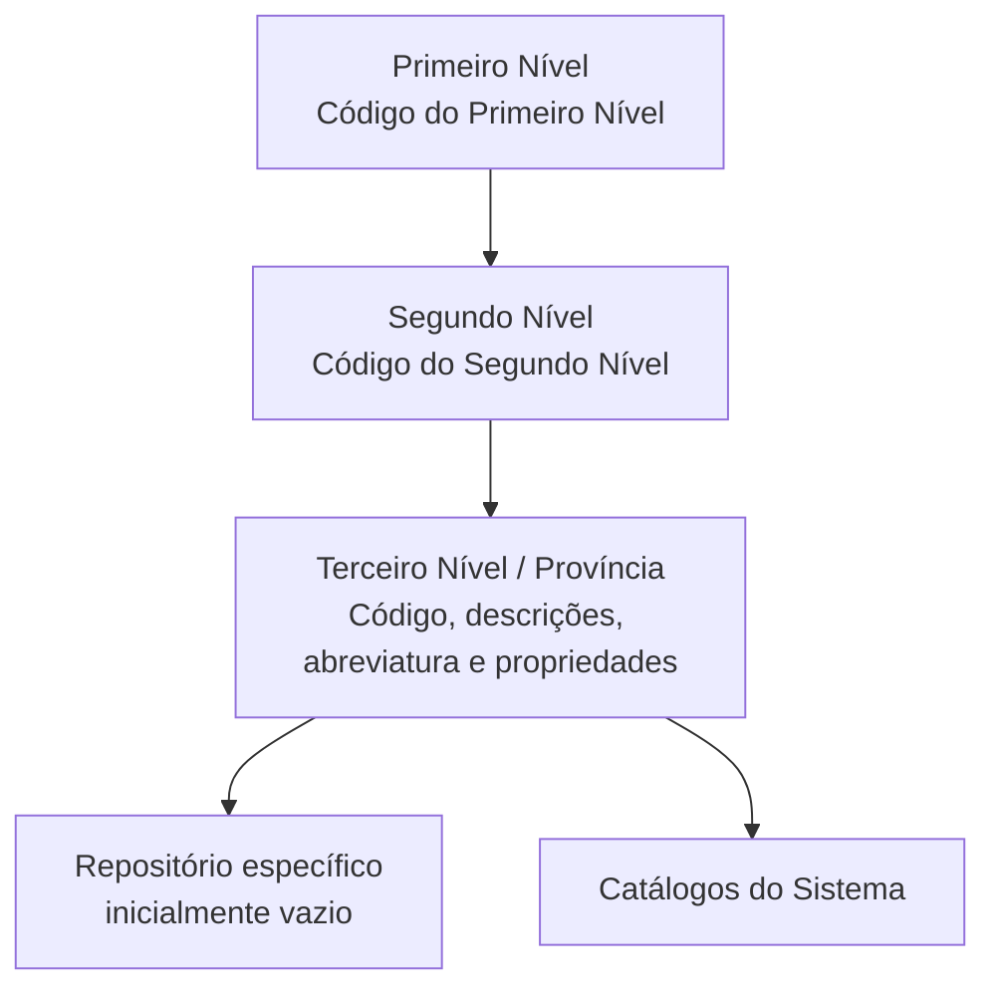

# Relatório de Ingestão de Documento para RAG

**Arquivo de origem:** `01-TRON_01-Doc_01-Mod_01-Comunes_01-Def_03-Estructura-geografica_DEFINIR-Nivel3-Estructura-Geografica.pdf`
**Data de processamento:** 21/09/2026 08:59:16
**Modelo de interpretação:** gpt-5.6-terra (axet-code)
**Prompt utilizado:** [analise_documento_rag.md](file:///Users/gcostabe/dev/AGENTE-CONTEXT-GEN/prompts/analise_documento_rag.md)

---

# Estrutura Geográfica — Definição do Terceiro Nível (Províncias)

## 1. Metadados do Documento
- **Arquivo de Origem:** Não identificado no conteúdo fornecido
- **Tipo de Documento:** Especificação Técnica / Funcional
- **Domínio / Sistema:** Estrutura Geográfica do núcleo do Sistema
- **Público-Alvo:** Configuradores de catálogos, equipes funcionais e operação
- **Data/Versão Identificada:** Não identificada

---

## 2. Resumo Executivo & Contexto de Negócio

O documento define o terceiro nível da Estrutura Geográfica, referido como Províncias. O núcleo do Sistema disponibiliza um repositório específico para codificar esse nível geográfico, inicialmente entregue sem conteúdo nas instalações.

Cada registro do terceiro nível é associado hierarquicamente a uma dupla formada pelo primeiro e pelo segundo nível da Estrutura Geográfica. A identificação do registro requer os códigos dos três níveis, além de propriedades descritivas, abreviação e atributos de controle.

A especificação estabelece que descrições e abreviações devem manter coerência com o idioma usado na definição do primeiro nível geográfico relacionado. Também prevê uma descrição vernácula, alinhada ao idioma vernáculo do primeiro ou segundo nível ao qual o terceiro nível pertence.

O documento apresenta como recomendação operacional o uso das codificações realizadas pelo Serviço de Correos Local, carregadas no Sistema “AS-IS”. Para o exemplo espanhol, a fonte indicada é o Instituto Nacional de Estadística de España (I.N.E.).

---

## 3. Arquitetura, Componentes & Tecnologias Envolvidas

O conteúdo descreve uma estrutura de dados hierárquica mantida pelo núcleo do Sistema. Não são detalhados microsserviços, protocolos, métodos HTTP, bancos de dados, URLs, ambientes ou contratos JSON.

### Componentes e conceitos identificados

| Componente / Conceito | Papel descrito |
| :--- | :--- |
| Núcleo do Sistema | Disponibiliza o repositório de informação específico para a codificação do terceiro nível geográfico. |
| Repositório do Terceiro Nível | Armazena registros do terceiro nível da Estrutura Geográfica; é entregue inicialmente sem conteúdo. |
| Primeiro Nível | Nível geográfico cuja chave participa da identificação hierárquica do terceiro nível. |
| Segundo Nível | Nível geográfico cuja chave participa da identificação hierárquica do terceiro nível. |
| Terceiro Nível | Nível geográfico definido no documento, exemplificado como Províncias. |
| Catálogos do Sistema | Utilizam os códigos geográficos, respeitando o atributo de inabilitação. |
| Serviço de Correos Local | Fonte operacional recomendada para codificações carregadas no Sistema. |
| Instituto Nacional de Estadística de España (I.N.E.) | Fonte informada para os exemplos de províncias da Espanha. |



> **Nota de Análise:** O documento descreve a relação hierárquica de dados, mas não detalha a implementação tecnológica do repositório, mecanismos de integração, interfaces de manutenção ou regras de persistência.

---

## 4. Regras de Negócio, Especificações Funcionais & Processos

### 4.1 Hierarquia obrigatória

1. O terceiro nível da Estrutura Geográfica deve ser codificado em um repositório de informação específico.
2. O repositório é inicialmente entregue vazio nas instalações.
3. O código do terceiro nível deve estar associado ao código do segundo nível.
4. O código do segundo nível deve, por sua vez, estar associado ao código do primeiro nível.
5. A identificação geográfica do terceiro nível depende, portanto, da relação entre primeiro, segundo e terceiro níveis.

### 4.2 Regras de nomenclatura e idioma

1. A descrição do terceiro nível representa sua denominação ou descrição.
2. A descrição do terceiro nível deve manter coerência com o idioma utilizado na definição do primeiro nível associado.
3. A descrição vernácula do terceiro nível deve refletir o idioma vernáculo do primeiro ou segundo nível geográfico ao qual pertence.
4. A abreviatura do terceiro nível deve ser coerente com o idioma utilizado na definição do primeiro nível associado.

### 4.3 Regras de disponibilidade

1. A propriedade **Inhabilitación** estabelece que o código do segundo nível da Estrutura Geográfica está inabilitado para emprego na configuração dos catálogos do Sistema.
2. A propriedade **Nivel Real** define se o código do terceiro nível é um nível real ou genérico.
3. Para cada dupla de primeiro e segundo nível, pode existir somente um registro com a propriedade **Nivel Real** não ativada.
4. A propriedade **Nivel Real** é de uso interno e foi criada para uso do núcleo da Aplicação.

### 4.4 Recomendação operacional

1. A prática recomendada é utilizar as codificações realizadas pelo Serviço de Correos Local.
2. As codificações do Serviço de Correos Local devem ser carregadas no Sistema “AS-IS”, isto é, sem transformação explicitamente descrita no documento.

> **Nota de Análise:** O documento não especifica o comportamento de inclusão, alteração, exclusão, validação automática ou tratamento de duplicidades dos registros do terceiro nível.

---

## 5. Tabelas de Parâmetros, Ambientes e Estruturas de Dados

| Item / Parâmetro | Descrição / Função | Tipo / Valores / Formato | Ambiente / Observações |
| :--- | :--- | :--- | :--- |
| Código do Primeiro Nível | Chave que identifica o primeiro nível da Estrutura Geográfica. | Código / chave | Participa da associação hierárquica do terceiro nível. |
| Código do Segundo Nível | Chave que identifica o segundo nível da Estrutura Geográfica. | Código / chave | Deve estar associado ao primeiro nível. |
| Código do Terceiro Nível | Chave que identifica o terceiro nível da Estrutura Geográfica. | Código / chave | Deve estar associado ao segundo nível e, indiretamente, ao primeiro nível. |
| Descrição do Terceiro Nível | Denominação ou descrição do terceiro nível. | Texto | Deve ser coerente com o idioma do primeiro nível associado. |
| Descrição Vernácula do Terceiro Nível | Denominação ou descrição conforme o idioma vernáculo aplicável. | Texto | Deve corresponder ao idioma vernáculo do primeiro ou segundo nível. |
| Abreviatura do Terceiro Nível | Denominação ou descrição abreviada do terceiro nível. | Texto abreviado | Deve ser coerente com o idioma do primeiro nível associado. |
| Inhabilitación | Indica que o código do segundo nível está inabilitado para uso na configuração dos catálogos. | Propriedade de controle | O texto menciona o segundo nível, embora esteja listado nas propriedades do terceiro nível. |
| Nivel Real | Indica se o terceiro nível é real ou genérico. | Propriedade de controle | Somente um registro sem ativação por dupla Primeiro/Segundo Nível. Uso interno do núcleo da Aplicação. |
| Repositório específico | Local de codificação dos terceiros níveis geográficos. | Repositório de informação | Entregue inicialmente vazio. |
| Fonte recomendada | Codificações do Serviço de Correos Local. | Referência operacional | Carregamento recomendado “AS-IS”. |
| Fonte do exemplo espanhol | Instituto Nacional de Estadística de España. | Referência externa mencionada | O documento referencia a Web do I.N.E. |

### Exemplo de registros apresentados

| Chaves do 1º e 2º Nível | Chave do Terceiro Nível | Descrição | Descrição Vernácula | Abreviatura |
| :--- | :--- | :--- | :--- | :--- |
| ESP - 001 | 04 | Almería | Almería | AL |
| ESP - 001 | 11 | Cádiz | Cádiz | CA |
| ESP - 001 | 14 | Córdoba | Córdoba | CO |
| ESP - 001 | 18 | Granada | Granada | GR |

---

## 6. Bateria de Perguntas & Respostas para RAG (FAQ Sintético)

### P1: Qual é o objetivo do repositório específico do terceiro nível da Estrutura Geográfica?
**R:** O repositório específico permite codificar os terceiros níveis da Estrutura Geográfica. Segundo o documento, esse repositório é inicialmente entregue vazio nas instalações.

### P2: Como o código do terceiro nível geográfico se relaciona com os demais níveis?
**R:** O código do terceiro nível deve estar associado à chave do segundo nível. O segundo nível, por sua vez, deve estar associado à chave do primeiro nível da Estrutura Geográfica.

### P3: O que representa a descrição do terceiro nível?
**R:** A descrição do terceiro nível contém sua denominação ou descrição. Essa denominação deve estar em coerência com o idioma usado na definição do primeiro nível geográfico associado.

### P4: Para que serve a descrição vernácula do terceiro nível?
**R:** A descrição vernácula contém a denominação ou descrição do terceiro nível de acordo com o idioma vernáculo do primeiro ou segundo nível geográfico ao qual o registro pertence.

### P5: Qual regra de idioma deve ser seguida pela abreviatura do terceiro nível?
**R:** A abreviatura do terceiro nível deve estar em consonância com o idioma utilizado na definição do primeiro nível da Estrutura Geográfica ao qual o terceiro nível está associado.

### P6: Qual é o efeito da propriedade Inhabilitación?
**R:** A propriedade Inhabilitación estabelece que o código do segundo nível da Estrutura Geográfica está inabilitado para ser empregado na configuração dos catálogos do Sistema.

### P7: O que significa a propriedade Nivel Real?
**R:** A propriedade Nivel Real define se o código do terceiro nível da Estrutura Geográfica corresponde a um nível real ou a um nível genérico. É uma propriedade de uso interno do núcleo da Aplicação.

### P8: Existe alguma restrição para registros com Nivel Real não ativado?
**R:** Sim. Pode existir apenas um único registro com a propriedade Nivel Real sem ativação para cada dupla formada pelo primeiro e segundo nível da Estrutura Geográfica.

### P9: Qual prática operacional é recomendada para a codificação local do terceiro nível?
**R:** O documento recomenda utilizar as codificações realizadas pelo Serviço de Correos Local e carregá-las no Sistema “AS-IS”.

### P10: Qual fonte é indicada para os exemplos de províncias da Espanha?
**R:** A nota do documento informa que os exemplos foram obtidos do Instituto Nacional de Estadística de España, com referência à Web do I.N.E.

### P11: Quais províncias aparecem explicitamente no exemplo espanhol?
**R:** O exemplo apresenta Almería, Cádiz, Córdoba e Granada, associadas respectivamente aos códigos de terceiro nível 04, 11, 14 e 18, sob as chaves de primeiro e segundo nível `ESP - 001`.

---

## 7. Glossário de Termos, Siglas & Conceitos-Chave

- **Estrutura Geográfica:** Organização hierárquica composta por primeiro, segundo e terceiro níveis geográficos.
- **Primeiro Nível:** Primeiro nível hierárquico da Estrutura Geográfica, identificado por uma chave.
- **Segundo Nível:** Segundo nível hierárquico da Estrutura Geográfica, identificado por uma chave e associado ao primeiro nível.
- **Terceiro Nível:** Terceiro nível hierárquico da Estrutura Geográfica, exemplificado no documento como Províncias.
- **Descrição Vernácula:** Denominação do terceiro nível segundo o idioma vernáculo aplicável ao primeiro ou segundo nível relacionado.
- **Inhabilitación:** Propriedade que impede o emprego do código do segundo nível na configuração dos catálogos do Sistema.
- **Nivel Real:** Propriedade interna que identifica se o terceiro nível é real ou genérico.
- **AS-IS:** Forma de carregamento recomendada para as codificações do Serviço de Correos Local, sem transformação descrita pelo documento.
- **I.N.E.:** Instituto Nacional de Estadística de España.
- **Serviço de Correos Local:** Entidade cujas codificações são recomendadas como referência operacional para carga no Sistema.

---

## 8. Notas Críticas, Riscos & Limitações

- O repositório do terceiro nível é entregue inicialmente vazio, portanto a disponibilidade de dados depende de carga posterior.
- A especificação não detalha tecnologias, integrações, mecanismos de persistência, APIs, permissões ou procedimentos de carga.
- O documento não esclarece critérios para classificar concretamente um registro como nível real ou genérico.
- A propriedade **Inhabilitación** é descrita como relativa ao código do segundo nível, embora apareça na seção de outras propriedades do terceiro nível.
- A recomendação de carregar dados do Serviço de Correos Local “AS-IS” não informa processos de validação, normalização, aprovação ou atualização.
- A seção final “Audiencia” está incompleta no conteúdo fornecido.

---

## 9. Conteúdo Bruto Estruturado (Referência Fiel)

```text
--- [PÁGINA 1 DE 3] ---

DEFINICIÓN del Tercer Nivel de la Estructura
Geográfica (Provincias)
Propiedades Generales
Funcionalmente, el núcleo del Sistema cuenta con la posibilidad de codificar los terceros niveles de la
estructura Geográfica en un repositorio de información específico que se entrega inicialmente a las
instalaciones vacío de contenido.
Código del Primer Nivel
Este atributo contiene la clave que identificará al Primer Nivel de la estructura Geográfica.
Código del Segundo Nivel
Este atributo identifica específicamente la clave que identificará al Segundo Nivel de la estructura
Geográfica.
Código del Tercer Nivel
Este atributo identifica específicamente la clave que identificará al Tercer Nivel de la estructura
Geográfica que estará asociada en el catálogo a la clave del segundo nivel de la estructura y que
estará a su vez asociada en el catálogo a la clave del primer nivel de la estructura.
Descripción del Tercer Nivel
 / 
 CF
Home Solutions APIs Documentation Zeus
EN


--- [PÁGINA 2 DE 3] ---

Esta propiedad contiene la denominación o descripción del Tercer Nivel (denominación que debería
estar en coherencia con el idioma utilizado en la definición del primer nivel de la estructura al que
está asociado).
Descripción Vernácula del Tercer Nivel
Esta propiedad contiene la denominación o descripción del Tercer Nivel de la Estructura Geográfica
de acuerdo con el idioma vernáculo del primer o segundo nivel de la estructura geográfica al que
pertenezca.
Abreviatura del Tercer Nivel
Esta propiedad contiene la denominación o descripción abreviada del Tercer Nivel (abreviatura que
debería estar en consonancia con el idioma utilizado en la definición del primer nivel de la estructura
al que está asociado)
A modo de ejemplo y si el Idioma utilizado en la definición del Primer Nivel de la Estructura es el
español:
Claves del 1er. y
2º Nivel
Clave del Tercer
Nivel
Descripción Vernáculo Abreviatura
ESP - 001 04 Almería Almería AL
ESP - 001 11 Cádiz Cádiz CA
ESP - 001 14 Córdoba Córdoba CO
ESP - 001 18 Granada Granada GR
... ... ... ... ...
NOTA: Información obtenida del Instituto Nacional de Estadística de España: Web del I.N.E
Otras Propiedades
Inhabilitación
Esta propiedad establece que el Código del Segundo Nivel de la Estructura está inhabilitado para
poder ser empleado en la configuración de los catálogos del Sistema.
Nivel Real


--- [PÁGINA 3 DE 3] ---

Esta propiedad establece que el Código del Tercer Nivel de la Estructura Geográfica es un Nivel Real
o un Nivel Genérico (puede existir un único Registro con esta Propiedad sin activar por cada dupla
Primer/Segundo Nivel de la estructura)
NOTA: Esta propiedad es de uso interno, creada por y para uso del núcleo de la Aplicación.
Vínculos
Relación de Directrices y Documentos funcionales cuya lectura recomendada para evitar que la
interpretación aislada del presente documento pueda conducir a error.
Denominaciones Locales de los Niveles de la Estructura Geográfica
Preguntas frecuentes
(1) ¿Existe alguna recomendación operativa que deba ser tomada en consideración localmente en la
codificación, uso y definición del Tercer Nivel de la Estructura Geográfica?
Una práctica que se recomienda como modelo es utilizar las codificaciones realizadas por el Servicio
de Correos Local y cargarlas AS-IS en el Sistema.
Audiencia
```

---

## Conteúdo Bruto Extraído (Original Completo)

```text
--- [PÁGINA 1 DE 3] ---

DEFINICIÓN del Tercer Nivel de la Estructura
Geográfica (Provincias)
Propiedades Generales
Funcionalmente, el núcleo del Sistema cuenta con la posibilidad de codificar los terceros niveles de la
estructura Geográfica en un repositorio de información específico que se entrega inicialmente a las
instalaciones vacío de contenido.
Código del Primer Nivel
Este atributo contiene la clave que identificará al Primer Nivel de la estructura Geográfica.
Código del Segundo Nivel
Este atributo identifica específicamente la clave que identificará al Segundo Nivel de la estructura
Geográfica.
Código del Tercer Nivel
Este atributo identifica específicamente la clave que identificará al Tercer Nivel de la estructura
Geográfica que estará asociada en el catálogo a la clave del segundo nivel de la estructura y que
estará a su vez asociada en el catálogo a la clave del primer nivel de la estructura.
Descripción del Tercer Nivel
 / 
 CF
Home Solutions APIs Documentation Zeus
EN


--- [PÁGINA 2 DE 3] ---

Esta propiedad contiene la denominación o descripción del Tercer Nivel (denominación que debería
estar en coherencia con el idioma utilizado en la definición del primer nivel de la estructura al que
está asociado).
Descripción Vernácula del Tercer Nivel
Esta propiedad contiene la denominación o descripción del Tercer Nivel de la Estructura Geográfica
de acuerdo con el idioma vernáculo del primer o segundo nivel de la estructura geográfica al que
pertenezca.
Abreviatura del Tercer Nivel
Esta propiedad contiene la denominación o descripción abreviada del Tercer Nivel (abreviatura que
debería estar en consonancia con el idioma utilizado en la definición del primer nivel de la estructura
al que está asociado)
A modo de ejemplo y si el Idioma utilizado en la definición del Primer Nivel de la Estructura es el
español:
Claves del 1er. y
2º Nivel
Clave del Tercer
Nivel
Descripción Vernáculo Abreviatura
ESP - 001 04 Almería Almería AL
ESP - 001 11 Cádiz Cádiz CA
ESP - 001 14 Córdoba Córdoba CO
ESP - 001 18 Granada Granada GR
... ... ... ... ...
NOTA: Información obtenida del Instituto Nacional de Estadística de España: Web del I.N.E
Otras Propiedades
Inhabilitación
Esta propiedad establece que el Código del Segundo Nivel de la Estructura está inhabilitado para
poder ser empleado en la configuración de los catálogos del Sistema.
Nivel Real


--- [PÁGINA 3 DE 3] ---

Esta propiedad establece que el Código del Tercer Nivel de la Estructura Geográfica es un Nivel Real
o un Nivel Genérico (puede existir un único Registro con esta Propiedad sin activar por cada dupla
Primer/Segundo Nivel de la estructura)
NOTA: Esta propiedad es de uso interno, creada por y para uso del núcleo de la Aplicación.
Vínculos
Relación de Directrices y Documentos funcionales cuya lectura recomendada para evitar que la
interpretación aislada del presente documento pueda conducir a error.
Denominaciones Locales de los Niveles de la Estructura Geográfica
Preguntas frecuentes
(1) ¿Existe alguna recomendación operativa que deba ser tomada en consideración localmente en la
codificación, uso y definición del Tercer Nivel de la Estructura Geográfica?
Una práctica que se recomienda como modelo es utilizar las codificaciones realizadas por el Servicio
de Correos Local y cargarlas AS-IS en el Sistema.
Audiencia
```
