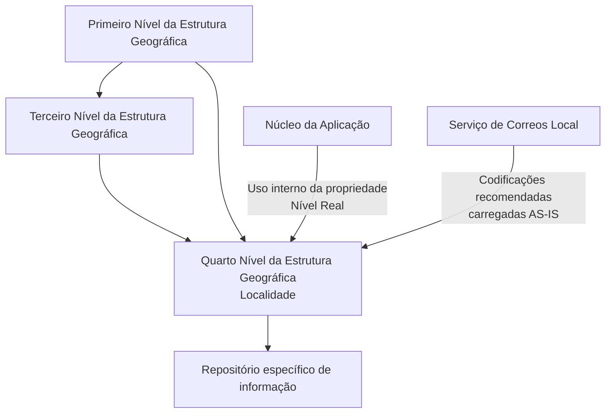

# Relatório de Ingestão de Documento para RAG

**Arquivo de origem:** `01-TRON_01-Doc_01-Mod_01-Comunes_01-Def_03-Estructura-geografica_DEFINIR-Nivel4-Estructura-Geografica.pdf`
**Data de processamento:** 21/09/2026 09:00:25
**Modelo de interpretação:** gpt-5.6-terra (axet-code)
**Prompt utilizado:** [analise_documento_rag.md](file:///Users/gcostabe/dev/AGENTE-CONTEXT-GEN/prompts/analise_documento_rag.md)

---

# Definição do Quarto Nível da Estrutura Geográfica — Localidades

## 1. Metadados do Documento
- **Arquivo de Origem:** `Não informado`
- **Tipo de Documento:** `Especificação Técnica`
- **Domínio / Sistema:** `Estrutura Geográfica / Catálogos de Localidades`
- **Público-Alvo:** `Não identificado explicitamente; conteúdo aplicável a equipes que configuram e mantêm catálogos geográficos no Sistema`
- **Data/Versão Identificada:** `Não identificada`

---

## 2. Resumo Executivo & Contexto de Negócio

O documento define as propriedades funcionais do Quarto Nível da Estrutura Geográfica, referido como localidades. O núcleo do Sistema permite codificar esse nível geográfico em um repositório de informação específico, inicialmente entregue sem conteúdo nas instalações.

A estrutura de um registro de Quarto Nível vincula uma localidade a um Código do Primeiro Nível e a um Código do Terceiro Nível. O Código do Quarto Nível é associado, no catálogo, ao Terceiro Nível correspondente e, indiretamente, ao Primeiro Nível associado àquela estrutura geográfica.

A especificação estabelece atributos descritivos destinados a preservar a coerência linguística da hierarquia geográfica: descrição do Quarto Nível, descrição vernácula e abreviatura. Esses campos devem estar em consonância com o idioma utilizado na definição do Primeiro Nível ao qual a localidade está associada.

O documento também define propriedades operacionais para inabilitação e classificação do nível como real ou genérico. A propriedade de nível real é interna ao núcleo da Aplicação e existe uma restrição de unicidade: pode haver apenas um registro com essa propriedade não ativada para cada subconjunto formado por Primeiro, Terceiro e Quarto Nível.

Como recomendação operacional, o documento indica utilizar as codificações do Serviço de Correos Local e carregá-las no Sistema no formato **AS-IS**, isto é, sem transformação explicitamente descrita.

---

## 3. Arquitetura, Componentes & Tecnologias Envolvidas

O documento descreve uma estrutura hierárquica de catálogos geográficos composta, no mínimo, por:

- **Primeiro Nível da Estrutura Geográfica:** nível identificado por uma chave própria e associado a um idioma de definição.
- **Terceiro Nível da Estrutura Geográfica:** nível identificado por uma chave própria e relacionado ao Primeiro Nível.
- **Quarto Nível da Estrutura Geográfica:** localidade identificada por uma chave própria e associada ao Terceiro Nível e ao Primeiro Nível.
- **Repositório específico de informação:** repositório utilizado pelo núcleo do Sistema para codificar os Quartos Níveis da Estrutura Geográfica.
- **Núcleo da Aplicação:** componente interno que utiliza a propriedade de classificação entre nível real e nível genérico.
- **Serviço de Correos Local:** fonte recomendada para as codificações de localidades.



### Relação hierárquica identificada

| Componente | Relação descrita |
| :--- | :--- |
| Código do Primeiro Nível | Identifica o Primeiro Nível da Estrutura Geográfica. |
| Código do Terceiro Nível | Identifica o Terceiro Nível da Estrutura Geográfica. |
| Código do Quarto Nível | Identifica o Quarto Nível associado, no catálogo, ao Terceiro Nível e ao Primeiro Nível. |
| Repositório específico | Armazena a codificação dos Quartos Níveis da Estrutura Geográfica. |
| Núcleo da Aplicação | Utiliza internamente a propriedade que classifica um registro como nível real ou nível genérico. |

> **Nota de Análise:** O documento não detalha tecnologia de persistência, contratos de integração, métodos HTTP, URLs, ambientes, esquemas físicos de banco de dados ou interfaces de manutenção do catálogo geográfico.

---

## 4. Regras de Negócio, Especificações Funcionais & Processos

### 4.1 Codificação do Quarto Nível

1. O núcleo do Sistema possui a capacidade de codificar os Quartos Níveis da Estrutura Geográfica.
2. Os Quartos Níveis são mantidos em um repositório específico de informação.
3. O repositório é entregue inicialmente vazio nas instalações.
4. Cada registro de Quarto Nível deve possuir uma chave que o identifique especificamente.
5. O Quarto Nível deve ser associado no catálogo ao Terceiro Nível da Estrutura Geográfica.
6. O Quarto Nível também deve estar associado, no catálogo, ao Primeiro Nível da Estrutura Geográfica.

### 4.2 Coerência de idioma nas descrições

1. A descrição do Quarto Nível deve estar em coerência com o idioma utilizado na definição do Primeiro Nível da Estrutura Geográfica ao qual o Quarto Nível está associado.
2. A descrição vernácula do Quarto Nível deve estar em consonância com o idioma configurado no Primeiro Nível da Estrutura Geográfica relacionado.
3. A abreviatura do Quarto Nível deve seguir a mesma coerência linguística exigida para os demais atributos descritivos.

### 4.3 Inabilitação de códigos

1. A propriedade **Inhabilitación** determina que o Código do Quarto Nível esteja inabilitado.
2. Um Código do Quarto Nível inabilitado não pode ser empregado na configuração dos catálogos da Estrutura Geográfica definida no Sistema.

### 4.4 Classificação entre nível real e nível genérico

1. A propriedade **Nivel Real** estabelece se o Código do Quarto Nível corresponde a um nível real ou a um nível genérico.
2. Pode existir apenas um registro com a propriedade de Nível Real não ativada para cada subconjunto composto por Primeiro Nível, Terceiro Nível e Quarto Nível.
3. A propriedade de Nível Real é de uso interno.
4. A propriedade de Nível Real foi criada pelo núcleo da Aplicação e é destinada ao uso do núcleo da Aplicação.

### 4.5 Recomendação operacional para carga de localidades

1. Recomenda-se utilizar as codificações realizadas pelo Serviço de Correos Local.
2. As codificações do Serviço de Correos Local devem ser carregadas no Sistema **AS-IS**.
3. O documento não detalha transformações, validações técnicas, formato de arquivo ou processo de integração para essa carga.

---

## 5. Tabelas de Parâmetros, Ambientes e Estruturas de Dados

| Item / Parâmetro | Descrição / Função | Tipo / Valores / Formato | Ambiente / Observações |
| :--- | :--- | :--- | :--- |
| Código do Primeiro Nível | Chave que identifica o Primeiro Nível da Estrutura Geográfica. | Código / chave identificadora. | Associado à estrutura geográfica superior e ao idioma de definição mencionado no documento. |
| Código do Terceiro Nível | Chave que identifica especificamente o Terceiro Nível da Estrutura Geográfica. | Código / chave identificadora. | É referência de associação para o Quarto Nível. |
| Código do Quarto Nível | Chave que identifica especificamente uma localidade do Quarto Nível. | Código / chave identificadora. | Associado, no catálogo, ao Terceiro Nível e ao Primeiro Nível. |
| Descrição do Quarto Nível | Denominação ou descrição da localidade. | Texto. | Deve ser coerente com o idioma usado na definição do Primeiro Nível associado. |
| Descrição Vernácula do Quarto Nível | Denominação ou descrição vernácula da localidade. | Texto. | Deve estar em consonância com o idioma configurado no Primeiro Nível relacionado. |
| Abreviatura do Quarto Nível | Denominação ou descrição abreviada da localidade. | Texto abreviado. | Deve ser coerente com o idioma usado no Primeiro Nível associado. |
| Inhabilitación | Define que o Código do Quarto Nível está inabilitado para uso na configuração de catálogos geográficos. | Propriedade de habilitação/inabilitação. | Código inabilitado não pode ser empregado nos catálogos da Estrutura Geográfica. |
| Nivel Real | Define se o Código do Quarto Nível é um nível real ou genérico. | Propriedade interna. | Uso interno do núcleo da Aplicação; existe uma restrição de unicidade para registros com a propriedade não ativada. |
| Repositório de informação específico | Repositório que armazena a codificação dos Quartos Níveis. | Repositório de dados. | Entregue inicialmente vazio nas instalações. |
| Serviço de Correos Local | Fonte recomendada para as codificações de localidades. | Fonte de codificação externa mencionada. | Recomenda-se carregar as codificações AS-IS no Sistema. |

### Exemplo de localidades apresentado

| Chave de Níveis 1/3 | Chave do Quarto Nível | Descrição |
| :--- | :--- | :--- |
| ESP - 28 | 0001 | Álamo, EL |
| ESP - 28 | 0002 | Alcalá de Henares |
| ESP - 28 | 0003 | Alcobendas |
| ESP - 28 | 0004 | Alcorcón |
| ... | ... | ... |

### Exemplo contextual informado

| Elemento | Valor apresentado |
| :--- | :--- |
| Idioma utilizado na definição do Primeiro Nível | espanhol |
| Primeiro Nível | ESP - España |
| Terceiro Nível | 28 - Madrid |
| Combinação de chaves de níveis | ESP - 28 |

---

## 6. Bateria de Perguntas & Respostas para RAG (FAQ Sintético)

### P1: Qual é a finalidade do repositório específico do Quarto Nível da Estrutura Geográfica?
**R:** O repositório específico é utilizado pelo núcleo do Sistema para codificar e armazenar os Quartos Níveis da Estrutura Geográfica, correspondentes a localidades. O documento informa que esse repositório é entregue inicialmente vazio nas instalações.

### P2: Como o Código do Quarto Nível se relaciona com os demais níveis geográficos?
**R:** O Código do Quarto Nível identifica especificamente uma localidade. Esse código deve estar associado no catálogo à chave do Terceiro Nível da Estrutura Geográfica e também à chave do Primeiro Nível da Estrutura Geográfica.

### P3: O que representa o Código do Primeiro Nível da Estrutura Geográfica?
**R:** O Código do Primeiro Nível é o atributo que contém a chave identificadora do Primeiro Nível da Estrutura Geográfica. O documento também relaciona o Primeiro Nível ao idioma utilizado para definir as descrições da estrutura associada.

### P4: Qual regra deve ser seguida para preencher a descrição de uma localidade do Quarto Nível?
**R:** A Descrição do Quarto Nível deve conter a denominação da localidade e deve estar em coerência com o idioma utilizado na definição do Primeiro Nível da Estrutura Geográfica ao qual a localidade está associada.

### P5: Para que serve a Descrição Vernácula do Quarto Nível?
**R:** A Descrição Vernácula do Quarto Nível contém a denominação ou descrição vernácula da localidade. Essa descrição deve estar em consonância com o idioma configurado no Primeiro Nível da Estrutura Geográfica ao qual o Quarto Nível está conectado.

### P6: O que acontece quando um Código do Quarto Nível está inabilitado?
**R:** Quando a propriedade de Inhabilitación estabelece que um Código do Quarto Nível está inabilitado, esse código não pode ser utilizado na configuração dos catálogos da Estrutura Geográfica definida no Sistema.

### P7: O que a propriedade Nivel Real indica para uma localidade?
**R:** A propriedade Nivel Real indica se o Código do Quarto Nível da Estrutura Geográfica corresponde a um nível real ou a um nível genérico. O documento declara que essa propriedade é de uso interno e foi criada para utilização pelo núcleo da Aplicação.

### P8: Existe uma restrição para registros cujo Nivel Real não está ativado?
**R:** Sim. O documento estabelece que pode existir apenas um registro com a propriedade Nivel Real não ativada para cada subconjunto formado pelo Primeiro Nível, pelo Terceiro Nível e pelo Quarto Nível da Estrutura Geográfica.

### P9: Qual é a recomendação operacional para a codificação de localidades?
**R:** A recomendação apresentada é utilizar como modelo as codificações realizadas pelo Serviço de Correos Local e carregá-las AS-IS no Sistema.

### P10: Quais localidades são apresentadas como exemplo para ESP - 28?
**R:** Para a combinação de níveis ESP - 28, associada no exemplo a ESP - España e 28 - Madrid, o documento apresenta: código 0001 para Álamo, EL; código 0002 para Alcalá de Henares; código 0003 para Alcobendas; e código 0004 para Alcorcón.

### P11: O documento informa como integrar automaticamente os códigos do Serviço de Correos Local?
**R:** Não. O documento recomenda utilizar as codificações do Serviço de Correos Local e carregá-las AS-IS, mas não detalha mecanismos de integração, formatos de arquivos, contratos de serviço, APIs, validações ou frequência de carga.

### P12: O documento define tecnologias, banco de dados ou URLs para o repositório geográfico?
**R:** Não. O documento menciona um repositório específico de informação para o Quarto Nível, mas não informa tecnologia de armazenamento, nomes de tabelas, URLs, portas, ambientes, credenciais ou interfaces técnicas.

---

## 7. Glossário de Termos, Siglas & Conceitos-Chave

- **AS-IS:** Indicação de que as codificações devem ser carregadas no Sistema tal como foram realizadas pelo Serviço de Correos Local, sem transformação explicitamente descrita.
- **Código do Primeiro Nível:** Chave que identifica o Primeiro Nível da Estrutura Geográfica.
- **Código do Terceiro Nível:** Chave que identifica o Terceiro Nível da Estrutura Geográfica.
- **Código do Quarto Nível:** Chave que identifica especificamente uma localidade no Quarto Nível da Estrutura Geográfica.
- **Descrição Vernácula:** Denominação ou descrição da localidade que deve estar em consonância com o idioma configurado no Primeiro Nível relacionado.
- **Estrutura Geográfica:** Hierarquia de níveis geográficos formada, no conteúdo fornecido, por Primeiro, Terceiro e Quarto Níveis.
- **Inhabilitación:** Propriedade que impede o uso de um Código do Quarto Nível na configuração dos catálogos da Estrutura Geográfica.
- **Nivel Real:** Propriedade interna do núcleo da Aplicação que classifica o Código do Quarto Nível como nível real ou nível genérico.
- **Núcleo da Aplicação:** Componente central do Sistema que utiliza internamente a propriedade Nivel Real.
- **Quarto Nível:** Nível da Estrutura Geográfica associado a localidades.
- **Serviço de Correos Local:** Entidade ou serviço citado como fonte recomendada para as codificações de localidades.

---

## 8. Notas Críticas, Riscos & Limitações

- O repositório destinado aos Quartos Níveis é entregue vazio, exigindo carga inicial de conteúdo para disponibilização de localidades no Sistema.
- A coerência linguística entre o Primeiro Nível e as descrições do Quarto Nível é uma regra explícita; cargas que não respeitem o idioma associado podem produzir inconsistência semântica nos catálogos geográficos.
- Códigos marcados como inabilitados não podem ser usados na configuração dos catálogos da Estrutura Geográfica.
- A propriedade Nivel Real possui uma restrição de unicidade para registros não ativados dentro de cada subconjunto de Primeiro, Terceiro e Quarto Nível.
- A propriedade Nivel Real é interna ao núcleo da Aplicação; o documento não descreve como usuários, integrações ou processos externos devem manipulá-la.
- A recomendação de carga AS-IS a partir do Serviço de Correos Local não inclui especificação de interface, validação, transformação, periodicidade, responsáveis ou mecanismo de auditoria.
- O documento aponta a leitura recomendada de documentos sobre denominações locais e perguntas frequentes para evitar interpretações isoladas incorretas, mas não fornece o conteúdo desses documentos.
- Não há detalhamento sobre APIs, métodos HTTP, modelos JSON, banco de dados, ambientes, URLs, controles de acesso ou procedimentos de operação.

---

## 9. Conteúdo Bruto Estruturado (Referência Fiel)

```text
--- [PÁGINA 1 DE 3] ---

width="596" height="159" style="display: block; margin: 0 auto" }
DEFINICIÓN del Cuarto Nivel de la Estructura
Geográfica (Localidades)
Propiedades Generales
Funcionalmente, el núcleo del Sistema cuenta con la posibilidad de codificar los Cuartos niveles de la
estructura Geográfica en un repositorio de información específico que se entrega inicialmente a las
instalaciones vacío de contenido.
Código del Primer Nivel
Este atributo contiene la clave que identificará al Primer Nivel de la estructura Geográfica.
Código del Tercer Nivel
Este atributo identifica específicamente la clave que identificará al Tercer Nivel de la estructura
Geográfica.
Código del Cuarto Nivel
Este atributo identifica específicamente la clave que identificará al Cuarto Nivel de la estructura
Geográfica que estará asociada en el catálogo a la clave del Tercer nivel de la estructura y que
estará a su vez asociada en el catálogo a la clave del primer nivel de la estructura.
 /
 CF
Home Solutions APIs Documentation Zeus
EN


--- [PÁGINA 2 DE 3] ---

A modo de ejemplo y si el Idioma utilizado en la definición del Primer Nivel de la Estructura es el
español para ESP - España / 28 - Madrid:
Clave de Niveles ⅓ Clave del Cuarto Nivel Descripción
ESP - 28 0001 Álamo, EL
ESP - 28 0002 Alcalá de Henares
ESP - 28 0003 Alcobendas
ESP - 28 0004 Alcorcón
... ... ...
Descripción del Cuarto Nivel
Esta propiedad contiene la denominación o descripción del Cuarto Nivel (denominación que debería
estar en coherencia con el idioma utilizado en la definición del primer nivel de la estructura al que
está asociado).
Descripción Vernácula del Cuarto Nivel
Esta propiedad contiene la denominación o descripción del Cuarto Nivel de la Estructura Geográfica
(descripción que debería estar en consonancia con el idioma utilizado en la configuración del primer
nivel de la estructura geográfica con el que está conectado).
Abreviatura del Cuarto Nivel
Esta propiedad contiene la denominación o descripción abreviada del Cuarto Nivel (al igual que con
el Atributo anterior, debería estar en consonancia con el idioma utilizado en la definición del primer
nivel de la estructura al que está asociado)
Otras Propiedades
Inhabilitación
Esta propiedad establece que el Código del Cuarto Nivel de la Estructura está inhabilitado para poder
ser empleado en la configuración de los catálogos de la Estructura Geográfica definida en el Sistema.
Nivel Real


--- [PÁGINA 3 DE 3] ---

Esta propiedad establece que el Código del Cuarto Nivel de la Estructura Geográfica es un Nivel
Real o un Nivel Genérico (puede existir un único Registro con esta Propiedad sin activar por cada
subconjunto de Primer/Tercer y Cuarto Nivel de la estructura)
NOTA: Esta propiedad es de uso interno, creada por y para uso del núcleo de la Aplicación.
Vínculos
Relación de Directrices y Documentos funcionales cuya lectura recomendada para evitar que la
interpretación aislada del presente documento pueda conducir a error.
Denominaciones Locales de los Niveles de la Estructura Geográfica
Preguntas frecuentes
(1) ¿Existe alguna recomendación operativa que deba ser tomada en consideración localmente en la
codificación, uso y definición del Cuarto Nivel de la Estructura Geográfica?
Una práctica que se recomienda como modelo es utilizar las codificaciones realizadas por el Servicio
de Correos Local y cargarlas AS-IS en el Sistema.
Audiencia
```

---

## Conteúdo Bruto Extraído (Original Completo)

```text
--- [PÁGINA 1 DE 3] ---

width="596" height="159" style="display: block; margin: 0 auto" }
DEFINICIÓN del Cuarto Nivel de la Estructura
Geográfica (Localidades)
Propiedades Generales
Funcionalmente, el núcleo del Sistema cuenta con la posibilidad de codificar los Cuartos niveles de la
estructura Geográfica en un repositorio de información específico que se entrega inicialmente a las
instalaciones vacío de contenido.
Código del Primer Nivel
Este atributo contiene la clave que identificará al Primer Nivel de la estructura Geográfica.
Código del Tercer Nivel
Este atributo identifica específicamente la clave que identificará al Tercer Nivel de la estructura
Geográfica.
Código del Cuarto Nivel
Este atributo identifica específicamente la clave que identificará al Cuarto Nivel de la estructura
Geográfica que estará asociada en el catálogo a la clave del Tercer nivel de la estructura y que
estará a su vez asociada en el catálogo a la clave del primer nivel de la estructura.
 / 
 CF
Home Solutions APIs Documentation Zeus
EN


--- [PÁGINA 2 DE 3] ---

A modo de ejemplo y si el Idioma utilizado en la definición del Primer Nivel de la Estructura es el
español para ESP - España / 28 - Madrid:
Clave de Niveles ⅓ Clave del Cuarto Nivel Descripción
ESP - 28 0001 Álamo, EL
ESP - 28 0002 Alcalá de Henares
ESP - 28 0003 Alcobendas
ESP - 28 0004 Alcorcón
... ... ...
Descripción del Cuarto Nivel
Esta propiedad contiene la denominación o descripción del Cuarto Nivel (denominación que debería
estar en coherencia con el idioma utilizado en la definición del primer nivel de la estructura al que
está asociado).
Descripción Vernácula del Cuarto Nivel
Esta propiedad contiene la denominación o descripción del Cuarto Nivel de la Estructura Geográfica
(descripción que debería estar en consonancia con el idioma utilizado en la configuración del primer
nivel de la estructura geográfica con el que está conectado).
Abreviatura del Cuarto Nivel
Esta propiedad contiene la denominación o descripción abreviada del Cuarto Nivel (al igual que con
el Atributo anterior, debería estar en consonancia con el idioma utilizado en la definición del primer
nivel de la estructura al que está asociado)
Otras Propiedades
Inhabilitación
Esta propiedad establece que el Código del Cuarto Nivel de la Estructura está inhabilitado para poder
ser empleado en la configuración de los catálogos de la Estructura Geográfica definida en el Sistema.
Nivel Real


--- [PÁGINA 3 DE 3] ---

Esta propiedad establece que el Código del Cuarto Nivel de la Estructura Geográfica es un Nivel
Real o un Nivel Genérico (puede existir un único Registro con esta Propiedad sin activar por cada
subconjunto de Primer/Tercer y Cuarto Nivel de la estructura)
NOTA: Esta propiedad es de uso interno, creada por y para uso del núcleo de la Aplicación.
Vínculos
Relación de Directrices y Documentos funcionales cuya lectura recomendada para evitar que la
interpretación aislada del presente documento pueda conducir a error.
Denominaciones Locales de los Niveles de la Estructura Geográfica
Preguntas frecuentes
(1) ¿Existe alguna recomendación operativa que deba ser tomada en consideración localmente en la
codificación, uso y definición del Cuarto Nivel de la Estructura Geográfica?
Una práctica que se recomienda como modelo es utilizar las codificaciones realizadas por el Servicio
de Correos Local y cargarlas AS-IS en el Sistema.
Audiencia
```
