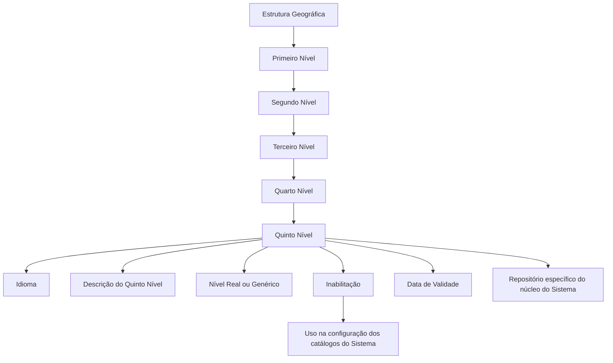

# Relatório de Ingestão de Documento para RAG

**Arquivo de origem:** `01-TRON_01-Doc_01-Mod_01-Comunes_01-Def_03-Estructura-geografica_DEFINIR-Nivel5-Estructura-Geografica.pdf`
**Data de processamento:** 21/09/2026 09:00:25
**Modelo de interpretação:** gpt-5.6-terra (axet-code)
**Prompt utilizado:** [analise_documento_rag.md](file:///Users/gcostabe/dev/AGENTE-CONTEXT-GEN/prompts/analise_documento_rag.md)

---

# Estrutura Geográfica — Definição do Quinto Nível, Propriedades e Regras de Codificação

## 1. Metadados do Documento
- **Arquivo de Origem:** Não identificado
- **Tipo de Documento:** Especificação Técnica / Documentação Funcional
- **Domínio / Sistema:** Sistema de Estrutura Geográfica; cabeçalho menciona “Home Solutions APIs Documentation Zeus”
- **Público-Alvo:** Não identificado; conteúdo direcionado à configuração funcional e operacional da estrutura geográfica
- **Data/Versão Identificada:** Não identificada

---

## 2. Resumo Executivo & Contexto de Negócio

O documento define o **Quinto Nível da Estrutura Geográfica**, destinado à codificação de entidades geográficas subordinadas aos quatro níveis anteriores, tais como distritos, delegações e comunas. O núcleo do Sistema mantém um repositório específico para essas informações, entregue inicialmente sem conteúdo.

A identificação de cada registro do Quinto Nível depende das chaves dos quatro níveis geográficos anteriores: Primeiro, Segundo, Terceiro e Quarto Nível. Essa composição permite associar múltiplos códigos de Quinto Nível a uma mesma combinação geográfica hierárquica.

A especificação estabelece propriedades funcionais para idioma, descrição, natureza real ou genérica do nível, inabilitação e data de validade. Essas propriedades suportam a utilização controlada do código geográfico, a consistência linguística e o histórico de alterações nas definições geográficas.

Como recomendação operacional, o documento orienta utilizar codificações produzidas pelo serviço postal local e carregá-las no Sistema **AS-IS**, sem alterações. Essa prática visa manter a aderência entre a codificação corporativa e a referência geográfica local.

---

## 3. Arquitetura, Componentes & Tecnologias Envolvidas

O documento não descreve arquitetura de software, tecnologias, APIs, métodos HTTP, contratos JSON, ambientes ou infraestrutura. A estrutura apresentada é funcional e baseada em um repositório de informação específico do núcleo do Sistema.

### Componentes e entidades identificados

| Componente / Entidade | Papel identificado |
| :--- | :--- |
| Núcleo do Sistema | Possui capacidade de codificar Quintos Níveis da Estrutura Geográfica. |
| Repositório específico de informação | Armazena os Quintos Níveis da Estrutura Geográfica; é entregue inicialmente vazio. |
| Estrutura Geográfica | Hierarquia formada por Primeiro, Segundo, Terceiro, Quarto e Quinto Níveis. |
| Código do Quinto Nível | Chave associada às chaves dos quatro níveis geográficos anteriores. |
| Catálogos do Sistema | Não podem utilizar códigos de Quinto Nível inabilitados. |
| Serviço de Correios Local | Fonte recomendada para codificações carregadas no Sistema. |



> **Nota de Análise:** O documento menciona “Home Solutions APIs Documentation Zeus” no cabeçalho, mas não detalha APIs, tecnologias, métodos HTTP, contratos de integração ou componentes técnicos associados.

---

## 4. Regras de Negócio, Especificações Funcionais & Processos

### 4.1 Codificação do Quinto Nível

1. O núcleo do Sistema permite codificar os Quintos Níveis da Estrutura Geográfica.
2. Os Quintos Níveis são mantidos em um repositório de informação específico.
3. O repositório é entregue inicialmente vazio.
4. O código de Quinto Nível deve ser associado às chaves dos quatro níveis anteriores da Estrutura Geográfica.
5. Um mesmo conjunto de chaves dos quatro primeiros níveis pode possuir diversos códigos de Quinto Nível.

### 4.2 Hierarquia geográfica

A estrutura definida no documento contém os seguintes níveis:

1. Primeiro Nível;
2. Segundo Nível;
3. Terceiro Nível;
4. Quarto Nível;
5. Quinto Nível.

Cada código de nível identifica uma chave específica na hierarquia geográfica. O Código do Quinto Nível representa a entidade geográfica vinculada à combinação dos quatro níveis anteriores.

### 4.3 Idioma e descrição

1. A propriedade **Idioma** identifica o idioma utilizado na definição do nível da estrutura.
2. O documento cita como exemplos códigos de idioma para espanhol, inglês e turco.
3. A **Descrição do Quinto Nível** contém a denominação do Quinto Nível.
4. A denominação deve ser coerente com o idioma utilizado na definição associada.

### 4.4 Nível Real e Nível Genérico

1. A propriedade **Nivel Real** determina se o Código do Quinto Nível é um Nível Real ou um Nível Genérico.
2. Pode existir somente um registro com essa propriedade não ativada para uma mesma combinação dos quatro níveis da estrutura.
3. A propriedade é de uso interno, criada pelo núcleo da Aplicação e destinada ao uso desse núcleo.

> **Nota de Análise:** O texto informa que pode existir um único registro com a propriedade “Nivel Real” sem ativação para os mesmos quatro níveis, mas não detalha explicitamente a correspondência entre “propriedade sem ativação” e a classificação “Nível Genérico”.

### 4.5 Inabilitação

1. A propriedade **Inhabilitación** estabelece que o Código do Quinto Nível fica inabilitado.
2. Um código inabilitado não pode ser empregado na configuração dos catálogos do Sistema.

### 4.6 Data de Validade

1. A propriedade **Fecha de Validez** indica a data a partir da qual a chave do Quinto Nível está plenamente operativa no Sistema.
2. O uso correto da data de validade permite manter um histórico das alterações efetuadas nas definições dos níveis.

### 4.7 Recomendação operacional de codificação

1. A recomendação operacional é utilizar as codificações realizadas pelo Serviço de Correios Local.
2. As codificações devem ser carregadas no Sistema **AS-IS**.
3. O documento não detalha processo de importação, formato de carga, mecanismos de validação ou responsáveis pela manutenção desses códigos.

---

## 5. Tabelas de Parâmetros, Ambientes e Estruturas de Dados

| Item / Parâmetro | Descrição / Função | Tipo / Valores / Formato | Ambiente / Observações |
| :--- | :--- | :--- | :--- |
| Código do Primeiro Nível | Contém a chave que identifica o Primeiro Nível da Estrutura Geográfica. | Chave geográfica; formato não informado. | Compõe a associação hierárquica do Quinto Nível. |
| Código do Segundo Nível | Identifica especificamente a chave do Segundo Nível da Estrutura Geográfica. | Chave geográfica; formato não informado. | Compõe a associação hierárquica do Quinto Nível. |
| Código do Terceiro Nível | Identifica especificamente a chave do Terceiro Nível da Estrutura Geográfica. | Chave geográfica; formato não informado. | Compõe a associação hierárquica do Quinto Nível. |
| Código do Quarto Nível | Identifica especificamente a chave do Quarto Nível da Estrutura Geográfica. | Chave geográfica; formato não informado. | Compõe a associação hierárquica do Quinto Nível. |
| Código do Quinto Nível | Identifica a chave do Quinto Nível associada, no catálogo, às chaves dos níveis anteriores. | Código; exemplos: `AAA1`, `AAA2`, `AAA3`, `AAA4`. | Associado aos quatro níveis anteriores. |
| Idioma | Identifica o idioma empregado na definição do nível da estrutura. | Códigos de idioma; exemplos conceituais: espanhol, inglês e turco. | A descrição deve ser coerente com o idioma. |
| Descrição do Quinto Nível | Contém a denominação ou descrição do Quinto Nível. | Texto. | Deve manter coerência com o idioma associado. |
| Nível Real | Define se o Quinto Nível é Real ou Genérico. | Propriedade interna; valores conceituais: Real ou Genérico. | Pode existir um único registro com a propriedade sem ativação para a mesma combinação dos quatro níveis. |
| Inabilitação | Define que o código não pode ser usado na configuração de catálogos do Sistema. | Propriedade de estado; valores não detalhados. | Restringe o uso do código. |
| Data de Validade | Informa quando a chave do Quinto Nível passa a estar plenamente operativa. | Data; formato não informado. | Suporta histórico de mudanças nas definições. |

### Exemplo de codificação apresentado

| Chaves dos Níveis 1/2/3/4 | Chave do Quinto Nível | Descrição |
| :--- | :--- | :--- |
| ESP - 13 - 28 - 0001 | AAA1 | Arganzuela |
| ESP - 13 - 28 - 0001 | AAA2 | Barajas |
| ESP - 13 - 28 - 0001 | AAA3 | Carabanchel |
| ESP - 13 - 28 - 0001 | AAA4 | Centro |
| ... | ... | ... |

### Referência geográfica do exemplo

| Nível | Valor apresentado |
| :--- | :--- |
| País | Espanha — `ESP` |
| Comunidade | Madrid — `13` |
| Província | Madrid — `28` |
| Cidade | Madrid — `0001` |

---

## 6. Bateria de Perguntas & Respostas para RAG (FAQ Sintético)

### P1: Qual é a finalidade do Quinto Nível da Estrutura Geográfica?
**R:** O Quinto Nível permite codificar entidades geográficas subordinadas aos quatro níveis anteriores da Estrutura Geográfica, como distritos, delegações e comunas. Essas codificações são mantidas em um repositório específico do núcleo do Sistema.

### P2: Como um código de Quinto Nível é relacionado à hierarquia geográfica?
**R:** O Código do Quinto Nível é associado, no catálogo, às chaves do Primeiro, Segundo, Terceiro e Quarto Níveis da Estrutura Geográfica. O exemplo do documento usa a combinação `ESP - 13 - 28 - 0001` para vincular códigos como `AAA1`, `AAA2`, `AAA3` e `AAA4`.

### P3: O repositório de Quintos Níveis já contém dados quando é entregue?
**R:** Não. O documento informa que o repositório de informação específico para os Quintos Níveis é entregue inicialmente vazio de conteúdo.

### P4: O que representa a propriedade Idioma no Quinto Nível?
**R:** A propriedade Idioma identifica o idioma utilizado na definição do nível da estrutura geográfica. O documento cita códigos que identifiquem idiomas como espanhol, inglês e turco.

### P5: Qual regra deve ser observada para a Descrição do Quinto Nível?
**R:** A Descrição do Quinto Nível contém a denominação da entidade geográfica e deve estar em coerência com o idioma utilizado na definição à qual está associada.

### P6: O que significa a propriedade Nível Real?
**R:** A propriedade Nível Real estabelece se o Código do Quinto Nível é um Nível Real ou um Nível Genérico. É uma propriedade de uso interno, criada pelo núcleo da Aplicação para seu próprio uso.

### P7: Existe restrição para registros relacionados ao Nível Real?
**R:** Sim. O documento informa que pode existir um único registro com essa propriedade sem ativação para uma mesma combinação dos quatro níveis da Estrutura Geográfica.

### P8: O que acontece quando um Código do Quinto Nível é inabilitado?
**R:** Um Código do Quinto Nível inabilitado não pode ser utilizado na configuração dos catálogos do Sistema.

### P9: Qual é o propósito da Data de Validade do Quinto Nível?
**R:** A Data de Validade indica a partir de quando a chave do Quinto Nível está plenamente operativa no Sistema. O uso correto dessa propriedade permite manter histórico das alterações feitas nas definições dos níveis.

### P10: Qual prática operacional é recomendada para codificar o Quinto Nível?
**R:** A recomendação é utilizar as codificações realizadas pelo Serviço de Correios Local e carregá-las no Sistema AS-IS.

### P11: Quais são os exemplos de códigos e descrições de Quinto Nível para Madrid?
**R:** Para a combinação `ESP - 13 - 28 - 0001`, o documento apresenta `AAA1` para Arganzuela, `AAA2` para Barajas, `AAA3` para Carabanchel e `AAA4` para Centro.

---

## 7. Glossário de Termos, Siglas & Conceitos-Chave

- **AS-IS:** Carregamento ou uso da codificação exatamente como fornecida pela fonte local, sem transformação descrita no documento.
- **Código do Quinto Nível:** Chave que identifica uma entidade do Quinto Nível da Estrutura Geográfica e que é associada às chaves dos quatro níveis anteriores.
- **Estrutura Geográfica:** Hierarquia composta por Primeiro, Segundo, Terceiro, Quarto e Quinto Níveis.
- **Nível Genérico:** Classificação mencionada para o Código do Quinto Nível em oposição ao Nível Real; o documento não traz detalhamento adicional.
- **Nível Real:** Propriedade que determina se o Código do Quinto Nível é Real ou Genérico; destinada ao uso interno do núcleo da Aplicação.
- **Quinto Nível:** Nível geográfico usado para representar entidades como distritos, delegações e comunas.
- **Serviço de Correios Local:** Fonte recomendada para as codificações geográficas carregadas no Sistema.

---

## 8. Notas Críticas, Riscos & Limitações

- O documento não identifica arquivo de origem, versão, data, responsável, ambiente ou público-alvo formal.
- Não há detalhamento de APIs, URLs, métodos HTTP, contratos JSON, bancos de dados, interfaces de usuário ou procedimentos técnicos de carga.
- O texto não especifica formatos de dados para códigos, idiomas ou datas.
- A propriedade **Nível Real** é descrita como interna ao núcleo da Aplicação, mas os critérios completos para classificação entre Nível Real e Nível Genérico não são apresentados.
- A recomendação de carregar codificações do Serviço de Correios Local AS-IS não define validações, periodicidade de atualização, governança de dados ou tratamento de inconsistências.
- A seção **Vínculos** recomenda a leitura de “Denominaciones Locales de los Niveles de la Estructura Geográfica” e “Preguntas frecuentes”, mas não fornece o conteúdo desses documentos vinculados.

---

## 9. Conteúdo Bruto Estruturado (Referência Fiel)

```text
--- [PÁGINA 1 DE 3] ---

DEFINICIÓN del Quinto Nivel de la Estructura
Geográfica (Distritos, Delegaciones,
Comunas,...)
Propiedades Generales
Funcionalmente, el núcleo del Sistema cuenta con la posibilidad de codificar los Quintos niveles de la
estructura Geográfica en un repositorio de información específico que se entrega inicialmente a las
instalaciones vacío de contenido.
Código del Primer Nivel
Este atributo contiene la clave que identificará al Primer Nivel de la estructura Geográfica.
Código del Segundo Nivel
Este atributo identifica específicamente la clave que identificará al Segundo Nivel de la estructura
Geográfica.
Código del Tercer Nivel
Este atributo identifica específicamente la clave que identificará al Tercer Nivel de la estructura
Geográfica.
Código del Cuarto Nivel
 /
 CF
Home Solutions APIs Documentation Zeus
EN


--- [PÁGINA 2 DE 3] ---

Este atributo identifica específicamente la clave que identificará al Cuarto Nivel de la estructura
Geográfica.
Código del Quinto Nivel
Este atributo identifica específicamente la clave que identificará al Quinto Nivel de la estructura
Geográfica que estará asociada en el catálogo a las claves de los niveles de la estructura geográfica.
A modo de ejemplo y si el Idioma utilizado en la definición del Primer Nivel de la Estructura es el
español, para el país España - ESP, La Comunidad de Madrid - 13, la Provincia de Madrid - 28 y La
Ciudad de Madrid - 0001:
Claves Niveles ½/¾ Clave del Quinto Nivel Descripción
ESP - 13 - 28 - 0001 AAA1 Arganzuela
ESP - 13 - 28 - 0001 AAA2 Barajas
ESP - 13 - 28 - 0001 AAA3 Carabanchel
ESP - 13 - 28 - 0001 AAA4 Centro
... ... ...
Idioma
Esta propiedad identifica el Idioma empleado en la definición del Nivel de la estructura, como por
ejemplo con los códigos que identifiquen a los idiomas español, inglés, turco,...
Descripción del Quinto Nivel
Esta propiedad contiene la denominación o descripción del Quinto Nivel, denominación que debería
estar en coherencia con el idioma utilizado en la definición al que está asociado.
Nivel Real
Esta propiedad establece que el Código del Quinto Nivel de la Estructura Geográfica es un Nivel Real
o un Nivel Genérico (puede existir un único Registro con esta Propiedad sin activar a igualdad en los
cuatro niveles de la estructura).
Esta propiedad es de uso interno, creada por y para uso del núcleo de la Aplicación.


--- [PÁGINA 3 DE 3] ---

Otras Propiedades
Inhabilitación
Esta propiedad establece que el Código del Quinto Nivel de la Estructura está inhabilitado para poder
ser empleado en la configuración de los catálogos del Sistema.
Fecha de Validez
Esta propiedad le indica al Sistema la fecha a partir de la cual la clave del quinto nivel de la
estructura está plenamente operativa en el sistema por lo que su correcto uso permite tener un
histórico de los cambios efectuados en las definiciones de los niveles.
Vínculos
Relación de Directrices y Documentos funcionales cuya lectura recomendada para evitar que la
interpretación aislada del presente documento pueda conducir a error.
Denominaciones Locales de los Niveles de la Estructura Geográfica
Preguntas frecuentes
(1) ¿Existe alguna recomendación operativa que deba ser tomada en consideración localmente en la
codificación, uso y definición del Quinto Nivel de la Estructura Geográfica?
Una práctica que se recomienda como modelo es utilizar las codificaciones realizadas por el Servicio
de Correos Local y cargarlas AS-IS en el Sistema.
Audiencia
```

---

## Conteúdo Bruto Extraído (Original Completo)

```text
--- [PÁGINA 1 DE 3] ---

DEFINICIÓN del Quinto Nivel de la Estructura
Geográfica (Distritos, Delegaciones,
Comunas,...)
Propiedades Generales
Funcionalmente, el núcleo del Sistema cuenta con la posibilidad de codificar los Quintos niveles de la
estructura Geográfica en un repositorio de información específico que se entrega inicialmente a las
instalaciones vacío de contenido.
Código del Primer Nivel
Este atributo contiene la clave que identificará al Primer Nivel de la estructura Geográfica.
Código del Segundo Nivel
Este atributo identifica específicamente la clave que identificará al Segundo Nivel de la estructura
Geográfica.
Código del Tercer Nivel
Este atributo identifica específicamente la clave que identificará al Tercer Nivel de la estructura
Geográfica.
Código del Cuarto Nivel
 / 
 CF
Home Solutions APIs Documentation Zeus
EN


--- [PÁGINA 2 DE 3] ---

Este atributo identifica específicamente la clave que identificará al Cuarto Nivel de la estructura
Geográfica.
Código del Quinto Nivel
Este atributo identifica específicamente la clave que identificará al Quinto Nivel de la estructura
Geográfica que estará asociada en el catálogo a las claves de los niveles de la estructura geográfica.
A modo de ejemplo y si el Idioma utilizado en la definición del Primer Nivel de la Estructura es el
español, para el país España - ESP, La Comunidad de Madrid - 13, la Provincia de Madrid - 28 y La
Ciudad de Madrid - 0001:
Claves Niveles ½/¾ Clave del Quinto Nivel Descripción
ESP - 13 - 28 - 0001 AAA1 Arganzuela
ESP - 13 - 28 - 0001 AAA2 Barajas
ESP - 13 - 28 - 0001 AAA3 Carabanchel
ESP - 13 - 28 - 0001 AAA4 Centro
... ... ...
Idioma
Esta propiedad identifica el Idioma empleado en la definición del Nivel de la estructura, como por
ejemplo con los códigos que identifiquen a los idiomas español, inglés, turco,...
Descripción del Quinto Nivel
Esta propiedad contiene la denominación o descripción del Quinto Nivel, denominación que debería
estar en coherencia con el idioma utilizado en la definición al que está asociado.
Nivel Real
Esta propiedad establece que el Código del Quinto Nivel de la Estructura Geográfica es un Nivel Real
o un Nivel Genérico (puede existir un único Registro con esta Propiedad sin activar a igualdad en los
cuatro niveles de la estructura).
Esta propiedad es de uso interno, creada por y para uso del núcleo de la Aplicación.


--- [PÁGINA 3 DE 3] ---

Otras Propiedades
Inhabilitación
Esta propiedad establece que el Código del Quinto Nivel de la Estructura está inhabilitado para poder
ser empleado en la configuración de los catálogos del Sistema.
Fecha de Validez
Esta propiedad le indica al Sistema la fecha a partir de la cual la clave del quinto nivel de la
estructura está plenamente operativa en el sistema por lo que su correcto uso permite tener un
histórico de los cambios efectuados en las definiciones de los niveles.
Vínculos
Relación de Directrices y Documentos funcionales cuya lectura recomendada para evitar que la
interpretación aislada del presente documento pueda conducir a error.
Denominaciones Locales de los Niveles de la Estructura Geográfica
Preguntas frecuentes
(1) ¿Existe alguna recomendación operativa que deba ser tomada en consideración localmente en la
codificación, uso y definición del Quinto Nivel de la Estructura Geográfica?
Una práctica que se recomienda como modelo es utilizar las codificaciones realizadas por el Servicio
de Correos Local y cargarlas AS-IS en el Sistema.
Audiencia
```
