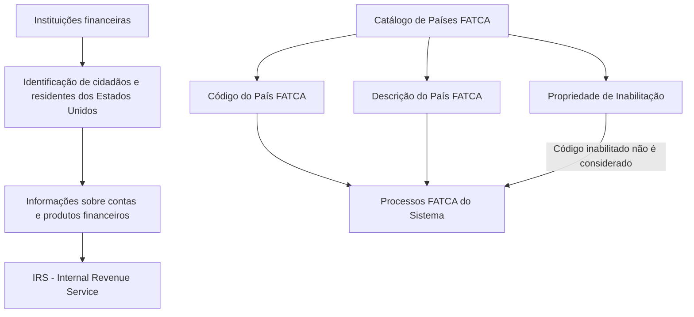

# Relatório de Ingestão de Documento para RAG

**Arquivo de origem:** `01-TRON_01-Doc_01-Mod_01-Comunes_01-Def_03-Estructura-geografica_DEFINIR-Paises-FATCA.pdf`
**Data de processamento:** 21/09/2026 09:01:22
**Modelo de interpretação:** gpt-5.6-terra (axet-code)
**Prompt utilizado:** [analise_documento_rag.md](file:///Users/gcostabe/dev/AGENTE-CONTEXT-GEN/prompts/analise_documento_rag.md)

---

# Catálogo de Países FATCA — Identificação e Inabilitação de Países

## 1. Metadados do Documento
- **Arquivo de Origem:** Não identificado no conteúdo extraído
- **Tipo de Documento:** Especificação Funcional
- **Domínio / Sistema:** Sistema FATCA / Catálogo de Países
- **Público-Alvo:** Negócio, Desenvolvedores, Arquitetos e Operação
- **Data/Versão Identificada:** Não identificada

---

## 2. Resumo Executivo & Contexto de Negócio

O documento descreve o catálogo de países aplicável aos processos FATCA do Sistema. FATCA, sigla para *Foreign Account Tax Compliance Act*, é uma lei dos Estados Unidos aprovada pelo Congresso em 2010, assinada pelo presidente Barack Obama e vigente desde 2013.

A finalidade apresentada para FATCA é apoiar o controle da evasão fiscal pelo governo dos Estados Unidos. A norma exige a identificação de cidadãos e residentes norte-americanos que mantenham dinheiro, contas ou fundos em instituições financeiras estrangeiras.

Segundo o documento, instituições financeiras em todo o mundo devem identificar e informar cidadãos e residentes dos Estados Unidos que possuam depósitos e investimentos nessas instituições. As informações relativas às contas e aos produtos financeiros dessas pessoas devem ser disponibilizadas ao IRS.

No contexto funcional do Sistema, o núcleo possui a capacidade de identificar os países nos quais a norma FATCA vigora. Essa identificação é realizada por meio de um atributo de código de país FATCA e sua respectiva descrição, utilizando códigos ISO 3166-1 alfa-3.

O catálogo também contempla a inabilitação de códigos de países FATCA, impedindo que um código inabilitado seja considerado ou incluído nos processos FATCA do Sistema.

---

## 3. Arquitetura, Componentes & Tecnologias Envolvidas

O conteúdo não apresenta arquitetura técnica detalhada, tecnologias, APIs, contratos HTTP, bancos de dados, microsserviços ou integrações explícitas. O documento descreve exclusivamente elementos funcionais do catálogo de países FATCA e sua utilização pelos processos FATCA do Sistema.

Componentes e entidades identificados:

- **Sistema:** Sistema que executa processos FATCA.
- **Catálogo de Países FATCA:** Cadastro funcional dos países vinculados à norma FATCA.
- **Código do País FATCA:** Chave que identifica o país que deve cumprir a norma.
- **Descrição do Primeiro Nível:** Denominação ou descrição do código do país FATCA.
- **Inabilitação:** Propriedade que impede a consideração ou inclusão do código em processos FATCA.
- **ISO 3166-1 alfa-3:** Norma de codificação de países, territórios dependentes e zonas especiais de interesse geográfico.
- **IRS:** Autoridade fiscal dos Estados Unidos que recebe informações relacionadas a contas e produtos financeiros.
- **Instituições financeiras:** Organizações obrigadas a identificar e informar cidadãos e residentes norte-americanos com depósitos e investimentos.



> **Nota de Análise:** O documento não detalha os métodos de manutenção do catálogo, interfaces de usuário, serviços, APIs, persistência de dados, fluxos de aprovação ou contratos de integração.

---

## 4. Regras de Negócio, Especificações Funcionais & Processos

### 4.1. Finalidade funcional do catálogo

O núcleo do Sistema deve possibilitar a identificação dos países nos quais a norma FATCA vigora. O catálogo de Países FATCA sustenta essa identificação por meio de códigos e descrições de países.

### 4.2. Regra de codificação de países

Os códigos configurados no Sistema para os países FATCA devem corresponder à norma **ISO 3166-1 alfa-3**, publicada pela Organização Internacional de Normalização.

A norma ISO 3166-1 alfa-3 é usada, segundo o texto, para representar:

- Países;
- Territórios dependentes;
- Zonas especiais de interesse geográfico.

### 4.3. Código do País FATCA

O atributo **Código do País FATCA** identifica a chave que representará o país que deve cumprir a norma FATCA.

Exemplos apresentados no documento:

- `PAN` para Panamá;
- `ESP` para Espanha;
- `MEX` para México.

### 4.4. Descrição do Primeiro Nível

A propriedade **Descrição do Primeiro Nível** contém a denominação ou descrição correspondente ao código do País FATCA.

A relação entre código e descrição deve permitir que o catálogo associe, por exemplo, o código `PAN` à descrição Panamá.

### 4.5. Inabilitação

O conteúdo apresenta duas referências à propriedade ou atributo denominado **Inhabilitación**:

1. Uma descrição informa que o atributo estabelece e identifica o código do prefixo telefônico do País FATCA.
2. Outra descrição informa que a propriedade estabelece que o Código do País FATCA está inabilitado para ser considerado ou incluído nos processos FATCA do Sistema.

> **Nota Crítica de Consistência:** As duas descrições atribuídas a “Inhabilitación” são semanticamente distintas. O documento não esclarece se existe mais de um atributo, se há erro de documentação ou se a descrição sobre prefixo telefônico foi associada incorretamente ao atributo de inabilitação. A regra funcional explicitamente sustentada é que a propriedade de inabilitação exclui o código do país dos processos FATCA.

### 4.6. Uso de códigos inabilitados

Quando a propriedade de inabilitação estiver configurada para um Código do País FATCA, o código não deve ser:

- Considerado nos processos FATCA do Sistema;
- Incluído nos processos FATCA do Sistema.

### 4.7. Dependências documentais

O documento referencia a leitura recomendada de diretrizes e documentos funcionais para evitar interpretações isoladas incorretas. O vínculo explicitamente identificado é:

- **Catálogo de Países**

### 4.8. Recomendações operacionais locais

A pergunta frequente apresentada questiona se existe recomendação operacional local para codificação, uso e definição do catálogo de Países FATCA no Sistema. A resposta registrada no documento é:

- **N/A**

---

## 5. Tabelas de Parâmetros, Ambientes e Estruturas de Dados

| Item / Parâmetro | Descrição / Função | Tipo / Valores / Formato | Ambiente / Observações |
| :--- | :--- | :--- | :--- |
| Código do País FATCA | Identifica a chave do país que deve cumprir a norma FATCA. | Código conforme ISO 3166-1 alfa-3. | Deve ser configurado no Sistema. |
| Descrição do Primeiro Nível | Contém a denominação ou descrição associada ao código do País FATCA. | Texto descritivo. | Exemplos: Panamá, Espanha e México. |
| Inabilitação | Estabelece que o Código do País FATCA está inabilitado para ser considerado ou incluído nos processos FATCA do Sistema. | Propriedade de inabilitação; valores não detalhados. | O documento também associa esse nome a uma descrição de prefixo telefônico, sem esclarecimento adicional. |
| Norma ISO 3166-1 alfa-3 | Norma adotada para os códigos configurados no catálogo. | Código alfanumérico de três caracteres. | Representa países, territórios dependentes e zonas especiais de interesse geográfico. |
| IRS | Autoridade fiscal dos Estados Unidos que recebe informações relacionadas a contas e produtos financeiros. | Organização / autoridade fiscal. | Sigla de *Internal Revenue Service*. |
| Catálogo de Países | Documento funcional relacionado cuja leitura é recomendada. | Vínculo documental. | Destinado a evitar interpretação isolada incorreta. |

| Código de País FATCA | Descrição do País FATCA | Origem do Exemplo |
| :--- | :--- | :--- |
| PAN | Panamá | Documento de origem |
| ESP | Espanha | Documento de origem |
| MEX | México | Documento de origem |

> **Nota de Análise:** O conteúdo não apresenta URLs de ambientes, nomes de servidores, portas, variáveis de configuração, estruturas de banco de dados, formatos de mensagem ou rotas de logs.

---

## 6. Bateria de Perguntas & Respostas para RAG (FAQ Sintético)

### P1: Qual é o objetivo do catálogo de Países FATCA no Sistema?
**R:** O catálogo de Países FATCA permite que o núcleo do Sistema identifique os países nos quais a norma FATCA vigora. Essa identificação é sustentada por códigos de país, descrições associadas e uma propriedade de inabilitação aplicável aos processos FATCA.

### P2: Qual padrão deve ser usado para configurar o Código do País FATCA?
**R:** O Código do País FATCA deve utilizar a norma ISO 3166-1 alfa-3, publicada pela Organização Internacional de Normalização. Essa norma representa países, territórios dependentes e zonas especiais de interesse geográfico.

### P3: O que representa o atributo Código do País FATCA?
**R:** O atributo Código do País FATCA representa a chave que identifica o país que deve cumprir a norma FATCA dentro do Sistema.

### P4: Quais exemplos de códigos de países FATCA são apresentados?
**R:** O documento apresenta os exemplos `PAN` para Panamá, `ESP` para Espanha e `MEX` para México.

### P5: Qual é a função da Descrição do Primeiro Nível?
**R:** A Descrição do Primeiro Nível contém a denominação ou descrição do código do País FATCA. Por exemplo, ela associa códigos como `PAN`, `ESP` e `MEX` às descrições Panamá, Espanha e México.

### P6: O que acontece quando um Código do País FATCA está inabilitado?
**R:** Quando um Código do País FATCA está inabilitado, ele não deve ser considerado nem incluído nos processos FATCA do Sistema.

### P7: O documento define valores ou formato técnico para a propriedade de inabilitação?
**R:** Não. O documento explica o efeito funcional da inabilitação — excluir o código dos processos FATCA — mas não especifica valores permitidos, tipo de dado, interface de manutenção ou mecanismo técnico de persistência.

### P8: Qual é a relação entre FATCA e o IRS?
**R:** Segundo o documento, as instituições financeiras devem disponibilizar ao IRS informações relacionadas às contas e produtos financeiros de cidadãos e residentes norte-americanos identificados com depósitos e investimentos nessas instituições. IRS significa *Internal Revenue Service*, a autoridade fiscal dos Estados Unidos.

### P9: Qual problema a lei FATCA busca endereçar?
**R:** O documento informa que FATCA busca apoiar o controle da evasão fiscal pelo governo dos Estados Unidos, mediante a identificação de cidadãos e residentes norte-americanos com dinheiro, contas ou fundos depositados em instituições financeiras estrangeiras.

### P10: Existem recomendações operacionais locais para codificação, uso e definição do catálogo de Países FATCA?
**R:** Não. A seção de perguntas frequentes registra a resposta `N/A` para a questão sobre recomendações operacionais locais.

### P11: O documento descreve APIs, microsserviços ou contratos JSON do Sistema FATCA?
**R:** Não. O documento não detalha APIs, microsserviços, métodos HTTP, contratos JSON, tecnologias de implementação, banco de dados ou integrações técnicas.

### P12: Qual documento relacionado deve ser lido para reduzir risco de interpretação isolada?
**R:** O documento recomenda a leitura do vínculo denominado **Catálogo de Países**, apresentado como diretriz ou documento funcional relacionado.

---

## 7. Glossário de Termos, Siglas & Conceitos-Chave

- **FATCA:** *Foreign Account Tax Compliance Act*; lei dos Estados Unidos voltada ao controle de evasão fiscal mediante identificação de cidadãos e residentes norte-americanos com recursos em instituições financeiras estrangeiras.
- **IRS:** *Internal Revenue Service*; autoridade fiscal dos Estados Unidos.
- **ISO 3166-1 alfa-3:** Norma publicada pela Organização Internacional de Normalização para representar países, territórios dependentes e zonas especiais de interesse geográfico por códigos de três caracteres.
- **Código do País FATCA:** Chave que identifica o país sujeito ao cumprimento da norma FATCA no Sistema.
- **Descrição do Primeiro Nível:** Denominação ou descrição correspondente ao Código do País FATCA.
- **Inabilitação:** Propriedade que torna um Código do País FATCA indisponível para consideração ou inclusão nos processos FATCA do Sistema.
- **Catálogo de Países FATCA:** Cadastro funcional de códigos e descrições de países aplicáveis à identificação de países nos processos FATCA.

---

## 8. Notas Críticas, Riscos & Limitações

- O documento não identifica nome de arquivo, data, versão, autor, responsável, sistema proprietário ou ambiente operacional.
- Não há descrição de arquitetura técnica, APIs, integrações, microsserviços, banco de dados, autenticação, logs, monitoramento ou procedimentos de operação.
- O documento não apresenta regras para criação, alteração, aprovação, exclusão ou reabilitação de códigos do catálogo.
- Não são definidos formato técnico, tipo de dado, valores permitidos ou validações para o atributo de inabilitação.
- Há uma inconsistência documental: “Inhabilitación” é descrito tanto como atributo relacionado a prefixo telefônico quanto como propriedade que exclui códigos dos processos FATCA.
- A seção de perguntas frequentes não fornece recomendação operacional local, registrando apenas `N/A`.
- A leitura do documento vinculado **Catálogo de Países** é recomendada para evitar interpretação isolada incorreta.
- Não há detalhamento adicional sobre a audiência, pois a seção “Audiencia” aparece sem conteúdo.

---

## 9. Conteúdo Bruto Estruturado (Referência Fiel)

```text
--- [PÁGINA 1 DE 3] ---

IDENTIFICACIÓN de los Países adscritos al
FATCA
Contexto
La Ley de cumplimiento tributario de cuentas extranjeras, conocida principalmente por sus siglas en
inglés FATCA (Foreign Account Tax Compliance Act) es una Ley de Estados Unidos, aprobada por
el Congreso en 2010 y firmada por el presidente Barack Obama, que entró en vigor en el año 2013.
El objetivo de esta disposición es el control de la evasión fiscal por el gobierno de Estados Unidos
mediante la identificación de los ciudadanos de este país y residentes en él que tengan dinero,
cuentas o fondos depositados en instituciones financieras extranjeras.
Para ello se requiere obligatoriamente a las instituciones financieras de todo el mundo para que
identifiquen e informen de los ciudadanos y residentes norteamericanos que tengan depósitos e
inversiones en esos bancos. Las instituciones financieras deben poner a disposición del IRS (El
Internal Revenue Service es la autoridad fiscal de Estados Unidos) información relacionada con
cuentas y productos financieros de dichas personas
Objetivo
Funcionalmente, el núcleo del Sistema cuenta con la posibilidad de identificar en qué países rige esta
Norma.
Datos Identificativos
Otras Propiedades
 /
 CF
Home Solutions APIs Documentation Zeus
EN


--- [PÁGINA 2 DE 3] ---

Datos Identificativos
Código del País FATCA
Este atributo identifica la clave que identificará el País que ha de cumplir la norma.
NOTA: Puesto que este Primer Nivel contiene la información de los Países, los códigos que se han
de configurar en el sistema son aquellos correspondientes a la Norma ISO 3166-1 alfa-3 publicada
por la Organización Internacional de Normalización, para representar países, territorios dependientes
y zonas especiales de interés geográfico.
Descripción del Primer Nivel
Esta propiedad contiene la denominación o descripción del código del País FATCA
A modo de ejemplo:
PAÍS FATCA Descripción
PAN Panamá
ESP España
MEX México
... ...
Inhabilitación
Este Atributo establece e identifica el código del prefijo telefónico del País FATCA.
Otras Propiedades
Inhabilitación
Esta propiedad establece que el Código del País FATCA está inhabilitado para ser considerado o
incluido en los procesos FATCA del Sistema.
Vínculos
Relación de Directrices y Documentos funcionales cuya lectura recomendada para evitar que la
interpretación aislada del presente documento pueda conducir a error.
Catálogo de Países


--- [PÁGINA 3 DE 3] ---

Preguntas frecuentes
(1) ¿Existe alguna recomendación operativa que deba ser tomada en consideración localmente en la
codificación, uso y definición del catálogo de Países FATCA en el Sistema?
N/A
Audiencia
```

---

## Conteúdo Bruto Extraído (Original Completo)

```text
--- [PÁGINA 1 DE 3] ---

IDENTIFICACIÓN de los Países adscritos al
FATCA
Contexto
La Ley de cumplimiento tributario de cuentas extranjeras, conocida principalmente por sus siglas en
inglés FATCA (Foreign Account Tax Compliance Act) es una Ley de Estados Unidos, aprobada por
el Congreso en 2010 y firmada por el presidente Barack Obama, que entró en vigor en el año 2013.
El objetivo de esta disposición es el control de la evasión fiscal por el gobierno de Estados Unidos
mediante la identificación de los ciudadanos de este país y residentes en él que tengan dinero,
cuentas o fondos depositados en instituciones financieras extranjeras.
Para ello se requiere obligatoriamente a las instituciones financieras de todo el mundo para que
identifiquen e informen de los ciudadanos y residentes norteamericanos que tengan depósitos e
inversiones en esos bancos. Las instituciones financieras deben poner a disposición del IRS (El
Internal Revenue Service es la autoridad fiscal de Estados Unidos) información relacionada con
cuentas y productos financieros de dichas personas
Objetivo
Funcionalmente, el núcleo del Sistema cuenta con la posibilidad de identificar en qué países rige esta
Norma.
Datos Identificativos
Otras Propiedades
 / 
 CF
Home Solutions APIs Documentation Zeus
EN


--- [PÁGINA 2 DE 3] ---

Datos Identificativos
Código del País FATCA
Este atributo identifica la clave que identificará el País que ha de cumplir la norma.
NOTA: Puesto que este Primer Nivel contiene la información de los Países, los códigos que se han
de configurar en el sistema son aquellos correspondientes a la Norma ISO 3166-1 alfa-3 publicada
por la Organización Internacional de Normalización, para representar países, territorios dependientes
y zonas especiales de interés geográfico.
Descripción del Primer Nivel
Esta propiedad contiene la denominación o descripción del código del País FATCA
A modo de ejemplo:
PAÍS FATCA Descripción
PAN Panamá
ESP España
MEX México
... ...
Inhabilitación
Este Atributo establece e identifica el código del prefijo telefónico del País FATCA.
Otras Propiedades
Inhabilitación
Esta propiedad establece que el Código del País FATCA está inhabilitado para ser considerado o
incluido en los procesos FATCA del Sistema.
Vínculos
Relación de Directrices y Documentos funcionales cuya lectura recomendada para evitar que la
interpretación aislada del presente documento pueda conducir a error.
Catálogo de Países


--- [PÁGINA 3 DE 3] ---

Preguntas frecuentes
(1) ¿Existe alguna recomendación operativa que deba ser tomada en consideración localmente en la
codificación, uso y definición del catálogo de Países FATCA en el Sistema?
N/A
Audiencia
```
