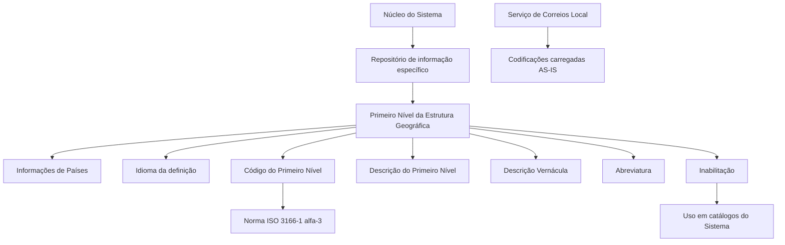

# Relatório de Ingestão de Documento para RAG

**Arquivo de origem:** `01-TRON_01-Doc_01-Mod_01-Comunes_01-Def_03-Estructura-geografica_DEFINIR-Paises-Viajes.pdf`
**Data de processamento:** 21/09/2026 09:01:27
**Modelo de interpretação:** gpt-5.6-terra (axet-code)
**Prompt utilizado:** [analise_documento_rag.md](file:///Users/gcostabe/dev/AGENTE-CONTEXT-GEN/prompts/analise_documento_rag.md)

---

# Definição da Matriz de Países / Viagens — Primeiro Nível da Estrutura Geográfica

## 1. Metadados do Documento
- **Arquivo de Origem:** Não identificado no conteúdo fornecido
- **Tipo de Documento:** Especificação Técnica
- **Domínio / Sistema:** Matriz de Países / Viagens; Estrutura Geográfica do Sistema
- **Público-Alvo:** Desenvolvedores, Analistas Funcionais, Operação e responsáveis pela configuração de catálogos
- **Data/Versão Identificada:** Não identificada

---

## 2. Resumo Executivo & Contexto de Negócio

O documento define propriedades para codificação do Primeiro Nível da Estrutura Geográfica em um repositório de informação específico do Sistema. O Primeiro Nível contém informações de países e deve ser configurado com identificadores padronizados.

A codificação do campo **Código do Primeiro Nível** deve utilizar a norma **ISO 3166-1 alfa-3**, publicada pela Organização Internacional de Normalização. A norma é indicada para representar países, territórios dependentes e zonas especiais de interesse geográfico.

Cada entrada geográfica possui atributos de idioma, código, descrição, descrição vernácula, abreviatura e condição de inabilitação. A descrição textual depende do idioma empregado na definição, enquanto a descrição vernácula representa a denominação no idioma local.

O documento também referencia diretrizes e documentos funcionais relacionados, especialmente “Denominaciones Locales de los Niveles de la Estructura Geográfica” e “Preguntas frecuentes”. Essas referências devem ser consultadas para evitar interpretações isoladas e incorretas.

A recomendação operacional apresentada é utilizar codificações fornecidas pelo Serviço de Correios Local e carregá-las no Sistema **AS-IS**, isto é, sem alteração, no contexto da pergunta sobre codificação, uso e definição de catálogo de categorias.

---

## 3. Arquitetura, Componentes & Tecnologias Envolvidas

O conteúdo descreve uma estrutura lógica de cadastro geográfico no Sistema. Não são identificados microsserviços, tecnologias de implementação, URLs, ambientes, métodos HTTP, banco de dados ou contratos de integração.

Componentes conceituais identificados:

- **Sistema:** núcleo que permite codificar o Primeiro Nível da Estrutura Geográfica.
- **Repositório de informação específico:** local lógico onde são mantidas as informações do Primeiro Nível.
- **Primeiro Nível da Estrutura Geográfica:** nível que contém dados de países.
- **Norma ISO 3166-1 alfa-3:** referência obrigatória para a codificação dos países, territórios dependentes e zonas especiais.
- **Idioma:** propriedade que define o idioma utilizado para denominações e descrições.
- **Catálogos do Sistema:** consumidores potenciais dos códigos de nível, sujeitos à regra de inabilitação.
- **Serviço de Correios Local:** fonte recomendada de codificações em uma orientação operacional apresentada nas perguntas frequentes.



> **Nota de Análise:** O documento não detalha modelo físico de dados, formatos de persistência, rotinas de carga, responsáveis pela manutenção nem regras de validação automática da ISO 3166-1 alfa-3.

---

## 4. Regras de Negócio, Especificações Funcionais & Processos

### 4.1. Definição do Primeiro Nível Geográfico

1. O núcleo do Sistema permite codificar o Primeiro Nível da Estrutura Geográfica.
2. O Primeiro Nível deve ser mantido em um repositório de informação específico.
3. O Primeiro Nível contém a informação de países.

### 4.2. Idioma

1. A propriedade **Idioma** identifica o idioma empregado na definição do nível da estrutura.
2. O documento cita como exemplos códigos que identificam idiomas espanhol, inglês e turco.
3. O idioma utilizado influencia a descrição e a abreviatura do Primeiro Nível.

### 4.3. Código do Primeiro Nível

1. O **Código do Primeiro Nível** é a chave que identifica o Primeiro Nível da Estrutura Geográfica no Sistema.
2. Como o Primeiro Nível contém países, os códigos configurados devem corresponder à **ISO 3166-1 alfa-3**.
3. A ISO 3166-1 alfa-3 é indicada para representar:
   - Países;
   - Territórios dependentes;
   - Zonas especiais de interesse geográfico.

### 4.4. Descrições e Abreviaturas

1. A **Descrição do Primeiro Nível** contém a denominação ou descrição da chave do nível, de acordo com o idioma usado na definição.
2. A **Descrição Vernácula do Primeiro Nível** contém a denominação ou descrição do Primeiro Nível no idioma vernáculo.
3. A **Abreviatura do Primeiro Nível** contém a denominação ou descrição abreviada do Primeiro Nível, de acordo com o idioma da definição.

### 4.5. Inabilitação

1. A propriedade **Inabilitação** estabelece que o Código do Nível fica inabilitado para uso nos catálogos do Sistema.
2. O documento não especifica se a inabilitação preserva registros históricos, impede novas seleções, remove o código de consultas ou exige aprovação operacional.

### 4.6. Vínculos e Leitura Complementar

1. O documento orienta consultar diretrizes e documentos funcionais relacionados.
2. A finalidade da leitura complementar é evitar que a interpretação isolada do documento conduza a erro.
3. Os títulos referenciados são:
   - “Denominaciones Locales de los Niveles de la Estructura Geográfica”;
   - “Preguntas frecuentes”.

### 4.7. Recomendação Operacional Registrada

1. A pergunta frequente trata de recomendações locais para codificação, uso e definição do catálogo de categorias no Sistema.
2. A prática recomendada é utilizar as codificações realizadas pelo Serviço de Correios Local.
3. As codificações do Serviço de Correios Local devem ser carregadas no Sistema **AS-IS**.

> **Nota de Análise:** A recomendação sobre catálogo de categorias aparece em uma seção de perguntas frequentes de um documento sobre matriz de países e Primeiro Nível geográfico. O texto não explica a relação funcional entre o catálogo de categorias e a Estrutura Geográfica.

---

## 5. Tabelas de Parâmetros, Ambientes e Estruturas de Dados

| Item / Parâmetro | Descrição / Função | Tipo / Valores / Formato | Ambiente / Observações |
| :--- | :--- | :--- | :--- |
| Primeiro Nível da Estrutura Geográfica | Nível da estrutura geográfica codificado no Sistema; contém informações de países. | Estrutura lógica geográfica. | Mantido em repositório de informação específico. |
| Idioma | Identifica o idioma empregado na definição do nível. | Códigos de idioma; exemplos citados: espanhol, inglês e turco. | Influencia descrição e abreviatura. |
| Código do Primeiro Nível | Chave que identifica o Primeiro Nível da Estrutura Geográfica no Sistema. | Código ISO 3166-1 alfa-3. | Deve representar países, territórios dependentes ou zonas especiais de interesse geográfico. |
| Descrição do Primeiro Nível | Denominação ou descrição da chave do nível. | Texto conforme idioma utilizado na definição. | Não foi definido tamanho, obrigatoriedade ou formato. |
| Descrição Vernácula do Primeiro Nível | Denominação ou descrição do Primeiro Nível no idioma vernáculo. | Texto. | Difere da descrição no idioma empregado na definição quando aplicável. |
| Abreviatura do Primeiro Nível | Denominação ou descrição abreviada do Primeiro Nível. | Texto abreviado conforme idioma da definição. | Exemplos incluem “Pan.”, “USA”, “Esp.” e “Méx”. |
| Inabilitação | Impede o emprego do Código do Nível nos catálogos do Sistema. | Propriedade de estado; valores não detalhados. | Não há detalhamento sobre fluxo de reabilitação. |
| Vínculos | Relação de diretrizes e documentos funcionais recomendados. | Referências documentais. | Devem ser lidos para evitar interpretação isolada incorreta. |
| Codificações do Serviço de Correios Local | Codificações recomendadas para carga no Sistema no contexto da pergunta frequente. | Dados fornecidos pelo Serviço de Correios Local. | Devem ser carregados AS-IS. |

### Exemplos de codificação apresentados

| Chave do Primeiro Nível | Descrição Vernácula | Abreviatura |
| :--- | :--- | :--- |
| PAN | Panamá | Pan. |
| USA | Estados Unidos | USA |
| ESP | España | Esp. |
| MEX | Estados Unidos Mexicanos | Méx |

> **Nota de Análise:** Embora o documento determine ISO 3166-1 alfa-3 como norma aplicável, os exemplos são reproduzidos fielmente como apresentados e não devem ser tratados como validação independente da aderência de cada valor à norma.

---

## 6. Bateria de Perguntas & Respostas para RAG (FAQ Sintético)

### P1: Qual é a finalidade do Primeiro Nível da Estrutura Geográfica no Sistema?
**R:** O Primeiro Nível da Estrutura Geográfica permite codificar informações de países em um repositório de informação específico do Sistema. O documento indica que o núcleo do Sistema possui a capacidade de manter esse nível geográfico.

### P2: Qual padrão deve ser utilizado para configurar o Código do Primeiro Nível?
**R:** O Código do Primeiro Nível deve utilizar a norma ISO 3166-1 alfa-3. O documento indica que essa norma deve ser empregada porque o Primeiro Nível contém informações de países.

### P3: Quais entidades geográficas podem ser representadas pela ISO 3166-1 alfa-3 segundo o documento?
**R:** A ISO 3166-1 alfa-3 é indicada para representar países, territórios dependentes e zonas especiais de interesse geográfico.

### P4: O que a propriedade Idioma identifica na definição do nível geográfico?
**R:** A propriedade Idioma identifica o idioma empregado na definição do nível da estrutura geográfica. O documento apresenta espanhol, inglês e turco como exemplos de idiomas que podem ser identificados por códigos.

### P5: Qual é a diferença entre a Descrição do Primeiro Nível e a Descrição Vernácula do Primeiro Nível?
**R:** A Descrição do Primeiro Nível contém a denominação ou descrição da chave conforme o idioma usado na definição. A Descrição Vernácula do Primeiro Nível contém a denominação ou descrição no idioma vernáculo.

### P6: Para que serve a propriedade Abreviatura do Primeiro Nível?
**R:** A propriedade Abreviatura do Primeiro Nível contém uma denominação ou descrição abreviada do Primeiro Nível, de acordo com o idioma utilizado na definição. O documento apresenta exemplos como “Pan.” para Panamá e “Méx” para México.

### P7: Qual efeito a propriedade Inabilitação produz sobre um Código do Nível?
**R:** A propriedade Inabilitação estabelece que o Código do Nível fica inabilitado para poder ser empregado nos catálogos do Sistema. O documento não detalha efeitos adicionais, como reativação, retenção histórica ou comportamento em consultas.

### P8: Por que devem ser consultados os documentos vinculados à definição da Estrutura Geográfica?
**R:** Os documentos vinculados devem ser lidos para evitar que uma interpretação isolada do documento conduza a erro. Entre as referências citadas estão “Denominaciones Locales de los Niveles de la Estructura Geográfica” e “Preguntas frecuentes”.

### P9: Qual recomendação operacional é fornecida para a codificação local?
**R:** A prática recomendada é utilizar as codificações realizadas pelo Serviço de Correios Local e carregá-las no Sistema AS-IS, sem alteração. Essa recomendação aparece na pergunta frequente sobre codificação, uso e definição do catálogo de categorias.

### P10: O documento descreve APIs, URLs de ambiente, métodos HTTP ou contratos JSON?
**R:** Não. O conteúdo fornecido não apresenta APIs, URLs, ambientes, métodos HTTP, contratos JSON, tecnologias de infraestrutura ou detalhes de integração.

---

## 7. Glossário de Termos, Siglas & Conceitos-Chave

- **AS-IS:** Indicação de que as codificações do Serviço de Correios Local devem ser carregadas no Sistema sem alteração.
- **Código do Primeiro Nível:** Chave que identifica o Primeiro Nível da Estrutura Geográfica no Sistema.
- **Descrição Vernácula:** Denominação ou descrição no idioma vernáculo.
- **Estrutura Geográfica:** Estrutura do Sistema que contém níveis geográficos; o documento trata especificamente do Primeiro Nível.
- **ISO 3166-1 alfa-3:** Norma publicada pela Organização Internacional de Normalização para representação de países, territórios dependentes e zonas especiais de interesse geográfico por códigos.
- **Primeiro Nível:** Nível da Estrutura Geográfica que contém informações de países.
- **Serviço de Correios Local:** Fonte de codificações cuja utilização e carga AS-IS são recomendadas pelo documento.
- **Vínculos:** Relação de diretrizes e documentos funcionais recomendados para leitura complementar.

---

## 8. Notas Críticas, Riscos & Limitações

- O documento não identifica arquivo de origem, autor, data, versão, sistema corporativo específico ou audiência detalhada.
- Não há detalhamento de tecnologias, integrações, APIs, banco de dados, ambientes, servidores, permissões ou responsáveis pelo processo de manutenção.
- A regra de inabilitação informa apenas que o código não poderá ser utilizado nos catálogos do Sistema; não detalha o comportamento para registros históricos, reabilitação ou validações de interface.
- A exigência de ISO 3166-1 alfa-3 é explícita, mas o documento não descreve mecanismo de validação, fonte de atualização da norma ou tratamento de códigos inválidos.
- A recomendação relativa ao Serviço de Correios Local aparece em uma pergunta sobre “catálogo de Categorias”, sem explicitar como esse catálogo se relaciona com a matriz de países ou com o Primeiro Nível geográfico.
- As referências “Denominaciones Locales de los Niveles de la Estructura Geográfica” e “Preguntas frecuentes” são citadas, mas seus conteúdos não foram fornecidos.

---

## 9. Conteúdo Bruto Estruturado (Referência Fiel)

```text
--- [PÁGINA 1 DE 3] ---

DEFINICIÓN de la Matriz de PAÍSES / VIAJES
Propiedades Generales
Funcionalmente, el núcleo del Sistema cuenta con la posibilidad de codificar el Primer Nivel de la
estructura Geográfica en un repositorio de información específico.
Idioma
Esta propiedad identifica el Idioma empleado en la definición del Nivel de la estructura, como por
ejemplo con los códigos que identifiquen a los idiomas español, inglés, turco,...
Código del Primer Nivel
Este atributo identifica la clave que identificará al Primer Nivel de la estructura Geográfica en el
Sistema.
NOTA: Puesto que este Primer Nivel contiene la información de los Países, los códigos que se han
de configurar en el sistema son aquellos correspondientes a la Norma ISO 3166-1 alfa-3 publicada
por la Organización Internacional de Normalización, para representar países, territorios dependientes
y zonas especiales de interés geográfico.
Descripción del Primer Nivel
Esta propiedad contiene la denominación o descripción de la clave del Nivel, de acuerdo con el
idioma utilizado en la definición.
Descripción Vernácula del Primer Nivel
 / 
 CF
Home Solutions APIs Documentation Zeus
EN


--- [PÁGINA 2 DE 3] ---

Esta propiedad contiene la denominación o descripción del Primer Nivel de la Estructura Geográfica
de acuerdo con el idioma vernáculo.
Abreviatura del Primer Nivel
Esta propiedad contiene la denominación o descripción abreviada del Primer Nivel, de acuerdo con el
idioma utilizado en la definición.
A modo de ejemplo y si el Idioma utilizado en la definición es el español:
Clave del Primer
Nivel
Descripción Vernáculo Abreviatura
PAN Panamá Panamá Pan.
USA Estados
Unidos
United States of America USA
ESP España España Esp.
MEX México Estados Unidos
Mexicanos
Méx
... ... ...
Otras Propiedades
Inhabilitación
Esta propiedad establece que el Código del Nivel está inhabilitado para poder ser empleado en los
catálogos del Sistema.
Vínculos
Relación de Directrices y Documentos funcionales cuya lectura recomendada para evitar que la
interpretación aislada del presente documento pueda conducir a error.
Denominaciones Locales de los Niveles de la Estructura Geográfica
Preguntas frecuentes


--- [PÁGINA 3 DE 3] ---

(1) ¿Existe alguna recomendación operativa que deba ser tomada en consideración localmente en la
codificación, uso y definición del catálogo de Categorías en el Sistema?
Una práctica que se recomienda como modelo es utilizar las codificaciones realizadas por el Servicio
de Correos Local y cargarlas AS-IS en el Sistema.
Audiencia
```

---

## Conteúdo Bruto Extraído (Original Completo)

```text
--- [PÁGINA 1 DE 3] ---

DEFINICIÓN de la Matriz de PAÍSES / VIAJES
Propiedades Generales
Funcionalmente, el núcleo del Sistema cuenta con la posibilidad de codificar el Primer Nivel de la
estructura Geográfica en un repositorio de información específico.
Idioma
Esta propiedad identifica el Idioma empleado en la definición del Nivel de la estructura, como por
ejemplo con los códigos que identifiquen a los idiomas español, inglés, turco,...
Código del Primer Nivel
Este atributo identifica la clave que identificará al Primer Nivel de la estructura Geográfica en el
Sistema.
NOTA: Puesto que este Primer Nivel contiene la información de los Países, los códigos que se han
de configurar en el sistema son aquellos correspondientes a la Norma ISO 3166-1 alfa-3 publicada
por la Organización Internacional de Normalización, para representar países, territorios dependientes
y zonas especiales de interés geográfico.
Descripción del Primer Nivel
Esta propiedad contiene la denominación o descripción de la clave del Nivel, de acuerdo con el
idioma utilizado en la definición.
Descripción Vernácula del Primer Nivel
 / 
 CF
Home Solutions APIs Documentation Zeus
EN


--- [PÁGINA 2 DE 3] ---

Esta propiedad contiene la denominación o descripción del Primer Nivel de la Estructura Geográfica
de acuerdo con el idioma vernáculo.
Abreviatura del Primer Nivel
Esta propiedad contiene la denominación o descripción abreviada del Primer Nivel, de acuerdo con el
idioma utilizado en la definición.
A modo de ejemplo y si el Idioma utilizado en la definición es el español:
Clave del Primer
Nivel
Descripción Vernáculo Abreviatura
PAN Panamá Panamá Pan.
USA Estados
Unidos
United States of America USA
ESP España España Esp.
MEX México Estados Unidos
Mexicanos
Méx
... ... ...
Otras Propiedades
Inhabilitación
Esta propiedad establece que el Código del Nivel está inhabilitado para poder ser empleado en los
catálogos del Sistema.
Vínculos
Relación de Directrices y Documentos funcionales cuya lectura recomendada para evitar que la
interpretación aislada del presente documento pueda conducir a error.
Denominaciones Locales de los Niveles de la Estructura Geográfica
Preguntas frecuentes


--- [PÁGINA 3 DE 3] ---

(1) ¿Existe alguna recomendación operativa que deba ser tomada en consideración localmente en la
codificación, uso y definición del catálogo de Categorías en el Sistema?
Una práctica que se recomienda como modelo es utilizar las codificaciones realizadas por el Servicio
de Correos Local y cargarlas AS-IS en el Sistema.
Audiencia
```
