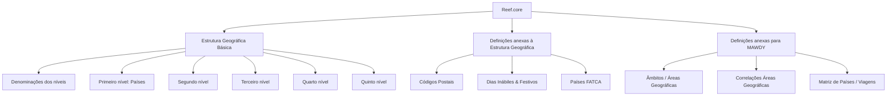

# Estrutura Geográfica Básica e Catálogos Anexos no Reef.core

## 1. Metadados do Documento
- **Arquivo de Origem:** Não identificado
- **Tipo de Documento:** Manual funcional / apresentação de catálogo
- **Domínio / Sistema:** Reef.core; estrutura geográfica; negócio MAWDY – Negócio de Assistência
- **Público-Alvo:** Negócio, analistas funcionais, operadores e equipes responsáveis pela configuração de catálogos
- **Data/Versão Identificada:** Não identificada

---

## 2. Resumo Executivo & Contexto de Negócio

O documento descreve a **Estrutura Geográfica** utilizada no Reef.core para identificar, codificar e classificar a organização territorial dos países empregada nos diferentes processos de uma entidade seguradora. A organização territorial é apresentada como uma divisão dos territórios para fins políticos e administrativos, conforme as leis locais.

A estrutura geográfica básica do Reef.core é organizada em **cinco níveis**. O primeiro nível corresponde aos países; os demais níveis representam divisões territoriais subsequentes dentro de cada país. O documento também menciona a configuração das denominações aplicáveis a cada nível da estrutura.

Além da estrutura geográfica básica, o documento lista catálogos anexos que, embora não pertençam formalmente à estrutura, estão relacionados a ela e complementam seu uso e funcionalidade. Esses catálogos incluem códigos postais, dias inhábteis e festivos e países vinculados ao acordo FATCA.

Há também definições anexas específicas para o negócio de assistência da MAWDY. Essas definições permitem operar esse negócio no Reef.core por meio da configuração de âmbitos ou áreas geográficas, correlações de áreas geográficas e uma matriz de países e viagens permitidas.

O material indica que cada catálogo possui referências para documentação e vídeo, mas não fornece os respectivos links, conteúdos detalhados, campos, métodos de acesso, contratos técnicos ou regras de validação. Os asteriscos presentes nos cartões indicam obrigatoriedade na definição de um elemento.

---

## 3. Arquitetura, Componentes & Tecnologias Envolvidas

### Componentes e catálogos identificados

| Componente / Catálogo | Finalidade sustentada pelo documento |
| :--- | :--- |
| Reef.core | Sistema que dispõe de catálogos para identificar, codificar e classificar a organização territorial usada nos processos da entidade seguradora. |
| Estrutura Geográfica Básica | Estrutura territorial composta por cinco níveis. |
| Denominações dos Níveis | Configuração das denominações de cada nível da estrutura geográfica. |
| Primeiro Nível – Países | Configuração dos países como primeiro nível da organização territorial. |
| Segundo Nível | Configuração do segundo nível da organização territorial dos países. |
| Terceiro Nível | Configuração do terceiro nível da organização territorial dos países. |
| Quarto Nível | Configuração do quarto nível da organização territorial dos países. |
| Quinto Nível | Configuração do quinto nível da organização territorial dos países. |
| Códigos Postais | Configuração de códigos postais usados na estrutura postal associada à organização geográfica do país. |
| Dias Inábiles & Festivos | Configuração do calendário anual de jornadas inhábiles e dias festivos conforme a organização territorial do país. |
| Países FATCA | Configuração de países adscritos ao acordo FATCA. |
| MAWDY – Negócio de Assistência | Contexto de negócio para catálogos geográficos anexos específicos. |
| Âmbitos / Áreas Geográficas | Configuração de âmbitos ou áreas geográficas adscritos aos países. |
| Correlaciones Áreas Geográficas | Configuração de âmbitos ou áreas geográficas adscritos aos países. |
| Matriz de Países / Viajes | Configuração da matriz de países e das viagens permitidas. |



> **Nota de Análise:** O documento não detalha arquitetura técnica, integrações, APIs, bancos de dados, protocolos, URLs, ambientes ou tecnologias de implementação do Reef.core.

---

## 4. Regras de Negócio, Especificações Funcionais & Processos

### Organização territorial

1. A organização territorial dos países corresponde à divisão dos territórios para finalidades políticas e administrativas.
2. A organização territorial deve considerar o que é definido pelas leis locais.
3. O Reef.core utiliza catálogos para identificar, codificar e classificar a organização territorial dos países.
4. A organização territorial é usada nos diferentes processos da entidade seguradora.
5. A estrutura geográfica básica possui cinco níveis.

### Estrutura geográfica básica

1. As denominações devem ser configuradas em cada nível da estrutura geográfica.
2. Os países devem ser configurados como o primeiro nível da organização territorial.
3. O segundo, terceiro, quarto e quinto níveis devem ser configurados como níveis sucessivos da organização territorial dos países.
4. Os asteriscos exibidos nos cartões indicam a obrigatoriedade da definição do elemento correspondente.

### Definições anexas à estrutura geográfica

1. Os catálogos anexos à estrutura geográfica não pertencem necessariamente à estrutura geográfica básica.
2. Mesmo não pertencendo à estrutura geográfica básica, os catálogos anexos são relacionados a ela.
3. Os catálogos anexos complementam o uso e a funcionalidade da estrutura geográfica.
4. Os códigos postais utilizados na estrutura postal devem estar associados à organização geográfica do país.
5. O calendário anual de jornadas inhábiles e dias festivos deve ser configurado de acordo com a organização territorial do país.
6. Os países adscritos ao acordo FATCA devem ser configurados no catálogo de Países FATCA.

### Definições específicas para MAWDY – Negócio de Assistência

1. Existem catálogos anexos à estrutura geográfica destinados especificamente à operação do negócio MAWDY no Reef.core.
2. Os âmbitos ou áreas geográficas devem ser configurados como elementos adscritos aos países.
3. O catálogo de correlações de áreas geográficas é descrito como configuração de âmbitos ou áreas geográficas adscritos aos países.
4. A matriz de países e viagens permitidas deve ser configurada no catálogo Matriz de Países / Viajes.

> **Nota de Análise:** O documento não informa os critérios de relacionamento entre os cinco níveis geográficos, campos obrigatórios, identificadores, regras de unicidade, fluxos de aprovação ou detalhes de manutenção dos catálogos.

---

## 5. Tabelas de Parâmetros, Ambientes e Estruturas de Dados

| Item / Parâmetro | Descrição / Função | Tipo / Valores / Formato | Ambiente / Observações |
| :--- | :--- | :--- | :--- |
| Estrutura Geográfica Básica | Estrutura para identificação, codificação e classificação da organização territorial dos países. | Cinco níveis geográficos. | Utilizada nos processos da entidade seguradora no Reef.core. |
| Denominações dos Níveis | Configuração das denominações para cada nível da estrutura geográfica. | Não detalhado. | Não há lista de denominações no documento. |
| Primeiro Nível – Países | Configuração dos países como primeiro nível territorial. | Países. | Primeiro nível da organização territorial. |
| Segundo Nível | Configuração do segundo nível territorial dos países. | Não detalhado. | Sem exemplos de divisões territoriais. |
| Terceiro Nível | Configuração do terceiro nível territorial dos países. | Não detalhado. | Sem exemplos de divisões territoriais. |
| Quarto Nível | Configuração do quarto nível territorial dos países. | Não detalhado. | Sem exemplos de divisões territoriais. |
| Quinto Nível | Configuração do quinto nível territorial dos países. | Não detalhado. | Sem exemplos de divisões territoriais. |
| Asterisco em cartão | Indicador de obrigatoriedade da definição de um elemento. | Indicador visual. | Aplicável aos cartões exibidos no material. |
| Códigos Postais | Configuração dos códigos postais usados na estrutura postal. | Não detalhado. | Associados à organização geográfica do país. |
| Dias Inábiles & Festivos | Configuração anual de jornadas inhábiles e dias festivos. | Calendário anual. | Deve considerar a organização territorial do país. |
| Países FATCA | Configuração de países adscritos ao acordo FATCA. | Países. | O significado expandido de FATCA não é informado no documento. |
| Âmbitos / Áreas Geográficas | Configuração de áreas geográficas adscritas aos países. | Não detalhado. | Específico para o negócio MAWDY. |
| Correlações Áreas Geográficas | Configuração descrita para âmbitos ou áreas geográficas adscritos aos países. | Não detalhado. | Específico para o negócio MAWDY. |
| Matriz de Países / Viagens | Configuração de países e viagens permitidas. | Matriz; valores não detalhados. | Específico para o negócio MAWDY. |
| Documentação | Recurso de consulta disponível para os catálogos apresentados. | Referência indicada como “accede a la documentación”. | URLs e conteúdos não fornecidos. |
| Vídeo | Recurso audiovisual disponível para os catálogos apresentados. | Referência indicada como “accede al vídeo”. | URLs e conteúdos não fornecidos. |

---

## 6. Bateria de Perguntas & Respostas para RAG (FAQ Sintético)

### P1: Qual é o objetivo da Estrutura Geográfica no Reef.core?
**R:** A Estrutura Geográfica no Reef.core permite identificar, codificar e classificar a organização territorial dos países usada nos diferentes processos de uma entidade seguradora. A organização territorial é entendida como a divisão dos territórios para fins políticos e administrativos, conforme as leis locais.

### P2: Quantos níveis possui a Estrutura Geográfica Básica?
**R:** A Estrutura Geográfica Básica possui cinco níveis. O documento identifica explicitamente o primeiro nível como Países e apresenta também o segundo, terceiro, quarto e quinto níveis, sem detalhar as divisões territoriais representadas por esses níveis.

### P3: Qual é o primeiro nível da organização territorial no Reef.core?
**R:** O primeiro nível da organização territorial é composto pelos países. O catálogo “Primeiro Nível – Países” é destinado à configuração dos países como primeiro nível da estrutura geográfica.

### P4: Para que servem as denominações dos níveis?
**R:** As denominações dos níveis servem para configurar as denominações aplicáveis a cada um dos níveis da estrutura geográfica. O documento não informa exemplos de denominações nem regras de preenchimento.

### P5: O que indicam os asteriscos exibidos nos cartões da estrutura geográfica?
**R:** Os asteriscos exibidos nos cartões mostram a obrigatoriedade da definição do elemento correspondente. O documento não especifica quais cartões possuem asteriscos nem quais consequências existem quando um elemento obrigatório não é definido.

### P6: Códigos postais fazem parte da Estrutura Geográfica Básica?
**R:** Os códigos postais são apresentados como definições anexas à Estrutura Geográfica Básica. Eles não são descritos como parte dos cinco níveis, mas estão relacionados à estrutura e complementam sua utilização por meio da configuração da estrutura postal associada à organização geográfica do país.

### P7: Como são tratados dias inhábiles e festivos no Reef.core?
**R:** O catálogo “Días Inhábiles & Festivos” permite configurar o calendário anual de jornadas inhábiles e dias festivos de acordo com a organização territorial do país. O documento não especifica formatos de calendário, critérios de vigência ou regras de manutenção.

### P8: O que deve ser configurado no catálogo Países FATCA?
**R:** O catálogo Países FATCA é destinado à configuração dos países adscritos ao acordo FATCA. O documento não detalha o significado da sigla FATCA, os critérios de adesão nem atributos adicionais dos países configurados.

### P9: Quais configurações geográficas são específicas para o negócio MAWDY?
**R:** Para operar no Reef.core o negócio MAWDY – Negócio de Assistência, o documento lista três catálogos anexos: Âmbitos / Áreas Geográficas, Correlações Áreas Geográficas e Matriz de Países / Viagens.

### P10: Qual é a finalidade da Matriz de Países / Viagens?
**R:** A Matriz de Países / Viagens é destinada à configuração da matriz dos países e das viagens permitidas. O documento não define os campos da matriz, critérios de autorização ou regras de restrição das viagens.

### P11: Existem APIs, métodos HTTP ou contratos técnicos detalhados para os catálogos?
**R:** Não. O documento apenas indica que há acesso à documentação e a vídeos para os catálogos apresentados. Não são fornecidos métodos HTTP, contratos JSON, URLs, autenticação, integrações ou detalhes técnicos de APIs.

---

## 7. Glossário de Termos, Siglas & Conceitos-Chave

- **Reef.core:** Sistema que possui catálogos para identificar, codificar e classificar a organização territorial dos países utilizada nos processos da entidade seguradora.
- **Estrutura Geográfica Básica:** Organização territorial composta por cinco níveis no Reef.core.
- **Organização Territorial:** Divisão dos territórios para fins políticos e administrativos, segundo as leis locais.
- **Catálogos Anexos:** Catálogos relacionados à estrutura geográfica que a complementam, embora não pertençam necessariamente à estrutura geográfica básica.
- **Códigos Postais:** Códigos utilizados na estrutura postal associada à organização geográfica do país.
- **Dias Inábiles & Festivos:** Calendário anual de jornadas inhábiles e dias festivos conforme a organização territorial do país.
- **FATCA:** Nome do acordo ao qual determinados países podem estar adscritos; a expansão da sigla não é informada no documento.
- **MAWDY:** Contexto identificado como “MAWDY – Negocio de Asistencia”.
- **Âmbitos / Áreas Geográficas:** Áreas geográficas adscritas aos países para uso específico no negócio MAWDY.
- **Matriz de Países / Viagens:** Configuração dos países e das viagens permitidas.

---

## 8. Notas Críticas, Riscos & Limitações

- O arquivo de origem, a data, a versão e a autoria do documento não foram identificados no conteúdo fornecido.
- O material apresenta uma visão resumida dos catálogos, sem detalhar telas, atributos, tipos de dados, campos obrigatórios, regras de validação ou processos de aprovação.
- Não há especificação de APIs, contratos de integração, URLs, ambientes, logs, credenciais, permissões ou responsabilidades operacionais.
- O documento aponta links para documentação e vídeos, mas não fornece os respectivos endereços ou conteúdos.
- A correspondência semântica entre o segundo, terceiro, quarto e quinto níveis geográficos não é definida.
- O catálogo de Correlações Áreas Geográficas possui a mesma descrição textual de configuração de âmbitos ou áreas geográficas adscritos aos países; o documento não explica a diferença funcional entre os dois catálogos.
- Não são detalhadas as regras que definem uma viagem como permitida na Matriz de Países / Viagens.
- O termo FATCA aparece somente como nome de um acordo; o documento não apresenta sua expansão nem regras de negócio associadas.

---

## 9. Conteúdo Bruto Estruturado (Referência Fiel)

```text
--- [PÁGINA 1 DE 3] ---

DEFINICIÓN de la ESTRUCTURA GEOGRÁFICA
Contexto
La organización territorial de los países corresponde a la división que se hace de los territorios con
fines políticos y administrativos, según lo definido por las Leyes Locales.
Reef.core cuenta con una serie de catálogos
que permiten identificar, codificar y clasificar la
organización territorial de los países utilizada en
los diferentes procesos de la entidad
aseguradora, en una estructura geográfica que
cuenta con cinco niveles.
En este nivel se localizan los catálogos que conforman la Estructura
geográfica básica.
Los Asteriscos de las Tarjetas muestran la obligatoriedad de la definición del elemento.
 /
CF
Home Solutions APIs Documentation Zeus
EN


--- [PÁGINA 2 DE 3] ---

[DENOMINACIONES de los NIVELES]
Configuración de las denominaciones en cada
uno de los niveles de la estructura geográfica.
 accede a la documentación
 accede al vídeo
[PRIMER NIVEL - PAÍSES]
Configuración de los Países como primer nivel
de la organización territorial.
 accede a la documentación
 accede al vídeo
[SEGUNDO NIVEL]
Configuración del segundo nivel de la
organización territorial de los países.
 accede a la documentación
 accede al vídeo
[TERCER NIVEL]
Configuración del tercer nivel de la
organización territorial de los países.
 accede a la documentación
 accede al vídeo
[CUARTO NIVEL]
Configuración del cuarto nivel de la
organización territorial de los países.
 accede a la documentación
 accede al vídeo
[QUINTO NIVEL]
Configuración del quinto nivel de la
organización territorial de los países.
 accede a la documentación
 accede al vídeo
DEFINICIONES ANEXAS a la Estructura
Geográfica básica.
En este nivel se localizan los catálogos Anexos a la Estructura
Geográfica que aun no perteneciendo a esta están relacionados con ella
y permiten complementar su empleo y funcionalidad.
[CÓDIGOS POSTALES]
Configuración de los Códigos Postales
utilizados en la estructura postal asociada a la
organización geográfica del país.
 accede a la documentación
 accede al vídeo
[DÍAS INHÁBILES & FESTIVOS]
Configuración del calendario anual de
jornadas inhábiles y días festivos de acuerdo
con la organización territorial del país.
 accede a la documentación
 accede al vídeo


--- [PÁGINA 3 DE 3] ---

[PAÍSES FATCA]
Configuración de los países adscritos al
acuerdo FATCA.
 accede a la documentación
 accede al vídeo
DEFINICIONES ANEXAS a la Estructura
Geográfica básica específicas para el negocio
de MAWDY - Negocio de Asistencia.
En este nivel se localizan los catálogos Anexos a la Estructura
Geográfica que aun no perteneciendo a esta están relacionados con ella
y permiten operar en Reef.core el Negocio de MAWDY.
[ÁMBITOS / ÁREAS GEOGRÁFICAS]
Configuración de los ámbitos / áreas
geográficas adscritos a los países.
 accede a la documentación
 accede al vídeo
[CORRELACIONES ÁREAS
GEOGRÁFICAS]
Configuración de los ámbitos / áreas
geográficas adscritos a los países.
 accede a la documentación
 accede al vídeo
[MATRIZ de PAÍSES / VIAJES]
Configuración de la matriz de los Países y de
los viajes permitidos.
 accede a la documentación
 accede al vídeo
```
