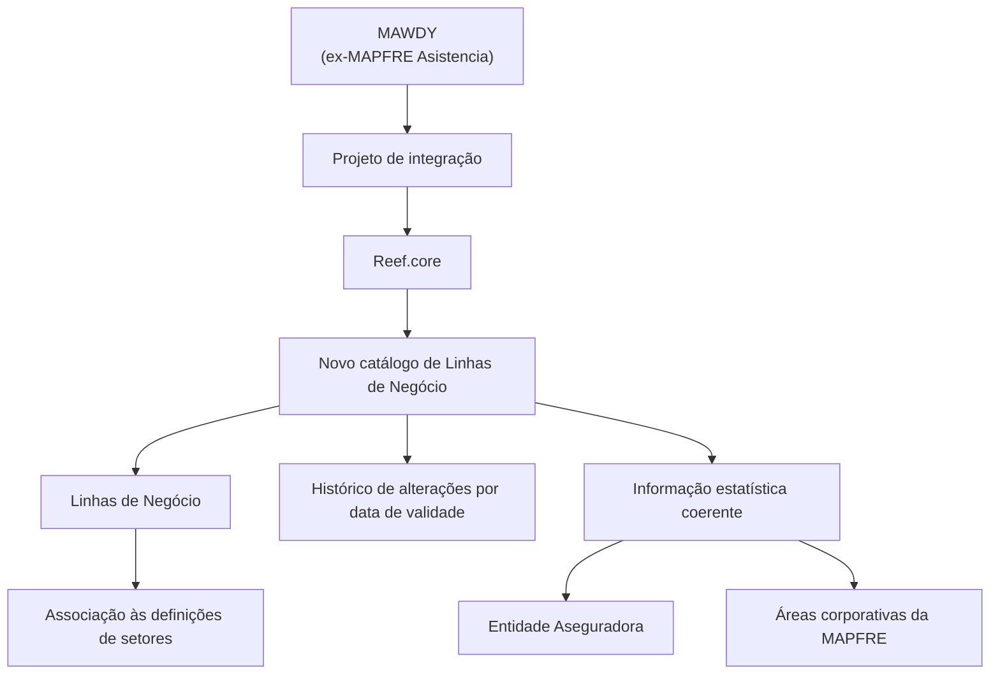

# Catálogo de Linhas de Negócio para Integração MAWDY no Reef.core

## 1. Metadados do Documento
- **Arquivo de Origem:** Não identificado no conteúdo fornecido
- **Tipo de Documento:** Especificação Técnica
- **Domínio / Sistema:** Reef.core; integração MAWDY (ex-MAPFRE Asistencia)
- **Público-Alvo:** Desenvolvedores, Arquitetos, Analistas Funcionais e Operação
- **Data/Versão Identificada:** Não identificada

---

## 2. Resumo Executivo & Contexto de Negócio

O documento define a necessidade de criar um novo catálogo de configuração de **Linhas de Negócio** no sistema **Reef.core**, motivada pelo projeto de integração da **MAWDY**, anteriormente denominada **MAPFRE Asistencia**. O catálogo permitirá armazenar diferentes linhas de negócio e associá-las aos setores em suas respectivas definições.

A estrutura proposta contempla propriedades gerais e operativas para controlar a identificação, classificação, descrição, validade e disponibilidade funcional das linhas de negócio. As propriedades gerais incluem companhia, código da linha de negócio, denominação e denominação abreviada.

As propriedades operativas incluem o estado de inabilitação e a data de validade. Esses atributos suportam o uso funcional controlado da linha de negócio no catálogo de setores e permitem manter histórico das alterações efetuadas nas definições ao longo do tempo.

O documento também estabelece uma diretriz corporativa: as chaves das linhas de negócio devem ser codificadas conforme usos, normas e políticas corporativas, com o objetivo de fornecer informações estatísticas coerentes entre a Entidade Aseguradora e as áreas corporativas da MAPFRE.

---

## 3. Arquitetura, Componentes & Tecnologias Envolvidas

Os componentes e conceitos explicitamente citados são:

| Componente / Conceito | Papel descrito |
| :--- | :--- |
| Reef.core | Sistema no qual será criado o novo catálogo de configuração. |
| MAWDY | Organização integrada ao projeto; identificada como ex-MAPFRE Asistencia. |
| Catálogo de Linhas de Negócio | Repositório de configuração para armazenar linhas de negócio. |
| Catálogo de Setores | Catálogo cuja definição poderá associar setores a linhas de negócio. |
| Entidade Aseguradora | Entidade que deve manter coerência estatística com áreas corporativas da MAPFRE. |
| Áreas corporativas da MAPFRE | Destinatárias da informação estatística coerente produzida pela codificação corporativa. |



> **Nota de Análise:** O documento não especifica tecnologias de implementação, banco de dados, APIs, métodos HTTP, contratos JSON, ambientes, rotas de integração ou mecanismos técnicos de persistência do catálogo.

---

## 4. Regras de Negócio, Especificações Funcionais & Processos

### 4.1 Objetivo funcional

1. Deve ser criado um novo catálogo de configuração no Reef.core.
2. O catálogo deve armazenar diferentes linhas de negócio.
3. As linhas de negócio devem poder ser associadas aos setores em suas definições.
4. A criação do catálogo é motivada pelas necessidades do projeto de integração da MAWDY no Reef.core.

### 4.2 Propriedades gerais

1. **Companhia**
   - Deve conter o código da companhia para a qual está sendo definido o Ramo Contábil no sistema.

2. **Linha de Negócio**
   - Deve estabelecer a classificação ou linha de negócio à qual o setor está adscrito.

3. **Denominação**
   - Deve conter a denominação ou descrição da linha de negócio.

4. **Denominação Abreviada**
   - Deve conter a denominação ou descrição abreviada da linha de negócio.

### 4.3 Propriedades operativas

1. **Inabilitação**
   - Deve estabelecer se o código da linha de negócio está inabilitado para utilização funcional na configuração do catálogo de setores.

2. **Data de Validade**
   - Deve informar a data a partir da qual a linha de negócio está plenamente operativa no sistema.
   - O uso correto da data de validade deve permitir manter histórico das alterações realizadas nas definições das linhas de negócio ao longo do tempo.

### 4.4 Diretriz de codificação

1. As chaves das linhas de negócio devem ser codificadas de acordo com usos, normas e políticas corporativas.
2. A codificação corporativa deve promover coerência da informação estatística entre a Entidade Aseguradora e as áreas corporativas da MAPFRE.

### 4.5 Vínculos documentais recomendados

O documento recomenda a leitura dos seguintes materiais para evitar interpretações isoladas ou incorretas:

- Configuração da Estrutura de Produtos.
- Perguntas frequentes.

---

## 5. Tabelas de Parâmetros, Ambientes e Estruturas de Dados

| Item / Parâmetro | Descrição / Função | Tipo / Valores / Formato | Ambiente / Observações |
| :--- | :--- | :--- | :--- |
| Companhia | Código da companhia para a qual é definido o Ramo Contábil no sistema. | Código de companhia; formato não detalhado. | Propriedade geral. |
| Linha de Negócio | Classificação ou linha de negócio à qual o setor está adscrito. | Código ou classificação; formato não detalhado. | Propriedade geral; associável à definição de setores. |
| Denominação | Descrição da linha de negócio. | Texto; formato não detalhado. | Propriedade geral. |
| Denominação Abreviada | Descrição abreviada da linha de negócio. | Texto; formato não detalhado. | Propriedade geral. |
| Inabilitação | Indica se o código de linha de negócio está impedido de uso funcional na configuração do catálogo de setores. | Indicador de estado; valores não detalhados. | Propriedade operativa. |
| Data de Validade | Data a partir da qual a linha de negócio está plenamente operativa. | Data; formato não detalhado. | Propriedade operativa; suporta histórico de alterações. |
| Linha de Negócio 1 | Asistencia - Drive. | Código `1`. | Lista de linhas de negócio apresentada no documento. |
| Linha de Negócio 2 | Asistencia - Home. | Código `2`. | Lista de linhas de negócio apresentada no documento. |
| Linha de Negócio 3 | Asistencia - Health. | Código `3`. | Lista de linhas de negócio apresentada no documento. |
| Linha de Negócio 4 | Asistencia - Travel. | Código `4`. | Lista de linhas de negócio apresentada no documento. |
| Linha de Negócio 5 | Asistencia - Pymes. | Código `5`. | Lista de linhas de negócio apresentada no documento. |
| Linha de Negócio 6 | Protección - Drive. | Código `6`. | Lista de linhas de negócio apresentada no documento. |
| Linha de Negócio 8 | Protección - LifeStyle. | Código `8`. | Lista de linhas de negócio apresentada no documento. |

---

## 6. Bateria de Perguntas & Respostas para RAG (FAQ Sintético)

### P1: Qual é o objetivo do novo catálogo de Linhas de Negócio no Reef.core?
**R:** O novo catálogo de Linhas de Negócio deve ser criado no Reef.core para atender às necessidades do projeto de integração da MAWDY, anteriormente MAPFRE Asistencia. O catálogo armazenará diferentes linhas de negócio que poderão ser associadas aos setores em suas definições.

### P2: Qual sistema receberá o catálogo de Linhas de Negócio?
**R:** O catálogo de Linhas de Negócio será criado no sistema Reef.core.

### P3: Qual é a relação entre linhas de negócio e setores?
**R:** A propriedade Linha de Negócio estabelece a classificação ou linha de negócio à qual um setor está adscrito. O catálogo foi concebido para permitir que diferentes linhas de negócio sejam associadas aos setores em suas definições.

### P4: Para que serve a propriedade Companhia?
**R:** A propriedade Companhia contém o código da companhia para a qual está sendo definido o Ramo Contábil no sistema.

### P5: O que representa a Denominação de uma linha de negócio?
**R:** A Denominação contém a denominação ou descrição da linha de negócio. A Denominação Abreviada contém a forma abreviada dessa denominação ou descrição.

### P6: Qual é a finalidade da propriedade Inabilitação?
**R:** A propriedade Inabilitação estabelece se o código da linha de negócio está inabilitado para ser utilizado funcionalmente na configuração do catálogo de setores.

### P7: Como a Data de Validade contribui para o histórico das linhas de negócio?
**R:** A Data de Validade informa a data a partir da qual a linha de negócio está plenamente operativa no sistema. Seu uso correto permite manter histórico das alterações efetuadas nas definições das linhas de negócio ao longo do tempo.

### P8: Quais linhas de negócio de assistência são listadas no documento?
**R:** O documento lista cinco linhas de assistência: código 1, Asistencia - Drive; código 2, Asistencia - Home; código 3, Asistencia - Health; código 4, Asistencia - Travel; e código 5, Asistencia - Pymes.

### P9: Quais linhas de negócio de proteção são listadas no documento?
**R:** O documento lista código 6, Protección - Drive, e código 8, Protección - LifeStyle.

### P10: Como as chaves das linhas de negócio devem ser codificadas?
**R:** As chaves devem ser codificadas de acordo com usos, normas e políticas corporativas. A finalidade é prover informações estatísticas coerentes entre a Entidade Aseguradora e as áreas corporativas da MAPFRE.

### P11: Quais documentos relacionados são recomendados para leitura?
**R:** O documento recomenda consultar Configuração da Estrutura de Produtos e Perguntas frequentes, pois a leitura isolada da definição de Linhas de Negócio pode conduzir a interpretações incorretas.

---

## 7. Glossário de Termos, Siglas & Conceitos-Chave

- **MAWDY:** Organização mencionada no projeto de integração; identificada no documento como ex-MAPFRE Asistencia.
- **MAPFRE Asistencia:** Denominação anterior da MAWDY, conforme o documento.
- **Reef.core:** Sistema no qual deverá ser criado o novo catálogo de Linhas de Negócio.
- **Linha de Negócio:** Classificação à qual um setor está adscrito; também representa a entidade configurável do novo catálogo.
- **Catálogo de Linhas de Negócio:** Catálogo de configuração destinado a armazenar linhas de negócio e permitir associação às definições de setores.
- **Catálogo de Setores:** Catálogo cuja configuração pode utilizar códigos de linhas de negócio.
- **Ramo Contábil:** Elemento cuja definição no sistema está associada ao código da companhia.
- **Denominação:** Descrição da linha de negócio.
- **Denominação Abreviada:** Descrição resumida da linha de negócio.
- **Inabilitação:** Estado que determina se um código de linha de negócio pode ser utilizado funcionalmente na configuração do catálogo de setores.
- **Data de Validade:** Data a partir da qual uma linha de negócio se encontra plenamente operativa no sistema.
- **Entidade Aseguradora:** Entidade para a qual a coerência estatística deve ser preservada em relação às áreas corporativas da MAPFRE.

---

## 8. Notas Críticas, Riscos & Limitações

- O documento não informa o nome do arquivo original, autoria, versão ou data de publicação.
- Não há detalhamento de modelo físico de dados, chaves primárias, obrigatoriedade de campos, tipos de dados, formatos de data ou valores permitidos para Inabilitação.
- O documento não descreve APIs, serviços, integrações técnicas, contratos de interface, autenticação, URLs, ambientes, portas ou mecanismos de persistência.
- A associação entre Linha de Negócio e setor é descrita conceitualmente, mas não há especificação de cardinalidade, fluxo de manutenção ou regras de conflito.
- A ausência de codificação explícita para o código `7` na lista apresentada não permite inferir se o código está reservado, inativo, omitido ou inexistente.
- A interpretação isolada do documento pode levar a erro; o próprio conteúdo recomenda leitura complementar da Configuração da Estrutura de Produtos e das Perguntas frequentes.
- **Nota de Análise:** O documento apresenta a necessidade de integração da MAWDY no Reef.core, mas não detalha o escopo técnico, as interfaces ou os processos de integração envolvidos.

---

## 9. Conteúdo Bruto Estruturado (Referência Fiel)

```text
--- [PÁGINA 1 DE 3] ---

DEFINICIÓN de Líneas de Negocio
Objetivo
Por necesidades del proyecto de integración de MAWDY (ex.MAPFRE Asistencia) en Reef.core es
necesario crear un nuevo catálogo de configuración en donde se puedan almacenar las diferentes
líneas de negocio que puedan ser asociadas a los sectores en su definición.
Propiedades Generales
Propiedades Operativas
Propiedades Generales
Compañía
Este atributo contiene el código de la compañía para la que se está definiendo el Ramo Contable en
el Sistema.
Línea de Negocio
Esta propiedad establece la clasificación o línea de negocio al que está adscrito el sector.
Denominación
Esta propiedad contendrá la denominación o descripción de la línea de negocio.
 / 
 CF
Home Solutions APIs Documentation Zeus
EN


--- [PÁGINA 2 DE 3] ---

LÍNEA DE NEGOCIO DENOMINACIÓN
1 Asistencia - Drive
2 Asistencia - Home
3 Asistencia - Health
4 Asistencia - Travel
5 Asistencia - Pymes
6 Protección - Drive
8 Protección - LifeStyle
Denominación Abreviada
Esta propiedad contiene la denominación o descripción abreviada de la línea de negocio.
Propiedades Operativas
Inhabilitación
Esta propiedad establece si el Código de la línea de negocio está inhabilitado para poder ser utilizado
funcionalmente en la configuración del catálogo de sectores.
Fecha de Validez
Esta propiedad le indica al Sistema la fecha a partir de la cual la línea de negocio está plenamente
operativa en el sistema por lo que su correcto empleo permitiría tener un histórico de los cambios
efectuados en sus definiciones a lo largo del tiempo.
Vínculos
Relación de Directrices y Documentos funcionales cuya lectura recomendada para evitar que la
interpretación aislada del presente documento pueda conducir a error.
Configuración de la Estructura de Productos
Preguntas frecuentes


--- [PÁGINA 3 DE 3] ---

(1) ¿Existe alguna recomendación operativa que deba ser tomada en consideración localmente en la
codificación, uso y definición del catálogo de líneas de negocio en el Sistema?
Se deberían codificar sus claves de acuerdo con los usos, normas y políticas corporativas al objeto
de proveer de manera coherente la información estadística entre la Entidad Aseguradora y las áreas
corporativas de MAPFRE.
```
