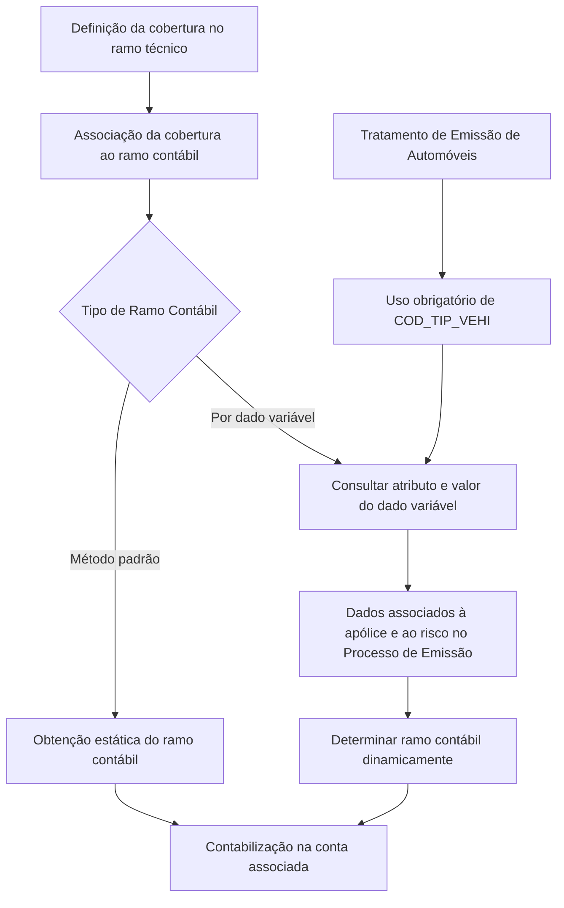

# Definição de Ramo Contábil por Dado Variável

## 1. Metadados do Documento
- **Arquivo de Origem:** `Não identificado no conteúdo fornecido`
- **Tipo de Documento:** `Especificação Técnica`
- **Domínio / Sistema:** `MAPFRE — configuração de Ramos Contábeis`
- **Público-Alvo:** `Desenvolvedores, Arquitetos, Operação e Negócio`
- **Data/Versão Identificada:** `Não identificada`

---

## 2. Resumo Executivo & Contexto de Negócio

O documento especifica a definição de **Ramos Contábeis por Dado Variável** no sistema MAPFRE. Ramos contábeis são chaves associadas às coberturas de seguro e determinam a conta sobre a qual será realizada a contabilização. A associação entre ramo contábil e cobertura ocorre durante a definição da cobertura no ramo técnico.

A configuração permite que o ramo contábil seja obtido de forma estática, pelo método padrão, ou dinamicamente, conforme o valor de um dado variável definido pela entidade MAPFRE. Os valores dos dados variáveis são associados às apólices e aos riscos durante a captura de informações no Processo de Emissão.

O caso exemplificado no documento é o tratamento de emissão de automóveis. Para ramos técnicos com esse tratamento, o atributo de dado variável utilizado para obter dinamicamente o ramo contábil deve obrigatoriamente possuir o valor `COD_TIP_VEHI`. Essa regra permite diferenciar contabilmente automóveis, motocicletas e caminhões, inclusive para modalidades e coberturas distintas.

O ramo contábil é formado por um código de nove posições, estruturado em setor, subsetor, agrupamento e sequência. O documento também estabelece propriedades operacionais para vigência e inabilitação do registro, além de recomendar a leitura do material relacionado a Ramos Contábeis Estándar e perguntas frequentes.

---

## 3. Arquitetura, Componentes & Tecnologias Envolvidas

Os componentes funcionais identificados são:

- **Sistema MAPFRE:** sistema no qual os ramos contábeis são definidos e utilizados.
- **Entidade MAPFRE:** entidade responsável por definir dados variáveis utilizados na configuração.
- **Ramo Técnico:** ramo ao qual a definição de ramo contábil se aplica.
- **Modalidade ou Produto Técnico/Comercial:** produto afetado pela definição.
- **Cobertura:** cobertura de seguro associada ao ramo contábil.
- **Dado Variável:** atributo e valor usados para determinar dinamicamente o ramo contábil.
- **Processo de Emissão:** processo em que dados variáveis são associados às apólices e aos riscos.
- **Ramo Contábil:** código de nove posições utilizado na contabilização.
- **Tratamento de Emissão de Automóveis:** condição que exige o uso obrigatório de `COD_TIP_VEHI`.



> *Nota de Análise: O documento não detalha componentes de software, APIs, métodos HTTP, contratos JSON, bancos de dados, tecnologias de implantação ou ambientes técnicos.*

---

## 4. Regras de Negócio, Especificações Funcionais & Processos

### Definição e associação de ramo contábil

1. Os ramos contábeis são chaves associadas às coberturas.
2. Cada ramo contábil relaciona uma cobertura à conta sobre a qual será realizada sua contabilização.
3. A associação entre ramo contábil e cobertura é realizada no momento da definição da cobertura no ramo.
4. O sistema permite configurar ramos contábeis com base nos valores de dados variáveis definidos pela entidade MAPFRE.
5. Os valores dos dados variáveis são associados às apólices e aos riscos durante a captura de informações do Processo de Emissão.

### Tipos de obtenção de ramo contábil

- **Estático:** o ramo contábil é obtido pelo método padrão.
- **Dinâmico:** o ramo contábil é obtido de acordo com o valor de um dado variável.

### Regra obrigatória para emissão de automóveis

Quando o ramo técnico possuir um **Tratamento de Emissão de Automóveis**, o atributo utilizado para localizar dinamicamente o ramo contábil deve obrigatoriamente ter o valor:

```text
COD_TIP_VEHI
```

Essa regra permite obter ramos contábeis distintos segundo o tipo de veículo, como:

- Automóveis;
- Motocicletas;
- Caminhões.

### Estrutura do código de ramo contábil

O código do ramo contábil possui nove posições:

1. Posição `1`: setor.
2. Posições `2` a `3`: subsetor.
3. Posições `4` a `6`: agrupamento.
4. Posições `7` a `9`: sequência.

### Vigência e inabilitação

- A **Data de Validade** informa a partir de qual data o ramo contábil estará plenamente operacional no sistema.
- A propriedade de **Inhabilitación** estabelece que o registro está inabilitado e não poderá ser considerado pelos processos do sistema.

### Recomendação de codificação local

As posições correspondentes ao agrupamento podem ser definidas como qualquer sequência considerada conveniente pela entidade local. A prática mais usual é utilizar um agrupamento que identifique univocamente o código do ramo técnico.

---

## 5. Tabelas de Parâmetros, Ambientes e Estruturas de Dados

| Item / Parâmetro | Descrição / Função | Tipo / Valores / Formato | Ambiente / Observações |
| :--- | :--- | :--- | :--- |
| Companhia | Código da companhia para a qual o ramo contábil está sendo definido. | Código de companhia | Aplicável à definição no sistema. |
| Ramo | Código do ramo técnico afetado pela definição. | Código de ramo técnico | Define o escopo técnico da configuração. |
| Modalidade | Código da modalidade ou produto Técnico/Comercial afetado pela definição. | Código de modalidade ou produto | Pode diferenciar produtos dentro de um ramo técnico. |
| Cobertura | Código da cobertura afetada pela definição. | Código de cobertura | A cobertura é associada ao ramo contábil. |
| Tipo de Ramo Contábil | Define se o ramo contábil será obtido pelo método padrão ou conforme dado variável. | Estático ou dinâmico por dado variável | Determina a lógica de obtenção do ramo contábil. |
| Nome do Atributo / Dado Variável | Código do dado variável utilizado para realizar a busca do ramo contábil dinâmico. | Código de dado variável | Obrigatoriamente `COD_TIP_VEHI` quando o ramo técnico tiver Tratamento de Emissão de Automóveis. |
| Valor do Dado Variável | Valor do dado variável usado na busca do ramo contábil dinâmico. | Valor configurado para o dado variável | Utilizado somente quando o tipo de ramo contábil for dinâmico. |
| Ramo Contábil | Código contábil associado à configuração. | Código com 9 posições | Usado para determinar a contabilização da cobertura. |
| Data de Validade | Data a partir da qual o ramo contábil estará plenamente operacional. | Data | Controla a vigência operacional do registro. |
| Inhabilitación | Indica que o registro está inabilitado para utilização pelos processos do sistema. | Indicador de inabilitação | Um registro inabilitado não é contemplado nos processos do sistema. |

| Posições do Ramo Contábil | Composição | Observação |
| :--- | :--- | :--- |
| `1` | Setor | Primeira posição do código de nove posições. |
| `2 - 3` | Subsetor | Segunda e terceira posições. |
| `4 - 5 - 6` | Agrupamento | Pode ser definido pela entidade local; usualmente identifica univocamente o ramo técnico. |
| `7 - 8 - 9` | Sequência | Três últimas posições do código. |

| Ramo | Modalidade | Cobertura | Dado Variável | Valor do Dado Variável | Ramo Contábil informado |
| :--- | :--- | :--- | :--- | :--- | :--- |
| `401` | Todo Riesgo | Daños Propios | `COD_TIP_VEHI` | AUTOMÓVILES | `10` |
| `401` | Todo Riesgo plus | Daños Propios | `COD_TIP_VEHI` | AUTOMÓVILES | `10` |
| `401` | Todo Riesgo | Daños Propios | `COD_TIP_VEHI` | MOTOCICLETAS | `10` |
| `401` | Todo Riesgo | Daños Propios | `COD_TIP_VEHI` | CAMIONES | `10` |
| `401` | Seguro Obligatorio | Resp. Civil | `COD_TIP_VEHI` | AUTOMÓVILES | `10` |
| `401` | Seguro Obligatorio | Resp. Civil | `COD_TIP_VEHI` | MOTOCICLETAS | `10` |
| `401` | Seguro Obligatorio | Resp. Civil | `COD_TIP_VEHI` | CAMIONES | `10` |

> *Nota de Análise: A tabela extraída apresenta a coluna de ramo contábil de forma fragmentada (`R`, `CO`, `10`). O conteúdo fornecido não permite confirmar se `10` representa o código completo, parcial ou um valor visualmente truncado no documento original.*

---

## 6. Bateria de Perguntas & Respostas para RAG (FAQ Sintético)

### P1: O que é um ramo contábil no sistema MAPFRE?
**R:** Um ramo contábil é uma chave associada a uma cobertura de seguro. Essa associação relaciona a cobertura à conta sobre a qual sua contabilização será realizada no sistema.

### P2: Em que momento a associação entre cobertura e ramo contábil é definida?
**R:** A associação do ramo contábil com a cobertura é realizada no momento da definição da cobertura no ramo.

### P3: Como o sistema pode obter um ramo contábil?
**R:** O ramo contábil pode ser obtido de forma estática, pelo método padrão, ou dinamicamente, de acordo com o valor de um dado variável.

### P4: Quando os dados variáveis são associados às apólices e aos riscos?
**R:** Os valores dos dados variáveis são associados às apólices e aos riscos durante a captura de suas informações no Processo de Emissão.

### P5: Qual atributo deve ser usado para determinar dinamicamente o ramo contábil em ramos técnicos com Tratamento de Emissão de Automóveis?
**R:** O atributo obrigatório é `COD_TIP_VEHI`. O documento determina que esse valor deve ser utilizado obrigatoriamente quando o ramo técnico possuir Tratamento de Emissão de Automóveis.

### P6: Quais elementos compõem o código de ramo contábil?
**R:** O código de ramo contábil é composto por nove posições: a posição 1 representa o setor, as posições 2 e 3 representam o subsetor, as posições 4 a 6 representam o agrupamento e as posições 7 a 9 representam a sequência.

### P7: O que representa a propriedade Data de Validade?
**R:** A Data de Validade indica a data a partir da qual o ramo contábil estará plenamente operacional no sistema.

### P8: O que ocorre quando um registro possui a propriedade Inhabilitación?
**R:** Um registro marcado como inabilitado não poderá ser contemplado pelos processos do sistema.

### P9: Como o agrupamento do ramo contábil pode ser definido localmente?
**R:** As posições de agrupamento podem receber qualquer sequência considerada conveniente pela entidade local. A forma mais usual é utilizar uma sequência que identifique univocamente o código do ramo técnico.

### P10: Por que o dado variável `COD_TIP_VEHI` é relevante na configuração de ramos contábeis?
**R:** `COD_TIP_VEHI` permite diferenciar a obtenção dinâmica do ramo contábil segundo o tipo de veículo, como automóveis, motocicletas e caminhões, especialmente nos ramos técnicos com Tratamento de Emissão de Automóveis.

---

## 7. Glossário de Termos, Siglas & Conceitos-Chave

- **Ramo Contábil:** chave associada a uma cobertura para determinar a conta utilizada na contabilização.
- **Ramo Técnico:** ramo ao qual uma definição de ramo contábil se aplica.
- **Cobertura:** elemento do seguro ao qual um ramo contábil pode ser associado.
- **Modalidade:** código da modalidade ou produto Técnico/Comercial afetado pela definição.
- **Dado Variável:** dado definido pela entidade MAPFRE, associado a apólices e riscos, que pode determinar dinamicamente o ramo contábil.
- **COD_TIP_VEHI:** código de atributo obrigatório para obtenção dinâmica do ramo contábil quando o ramo técnico possui Tratamento de Emissão de Automóveis.
- **Tratamento de Emissão de Automóveis:** condição do ramo técnico que exige o uso do atributo `COD_TIP_VEHI`.
- **Agrupamento:** componente das posições 4 a 6 do ramo contábil; pode ser definido localmente.
- **Inhabilitación:** propriedade que indica que um registro não deve ser considerado pelos processos do sistema.
- **Proceso de Emisión:** processo em que informações são capturadas e dados variáveis são associados a apólices e riscos.

---

## 8. Notas Críticas, Riscos & Limitações

- O documento não informa o nome do arquivo de origem, data, versão, autor ou responsável pela especificação.
- Não há detalhamento sobre APIs, interfaces, contratos de integração, banco de dados, logs, URLs, servidores ou ambientes técnicos.
- O documento não especifica o conjunto de valores possíveis para o Tipo de Ramo Contábil além da distinção conceitual entre obtenção estática e dinâmica.
- O documento não informa validações para inexistência, duplicidade ou inconsistência do valor de dado variável durante a busca dinâmica.
- A tabela de exemplos apresenta o ramo contábil de maneira fragmentada; não é possível confirmar o código completo de nove posições a partir do texto extraído.
- A leitura de **Ramos Contables Estándar** e de **Preguntas frecuentes** é recomendada para evitar interpretação isolada e incorreta desta especificação.
- *Nota de Análise: O documento lista configurações para automóveis, motocicletas e caminhões, mas não detalha os critérios para manutenção, precedência ou resolução de conflito entre configurações.*

---

## 9. Conteúdo Bruto Estruturado (Referência Fiel)

```text
--- [PÁGINA 1 DE 4] ---

DEFINICIÓN de Ramo Contable por Dato
Variable
Contexto
Los ramos contables son claves, asociadas a las coberturas, que las relacionan con la cuenta sobre
la que se va a realizar su contabilización. La asociación del ramo contable con la cobertura se realiza
en el momento de la definición de la cobertura en el ramo.
Por otra parte, el sistema contempla la posibilidad de poder configurar los ramos contables de las
coberturas de acuerdo con los valores de alguno de los datos variables que hayan sido definidos
por la entidad MAPFRE, valores que se van a asociar a las pólizas y a sus riesgos en la captura de
su información durante el Proceso de Emisión.
Propiedades Operativas
Otras Propiedades
Propiedades Operativas
Compañía
Este atributo contiene el código de la compañía para la que se está definiendo el Ramo Contable en
el Sistema.
Ramo
Esta propiedad contiene el código del Ramo Técnico al que afecta esta definición.
 / 
 CF
Home Solutions APIs Documentation Zeus
EN


--- [PÁGINA 2 DE 4] ---

Modalidad
Esta propiedad contiene el código de la Modalidad o Producto 'Técnico/Comercial' a la que afecta
esta definición.
Cobertura
Esta propiedad contiene el código de la Cobertura a la que afecta esta definición.
Tipo de Ramo Contable
Este atributo contiene el Tipo de Ramo Contable que se va a contemplar en la definición de la
Cobertura, es decir, si el Ramo Contable se va a obtener de forma estática por el método estándar o
el ramo contable se va a obtener dinámicamente de acuerdo con el valor del Dato Variable.
Nombre del Atributo/Dato Variable
Caso que el Tipo de Ramo Contable indique que va a ser obtenido dinámicamente en función de un
Dato Variable, este atributo contendrá el código del Dato Variable que se ha de utilizar para realizar
la búsqueda del Ramo Contable.
El Atributo que se ha de emplear si el Ramo Técnico tiene un Tratamiento de Emisión de
Automóviles obligatoriamente ha de tener el valor: 'COD_TIP_VEHI'.
Valor del Dato Variable
Caso que el Tipo de Ramo Contable indique que vaya a ser obtenido dinámicamente en función de
un Dato Variable, este atributo contendrá el valor del Dato Variable que se ha de utilizar para
realizar la búsqueda del Ramo Contable.
Ramo Contable
Este atributo contiene el código del Ramo Contable en el Sistema compuesto por 9 posiciones que
usualmente se conforman de la siguiente forma:
POSICIONES DESCRIPCIÓN
1 Sector
2 - 3 Sub Sector
4 - 5 - 6 Agrupamiento


--- [PÁGINA 3 DE 4] ---

POSICIONES DESCRIPCIÓN
7 - 8 - 9 Secuencia
De esta manera y como ejemplo, se podrían tener Ramos Contables distintos si se hubiera emitido
una póliza para un Automóvil, para una Motocicleta o para un Camión, para distintas Modalidades,
para distintas coberturas, ...
RAMO MODALIDAD COBERTURA DATO
VARIABLE
VALOR DEL
DATO
VARIABLE
R
CO
401 Todo Riesgo Daños
Propios
COD_TIP_VEHI AUTOMÓVILES 10
401 Todo Riesgo
plus
Daños
Propios
COD_TIP_VEHI AUTOMÓVILES 10
401 Todo Riesgo Daños
Propios
COD_TIP_VEHI MOTOCICLETAS 10
401 Todo Riesgo Daños
Propios
COD_TIP_VEHI CAMIONES 10
401 Seguro
Obligatorio
Resp. Civil COD_TIP_VEHI AUTOMÓVILES 10
401 Seguro
Obligatorio
Resp. Civil COD_TIP_VEHI MOTOCICLETAS 10
401 Seguro
Obligatorio
Resp. Civil COD_TIP_VEHI CAMIONES 10
Otras Propiedades
Fecha de Validez
Esta propiedad le indica al sistema la fecha a partir de la cual el Ramo Contable estará plenamente
operativo en el sistema.


--- [PÁGINA 4 DE 4] ---

Inhabilitación
Esta propiedad establece que el Registro está inhabilitado para poder ser contemplado en los
procesos del Sistema.
Vínculos
Relación de Directrices y Documentos funcionales cuya lectura recomendada para evitar que la
interpretación aislada del presente documento pueda conducir a error.
Ramos Contables Estándar
Preguntas frecuentes
(1) ¿Existe alguna recomendación que deba ser tomada en consideración localmente en la
codificación, uso y definición del catálogo de Ramos Contables por Tipo de Vehículo en el Sistema?
Las posiciones correspondientes al Agrupamiento pueden definirse como cualquier secuencia que se
estime conveniente por parte de la entidad local siendo la más usual aquella que identifica
unívocamente el código del Ramo Técnico.
```
