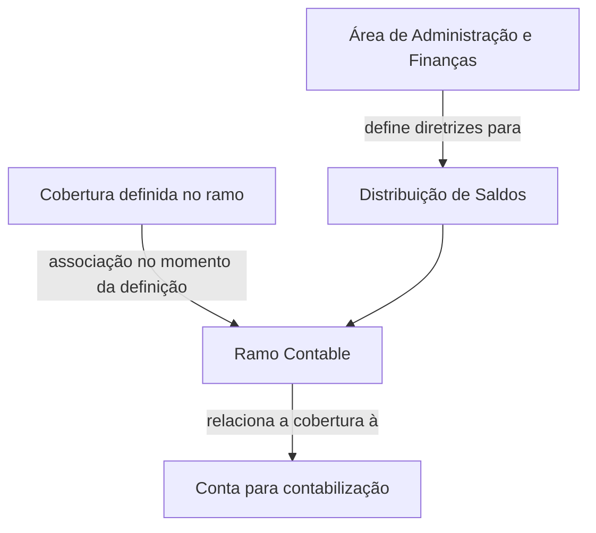

# Definição de Ramo Contable no Sistema

## 1. Metadados do Documento
- **Arquivo de Origem:** Não informado
- **Tipo de Documento:** Especificação Técnica
- **Domínio / Sistema:** Catálogo de Ramos Contables / MAPFRE Local
- **Público-Alvo:** Negócio, Administração e Finanças, equipes de configuração do sistema
- **Data/Versão Identificada:** Não identificada

---

## 2. Resumo Executivo & Contexto de Negócio

O documento define o conceito de **Ramo Contable** no sistema. Ramos Contables são chaves associadas às coberturas e relacionam cada cobertura à conta sobre a qual será realizada a contabilização.

A associação entre Ramo Contable e cobertura ocorre no momento da definição da cobertura no ramo. Dessa forma, a configuração de coberturas inclui a vinculação contábil necessária para a contabilização correspondente.

A definição de um Ramo Contable possui propriedades gerais e operativas. As propriedades gerais identificam a companhia, o setor, o subsetor, o código do Ramo Contable e sua descrição. As propriedades operativas incluem um código simplificado e a definição da distribuição de saldos.

O código do Ramo Contable é composto por nove posições, segmentadas em setor, subsetor, agrupamento e sequência. A entidade local pode definir livremente as posições de agrupamento conforme sua conveniência; a utilização mais comum é identificar univocamente o código do Ramo Técnico.

A distribuição de saldos deve seguir as diretrizes da área de Administração e Finanças da entidade MAPFRE Local. O documento indica distribuição por Entidade, Setor, Sub Setor ou diretamente por Ramo Contable.

---

## 3. Arquitetura, Componentes & Tecnologias Envolvidas

O documento não descreve arquitetura de software, microsserviços, tecnologias, APIs, ambientes, protocolos ou fluxos de integração. O relacionamento funcional explicitamente descrito ocorre entre os elementos abaixo:

- **Cobertura:** elemento ao qual o Ramo Contable é associado.
- **Ramo Contable:** chave que relaciona a cobertura à conta de contabilização.
- **Conta:** destino sobre o qual será efetuada a contabilização.
- **Área de Administração e Finanças:** área cujas diretrizes orientam a distribuição de saldos.
- **Entidade MAPFRE Local:** entidade que pode definir o agrupamento do código e cuja diretriz orienta a distribuição de saldos.



> **Nota de Análise:** O documento não detalha contratos, métodos HTTP, bancos de dados, interfaces de usuário, tecnologias de implementação ou integrações técnicas.

---

## 4. Regras de Negócio, Especificações Funcionais & Processos

### Definição e associação do Ramo Contable

1. O Ramo Contable é uma chave associada às coberturas.
2. O Ramo Contable relaciona a cobertura à conta sobre a qual será realizada sua contabilização.
3. A associação entre Ramo Contable e cobertura é realizada durante a definição da cobertura no ramo.

### Propriedades gerais

1. A companhia deve ser identificada pelo código da companhia para a qual o Ramo Contable está sendo definido.
2. O setor deve ser identificado pelo código do setor da companhia para o qual o Ramo Contable está sendo definido.
3. O subsetor deve corresponder a um código de Sub Sector previamente definido e associado ao código de setor da companhia.
4. O Ramo Contable deve possuir um código formado por nove posições.
5. O Ramo Contable deve possuir uma descrição ou nomenclatura no sistema.

### Estrutura do código do Ramo Contable

1. A posição **1** corresponde ao Setor.
2. As posições **2 a 3** correspondem ao Sub Setor.
3. As posições **4 a 6** correspondem ao Agrupamento.
4. As posições **7 a 9** correspondem à Sequência.
5. As posições de Agrupamento podem ser definidas como qualquer sequência considerada conveniente pela entidade local.
6. A forma mais usual para o Agrupamento é identificar univocamente o código do Ramo Técnico.

### Propriedades operativas

1. O Código Simplificado do Ramo Contable facilita a lembrança e a captura do Ramo Contable no sistema.
2. A Distribuição de Saldos define o tipo de distribuição de saldos aplicável no sistema.
3. A Distribuição de Saldos deve observar as diretrizes da Área de Administração e Finanças da entidade MAPFRE Local.
4. A distribuição pode ocorrer por Entidade, Setor, Sub Setor ou diretamente por Ramo Contable.

### Documentos relacionados

O documento recomenda a leitura de diretrizes e documentos funcionais relacionados para evitar erros de interpretação decorrentes da leitura isolada. É citado o documento ou tema **Estructura de Productos**.

> **Nota de Análise:** O documento menciona uma pergunta frequente sobre recomendações locais para codificação, uso e definição do catálogo de Ramos Contables, mas não apresenta a respectiva resposta no conteúdo fornecido.

---

## 5. Tabelas de Parâmetros, Ambientes e Estruturas de Dados

| Item / Parâmetro | Descrição / Função | Tipo / Valores / Formato | Ambiente / Observações |
| :--- | :--- | :--- | :--- |
| Compañía | Código da companhia para a qual o Ramo Contable é definido. | Código de companhia; formato não detalhado. | Sistema |
| Sector | Código do setor da companhia para o qual o Ramo Contable é definido. | Código de setor; formato não detalhado. | Sistema |
| Sub Sector | Código de subsetor definido e associado ao código de setor da companhia. | Código de subsetor; formato não detalhado. | Sistema |
| Ramo Contable | Código do Ramo Contable utilizado no sistema. | Código de 9 posições. | Sistema |
| Descripción del Ramo Contable | Descrição ou nomenclatura do Ramo Contable. | Texto; formato não detalhado. | Sistema |
| Código Simplificado del Ramo Contable | Código que facilita recordar e capturar o Ramo Contable. | Código simplificado; formato não detalhado. | Sistema |
| Distribución de Saldos | Define o tipo de distribuição de saldos. | Entidad, Sector, Sub Sector ou Ramo Contable. | Conforme diretrizes da Área de Administração e Finanças da MAPFRE Local |
| Agrupamiento | Segmento do código do Ramo Contable. | Posições 4 a 6; sequência definida pela entidade local. | Usualmente identifica univocamente o código do Ramo Técnico |
| Secuencia | Segmento final do código do Ramo Contable. | Posições 7 a 9. | Sistema |

### Composição do código de Ramo Contable

| Posições | Componente | Descrição |
| :--- | :--- | :--- |
| 1 | Sector | Identifica o setor. |
| 2 - 3 | Sub Sector | Identifica o subsetor. |
| 4 - 5 - 6 | Agrupamiento | Sequência definida conforme conveniência da entidade local; usualmente identifica univocamente o Ramo Técnico. |
| 7 - 8 - 9 | Secuencia | Identifica a sequência do Ramo Contable. |

### Opções de distribuição de saldos

| Opção de Distribuição | Descrição Disponível |
| :--- | :--- |
| Entidad | Distribuição de saldos por entidade. |
| Sector | Distribuição de saldos por setor. |
| Sub Sector | Distribuição de saldos por subsetor. |
| Ramo Contable | Distribuição de saldos diretamente por Ramo Contable. |

---

## 6. Bateria de Perguntas & Respostas para RAG (FAQ Sintético)

### P1: O que é um Ramo Contable no sistema?
**R:** Um Ramo Contable é uma chave associada às coberturas. A função do Ramo Contable é relacionar uma cobertura à conta sobre a qual será realizada a sua contabilização.

### P2: Em que momento a cobertura é associada a um Ramo Contable?
**R:** A associação entre o Ramo Contable e a cobertura é realizada no momento da definição da cobertura no ramo.

### P3: Quantas posições possui o código do Ramo Contable?
**R:** O código do Ramo Contable possui nove posições.

### P4: Como são distribuídas as nove posições do código do Ramo Contable?
**R:** A posição 1 identifica o Setor; as posições 2 e 3 identificam o Sub Setor; as posições 4, 5 e 6 formam o Agrupamento; e as posições 7, 8 e 9 formam a Sequência.

### P5: Qual é a finalidade do Agrupamento no código do Ramo Contable?
**R:** O Agrupamento ocupa as posições 4 a 6 do código. A entidade local pode defini-lo como qualquer sequência considerada conveniente. A forma mais usual é utilizar o Agrupamento para identificar univocamente o código do Ramo Técnico.

### P6: Quais informações gerais devem ser definidas para um Ramo Contable?
**R:** As propriedades gerais incluem Compañía, Sector, Sub Sector, o código do Ramo Contable e a Descripción del Ramo Contable.

### P7: O que representa o atributo Sub Sector?
**R:** O atributo Sub Sector contém o código de um subsetor definido e associado ao código de setor da companhia para a qual o Ramo Contable está sendo definido.

### P8: Para que serve o Código Simplificado do Ramo Contable?
**R:** O Código Simplificado facilita recordar o Ramo Contable e permite agilizar sua captura no sistema.

### P9: Quais modalidades de Distribuição de Saldos são previstas?
**R:** A Distribuição de Saldos pode ser realizada por Entidad, por Sector, por Sub Sector ou diretamente por Ramo Contable.

### P10: Quem define as diretrizes para a Distribuição de Saldos?
**R:** A Distribuição de Saldos deve seguir as diretrizes estabelecidas pela Área de Administración y Finanzas da entidade MAPFRE Local.

### P11: Qual documento relacionado é citado como leitura recomendada?
**R:** O documento cita **Estructura de Productos** como documento ou diretriz funcional cuja leitura é recomendada para evitar interpretações isoladas e incorretas.

### P12: O documento define recomendações locais para a codificação do catálogo de Ramos Contables?
**R:** Não. O conteúdo apresenta uma pergunta frequente sobre recomendações locais para codificação, uso e definição do catálogo de Ramos Contables, mas não fornece uma resposta.

---

## 7. Glossário de Termos, Siglas & Conceitos-Chave

- **Ramo Contable:** Chave associada a coberturas que relaciona uma cobertura à conta sobre a qual será efetuada a contabilização.
- **Cobertura:** Elemento cuja definição no ramo inclui a associação a um Ramo Contable.
- **Conta:** Destino contábil relacionado à cobertura por meio do Ramo Contable.
- **Compañía:** Código da companhia para a qual o Ramo Contable é definido.
- **Sector:** Código de setor da companhia para o qual o Ramo Contable é definido.
- **Sub Sector:** Código de subsetor definido e associado ao código de setor da companhia.
- **Agrupamiento:** Segmento das posições 4 a 6 do Ramo Contable, definido pela entidade local.
- **Secuencia:** Segmento das posições 7 a 9 do Ramo Contable.
- **Ramo Técnico:** Código que é usualmente identificado univocamente pelo Agrupamento.
- **Código Simplificado:** Código destinado a facilitar a lembrança e a captura do Ramo Contable no sistema.
- **Distribución de Saldos:** Tipo de distribuição de saldos aplicável no sistema.
- **MAPFRE Local:** Entidade local cujas diretrizes de Administração e Finanças orientam a distribuição de saldos.

---

## 8. Notas Críticas, Riscos & Limitações

- O documento não detalha o formato dos códigos de Compañía, Sector, Sub Sector ou Código Simplificado.
- O documento não apresenta critérios de validação para a associação entre cobertura, Ramo Contable e conta.
- O documento não detalha como o sistema executa contabilizações, nem quais contas podem ser associadas a cada cobertura.
- O documento não especifica se existem restrições, unicidade, obrigatoriedade ou regras de manutenção para os nove caracteres do Ramo Contable.
- Embora cite uma pergunta frequente sobre recomendações locais de codificação, uso e definição do catálogo, a resposta não está disponível no conteúdo fornecido.
- A leitura isolada do documento pode conduzir a erro; a própria fonte recomenda consultar diretrizes e documentos funcionais relacionados, incluindo **Estructura de Productos**.
- Não há detalhamento de APIs, integrações, telas, permissões, ambientes, logs ou tecnologias de implementação.

---

## 9. Conteúdo Bruto Estruturado (Referência Fiel)

```text
--- [PÁGINA 1 DE 3] ---

DEFINICIÓN de Ramo Contable
Contexto
Los ramos contables son claves, asociadas a las coberturas, que las relacionan con la cuenta sobre
la que se va a realizar su contabilización. La asociación del ramo contable con la cobertura se realiza
en el momento de la definición de la cobertura en el ramo.
Propiedades Generales
Propiedades Operativas
Propiedades Generales
Compañía
Este atributo contiene el código de la compañía para la que se está definiendo el Ramo Contable en
el Sistema.
Sector
Este atributo contiene el código del Sector de la compañía para el que se está definiendo el Ramo
Contable en el Sistema.
Sub Sector
Este atributo contiene el código de un Sub Sector definido y asociado al Código de Sector de la
compañía para el que se está definiendo el Ramo Contable en el Sistema.
 / 
 CF
Home Solutions APIs Documentation Zeus
EN

--- [PÁGINA 2 DE 3] ---

Ramo Contable
Este atributo contiene el código del Ramo Contable en el Sistema compuesto por 9 posiciones que
usualmente se conforman de la siguiente forma:
POSICIONES DESCRIPCIÓN
1 Sector
2 - 3 Sub Sector
4 - 5 - 6 Agrupamiento
7 - 8 - 9 Secuencia
Descripción del Ramo Contable
Este atributo contiene la Descripción o Nomenclatura del Ramo Contable en el Sistema.
Propiedades Operativas
Código Simplificado del Ramo Contable
Este atributo contiene el código simplificado que facilita y permite recordar el Ramo Contable en el
Sistema a efectos de agilizar su captura en el sistema.
Distribución de Saldos
Este atributo establece el tipo de distribución de Saldos en el sistema de acuerdo a las directrices
marcadas por el Área de Administración y Finanzas de la entidad MAPFRE Local: Si la distribución
va a realizarse por Entidad, por Sector, por Sub Sector o directamente por Ramo Contable,
Vínculos
Relación de Directrices y Documentos funcionales cuya lectura recomendada para evitar que la
interpretación aislada del presente documento pueda conducir a error.
Estructura de Productos
Preguntas frecuentes
(1) ¿Existe alguna recomendación que deba ser tomada en consideración localmente en la
codificación, uso y definición del catálogo de Ramos Contables en el Sistema?

--- [PÁGINA 3 DE 3] ---

Las posiciones correspondientes al Agrupamiento pueden definirse como cualquier secuencia que se
estime conveniente por parte de la entidad local siendo la más usual aquella que identifica
unívocamente el código del Ramo Técnico.
```
