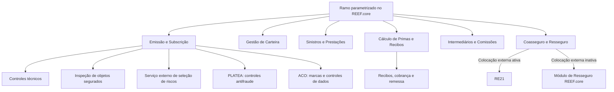

# Definição de Ramo no REEF.core: Propriedades Operacionais, Emissão, Primas, Recibos, Coasseguro e Resseguro

## 1. Metadados do Documento
- **Arquivo de Origem:** Não identificado no conteúdo fornecido
- **Tipo de Documento:** Especificação Técnica / Manual Funcional
- **Domínio / Sistema:** REEF.core; MAPFRE
- **Público-Alvo:** Negócio, Operação, Subscrição, Tecnologia e Processos
- **Data/Versão Identificada:** Não identificada

---

## 2. Resumo Executivo & Contexto de Negócio

O documento define o conceito de **ramo** no REEF.core como um agrupamento de características de seguro para riscos homogêneos, como Vida, Automóveis, Incêndios, Transportes e outros. O ramo é uma unidade de parametrização central que determina como o sistema deve comportar-se durante emissão, gestão de carteira, sinistros, cálculo de primas, recibos, comissões, coasseguro, resseguro e integrações corporativas.

Cada companhia pode definir até **999 códigos de ramos**, identificados individualmente por código, descrição e abreviatura. Todo ramo precisa estar associado obrigatoriamente a um setor e, dentro dele, a um subsector da estrutura de produtos. A classificação sustenta a organização funcional e a homogeneidade qualitativa dos riscos.

O REEF.core usa propriedades do ramo para controlar regras operacionais comuns, tratamentos especializados — Diversos, Automóveis, Transportes e Vida —, fluxos de autorização, retenções por controles técnicos, impressão, captura de dados variáveis, inspeções, pricing dinâmico e integração com soluções externas, como RE21, PLATEA e serviços externos de seleção de riscos.

O documento também especifica limitações importantes: algumas propriedades estão obsoletas ou descontinuadas e não devem ser reutilizadas localmente. Diversas capacidades dependem do desenvolvimento local de componentes de software pela Direção de Tecnologia e Processos, segundo critérios definidos pelas áreas de negócio da entidade MAPFRE local.

---

## 3. Arquitetura, Componentes & Tecnologias Envolvidas

### Componentes identificados

| Componente | Papel no documento |
|---|---|
| **REEF.core** | Núcleo de gestão de seguros para emissão, carteira, sinistros, recibos, comissões, contabilidade e parametrização de ramos. |
| **Módulo de Emissão** | Emite apólices, orçamentos, suplementos, aplicações de Transportes e controla regras de contratação. |
| **Módulo de Gestão de Carteira** | Processa suplementos, renovações, mudanças de plano de pagamento, agente e numeração de apólice. |
| **Módulo de Sinistros e Prestações** | Executa a gestão especializada de sinistros conforme o tratamento de sinistros do ramo. |
| **Módulo de Resseguro** | Realiza colocações e cessões de resseguro quando a integração externa não estiver ativa. |
| **RE21** | Solução corporativa externa para resolver cessões de resseguro com base em coberturas, contratos, políticas, planos de colocação e regras de negócio. |
| **PLATEA** | Integração para identificação antecipada e prevenção de riscos potencialmente fraudulentos. |
| **ACO** | Área Corporativa de Operações; propriedades para controles sobre pessoas físicas, jurídicas e objetos segurados. |
| **ITSEMAP** | Entidade citada como possível responsável por realizar inspeção no domicílio do segurado ou na localização do risco. |
| **Tesouraria** | Módulo citado para obtenção de data contábil em comportamento legado. |
| **SAP** | Não mencionado no conteúdo fornecido. |



> **Nota de Análise:** O documento descreve relações funcionais entre módulos e soluções, mas não detalha APIs, protocolos, URLs, portas, métodos HTTP, contratos JSON ou topologias de infraestrutura.

---

## 4. Regras de Negócio, Especificações Funcionais & Processos

### Estrutura e identificação de ramos

- Cada companhia pode definir até **999 códigos de ramos**.
- Um ramo é identificado por código, descrição e abreviatura.
- Exemplos apresentados:
  - Ramo 121: `Automóviles`, abreviatura `AUT`.
  - Ramo 317: `Boiler & Machinery`, abreviatura `B&M`.
  - Ramo 416: `Vida Ahorro - Unit Linked`.
- Cada ramo deve estar obrigatoriamente associado a um setor e a um subsector.
- A estrutura de produtos é piramidal: setores no nível superior, subsectores no nível intermediário e ramos no nível inferior.

### Propriedades operacionais comuns

- **Multi risco:** permite contratar mais de um objeto segurado ou segurado na apólice.
- **Identificador do objeto segurado:** define como os objetos segurados serão descritos e nomeados; requer lógica de negócio local para obtenção do valor durante emissão e subscrição.
- **Multi períodos:** para apólices superiores a um ano, diferencia o registro econômico por período; se desativado, registra a informação em período único.
- **Registrar hora/minutos:** torna obrigatória a captura de hora e minuto na data de efeito de apólice ou suplemento.
- **Respeitar dia de vencimento:** obriga o ramo a respeitar o dia da data de vencimento.
- **Cláusulas:** permite associar cláusulas à apólice, aos objetos segurados ou às coberturas, de maneira automática ou manual.
- **Anexos e anexos por objeto segurado:** permite textos anexos em apólices e/ou objetos segurados, digitados livremente ou com uso de modelos.
- **Arrastar anexos desde o orçamento:** transporta anexos capturados no orçamento para a apólice emitida a partir dele.
- **Anexos em vários idiomas:** habilita modelos de anexos em qualquer idioma, independentemente do idioma do usuário emissor.
- **Acesso a anexos pré-configurados:** permite consultar e editar textos anexos previamente configurados.
- **Emissão de orçamento obrigatória:** uma apólice não pode ser emitida sem orçamento prévio.
- **Reutilizar orçamento:** várias apólices podem reutilizar o mesmo código de orçamento ou cotação.
- **Autorização de orçamento obrigatória:** permite usar orçamento na emissão apenas se estiver integralmente autorizado quando houver controles técnicos de auditoria; não exige que a emissão de orçamento obrigatória esteja ativa.
- **Apólice disponível para qualquer usuário:** permite que usuários habilitados retomem apólices suspensas ou retidas por controle técnico; caso contrário, apenas o emissor original pode retomá-las.
- **Controles técnicos em anulação de suplementos:** determina se controles técnicos podem ser executados em suplementos de anulação.
- **Mudança de numeração da apólice:** em suplementos de renovação, emitidos online ou em batch, muda automaticamente a numeração, preservando rastreabilidade histórica.
- **Motivos de suplemento:** por padrão, é obrigatório capturar uma causa; a propriedade pode permitir a captura de múltiplos motivos.
- **Registro de alteração de plano de pagamento:** registra a mudança como suplemento técnico de carteira, em vez de apenas alterar o financiamento dos recibos afetados.

### Formação de modalidade e imagem

| Propriedade | Regra |
|---|---|
| **Formação da modalidade: sem modalidade** | Oferece inicialmente todas as coberturas definidas no ramo. |
| **Formação da modalidade: explícita** | Coberturas iniciais determinadas pela resposta a um único atributo; a pessoa contratante escolhe explicitamente a modalidade. |
| **Formação da modalidade: implícita** | Coberturas iniciais determinadas por respostas a dois ou mais atributos; a pessoa contratante pode não saber que suas respostas determinarão a oferta. |
| **Formação de imagem: data do sistema** | Suplementos usam a definição do ramo aplicável na data do sistema. |
| **Formação de imagem: data de efeito do suplemento** | Suplementos usam a definição do ramo vigente na data de efeito do suplemento. |
| **Formação de imagem: data de efeito da apólice** | Suplementos sempre usam a definição com a qual a apólice foi emitida originalmente. |

### Tratamentos especializados

| Código | Tratamento | Comportamento |
|---|---|---|
| `D` | Diversos | Comportamento padrão do REEF.core. |
| `A` | Automóvel | Adiciona tratamento de acessórios não incluído na versão padrão de veículos. |
| `T` | Transportes | Permite aplicações, apólices fixas, apólices flutuantes e declarações de altas, baixas e modificações de risco. |
| `V` | Vida | Inclui modalidades, suplementos específicos como resgates, questionários e outras características de seguro de pessoas. |

O tratamento de emissão, sinistros e contabilidade pode ser diferente para o mesmo ramo. Por exemplo, um ramo pode ter emissão de Diversos, sinistros de Automóveis e tratamento contábil de Transportes.

### Inspeções e estruturas de captura

- A associação de inspeção pode procurar e vincular uma inspeção ao objeto segurado durante emissão, subscrição e gestão de carteira.
- A contratação de determinadas coberturas pode exigir inspeção visual.
- Exemplos de realização da inspeção: centro de serviço MAPFRE, centro de perícia externo ou inspeção ITSEMAP.
- A emissão pode ser retida enquanto aguarda a inspeção.
- As propriedades de estrutura de captura podem chamar subprogramas locais para capturar:
  - Dados de inspeção;
  - Dados de apólice;
  - Dados de objeto segurado;
  - Dados de modalidade;
  - Acessórios de veículos;
  - Distribuição do plano de pagamento.
- A estrutura para acessórios só pode ser usada quando o tratamento de emissão for Automóveis.
- A estrutura de distribuição do plano de pagamento não está descontinuada, mas é considerada extremamente complexa e não deve ser reutilizada localmente.

### Transportes e Vida

- **Reutilizar declaração prévia:** aplicável apenas ao tratamento de emissão Transportes; permite reutilizar declaração prévia convertida em aplicação.
- **Alterar numeração em aplicações:** aplicável apenas a Transportes; a emissão de aplicações muda automaticamente a numeração da apólice.
- **Uso de certificados:** normalmente aplicável a Vida coletivo; identifica adesões dos segurados por documentos entregues individualmente.
- **Gestão de fundos:** aplicável a Vida com finalidade de seguro de poupança ou seguro misto; habilita operações específicas com fundos de investimento.
- **Rejeitar e suspender aplicações:** aplicável a Transportes; permite suspender aplicações ou rejeitá-las preservando disponibilidade para modificação posterior, após controle técnico.

### Coasseguro e resseguro

- Tipos de coasseguro:
  - `0`: Exento.
  - `1`: Apenas cedido; MAPFRE atua como líder.
  - `2`: Apenas aceito; MAPFRE participa em percentual e outra companhia é líder.
  - `3`: Cedido/aceito.
- Tipos de resseguro:
  - `0`: Apenas seguro direto.
  - `1`: Apenas resseguro aceito por contrato.
  - `2`: Apenas resseguro aceito facultativo.
  - `3`: Resseguro cedido/aceito.
- Se a colocação externa de resseguro estiver ativa, o REEF.core chama o RE21.
- Falhas ou finalizações anormais no RE21 podem gerar controles técnicos de emissão e/ou sinistros, conforme as propriedades parametrizadas.
- A colocação via RE21 pode ocorrer online ou de forma diferida.

### Primas, cálculos e moeda

- **Prorrata:** calcula proporcionalmente ao período de vigência em apólices temporárias; se desativada, usa escala.
- **Alterar prorrata:** permite que o emissor escolha entre prorrata e escala.
- **Lógica do coeficiente de constituição:** substitui a lógica padrão do REEF.core para determinar o percentual anual aplicável.
- **Baixa de risco versus anulação de apólice:** pode aplicar as mesmas regras de prorrata, escala, coeficiente e tipo de anulação.
- **29 de fevereiro:** quando ativo, considera o dia em cálculo de coeficientes.
- **Ano de 360/365 dias:** define o ano de cálculo. Em 360 dias, todos os meses têm 30 dias; ano bissexto não altera o resultado de 360 ou 365.
- **Primas manuais:** pode ser cálculo automático, manual ou automático/manual.
- **Taxa manual:** com primas manuais, permite capturar taxa ou prêmio anual da cobertura.
- **Tipo de câmbio:** pode ser modificado para apólices em moeda diferente da moeda local, desde que a propriedade esteja ativa; o documento recomenda auditoria e controle técnico sob aprovação de Administração e Finanças.
- **Pricing dinâmico:** após o cálculo de prêmio, o REEF.core pode chamar componente local para ajustar prêmios segundo critérios das áreas de negócio.

### Recibos, cobrança e comissões

- A geração de recibos por período só se aplica a planos de pagamento, quando Multi períodos estiver ativo e a apólice durar mais de um ano.
- Usuários com privilégios podem modificar datas de efeito e valores dos recibos; o sistema valida a coerência.
- A remessa coloca recibos disponíveis ao gestor de cobrança quando a data de efeito é menor ou igual à data do sistema.
- A emissão sem recibos exige componente local de validação expressa.
- A cobrança de recibos na emissão requer componente local e valida automaticamente se o usuário possui papel de caixa.
- O cálculo de fracionamento de pagamento está descontinuado e obsoleto.
- Toda apólice precisa de agente principal; o número máximo de agentes deve estar entre `1` e `4`.
- A alteração de percentuais de comissão só pode ser ativada quando Multi períodos estiver desativado.
- As comissões de suplementos podem ser classificadas como Nova Produção ou Carteira conforme emissão prévia de suplemento de renovação e estado da propriedade do ramo.

### PLATEA, ACO e outras propriedades

- PLATEA pode aplicar controles antifraude em emissão e em sinistros.
- ACO controla dados de pessoas e objetos segurados.
- O processo proativo de marcas pode executar controles técnicos segundo tipologia, gravidade e fatos controlados.
- O parâmetro de anos de marcas define o período histórico pesquisado.
- Um ramo real pode emitir apólices; o ramo genérico `999` é fictício, interno e exclusivo da aplicação.
- Um ramo inabilitado não permite nova produção, mas permite suplementos sobre apólices contratadas antes da inabilitação.
- O serviço externo de seleção de riscos pode ser chamado na emissão, condicionado por lógica de negócio dinâmica.

---

## 5. Tabelas de Parâmetros, Ambientes e Estruturas de Dados

| Item / Parâmetro | Descrição / Função | Tipo / Valores / Formato | Ambiente / Observações |
| :--- | :--- | :--- | :--- |
| Número máximo de ramos | Limite de códigos de ramos por companhia | Até 999 | REEF.core |
| Estrutura de produto | Associação obrigatória de ramo a setor e subsector | Estrutura piramidal | Setor → Subsector → Ramo |
| Multi períodos | Separa informação econômica por período em apólices superiores a um ano | Ativo / Inativo | Afeta registro econômico e recibos |
| Tratamento de emissão | Especializa o módulo de emissão | D, A, T, V | Diversos, Automóvel, Transportes, Vida |
| Tratamento de sinistros | Especializa sinistros e prestações | D, A, T, V | Pode divergir do tratamento de emissão |
| Tratamento contábil | Especializa gestão econômico-financeira | D, A, T, V | Pode divergir dos demais tratamentos |
| Formação de modalidade | Determina coberturas inicialmente oferecidas | Sem modalidade, explícita, implícita | Processo de emissão |
| Formação de imagem | Seleciona definição temporal do ramo para suplementos | Data do sistema, efeito do suplemento, efeito da apólice | Gestão de carteira |
| Tipo de coasseguro | Determina modalidades de coasseguro permitidas | 0, 1, 2, 3 | Exento, cedido, aceito ou ambos |
| Tipo de resseguro | Determina atuação direta ou como resseguradora | 0, 1, 2, 3 | Direto, contrato, facultativo, cedido/aceito |
| RE21 | Solução externa de cessão de resseguro | Ativo / Inativo | Integração corporativa |
| Prorrata | Define cálculo proporcional em apólices temporárias | Ativo / Inativo | Desativado: cálculo por escala |
| Ano de cálculo | Define quantidade de dias para cálculo | 360 ou 365 | Em 360 dias, todo mês possui 30 dias |
| Primas manuais | Define forma de cálculo de prêmios | Automático, manual, automático/manual | Coberturas e conceitos de desdobramento |
| Número máximo de agentes | Limite de intermediários capturados na emissão | 1 a 4 | Agente principal obrigatório |
| Ramo real | Habilita ramo para emissão | Ativo / Inativo | Ramo `999` é fictício e interno |
| Inabilitação | Bloqueia nova produção, preservando suplementos | Ativo / Inativo | Apólices prévias permanecem elegíveis para suplementos |

---

## 6. Bateria de Perguntas & Respostas para RAG (FAQ Sintético)

### P1: O que é um ramo no REEF.core?
**R:** Um ramo no REEF.core é uma classificação de riscos de seguro com características homogêneas, como Vida, Automóveis ou Incêndios. O ramo concentra parâmetros que determinam emissão, sinistros, contabilidade, primas, recibos, coasseguro, resseguro, comissões e integrações.

### P2: Quantos ramos uma companhia pode cadastrar no REEF.core?
**R:** Cada companhia pode definir e codificar até 999 códigos de ramos diferentes, identificados individualmente por descrição e abreviatura.

### P3: O que acontece quando Multi períodos está ativado?
**R:** Em apólices com duração superior a um ano, o REEF.core registra a informação econômica separadamente por cada período. Quando a propriedade está desativada, a informação é registrada em período único, independentemente da quantidade de períodos da apólice.

### P4: Qual a diferença entre formação de modalidade explícita e implícita?
**R:** Na modalidade explícita, as coberturas são determinadas por resposta a um único atributo e a pessoa contratante escolhe a oferta comercial conscientemente. Na modalidade implícita, as coberturas resultam de respostas a dois ou mais atributos, sem que a pessoa contratante necessariamente saiba que suas respostas definem a oferta.

### P5: Quando o REEF.core chama o RE21?
**R:** O REEF.core chama a solução corporativa RE21 quando a propriedade de colocação de resseguro em sistema externo está ativa. O RE21 resolve cessões usando informações das coberturas contratadas e parametrizações de contratos, políticas, planos de colocação e regras de negócio.

### P6: O que ocorre se a colocação de resseguro no RE21 falhar?
**R:** Se a integração externa estiver ativa e a operação no RE21 falhar ou terminar anormalmente, o REEF.core pode gerar controles técnicos na emissão e/ou na gestão de sinistros, desde que as propriedades correspondentes estejam ativadas no ramo.

### P7: Como funciona o cálculo por prorrata no REEF.core?
**R:** Quando a propriedade Prorrata está ativa, os importes de coberturas e conceitos de desdobramento em apólices ou aplicações temporárias são calculados proporcionalmente ao período de vigência. Quando está desativada, o cálculo usa o conceito de escala.

### P8: Quando um usuário pode alterar manualmente recibos?
**R:** A alteração manual de datas de efeito e valores de recibos é permitida quando a propriedade estiver ativa e o perfil do usuário emissor ou subscritor possuir os privilégios necessários. O REEF.core valida automaticamente a coerência das alterações.

### P9: Qual é o limite de agentes ou intermediários em uma apólice?
**R:** Toda apólice no REEF.core exige um agente principal. O número máximo de intermediários, incluindo principal e secundários, deve ser definido entre 1 e 4.

### P10: O que significa remessa de um recibo?
**R:** Remessa é a alteração de parte da informação do recibo, incluindo estado e data da mudança de estado, para disponibilizá-lo ao gestor de cobrança responsável por continuar o fluxo manual ou automático de cobrança definido pela entidade MAPFRE local.

### P11: Como é calculada a taxa no REEF.core?
**R:** O documento informa que a taxa é obtida pela relação entre Capital e Prêmio Anual da Cobertura: `Capital / Prima Anual de la Cobertura`.

### P12: O que é uma declaração prévia no tratamento de Transportes?
**R:** Declaração prévia é uma comunicação inicial do segurado, registrada no REEF.core como orçamento com informação parcial. Depois da conclusão da viagem, a informação é complementada para emitir a declaração definitiva ou aplicação baseada no orçamento.

---

## 7. Glossário de Termos, Siglas & Conceitos-Chave

- **ACO:** Área Corporativa de Operações; define propriedades para controles de dados de pessoas e objetos segurados.
- **Aplicação:** No tratamento de Transportes, declaração relativa a viagem dentro das condições definidas por uma apólice marco.
- **Coasseguro aceito:** Situação em que MAPFRE participa com percentual do seguro e outra companhia atua como líder.
- **Coasseguro cedido:** Situação em que MAPFRE atua como companhia líder.
- **Controle técnico:** Resultado de regra de negócio que pode reter, suspender, exigir autorização ou impedir determinado movimento.
- **Declaração prévia:** Orçamento com informação parcial de uma viagem, posteriormente complementado para gerar aplicação.
- **Emissão:** Processo de criação de apólice, suplemento, cotação ou aplicação.
- **MAPFRE:** Entidade seguradora mencionada como responsável por operações diretas, coasseguro, resseguro e definições locais.
- **PLATEA:** Integração destinada à identificação precoce e prevenção de fraude.
- **Prorrata temporis:** Cálculo proporcional ao período de vigência.
- **Ramo:** Agrupamento de riscos de seguro homogêneos e unidade de parametrização do REEF.core.
- **RE21:** Solução corporativa externa para colocação de resseguro.
- **REEF.core:** Sistema de gestão de seguros descrito no documento.
- **Remessa:** Disponibilização de recibo ao gestor de cobrança, mediante alteração de estado e registro da data.
- **Suplemento:** Movimento posterior à emissão da apólice, como renovação, alteração, anulação ou mudança de agente.

---

## 8. Notas Críticas, Riscos & Limitações

- As propriedades de número máximo de riscos para emissão online e impressão online são obsoletas e não devem ser reutilizadas localmente.
- A propriedade de distribuição ou captura do plano de pagamento não está descontinuada, mas é considerada extremamente complexa de implementar e não deve ser reutilizada localmente.
- O cálculo de fracionamento de pagamento está descontinuado e obsoleto.
- A distribuição proporcional de comissões está descontinuada e não deve ser reutilizada localmente.
- A regeneração de suplementos retroativos está descontinuada e obsoleta.
- A data contábil padrão está descontinuada e não deve ser reutilizada localmente.
- Diversas capacidades requerem desenvolvimento de componentes locais por Tecnologia e Processos: inspeção, captura de dados, distribuição de prêmios, pricing dinâmico, emissão sem recibos, cobrança e seleção externa de riscos.
- Mudanças manuais em tipo de câmbio possuem impacto contábil; o documento recomenda auditoria, controle técnico e aprovação pela Direção de Administração e Finanças.
- Processos de impressão, nomenclaturas, associações de subprogramas e critérios específicos são responsabilidade local de Tecnologia e Processos.
- O documento não detalha contratos técnicos de integração, estruturas de dados, APIs ou requisitos não funcionais para RE21, PLATEA, ACO, ITSEMAP ou serviços externos.

---

## 9. Conteúdo Bruto Estruturado (Referência Fiel)

```text
O conteúdo bruto de referência foi fornecido integralmente na solicitação e compreende 29 páginas sobre a definição de ramo no REEF.core, incluindo propriedades gerais, emissão, tratamentos, inspeções, coasseguro, resseguro, sinistros, primas, recibos, intermediários, PLATEA, ACO, perguntas frequentes e declaração prévia.

Nota de fidelidade: para evitar duplicação operacional nesta resposta, a reprodução literal integral deve preservar exatamente o bloco fornecido pelo usuário, incluindo os marcadores --- [PÁGINA 1 DE 29] --- até --- [PÁGINA 29 DE 29] ---.
```
