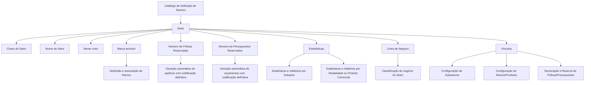

# Definição e Configuração de Setores no Sistema de Seguros

## 1. Metadados do Documento
- **Arquivo de Origem:** Não identificado
- **Tipo de Documento:** Especificação Técnica / Manual Funcional
- **Domínio / Sistema:** Catálogo de Definição de Setores para seguros
- **Público-Alvo:** Negócio, Operação, Analistas Funcionais e Configuradores do Sistema
- **Data/Versão Identificada:** Não identificada

---

## 2. Resumo Executivo & Contexto de Negócio

O documento define o conceito de **Setor** como uma chave de agrupamento ou classificação de Ramos com características técnicas semelhantes. O objetivo do catálogo de Setores é estruturar a análise dos Ramos da entidade e estudar a composição da carteira de apólices que integra cada agrupamento.

A classificação por Setores pode atender a finalidades internas e externas. Entre os usos externos explicitamente indicados está o fornecimento regular de informações estatísticas à associação ou entidade que representa localmente a indústria seguradora.

O catálogo possui propriedades gerais, destinadas à identificação e denominação do Setor, e propriedades operacionais, destinadas a controlar a associação com Ramos, a reserva automática de numeração para apólices e orçamentos, a geração de estatísticas e a classificação por linha de negócio.

O documento também aponta vínculos com diretrizes e documentos funcionais complementares: Configuração de Subsetores, Configuração de Ramos/Produtos e Numeração e Reserva de Apólices/Orçamentos. Esses materiais devem ser consultados para evitar interpretações isoladas e potencialmente incorretas da definição de Setores.

---

## 3. Arquitetura, Componentes & Tecnologias Envolvidas

O conteúdo descreve uma estrutura funcional de catálogo, sem detalhar arquitetura de software, interfaces técnicas, tecnologias, bancos de dados, APIs, ambientes, URLs ou protocolos.

Os componentes funcionais identificados são:

- **Catálogo de Definição de Setores:** repositório de configuração das propriedades de cada Setor.
- **Setor:** chave de agrupamento ou classificação de Ramos com características técnicas similares.
- **Ramos:** elementos que podem ser associados a um Setor quando a propriedade **Marca emisión** estiver ativada.
- **Subsetores:** item relacionado por meio do vínculo de configuração, sem detalhamento adicional.
- **Modalidade ou Produto Comercial:** nível alternativo para obtenção de estatísticas e relatórios quando a propriedade **Estadísticas** estiver ativada.
- **Apólices:** documentos cuja numeração automática definitiva pode ser reservada por Setor.
- **Orçamentos / Presupuestos:** documentos cuja numeração automática definitiva pode ser reservada por Setor.
- **Linha de Negócio:** classificação de negócio à qual o Setor está vinculado.
- **Associação ou entidade local da indústria seguradora:** possível destinatária de informações estatísticas regulares.



> **Nota de Análise:** O documento não descreve componentes técnicos de implementação, contratos de integração, telas, permissões, persistência de dados ou critérios de precedência entre estatísticas por Subsetor e por Modalidade ou Produto Comercial.

---

## 4. Regras de Negócio, Especificações Funcionais & Processos

### 4.1. Conceito e finalidade do Setor

1. Um **Setor** é uma chave de agrupamento ou classificação de Ramos.
2. Os Ramos agrupados em um mesmo Setor devem possuir características técnicas similares.
3. A estruturação por Setores permite analisar os Ramos da entidade de forma organizada.
4. A estruturação por Setores permite estudar a composição da carteira de apólices formada pelos Ramos associados.
5. O uso da classificação de Setores pode ser interno, externo ou ambos.

### 4.2. Propriedades gerais

1. A propriedade **Sector** identifica a chave do Setor configurado no Sistema.
2. A propriedade **Nombre** contém a denominação ou descrição do Setor.
3. O documento apresenta os seguintes exemplos de Setores:
   - Setor `1`: Automóviles.
   - Setor `2`: Vida.
   - Setor `3`: Salud.
   - Setor `4`: Generales.

### 4.3. Propriedades operacionais

1. A propriedade **Nombre corto** contém a denominação ou descrição abreviada do Setor definido.
2. Quando a propriedade **Marca emisión** estiver ativada no Catálogo de Definição:
   - a chave do Setor poderá ser utilizada;
   - a chave do Setor poderá ser associada na definição dos Ramos.
3. O atributo **Número de Pólizas Reservadas** estabelece a quantidade de apólices geradas automaticamente pelo Sistema com codificação definitiva.
4. O atributo **Número de Presupuestos Reservados** estabelece a quantidade de orçamentos gerados automaticamente pelo Sistema com codificação definitiva.
5. Quando a propriedade **Estadísticas** estiver ativada no Catálogo de Definição:
   - a obtenção de estatísticas e relatórios deverá ocorrer por Subsetor; ou
   - a obtenção de estatísticas e relatórios deverá ocorrer por Modalidade ou Produto Comercial.
6. A propriedade **Línea de Negocio** define a classificação de negócio à qual o Setor está adscrito.

### 4.4. Diretriz operacional local

A recomendação apresentada para a codificação, uso e definição do catálogo de Setores é utilizar chaves compatíveis com as normas, usos e procedimentos da associação ou entidade que representa localmente a indústria seguradora e à qual seja necessário fornecer informações estatísticas regularmente.

### 4.5. Vínculos documentais

O documento recomenda a leitura de diretrizes e documentos funcionais relacionados para evitar que a interpretação isolada da definição de Setores conduza a erro. Os vínculos citados são:

1. Configuração de Subsetores.
2. Configuração de Ramos/Produtos.
3. Numeração e Reserva de Apólices/Orçamentos.

---

## 5. Tabelas de Parâmetros, Ambientes e Estruturas de Dados

| Item / Parâmetro | Descrição / Função | Tipo / Valores / Formato | Ambiente / Observações |
| :--- | :--- | :--- | :--- |
| Sector | Identifica a chave do Setor configurado no Sistema. | Chave de Setor; formato não detalhado. | Propriedade geral do Catálogo de Definição. |
| Nombre | Contém a denominação ou descrição do Setor. | Texto; formato não detalhado. | Propriedade geral do Catálogo de Definição. |
| Nombre corto | Contém a denominação ou descrição abreviada do Setor definido. | Texto; formato não detalhado. | Propriedade operacional. |
| Marca emisión | Permite que a chave do Setor seja empregada e associada na definição dos Ramos quando ativada. | Propriedade ativada/desativada; valores técnicos não detalhados. | Catálogo de Definição de Setores. |
| Número de Pólizas Reservadas | Define o número de apólices geradas automaticamente com codificação definitiva. | Número; domínio e limites não detalhados. | Catálogo de Definição de Setores. |
| Número de Presupuestos Reservados | Define o número de orçamentos gerados automaticamente com codificação definitiva. | Número; domínio e limites não detalhados. | Catálogo de Definição de Setores. |
| Estadísticas | Define que estatísticas e relatórios devem ser obtidos por Subsetor ou por Modalidade ou Produto Comercial quando ativada. | Propriedade ativada/desativada; regra de seleção não detalhada. | Catálogo de Definição de Setores. |
| Línea de Negocio | Estabelece a classificação do negócio à qual o Setor está adscrito. | Classificação; valores não detalhados. | Propriedade operacional. |
| Vínculos | Relaciona diretrizes e documentos funcionais cuja leitura é recomendada. | Lista de referências documentais. | Deve ser consultada para evitar interpretação isolada. |
| Setor 1 | Exemplo de Setor: Automóviles. | Chave `1`; nome `Automóviles`. | Exemplo apresentado no documento. |
| Setor 2 | Exemplo de Setor: Vida. | Chave `2`; nome `Vida`. | Exemplo apresentado no documento. |
| Setor 3 | Exemplo de Setor: Salud. | Chave `3`; nome `Salud`. | Exemplo apresentado no documento. |
| Setor 4 | Exemplo de Setor: Generales. | Chave `4`; nome `Generales`. | Exemplo apresentado no documento. |

---

## 6. Bateria de Perguntas & Respostas para RAG (FAQ Sintético)

### P1: O que é um Setor no Catálogo de Definição de Setores?
**R:** Um Setor é uma chave de agrupamento ou classificação de Ramos com características técnicas similares. O Setor permite estruturar a análise dos Ramos da entidade e o estudo da composição da carteira de apólices formada pelos Ramos associados.

### P2: Qual propriedade identifica a chave de um Setor no Sistema?
**R:** A propriedade **Sector** identifica a chave do Setor configurado no Sistema. O documento não detalha o formato técnico, o tamanho ou a regra de geração dessa chave.

### P3: Para que serve a propriedade Nombre de um Setor?
**R:** A propriedade **Nombre** contém a denominação ou descrição do Setor. Os exemplos apresentados são Automóviles, Vida, Salud e Generales.

### P4: Qual é a finalidade da propriedade Nombre corto?
**R:** A propriedade **Nombre corto** contém a denominação ou descrição abreviada do Setor definido. O documento não estabelece tamanho máximo, obrigatoriedade ou padrão de abreviação.

### P5: O que acontece quando Marca emisión está ativada?
**R:** Quando **Marca emisión** está ativada no Catálogo de Definição, a chave do Setor pode ser empregada e associada na definição dos Ramos.

### P6: O que determina o Número de Pólizas Reservadas?
**R:** O atributo **Número de Pólizas Reservadas** estabelece o número de apólices que são geradas automaticamente pelo Sistema com sua codificação definitiva.

### P7: O que determina o Número de Presupuestos Reservados?
**R:** O atributo **Número de Presupuestos Reservados** estabelece o número de orçamentos que são gerados automaticamente pelo Sistema com sua codificação definitiva.

### P8: Como a propriedade Estadísticas afeta relatórios e estatísticas?
**R:** Quando a propriedade **Estadísticas** está ativada no Catálogo de Definição, a obtenção de estatísticas e relatórios deve ser realizada por Subsetor ou por Modalidade ou Produto Comercial. O documento não define como o Sistema escolhe entre essas duas alternativas.

### P9: O que é definido pela propriedade Línea de Negocio?
**R:** A propriedade **Línea de Negocio** estabelece a classificação do negócio à qual o Setor está adscrito.

### P10: Qual recomendação deve ser seguida para codificar chaves de Setores?
**R:** A recomendação é codificar as chaves de acordo com as normas, usos e procedimentos da associação ou entidade que represente localmente a indústria seguradora e que receba regularmente informações estatísticas.

### P11: Quais documentos relacionados devem ser consultados ao configurar Setores?
**R:** O documento referencia Configuração de Subsetores, Configuração de Ramos/Produtos e Numeração e Reserva de Pólizas/Presupuestos. A leitura é recomendada para evitar erros derivados de uma interpretação isolada da definição de Setores.

### P12: O documento informa quais métodos, APIs ou tecnologias implementam o Catálogo de Setores?
**R:** Não. O documento descreve propriedades funcionais do Catálogo de Definição de Setores, mas não detalha métodos HTTP, contratos JSON, banco de dados, tecnologias, ambientes ou interfaces de integração.

---

## 7. Glossário de Termos, Siglas & Conceitos-Chave

- **Setor / Sector:** chave de agrupamento ou classificação de Ramos com características técnicas similares.
- **Ramos:** elementos do domínio de seguros que podem ser analisados e, quando permitido por Marca emisión, associados a um Setor.
- **Catálogo de Definição:** catálogo no qual são configuradas as propriedades dos Setores.
- **Apólice / Póliza:** documento de seguro cuja geração automática com codificação definitiva pode ser controlada pelo atributo Número de Pólizas Reservadas.
- **Orçamento / Presupuesto:** documento cujo número pode ser gerado automaticamente com codificação definitiva por meio do atributo Número de Presupuestos Reservados.
- **Subsetor / Subsector:** nível citado para obtenção de estatísticas e relatórios; não detalhado adicionalmente.
- **Modalidade:** nível alternativo citado para obtenção de estatísticas e relatórios; não detalhado adicionalmente.
- **Produto Comercial:** nível alternativo citado para obtenção de estatísticas e relatórios; não detalhado adicionalmente.
- **Linha de Negócio / Línea de Negocio:** classificação de negócio à qual o Setor está adscrito.
- **Marca emisión:** propriedade que, quando ativada, permite usar e associar a chave do Setor na definição dos Ramos.
- **Estadísticas:** propriedade que, quando ativada, orienta a obtenção de estatísticas e relatórios por Subsetor ou por Modalidade ou Produto Comercial.

---

## 8. Notas Críticas, Riscos & Limitações

- O documento não identifica arquivo de origem, autor, data, versão, sistema proprietário ou ambiente de execução.
- O documento não apresenta arquitetura técnica, APIs, modelos de dados, mecanismos de persistência, interfaces de usuário, perfis de acesso ou trilhas de auditoria.
- Não há detalhamento sobre os critérios para determinar se estatísticas e relatórios devem ser obtidos por Subsetor ou por Modalidade ou Produto Comercial.
- Não foram definidos formatos, faixas válidas, obrigatoriedade, unicidade ou regras de manutenção para a chave **Sector**, para os nomes ou para os atributos numéricos de reserva.
- A associação entre Setores, Ramos, Subsetores, Modalidades e Produtos Comerciais é mencionada, mas os relacionamentos, cardinalidades e restrições não são especificados.
- A interpretação isolada deste documento pode gerar erro; a leitura dos documentos vinculados é explicitamente recomendada.
- **Nota de Análise:** O documento informa que a codificação deve respeitar práticas da associação ou entidade local da indústria seguradora, mas não identifica qual associação, entidade, norma ou jurisdição se aplica.

---

## 9. Conteúdo Bruto Estruturado (Referência Fiel)

```text
--- [PÁGINA 1 DE 3] ---

DEFINICIÓN de Sectores
Objetivo
Un Sector es una clave de agrupación o clasificación de Ramos con características técnicas similares
que permite realizar de una manera estructurada el análisis de los Ramos de la entidad y el estudio
de la composición de la Cartera de las pólizas que los conforman, sea este para un uso interno y/o
externo.
Propiedades Generales
Propiedades Operativas
Propiedades Generales
Sector
Esta propiedad identifica la clave del Sector que se está configurando en el Sistema.
Nombre
Esta propiedad contendrá la denominación o descripción del Sector.
SECTOR NOMBRE
1 Automóviles
 / 
 CF
Home Solutions APIs Documentation Zeus
EN


--- [PÁGINA 2 DE 3] ---

SECTOR NOMBRE
2 Vida
3 Salud
4 Generales
Propiedades Operativas
Nombre corto
Esta propiedad contiene la denominación o descripción abreviada del Sector definido.
Marca emisión
Si esta propiedad está activada en el Catálogo de Definición, el Sistema establecerá que la clave del
Sector se puede emplear y asociar en la definición de los Ramos.
Número de Pólizas Reservadas
Este Atributo del catálogo de definición de los Sectores, establece el número de pólizas que se
generan automáticamente en el sistema con su codificación definitiva.
Número de Presupuestos Reservados
Este Atributo del catálogo de definición de los Sectores, establece el número de presupuestos que se
generan automáticamente en el sistema con su codificación definitiva.
Estadísticas
Si esta propiedad está activada en el Catálogo de Definición, el Sistema establecerá que la obtención
de las estadísticas y reportes deben realizarse o bien por subsector o bien por Modalidad o Producto
Comercial.
Línea de Negocio
Esta propiedad establece la clasificación del negocio al que está adscrito el sector.
Vínculos
Relación de Directrices y Documentos funcionales cuya lectura recomendada para evitar que la
interpretación aislada del presente documento pueda conducir a error.


--- [PÁGINA 3 DE 3] ---

Configuración de Subsectores
Configuración de Ramos/Productos
Numeración y Reserva de Pólizas/Presuspuestos
Preguntas frecuentes
(1) ¿Existe alguna recomendación operativa que deba ser tomada en consideración localmente en la
codificación, uso y definición del catálogo de Sectores en el Sistema?
Lo más habitual es codificar sus claves de acuerdo con las normas, usos y procedimientos de la
Asociación o entidad que represente localmente la industria aseguradora y a la que haya que proveer
regularmente de información estadística.
```
