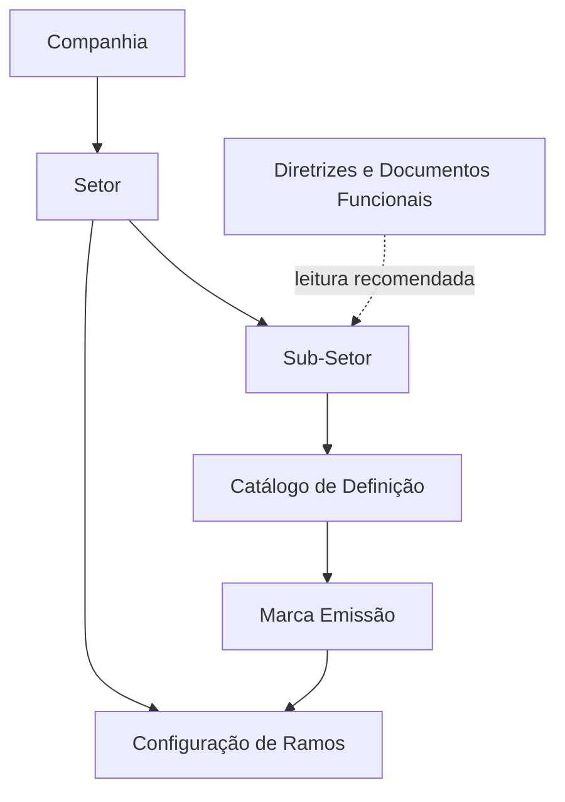

# Definição e Configuração do Catálogo de Sub-Setores de Seguros

## 1. Metadados do Documento
- **Arquivo de Origem:** Não identificado
- **Tipo de Documento:** Especificação Técnica
- **Domínio / Sistema:** Catálogo de Sub-Setores do Setor de Seguros
- **Público-Alvo:** Negócio, Analistas Funcionais e Configuração de Ramos/Produtos
- **Data/Versão Identificada:** Não identificada

---

## 2. Resumo Executivo & Contexto de Negócio

O documento define o conceito de **Sub-Setor** como uma agrupação ou classificação de Ramos que possuem características técnicas similares. Um Sub-Setor representa um subconjunto dos Ramos que integram determinado Setor de Seguros.

A configuração do catálogo de Sub-Setores é associada a uma companhia e a um Setor. Cada registro possui uma chave de Sub-Setor, uma descrição completa e uma descrição abreviada para identificação no sistema e nos catálogos configurados.

O documento apresenta o uso operacional da **Marca Emissão**. Quando essa marca está ativa no Catálogo de Definição, a chave de Sub-Setor pode ser utilizada e associada na configuração dos Ramos.

A codificação local das chaves de Sub-Setores deve, preferencialmente, seguir normas, usos e procedimentos da associação ou entidade que represente localmente a indústria seguradora, especialmente quando houver necessidade de fornecer informações estatísticas nesse nível de detalhamento.

---

## 3. Arquitetura, Componentes & Tecnologias Envolvidas

Os componentes funcionais identificados são: Companhia, Setor, Sub-Setor, Catálogo de Definição, Ramos, configuração de Ramos/Produtos, Diretrizes e Documentos Funcionais.



**Nota de Análise:** o documento descreve relações funcionais entre Companhia, Setor, Sub-Setor e Ramos, mas não detalha tecnologias, integrações, métodos HTTP, contratos de dados, ambientes ou componentes de infraestrutura.

---

## 4. Regras de Negócio, Especificações Funcionais & Processos

1. Um **Sub-Setor** é uma agrupação ou classificação de Ramos com características técnicas similares.
2. O Sub-Setor é um subconjunto dos Ramos que compõem o Setor de Seguros ao qual pertence.
3. O atributo **Companhia** contém o código da companhia para a qual o Sub-Setor está sendo definido.
4. O atributo **Setor** identifica a chave do Setor ao qual o Sub-Setor está associado e do qual depende.
5. O atributo **Sub-Setor** identifica no sistema a chave do Sub-Setor.
6. A **Descrição do Sub-Setor** contém a denominação ou descrição do Sub-Setor configurado no catálogo.
7. A **Descrição Abreviada do Sub-Setor** contém a denominação ou descrição abreviada da chave do Sub-Setor.
8. Quando a **Marca Emissão** estiver ativada no Catálogo de Definição, o sistema estabelece que a chave de Sub-Setor pode ser empregada e associada na configuração dos Ramos.
9. O documento estabelece a restrição: somente pode existir um registro com a Marca Emissão inativa.
10. A leitura de **Definição de Setores** e **Configuração de Ramos/Produtos** é recomendada para evitar interpretações isoladas ou incorretas do documento de Sub-Setores.
11. A codificação local das chaves de Sub-Setores deve normalmente seguir normas, usos e procedimentos da associação ou entidade representativa local da indústria seguradora quando for necessário fornecer informação estatística nesse nível de detalhe.

---

## 5. Tabelas de Parâmetros, Ambientes e Estruturas de Dados

| Item / Parâmetro | Descrição / Função | Tipo / Valores / Formato | Ambiente / Observações |
| :--- | :--- | :--- | :--- |
| Companhia | Código da companhia para a qual o Sub-Setor é definido. | Código de companhia; formato não detalhado. | Propriedade geral. |
| Setor | Chave do Setor ao qual o Sub-Setor está associado e do qual depende. | Chave; formato não detalhado. | Propriedade geral. |
| Sub-Setor | Chave que identifica o Sub-Setor no sistema. | Chave; formato não detalhado. | Propriedade geral. |
| Descrição do Sub-Setor | Denominação ou descrição do Sub-Setor configurado no catálogo. | Texto. | Propriedade geral. |
| Descrição Abreviada do Sub-Setor | Denominação ou descrição abreviada da chave do Sub-Setor. | Texto abreviado. | Propriedade geral. |
| Marca Emissão | Define se a chave do Sub-Setor pode ser usada e associada na configuração dos Ramos. | Ativa ou inativa. | Somente pode existir um registro com a marca inativa. |
| Sub-Setor `0001` | Accidentes. | Abreviatura: `Acc.` | Exemplo do Setor Resto Ramos No Vida. |
| Sub-Setor `0002` | Incendios. | Abreviatura: `Inc.` | Exemplo do Setor Resto Ramos No Vida. |
| Sub-Setor `0003` | Otros Daños a los Bienes. | Abreviatura: `Otros`. | Exemplo do Setor Resto Ramos No Vida. |
| Sub-Setor `0004` | Multi-riesgos. | Abreviatura: `Mult.` | Exemplo do Setor Resto Ramos No Vida. |

---

## 6. Bateria de Perguntas & Respostas para RAG (FAQ Sintético)

### P1: O que é um Sub-Setor no catálogo de seguros?
**R:** Um Sub-Setor é uma agrupação ou classificação de Ramos com características técnicas similares. O Sub-Setor constitui um subconjunto dos Ramos que compõem o Setor de Seguros ao qual está associado.

### P2: Quais propriedades gerais identificam um Sub-Setor?
**R:** As propriedades gerais apresentadas são Companhia, Setor, Sub-Setor, Descrição do Sub-Setor e Descrição Abreviada do Sub-Setor.

### P3: Qual é a função do atributo Companhia na definição de um Sub-Setor?
**R:** O atributo Companhia contém o código da companhia para a qual o Sub-Setor está sendo definido.

### P4: Como o Sub-Setor se relaciona com o Setor?
**R:** O atributo Setor identifica a chave do Setor ao qual o Sub-Setor está associado e do qual o Sub-Setor depende.

### P5: O que ocorre quando a Marca Emissão está ativada?
**R:** Quando a Marca Emissão está ativada no Catálogo de Definição, o sistema estabelece que a chave do Sub-Setor pode ser utilizada e associada na configuração dos Ramos.

### P6: Qual restrição existe para a Marca Emissão inativa?
**R:** O documento declara que somente pode existir um registro com a Marca Emissão inativa.

### P7: Quais documentos relacionados devem ser consultados ao interpretar a definição de Sub-Setores?
**R:** A leitura de Definição de Setores e Configuração de Ramos/Produtos é recomendada para evitar que a interpretação isolada do documento de Sub-Setores conduza a erro.

### P8: Como as chaves de Sub-Setores devem ser codificadas localmente?
**R:** A prática mais habitual é codificar as chaves conforme as normas, usos e procedimentos da associação ou entidade que represente localmente a indústria seguradora, especialmente quando houver obrigação de fornecer informação estatística nesse nível de detalhe.

### P9: Quais exemplos de Sub-Setores são apresentados para Resto Ramos No Vida?
**R:** O documento apresenta `0001 Accidentes / Acc.`, `0002 Incendios / Inc.`, `0003 Otros Daños a los Bienes / Otros` e `0004 Multi-riesgos / Mult.`.

---

## 7. Glossário de Termos, Siglas & Conceitos-Chave

- **Sub-Setor:** Agrupação ou classificação de Ramos com características técnicas similares.
- **Setor:** Entidade identificada por uma chave, à qual o Sub-Setor está associado e da qual depende.
- **Ramos:** Elementos que podem ser associados a uma chave de Sub-Setor quando a Marca Emissão está ativada.
- **Catálogo de Definição:** Catálogo no qual a Marca Emissão pode ser ativada ou inativada.
- **Marca Emissão:** Propriedade operacional que permite empregar e associar a chave do Sub-Setor na configuração dos Ramos.
- **Resto Ramos No Vida:** Setor citado como exemplo de associação de Sub-Setores.

---

## 8. Notas Críticas, Riscos & Limitações

- O documento não detalha o formato técnico das chaves, o tamanho dos campos ou mecanismos de validação de dados.
- O documento não explica a semântica operacional completa da regra que permite apenas um registro com a Marca Emissão inativa.
- Não há detalhamento de interfaces, integrações, ambientes, tecnologias, permissões ou trilhas de auditoria.
- A interpretação isolada do documento pode conduzir a erro; o próprio documento recomenda consultar Definição de Setores e Configuração de Ramos/Produtos.
- A codificação local deve considerar normas e procedimentos da entidade representativa da indústria seguradora local quando houver reporte estatístico.

---

## 9. Conteúdo Bruto Estruturado (Referência Fiel)

```text
--- [PÁGINA 1 DE 3] ---

DEFINICIÓN de Sub-Sectores
Objetivo
Un Sub-Sector es una agrupación o clasificación de Ramos con características técnicas similares
como subconjunto de la totalidad de los Ramos que conforman el Sector de Seguros al que
pertenece.
Propiedades Generales
Propiedades Operativas
Propiedades Generales
Compañía
Este atributo contiene el código de la compañía para la que se está definiendo el Sub-Sector.
Sector
Esta propiedad identifica la clave del Sector al que está asociado y del que depende el Sub-Sector.
Sub-Sector
Este atributo identifica en el sistema la clave del Sub-Sector.
Descripción del Sub-Sector
 / 
 CF
Home Solutions APIs Documentation Zeus
EN


--- [PÁGINA 2 DE 3] ---

Esta propiedad contiene la denominación o descripción del Subsector que se esté configurando en el
catálogo.
Descripción Abreviada del Sub-Sector
Esta propiedad contiene la denominación o descripción abreviada de la Clave del Sub-Sector.
A modo de ejemplo, podemos definir los siguientes Subsectores asociados al Sector Resto Ramos
No Vida:
Clave del Sub-Sector Descripción Abreviatura.
0001 Accidentes Acc.
0002 Incendios Inc.
0003 Otros Daños a los Bienes Otros
0004 Multi-riesgos Mult.
... ... ...
Propiedades Operativas
Marca Emisión
Si esta propiedad está activada en el Catálogo de Definición, el Sistema establecerá que la clave del
Sub-Sector se puede emplear y asociar en la configuración de los Ramos.
NOTA: Solamente puede existir un registro con esta marca inactiva.
Vínculos
Relación de Directrices y Documentos funcionales cuya lectura recomendada para evitar que la
interpretación aislada del presente documento pueda conducir a error.
Definición de Sectores
Configuración de Ramos/Productos
Preguntas frecuentes


--- [PÁGINA 3 DE 3] ---

(1) ¿Existe alguna recomendación que deba ser contemplada localmente en la codificación, uso y
definición del catálogo de Sub-sectores en el Sistema?
Lo más habitual es codificar sus claves de acuerdo con las normas, usos y procedimientos de la
Asociación o entidad que represente localmente la industria aseguradora y a la que haya que proveer
regularmente de información estadística con este nivel de detalle.
```
