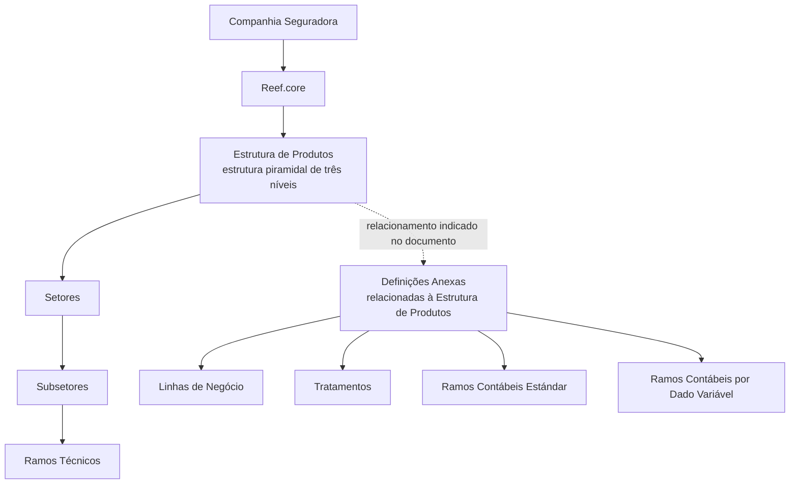

# Relatório de Ingestão de Documento para RAG

**Arquivo de origem:** `01-TRON_01-Doc_01-Mod_01-Comunes_01-Def_04-Estructura-Producto_Def-Estructura-Productos.pdf`
**Data de processamento:** 21/09/2026 09:02:19
**Modelo de interpretação:** gpt-5.6-terra (axet-code)
**Prompt utilizado:** [analise_documento_rag.md](file:///Users/gcostabe/dev/AGENTE-CONTEXT-GEN/prompts/analise_documento_rag.md)

---

# Estrutura de Produtos das Companhias no Reef.core

## 1. Metadados do Documento
- **Arquivo de Origem:** `Não identificado`
- **Tipo de Documento:** `Apresentação Executiva`
- **Domínio / Sistema:** `Reef.core — Estrutura de Produtos de Companhias Seguradoras`
- **Público-Alvo:** `Negócio, configuração de produtos, operação e equipes técnicas`
- **Data/Versão Identificada:** `Não identificada`

---

## 2. Resumo Executivo & Contexto de Negócio

O documento descreve a definição da estrutura de produtos de companhias seguradoras no sistema Reef.core. A classificação de riscos em uma estrutura de produtos é apresentada como instrumento fundamental para estabelecer a homogeneidade qualitativa dos riscos.

Segundo o conteúdo, as entidades seguradoras possuem uma Estrutura Técnica de Produtos. Essa estrutura é entendida como o conjunto de modalidades de seguro relativas a riscos com características ou natureza semelhantes, além da relação sistemática e ordenada usada para descrever e classificar os produtos e serviços oferecidos por uma companhia a clientes ou potenciais clientes.

O Reef.core permite codificar e classificar a estrutura de produtos de cada companhia por meio de uma estrutura piramidal de três níveis. O material indica a existência de catálogos que compõem a Estrutura de Produtos por companhia e de catálogos anexos relacionados à estrutura, ainda que não façam parte dela.

Os elementos apresentados incluem setores, subsetores e ramos técnicos, além de definições anexas como linhas de negócio, tratamentos, ramos contábeis padrão e ramos contábeis por dado variável. O documento também informa que a obrigatoriedade de definição de elementos é indicada por asteriscos nos cartões.

---

## 3. Arquitetura, Componentes & Tecnologias Envolvidas

O único sistema explicitamente citado é o **Reef.core**, responsável por codificar e classificar a estrutura de produtos de cada companhia. A estrutura é descrita como piramidal e organizada em três níveis, mas o documento não detalha explicitamente quais elementos ocupam cada nível nem apresenta contratos técnicos, APIs, bancos de dados, métodos HTTP, integrações ou ambientes.

Os componentes funcionais identificados são:

- Estrutura Técnica de Produtos.
- Catálogos da Estrutura de Produtos por companhia.
- Setores.
- Subsetores.
- Ramos Técnicos.
- Catálogos anexos relacionados à Estrutura de Produtos.
- Linhas de Negócio.
- Tratamentos.
- Ramos Contábeis Padrão.
- Ramos Contábeis por Dado Variável.
- Referências para documentação e vídeo associadas aos cartões.



> **Nota de Análise:** O documento menciona uma estrutura piramidal de três níveis, mas não especifica de forma textual a composição completa desses níveis, as regras de cardinalidade entre os elementos ou os mecanismos técnicos de persistência e integração.

---

## 4. Regras de Negócio, Especificações Funcionais & Processos

1. A classificação de riscos em uma estrutura de produtos deve estabelecer a homogeneidade qualitativa dos riscos.
2. A Estrutura Técnica de Produtos deve agrupar modalidades de seguro relativas a riscos de características ou natureza semelhantes.
3. A Estrutura Técnica de Produtos deve fornecer uma relação sistemática e ordenada para descrever e classificar produtos e serviços oferecidos a clientes ou candidatos a clientes.
4. O Reef.core deve possibilitar a codificação e a classificação da estrutura de produtos de cada companhia.
5. A estrutura de produtos configurada no Reef.core possui caráter piramidal e três níveis.
6. Existem catálogos que conformam a Estrutura de Produtos por companhia.
7. Os setores representam a definição dos setores de produtos da companhia, com exemplos apresentados como `VIDA` e `DAÑOS`.
8. Os subsetores representam a definição de subsetores de produtos para cada setor.
9. Os ramos técnicos representam a definição dos ramos técnicos por companhia.
10. Existem definições anexas à Estrutura de Produtos das Companhias. Esses catálogos não pertencem à estrutura propriamente dita, mas estão relacionados a ela.
11. As linhas de negócio são associadas aos setores da companhia.
12. Os tratamentos são empregados nos ramos técnicos.
13. Os ramos contábeis padrão são associados às coberturas.
14. Os ramos contábeis por dado variável são apresentados como uma definição anexa, sem detalhamento adicional de sua regra de associação.
15. Asteriscos nos cartões indicam a obrigatoriedade da definição do elemento correspondente.
16. Os cartões citados possuem acesso à documentação e ao vídeo, mas o documento não informa URLs, conteúdo, critérios de acesso ou responsáveis por esses materiais.

---

## 5. Tabelas de Parâmetros, Ambientes e Estruturas de Dados

| Item / Parâmetro | Descrição / Função | Tipo / Valores / Formato | Ambiente / Observações |
| :--- | :--- | :--- | :--- |
| Reef.core | Sistema com capacidade de codificar e classificar a estrutura de produtos de cada companhia. | Sistema / plataforma citada no documento. | Não há ambiente, versão ou URL identificados. |
| Estrutura de Produtos | Estrutura usada para classificar produtos e serviços de uma companhia seguradora. | Estrutura piramidal de três níveis. | A composição detalhada dos três níveis não é explicitada. |
| Estrutura Técnica de Produtos | Conjunto de modalidades de seguro relativas a riscos de características ou natureza semelhantes, organizado de forma sistemática e ordenada. | Estrutura de classificação. | Aplicável a entidades seguradoras. |
| Catálogos da Estrutura de Produtos | Catálogos localizados no nível da Estrutura de Produtos por companhia. | Catálogos. | O documento não lista campos ou formatos dos catálogos. |
| Setores | Definição de setores de produtos da companhia. | Exemplos: `VIDA`, `DAÑOS`, `...`. | O texto informa cartões com documentação e vídeo. |
| Subsetores | Definição de subsetores de produtos por setor. | Classificação por setor. | Não são fornecidos exemplos nem regras de associação adicionais. |
| Ramos Técnicos | Definição dos ramos técnicos por companhia. | Classificação por companhia. | Tratamentos são empregados nos ramos técnicos. |
| Definições Anexas | Catálogos relacionados à Estrutura de Produtos, embora não pertençam a ela. | Conjunto de catálogos relacionados. | O documento não detalha a implementação desse relacionamento. |
| Linhas de Negócio | Definição das linhas de negócio associadas aos setores da companhia. | Associação com setores. | Sem valores ou campos informados. |
| Tratamentos | Definição dos tratamentos empregados nos ramos técnicos. | Associação com ramos técnicos. | Sem valores, regras ou tipos informados. |
| Ramos Contábeis Estándar | Definição de ramos contábeis padrão associados às coberturas. | Associação com coberturas. | O documento usa a denominação `Estándar`. |
| Ramos Contábeis por Dado Variável | Definição anexa relacionada à estrutura de produtos. | Dado variável. | Não há detalhamento adicional sobre regras ou campos. |
| Asteriscos dos cartões | Indicador de obrigatoriedade de definição de um elemento. | Indicador visual. | O documento não especifica quais cartões são obrigatórios. |
| Documentação / vídeo | Recursos acessíveis a partir dos cartões. | Referências informativas. | URLs, permissões e conteúdo não identificados. |

---

## 6. Bateria de Perguntas & Respostas para RAG (FAQ Sintético)

### P1: Qual é o objetivo da classificação de riscos na Estrutura de Produtos?
**R:** A classificação de riscos na Estrutura de Produtos tem como objetivo estabelecer a homogeneidade qualitativa dos riscos, conforme indicado no documento.

### P2: O que é uma Estrutura Técnica de Produtos para uma entidade seguradora?
**R:** A Estrutura Técnica de Produtos é o conjunto de modalidades de seguro relativas a riscos de características ou natureza semelhantes. Também representa uma relação sistemática e ordenada usada para descrever e classificar os produtos e serviços que uma companhia oferece a clientes ou candidatos a clientes.

### P3: Qual funcionalidade o Reef.core oferece para as companhias?
**R:** O Reef.core oferece a possibilidade de codificar e classificar a estrutura de produtos de cada companhia, configurando uma estrutura piramidal de três níveis.

### P4: Quantos níveis possui a estrutura de produtos configurável no Reef.core?
**R:** O documento informa que o Reef.core configura uma estrutura piramidal de três níveis. O conteúdo não detalha textualmente a composição completa de cada nível.

### P5: O que são setores na Estrutura de Produtos?
**R:** Setores são definições dos setores de produtos de uma companhia. O documento apresenta `VIDA` e `DAÑOS` como exemplos de setores.

### P6: Como os subsetores se relacionam com os setores?
**R:** Os subsetores correspondem à definição de subsetores de produtos por cada setor. O documento não apresenta critérios adicionais, exemplos de subsetores ou regras de cardinalidade.

### P7: O que são ramos técnicos no contexto apresentado?
**R:** Ramos técnicos são definidos por companhia. O documento também informa que os tratamentos são empregados nos ramos técnicos.

### P8: O que são as definições anexas à Estrutura de Produtos?
**R:** As definições anexas são catálogos relacionados à Estrutura de Produtos das Companhias, embora não pertençam diretamente a essa estrutura.

### P9: Como as linhas de negócio são relacionadas na estrutura?
**R:** As linhas de negócio são definidas como associadas aos setores da companhia.

### P10: Com o que os ramos contábeis padrão são associados?
**R:** Os ramos contábeis padrão são associados às coberturas, conforme a definição apresentada no documento.

### P11: O que indica um asterisco nos cartões da apresentação?
**R:** Os asteriscos dos cartões mostram a obrigatoriedade da definição do elemento correspondente.

### P12: O documento detalha métodos HTTP, contratos JSON ou APIs do Reef.core?
**R:** Não. O documento menciona o Reef.core e referências a documentação e vídeo, mas não detalha métodos HTTP, contratos JSON, endpoints, APIs, tecnologias de integração ou URLs.

---

## 7. Glossário de Termos, Siglas & Conceitos-Chave

- **Reef.core:** Sistema citado como capaz de codificar e classificar a estrutura de produtos de cada companhia.
- **Estrutura de Produtos:** Organização sistemática usada para descrever e classificar produtos e serviços de uma companhia.
- **Estrutura Técnica de Produtos:** Conjunto de modalidades de seguro relativas a riscos de características ou natureza semelhantes, organizado de forma sistemática e ordenada.
- **Setores:** Setores de produtos de uma companhia, com exemplos apresentados como `VIDA` e `DAÑOS`.
- **Subsetores:** Subdivisões de produtos definidas para cada setor.
- **Ramos Técnicos:** Ramos técnicos definidos por companhia.
- **Linhas de Negócio:** Linhas de negócio associadas aos setores da companhia.
- **Tratamentos:** Tratamentos empregados nos ramos técnicos.
- **Ramos Contábeis Estándar:** Ramos contábeis padrão associados às coberturas.
- **Ramos Contábeis por Dado Variável:** Categoria de ramo contábil apresentada nas definições anexas, sem detalhamento complementar.
- **Coberturas:** Elementos aos quais os ramos contábeis padrão são associados.
- **Entidades Aseguradoras:** Entidades seguradoras que possuem uma Estrutura Técnica de Produtos.

---

## 8. Notas Críticas, Riscos & Limitações

- O nome do arquivo de origem, data, versão, autor e classificação formal do documento não foram identificados no conteúdo fornecido.
- O material declara uma estrutura piramidal de três níveis, mas não apresenta explicitamente os elementos de cada nível nem suas relações de hierarquia completas.
- Não há especificação de campos, identificadores, formatos, regras de validação, obrigatoriedade individual ou modelo de dados para setores, subsetores, ramos técnicos e catálogos anexos.
- Não foram informados endpoints, métodos HTTP, contratos JSON, protocolos, tecnologias de integração, bancos de dados, ambientes, servidores, portas, URLs ou caminhos de logs.
- O documento cita acesso à documentação e a vídeos para diversos cartões, mas não contém os respectivos links ou o conteúdo desses recursos.
- Os asteriscos indicam obrigatoriedade da definição dos elementos, porém o texto extraído não permite identificar quais cartões específicos exibem a marcação.
- A definição de Ramos Contábeis por Dado Variável é citada, mas não recebe explicação adicional no conteúdo disponível.

---

## 9. Conteúdo Bruto Estruturado (Referência Fiel)

```text
--- [PÁGINA 1 DE 3] ---

DEFINICIÓN de la ESTRUCTURA de
PRODUCTOS
Contexto
La clasificación de los riesgos en una estructura de productos es un instrumento fundamental para
establecer la homogeneidad cualitativa de los mismos.
Por ello, todas las Entidades Aseguradoras cuentan con una Estructura Técnica de sus Productos,
entendiendo como tal al conjunto de modalidades de seguro relativas a riesgos de características o
naturaleza semejantes además de la relación sistemática y ordenada en la que se describen y
clasifican los productos y servicios que una compañía ofrece a sus clientes o candidatos a clientes
Reef.core cuenta con la posibilidad de codificar
y clasificar la estructura de Productos de cada
compañía configurando una estructura
piramidal de tres niveles.
En este nivel se localizan los catálogos que conforman la Estructura de
Productos por cada compañía.
 / 
 CF
Home Solutions APIs Documentation Zeus
EN


--- [PÁGINA 2 DE 3] ---

Los Asteriscos de las Tarjetas muestran la obligatoriedad de la definición del elemento.
[SECTORES] 
Definición de los Sectores de Productos de la
compañía: VIDA, DAÑOS, ...
 accede a la documentación
 accede al vídeo
[SUBSECTORES] 
Definición de los Subsectores de Productos
por cada Sector.
 accede a la documentación
 accede al vídeo
[RAMOS TÉCNICOS] 
Definición de los Ramos Técnicos por
Compañía.
 accede a la documentación
 accede al vídeo
DEFINICIONES ANEXAS a la Estructura de
Productos de las Compañías.
En este nivel se localizan los catálogos Anexos a la Estructura de
Productos que aun no perteneciendo a esta están relacionados con ella.
[LÍNEAS DE NEGOCIO]
Definición de las Líneas de Negocio
asociadas a los Sectores de la compañía.
 accede a la documentación
 accede al vídeo
[TRATAMIENTOS] 
Definición de los Tratamientos empleados en
los Ramos Técnicos.
 accede a la documentación
 accede al vídeo
[RAMOS CONTABLES ESTÁNDAR] 
Definición de los Ramos Contables estándar
asociados a las coberturas.
 accede a la documentación
 accede al vídeo
[RAMOS CONTABLES por DATO
VARIABLE]
Definición de los Ramos Contables por Dato
Variable.


--- [PÁGINA 3 DE 3] ---

accede a la documentación
 accede al vídeo
```

---

## Conteúdo Bruto Extraído (Original Completo)

```text
--- [PÁGINA 1 DE 3] ---

DEFINICIÓN de la ESTRUCTURA de
PRODUCTOS
Contexto
La clasificación de los riesgos en una estructura de productos es un instrumento fundamental para
establecer la homogeneidad cualitativa de los mismos.
Por ello, todas las Entidades Aseguradoras cuentan con una Estructura Técnica de sus Productos,
entendiendo como tal al conjunto de modalidades de seguro relativas a riesgos de características o
naturaleza semejantes además de la relación sistemática y ordenada en la que se describen y
clasifican los productos y servicios que una compañía ofrece a sus clientes o candidatos a clientes
Reef.core cuenta con la posibilidad de codificar
y clasificar la estructura de Productos de cada
compañía configurando una estructura
piramidal de tres niveles.
En este nivel se localizan los catálogos que conforman la Estructura de
Productos por cada compañía.
 / 
 CF
Home Solutions APIs Documentation Zeus
EN


--- [PÁGINA 2 DE 3] ---

Los Asteriscos de las Tarjetas muestran la obligatoriedad de la definición del elemento.
[SECTORES] 
Definición de los Sectores de Productos de la
compañía: VIDA, DAÑOS, ...
 accede a la documentación
 accede al vídeo
[SUBSECTORES] 
Definición de los Subsectores de Productos
por cada Sector.
 accede a la documentación
 accede al vídeo
[RAMOS TÉCNICOS] 
Definición de los Ramos Técnicos por
Compañía.
 accede a la documentación
 accede al vídeo
DEFINICIONES ANEXAS a la Estructura de
Productos de las Compañías.
En este nivel se localizan los catálogos Anexos a la Estructura de
Productos que aun no perteneciendo a esta están relacionados con ella.
[LÍNEAS DE NEGOCIO]
Definición de las Líneas de Negocio
asociadas a los Sectores de la compañía.
 accede a la documentación
 accede al vídeo
[TRATAMIENTOS] 
Definición de los Tratamientos empleados en
los Ramos Técnicos.
 accede a la documentación
 accede al vídeo
[RAMOS CONTABLES ESTÁNDAR] 
Definición de los Ramos Contables estándar
asociados a las coberturas.
 accede a la documentación
 accede al vídeo
[RAMOS CONTABLES por DATO
VARIABLE]
Definición de los Ramos Contables por Dato
Variable.


--- [PÁGINA 3 DE 3] ---

accede a la documentación
 accede al vídeo
```
