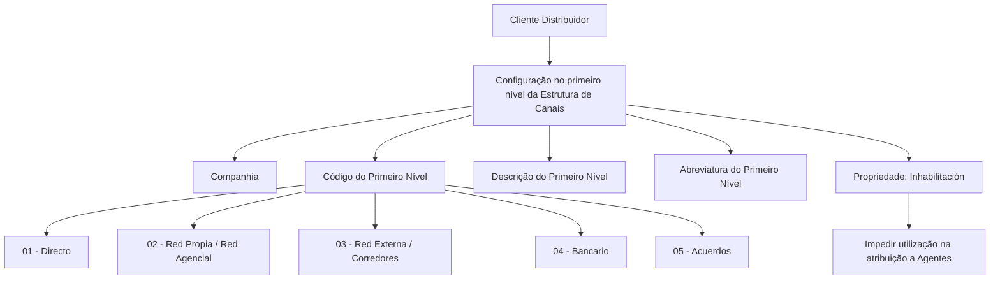

# Definição do Primeiro Nível da Estrutura de Canais — Clientes Distribuidores MAPFRE

## 1. Metadados do Documento
- **Arquivo de Origem:** Não identificado no conteúdo fornecido
- **Tipo de Documento:** Especificação Técnica
- **Domínio / Sistema:** Estrutura de Canais e Clientes Distribuidores MAPFRE
- **Público-Alvo:** Não identificado explicitamente; conteúdo aplicável à configuração de clientes distribuidores no sistema
- **Data/Versão Identificada:** Não identificada

---

## 2. Resumo Executivo & Contexto de Negócio

O documento define o primeiro nível da Estrutura de Canais para a classificação corporativa de Clientes Distribuidores. Um Cliente Distribuidor é uma pessoa ou entidade jurídica que distribui, ou pode distribuir, produtos seguradores, financeiros ou serviços para a MAPFRE ou para entidades concorrentes.

A classificação corporativa estabelece cinco tipos de Clientes Distribuidores: Direto, Red Propia/Red Agencial, Red Externa/Corredores, Bancario e Acuerdos. Cada tipo possui uma caracterização de negócio relacionada ao modelo de distribuição, exclusividade com a MAPFRE, atividade de venda de seguros, relacionamento bancário ou acordo comercial para acesso ao cliente final.

O objetivo funcional é configurar Clientes Distribuidores de acordo com essa classificação corporativa no primeiro nível da Estrutura de Canais. A configuração exige informar companhia, código do primeiro nível, descrição e abreviatura.

A codificação desse nível é corporativamente predefinida e não pode ser alterada localmente. O documento também apresenta uma propriedade de inabilitação, usada para impedir que determinado tipo de Cliente Distribuidor seja utilizado na atribuição a Agentes.

---

## 3. Arquitetura, Componentes & Tecnologias Envolvidas

O conteúdo não descreve uma arquitetura técnica de software, tecnologias, APIs, microsserviços, bancos de dados, protocolos ou ambientes. O documento apresenta uma estrutura funcional e corporativa de classificação de canais.

Componentes e conceitos identificados:

| Componente / Conceito | Descrição |
| :--- | :--- |
| MAPFRE | Organização para a qual os produtos seguradores, financeiros ou serviços podem ser distribuídos. |
| Cliente Distribuidor | Pessoa ou entidade jurídica que distribui ou pode distribuir produtos e serviços para a MAPFRE ou para entidades concorrentes. |
| Estrutura de Canais | Estrutura corporativa na qual é configurado o primeiro nível de classificação dos Clientes Distribuidores. |
| Primeiro Nível da Estrutura de Canais | Nível corporativo de classificação composto por cinco chaves predefinidas. |
| Companhia | Código da companhia para a qual o Cliente Distribuidor está sendo definido no sistema. |
| Agentes | Entidades às quais um Tipo de Cliente Distribuidor pode ser atribuído, exceto quando a propriedade de inabilitação estiver ativa. |
| Diretrizes e Documentos Funcionais | Documentação relacionada cuja leitura é recomendada para evitar interpretação isolada incorreta. |
| Perguntas frequentes | Material relacionado citado pelo documento. |



**Nota de Análise:** O documento não detalha tecnologias, métodos HTTP, contratos JSON, endpoints, persistência de dados, controles de acesso ou fluxos de integração entre sistemas.

---

## 4. Regras de Negócio, Especificações Funcionais & Processos

### 4.1. Definição de Cliente Distribuidor

Um Cliente Distribuidor é uma pessoa ou entidade jurídica que distribui, ou pode distribuir:

- Produtos seguradores;
- Produtos financeiros;
- Serviços;
- Produtos ou serviços para a MAPFRE;
- Produtos ou serviços para alguma entidade concorrente.

### 4.2. Objetivo de Configuração

O sistema deve configurar os Clientes Distribuidores de acordo com a Classificação Corporativa definida para o primeiro nível da Estrutura de Canais.

### 4.3. Classificação Corporativa de Clientes Distribuidores

#### Directo

O tipo **Directo** corresponde a pessoas, normalmente empregados, ou meios de distribuição que realizam vendas para a MAPFRE sem receber uma retribuição variável direta em troca.

#### Red Propia / Red Agencial

O tipo **Red Propia/Red Agencial** corresponde a pessoas ou organizações que:

- Dedicam-se à venda de seguros como atividade principal ou complementar;
- Distribuem produtos exclusivamente para a MAPFRE.

#### Red Externa / Corredores

O tipo **Red Externa/Corredores** corresponde a indivíduos ou organizações que:

- Dedicam-se à venda de seguros como atividade principal ou complementar;
- Distribuem produtos para várias companhias de seguros.

#### Bancario

O tipo **Bancario** inclui:

- Entidades bancárias;
- Cooperativas de crédito ao consumo;
- Produção proveniente de operações societárias com sócios bancários;
- Qualquer outra pessoa ou organização que desenvolva atividade comercial no ambiente de escritórios bancários;
- Qualquer outra pessoa ou organização que desenvolva atividade comercial nos sistemas de distribuição dessas entidades.

#### Acuerdos

O tipo **Acuerdos** corresponde a acordos de distribuição com organizações cuja atividade econômica principal não é a venda de seguros e que cobram uma comissão para acessar o cliente final por meio de:

- Sua estrutura de distribuição; ou
- Cessão da exploração da carteira à MAPFRE.

### 4.4. Propriedades Gerais

A configuração do primeiro nível da Estrutura de Canais inclui as seguintes propriedades:

1. **Compañía:** contém o código da companhia para a qual o Cliente Distribuidor está sendo definido no sistema.
2. **Código del Primer Nivel:** identifica a chave que identificará o primeiro nível da Estrutura de Canais no sistema.
3. **Descripción del Primer Nivel:** contém a denominação ou descrição da chave do primeiro nível da Estrutura de Canais.
4. **Abreviatura del Primer Nivel:** contém a denominação ou descrição da chave do primeiro nível da Estrutura de Canais em formato abreviado.

### 4.5. Regra de Codificação Corporativa

A codificação preestabelecida para o primeiro nível da Estrutura de Canais não pode ser alterada no sistema.

Essa restrição aplica-se localmente à codificação, ao uso e à definição do catálogo de Clientes Distribuidores para esse nível da Estrutura de Canais.

### 4.6. Inabilitação

A propriedade **Inhabilitación** determina que um Tipo de Cliente Distribuidor esteja inabilitado para uso na atribuição a Agentes.

### 4.7. Documentação Relacionada

O documento recomenda a leitura de Diretrizes e Documentos Funcionais relacionados para evitar que uma interpretação isolada deste documento leve a erro. Os materiais relacionados citados são:

- Estrutura de Canais;
- Perguntas frequentes.

---

## 5. Tabelas de Parâmetros, Ambientes e Estruturas de Dados

### 5.1. Propriedades Gerais do Primeiro Nível

| Item / Parâmetro | Descrição / Função | Tipo / Valores / Formato | Ambiente / Observações |
| :--- | :--- | :--- | :--- |
| Compañía | Contém o código da companhia para a qual o Cliente Distribuidor é definido no sistema. | Código de companhia; formato não detalhado. | Aplicável à definição do Cliente Distribuidor. |
| Código del Primer Nivel | Identifica a chave do primeiro nível da Estrutura de Canais no sistema. | Chaves corporativas predefinidas: `01`, `02`, `03`, `04`, `05`. | A codificação não pode ser alterada. |
| Descripción del Primer Nivel | Contém a denominação ou descrição da chave do primeiro nível da Estrutura de Canais. | Texto. | Associada ao código corporativo do primeiro nível. |
| Abreviatura del Primer Nivel | Contém a denominação ou descrição abreviada da chave do primeiro nível da Estrutura de Canais. | Texto abreviado. | Associada ao código corporativo do primeiro nível. |
| Inhabilitación | Estabelece que o Tipo de Cliente Distribuidor está inabilitado para utilização na atribuição a Agentes. | Propriedade de habilitação/inabilitação; valores não detalhados. | Afeta a atribuição a Agentes. |

### 5.2. Catálogo Corporativo do Primeiro Nível da Estrutura de Canais

| Item / Parâmetro | Descrição / Função | Tipo / Valores / Formato | Ambiente / Observações |
| :--- | :--- | :--- | :--- |
| `01` | Directo: pessoas, normalmente empregados, ou meios de distribuição que vendem para a MAPFRE sem retribuição variável direta. | Descrição: `Directo`; abreviatura: `Dir.r`. | Código corporativo predefinido e não alterável. |
| `02` | Red Propia/Red Agencial: pessoas ou organizações que vendem seguros como atividade principal ou complementar e distribuem exclusivamente para a MAPFRE. | Descrição: `Red Propia - Agencial`; abreviatura: `Prop.` | Código corporativo predefinido e não alterável. |
| `03` | Red Externa/Corredores: indivíduos ou organizações que vendem seguros como atividade principal ou complementar e distribuem para várias companhias. | Descrição: `Red Externa - Corredores`; abreviatura: `Ext.` | Código corporativo predefinido e não alterável. |
| `04` | Bancario: entidades bancárias, cooperativas de crédito ao consumo, produção de operações societárias com sócios bancários e demais organizações comerciais no entorno ou nos sistemas bancários. | Descrição: `Bancario`; abreviatura: `Ban.` | Código corporativo predefinido e não alterável. |
| `05` | Acuerdos: acordos de distribuição com organizações cuja atividade principal não é vender seguros e que cobram comissão para permitir acesso ao cliente final. | Descrição: `Acuerdos`; abreviatura: `Acu.` | Código corporativo predefinido e não alterável. |

### 5.3. Ambientes, Servidores, Logs e URLs

| Item / Parâmetro | Descrição / Função | Tipo / Valores / Formato | Ambiente / Observações |
| :--- | :--- | :--- | :--- |
| Ambientes | Não detalhados no conteúdo fornecido. | Não informado. | O documento não apresenta ambientes de desenvolvimento, teste ou produção. |
| Servidores | Não detalhados no conteúdo fornecido. | Não informado. | O documento não apresenta servidores. |
| URLs | Não detalhadas no conteúdo fornecido. | Não informado. | O cabeçalho contém o texto `Home Solutions APIs Documentation Zeus`, sem URL associada. |
| Logs | Não detalhados no conteúdo fornecido. | Não informado. | O documento não apresenta rotas, níveis ou variáveis de log. |

---

## 6. Bateria de Perguntas & Respostas para RAG (FAQ Sintético)

### P1: O que é um Cliente Distribuidor no contexto da Estrutura de Canais MAPFRE?
**R:** Um Cliente Distribuidor é uma pessoa ou entidade jurídica que distribui, ou pode distribuir, produtos seguradores, produtos financeiros ou serviços para a MAPFRE ou para alguma entidade concorrente.

### P2: Qual é o objetivo do primeiro nível da Estrutura de Canais?
**R:** O objetivo é configurar os Clientes Distribuidores de acordo com a Classificação Corporativa definida para o primeiro nível da Estrutura de Canais.

### P3: Quais são os cinco tipos corporativos de Clientes Distribuidores?
**R:** Os cinco tipos corporativos são: `01 Directo`, `02 Red Propia - Agencial`, `03 Red Externa - Corredores`, `04 Bancario` e `05 Acuerdos`.

### P4: Qual é a diferença entre Red Propia/Red Agencial e Red Externa/Corredores?
**R:** Red Propia/Red Agencial abrange pessoas ou organizações que vendem seguros como atividade principal ou complementar e distribuem exclusivamente para a MAPFRE. Red Externa/Corredores abrange indivíduos ou organizações com atividade de venda de seguros principal ou complementar que distribuem produtos para várias companhias de seguros.

### P5: O código do primeiro nível da Estrutura de Canais pode ser alterado localmente?
**R:** Não. O documento determina que não é possível alterar a codificação preestabelecida no sistema para esse nível da Estrutura de Canais.

### P6: Quais propriedades devem ser configuradas para o primeiro nível da Estrutura de Canais?
**R:** As propriedades gerais são Compañía, Código del Primer Nivel, Descripción del Primer Nivel e Abreviatura del Primer Nivel. O documento também apresenta a propriedade Inhabilitación.

### P7: Para que serve a propriedade Compañía?
**R:** A propriedade Compañía contém o código da companhia para a qual o Cliente Distribuidor está sendo definido no sistema.

### P8: O que ocorre quando a propriedade Inhabilitación é aplicada a um Tipo de Cliente Distribuidor?
**R:** A propriedade Inhabilitación estabelece que o Tipo de Cliente Distribuidor fica inabilitado para poder ser utilizado na atribuição a Agentes.

### P9: O que caracteriza o tipo Directo?
**R:** Directo corresponde a pessoas, normalmente empregados, ou meios de distribuição que realizam vendas para a MAPFRE sem perceber uma retribuição variável direta em troca.

### P10: Quais entidades podem ser classificadas como Bancario?
**R:** Bancario inclui entidades bancárias, cooperativas de crédito ao consumo, produção proveniente de operações societárias com sócios bancários e outras pessoas ou organizações que desenvolvam atividade comercial no ambiente de escritórios bancários ou nos sistemas de distribuição dessas entidades.

### P11: Como são caracterizados os Acuerdos?
**R:** Acuerdos são acordos de distribuição com organizações cuja principal atividade econômica não é a venda de seguros e que cobram uma comissão para acessar o cliente final, seja por sua estrutura de distribuição, seja pela cessão da exploração da carteira à MAPFRE.

### P12: Quais documentos relacionados devem ser consultados para evitar interpretação isolada incorreta?
**R:** O documento recomenda a leitura das Diretrizes e Documentos Funcionais relacionados, incluindo Estrutura de Canais e Perguntas frequentes.

---

## 7. Glossário de Termos, Siglas & Conceitos-Chave

- **MAPFRE:** Organização mencionada como destinatária da distribuição de produtos seguradores, financeiros ou serviços.
- **Cliente Distribuidor:** Pessoa ou entidade jurídica que distribui, ou pode distribuir, produtos seguradores, financeiros ou serviços para a MAPFRE ou para uma entidade concorrente.
- **Estrutura de Canais:** Estrutura corporativa que contém a classificação de Clientes Distribuidores por níveis.
- **Primeiro Nível da Estrutura de Canais:** Nível de classificação corporativa composto pelas chaves `01` a `05`.
- **Directo:** Tipo de Cliente Distribuidor formado por pessoas, normalmente empregados, ou meios de distribuição sem retribuição variável direta.
- **Red Propia / Red Agencial:** Tipo de Cliente Distribuidor formado por pessoas ou organizações que distribuem seguros exclusivamente para a MAPFRE.
- **Red Externa / Corredores:** Tipo de Cliente Distribuidor formado por indivíduos ou organizações que distribuem seguros para várias companhias.
- **Bancario:** Tipo de Cliente Distribuidor relacionado a entidades bancárias, cooperativas de crédito ao consumo, operações societárias com sócios bancários e atividade comercial em ambiente ou sistemas bancários.
- **Acuerdos:** Tipo de Cliente Distribuidor relacionado a acordos com organizações cuja atividade econômica principal não é a venda de seguros.
- **Inhabilitación:** Propriedade que impede a utilização de um Tipo de Cliente Distribuidor na atribuição a Agentes.
- **Agentes:** Entidades às quais um Tipo de Cliente Distribuidor pode ser atribuído, conforme mencionado no documento.
- **Compañía:** Atributo que contém o código da companhia para a qual o Cliente Distribuidor é definido no sistema.
- **Código del Primer Nivel:** Chave de identificação do primeiro nível da Estrutura de Canais no sistema.
- **Descripción del Primer Nivel:** Denominação ou descrição da chave do primeiro nível da Estrutura de Canais.
- **Abreviatura del Primer Nivel:** Denominação ou descrição abreviada da chave do primeiro nível da Estrutura de Canais.

---

## 8. Notas Críticas, Riscos & Limitações

- A codificação corporativa do primeiro nível da Estrutura de Canais é preestabelecida e não pode ser alterada localmente.
- A interpretação isolada do documento pode conduzir a erro; o próprio conteúdo recomenda consultar Diretrizes e Documentos Funcionais relacionados.
- O documento não detalha procedimentos operacionais para criar, atualizar, consultar ou excluir registros de Clientes Distribuidores.
- O documento não descreve formatos técnicos, obrigatoriedade, validações de preenchimento, persistência de dados, permissões, auditoria ou mensagens de erro.
- O documento não informa tecnologias, versões, integrações, APIs, contratos JSON, URLs, ambientes, servidores ou configurações de logs.
- **Nota de Análise:** O texto apresenta a propriedade `Inhabilitación`, mas não detalha seus valores possíveis, interface de configuração ou comportamento para registros já atribuídos a Agentes.
- **Nota de Análise:** As abreviaturas `Dir.r`, `Prop.`, `Ext.`, `Ban.` e `Acu.` são apresentadas como valores de catálogo; o documento não fornece expansão adicional além das descrições associadas.

---

## 9. Conteúdo Bruto Estruturado (Referência Fiel)

```text
--- [PÁGINA 1 DE 3] ---

DEFINICIÓN del Primer Nivel de la Estructura
de Canales
Contexto
Un Cliente Distribuidor es aquella persona o entidad jurídica que distribuye o puede distribuir
productos aseguradores, financieros o servicios para MAPFRE o para alguna entidad competidora.
La clasificación corporativa de clientes distribuidores se conforma con los siguientes tipos:
Directo: personas, normalmente empleados, o medios de distribución que realizan ventas para
MAPFRE sin percibir una retribución variable directa a cambio.
Red Propia/Red Agencial: personas u organizaciones que se dedican a la venta de seguros
como actividad principal o complementaria y que distribuyen en exclusividad para MAPFRE.
Red Externa/Corredores: individuos u organizaciones que se dedican a la venta de seguros
como actividad principal o complementaria y que distribuyen para varias compañías de seguros.
Bancario: entidades bancarias, cooperativas de crédito al consumo, producción proveniente de
operaciones societarias con socios bancarios y cualquier otra persona u organización que
desarrolle su actividad comercial en el entorno de oficinas bancarias o los sistemas de
distribución de estas entidades.
Acuerdos: acuerdos de distribución con organizaciones cuya principal actividad económica no
es la venta de seguros y cobran una comisión por acceder al cliente final bien a través de su
estructura de distribución, o cediendo la explotación de la cartera a MAPFRE.
 / 
 CF
Home Solutions APIs Documentation Zeus
EN


--- [PÁGINA 2 DE 3] ---

Objetivo
Configurar a los clientes distribuidores de acuerdo con la Clasificación Corporativa en el primer nivel
de la estructura de canales.
Propiedades Generales
Otras Propiedades
Propiedades Generales
Compañía
Este atributo contiene el código de la compañía para la que se está definiendo el Cliente Distribuidor
en el sistema.
Código del Primer Nivel
Este atributo identifica la clave que identificará al Primer Nivel de la estructura de canales en el
Sistema.
Descripción del Primer Nivel
Esta propiedad contiene la denominación o descripción de la clave del Primer Nivel de la estructura
de Canales.
Abreviatura del Primer Nivel
Este Atributo contiene la denominación o descripción de la clave del Primer Nivel de la estructura de
Canales en formato abreviado.


--- [PÁGINA 3 DE 3] ---

La estructura definida corporativamente es:
CLAVE DEL PRIMER NIVEL DESCRIPCIÓN ABREVIATURA
01 Directo Dir.r
02 Red Propia - Agencial Prop.
03 Red Externa - Corredores Ext.
04 Bancario Ban.
05 Acuerdos Acu.
Otras Propiedades
Inhabilitación
Esta propiedad establece que el Tipo de Cliente Distribuidor está inhabilitado para poder ser utilizado
en la asignación a los Agentes.
Vínculos
Relación de Directrices y Documentos funcionales cuya lectura recomendada para evitar que la
interpretación aislada del presente documento pueda conducir a error.
Estructura de Canales
Preguntas frecuentes
1 ¿Existe alguna premisa que deba ser tomada en consideración localmente en la codificación, uso y
definición del catálogo de Clientes Distribuidores en el Sistema?
No es posible alterar la codificación preestablecida en el sistema para este Nivel de la Estructura de
Canales.
```
