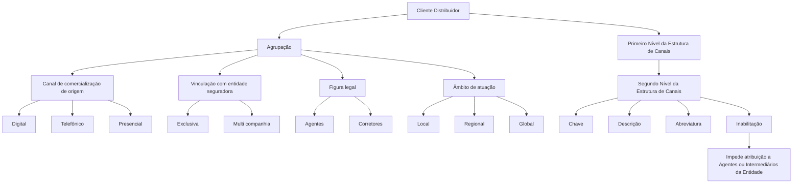

# Estrutura de Canais — Definição do Segundo Nível para Clientes Distribuidores

## 1. Metadados do Documento
- **Arquivo de Origem:** Não identificado no conteúdo fornecido
- **Tipo de Documento:** Especificação Técnica / Especificação Funcional
- **Domínio / Sistema:** Estrutura de Canais; Clientes Distribuidores; entidades MAPFRE
- **Público-Alvo:** Negócio, analistas funcionais, desenvolvedores e equipes responsáveis pela configuração de canais
- **Data/Versão Identificada:** Não identificada

---

## 2. Resumo Executivo & Contexto de Negócio

O documento define o **Segundo Nível da Estrutura de Canais** aplicável aos Clientes Distribuidores no sistema. A estrutura tem como finalidade classificar distribuidores de acordo com o canal de comercialização de origem, a vinculação com a entidade seguradora, a figura legal e o âmbito de atuação.

As agrupações permitem distinguir clientes distribuidores por canal de origem — Digital, Telefônico ou Presencial —, por vínculo com a entidade seguradora — exclusivo ou multicompañía —, pela figura legal — agentes ou corretores — e pelo alcance geográfico ou operacional — local, regional ou global.

O objetivo corporativo é configurar, no segundo nível da estrutura de canais, as principais Agrupações determinadas para reporte pelas entidades MAPFRE. A codificação deste nível é previamente estabelecida pelo sistema e não pode ser alterada localmente.

A especificação apresenta propriedades gerais para identificar companhia, primeiro nível, segundo nível, descrição e abreviatura. Também define a propriedade de inabilitação, que impede uma Agrupação de Cliente Distribuidor de ser utilizada na atribuição a Agentes ou Intermediários da Entidade.

---

## 3. Arquitetura, Componentes & Tecnologias Envolvidas

O conteúdo não descreve uma arquitetura de software, tecnologias, APIs, contratos HTTP, ambientes de execução ou integrações entre microsserviços. O artefato descreve uma **estrutura funcional e classificatória** para canais de distribuição.

Os componentes funcionais identificados são:

- **Cliente Distribuidor:** entidade classificada na Estrutura de Canais.
- **Agrupação:** classificação usada para aprofundar a tipologia de Clientes Distribuidores.
- **Primeiro Nível da Estrutura de Canais:** nível que identifica categorias como Direto, Rede Própria, Rede Externa, Bancário e Acordos.
- **Segundo Nível da Estrutura de Canais:** nível configurado com chaves, descrições e abreviaturas específicas.
- **Entidade seguradora / Entidade:** organização à qual Agentes ou Intermediários podem ser atribuídos.
- **Agentes ou Intermediários:** destinatários da atribuição de uma Agrupação de Cliente Distribuidor.
- **Estrutura de Canais:** documento funcional relacionado cuja leitura é recomendada.



**Nota de Análise:** o documento lista referências textuais como “CF”, “Home Solutions APIs Documentation” e “Zeus”, mas não detalha sua relação com a Estrutura de Canais, funcionalidades, APIs ou tecnologias. Essas referências não são tratadas como componentes arquiteturais por falta de detalhamento.

---

## 4. Regras de Negócio, Especificações Funcionais & Processos

### 4.1 Finalidade das Agrupações

As Agrupações devem permitir aprofundar a classificação dos Clientes Distribuidores, considerando simultaneamente:

1. O canal de comercialização de origem do cliente:
   - Digital;
   - Telefônico;
   - Presencial.
2. A vinculação com a entidade seguradora:
   - Exclusiva;
   - Multi companhia.
3. A figura legal:
   - Agentes;
   - Corretores.
4. O âmbito de atuação:
   - Local;
   - Regional;
   - Global.

### 4.2 Configuração corporativa do Segundo Nível

As principais Agrupações determinadas corporativamente para reporte pelas entidades MAPFRE devem ser configuradas no **Segundo Nível da Estrutura de Canais**.

### 4.3 Companhia

A propriedade **Compañía** contém o código da companhia para a qual o Cliente Distribuidor está sendo definido no sistema.

### 4.4 Código do Primeiro Nível

A propriedade **Código del Primer Nivel** identifica a chave do Primeiro Nível da Estrutura de Canais no sistema.

As categorias apresentadas para o Primeiro Nível são:

- Directo;
- Red Propia;
- Red Externa;
- Bancario;
- Acuerdos.

### 4.5 Código do Segundo Nível

A propriedade **Código del Segundo Nivel** identifica a chave do Segundo Nível da Estrutura de Canais no sistema.

### 4.6 Descrição e Abreviatura do Segundo Nível

A propriedade **Descripción del Segundo Nivel** contém a denominação ou descrição da chave do Primeiro Nível da Estrutura de Canais, conforme redação original.

A propriedade **Abreviatura del Segundo Nivel** contém a denominação ou descrição da chave do Primeiro Nível da Estrutura de Canais em formato abreviado, conforme redação original.

**Nota de Análise:** embora essas propriedades sejam denominadas “Descrição do Segundo Nível” e “Abreviatura do Segundo Nível”, a redação do documento menciona “chave do Primeiro Nível”. O documento não esclarece se essa referência é uma inconsistência editorial ou uma regra funcional intencional.

### 4.7 Regra de Codificação

Não é possível alterar a codificação minimamente preestabelecida pelo sistema para este nível da Estrutura de Canais.

Essa regra se aplica à codificação, ao uso e à definição local do catálogo de Agrupações no sistema.

### 4.8 Regra de Inabilitação

A propriedade **Inhabilitación** estabelece que a Agrupação do Cliente Distribuidor está inabilitada para utilização em sua atribuição a Agentes ou Intermediários da Entidade.

O documento não detalha:

- como uma Agrupação é marcada como inabilitada;
- se a inabilitação é reversível;
- quais validações sistêmicas são executadas;
- quais mensagens de erro são apresentadas;
- se a inabilitação afeta atribuições já existentes.

### 4.9 Dependência Documental

A leitura do documento funcional **Estructura de Canales** é recomendada para evitar que uma interpretação isolada deste documento conduza a erro.

---

## 5. Tabelas de Parâmetros, Ambientes e Estruturas de Dados

### 5.1 Propriedades da Estrutura de Canais

| Item / Parâmetro | Descrição / Função | Tipo / Valores / Formato | Ambiente / Observações |
| :--- | :--- | :--- | :--- |
| Compañía | Contém o código da companhia para a qual o Cliente Distribuidor está definido no sistema. | Código de companhia; formato não informado. | Não há ambiente identificado. |
| Código del Primer Nivel | Identifica a chave do Primeiro Nível da Estrutura de Canais. | Chave de categoria. | Categorias listadas: Directo, Red Propia, Red Externa, Bancario e Acuerdos. |
| Código del Segundo Nivel | Identifica a chave do Segundo Nível da Estrutura de Canais. | Chave numérica apresentada no catálogo. | A codificação é previamente estabelecida e não pode ser alterada localmente. |
| Descripción del Segundo Nivel | Contém a denominação ou descrição da chave da estrutura de canais. | Texto descritivo. | O texto original menciona “chave do Primeiro Nível”. |
| Abreviatura del Segundo Nivel | Contém a denominação ou descrição em formato abreviado. | Texto abreviado. | O texto original menciona “chave do Primeiro Nível”. |
| Inhabilitación | Estabelece que a Agrupação do Cliente Distribuidor está inabilitada para atribuição. | Estado de habilitação; valores não informados. | Impede uso na atribuição a Agentes ou Intermediários da Entidade. |

### 5.2 Categorias do Primeiro Nível da Estrutura de Canais

| Item / Parâmetro | Descrição / Função | Tipo / Valores / Formato | Ambiente / Observações |
| :--- | :--- | :--- | :--- |
| Directo | Categoria do Primeiro Nível da Estrutura de Canais. | Valor textual. | Sem detalhamento adicional. |
| Red Propia | Categoria do Primeiro Nível da Estrutura de Canais. | Valor textual. | Sem detalhamento adicional. |
| Red Externa | Categoria do Primeiro Nível da Estrutura de Canais. | Valor textual. | Sem detalhamento adicional. |
| Bancario | Categoria do Primeiro Nível da Estrutura de Canais. | Valor textual. | Sem detalhamento adicional. |
| Acuerdos | Categoria do Primeiro Nível da Estrutura de Canais. | Valor textual. | Sem detalhamento adicional. |

### 5.3 Catálogo de Chaves do Segundo Nível

| Item / Parâmetro | Descrição / Função | Tipo / Valores / Formato | Ambiente / Observações |
| :--- | :--- | :--- | :--- |
| 10 | Oficinas Directas | Abreviatura: OFD. | Chave do Segundo Nível. |
| 11 | Directo Grandes Cuentas | Abreviatura: DGC. | Chave do Segundo Nível. |
| 12 | Directo Digital | Abreviatura: DD. | Chave do Segundo Nível. |
| 13 | Directo Telefónico | Abreviatura: DT. | Chave do Segundo Nível. |
| 24 | Delegados | Abreviatura: DEL. | Chave do Segundo Nível. |
| 25 | Agentes Exclusivos | Abreviatura: AG.EX. | Chave do Segundo Nível. |
| 36 | Agentes Vinculados | Abreviatura: AG.V. | Chave do Segundo Nível. |
| 37 | Agentes No Vinculados | Abreviatura: AGNV. | Chave do Segundo Nível. |
| 38 | Corredores Locales | Abreviatura: CORL. | Chave do Segundo Nível. |
| 39 | Corredores Globales | Abreviatura: CORG. | Chave do Segundo Nível. |
| 410 | Bancario | Abreviatura: BANC. | Chave do Segundo Nível. |
| 511 | Acuerdos | Abreviatura: ACU. | Chave do Segundo Nível. |

### 5.4 Critérios de Classificação de Clientes Distribuidores

| Item / Parâmetro | Descrição / Função | Tipo / Valores / Formato | Ambiente / Observações |
| :--- | :--- | :--- | :--- |
| Canal de comercialização de origem | Identifica o canal de origem do Cliente Distribuidor. | Digital; Telefónico; Presencial. | Critério utilizado pelas Agrupações. |
| Vinculação com entidade seguradora | Identifica a relação do Cliente Distribuidor com a entidade seguradora. | Exclusiva; Multi compañía. | Critério utilizado pelas Agrupações. |
| Figura legal | Identifica a natureza legal do Cliente Distribuidor. | Agentes; Corredores. | Critério utilizado pelas Agrupações. |
| Âmbito de atuação | Identifica o alcance de atuação do Cliente Distribuidor. | Locales; Regionales; Globales. | Critério utilizado pelas Agrupações. |

---

## 6. Bateria de Perguntas & Respostas para RAG (FAQ Sintético)

### P1: Qual é o objetivo do Segundo Nível da Estrutura de Canais?
**R:** O Segundo Nível da Estrutura de Canais deve configurar as principais Agrupações determinadas corporativamente para reporte pelas entidades MAPFRE. Essas Agrupações servem para classificar Clientes Distribuidores conforme canal de comercialização, vínculo com entidade seguradora, figura legal e âmbito de atuação.

### P2: Quais critérios podem ser utilizados para classificar um Cliente Distribuidor?
**R:** As Agrupações podem classificar Clientes Distribuidores pelo canal de comercialização de origem — Digital, Telefónico ou Presencial —, pela vinculação com a entidade seguradora — exclusiva ou multi companhia —, pela figura legal — agentes ou corretores — e pelo âmbito de atuação — local, regional ou global.

### P3: A codificação das Agrupações do Segundo Nível pode ser alterada localmente?
**R:** Não. O documento determina que não é possível alterar a codificação minimamente preestabelecida pelo sistema para este nível da Estrutura de Canais. A restrição é aplicável à codificação, ao uso e à definição local do catálogo de Agrupações.

### P4: Quais são as categorias listadas para o Primeiro Nível da Estrutura de Canais?
**R:** As categorias listadas para o Primeiro Nível são Directo, Red Propia, Red Externa, Bancario e Acuerdos. O documento não apresenta chaves numéricas, regras de associação ou descrições adicionais para essas categorias.

### P5: O que representa a chave 12 no Segundo Nível da Estrutura de Canais?
**R:** A chave 12 representa a Agrupação “Directo Digital”, cuja abreviatura é “DD.”. O documento não informa regras adicionais de atribuição, validação ou elegibilidade para essa chave.

### P6: Qual é a diferença entre as chaves 25, 36 e 37?
**R:** A chave 25 corresponde a “Agentes Exclusivos”, abreviada como “AG.EX.”. A chave 36 corresponde a “Agentes Vinculados”, abreviada como “AG.V.”. A chave 37 corresponde a “Agentes No Vinculados”, abreviada como “AGNV.”. O documento não detalha critérios jurídicos, comerciais ou operacionais para distinguir essas categorias.

### P7: Qual chave deve ser utilizada para Corredores Locales e Corredores Globales?
**R:** A chave 38 corresponde a “Corredores Locales”, com abreviatura “CORL.”. A chave 39 corresponde a “Corredores Globales”, com abreviatura “CORG.”.

### P8: O que ocorre quando uma Agrupação de Cliente Distribuidor está inabilitada?
**R:** Quando a propriedade Inhabilitación estabelece que uma Agrupação está inabilitada, essa Agrupação não pode ser utilizada para sua atribuição a Agentes ou Intermediários da Entidade. O documento não descreve o mecanismo de configuração, reversão ou validação dessa inabilitação.

### P9: Qual é a função da propriedade Compañía?
**R:** A propriedade Compañía contém o código da companhia para a qual o Cliente Distribuidor está sendo definido no sistema. O formato técnico desse código não é apresentado no documento.

### P10: O que identifica o Código del Segundo Nivel?
**R:** O Código del Segundo Nivel identifica a chave do Segundo Nível da Estrutura de Canais no sistema. O catálogo apresentado inclui as chaves 10, 11, 12, 13, 24, 25, 36, 37, 38, 39, 410 e 511.

### P11: Como são descritas as propriedades Descripción del Segundo Nivel e Abreviatura del Segundo Nivel?
**R:** Segundo o texto original, a Descripción del Segundo Nivel contém a denominação ou descrição da chave do Primeiro Nível da Estrutura de Canais. A Abreviatura del Segundo Nivel contém essa denominação ou descrição em formato abreviado. Existe uma possível inconsistência de redação, pois os nomes das propriedades fazem referência ao Segundo Nível, enquanto a descrição menciona o Primeiro Nível.

### P12: Qual documento relacionado deve ser consultado para interpretar corretamente esta especificação?
**R:** O documento recomenda a leitura de “Estructura de Canales”. A recomendação existe para evitar que uma interpretação isolada do presente documento possa conduzir a erro.

---

## 7. Glossário de Termos, Siglas & Conceitos-Chave

- **Agrupación / Agrupação:** classificação usada para aprofundar a tipologia dos Clientes Distribuidores.
- **Cliente Distribuidor:** cliente definido no sistema e classificado pela Estrutura de Canais.
- **Estrutura de Canais:** estrutura que organiza canais e respectivos níveis de classificação.
- **Primeiro Nível:** nível da Estrutura de Canais com as categorias Directo, Red Propia, Red Externa, Bancario e Acuerdos.
- **Segundo Nível:** nível da Estrutura de Canais configurado com chaves, descrições e abreviaturas de Agrupações.
- **Entidade:** organização para a qual Agentes ou Intermediários podem receber atribuições de Agrupações.
- **MAPFRE:** referência às entidades MAPFRE; o documento não expande a sigla ou descreve a organização.
- **OFD.:** abreviatura de Oficinas Directas.
- **DGC.:** abreviatura de Directo Grandes Cuentas.
- **DD.:** abreviatura de Directo Digital.
- **DT.:** abreviatura de Directo Telefónico.
- **DEL.:** abreviatura de Delegados.
- **AG.EX.:** abreviatura de Agentes Exclusivos.
- **AG.V.:** abreviatura de Agentes Vinculados.
- **AGNV.:** abreviatura de Agentes No Vinculados.
- **CORL.:** abreviatura de Corredores Locales.
- **CORG.:** abreviatura de Corredores Globales.
- **BANC.:** abreviatura de Bancario.
- **ACU.:** abreviatura de Acuerdos.

---

## 8. Notas Críticas, Riscos & Limitações

- A codificação do Segundo Nível é preestabelecida pelo sistema e não pode ser alterada localmente. Alterações locais na codificação são explicitamente proibidas.
- O documento não descreve o relacionamento exato entre cada chave do Segundo Nível e cada categoria do Primeiro Nível.
- O documento não especifica formato, tamanho, obrigatoriedade ou validações para o código de companhia.
- Não há detalhamento sobre o formato técnico das chaves, persistência de dados, telas, APIs, contratos JSON, permissões ou mecanismos de auditoria.
- A propriedade Inhabilitación é descrita apenas quanto ao efeito de impedir atribuição a Agentes ou Intermediários. Não há detalhamento sobre fluxo de habilitação, reversão, impactos em registros existentes ou mensagens de validação.
- Existe potencial ambiguidade documental: as propriedades “Descripción del Segundo Nivel” e “Abreviatura del Segundo Nivel” são descritas como relacionadas à chave do Primeiro Nível.
- O documento recomenda a leitura de “Estructura de Canales”; portanto, a interpretação deste conteúdo isoladamente pode conduzir a erro.
- As referências “CF”, “Home Solutions APIs Documentation” e “Zeus” aparecem no conteúdo bruto sem contextualização funcional ou técnica suficiente.

---

## 9. Conteúdo Bruto Estruturado (Referência Fiel)

```text
--- [PÁGINA 1 DE 3] ---

DEFINICIÓN del Segundo Nivel de la Estructura
de Canales
Contexto
Las Agrupaciones nos permiten ahondar en la tipología de los clientes distribuidores identificando en
ellos el canal de comercialización origen del cliente (Digital, Telefónico o Presencial), su
vinculación con la entidad aseguradora (si esta es exclusiva o multi compañía), su figura legal
(agentes o corredores) así como su ámbito de actuación (locales, regionales o globales).
Objetivo
Puesto que Corporativamente se han determinado las Agrupaciones principales por las cuales se
debe informar desde las entidades MAPFRE, esta relación se debe configurar en el segundo nivel
de la estructura de canales.
Propiedades Generales
Otras Propiedades
Propiedades Generales
Compañía
Este atributo contiene el código de la compañía para la que se está definiendo el Cliente Distribuidor
en el sistema.
 / 
 CF
Home Solutions APIs Documentation Zeus
EN


--- [PÁGINA 2 DE 3] ---

Código del Primer Nivel
Este atributo identifica la clave que identificará al Primer Nivel de la estructura de canales en el
Sistema:
Directo.
Red Propia.
Red Externa.
Bancario.
Acuerdos.
Código del Segundo Nivel
Este atributo identifica la clave que identificará al Segundo Nivel de la estructura de canales en el
Sistema.
Descripción del Segundo Nivel
Esta propiedad contiene la denominación o descripción de la clave del Primer Nivel de la estructura
de Canales.
Abreviatura del Segundo Nivel
Este Atributo contiene la denominación o descripción de la clave del Primer Nivel de la estructura de
Canales en formato abreviado.
La codificación y nomenclatura de la estructura quedaría como:
Clave del Segundo Nivel Descripción Abreviatura
10 Oficinas Directas OFD.
11 Directo Grandes Cuentas DGC.
12 Directo Digital DD.
13 Directo Telefónico DT.
24 Delegados DEL.
25 Agentes Exclusivos AG.EX.


--- [PÁGINA 3 DE 3] ---

Clave del Segundo Nivel Descripción Abreviatura
36 Agentes Vinculados AG.V.
37 Agentes No Vinculados AGNV.
38 Corredores Locales CORL.
39 Corredores Globales CORG.
410 Bancario BANC.
511 Acuerdos ACU.
Otras Propiedades
Inhabilitación
Esta propiedad establece que la Agrupación del Cliente Distribuidor está inhabilitada para poder ser
utilizada en su asignación a los Agentes o Intermediarios de la Entidad.
Vínculos
Relación de Directrices y Documentos funcionales cuya lectura recomendada para evitar que la
interpretación aislada del presente documento pueda conducir a error.
Estructura de Canales
Preguntas frecuentes
1 ¿Existe alguna premisa que deba ser tomada en consideración localmente en la codificación, uso y
definición del catálogo de Agrupaciones en el Sistema?
No es posible alterar la codificación mínimamente preestablecida en el sistema para este Nivel de la
Estructura de Canales.
```
