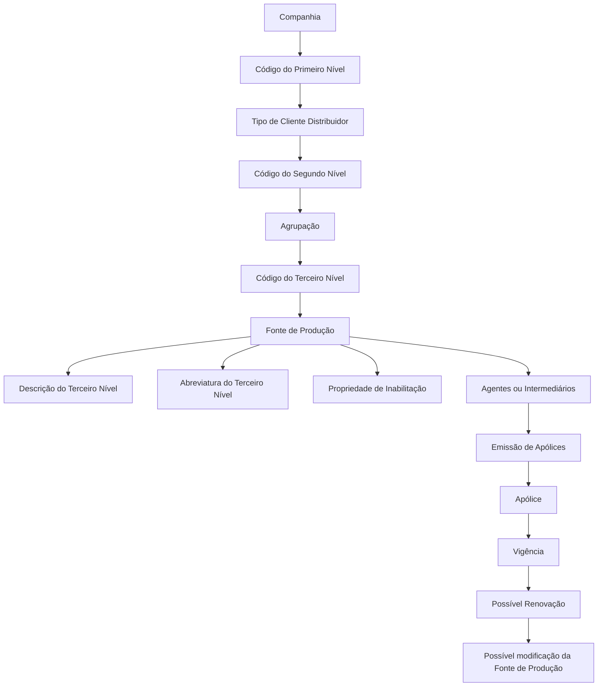
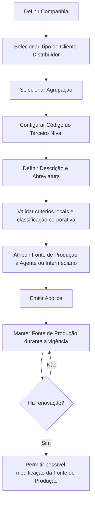

# Definição do Terceiro Nível da Estrutura de Canais — Fontes de Produção

## 1. Metadados do Documento
- **Arquivo de Origem:** Não identificado no conteúdo extraído
- **Tipo de Documento:** Especificação Técnica / Funcional
- **Domínio / Sistema:** Estrutura de Canais; Fontes de Produção; Clientes Distribuidores; MAPFRE
- **Público-Alvo:** Arquitetos, analistas funcionais, operação e equipes responsáveis pela configuração de canais
- **Data/Versão Identificada:** Não identificada

---

## 2. Resumo Executivo & Contexto de Negócio

O documento define as **Fontes de Produção** como o terceiro nível da estrutura de canais. Uma Fonte de Produção classifica operacionalmente subconjuntos de agentes da rede comercial que compartilham características similares e identifica, para uma apólice, o Cliente Distribuidor, o Canal de Comercialização e atributos adicionais do agente comercializador.

Cada Fonte de Produção deve pertencer de forma unívoca a um Cliente Distribuidor e a uma de suas Agrupações. Além disso, uma Fonte de Produção deve se diferenciar das demais Fontes de Produção por pelo menos um critério considerado relevante localmente pela entidade seguradora.

A classificação considera critérios comuns às tipologias de Clientes Distribuidores: vínculo com a entidade seguradora, localização física de fechamento da venda, oferta ou portfólio de produtos do agente e canal de comercialização de origem do cliente. Os canais de origem citados são Presencial, Digital e Telefônico.

O objetivo funcional declarado é configurar as Fontes de Produção no terceiro nível da estrutura de canais. A Fonte de Produção é vinculada aos Agentes durante o processo de emissão das apólices, deve ser preservada durante a vigência da apólice e pode ser alterada no momento de uma eventual renovação.

A responsabilidade pela granularidade, codificação, uso e definição do catálogo de Fontes de Produção é local às entidades MAPFRE. Essa definição local deve, contudo, permanecer sincronizada com as classificações corporativas de Agrupações e Clientes Distribuidores.

---

## 3. Arquitetura, Componentes & Tecnologias Envolvidas

A estrutura apresentada possui três níveis de classificação de canais:

1. **Primeiro Nível:** Tipos de Clientes Distribuidores.
2. **Segundo Nível:** Agrupações.
3. **Terceiro Nível:** Fontes de Produção.

Os Tipos de Clientes Distribuidores listados são: Direto, Rede Própria, Rede Externa, Bancário e Acordos. Cada tipo possui critérios de classificação próprios. A Fonte de Produção é configurada para uma Companhia, associada a um código de Primeiro Nível, a um código de Segundo Nível e a um código de Terceiro Nível.



### Componentes e conceitos identificados

| Componente / Conceito | Papel no documento |
| :--- | :--- |
| Companhia | Código da companhia para a qual é definida a chave da Fonte de Produção no sistema. |
| Cliente Distribuidor | Entidade à qual cada Fonte de Produção deve pertencer univocamente. |
| Agrupação | Segundo nível da estrutura de canais associado ao Cliente Distribuidor. |
| Fonte de Produção | Terceiro nível da estrutura de canais; atributo que identifica Cliente Distribuidor, Canal de Comercialização e atributos adicionais do agente para uma apólice. |
| Agente / Intermediário | Entidade à qual as Fontes de Produção são atribuídas no processo de emissão de apólices. |
| Apólice | Registro no qual a Fonte de Produção deve ser mantida durante a vigência, até eventual renovação. |
| Canal de Comercialização | Critério de classificação; o documento cita Presencial, Digital e Telefônico. |
| MAPFRE | Entidade mencionada em exemplos, critérios de classificação e responsabilidade local de definição de granularidade. |

> **Nota de Análise:** O documento descreve uma estrutura funcional e de configuração. Não detalha tecnologias de implementação, interfaces, métodos HTTP, contratos JSON, bancos de dados, URLs, ambientes ou integrações técnicas.

---

## 4. Regras de Negócio, Especificações Funcionais & Processos

### 4.1 Definição e unicidade da Fonte de Produção

- As Fontes de Produção identificam e classificam operacionalmente subconjuntos de agentes da rede comercial com características similares.
- Cada Fonte de Produção definida deve pertencer univocamente:
  - a um Cliente Distribuidor; e
  - a uma Agrupação desse Cliente Distribuidor.
- Uma Fonte de Produção deve diferenciar-se das demais Fontes de Produção por pelo menos um critério que a entidade seguradora considere localmente relevante para classificar a rede comercial.
- A Fonte de Produção é um atributo que identifica, de maneira unívoca e inequívoca, para uma determinada apólice:
  - o Cliente Distribuidor;
  - o Canal de Comercialização; e
  - outros atributos adicionais do Agente que comercializou a apólice.

### 4.2 Critérios comuns de classificação

Os quatro critérios comuns a todas as tipologias de Clientes Distribuidores são:

1. Vínculo com a entidade seguradora.
2. Localização física em que a venda é concluída.
3. Oferta ou portfólio de produtos do agente.
4. Canal de comercialização de origem do cliente:
   - Presencial;
   - Digital;
   - Telefônico.

O documento esclarece que nem todos os cruzamentos desses critérios são possíveis ou relevantes.

### 4.3 Critérios por Tipo de Cliente Distribuidor

#### Cliente Distribuidor Direto

Os critérios apresentados para o tipo Direto são:

- Marca da entidade seguradora, com exemplos:
  - MAPFRE;
  - VERTI;
  - INSURED&GO.
- Tipo de cliente de origem, com exemplos:
  - Governo;
  - grandes contas;
  - coletivos;
  - affinities.

#### Cliente Distribuidor Rede Própria — Agencial

Os critérios apresentados são:

- Se o agente é ou não subvencionado.
- Se o agente é ou não empregado da entidade seguradora.

#### Cliente Distribuidor Rede Externa — Corretores

Os critérios apresentados são:

- Figura legal:
  - Agentes;
  - Corretores.
- Âmbito de atuação do agente:
  - Locais;
  - Globais.

#### Cliente Distribuidor Bancário

Os critérios apresentados são:

- Estrutura societária:
  - Joint Venture;
  - Joint Venture virtual;
  - Acordo de distribuição.
- Responsabilidade pela exploração operacional do cliente:
  - Banco;
  - MAPFRE.
- Exclusividade do acordo de distribuição:
  - Total;
  - Parcial.
- Existência ou não de co-seguro no acordo de distribuição.

#### Cliente Distribuidor Acordos

Os critérios apresentados são:

- Setor de atividade, com exemplos:
  - Automotivo;
  - Retailers;
  - Financeiras;
  - Utilities.
- Responsabilidade pela exploração operacional do cliente:
  - Distribuidor;
  - MAPFRE.

### 4.4 Processo de atribuição e ciclo de vida



Regras do ciclo de vida:

- A Fonte de Produção deve ser vinculada aos Agentes durante o processo de emissão das apólices.
- A Fonte de Produção deve ser mantida durante todo o período de vigência da apólice.
- A Fonte de Produção pode ser modificada em uma possível renovação.
- A propriedade **Inabilitação** torna a Fonte de Produção indisponível para atribuição a Agentes ou Intermediários da entidade.

### 4.5 Estrutura de níveis de canais

#### Primeiro Nível — Tipos de Clientes Distribuidores

- Direto.
- Rede Própria.
- Rede Externa.
- Bancário.
- Acordos.

#### Segundo Nível — Agrupações

- Oficinas Diretas.
- Direto Grandes Contas.
- Direto Digital.
- Direto Telefônico.
- Delegados.
- Agentes Exclusivos.
- Agentes Vinculados.
- Agentes Não Vinculados.
- Corretores Locais.
- Corretores Globais.
- Bancário.
- Acordos.

#### Terceiro Nível — Fontes de Produção

O Código do Terceiro Nível identifica a chave da Fonte de Produção no sistema. A Descrição do Terceiro Nível contém a denominação da chave, e a Abreviatura do Terceiro Nível contém a denominação em formato abreviado.

---

## 5. Tabelas de Parâmetros, Ambientes e Estruturas de Dados

### 5.1 Propriedades da Fonte de Produção

| Item / Parâmetro | Descrição / Função | Tipo / Valores / Formato | Ambiente / Observações |
| :--- | :--- | :--- | :--- |
| Companhia | Contém o código da companhia para a qual é definida a chave da Fonte de Produção no sistema. | Código de companhia | Propriedade geral. |
| Código do Primeiro Nível | Identifica a chave do Primeiro Nível da estrutura de canais ou Tipo de Cliente Distribuidor. | Direto; Rede Própria; Rede Externa; Bancário; Acordos | Propriedade geral. |
| Código do Segundo Nível | Identifica a chave do Segundo Nível da estrutura de canais ou Agrupação. | Valores de agrupação listados no documento | Propriedade geral. |
| Código do Terceiro Nível | Identifica a chave do Terceiro Nível da estrutura de canais ou Fonte de Produção. | Código | Propriedade geral. |
| Descrição do Terceiro Nível | Contém a denominação ou descrição da chave do Terceiro Nível ou Fonte de Produção do Cliente Distribuidor. | Texto | Propriedade geral. |
| Abreviatura do Terceiro Nível | Contém a denominação ou descrição da chave do Terceiro Nível em formato abreviado. | Texto abreviado | Propriedade geral. |
| Inabilitação | Estabelece que a Fonte de Produção não pode ser utilizada em sua atribuição a Agentes ou Intermediários. | Propriedade de estado | Outra propriedade. |

### 5.2 Tipos de Clientes Distribuidores e critérios

| Tipo de Cliente Distribuidor | Critério | Valores / Exemplos citados | Observações |
| :--- | :--- | :--- | :--- |
| Todos os tipos | Vínculo com a entidade seguradora | Não detalhado em valores | Critério comum. |
| Todos os tipos | Localização física de fechamento da venda | Não detalhado em valores | Critério comum. |
| Todos os tipos | Oferta ou portfólio de produtos do agente | Não detalhado em valores | Critério comum. |
| Todos os tipos | Canal de comercialização de origem | Presencial; Digital; Telefônico | Critério comum. |
| Direto | Marca da entidade seguradora | MAPFRE; VERTI; INSURED&GO | Critério específico. |
| Direto | Tipo de cliente de origem | Governo; grandes contas; coletivos; affinities | Critério específico. |
| Rede Própria — Agencial | Subvenção do agente | Subvencionado; não subvencionado | Critério específico. |
| Rede Própria — Agencial | Vínculo empregatício | Empregado; não empregado da entidade seguradora | Critério específico. |
| Rede Externa — Corretores | Figura legal | Agentes; Corretores | Critério específico. |
| Rede Externa — Corretores | Âmbito de atuação | Locais; Globais | Critério específico. |
| Bancário | Estrutura societária | Joint Venture; Joint Venture virtual; Acordo de distribuição | Critério específico. |
| Bancário | Responsabilidade operacional | Banco; MAPFRE | Critério específico. |
| Bancário | Exclusividade do acordo | Total; Parcial | Critério específico. |
| Bancário | Co-seguro | Com ou sem co-seguro | Critério específico. |
| Acordos | Setor de atividade | Automotivo; Retailers; Financeiras; Utilities | Lista ilustrativa. |
| Acordos | Responsabilidade operacional | Distribuidor; MAPFRE | Critério específico. |

### 5.3 Mapeamento de Primeiro e Segundo Níveis

| Primeiro Nível | Segundo Nível / Agrupações associadas citadas |
| :--- | :--- |
| Direto | Oficinas Diretas; Direto Grandes Contas; Direto Digital; Direto Telefônico |
| Rede Própria | Delegados; Agentes Exclusivos; Agentes Vinculados; Agentes Não Vinculados |
| Rede Externa | Corretores Locais; Corretores Globais |
| Bancário | Bancário |
| Acordos | Acordos |

### 5.4 Exemplos de codificação de Fontes de Produção — Cliente Distribuidor Direto

Contexto declarado: Cliente Distribuidor do tipo **Direto**, canal de venda **Telefônico** e vínculo **Exclusivo**, considerando localização e oferta de produtos.

| Chave do Terceiro Nível | Descrição |
| :--- | :--- |
| 1001 | Produção Telefônica - Oficina Direta - Multi Produto |
| 1002 | Produção Telefônica - Oficina Direta - Específica |
| 1003 | Contact Center Próprio |
| 1004 | Contact Center Próprio Exclusivo |
| 1005 | Contact Center Próprio |
| 1006 | Contact Center Próprio Exclusivo |

### 5.5 Exemplos de codificação de Fontes de Produção — Rede Própria

Contexto declarado: Cliente Distribuidor do tipo **Rede Própria**, canal de venda **Presencial** e vínculo **Exclusivo**, considerando localização e oferta de produtos.

| Chave do Terceiro Nível | Descrição |
| :--- | :--- |
| 2401 | Delegado MAPFRE |
| 2402 | Delegado Específico MAPFRE |
| 2501 | Agente Exclusivo |
| 2502 | Agente Exclusivo Específico |

### 5.6 Documentos funcionais relacionados

| Documento / Referência | Finalidade indicada |
| :--- | :--- |
| Estrutura de Canais | Diretriz e documento funcional cuja leitura é recomendada para evitar interpretação isolada incorreta. |
| Relação de Agentes e Fontes de Produção | Diretriz e documento funcional cuja leitura é recomendada para evitar interpretação isolada incorreta. |

> **Nota de Análise:** O documento não fornece URLs de ambientes, rotas de logs, nomes de servidores, credenciais, versões de software, protocolos de integração ou contratos de dados.

---

## 6. Bateria de Perguntas & Respostas para RAG (FAQ Sintético)

### P1: O que é uma Fonte de Produção na estrutura de canais?
**R:** Uma Fonte de Produção é o atributo correspondente ao terceiro nível da estrutura de canais. Para uma apólice determinada, a Fonte de Produção identifica de forma unívoca e inequívoca o Cliente Distribuidor, o Canal de Comercialização e outros atributos adicionais do Agente que comercializou a apólice.

### P2: A qual estrutura uma Fonte de Produção deve estar vinculada?
**R:** Cada Fonte de Produção deve pertencer univocamente a um Cliente Distribuidor e a uma das Agrupações desse Cliente Distribuidor. Essa vinculação integra a estrutura de canais composta por Primeiro Nível, Segundo Nível e Terceiro Nível.

### P3: Quais são os quatro critérios comuns de classificação das Fontes de Produção?
**R:** Os quatro critérios comuns são: vínculo com a entidade seguradora, localização física em que a venda é concluída, oferta ou portfólio de produtos do agente e canal de comercialização de origem do cliente. Os canais citados são Presencial, Digital e Telefônico.

### P4: Quais Tipos de Clientes Distribuidores existem no Primeiro Nível?
**R:** O Primeiro Nível contém os seguintes Tipos de Clientes Distribuidores: Direto, Rede Própria, Rede Externa, Bancário e Acordos.

### P5: Como uma Fonte de Produção é tratada durante a vigência de uma apólice?
**R:** A Fonte de Produção deve ser vinculada aos Agentes durante o processo de emissão das apólices e mantida durante todo o período de vigência. Em uma possível renovação, a Fonte de Produção pode ser modificada.

### P6: Em que momento é permitida a alteração da Fonte de Produção?
**R:** O documento estabelece que a Fonte de Produção deve permanecer durante a vigência da apólice e pode ser modificada no momento de uma possível renovação.

### P7: Quais critérios são usados para classificar um Cliente Distribuidor do tipo Bancário?
**R:** Para o tipo Bancário, os critérios são: estrutura societária — Joint Venture, Joint Venture virtual ou Acordo de distribuição; responsabilidade pela exploração operacional do cliente — Banco ou MAPFRE; exclusividade do acordo — Total ou Parcial; e existência ou não de co-seguro no acordo de distribuição.

### P8: Quais propriedades devem ser configuradas para uma Fonte de Produção?
**R:** As propriedades gerais citadas são Companhia, Código do Primeiro Nível, Código do Segundo Nível, Código do Terceiro Nível, Descrição do Terceiro Nível e Abreviatura do Terceiro Nível. O documento também lista a propriedade de Inabilitação.

### P9: O que acontece quando uma Fonte de Produção está inabilitada?
**R:** A propriedade Inabilitação estabelece que a Fonte de Produção do Cliente Distribuidor fica inabilitada para ser utilizada na atribuição a Agentes ou Intermediários da entidade.

### P10: Quais são os critérios específicos para o tipo de Cliente Distribuidor Rede Externa — Corretores?
**R:** A classificação da Rede Externa — Corretores considera a figura legal, distinguindo Agentes e Corretores, e o âmbito de atuação do agente, distinguindo agentes Locais e Globais.

### P11: Quem define a granularidade local das Fontes de Produção?
**R:** As entidades MAPFRE são responsáveis por analisar e determinar a granularidade das Fontes de Produção de acordo com as necessidades operacionais locais. Essa definição deve permanecer sincronizada com as classificações corporativas de Agrupações e Clientes Distribuidores.

### P12: Quais exemplos de Fontes de Produção foram apresentados para o canal Telefônico do tipo Direto?
**R:** Os exemplos apresentados incluem: 1001 — Produção Telefônica - Oficina Direta - Multi Produto; 1002 — Produção Telefônica - Oficina Direta - Específica; 1003 — Contact Center Próprio; 1004 — Contact Center Próprio Exclusivo; 1005 — Contact Center Próprio; e 1006 — Contact Center Próprio Exclusivo.

---

## 7. Glossário de Termos, Siglas & Conceitos-Chave

- **Agrupação:** Segundo Nível da estrutura de canais.
- **Agente:** Entidade da rede comercial à qual as Fontes de Produção são vinculadas no processo de emissão de apólices.
- **Canal de Comercialização:** Critério de classificação da Fonte de Produção; o documento cita os canais Presencial, Digital e Telefônico.
- **Cliente Distribuidor:** Entidade a que uma Fonte de Produção deve pertencer univocamente.
- **Co-seguro:** Condição que pode ou não estar presente em um acordo de distribuição do tipo Bancário; o documento não detalha sua definição operacional.
- **Companhia:** Código da companhia para a qual a chave da Fonte de Produção é definida no sistema.
- **Fonte de Produção:** Terceiro Nível da estrutura de canais, usado para identificar a origem comercial de uma apólice e atributos relacionados ao agente.
- **Inabilitação:** Propriedade que impede o uso de uma Fonte de Produção para atribuição a Agentes ou Intermediários.
- **Joint Venture:** Estrutura societária listada como critério possível para Cliente Distribuidor Bancário.
- **Joint Venture virtual:** Estrutura societária listada como critério possível para Cliente Distribuidor Bancário.
- **MAPFRE:** Entidade citada em exemplos de marca, responsabilidade operacional e responsabilidade local de definição de granularidade.
- **Primeiro Nível:** Nível da estrutura de canais correspondente aos Tipos de Clientes Distribuidores.
- **Segundo Nível:** Nível da estrutura de canais correspondente às Agrupações.
- **Terceiro Nível:** Nível da estrutura de canais correspondente às Fontes de Produção.

---

## 8. Notas Críticas, Riscos & Limitações

- A entidade seguradora deve definir localmente quais critérios distinguem as Fontes de Produção, desde que preserve a sincronização com as classificações corporativas de Agrupações e Clientes Distribuidores.
- Nem todos os cruzamentos entre os quatro critérios comuns de classificação são possíveis ou relevantes.
- A leitura isolada do documento pode levar a interpretações incorretas; o próprio documento recomenda a consulta a **Estrutura de Canais** e **Relação de Agentes e Fontes de Produção**.
- A Fonte de Produção não deve ser alterada durante a vigência da apólice segundo a regra apresentada; a possível modificação é explicitamente mencionada no momento de renovação.
- Uma Fonte de Produção inabilitada não pode ser utilizada para atribuição a Agentes ou Intermediários.
- Os exemplos de codificação são explicitamente apresentados como ilustrativos e não exaustivos.
- Não há detalhamento sobre regras de validação de códigos, unicidade técnica em banco de dados, perfis de acesso, workflow de aprovação, APIs, integrações, logs ou procedimentos de auditoria.
- O trecho extraído contém a sequência “`/ CF Home Solutions APIs Documentation Zeus EN`” na página 1, sem contexto suficiente para estabelecer relação com a definição de Fontes de Produção.

---

## 9. Conteúdo Bruto Estruturado (Referência Fiel)

```text
--- [PÁGINA 1 DE 5] ---

DEFINICIÓN del Tercer Nivel de la Estructura de
Canales

Contexto

Las Fuentes de Producción identifican y clasifican operativamente a los subconjuntos de agentes
de la red comercial que cuentan con similares características.

Cada fuente de producción definida debe pertenecer unívocamente a un cliente distribuidor y a una
de sus agrupaciones debiendo distinguirse del resto de sus fuentes de producción por al menos uno
de los criterios que localmente la entidad aseguradora haya considerado relevantes para clasificar a
su red comercial.”

Los cuatro criterios comunes a todas las tipologías de Clientes Distribuidores (si bien no todos
sus cruces son posibles o relevantes) son:

Por su vinculación con la entidad aseguradora.
Por la ubicación física en la que se cierra la venta.
Por la oferta o porfolio de productos del agente.
Por el canal de comercialización origen del cliente (Presencial, Digital o Telefónico).

En el caso del Tipo de Cliente Distribuidor Directo los criterios son:

Por la marca de la entidad aseguradora ( MAPFRE, VERTI, INSURED&GO,…).
Por el tipo de cliente origen (Gobierno, grandes cuentas, colectivos, affinities,…).

En el caso del Tipo de Cliente Distribuidor Red Propia - Agencial:

/
CF
Home Solutions APIs Documentation Zeus
EN


--- [PÁGINA 2 DE 5] ---

Si el agente está o no subvencionado.
Si el agente es o no un empleado de la entidad aseguradora.

En el caso del Tipo de Cliente Distribuidor Red Externa - Corredores:

Por su figura legal (Agentes o Corredores)
Por el ámbito de actuación del agente (Locales o Globales)

En el caso del Tipo de Cliente Distribuidor Bancario:

Por la estructura societaria: Joint Venture, Joint Venture virtual, Acuerdo de distribución.
Si la responsabilidad en la explotación operativa del cliente la tiene el Banco o MAPFRE.
Si la exclusividad del acuerdo de distribución es Total o Parcial.
Si el acuerdo de distribución está o no en Coaseguro.

En el caso del Tipo de Cliente Distribuidor Acuerdos:

Por el sector de actividad: Automoción, Retailers, Financieras, Utilities,…
Si la responsabilidad en la explotación operativa del cliente recae en el Distribuidor o en
MAPFRE.

Una Fuente de Producción es un atributo que identifica unívoca e inequívocamente en el sistema y
para una póliza determinada cual es el Cliente Distribuidor, el [Canal de Comercialización] y otros
atributos adicionales del Agente que la ha comercializado.

Las Fuentes de Producción están vinculadas a los Agentes en el proceso de emisión de las
pólizas debiendo mantenerse durante su periodo de vigencia y hasta su posible renovación,
momento en el cual podrá ser modificada.

Objetivo

Configurar las Fuentes de Producción en el tercer nivel de la estructura de canales.

Propiedades Generales
Otras Propiedades

Propiedades Generales

Compañía

Este atributo contiene el código de la compañía para la que se está definiendo la clave de la Fuente
de Producción en el sistema.


--- [PÁGINA 3 DE 5] ---

Código del Primer Nivel

Este atributo identifica la clave que identificará al Primer Nivel de la estructura de canales o Tipos de
Clientes Distribuidores en el Sistema:

Directo.
Red Propia.
Red Externa.
Bancario.
Acuerdos.

Código del Segundo Nivel

Este atributo identifica la clave que identificará al Segundo Nivel de la estructura de canales o
Agrupaciones en el Sistema:

Oficinas Directas.
Directo Grandes Cuentas.
Directo Digital.
Directo Telefónico.
Delegados.
Agentes Exclusivos.
Agentes Vinculados.
Agentes No Vinculados.
Corredores Locales.
Corredores Globales.
Bancario.
Acuerdos.

Código del Tercer Nivel

Este atributo identificará la clave del Tercer Nivel de la estructura de canales o Fuentes de
Producción en el Sistema.

Descripción del Tercer Nivel

Esta propiedad contiene la denominación o descripción de la clave del Tercer Nivel de la estructura
de Canales o Fuente de Producción del Cliente Distribuidor.

Abreviatura del Tercer Nivel


--- [PÁGINA 4 DE 5] ---

Este Atributo contiene la denominación o descripción de la clave del Tercer Nivel de la estructura de
Canales en formato abreviado.

De manera ilustrativa y no exhaustiva, la codificación y nomenclatura de las Fuentes de Producción
en el sistema para un Cliente Distribuidor de tipo 'Directo', un canal de venta 'Telefónico' y una
vinculación 'Exclusiva', atendiendo a su ubicación y oferta de productos podría quedar como:

Clave del Tercer Nivel Descripción
1001 Producción Telefónica - Oficina Directa - Multi Producto
1002 Producción Telefónica - Oficina Directa - Específica
1003 Contact Center Propio
1004 Contact Center Propio Exclusivo
1005 Contact Center Propio
1006 Contact Center Propio Exclusivo

En cambio, la codificación y nomenclatura de las Fuentes de Producción en el sistema para un
Cliente Distribuidor de tipo 'Red Propia', un canal de venta 'Presencial' y una vinculación
'Exclusiva', atendiendo a su ubicación y oferta de productos podría quedar como:

Clave del Tercer Nivel Descripción
2401 Delegado MAPFRE
2402 Delegado Específico MAPFRE
2501 Agente Exclusivo
2502 Agente Exclusivo Específico

De manera gráfica, las Fuentes de Producción más comunmente utilizadas en la RED EXTERNA de
las compañías podrían contemplar los criterios:


--- [PÁGINA 5 DE 5] ---

Otras Propiedades

Inhabilitación

Esta propiedad establece que la Fuente de Producción del Cliente Distribuidor está inhabilitada para
poder ser utilizada en su asignación a los Agentes o Intermediarios de la Entidad.

Vínculos

Relación de Directrices y Documentos funcionales cuya lectura recomendada para evitar que la
interpretación aislada del presente documento pueda conducir a error.

Estructura de Canales
Relación de Agentes y Fuentes de Producción

Preguntas frecuentes

1 ¿Existe alguna premisa que deba ser tomada en consideración localmente en la codificación, uso y
definición del catálogo de Fuentes de Producción en el Sistema?

En las entidades MAPFRE recae la responsabilidad de analizar y determinar la granularidad de sus
Fuentes de Producción de acuerdo con las necesidades operativas locales pero sin perder de vista
que tienen que estar sincronizadas con las clasificaciones corporativas de Agrupaciones y Clientes
Distribuidores.
```
