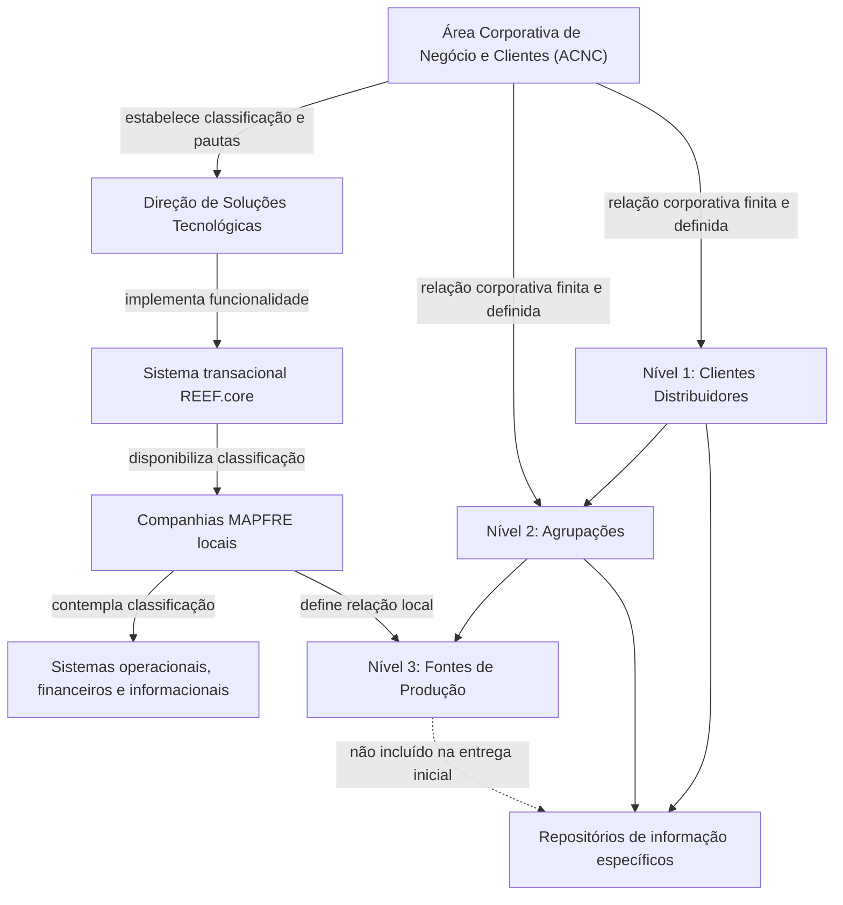
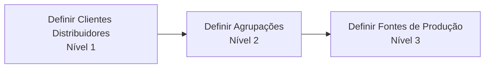

# Definição da Estrutura de Canais no REEF.core para Entidades MAPFRE

## 1. Metadados do Documento
- **Arquivo de Origem:** `Não identificado no conteúdo extraído`
- **Tipo de Documento:** Especificação Funcional
- **Domínio / Sistema:** REEF.core; estrutura operacional de canais MAPFRE
- **Público-Alvo:** Negócio, desenvolvedores, arquitetura e operação
- **Data/Versão Identificada:** Não identificada

---

## 2. Resumo Executivo & Contexto de Negócio

A Área Corporativa de Negócio e Clientes (ACNC) estabeleceu uma nova classificação operacional para clientes distribuidores. Essa classificação deve ser considerada pelos sistemas operacionais, financeiros e informacionais dos países onde as entidades MAPFRE atuam.

A finalidade da estrutura de canais é facilitar a obtenção e o reporte de informações sobre índices de produtividade e rentabilidade por canal, incluindo margem de contribuição. O documento associa a classificação de clientes distribuidores e agrupações à necessidade de análise corporativa desses indicadores.

A Direção de Soluções Tecnológicas implementou a funcionalidade no sistema transacional REEF.core. A funcionalidade disponibiliza às companhias MAPFRE locais a capacidade de classificar clientes distribuidores e suas agrupações conforme as diretrizes definidas pela ACNC.

A estrutura de canais possui formato piramidal com três níveis: Clientes Distribuidores, Agrupações e Fontes de Produção. Os dois primeiros níveis constituem uma relação finita e definida corporativamente; as entidades MAPFRE locais possuem autonomia apenas para definir a relação de Fontes de Produção utilizada localmente.

O documento informa que repositórios de informação específicos são entregues inicialmente às instalações com informações dos níveis da estrutura, exceto o terceiro nível. Portanto, a definição de Fontes de Produção é uma responsabilidade operacional local posterior à disponibilização inicial.

---

## 3. Arquitetura, Componentes & Tecnologias Envolvidas

| Componente / Entidade | Papel identificado no documento | Observações |
| :--- | :--- | :--- |
| ACNC | Define a nova classificação operacional de clientes distribuidores e as diretrizes corporativas. | ACNC corresponde à Área Corporativa de Negócio e Clientes. |
| Direção de Soluções Tecnológicas | Implementou a funcionalidade de classificação de canais. | A implementação foi realizada no sistema transacional REEF.core. |
| REEF.core | Sistema transacional que disponibiliza a funcionalidade de classificação. | O texto utiliza a grafia `Reef.core` e `REEF.core`. |
| Companhias MAPFRE locais | Utilizam a funcionalidade e definem localmente a relação de Fontes de Produção. | Não possuem, segundo o texto, liberdade para alterar a relação corporativa dos níveis 1 e 2. |
| Sistemas operacionais, financeiros e informacionais dos países | Devem contemplar a nova classificação operacional. | O documento não descreve integrações, interfaces ou contratos entre esses sistemas. |
| Repositórios de informação específicos | Armazenam a estrutura piramidal de canais. | São entregues inicialmente sem informação do terceiro nível. |



**Nota de Análise:** O documento não detalha APIs, protocolos, métodos HTTP, bancos de dados, formatos de mensagens, ambientes técnicos ou contratos de integração do REEF.core.

---

## 4. Regras de Negócio, Especificações Funcionais & Processos

### Estrutura hierárquica de canais

A entidade MAPFRE deve codificar a estrutura de canais em uma estrutura piramidal de três níveis:

1. **Nível 1 — Clientes Distribuidores**
2. **Nível 2 — Agrupações**
3. **Nível 3 — Fontes de Produção**

### Governança corporativa e local

1. A ACNC estabelece a classificação operacional dos clientes distribuidores.
2. Os níveis **Clientes Distribuidores** e **Agrupações** possuem uma relação finita e definida pelo nível corporativo.
3. As entidades MAPFRE locais não são apresentadas como responsáveis por definir a relação dos níveis 1 e 2.
4. As entidades MAPFRE locais possuem a faculdade de definir a relação de **Fontes de Produção** utilizada localmente.
5. A classificação deve ser contemplada por sistemas operacionais, financeiros e informacionais dos países.
6. A classificação suporta a obtenção e o reporte de índices de produtividade e rentabilidade por canal, incluindo margem de contribuição.

### Processo indicado pelo documento



### Entrega inicial dos repositórios

Os repositórios específicos de informação são entregues inicialmente às instalações com informações da estrutura, **exceto o terceiro nível**. O texto não especifica quais dados dos níveis 1 e 2 são entregues, nem descreve o procedimento técnico para cadastrar ou associar Fontes de Produção.

---

## 5. Tabelas de Parâmetros, Ambientes e Estruturas de Dados

| Item / Parâmetro | Descrição / Função | Tipo / Valores / Formato | Ambiente / Observações |
| :--- | :--- | :--- | :--- |
| Estrutura de Canais | Estrutura usada para codificar canais de uma entidade MAPFRE. | Estrutura piramidal de três níveis. | Mantida em repositórios de informação específicos. |
| Nível 1 | Classificação de Clientes Distribuidores. | Clientes Distribuidores. | Relação finita e definida corporativamente. |
| Nível 2 | Classificação de Agrupações. | Agrupações. | Relação finita e definida corporativamente. |
| Nível 3 | Relação de Fontes de Produção. | Fontes de Produção. | Relação definida pelas entidades MAPFRE locais. Não consta na entrega inicial. |
| Classificação operacional | Nova classificação aplicável aos clientes distribuidores. | Diretriz corporativa. | Deve ser contemplada por sistemas operacionais, financeiros e informacionais dos países. |
| Indicadores suportados | Informações que a estrutura busca facilitar obter e reportar. | Índices de produtividade; rentabilidade por canal; margem de contribuição. | Não há fórmulas ou métricas detalhadas no texto. |
| Sistema transacional | Sistema em que a funcionalidade foi implementada. | REEF.core. | Grafias `Reef.core` e `REEF.core` aparecem no conteúdo. |
| Entrega inicial | Conteúdo inicial dos repositórios de informação. | Informações da estrutura, exceto nível 3. | O documento não especifica formato, mecanismo ou cronograma de entrega. |

---

## 6. Bateria de Perguntas & Respostas para RAG (FAQ Sintético)

### P1: Qual é o objetivo da nova estrutura de canais no REEF.core?
**R:** A estrutura de canais permite classificar clientes distribuidores e suas agrupações nas companhias MAPFRE locais, seguindo diretrizes da ACNC. A classificação busca facilitar a obtenção e o reporte de índices de produtividade e rentabilidade por canal, incluindo margem de contribuição.

### P2: Quais são os três níveis da estrutura de canais?
**R:** A estrutura possui três níveis piramidais: Nível 1 — Clientes Distribuidores; Nível 2 — Agrupações; e Nível 3 — Fontes de Produção.

### P3: Quem define os níveis Clientes Distribuidores e Agrupações?
**R:** A relação dos níveis Clientes Distribuidores e Agrupações é finita e definida pelo corporativo, em consenso com a Área Corporativa de Negócio e Clientes (ACNC).

### P4: O que as entidades MAPFRE locais podem definir na estrutura de canais?
**R:** As entidades MAPFRE locais possuem a faculdade de definir a relação de Fontes de Produção utilizada localmente. As Fontes de Produção correspondem ao terceiro nível da estrutura piramidal.

### P5: Em qual sistema a funcionalidade de classificação de canais foi implementada?
**R:** A Direção de Soluções Tecnológicas implementou a funcionalidade no sistema transacional REEF.core.

### P6: Quais sistemas devem contemplar a nova classificação operacional de clientes distribuidores?
**R:** A nova classificação operacional deve ser contemplada pelos sistemas operacionais, financeiros e informacionais dos países.

### P7: Qual nível não é incluído inicialmente nos repositórios de informação específicos?
**R:** O terceiro nível, correspondente às Fontes de Produção, não é incluído inicialmente nas informações entregues às instalações.

### P8: A estrutura de canais serve para calcular a margem de contribuição?
**R:** O documento informa que a estrutura facilita o processo de obtenção e reporte de informações de produtividade e rentabilidade por canal, incluindo margem de contribuição. Contudo, o documento não apresenta fórmulas, regras de cálculo ou parâmetros para calcular a margem de contribuição.

### P9: O documento define como integrar o REEF.core aos sistemas financeiros e informacionais?
**R:** Não. O documento afirma que os sistemas operacionais, financeiros e informacionais devem contemplar a classificação, mas não detalha interfaces, APIs, mensagens, contratos de dados ou mecanismos de integração.

### P10: Qual é a sequência de definição da estrutura de canais?
**R:** O processo indicado é: definir Clientes Distribuidores no Nível 1, definir Agrupações no Nível 2 e definir Fontes de Produção no Nível 3.

---

## 7. Glossário de Termos, Siglas & Conceitos-Chave

- **ACNC:** Área Corporativa de Negócio e Clientes; área que estabelece a nova classificação operacional de clientes distribuidores.
- **REEF.core / Reef.core:** Sistema transacional no qual a funcionalidade de classificação de canais foi implementada.
- **Clientes Distribuidores:** Primeiro nível da estrutura piramidal de canais.
- **Agrupações:** Segundo nível da estrutura piramidal de canais.
- **Fontes de Produção:** Terceiro nível da estrutura piramidal; relação que pode ser definida pelas entidades MAPFRE localmente.
- **Estrutura de Canais:** Estrutura piramidal de três níveis usada para codificar canais de uma entidade MAPFRE.
- **Margem de contribuição:** Indicador de rentabilidade por canal mencionado como parte das informações a obter e reportar.
- **Repositórios de informação específicos:** Repositórios que armazenam a estrutura de canais e são entregues inicialmente sem o terceiro nível.

---

## 8. Notas Críticas, Riscos & Limitações

- O documento não especifica versões, datas, autores, número de documento ou nome do arquivo de origem.
- Não são descritos métodos HTTP, APIs, contratos JSON, modelos físicos de dados, tabelas de banco, eventos ou mecanismos de integração.
- Não há fórmulas, dimensões analíticas, periodicidade ou critérios de cálculo para produtividade, rentabilidade ou margem de contribuição.
- O documento não detalha como as entidades MAPFRE locais devem cadastrar, validar, alterar ou remover Fontes de Produção.
- A entrega inicial dos repositórios não inclui o terceiro nível, criando uma dependência da definição local de Fontes de Produção para completar a estrutura.
- Não são apresentados mecanismos de autenticação, autorização, auditoria, trilhas de alteração ou matriz de permissões.
- **Nota de Análise:** O documento lista o REEF.core e os três níveis da estrutura de canais, porém não detalha os métodos, interfaces ou contratos técnicos expostos pela funcionalidade.

---

## 9. Conteúdo Bruto Estruturado (Referência Fiel)

```text
--- [PÁGINA 1 DE 2] ---

DEFINICIÓN de la ESTRUCTURA de CANALES
Contexto
El área corporativa de negocio y clientes (ACNC) ha establecido una nueva clasificación operativa de
clientes distribuidores que debe ser contemplada en los sistemas operacionales, financieros e
informacionales de los países, facilitando el proceso de obtención y reporte de la información de
ratios de productividad y de rentabilidad por canal (margen de contribución).
Por dicha razón, desde la Dirección de Soluciones Tecnológicas se ha implementado en el sistema
transaccional de Reef.core poniendo a disposición de las compañías MAPFRE locales la
funcionalidad de clasificar los clientes Distribuidores y sus Agrupaciones según las pautas indicadas
por el ACNC.
Se ha consensuado conjuntamente con el Área Corporativa de Negocio y Clientes (ACNC) el que los
dos primeros niveles de la estructura, los niveles correspondientes a los clientes distribuidores y a
sus agrupaciones sean una relación finita y definida por el corporativo, delegando en las entidades
MAPFRE únicamente la facultad de definir la relación de fuentes de producción que utilizan
localmente.
Objetivo
Funcionalmente, el núcleo del Sistema cuenta con la posibilidad de codificar la estructura de Canales
de la entidad MAPFRE en una estructura piramidal de tres niveles en repositorios de información
específicos que se entregan inicialmente a las instalaciones con información excepto el tercer nivel
de la estructura.
 / 
 CF
Home Solutions APIs Documentation Zeus
EN


--- [PÁGINA 2 DE 2] ---

Proceso a seguir
DEFINIR Clientes Distribuidores (1) DEFINIR Agrupaciones (2) DEFINIR Fuentes de Producción (3)
DEFINIR Nivel 1 - Clientes Distribuidores
DEFINIR Nivel 2 - Agrupaciones
DEFINIR Nivel 3 - Fuentes de Producción
```