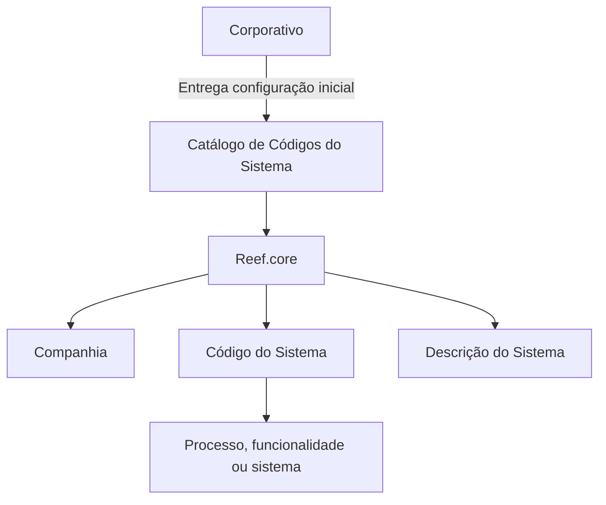

# Definição dos Códigos do Sistema — Catálogo Funcional do Reef.core

## 1. Metadados do Documento
- **Arquivo de Origem:** Não identificado no conteúdo fornecido
- **Tipo de Documento:** Especificação Técnica
- **Domínio / Sistema:** Reef.core
- **Público-Alvo:** Desenvolvedores, Arquitetos, Operação e Negócio
- **Data/Versão Identificada:** Não identificada

---

## 2. Resumo Executivo & Contexto de Negócio

O documento define o catálogo de códigos do sistema utilizado pelo núcleo da aplicação Reef.core para identificar processos, funcionalidades ou sistemas presentes na aplicação. O catálogo é entregue inicialmente às instalações já com conteúdo definido.

A propriedade **Companhia** identifica o código da companhia sobre a qual a definição está sendo realizada. As propriedades **Código do Sistema** e **Descrição do Sistema** registram, respectivamente, o código e a descrição do processo, funcionalidade ou sistema definido.

O catálogo possui uma restrição operacional crítica: a configuração inicial é fornecida pelo Corporativo e sua informação não deve ser modificada. Essa restrição preserva a padronização corporativa dos códigos e das classificações funcionais entre instalações.

As classificações apresentadas abrangem subsistemas transversais, emissão, sinistros, tesouraria, execução de cadeias via tarefas, jurídico, ocorrências de informação e seleção de riscos de vida.

---

## 3. Arquitetura, Componentes & Tecnologias Envolvidas

O conteúdo fornecido cita o núcleo da aplicação **Reef.core** e um catálogo de informação específico. O catálogo associa uma definição funcional a uma companhia, a um código de sistema e a uma descrição de sistema.

Não há tecnologias, protocolos, APIs, métodos HTTP, bancos de dados, URLs de ambiente, servidores ou contratos de integração detalhados no conteúdo.



> **Nota de Análise:** O documento descreve a função do catálogo no Reef.core, mas não detalha o modelo físico de dados, mecanismos de distribuição corporativa, permissões de alteração ou interfaces de consulta.

---

## 4. Regras de Negócio, Especificações Funcionais & Processos

1. O núcleo da aplicação **Reef.core** pode identificar processos, funcionalidades ou sistemas contidos na aplicação por meio de um catálogo de informação específico.
2. O catálogo é entregue inicialmente às instalações com conteúdo já preenchido.
3. A informação inicial do catálogo é fornecida pelo **Corporativo**.
4. A informação da configuração inicial do catálogo não deve ser apagada ou alterada.
5. A propriedade **Companhia** contém o código da companhia sobre a qual a definição está sendo realizada.
6. A propriedade **Código do Sistema** indica o código do processo, funcionalidade ou sistema.
7. A propriedade **Descrição do Sistema** indica a descrição do processo, funcionalidade ou sistema da aplicação em definição.
8. O catálogo contém classificações associadas a subsistemas de emissão, sinistros, tesouraria, funções transversais, cadeias, jurídico, ocorrências e seleção de riscos de vida.
9. O código numérico não é globalmente único no conteúdo apresentado: por exemplo, o código `1` aparece associado tanto a `GENERAL` quanto a `RECIBOS`; o código `2` aparece associado a `EMISIÓN` e `NO ASIGNADO`; e assim sucessivamente. O documento não especifica a chave composta ou critério adicional necessário para desambiguar esses códigos.

---

## 5. Tabelas de Parâmetros, Ambientes e Estruturas de Dados

| Item / Parâmetro | Descrição / Função | Tipo / Valores / Formato | Ambiente / Observações |
| :--- | :--- | :--- | :--- |
| Companhia | Indica o código da companhia sobre a qual uma definição é realizada. | Código de companhia; formato não especificado. | Propriedade do catálogo. |
| Código do Sistema | Indica o código do processo, funcionalidade ou sistema. | Códigos `1`, `2`, `3`, `4`, `9`, `C`, `J`, `L` e `S`. | O documento não define unicidade global dos códigos. |
| Descrição do Sistema | Indica a descrição do processo, funcionalidade ou sistema em definição. | Texto descritivo. | Propriedade do catálogo. |
| Configuração inicial | Conteúdo inicial entregue às instalações. | Informação fornecida pelo Corporativo. | Não deve ser apagada ou alterada. |

| Código | Descrição | Uso |
| :--- | :--- | :--- |
| `1` | GENERAL | Subsistema Transversal |
| `2` | EMISIÓN | Subsistema de Emissão |
| `3` | LIQUIDACIONES | Subsistema de Sinistros — Módulo Liquidações |
| `4` | JUICIOS | Subsistema de Sinistros — Módulo Juízos |
| `1` | RECIBOS | Subsistema de Tesouraria |
| `2` | NO ASIGNADO | Não atribuído |
| `3` | SINIESTROS | Subsistema de Sinistros |
| `4` | SOLICITUDES | Subsistema de Emissão — Solicitações |
| `9` | GENERAL | Subsistema Transversal |
| `C` | CADENAS | Subsistema de Execução de Cadeias via Tarefas |
| `J` | JURÍDICO | Subsistema de Sinistros — Módulo Jurídico |
| `L` | OCURRENCIAS | Subsistema de Emissão — Ocorrências de Informação |
| `S` | SELECCIÓN DE RIESGOS VIDA | Subsistema de Emissão — Seleção de Riscos de Vida |

---

## 6. Bateria de Perguntas & Respostas para RAG (FAQ Sintético)

### P1: Qual é a finalidade do catálogo de códigos do sistema no Reef.core?
**R:** O catálogo permite que o núcleo da aplicação Reef.core identifique processos, funcionalidades ou sistemas que fazem parte da aplicação.

### P2: A configuração inicial do catálogo de códigos pode ser modificada?
**R:** Não. A configuração inicial é fornecida pelo Corporativo e sua informação não deve ser modificada, apagada ou alterada.

### P3: Qual informação é registrada na propriedade Companhia?
**R:** A propriedade Companhia registra o código da companhia sobre a qual a definição do processo, funcionalidade ou sistema está sendo realizada.

### P4: O que representa o Código do Sistema?
**R:** O Código do Sistema representa o código do processo, da funcionalidade ou do sistema definido no catálogo.

### P5: O que representa a Descrição do Sistema?
**R:** A Descrição do Sistema representa a descrição do processo, funcionalidade ou sistema da aplicação que está sendo definido.

### P6: Qual código corresponde ao subsistema de execução de cadeias via tarefas?
**R:** O código `C`, com a descrição `CADENAS`, corresponde ao Subsistema de Execução de Cadeias via Tarefas.

### P7: Qual código corresponde ao módulo jurídico do subsistema de sinistros?
**R:** O código `J`, com a descrição `JURÍDICO`, corresponde ao Subsistema de Sinistros — Módulo Jurídico.

### P8: Qual código representa a seleção de riscos de vida?
**R:** O código `S`, com a descrição `SELECCIÓN DE RIESGOS VIDA`, representa o Subsistema de Emissão — Seleção de Riscos de Vida.

### P9: Quais entradas do catálogo estão associadas ao subsistema de sinistros?
**R:** O documento associa `LIQUIDACIONES` ao Subsistema de Sinistros — Módulo Liquidações, `JUICIOS` ao Subsistema de Sinistros — Módulo Juízos, `SINIESTROS` ao Subsistema de Sinistros e `JURÍDICO` ao Subsistema de Sinistros — Módulo Jurídico.

### P10: O código numérico identifica uma descrição de forma unívoca?
**R:** Não necessariamente. O documento apresenta reutilização de códigos numéricos: por exemplo, `1` aparece para `GENERAL` e `RECIBOS`; `2` aparece para `EMISIÓN` e `NO ASIGNADO`. O conteúdo não informa o critério de desambiguação.

---

## 7. Glossário de Termos, Siglas & Conceitos-Chave

- **Reef.core:** Núcleo da aplicação citado como consumidor ou contexto do catálogo de identificação de processos, funcionalidades e sistemas.
- **Catálogo de Códigos do Sistema:** Catálogo específico usado para identificar processos, funcionalidades ou sistemas existentes na aplicação.
- **Corporativo:** Origem da configuração inicial do catálogo; a informação fornecida não deve ser modificada.
- **Companhia:** Propriedade que contém o código da companhia para a qual uma definição está sendo realizada.
- **GENERAL:** Descrição associada ao uso de Subsistema Transversal.
- **EMISIÓN:** Descrição associada ao Subsistema de Emissão.
- **LIQUIDACIONES:** Descrição associada ao Subsistema de Sinistros — Módulo Liquidações.
- **JUICIOS:** Descrição associada ao Subsistema de Sinistros — Módulo Juízos.
- **RECIBOS:** Descrição associada ao Subsistema de Tesouraria.
- **SINIESTROS:** Descrição associada ao Subsistema de Sinistros.
- **SOLICITUDES:** Descrição associada ao Subsistema de Emissão — Solicitações.
- **CADENAS:** Descrição associada ao Subsistema de Execução de Cadeias via Tarefas.
- **JURÍDICO:** Descrição associada ao Subsistema de Sinistros — Módulo Jurídico.
- **OCURRENCIAS:** Descrição associada ao Subsistema de Emissão — Ocorrências de Informação.
- **SELECCIÓN DE RIESGOS VIDA:** Descrição associada ao Subsistema de Emissão — Seleção de Riscos de Vida.

---

## 8. Notas Críticas, Riscos & Limitações

- A configuração inicial fornecida pelo Corporativo não deve ser modificada, eliminada ou alterada.
- A reutilização de códigos numéricos no catálogo cria potencial ambiguidade caso uma consulta use apenas o campo de código.
- O documento não especifica a chave lógica do catálogo, o relacionamento entre Companhia e Código do Sistema, nem as regras para resolver códigos repetidos.
- O documento não detalha mecanismos de governança, auditoria, distribuição, validação ou atualização da configuração corporativa.
- Não são fornecidos detalhes de APIs, bancos de dados, tecnologias, ambientes, URLs, logs ou integrações.

---

## 9. Conteúdo Bruto Estruturado (Referência Fiel)

```text
--- [PÁGINA 1 DE 2] ---

DEFINICIÓN de los CÓDIGOS del SISTEMA
Funcionalmente, el núcleo de Reef.core cuenta con la posibilidad de identificar los procesos,
funcionalidades o sistemas que contiene la aplicación en un catálogo de información específico que
se entrega inicialmente a las instalaciones con contenido y que no se puede borrar o alterar.
Compañía
Este Atributo del catálogo contiene el código de la compañía sobre la que se está realizando la
definición.
Código del Proceso o Sistema
Esta propiedad indica el código del proceso, funcionalidad o sistema.
Descripción del Sistema
Esta propiedad indica la descripción del proceso, funcionalidad o sistema de la aplicación que se está
definiendo. A modo de ejemplo,
TIPO DESCRIPCIÓN USO
1 GENERAL Subsistema Transversal
2 EMISIÓN Subsistema de Emisión
 / 
 CF
Home Solutions APIs Documentation Zeus
EN


--- [PÁGINA 2 DE 2] ---

TIPO DESCRIPCIÓN USO
3 LIQUIDACIONES Subsistema de Siniestros - Módulo Liquidaciones
4 JUICIOS Subsistema de Siniestros - Módulo Juicios
1 RECIBOS Subsistema de Tesorería
2 NO ASIGNADO No Asignado
3 SINIESTROS Subsistema de Siniestros
4 SOLICITUDES Subsistema de Emisión - Solicitudes
9 GENERAL Subsistema Transversal
C CADENAS Subsistema Ejecución de Cadenas vía Tareas
J JURÍDICO Subsistema de Siniestros - Módulo Jurídico
L OCURRENCIAS Subsistema de Emisión - Ocurrencias de
Información
S SELECCIÓN DE
RIESGOS
Subsistema de Emisión - Selección de Riesgos
VIDA
Preguntas frecuentes
(1) ¿Existe alguna circunstancia operativa que deba ser tomada en consideración sobre este
catálogo?
La configuración inicial viene dada desde el Corporativo y no debe modificarse su información.
```
