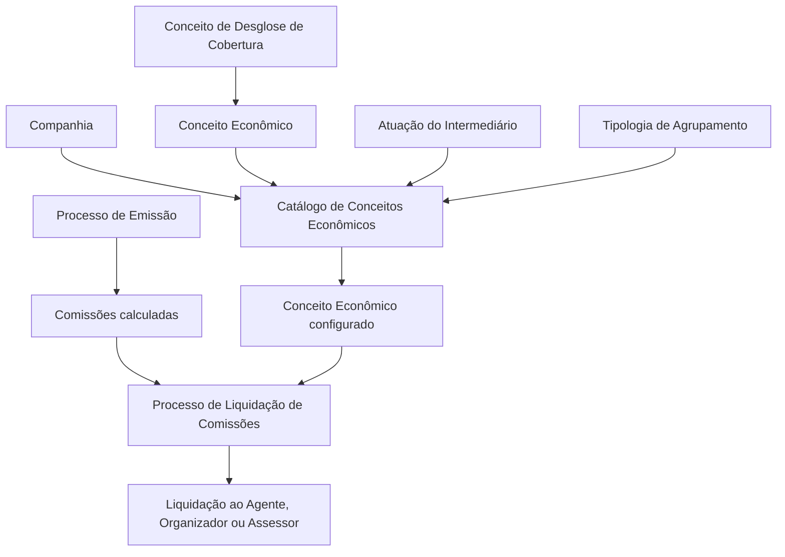

# Definição de Conceitos Econômicos para Liquidação de Comissões no REEF Core

## 1. Metadados do Documento
- **Arquivo de Origem:** Não identificado no conteúdo fornecido
- **Tipo de Documento:** Especificação Funcional
- **Domínio / Sistema:** REEF Core — Liquidação de Comissões
- **Público-Alvo:** Negócio, analistas funcionais, desenvolvedores e operação
- **Data/Versão Identificada:** Não identificada

---

## 2. Resumo Executivo & Contexto de Negócio

O documento descreve o catálogo de **Conceitos Econômicos** do REEF Core, utilizado como complemento às comissões calculadas durante o Processo de Emissão. Esse catálogo permite identificar e registrar importes econômicos que serão posteriormente liquidados ao intermediário no Processo de Liquidação de Comissões.

A liquidação dos importes de Conceitos Econômicos pode ser direcionada a três figuras de intermediação: Agente, Organizador ou Assessor. Os critérios de cálculo e de devengo são determinados pela entidade, mas o documento não detalha fórmulas, percentuais, eventos de devengo ou regras específicas de cálculo.

A configuração associa uma companhia, um Conceito Econômico e um Conceito de Desglose de cobertura. Também identifica a atuação do intermediário e a tipologia de agrupamento, cuja lista de valores é configurada corporativamente.

O catálogo suporta controle operacional e histórico por meio das propriedades de inabilitação e data de validade. A inabilitação impede a utilização de um registro; a data de validade determina a partir de quando o registro configurado torna-se operacional no sistema.

---

## 3. Arquitetura, Componentes & Tecnologias Envolvidas

### Componentes e processos identificados

| Componente / Processo | Papel descrito |
| :--- | :--- |
| REEF Core | Sistema que disponibiliza a identificação e o registro de Conceitos Econômicos. |
| Catálogo de Conceitos Econômicos | Estrutura de configuração dos conceitos econômicos afetos à Liquidação de Comissões. |
| Processo de Emissão | Processo no qual são calculadas as comissões complementadas pelos Conceitos Econômicos. |
| Processo de Liquidação de Comissões | Processo que liquida o importe do Conceito Econômico ao intermediário aplicável. |
| Conceito de Desglose de Cobertura | Origem do importe parcial ou total associado ao Conceito Econômico. |
| Entidade | Define os critérios de cálculo e devengo aplicáveis à liquidação. |
| Agente / Produtor | Figura potencialmente destinatária de importes, identificada pelo valor `P` na atuação do intermediário. |
| Organizador | Figura potencialmente destinatária de importes, identificada pelo valor `O`. |
| Assessor | Figura potencialmente destinatária de importes, identificada pelo valor `A`. |



> **Nota de Análise:** O documento não descreve interfaces, APIs, microsserviços, bancos de dados, contratos JSON, métodos HTTP, tecnologias de infraestrutura ou ambientes técnicos.

---

## 4. Regras de Negócio, Especificações Funcionais & Processos

1. O REEF Core permite identificar e registrar Conceitos Econômicos como complemento às comissões calculadas no Processo de Emissão.
2. Os importes dos Conceitos Econômicos são liquidados pelo seu valor ao Agente, Organizador ou Assessor durante o Processo de Liquidação de Comissões.
3. Os critérios de cálculo e devengo aplicáveis aos Conceitos Econômicos são determinados pela entidade.
4. O atributo **Companhia** contém o código da companhia para a qual está sendo definida a configuração dos Conceitos Econômicos afetos à Liquidação de Comissões.
5. O atributo **Conceito Econômico** identifica o conceito sobre o qual serão acumulados os importes dos Conceitos de Desglose associados.
6. O atributo **Conceito de Desglose / CF** identifica o Conceito de Desglose da Cobertura de onde provém o importe parcial ou total do Conceito Econômico.
7. A propriedade **Atuação do Intermediário** identifica a figura de intermediação afetada pelo Conceito Econômico:
   - `P`: Produtor.
   - `O`: Organizador.
   - `A`: Assessor.
8. A propriedade **Tipologia de Agrupamento** esclarece a procedência comercial do conteúdo econômico do conceito. Seus valores possíveis são configurados corporativamente, sem detalhamento no documento.
9. A propriedade **Inabilitação** determina que um registro configurado para um Conceito Econômico esteja desativado ou inabilitado para uso.
10. A propriedade **Data de Validade** determina a data a partir da qual o registro configurado fica operacional no sistema.
11. O uso correto da Data de Validade permite manter um histórico das alterações efetuadas ao longo do tempo.
12. A seção de perguntas frequentes informa que não há circunstâncias operativas adicionais a considerar para o catálogo: `N/A`.

---

## 5. Tabelas de Parâmetros, Ambientes e Estruturas de Dados

| Item / Parâmetro | Descrição / Função | Tipo / Valores / Formato | Ambiente / Observações |
| :--- | :--- | :--- | :--- |
| Companhia | Código da companhia para a qual é realizada a definição de Conceitos Econômicos. | Código de companhia; formato não detalhado. | Afeta o processo de Liquidação de Comissões. |
| Conceito Econômico | Conceito sobre o qual são acumulados os importes dos Conceitos de Desglose associados. | Identificador de conceito; formato não detalhado. | Configurado no catálogo. |
| Conceito de Desglose / CF | Identifica o Conceito de Desglose da Cobertura que origina o importe parcial ou total do Conceito Econômico. | Identificador de conceito; formato não detalhado. | Configurado no catálogo. |
| Atuação do Intermediário | Identifica a figura de intermediação afetada pelo Conceito Econômico. | `P` = Produtor; `O` = Organizador; `A` = Assessor. | Valor explicitamente definido no documento. |
| Tipologia de Agrupamento | Esclarece a procedência comercial do conteúdo econômico do conceito. | Valores configurados corporativamente; lista não fornecida. | Sem detalhamento adicional. |
| Inabilitação | Define que o registro de Conceito Econômico está desativado ou inabilitado para uso. | Estado de inabilitação; formato não detalhado. | Impede a utilização do registro. |
| Data de Validade | Define a data a partir da qual o registro de Conceito Econômico está operacional. | Data; formato não detalhado. | Permite histórico de alterações. |
| Critérios de cálculo e devengo | Regras que determinam a liquidação dos importes. | Determinados pela entidade; valores e fórmulas não detalhados. | Dependência de definição da entidade. |

---

## 6. Bateria de Perguntas & Respostas para RAG (FAQ Sintético)

### P1: Qual é o objetivo do catálogo de Conceitos Econômicos no REEF Core?
**R:** O catálogo permite identificar e registrar Conceitos Econômicos que complementam as comissões calculadas no Processo de Emissão. Os importes desses conceitos são considerados no Processo de Liquidação de Comissões.

### P2: Para quem os importes de Conceitos Econômicos podem ser liquidados?
**R:** Os importes podem ser liquidados ao Agente, Organizador ou Assessor, conforme a figura de intermediação afetada pela configuração do Conceito Econômico.

### P3: O que representa o atributo Companhia no catálogo?
**R:** Companhia contém o código da companhia sobre a qual está sendo definida a configuração dos Conceitos Econômicos afetos ao processo de Liquidação de Comissões.

### P4: Qual é a função do atributo Conceito Econômico?
**R:** Conceito Econômico identifica o conceito sobre o qual serão acumulados os importes provenientes dos Conceitos de Desglose associados.

### P5: De onde pode vir o importe parcial ou total de um Conceito Econômico?
**R:** O importe parcial ou total pode proceder do Conceito de Desglose da Cobertura identificado pelo atributo Conceito de Desglose / CF.

### P6: Quais são os valores possíveis para Atuação do Intermediário?
**R:** A atuação do intermediário pode assumir `P` para Produtor, `O` para Organizador ou `A` para Assessor.

### P7: Qual é o efeito da propriedade Inabilitação?
**R:** Inabilitação estabelece que o registro configurado para o Conceito Econômico está desativado ou inabilitado para ser utilizado.

### P8: Para que serve a Data de Validade de um Conceito Econômico?
**R:** A Data de Validade informa ao sistema a partir de qual data o registro configurado está operacional. Seu uso correto permite preservar o histórico das alterações realizadas ao longo do tempo.

### P9: Quem determina os critérios de cálculo e devengo dos Conceitos Econômicos?
**R:** Os critérios de cálculo e devengo são determinados pela entidade. O documento não especifica quais são esses critérios, fórmulas ou regras de cálculo.

### P10: Quais valores são aceitos para Tipologia de Agrupamento?
**R:** O documento informa que os valores possíveis são aqueles configurados corporativamente, mas não apresenta a lista de valores nem suas definições.

---

## 7. Glossário de Termos, Siglas & Conceitos-Chave

- **REEF Core:** Sistema citado como responsável por disponibilizar a identificação e o registro de Conceitos Econômicos.
- **Conceito Econômico:** Conceito configurado no catálogo para acumular importes de Conceitos de Desglose associados e participar da Liquidação de Comissões.
- **Conceito de Desglose:** Conceito de cobertura do qual procede o importe parcial ou total do Conceito Econômico.
- **CF:** Sigla apresentada associada a “Conceito de Desglose”; o documento não define seu significado.
- **Liquidação de Comissões:** Processo no qual os importes dos Conceitos Econômicos são liquidados ao intermediário aplicável.
- **Processo de Emissão:** Processo no qual são calculadas as comissões complementadas pelos Conceitos Econômicos.
- **Devengo:** Critério de reconhecimento aplicável à liquidação; o documento não detalha sua implementação.
- **Atuação do Intermediário:** Propriedade que identifica se a figura afetada é Produtor, Organizador ou Assessor.
- **Tipologia de Agrupamento:** Propriedade que clarifica a procedência comercial do conteúdo econômico do conceito.
- **Inabilitação:** Estado que torna um registro desativado ou indisponível para uso.
- **Data de Validade:** Data a partir da qual o registro configurado torna-se operacional.

---

## 8. Notas Críticas, Riscos & Limitações

- O documento não identifica arquivo de origem, versão, data, autor ou responsável.
- Não há detalhamento dos critérios de cálculo e devengo definidos pela entidade.
- Não há fórmulas, percentuais, exemplos de importes, regras de arredondamento ou cenários de exceção.
- A lista de valores corporativos para Tipologia de Agrupamento não é fornecida.
- O significado da sigla `CF` não é definido.
- Não são descritos contratos de integração, APIs, persistência de dados, permissões, perfis de acesso, logs ou procedimentos operacionais.
- A seção de perguntas frequentes declara `N/A` para circunstâncias operativas adicionais do catálogo.
- A seção “Vínculos” recomenda a leitura de diretrizes e documentos funcionais relacionados, pois a interpretação isolada do documento pode conduzir a erro; entretanto, esses documentos não são enumerados no conteúdo fornecido.

---

## 9. Conteúdo Bruto Estruturado (Referência Fiel)

```text
--- [PÁGINA 1 DE 2] ---

DEFINICIÓN de CONCEPTOS ECONÓMICOS /
LIQUIDACIÓN de COMISIONES
Objetivo
Funcionalmente Reef.core cuenta con la posibilidad de identificar y registrar, como complemento a
las comisiones calculadas en el Proceso de Emisión, conceptos económicos cuyos importes serán
liquidados por su importe al Agente, Organizador o Asesor en el Proceso de Liquidación de
Comisiones de acuerdo con los criterios de cálculo y devengo que determine la entidad.
Propiedades Operativas
Otras Propiedades
Propiedades Operativas
Compañía
Este Atributo del catálogo contiene el código de la compañía sobre la que se está realizando la
definición de los conceptos económicos afectos al proceso de Liquidación de Comisiones.
Concepto Económico
Este Atributo del Catálogo identifica el Concepto Económico sobre el que se acumularán los importes
de los conceptos de desglose asociados.
Concepto de Desglose
 / 
 CF
Home Solutions APIs Documentation Zeus
EN


--- [PÁGINA 2 DE 2] ---

Este Atributo del Catálogo identifica el Concepto de Desglose de la Cobertura del que procede el
importe parcial o total del Concepto Económico.
Actuación del Intermediario
Esta propiedad del Catálogo identifica la figura de intermediación afectada por el concepto
económico definido. Sus posibles valores son:
"P" - Productor.
"O" - Organizador.
"A" - Asesor.
Tipología de Agrupamiento
Esta Propiedad clarifica la procedencia comercial del contenido económico del concepto siendo sus
posibles valores aquellos configurados corporativamente.
Otras Propiedades
Inhabilitación
Esta propiedad establece que el Registro configurado para el Concepto Económico en el Catálogo
está desactivado o inhabilitado para ser utilizado.
Fecha de Validez
Esta propiedad le indica al Sistema la fecha a partir de la cual el registro configurado para el
Concepto Económico está operativo en el sistema por lo que su correcto uso permite tener un
histórico de los cambios efectuados a lo largo del tiempo.
Vínculos
Relación de Directrices y Documentos funcionales cuya lectura recomendada para evitar que la
interpretación aislada del presente documento pueda conducir a error.
Conceptos Económicos
Preguntas frecuentes
(1) ¿Existe alguna circunstancia operativa que deba ser tomada en consideración sobre este
catálogo?
N/A
```
