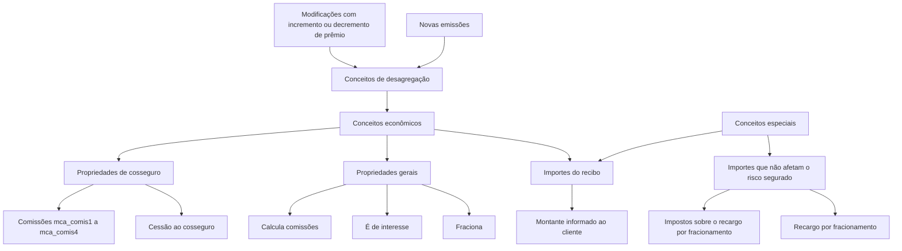

# Definição de Conceitos Econômicos de Recibo

## 1. Metadados do Documento
- **Arquivo de Origem:** `Não identificado`
- **Tipo de Documento:** `Especificação Técnica`
- **Domínio / Sistema:** `Conceitos econômicos de recibo / apólices`
- **Público-Alvo:** `Desenvolvedores, Arquitetos, Negócio e Operação`
- **Data/Versão Identificada:** `Não identificada`

---

## 2. Resumo Executivo & Contexto de Negócio

O documento define o conceito de **conceitos econômicos** empregados na composição de um recibo. Um recibo é formado por diversos importes que, quando somados, informam ao cliente o valor que deve ser pago.

Os conceitos econômicos são alimentados por conceitos de desagregação de apólices e aplicações. Esses conceitos de desagregação são gerados em novas emissões e em modificações cujo resultado represente aumento ou redução de prêmio.

A especificação caracteriza os conceitos econômicos como contêineres dos importes encontrados nos conceitos de desagregação. Também descreve conceitos especiais que podem conter importes que não afetam o risco segurado.

Entre os exemplos de importes não relacionados ao risco segurado estão o acréscimo aplicado pelo fracionamento do custo do seguro e os impostos incidentes sobre esse acréscimo de fracionamento. O documento também registra propriedades gerais, de definição e de cosseguro aplicáveis aos conceitos econômicos.

---

## 3. Arquitetura, Componentes & Tecnologias Envolvidas

Os componentes e entidades identificados no documento são:

- **Recibo:** estrutura composta por importes que informa o montante a ser satisfeito pelo cliente.
- **Conceito econômico:** contêiner de importes provenientes dos conceitos de desagregação.
- **Conceito de desagregação de apólice:** origem dos importes que alimentam os conceitos econômicos.
- **Conceito de desagregação de aplicação:** origem dos importes que alimentam os conceitos econômicos.
- **Novas emissões:** evento que gera conceitos de desagregação.
- **Modificações com incremento ou decremento de prêmio:** evento que gera conceitos de desagregação.
- **Cosseguro:** contexto para propriedades de cessão e cálculo de comissões.
- **Planos de pagamento:** contexto para a propriedade de cálculo de juros.



**Nota de Análise:** o documento não detalha tecnologias, APIs, métodos HTTP, contratos JSON, bancos de dados, ambientes ou integrações técnicas. As menções a “Home Solutions APIs Documentation Zeus” aparecem no conteúdo bruto, mas não possuem explicação adicional.

---

## 4. Regras de Negócio, Especificações Funcionais & Processos

### Composição do recibo

1. Um recibo é composto por uma série de importes.
2. A soma dos importes informa ao cliente o montante que deve ser satisfeito.
3. Esses importes são denominados **conceitos econômicos**.

### Origem dos conceitos econômicos

1. Os conceitos econômicos são alimentados pelos conceitos de desagregação de apólices e aplicações.
2. Os conceitos de desagregação são gerados:
   - em novas emissões;
   - em modificações cujo resultado implique incremento de prêmio;
   - em modificações cujo resultado implique decremento de prêmio.
3. Os conceitos econômicos funcionam como contêineres dos importes encontrados nos conceitos de desagregação.

### Conceitos especiais

1. Existem conceitos especiais que podem conter importes.
2. Esses conceitos especiais são reservados para importes que não afetam o risco segurado.
3. Os exemplos explícitos no documento são:
   - acréscimo aplicado quando o custo do seguro do risco é fracionado;
   - impostos aplicáveis ao acréscimo por fracionamento.

### Tipos de conceito

O documento apresenta os seguintes tipos de conceito:

- **n:** prima neta.
- **b:** bonificação.
- **r:** recargo.
- **i:** imposto.
- **t:** total.

### Regras associadas às propriedades gerais

- **Fracciona:** indica se o importe é fracionado ou se o importe total é transferido para o primeiro recibo.
- **Es de interés:** indica se o conceito é específico para cálculo de juros em planos de pagamento.
- **Calcula comisiones:** indica se são calculadas comissões; a propriedade é aplicável a conceitos do tipo `r`.

### Regras associadas às propriedades de cosseguro

- **Se cede al coaseguro:** indica se o conceito é cedido ou não ao cosseguro.
- **mca_comis1:** indica se calcula ou não a comissão 1 para o cosseguro.
- **mca_comis2:** indica se calcula ou não a comissão 2 para o cosseguro.
- **mca_comis3:** indica se calcula ou não a comissão 3 para o cosseguro.
- **mca_comis4:** indica se calcula ou não a comissão 4 para o cosseguro.

---

## 5. Tabelas de Parâmetros, Ambientes e Estruturas de Dados

| Item / Parâmetro | Descrição / Função | Tipo / Valores / Formato | Ambiente / Observações |
| :--- | :--- | :--- | :--- |
| Conceito econômico | Contêiner dos importes encontrados nos conceitos de desagregação. | Entidade de recibo | Alimentado por conceitos de desagregação de apólices e aplicações. |
| Nome | Nome do conceito econômico. | Texto | Propriedade de definição. |
| Abreviatura | Abreviatura do conceito econômico. | Texto | Propriedade de definição. |
| Sequência | Sequência do conceito econômico. | Não detalhado | Propriedade de definição. |
| Tipo de conceito | Classificação do conceito econômico. | `n`, `b`, `r`, `i`, `t` | Propriedade geral. |
| `n` | Prima neta. | Tipo de conceito | Exibido como `(N)Prima neta`. |
| `b` | Bonificação. | Tipo de conceito | Exibido como `(B)Bonificacion`. |
| `r` | Recargo. | Tipo de conceito | Exibido como `(R)Recargo`. |
| `i` | Imposto. | Tipo de conceito | Exibido como `(I)Impuesto`. |
| `t` | Total. | Tipo de conceito | Exibido como `(T)Total`. |
| Fracciona | Indica se o importe é fracionado ou se o total passa ao primeiro recibo. | Indicador; valores não detalhados | Propriedade geral. |
| Es de interés | Indica se o conceito é específico para cálculo de juros. | Indicador; valores não detalhados | Aplicável a planos de pagamento. |
| Calcula comisiones | Indica se são calculadas comissões. | Indicador; valores não detalhados | Aplicável a conceitos do tipo `r`. |
| Se cede al coaseguro | Indica se o conceito é cedido ao cosseguro. | Indicador; valores não detalhados | Propriedade de cosseguro. |
| `mca_comis1` | Indica se calcula a comissão 1 para o cosseguro. | Indicador; valores não detalhados | Propriedade de cosseguro. |
| `mca_comis2` | Indica se calcula a comissão 2 para o cosseguro. | Indicador; valores não detalhados | Propriedade de cosseguro. |
| `mca_comis3` | Indica se calcula a comissão 3 para o cosseguro. | Indicador; valores não detalhados | Propriedade de cosseguro. |
| `mca_comis4` | Indica se calcula a comissão 4 para o cosseguro. | Indicador; valores não detalhados | Propriedade de cosseguro. |

---

## 6. Bateria de Perguntas & Respostas para RAG (FAQ Sintético)

### P1: O que são conceitos econômicos no contexto de um recibo?
**R:** Conceitos econômicos são os importes que compõem um recibo. A soma desses importes informa ao cliente o montante que deve ser satisfeito. O documento também os caracteriza como contêineres dos importes encontrados nos conceitos de desagregação.

### P2: De onde provêm os importes dos conceitos econômicos?
**R:** Os conceitos econômicos são alimentados pelos conceitos de desagregação de apólices e aplicações. Os conceitos de desagregação são gerados em novas emissões e em modificações que resultem em incremento ou decremento de prêmio.

### P3: Quando são gerados conceitos de desagregação?
**R:** Os conceitos de desagregação são gerados em novas emissões e em modificações cujo resultado implique aumento ou redução do prêmio.

### P4: Conceitos econômicos podem conter importes que não afetam o risco segurado?
**R:** Sim. O documento informa que existem conceitos especiais que podem conter importes não relacionados ao risco segurado, como o recargo aplicado pelo fracionamento do custo do seguro e os impostos incidentes sobre esse recargo.

### P5: Quais são os tipos de conceito econômico apresentados?
**R:** O documento lista os tipos `n` para prima neta, `b` para bonificação, `r` para recargo, `i` para imposto e `t` para total.

### P6: O que a propriedade “Fracciona” controla?
**R:** A propriedade “Fracciona” indica se o importe é fracionado ou se o importe total passa para o primeiro recibo.

### P7: Qual é a finalidade da propriedade “Es de interés”?
**R:** “Es de interés” indica se o conceito econômico é específico para cálculo de juros em planos de pagamento.

### P8: A propriedade “Calcula comisiones” aplica-se a quais conceitos?
**R:** A propriedade “Calcula comisiones” indica se são calculadas comissões e é aplicável a conceitos do tipo `r`, identificado no documento como recargo.

### P9: Como o documento trata a cessão ao cosseguro?
**R:** A propriedade “Se cede al coaseguro” indica se o conceito econômico é cedido ou não ao cosseguro.

### P10: Para que servem os campos mca_comis1, mca_comis2, mca_comis3 e mca_comis4?
**R:** Os campos `mca_comis1`, `mca_comis2`, `mca_comis3` e `mca_comis4` indicam, respectivamente, se são calculadas as comissões 1, 2, 3 e 4 para o cosseguro.

### P11: Quais propriedades de definição são explicitamente apresentadas para um conceito econômico?
**R:** O documento apresenta as propriedades de definição “Nome”, “Abreviatura” e “Sequência” para o conceito econômico.

---

## 7. Glossário de Termos, Siglas & Conceitos-Chave

- **Conceito econômico:** contêiner dos importes encontrados nos conceitos de desagregação e componente da composição do recibo.
- **Conceito de desagregação:** conceito gerado em novas emissões ou em modificações com incremento ou decremento de prêmio; alimenta conceitos econômicos.
- **Recibo:** conjunto de importes cuja soma informa ao cliente o montante que deve ser satisfeito.
- **Prima neta / `n`:** tipo de conceito identificado no documento como “prima neta”.
- **Bonificação / `b`:** tipo de conceito identificado no documento como “bonificacion”.
- **Recargo / `r`:** tipo de conceito identificado no documento como “recargo”.
- **Imposto / `i`:** tipo de conceito identificado no documento como “impuesto”.
- **Total / `t`:** tipo de conceito identificado no documento como “total”.
- **Cosseguro:** contexto das propriedades de cessão e cálculo de comissões descritas no documento.
- **mca_comis1:** indicador de cálculo da comissão 1 para cosseguro.
- **mca_comis2:** indicador de cálculo da comissão 2 para cosseguro.
- **mca_comis3:** indicador de cálculo da comissão 3 para cosseguro.
- **mca_comis4:** indicador de cálculo da comissão 4 para cosseguro.

---

## 8. Notas Críticas, Riscos & Limitações

- O documento não identifica arquivo de origem, data, versão, autoria ou ambiente.
- O documento não define os valores permitidos, formato técnico ou comportamento padrão dos indicadores `Fracciona`, `Es de interés`, `Calcula comisiones`, `Se cede al coaseguro` e `mca_comis1` a `mca_comis4`.
- O documento não detalha fórmulas de cálculo para prêmio, bonificação, recargo, imposto, total, juros ou comissões.
- O documento não especifica contratos de integração, APIs, métodos HTTP, estruturas JSON, persistência de dados ou URLs de ambiente.
- **Nota de Análise:** o documento cita “Home Solutions APIs Documentation Zeus”, mas não explica a relação desse elemento com os conceitos econômicos.
- **Nota de Análise:** embora os conceitos especiais possam conter importes que não afetam o risco segurado, não são definidos critérios completos de elegibilidade, contabilização ou tratamento desses importes.

---

## 9. Conteúdo Bruto Estruturado (Referência Fiel)

```text
--- [PÁGINA 1 DE 4] ---

EN CONSTRUCCIÓN
DEFINICIÓN de Conceptos económicos
Objetivo
Un recibo está compuesto por una serie de importes que sumados informan al cliente del monto que
debe satisfacer. A estos importes se les denomina conceptos económicos. Los conceptos
económicos se alimentan de los conceptos de desglose de pólizas y aplicaciones. Estos conceptos
de desglose se generan en las nuevas emisiones y en aquellas modificaciones cuyo resultado
implica un incremento o decremento en la prima. Es decir, los conceptos económicos son
contenedores de los importes hallados en los conceptos de desglose.
 /
 CF
Home Solutions APIs Documentation Zeus
EN


--- [PÁGINA 2 DE 4] ---

Existen unos conceptos especiales que SI pueden hallar importes. Estos conceptos están reservados
para contener aquellos importes que no afectan al riesgo asegurado, contendrían por ejemplo el
recargo que se quiere aplicar si se fracciona el coste del seguro del riesgo y elementos adicionales
como los impuestos que aplican a ese recargo por fraccionamiento.
Propiedades de definición
Propiedades generales
Propiedades de coaseguro
Propiedades de definición
Concepto económico
concepto economico de recibo
Nombre
nombre del concepto economico
Abreviatura
abreviatura del concepto economico
Secuencia
secuencia
Propiedades generales
Tipo de concepto


--- [PÁGINA 3 DE 4] ---

tipo de concepto : n-prima neta, b-bonificacion, r-recargo, i-impuesto
(N)Prima neta
(B)Bonificacion
(R)Recargo
(I)Impuesto
(T)Total
(N)Prima neta
(B)Bonificacion
(R)Recargo
(I)Impuesto
(T)Total
Fracciona
indica si se fracciona o el importe total pasa al primer recibo
Es de interés
indica si el concepto es especifico para calculo de intereses (planes de pago)
Calcula comisiones
indica si se calculan comisiones (aplicable a conceptos tipo -r-)
Propiedades de coaseguro
Se cede al coaseguro
indica si se cede o no al coaseguro
mca_comis1
si calcula o no comision 1 para el coaseguro


--- [PÁGINA 4 DE 4] ---

mca_comis2
si calcula o no comision 2 para el coaseguro
mca_comis3
si calcula o no comision 3 para el coaseguro
mca_comis4
si calcula o no comision 4 para el coaseguro
```
