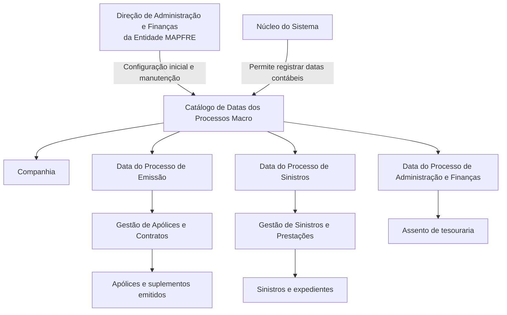

# Definição das Datas dos Processos Macro Contábeis da Entidade MAPFRE

## 1. Metadados do Documento
- **Arquivo de Origem:** Não identificado no conteúdo fornecido
- **Tipo de Documento:** Especificação Técnica / Documento Funcional
- **Domínio / Sistema:** Sistema contábil de companhias seguradoras; MAPFRE
- **Público-Alvo:** Administração e Finanças, Operação Contábil, Analistas Funcionais
- **Data/Versão Identificada:** Não identificada

---

## 2. Resumo Executivo & Contexto de Negócio

O documento descreve um catálogo de informação destinado à definição e à manutenção das datas contábeis dos processos macro de uma entidade seguradora. A atividade contábil é apresentada como responsável por registrar, classificar, resumir e analisar, quantitativa e qualitativamente, as operações financeiras realizadas pelas companhias de seguros.

O núcleo do sistema permite registrar as datas contábeis dos processos macro da entidade nesse catálogo específico. Segundo o documento, o catálogo é entregue inicialmente às instalações sem conteúdo, exigindo configuração inicial antes de sua utilização operacional.

Os atributos descritos vinculam uma companhia a datas ou períodos de fechamento usados na contabilização de processos relevantes: emissão de apólices e suplementos, sinistros e respectivos expedientes, e assentos de tesouraria associados à Administração e Finanças.

A responsabilidade pela configuração inicial e pela manutenção posterior do catálogo é atribuída à Direção de Administração e Finanças da entidade MAPFRE. O documento recomenda também a leitura de diretrizes e documentos funcionais relacionados, pois a interpretação isolada pode conduzir a erro.

---

## 3. Arquitetura, Componentes & Tecnologias Envolvidas

O conteúdo fornecido não descreve arquitetura de software, tecnologias, APIs, contratos HTTP, bases de dados, servidores ou ambientes técnicos. O documento apresenta uma relação funcional entre o catálogo de datas contábeis e os processos macro contábeis da entidade.

### Componentes e processos identificados

| Componente / Processo | Função identificada |
| :--- | :--- |
| Núcleo do Sistema | Permite registrar as datas contábeis dos processos macro da entidade em um catálogo específico. |
| Catálogo de Datas dos Processos | Repositório funcional para definição e manutenção das datas contábeis dos processos macro. É entregue inicialmente vazio. |
| Processo de Gestão de Apólices e Contratos | Processo no qual são emitidas apólices e suplementos contabilizados conforme a data do processo de emissão. |
| Processo de Gestão de Sinistros e Prestações | Processo no qual são identificados e contabilizados sinistros e seus expedientes conforme a data do processo de sinistros. |
| Processo de Administração e Finanças | Processo associado à contabilização do assento de tesouraria. |
| Direção de Administração e Finanças da Entidade MAPFRE | Área responsável pela configuração inicial e pela manutenção posterior do catálogo. |



> **Nota de Análise:** O documento não detalha a implementação técnica do catálogo, incluindo persistência, interfaces de usuário, permissões, integrações, métodos HTTP, contratos JSON ou mecanismos de validação.

---

## 4. Regras de Negócio, Especificações Funcionais & Processos

### 4.1 Finalidade contábil

A atividade contábil das companhias seguradoras é descrita como voltada ao registro, à classificação, ao resumo e à análise quantitativa e qualitativa das operações financeiras realizadas pelas companhias de seguros.

### 4.2 Configuração do catálogo

1. O núcleo do sistema possui a capacidade de registrar as datas contábeis dos processos macro da entidade.
2. As datas contábeis são registradas em um catálogo específico de informação.
3. O catálogo é entregue inicialmente às instalações vazio de conteúdo.
4. A configuração inicial do catálogo deve ser realizada pela Direção de Administração e Finanças da entidade MAPFRE.
5. A manutenção posterior do catálogo também é responsabilidade da Direção de Administração e Finanças da entidade MAPFRE.

### 4.3 Definição por companhia

O atributo **Companhia** armazena o código da companhia sobre a qual está sendo realizada a definição e/ou manutenção das datas dos processos macro.

### 4.4 Data do Processo de Emissão

A **Data do Processo de Emissão** especifica a data do período de fechamento utilizada para contabilizar:

- Apólices emitidas;
- Suplementos emitidos;
- Operações resultantes do Processo de Gestão de Apólices e Contratos.

### 4.5 Data do Processo de Sinistros

A **Data do Processo de Sinistros** contém a data do período de fechamento em que serão identificados e contabilizados:

- Sinistros;
- Expedientes de sinistros;
- Resultados do Processo de Gestão de Sinistros e Prestações da entidade.

### 4.6 Data do Processo de Administração e Finanças

A **Data do Processo de Administração e Finanças** contém o mês e o ano em que é contabilizado o assento de tesouraria.

### 4.7 Dependência documental

O documento menciona uma relação de diretrizes e documentos funcionais cuja leitura é recomendada. A finalidade dessa recomendação é evitar que uma interpretação isolada do documento leve a conclusões incorretas.

> **Nota de Análise:** Os nomes, conteúdos e vínculos concretos das diretrizes e dos documentos funcionais relacionados não foram fornecidos no conteúdo extraído.

---

## 5. Tabelas de Parâmetros, Ambientes e Estruturas de Dados

| Item / Parâmetro | Descrição / Função | Tipo / Valores / Formato | Ambiente / Observações |
| :--- | :--- | :--- | :--- |
| Companhia | Contém o código da companhia para a qual é realizada a definição e/ou a manutenção das datas dos processos macro. | Código da companhia; formato não detalhado. | Associado ao catálogo de datas dos processos macro. |
| Data do Processo de Emissão | Define a data do período de fechamento para contabilização de apólices e suplementos emitidos. | Data do período de fechamento; formato não detalhado. | Aplicável ao Processo de Gestão de Apólices e Contratos. |
| Data do Processo de Sinistros | Define a data do período de fechamento para identificação e contabilização de sinistros e seus expedientes. | Data do período de fechamento; formato não detalhado. | Aplicável ao Processo de Gestão de Sinistros e Prestações. |
| Data do Processo de Administração e Finanças | Define o mês e o ano de contabilização do assento de tesouraria. | Mês e ano; formato não detalhado. | Associada ao Processo de Administração e Finanças. |
| Catálogo de Datas dos Processos Macro | Catálogo específico de informação para registrar datas contábeis dos processos macro da entidade. | Estrutura de catálogo; atributos completos não detalhados além dos itens extraídos. | Entregue inicialmente vazio nas instalações. |
| Responsável pela configuração e manutenção | Área responsável por configurar inicialmente e manter posteriormente o catálogo. | Direção de Administração e Finanças da Entidade MAPFRE. | Responsabilidade operacional explicitamente indicada no documento. |

---

## 6. Bateria de Perguntas & Respostas para RAG (FAQ Sintético)

### P1: Qual é a finalidade do catálogo de datas dos processos macro?
**R:** O catálogo de datas dos processos macro permite registrar as datas contábeis dos processos macro da entidade. Essas datas são utilizadas para definir períodos de fechamento aplicáveis à contabilização de operações de emissão, sinistros e tesouraria.

### P2: Qual área é responsável pela configuração inicial do catálogo?
**R:** A configuração inicial do catálogo deve ser realizada pela Direção de Administração e Finanças da entidade MAPFRE.

### P3: Quem deve realizar a manutenção posterior do catálogo de datas dos processos?
**R:** A manutenção posterior do catálogo também deve ser realizada pela Direção de Administração e Finanças da entidade MAPFRE.

### P4: Em que estado o catálogo de datas é entregue inicialmente às instalações?
**R:** O catálogo específico de informação é entregue inicialmente às instalações vazio de conteúdo. Portanto, requer configuração inicial antes de conter definições de datas contábeis.

### P5: O que representa o atributo Companhia no catálogo?
**R:** O atributo Companhia contém o código da companhia sobre a qual está sendo realizada a definição e/ou a manutenção das datas dos processos macro.

### P6: Para que serve a Data do Processo de Emissão?
**R:** A Data do Processo de Emissão especifica a data do período de fechamento com a qual são contabilizadas as apólices e os suplementos emitidos no Processo de Gestão de Apólices e Contratos.

### P7: Quais elementos são contabilizados com a Data do Processo de Sinistros?
**R:** A Data do Processo de Sinistros contém a data do período de fechamento em que são identificados e contabilizados os sinistros e seus expedientes, como resultado do Processo de Gestão de Sinistros e Prestações da entidade.

### P8: O que é definido pela Data do Processo de Administração e Finanças?
**R:** A Data do Processo de Administração e Finanças contém o mês e o ano em que é contabilizado o assento de tesouraria.

### P9: Qual é o papel da atividade contábil nas companhias seguradoras segundo o documento?
**R:** A atividade contábil é projetada para registrar, classificar, resumir e analisar, de forma quantitativa e qualitativa, as operações financeiras realizadas nas companhias de seguros.

### P10: Por que é recomendada a leitura de diretrizes e documentos funcionais relacionados?
**R:** A leitura é recomendada para evitar que a interpretação isolada do documento sobre a definição das datas dos processos macro possa conduzir a erro.

### P11: O documento informa o formato técnico das datas ou dos códigos de companhia?
**R:** Não. O documento descreve a finalidade funcional da Companhia, da Data do Processo de Emissão, da Data do Processo de Sinistros e da Data do Processo de Administração e Finanças, mas não informa formatos de dados, máscaras, validações ou regras técnicas de preenchimento.

---

## 7. Glossário de Termos, Siglas & Conceitos-Chave

- **Companhia:** Entidade cujo código é registrado no catálogo para definição e manutenção das datas dos processos macro.
- **Data contábil:** Data registrada no catálogo para determinar o período de fechamento aplicável a um processo macro.
- **Data do Processo de Administração e Finanças:** Mês e ano em que é contabilizado o assento de tesouraria.
- **Data do Processo de Emissão:** Data do período de fechamento usada para contabilizar apólices e suplementos emitidos.
- **Data do Processo de Sinistros:** Data do período de fechamento usada para identificar e contabilizar sinistros e seus expedientes.
- **Expedientes:** Elementos associados aos sinistros que são identificados e contabilizados no Processo de Gestão de Sinistros e Prestações.
- **MAPFRE:** Entidade mencionada como responsável, por meio de sua Direção de Administração e Finanças, pela configuração e manutenção do catálogo.
- **Processos macro:** Processos da entidade cujas datas contábeis podem ser registradas no catálogo específico.
- **Suplementos:** Elementos emitidos no Processo de Gestão de Apólices e Contratos e contabilizados conforme a Data do Processo de Emissão.
- **Tesouraria:** Contexto do assento cuja contabilização é determinada pelo mês e ano definidos na Data do Processo de Administração e Finanças.

---

## 8. Notas Críticas, Riscos & Limitações

- O catálogo é entregue inicialmente vazio; a ausência de configuração inicial impede que o catálogo contenha datas contábeis definidas para os processos macro.
- A configuração e a manutenção dependem da Direção de Administração e Finanças da entidade MAPFRE.
- O documento recomenda consulta a diretrizes e documentos funcionais relacionados, pois sua interpretação isolada pode conduzir a erro.
- O conteúdo não identifica formatos de data, regras de validação, comportamento em caso de ausência de configuração, trilha de auditoria, permissões, telas, integrações ou contratos técnicos.
- O conteúdo extraído inclui termos de navegação aparentes — “CF”, “Home”, “Solutions”, “APIs”, “Documentation”, “Zeus”, “EN” — sem explicação funcional no documento. Esses termos não foram interpretados como componentes do processo.

---

## 9. Conteúdo Bruto Estruturado (Referência Fiel)

```text
--- [PÁGINA 1 DE 2] ---

DEFINICIÓN de las Fechas de los Procesos
La actividad contable de las compañías aseguradoras está diseñada para registrar, clasificar, resumir
y analizar en forma cuantitativa y cualitativa las operaciones financieras realizadas en las compañías
de seguros.
Funcionalmente, el núcleo del Sistema cuenta con la posibilidad de registrar las fechas contables de
los Procesos macro de la entidad en un catálogo de información específico que se entrega
inicialmente a las instalaciones vacío de contenido.
Compañía
Este Atributo del catálogo contiene el código de la compañía sobre la que se está realizando la
definición y/o mantenimiento de las Fechas de los Procesos Macro.
Fecha del Proceso de Emisión
Este Atributo especifica la Fecha del periodo de cierre con la que se van a contabilizar las pólizas y
los suplementos emitidos en el Proceso de Gestión de Pólizas y Contratos.
Fecha del Proceso de Siniestros
Esta propiedad contiene la Fecha del periodo de cierre en la que se van a identificar y contabilizar los
Siniestros y sus Expedientes, como resultado del Proceso de Gestión de Siniestros y Prestaciones
de la Entidad.
Fecha del Proceso de Administración y Finanzas
 / 
 CF
Home Solutions APIs Documentation Zeus
EN


--- [PÁGINA 2 DE 2] ---

Esta propiedad contiene el mes y año en que se contabiliza el asiento de tesorería.
Vínculos
Relación de Directrices y Documentos funcionales cuya lectura recomendada para evitar que la
interpretación aislada del presente documento pueda conducir a error.
Preguntas frecuentes
(1) ¿Existe alguna circunstancia operativa que deba ser tomada en consideración sobre este
catálogo?
La configuración inicial y su mantenimiento posterior lo debe realizar la Dirección de Administración y
Finanzas de la Entidad MAPFRE.
```
