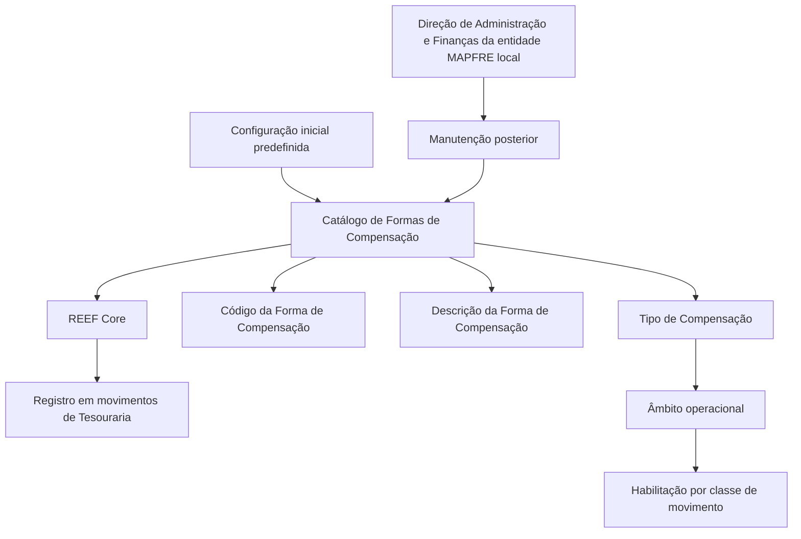

# Catálogo de Formas de Compensação para Movimentos de Tesouraria no REEF Core

## 1. Metadados do Documento
- **Arquivo de Origem:** Não identificado no conteúdo fornecido
- **Tipo de Documento:** Especificação Funcional
- **Domínio / Sistema:** REEF Core; Tesouraria; MAPFRE
- **Público-Alvo:** Negócio, Administração e Finanças, Operação e Desenvolvedores
- **Data/Versão Identificada:** Não identificada

---

## 2. Resumo Executivo & Contexto de Negócio

O documento define o catálogo de **Formas de Compensação** utilizado pelo núcleo do sistema REEF Core para registrar formas de compensação nos movimentos de Tesouraria da entidade. O catálogo é entregue inicialmente às instalações com conteúdo previamente configurado.

Cada forma de compensação possui, no mínimo, um código e uma descrição. O documento apresenta sete valores iniciais: cheque bancário, efetivo, transferência, contas de gestão, cartão, banco efetivo transferência e ficheiro bancário.

O atributo **Tipo de Compensação** identifica o âmbito operacional em que cada forma de compensação se enquadra. Esse atributo permite diferenciar para quais classes de movimentos o uso de uma forma de compensação é permitido ou habilitado.

Após a configuração inicial, a manutenção do catálogo é responsabilidade da **Direção de Administração e Finanças da entidade MAPFRE local**. O documento recomenda a leitura das diretrizes e documentos funcionais vinculados para evitar interpretações isoladas incorretas.

---

## 3. Arquitetura, Componentes & Tecnologias Envolvidas

Os elementos identificados são:

| Componente / Conceito | Papel identificado no documento |
| :--- | :--- |
| REEF Core | Sistema cujo núcleo permite registrar formas de compensação em movimentos de Tesouraria. |
| Catálogo de Formas de Compensação | Repositório de informação com conteúdo inicial predefinido para as instalações. |
| Movimentos de Tesouraria | Movimentos da entidade nos quais as formas de compensação são registradas. |
| Tipo de Compensação | Propriedade que define o âmbito operacional e a habilitação de uso para classes de movimentos. |
| Direção de Administração e Finanças | Área da entidade MAPFRE local responsável pela manutenção posterior da configuração inicial. |
| Entidade MAPFRE local | Entidade responsável pelo contexto operacional e pela manutenção posterior do catálogo. |



**Nota de Análise:** o documento não especifica arquitetura de infraestrutura, interfaces de usuário, APIs, métodos HTTP, contratos JSON, banco de dados, mecanismos de autenticação, ambientes técnicos ou tecnologias de implementação do REEF Core.

---

## 4. Regras de Negócio, Especificações Funcionais & Processos

### 4.1. Registro de formas de compensação

1. O núcleo do sistema REEF Core permite registrar formas de compensação.
2. As formas de compensação são utilizadas nos movimentos de Tesouraria da entidade.
3. O registro ocorre em um catálogo de informação.
4. O catálogo é entregue inicialmente às instalações com conteúdo predefinido.

### 4.2. Propriedades da forma de compensação

1. **Código da Forma de Compensação**
   - Contém o código da compensação.

2. **Descrição da Forma de Compensação**
   - Contém a denominação ou descrição da forma de compensação.

3. **Tipo de Compensação**
   - Identifica o âmbito operacional no qual a compensação se enquadra.
   - Permite diferenciar para quais classes de movimentos o uso da forma de compensação é permitido ou habilitado.

### 4.3. Configuração e manutenção

1. A configuração inicial do catálogo vem predefinida.
2. A manutenção posterior da configuração deve ser realizada pela Direção de Administração e Finanças da entidade MAPFRE local.
3. A interpretação do documento deve considerar diretrizes e documentos funcionais vinculados, pois a leitura isolada pode conduzir a erro.

### 4.4. Valores iniciais predefinidos

O REEF Core apresenta inicialmente sete formas de compensação predefinidas:

1. Cheque bancário.
2. Efetivo.
3. Por transferência.
4. Contas gestão.
5. Cartão.
6. Banco efetivo transferência.
7. Ficheiro bancário.

---

## 5. Tabelas de Parâmetros, Ambientes e Estruturas de Dados

| Item / Parâmetro | Descrição / Função | Tipo / Valores / Formato | Ambiente / Observações |
| :--- | :--- | :--- | :--- |
| Código da Forma de Compensação | Contém o código da compensação. | Valores iniciais: 1 a 7. | Associado ao catálogo de formas de compensação. |
| Descrição da Forma de Compensação | Contém a denominação ou descrição da forma de compensação. | Texto descritivo. | Associada ao respectivo código. |
| Tipo de Compensação | Identifica o âmbito operacional da compensação. | Não detalhado. | Define para quais classes de movimentos a forma de compensação pode ser usada. |
| Catálogo de Formas de Compensação | Armazena as formas de compensação para movimentos de Tesouraria. | Conteúdo inicial predefinido. | Entregue inicialmente às instalações. |
| Manutenção posterior | Atualização posterior da configuração do catálogo. | Processo de administração funcional. | Responsabilidade da Direção de Administração e Finanças da entidade MAPFRE local. |

| Código de Compensação | Descrição da Forma de Compensação | Tipo de Compensação | Observações |
| :--- | :--- | :--- | :--- |
| 1 | CHEQUE BANCÁRIO | Não detalhado | Valor inicial predefinido no REEF Core. |
| 2 | EFECTIVO | Não detalhado | Valor inicial predefinido no REEF Core. |
| 3 | POR TRANSFERENCIA | Não detalhado | Valor inicial predefinido no REEF Core. |
| 4 | CUENTAS GESTIÓN | Não detalhado | Valor inicial predefinido no REEF Core. |
| 5 | TARJETA | Não detalhado | Valor inicial predefinido no REEF Core. |
| 6 | BANCO EFECTIVO TRANSFERENCIA | Não detalhado | Valor inicial predefinido no REEF Core. |
| 7 | FICHERO BANCARIO | Não detalhado | Valor inicial predefinido no REEF Core. |

---

## 6. Bateria de Perguntas & Respostas para RAG (FAQ Sintético)

### P1: Qual é a finalidade do catálogo de Formas de Compensação no REEF Core?
**R:** O catálogo de Formas de Compensação permite ao núcleo do sistema REEF Core registrar as formas de compensação utilizadas nos movimentos de Tesouraria da entidade.

### P2: Quais propriedades são identificadas para uma Forma de Compensação?
**R:** O documento identifica o Código da Forma de Compensação, a Descrição da Forma de Compensação e o Tipo de Compensação. O código contém o identificador da compensação, a descrição contém sua denominação e o tipo identifica seu âmbito operacional.

### P3: O que representa o Tipo de Compensação?
**R:** O Tipo de Compensação identifica o âmbito operacional em que a compensação se enquadra. Essa propriedade diferencia para quais classes de movimentos o uso de uma forma de compensação é permitido ou habilitado.

### P4: Quais formas de compensação são predefinidas inicialmente no REEF Core?
**R:** Os valores iniciais são: 1 — CHEQUE BANCÁRIO; 2 — EFECTIVO; 3 — POR TRANSFERENCIA; 4 — CUENTAS GESTIÓN; 5 — TARJETA; 6 — BANCO EFECTIVO TRANSFERENCIA; e 7 — FICHERO BANCARIO.

### P5: A configuração inicial do catálogo pode ser alterada?
**R:** O documento informa que a configuração inicial é predefinida e que sua manutenção posterior deve ser realizada pela Direção de Administração e Finanças da entidade MAPFRE local. O documento não detalha o procedimento técnico para alteração.

### P6: Qual área é responsável pela manutenção posterior das formas de compensação?
**R:** A Direção de Administração e Finanças da entidade MAPFRE local é responsável pela manutenção posterior da configuração inicialmente predefinida.

### P7: Em que contexto operacional as formas de compensação são usadas?
**R:** As formas de compensação são registradas nos movimentos de Tesouraria da entidade, dentro do núcleo do sistema REEF Core.

### P8: O documento define os métodos HTTP ou contratos de integração do catálogo?
**R:** Não. O documento descreve o catálogo funcionalmente, mas não detalha APIs, métodos HTTP, contratos JSON, interfaces, persistência de dados ou mecanismos de integração.

### P9: Por que o documento recomenda consultar diretrizes e documentos funcionais vinculados?
**R:** A recomendação existe para evitar que a interpretação isolada do documento conduza a erro. O conteúdo fornecido não identifica quais diretrizes ou documentos funcionais estão vinculados.

### P10: O documento informa quais classes de movimentos aceitam cada Tipo de Compensação?
**R:** Não. O documento afirma que o Tipo de Compensação permite diferenciar as classes de movimentos para as quais uma forma de compensação é permitida ou habilitada, mas não apresenta o mapeamento dessas classes.

---

## 7. Glossário de Termos, Siglas & Conceitos-Chave

- **REEF Core:** Sistema cujo núcleo permite registrar formas de compensação nos movimentos de Tesouraria da entidade.
- **Forma de Compensação:** Modalidade registrada no catálogo para utilização em movimentos de Tesouraria.
- **Catálogo de Formas de Compensação:** Catálogo de informação entregue inicialmente com conteúdo predefinido para registrar formas de compensação.
- **Código da Forma de Compensação:** Propriedade que contém o código da compensação.
- **Descrição da Forma de Compensação:** Propriedade que contém a denominação ou descrição da forma de compensação.
- **Tipo de Compensação:** Propriedade que identifica o âmbito operacional da compensação e sua habilitação para classes de movimentos.
- **Tesouraria:** Contexto de movimentos da entidade no qual são registradas as formas de compensação.
- **MAPFRE local:** Entidade MAPFRE local cuja Direção de Administração e Finanças realiza a manutenção posterior do catálogo.
- **Direção de Administração e Finanças:** Área responsável pela manutenção posterior da configuração inicial do catálogo.

---

## 8. Notas Críticas, Riscos & Limitações

- O documento afirma que a leitura isolada pode conduzir a erro e recomenda a consulta de diretrizes e documentos funcionais vinculados, mas não apresenta esses documentos no conteúdo fornecido.
- O documento não detalha os valores possíveis, regras de atribuição ou classes de movimentos associadas ao atributo **Tipo de Compensação**.
- Não há procedimento operacional ou técnico para manutenção do catálogo após a configuração inicial.
- Não foram identificados detalhes sobre permissões, trilha de auditoria, validações, persistência de dados, integrações, APIs, URLs, ambientes, logs ou tratamento de erros.
- A designação “BANCO EFECTIVO TRANSFERENCIA” é apresentada literalmente como uma descrição predefinida; o documento não explica seu significado operacional.
- Os textos “CF”, “Home Solutions APIs Documentation Zeus” e “EN” aparecem na extração original, mas não possuem contexto funcional suficiente para serem classificados como componentes, integrações ou requisitos.

---

## 9. Conteúdo Bruto Estruturado (Referência Fiel)

```text
--- [PÁGINA 1 DE 2] ---

DEFINICIÓN de las Formas de Compensación
Funcionalmente, el núcleo del Sistema cuenta con la posibilidad de registrar las formas de
Compensación en los movimientos de la Tesorería de la Entidad en un catálogo de información que
se entrega inicialmente a las instalaciones con su contenido prefijado.
Código de la Forma de Compensación
Esta propiedad contiene el código de la compensación.
Descripción de la Forma de Compensación
Esta propiedad contiene la denominación o descripción de la forma de compensación.
Los valores inicialmente prefijados en Reef.core son:
COMPENSACIÓN DESCRIPCIÓN
1 CHEQUE BANCARIO
2 EFECTIVO
3 POR TRANSFERENCIA
4 CUENTAS GESTIÓN
 /
 CF
Home Solutions APIs Documentation Zeus
EN


--- [PÁGINA 2 DE 2] ---

COMPENSACIÓN DESCRIPCIÓN
5 TARJETA
6 BANCO EFECTIVO TRANSFERENCIA
7 FICHERO BANCARIO
Tipo de Compensación
Esta propiedad identifica el ámbito operativo en el que se inscriben las compensaciones pudiendo de
esta manera diferenciar para qué clase de movimientos el empleo de la forma de compensación está
permitido o habilitado.
Vínculos
Relación de Directrices y Documentos funcionales cuya lectura recomendada para evitar que la
interpretación aislada del presente documento pueda conducir a error.
Preguntas frecuentes
(1) ¿Existe alguna circunstancia operativa que deba ser tomada en consideración sobre este
catálogo?
La configuración inicial viene prefijada. Su posterior mantenimiento lo debe realizar la Dirección de
Administración y Finanzas de la Entidad MAPFRE local.
```
