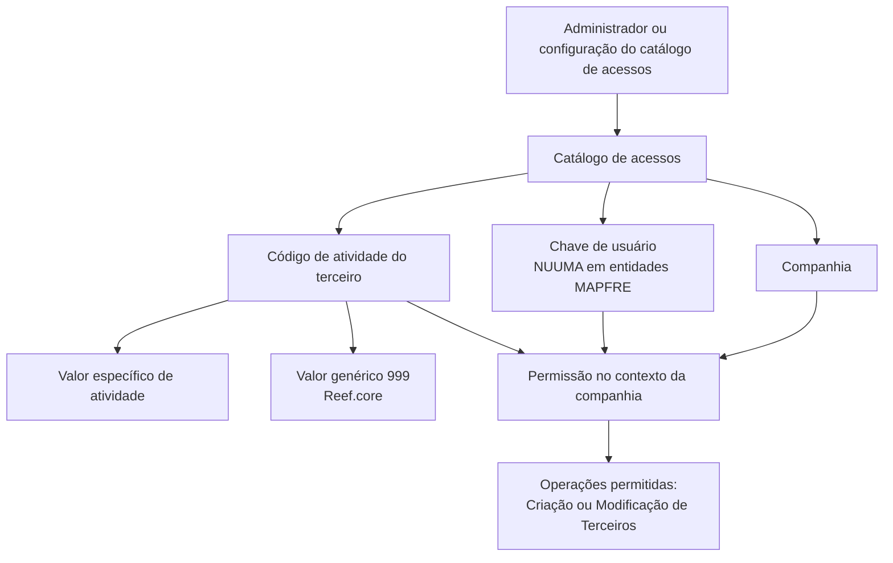
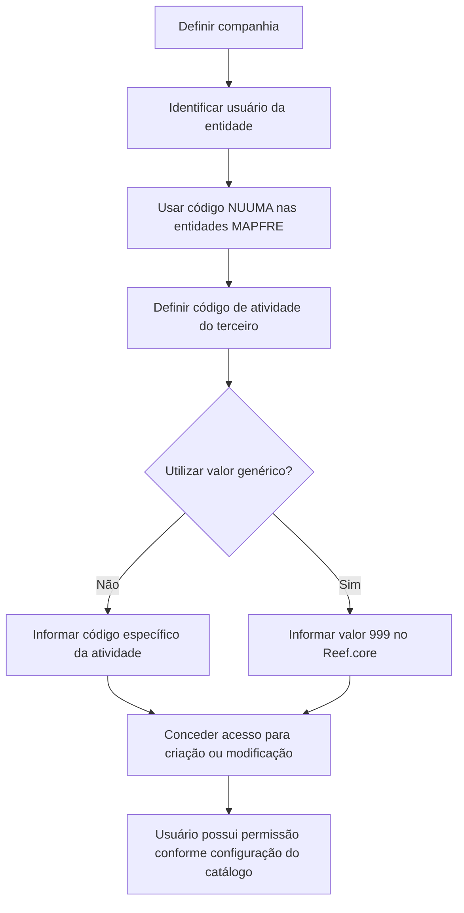

# Atribuição de Acessos para Criação e Modificação de Terceiros no Reef.core

## 1. Metadados do Documento
- **Arquivo de Origem:** `Não identificado`
- **Tipo de Documento:** `Especificação Funcional`
- **Domínio / Sistema:** `Reef.core / Gestão de acessos a atividades de terceiros`
- **Público-Alvo:** `Negócio, Administração de Acessos, Operação e Desenvolvedores`
- **Data/Versão Identificada:** `Não identificada`

---

## 2. Resumo Executivo & Contexto de Negócio

O documento descreve o catálogo de acessos utilizado pelo núcleo do sistema para associar usuários de uma entidade às atividades de terceiros para as quais possuem permissão de criação ou modificação. O objetivo é controlar quais operações cada usuário pode executar sobre registros de terceiros conforme a atividade associada.

A configuração do acesso é composta por três dados identificativos: companhia, chave de usuário e código de atividade. A companhia determina o contexto organizacional no qual a permissão é atribuída; a chave de usuário identifica o usuário destinatário do acesso; e o código de atividade identifica a atividade de terceiro abrangida pela permissão.

Nas entidades MAPFRE, o código de usuário é denominado `NUUMA`. O documento recomenda que a codificação de usuários no catálogo seja consistente com a identificação existente no diretório ativo da entidade, reduzindo ambiguidades de identidade e favorecendo a manutenção operacional.

O sistema Reef.core permite o uso do valor genérico `999` para o atributo de código de atividade. A finalidade declarada para esse valor genérico é minimizar a manutenção do catálogo de acessos.

O documento também referencia “Actividades de Terceros” como diretriz ou documento funcional relacionado, cuja leitura é recomendada. Não há detalhamento dos métodos de criação ou modificação, dos fluxos de aprovação, dos contratos de integração nem dos mecanismos técnicos de autenticação ou autorização.

---

## 3. Arquitetura, Componentes & Tecnologias Envolvidas

### Componentes e conceitos identificados

| Componente / Conceito | Função identificada |
| :--- | :--- |
| Sistema núcleo | Possui a capacidade de associar e atribuir permissões de criação ou modificação aos usuários da entidade. |
| Catálogo de acessos | Repositório ou mecanismo de configuração que contém os atributos usados para atribuir permissões. |
| Companhia | Código da companhia sobre a qual é realizada a atribuição da permissão de acesso. |
| Usuário da entidade | Destinatário da permissão de acesso às atividades de terceiros. |
| NUUMA | Denominação do código de usuário nas entidades MAPFRE. |
| Código de atividade | Identificador da atividade do terceiro sobre a qual a permissão é concedida. |
| Reef.core | Sistema que permite o uso do valor genérico `999` na definição do código de atividade. |
| Diretório ativo da entidade | Fonte de referência recomendada para a codificação dos usuários no catálogo. |
| Actividades de Terceros | Documento ou diretriz funcional relacionada, cuja leitura é recomendada. |



> **Nota de Análise:** O documento não descreve a implementação técnica do catálogo de acessos, o modelo de persistência, endpoints, métodos HTTP, tecnologias de autenticação, trilhas de auditoria ou critérios de precedência entre permissões específicas e o valor genérico `999`.

---

## 4. Regras de Negócio, Especificações Funcionais & Processos

### Regras de atribuição de acesso

1. O núcleo do sistema permite associar usuários de uma entidade às atividades de terceiros.
2. A associação determina sobre quais atividades de terceiros os usuários poderão possuir permissão de criação ou modificação.
3. A atribuição de permissão é contextualizada pela companhia informada no catálogo de acessos.
4. A chave de usuário identifica o usuário ao qual a permissão de acesso é concedida.
5. Nas entidades MAPFRE, a chave ou código de usuário é denominada `NUUMA`.
6. O código de atividade indica a atividade do terceiro abrangida pela permissão de acesso.
7. O Reef.core permite a utilização do valor genérico `999` na definição do atributo de código de atividade.
8. O uso do valor genérico `999` tem como finalidade minimizar a manutenção do catálogo.
9. Como boa prática, os usuários devem ser codificados no catálogo da mesma forma como são identificados no diretório ativo da entidade.
10. A leitura do documento funcional relacionado “Actividades de Terceros” é recomendada para evitar interpretações incorretas decorrentes da análise isolada desta entrada.

### Fluxo funcional extraído



> **Nota de Análise:** O documento não especifica se criação e modificação são permissões independentes ou uma permissão única. Também não detalha quais atividades são abrangidas pelo código `999`, nem informa condições de exclusão, revogação, expiração ou aprovação de acessos.

---

## 5. Tabelas de Parâmetros, Ambientes e Estruturas de Dados

| Item / Parâmetro | Descrição / Função | Tipo / Valores / Formato | Ambiente / Observações |
| :--- | :--- | :--- | :--- |
| Companhia | Código da companhia sobre a qual é realizada a atribuição da permissão de acesso. | Código de companhia; formato não especificado. | Utilizado no catálogo de acessos. |
| Chave de Usuário | Código do usuário da entidade que receberá a permissão de acesso. | Código de usuário; formato não especificado. | Denominado `NUUMA` nas entidades MAPFRE. |
| Código de Atividade | Código que identifica no sistema a atividade do terceiro. | Código de atividade; formato não especificado. | Pode usar o valor genérico `999` no Reef.core. |
| Valor `999` | Valor genérico permitido para a definição do código de atividade. | Valor numérico genérico: `999`. | Seu uso visa minimizar a manutenção do catálogo. |
| Permissão de criação | Permissão mencionada para operações sobre terceiros. | Regra funcional; formato não especificado. | A concessão depende da associação do usuário à atividade. |
| Permissão de modificação | Permissão mencionada para operações sobre terceiros. | Regra funcional; formato não especificado. | A concessão depende da associação do usuário à atividade. |
| Diretório ativo da entidade | Referência recomendada para a codificação de usuários. | Diretório corporativo; tecnologia não especificada. | Os códigos no catálogo devem seguir a mesma identificação do diretório ativo. |
| Reef.core | Sistema que permite o emprego do valor genérico `999`. | Sistema corporativo. | Não há versão, URL ou ambiente informados. |
| Actividades de Terceros | Documento ou diretriz funcional relacionada. | Referência documental. | Leitura recomendada para interpretação correta do catálogo. |

---

## 6. Bateria de Perguntas & Respostas para RAG (FAQ Sintético)

### P1: Qual é a finalidade do catálogo de acessos descrito no documento?
**R:** O catálogo de acessos permite associar usuários de uma entidade às atividades de terceiros sobre as quais esses usuários podem ter permissões de criação ou modificação. A configuração define o contexto de companhia, o usuário destinatário e a atividade de terceiro abrangida.

### P2: Quais dados identificativos são necessários para atribuir uma permissão de acesso?
**R:** O documento identifica três dados: companhia, chave de usuário e código de atividade. A companhia define o contexto organizacional, a chave de usuário identifica o destinatário da permissão e o código de atividade identifica a atividade de terceiro afetada.

### P3: O que representa o atributo Companhia no catálogo de acessos?
**R:** O atributo Companhia contém o código da companhia sobre a qual está sendo realizada a atribuição da permissão de acesso. O documento não informa o formato técnico desse código.

### P4: O que é NUUMA no contexto das entidades MAPFRE?
**R:** NUUMA é a denominação usada nas entidades MAPFRE para o código de usuário ao qual é concedida a permissão de acesso no catálogo.

### P5: Qual recomendação existe para cadastrar usuários no catálogo de acessos?
**R:** A recomendação é codificar os usuários no catálogo da mesma maneira como eles são identificados no diretório ativo da entidade. Essa prática promove consistência entre a identidade corporativa e a configuração de acessos.

### P6: Para que serve o código de atividade?
**R:** O código de atividade indica no sistema a atividade do terceiro sobre a qual o usuário poderá contar com permissão de criação ou modificação.

### P7: O que significa utilizar o valor 999 no código de atividade?
**R:** O Reef.core permite utilizar o valor genérico `999` na definição do código de atividade. Segundo o documento, a finalidade desse uso é minimizar a manutenção do catálogo de acessos.

### P8: O documento define quais operações podem ser autorizadas para um usuário?
**R:** Sim. O documento menciona permissões para operações de criação ou modificação de terceiros. Contudo, ele não detalha se essas permissões podem ser configuradas separadamente nem informa os critérios técnicos de autorização.

### P9: O documento informa como o valor genérico 999 é interpretado pelo sistema?
**R:** Não. O documento apenas informa que o Reef.core permite o emprego do valor genérico `999` para minimizar a manutenção do catálogo. Não são descritas as atividades cobertas, regras de prioridade ou limitações desse valor.

### P10: Existe algum documento relacionado que deve ser consultado?
**R:** Sim. O documento referencia “Actividades de Terceros” como uma diretriz ou documento funcional cuja leitura é recomendada para evitar interpretações equivocadas da presente entrada quando analisada isoladamente.

### P11: O documento fornece URLs, ambientes, servidores ou APIs para a gestão de acessos?
**R:** Não. O conteúdo fornecido não apresenta URLs, nomes de servidores, ambientes, portas, APIs, métodos HTTP, contratos JSON ou mecanismos de integração.

### P12: O documento explica como revogar ou aprovar permissões de acesso?
**R:** Não. O documento descreve a associação e atribuição de permissões de criação ou modificação, mas não detalha processos de aprovação, revogação, expiração, auditoria ou segregação de funções.

---

## 7. Glossário de Termos, Siglas & Conceitos-Chave

- **Actividades de Terceros:** Documento ou diretriz funcional relacionada às atividades de terceiros; sua leitura é recomendada.
- **Catálogo de acessos:** Estrutura utilizada para registrar a associação entre companhia, usuário e código de atividade para fins de concessão de acesso.
- **Chave de Usuário:** Código que identifica o usuário da entidade que recebe a permissão de acesso.
- **Código de Atividade:** Propriedade que indica no sistema o código da atividade do terceiro.
- **Companhia:** Código da companhia sobre a qual é efetuada a atribuição da permissão de acesso.
- **Diretório ativo:** Referência corporativa de identidade de usuários que deve orientar a codificação no catálogo.
- **MAPFRE:** Entidade ou contexto organizacional no qual o código de usuário é denominado `NUUMA`.
- **NUUMA:** Denominação do código de usuário nas entidades MAPFRE.
- **Reef.core:** Sistema que permite o uso do valor genérico `999` na definição do código de atividade.
- **Terceiros:** Entidades associadas a atividades sobre as quais usuários podem possuir permissões de criação ou modificação.
- **Valor genérico `999`:** Valor permitido no código de atividade pelo Reef.core para minimizar a manutenção do catálogo.

---

## 8. Notas Críticas, Riscos & Limitações

- O documento não identifica o nome do arquivo de origem, data, versão, autor ou área responsável.
- Não há detalhamento sobre o significado funcional completo do valor genérico `999`, incluindo sua abrangência, prioridade e possíveis exceções.
- Não são especificados formatos, tamanhos, obrigatoriedade ou validações para os campos companhia, chave de usuário e código de atividade.
- O documento não descreve processos de criação, alteração, revogação, aprovação ou auditoria das permissões do catálogo.
- Não há informação sobre mecanismos de autenticação, autorização, logs, trilha de auditoria, APIs, banco de dados, integrações ou ambientes.
- A interpretação isolada do documento pode conduzir a erro; o próprio conteúdo recomenda a leitura do documento funcional “Actividades de Terceros”.
- A recomendação de alinhar os códigos de usuário ao diretório ativo deve ser tratada como prática operacional relevante para evitar inconsistências de identidade.
- **Nota de Análise:** O documento lista o Reef.core e o valor `999`, porém não detalha como o sistema processa esse valor durante a autorização de criação ou modificação de terceiros.

---

## 9. Conteúdo Bruto Estruturado (Referência Fiel)

```text
--- [PÁGINA 1 DE 2] ---

ASIGNACIÓN de Accesos a las Operaciones de
Creación y Modificación de Terceros
Contexto
El núcleo del Sistema cuenta con la posibilidad de asociar y asignar a los Usuarios de la Entidad
cuales van a ser las Actividades de los Terceros sobre las que van a poder contar con permisos de
Creación o Modificación.
Datos Identificativos
Compañía
Este Atributo del catálogo de accesos contiene el código de la compañía sobre la cual se está
realizando la asignación del permiso de acceso.
Clave de Usuario
Este Atributo del catálogo contiene el código del Usuario, denominado 'NUUMA' en las entidades
MAPFRE, al que se concede el permiso de acceso.
Código de Actividad
Esta propiedad indica en el sistema el código de la Actividad del Tercero.
 /
 CF
Home Solutions APIs Documentation Zeus
EN


--- [PÁGINA 2 DE 2] ---

Reef.core permite el empleo del valor genérico 999 en la definición de este atributo para minimizar
el mantenimiento del catálogo.
Vínculos
Relación de Directrices y Documentos funcionales cuya lectura recomendada para evitar que la
interpretación aislada de la presente entrada pueda conducir a error.
Actividades de Terceros
Preguntas frecuentes
(1) ¿Existe alguna recomendación que pueda ser tomada en consideración en el uso y definición del
Catálogo de Usuarios de la Entidad?
Es una buena práctica codificar a los usuarios en este catálogo de la misma manera con la que se
identifica a los usuarios en el directorio activo de la Entidad.
Consejo:
```
