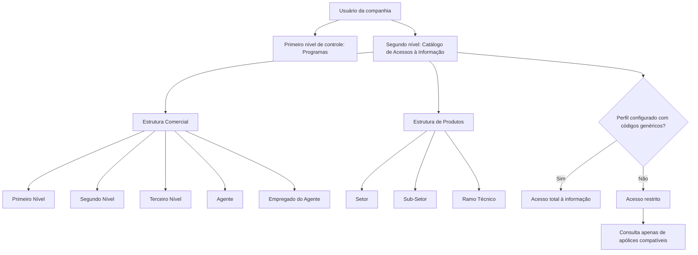

# Catálogo de Acessos à Informação de Usuários — Reef.core

## 1. Metadados do Documento
- **Arquivo de Origem:** `Não identificado no conteúdo fornecido`
- **Tipo de Documento:** `Manual Operacional`
- **Domínio / Sistema:** `Reef.core`
- **Público-Alvo:** `Operação, Administradores de Acesso, Negócio`
- **Data/Versão Identificada:** `Não identificada`

---

## 2. Resumo Executivo & Contexto de Negócio

O documento descreve o catálogo de acessos à informação de usuários no sistema Reef.core. O mecanismo complementa um primeiro controle de acesso já implementado no nível de Programas, acrescentando um segundo nível de controle direcionado à informação consultada por cada usuário da companhia.

O segundo nível de controle utiliza definições das estruturas Comercial e de Produtos. A concessão de acesso pode ser configurada para uma combinação de atributos comerciais e de produtos, restringindo a consulta às apólices que atendam às condições atribuídas ao usuário.

Para conceder acesso total a um usuário, o perfil de acesso deve ser configurado na tabela com códigos genéricos. Quando o acesso é configurado para uma estrutura Comercial ou de Produtos específica, o usuário somente poderá acessar informações das apólices compatíveis com essas restrições.

O documento apresenta exemplos de configurações possíveis: acesso limitado à Oficina Comercial à qual o usuário está vinculado; consulta de todas as apólices independentemente da oficina comercial; acesso a apólices de um único Ramo Técnico; ou consulta de apólices associadas ao Setor de Não Vida.

A recomendação operacional explícita é privilegiar a restrição de acesso à informação, em vez de conceder acesso sem restrições.

---

## 3. Arquitetura, Componentes & Tecnologias Envolvidas

Os elementos identificados no documento são:

- **Reef.core:** sistema que disponibiliza o segundo nível de controle de acesso à informação.
- **Programas:** nível de controle de acesso previamente implementado.
- **Catálogo de Acessos à Informação:** catálogo utilizado para atribuir permissões de consulta a usuários da companhia.
- **Estrutura Comercial:** referência para delimitar acesso por níveis comerciais, agente e empregado do agente.
- **Estrutura de Produtos:** referência para delimitar acesso por setor, subsetor e ramo técnico.
- **Usuário da companhia:** entidade à qual os acessos são atribuídos.
- **Apólices:** informação objeto das restrições de consulta.
- **Tabela de perfil de acesso:** estrutura mencionada para configurar acesso total mediante códigos genéricos.



> **Nota de Análise:** O documento não detalha telas, métodos HTTP, contratos de integração, banco de dados, tecnologias de implementação ou algoritmo de avaliação das combinações de acesso.

---

## 4. Regras de Negócio, Especificações Funcionais & Processos

1. O Reef.core possui um primeiro controle de acesso implementado no nível de Programas.
2. O Catálogo de Acessos à Informação adiciona um segundo nível de controle de acesso para cada usuário da companhia.
3. O segundo nível de controle utiliza definições realizadas nas Estruturas Comercial e de Produtos.
4. O acesso total de um usuário deve ser configurado na tabela de perfil de acesso mediante códigos genéricos.
5. Quando o acesso for configurado para uma estrutura Comercial específica, o usuário somente poderá consultar informações de apólices que cumpram as restrições comerciais configuradas.
6. Quando o acesso for configurado para uma estrutura de Produtos específica, o usuário somente poderá consultar informações de apólices que cumpram as restrições de produtos configuradas.
7. A estrutura Comercial contempla os atributos Primeiro Nível, Segundo Nível, Terceiro Nível, Agente e Empregado do Agente.
8. A estrutura de Produtos contempla os atributos Setor, Sub-Setor e Ramo Técnico.
9. O documento exemplifica que um usuário pode receber acesso somente às apólices da Oficina Comercial à qual está vinculado.
10. O documento exemplifica que um usuário pode receber acesso a todas as apólices, independentemente da oficina comercial à qual pertencem.
11. O documento exemplifica que um usuário pode receber acesso às apólices pertencentes a somente um Ramo Técnico.
12. O documento exemplifica que um usuário pode receber acesso às apólices vinculadas ao Setor de Não Vida.
13. A recomendação de configuração é priorizar restrições de acesso à informação em vez de permissões sem restrições.

---

## 5. Tabelas de Parâmetros, Ambientes e Estruturas de Dados

| Item / Parâmetro | Descrição / Função | Tipo / Valores / Formato | Ambiente / Observações |
| :--- | :--- | :--- | :--- |
| Companhia | Código da companhia sobre a qual é realizada a atribuição da permissão de acesso. | Código de companhia | Dados identificativos |
| Chave de Usuário | Código do usuário da companhia ao qual são atribuídas permissões de acesso. | Código de usuário | Dados identificativos |
| Chave do Primeiro Nível | Código que identifica o Primeiro Nível da Estrutura Comercial no sistema. | Código | Propriedade operacional |
| Chave do Segundo Nível | Código que identifica o Segundo Nível da Estrutura Comercial no sistema. | Código | Propriedade operacional |
| Chave do Terceiro Nível | Código que identifica o Terceiro Nível da Estrutura Comercial no sistema. | Código | Propriedade operacional |
| Chave de Agente | Chave do intermediário conforme configuração previamente estabelecida. | Chave de intermediário | Propriedade operacional |
| Empregado do Agente | Chave do empregado do intermediário conforme configuração definida na criação ou modificação de um agente. | Chave de empregado | Propriedade operacional |
| Setor | Chave do Setor conforme a Estrutura de Produtos da entidade configurada no sistema. | Chave de setor | Propriedade operacional |
| Sub-Setor | Chave do Sub-Setor conforme a Estrutura de Produtos da entidade. | Chave de subsetor | Propriedade operacional |
| Ramo Técnico | Código do Ramo Técnico conforme a Estrutura de Produtos configurada para a entidade. | Código de ramo técnico | Propriedade operacional |
| Códigos genéricos | Configuração utilizada para conceder acesso total ao usuário. | Não detalhado | Configuração na tabela de perfil de acesso |
| Oficina Comercial | Referência comercial usada no exemplo de restrição de acesso a apólices. | Não detalhado | Exemplo funcional |
| Setor de Não Vida | Setor mencionado como exemplo de consulta de apólices. | Setor de produtos | Exemplo funcional |

---

## 6. Bateria de Perguntas & Respostas para RAG (FAQ Sintético)

### P1: Qual é a finalidade do Catálogo de Acessos à Informação no Reef.core?
**R:** O Catálogo de Acessos à Informação permite configurar um segundo nível de controle de acesso para cada usuário da companhia. Esse nível complementa o controle já implementado no nível de Programas e restringe quais informações de apólices cada usuário pode consultar.

### P2: Como conceder acesso total à informação para um usuário?
**R:** Para conceder acesso total, o perfil de acesso do usuário deve ser configurado na tabela utilizando códigos genéricos. O documento não detalha quais são os códigos genéricos específicos.

### P3: O que ocorre quando um usuário recebe uma configuração para uma Estrutura Comercial específica?
**R:** Quando o acesso é configurado para uma Estrutura Comercial específica, o usuário somente poderá acessar informações de apólices que cumpram as restrições comerciais configuradas para esse usuário.

### P4: Quais atributos da Estrutura Comercial podem ser usados no controle de acesso?
**R:** O documento identifica os atributos Chave do Primeiro Nível, Chave do Segundo Nível, Chave do Terceiro Nível, Chave de Agente e Empregado do Agente como propriedades operacionais relacionadas à Estrutura Comercial.

### P5: Quais atributos da Estrutura de Produtos podem restringir a consulta de apólices?
**R:** A Estrutura de Produtos utiliza os atributos Setor, Sub-Setor e Ramo Técnico. Esses atributos identificam elementos da estrutura de produtos da entidade configurada no sistema.

### P6: É possível restringir um usuário à sua própria Oficina Comercial?
**R:** Sim. O documento apresenta como exemplo a configuração de um usuário para acessar e consultar somente as apólices da Oficina Comercial à qual o usuário está vinculado.

### P7: Um usuário pode consultar todas as apólices independentemente da oficina comercial?
**R:** Sim. O documento apresenta como exemplo uma configuração na qual o usuário pode acessar e consultar todas as apólices, independentemente da oficina à qual as apólices pertencem comercialmente.

### P8: É possível limitar o acesso a um único Ramo Técnico?
**R:** Sim. O documento apresenta como exemplo uma configuração que permite ao usuário acessar informações de apólices pertencentes a somente um Ramo Técnico.

### P9: Qual é a recomendação para configurar o Catálogo de Acessos à Informação?
**R:** A recomendação explícita é privilegiar a restrição no acesso à informação por parte dos usuários, em vez de conceder acesso sem restrições.

### P10: O que representa o atributo Companhia?
**R:** O atributo Companhia contém o código da companhia sobre a qual está sendo realizada a atribuição da permissão de acesso.

### P11: O que representa a Chave de Usuário?
**R:** A Chave de Usuário contém o código do usuário da companhia ao qual as permissões de acesso estão sendo atribuídas.

### P12: Quais documentos funcionais relacionados devem ser consultados?
**R:** O documento recomenda a leitura de Estructura Comercial, Estructura Productos, Actividades de los Terceros e Preguntas frecuentes, para evitar interpretações incorretas decorrentes da consulta isolada desta entrada.

---

## 7. Glossário de Termos, Siglas & Conceitos-Chave

- **Reef.core:** Sistema mencionado como responsável por permitir a definição do segundo nível de controle de acesso à informação.
- **Catálogo de Acessos à Informação:** Catálogo utilizado para atribuir permissões de consulta de informações a usuários da entidade.
- **Primeiro nível de controle:** Controle de acesso previamente implementado no nível de Programas.
- **Segundo nível de controle:** Controle adicional de acesso à informação, definido para cada usuário conforme estruturas Comercial e de Produtos.
- **Estrutura Comercial:** Estrutura usada para restringir acessos por níveis comerciais, agente e empregado do agente.
- **Estrutura de Produtos:** Estrutura usada para restringir acessos por Setor, Sub-Setor e Ramo Técnico.
- **Apólice:** Informação consultável cuja visibilidade pode ser restringida pelas configurações de acesso.
- **Agente / Intermediário:** Entidade identificada pela Chave de Agente, conforme configuração previamente estabelecida.
- **Empregado do Agente:** Empregado do intermediário identificado conforme configuração definida ao criar ou modificar um Agente.
- **Setor:** Elemento da Estrutura de Produtos da entidade.
- **Sub-Setor:** Elemento da Estrutura de Produtos da entidade.
- **Ramo Técnico:** Elemento da Estrutura de Produtos configurada para a entidade.
- **Códigos genéricos:** Códigos utilizados na tabela de perfil de acesso para conceder acesso total.

---

## 8. Notas Críticas, Riscos & Limitações

- O documento recomenda expressamente a adoção de acesso restrito como prática preferencial, em detrimento da concessão de acesso sem restrições.
- A leitura isolada do documento pode levar a interpretações incorretas; por isso, são recomendados documentos relacionados sobre Estrutura Comercial, Estrutura de Produtos, Atividades de Terceiros e Perguntas Frequentes.
- O documento não identifica os códigos genéricos utilizados para acesso total.
- O documento não especifica a lógica exata de combinação entre atributos comerciais e atributos de produtos.
- O documento não detalha métodos técnicos, integrações, telas, contratos de dados, APIs, persistência ou mecanismos de auditoria.
- O documento cita “Home Solutions APIs Documentation Zeus” no conteúdo bruto, sem detalhar sua relação com o Catálogo de Acessos à Informação.

---

## 9. Conteúdo Bruto Estruturado (Referência Fiel)

```text
--- [PÁGINA 1 DE 3] ---

ASIGNACIÓN de Accesos a las Operaciones de
Consulta de Información
Contexto
Además del primer control de acceso implementado a nivel de los Programas, Reef.core permite
definir para cada Usuario de la compañía un segundo nivel de Control en el Acceso a la información,
de acuerdo con las definiciones realizadas en las Estructuras Comercial y de Productos.
Si se desea conceder a un Usuario el acceso total se debe configurar su perfil de acceso en la Tabla
utilizando los códigos genéricos, en cambio, si se configura su acceso para una estructura Comercial
o de Productos en particular el usuario sólo tendrá acceso a la información de las pólizas que
cumplan con estas restricciones.
De esta manera, con las posibles combinaciones resultantes y a modo de ejemplos, se puede
configurar el sistema para que un Usuario determinado pueda acceder y consultar las pólizas 1.)
únicamente de la Oficina Comercial a la que está adscrito, 2.) acceder y Consultar en cambio todas
las pólizas independientemente de la oficina a la que pertenecen comercialmente, 3.) Acceder a la
información de aquellas pólizas pertenecientes a un Ramo Técnico y solamente a uno y 4.) o bien
que pueda consultar en cambio todas aquellas pólizas adscritas al Sector de No Vida,...
Datos Identificativos
Propiedades Operativas
Datos Identificativos
Compañía
 /
 CF
Home Solutions APIs Documentation Zeus
EN


--- [PÁGINA 2 DE 3] ---

Este Atributo del catálogo de accesos contiene el código de la compañía sobre la cual se está
realizando la asignación del permiso de acceso.
Clave de Usuario
Este Atributo del catálogo contiene el código del Usuario de la compañía al que se están asignando
los permisos de acceso.
Propiedades Operativas
Clave del Primer Nivel
Este atributo contiene el código por el que se identifica el Primer Nivel de la Estructura Comercial en
el Sistema.
Clave del Segundo Nivel
Este atributo contiene el el código por el que se identifica el Segundo Nivel de la Estructura
Comercial en el Sistema.
Clave del Tercer Nivel
Este atributo contiene el el código por el que se identifica el Tercer Nivel de la Estructura Comercial
en el Sistema.
Clave de Agente
Esta propiedad identifica la clave del intermediario de acuerdo con la configuración previamente
establecida.
Empleado del Agente
Esta propiedad identifica la clave del Empleado del Intermediario de acuerdo con la configuración de
las mismas previamente establecidas al crear/modificar un Agente.
Sector
Esta propiedad identifica la clave del Sector de acuerdo con la Estructura de Productos de la entidad
que se está configurando en el Sistema.
Sub-Sector
Este atributo identifica en el sistema la clave del Sub-Sector de acuerdo con la Estructura de
Productos de la entidad.
Ramo Técnico


--- [PÁGINA 3 DE 3] ---

Este atributo contiene el código del Ramo Técnico de acuerdo con la Estructura de Productos
configurada para la entidad.
Vínculos
Relación de Directrices y Documentos funcionales cuya lectura recomendada para evitar que la
interpretación aislada de la presente entrada pueda conducir a error.
Estructura Comercial
Estructura Productos
Actividades de los Terceros
Preguntas frecuentes
(1) ¿Existe alguna recomendación que pueda ser tomada en consideración en el uso y configuración
del Catálogo de Accesos a la Información de los Usuarios de la Entidad?
Se debe primar la restricción en el acceso a la información por parte de los usuarios, frente a la
concesión de acceso sin restricciones.
```
