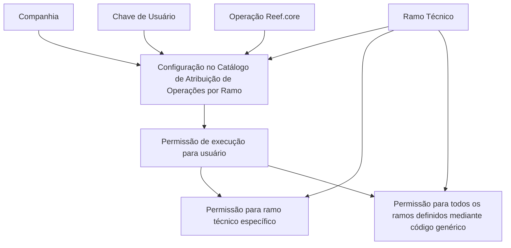

# Atribuição de Acessos às Operações do Reef.core por Ramo Técnico e Usuário

## 1. Metadados do Documento
- **Arquivo de Origem:** Não identificado no conteúdo extraído
- **Tipo de Documento:** Especificação Técnica / Procedimento Funcional
- **Domínio / Sistema:** Reef.core — Catálogo de Atribuição de Operações por Ramo
- **Público-Alvo:** Usuários da Entidade, analistas funcionais, administradores de configuração e equipes de operação
- **Data/Versão Identificada:** Não identificada

---

## 2. Resumo Executivo & Contexto de Negócio

O documento descreve a funcionalidade de atribuição de acessos às operações existentes no Reef.core. A funcionalidade permite definir se usuários de uma entidade possuem ou não permissões de execução sobre todas ou apenas parte das operações disponíveis no sistema.

A configuração de acessos é realizada por meio de um catálogo que relaciona informações de companhia, ramo técnico, usuário e operação Reef.core. Esses atributos determinam o escopo da autorização concedida a cada usuário.

O ramo técnico é um elemento central da configuração porque integra a chave primária (*Primary-Key*) do catálogo. Dessa forma, uma mesma operação pode ser habilitada para um usuário em um ramo técnico específico ou, alternativamente, para todos os ramos técnicos definidos mediante indicação de um código genérico.

O documento recomenda a leitura das diretrizes e dos documentos funcionais vinculados. Essa recomendação existe porque a interpretação isolada da especificação pode conduzir a erro. O material fornecido não detalha os valores permitidos, o formato dos códigos, o nome do código genérico, o processo de manutenção do catálogo, nem métodos técnicos de integração.

---

## 3. Arquitetura, Componentes & Tecnologias Envolvidas

Os componentes e conceitos explicitamente citados são:

- **Reef.core:** Sistema que possui operações e a funcionalidade de atribuir permissões de execução.
- **Catálogo de Atribuição de Operações por Ramo:** Catálogo utilizado para configurar permissões de acesso dos usuários.
- **Usuários da Entidade:** Usuários cujas permissões de execução são configuradas.
- **Companhia:** Código da companhia sobre a qual a configuração de acesso é realizada.
- **Ramo Técnico:** Código do ramo técnico usado para delimitar o acesso e integrante da chave primária do catálogo.
- **Chave de Usuário:** Código do usuário que receberá ou não permissão.
- **Operação Reef.core:** Chave da operação definida no Reef.core que será associada à permissão.
- **Código genérico:** Valor não especificado que permite habilitar operações para todos os ramos definidos.



> **Nota de Análise:** O conteúdo descreve a configuração funcional de permissões, mas não apresenta arquitetura de infraestrutura, APIs, bancos de dados, tecnologias de implementação, protocolos, métodos HTTP, contratos JSON, URLs ou ambientes.

---

## 4. Regras de Negócio, Especificações Funcionais & Processos

### 4.1 Objetivo funcional

O Reef.core possui a faculdade de atribuir aos Usuários da Entidade permissões de execução sobre as operações existentes. A atribuição pode determinar que um usuário:

1. Possua permissão para executar todas as operações existentes.
2. Possua permissão para executar apenas parte das operações existentes.
3. Não possua permissão de execução para determinadas operações, conforme a configuração aplicada no catálogo.

### 4.2 Escopo da configuração de acesso

A configuração de acessos é realizada considerando os seguintes elementos:

1. O código da **companhia** para a qual a configuração está sendo realizada.
2. O código do **ramo técnico** para o qual o acesso do usuário está sendo permitido.
3. O código do **usuário** que será associado à configuração.
4. A chave da **operação Reef.core** definida no sistema.

### 4.3 Regra de segmentação por ramo técnico

O ramo técnico faz parte da chave primária do Catálogo de Atribuição de Operações por Ramo. Como consequência:

- É possível habilitar as operações de um usuário para um ramo técnico particular.
- É possível habilitar as operações de um usuário para todos os ramos definidos quando a configuração indicar o código genérico.
- O documento não informa qual é o valor, formato, nomenclatura ou convenção do código genérico.

### 4.4 Dependências documentais

O documento informa a existência de vínculos com diretrizes e documentos funcionais. A leitura desses materiais é recomendada para evitar que a interpretação isolada desta especificação produza conclusões incorretas.

> **Nota de Análise:** O conteúdo não apresenta os nomes, links, identificadores ou conteúdos das diretrizes e dos documentos funcionais vinculados.

---

## 5. Tabelas de Parâmetros, Ambientes e Estruturas de Dados

| Item / Parâmetro | Descrição / Função | Tipo / Valores / Formato | Ambiente / Observações |
| :--- | :--- | :--- | :--- |
| Catálogo de Atribuição de Operações por Ramo | Catálogo utilizado para configurar acessos dos usuários às operações do Reef.core. | Não especificado. | A configuração considera companhia, ramo técnico, chave de usuário e operação Reef.core. |
| Companhia | Contém o código da companhia sobre a qual a configuração dos acessos está sendo realizada. | Código; formato não especificado. | Aplicável à configuração de acesso. |
| Ramo Técnico | Contém o código do ramo técnico ao qual está sendo permitido o acesso ao usuário. | Código; formato não especificado. | Integra a chave primária do catálogo. Pode receber código genérico para todos os ramos definidos. |
| Chave de Usuário | Contém o código do usuário. | Código; formato não especificado. | Identifica o usuário da entidade sujeito à configuração. |
| Operação Reef.core | Contém a chave da operação definida no Reef.core. | Chave de operação; formato não especificado. | Representa a operação à qual a permissão de execução se aplica. |
| Código genérico | Permite habilitar operações de um usuário para todos os ramos definidos. | Valor não especificado. | O documento não informa o código concreto nem regras de validação. |
| Permissão de execução | Define se o usuário pode ou não executar todas ou parte das operações existentes. | Regra funcional; valores técnicos não especificados. | A documentação não informa mecanismo de autorização, prioridade de regras ou comportamento em conflito. |

---

## 6. Bateria de Perguntas & Respostas para RAG (FAQ Sintético)

### P1: Qual é o objetivo da atribuição de acessos às operações no Reef.core?
**R:** A atribuição de acessos permite definir se os Usuários da Entidade terão ou não permissões de execução sobre todas ou parte das operações existentes no Reef.core.

### P2: Quais informações compõem a configuração de acesso no Catálogo de Atribuição de Operações por Ramo?
**R:** A configuração utiliza o código da companhia, o código do ramo técnico, a chave de usuário e a chave da operação definida no Reef.core.

### P3: O que representa o atributo Companhia no catálogo de acessos?
**R:** O atributo Companhia contém o código da companhia sobre a qual está sendo realizada a configuração dos acessos às operações do Reef.core.

### P4: Para que serve o atributo Ramo Técnico na atribuição de operações?
**R:** O atributo Ramo Técnico contém o código do ramo técnico para o qual o acesso ao usuário está sendo permitido. O ramo técnico também faz parte da chave primária do catálogo.

### P5: É possível conceder uma operação a um usuário somente para um ramo técnico específico?
**R:** Sim. Como o ramo técnico integra a chave primária do catálogo, as operações de um usuário podem ser habilitadas para um ramo técnico particular.

### P6: Como habilitar operações para um usuário em todos os ramos definidos?
**R:** O documento informa que as operações podem ser habilitadas para todos os ramos definidos quando for indicado o código genérico na configuração. O valor desse código genérico não é especificado.

### P7: O que identifica a Chave de Usuário no catálogo?
**R:** A Chave de Usuário contém o código do usuário para o qual a configuração de permissão de execução será aplicada.

### P8: O que é a Operação Reef.core na configuração de acesso?
**R:** A Operação Reef.core é a propriedade que contém a chave da operação definida no Reef.core à qual a configuração de acesso se refere.

### P9: O documento informa quais operações Reef.core existem?
**R:** Não. O conteúdo apenas informa que a propriedade Operação Reef.core contém a chave de uma operação definida no sistema, sem listar as operações disponíveis.

### P10: Qual é a recomendação para interpretar corretamente o catálogo de atribuição de operações?
**R:** A recomendação é consultar as diretrizes e os documentos funcionais vinculados, pois a interpretação isolada do documento pode conduzir a erro.

### P11: O documento informa métodos HTTP, contratos JSON ou APIs para administrar os acessos?
**R:** Não. O conteúdo não detalha APIs, métodos HTTP, contratos JSON, endpoints, tecnologias ou mecanismos técnicos de manutenção do catálogo.

### P12: O documento define como resolver conflitos entre configurações de acesso?
**R:** Não. O conteúdo não especifica regras de prioridade, negação explícita, herança, conflitos entre registros ou comportamento para configurações duplicadas.

---

## 7. Glossário de Termos, Siglas & Conceitos-Chave

- **Reef.core:** Sistema citado como responsável por possuir operações e permitir a atribuição de permissões de execução aos usuários.
- **Catálogo de Atribuição de Operações por Ramo:** Catálogo usado para configurar permissões de acesso às operações do Reef.core considerando companhia, ramo técnico, usuário e operação.
- **Usuários da Entidade:** Usuários para os quais as permissões de execução das operações são configuradas.
- **Companhia:** Código da companhia sobre a qual a configuração de acessos é realizada.
- **Ramo Técnico:** Código que identifica o ramo para o qual se permite o acesso a um usuário; integra a chave primária do catálogo.
- **Chave de Usuário:** Código identificador de um usuário.
- **Operação Reef.core:** Chave de uma operação definida no Reef.core.
- **Primary-Key:** Termo usado no documento para indicar a chave primária do catálogo; o ramo técnico faz parte dessa chave.
- **Código genérico:** Código mencionado como mecanismo para habilitar operações de um usuário para todos os ramos definidos; seu valor não é informado.

---

## 8. Notas Críticas, Riscos & Limitações

- O documento não identifica arquivo de origem, autor, data, versão, ambiente ou responsável pela manutenção do catálogo.
- O conteúdo não define o formato dos códigos de companhia, ramo técnico, usuário ou operação Reef.core.
- O valor concreto do código genérico para todos os ramos não é apresentado.
- Não há detalhamento sobre criação, alteração, exclusão, consulta ou aprovação de registros no catálogo.
- Não são informadas regras de precedência ou resolução de conflitos entre configurações de acesso.
- Não são especificados comportamentos para ausência de configuração, usuário inexistente, ramo técnico inválido, operação inexistente ou companhia inválida.
- O documento não descreve autenticação, autorização técnica, auditoria, trilhas de log, integração, APIs, interfaces de usuário ou persistência de dados.
- A interpretação isolada do documento é explicitamente considerada potencialmente sujeita a erro; a leitura das diretrizes e documentos funcionais vinculados é recomendada.

---

## 9. Conteúdo Bruto Estruturado (Referência Fiel)

```text
--- [PÁGINA 1 DE 2] ---

ASIGNACIÓN de ACCESOS a las
OPERACIONES de Reef.core
Objetivo
Funcionalmente Reef.core cuenta con la facultad de asignar a los [Usuarios de la Entidad][Usuarios]
si van a poder contar o no con permisos de ejecución sobre todas o parte de las Operaciones
existentes.
Propiedades
Propiedades
Compañía
Este Atributo del catálogo contiene el código de la compañía sobre la cual se está realizando la
configuración de los accesos.
Ramo Técnico
Esta propiedad del catálogo contiene el código del Ramo Técnico al que se está permitiendo el
acceso al Usuario.
Clave de Usuario
Este Atributo del catálogo contiene el código del Usuario.
 / 
 CF
Home Solutions APIs Documentation Zeus
EN


--- [PÁGINA 2 DE 2] ---

Operación Reef.core
Esta Propiedad del catálogo contiene la clave de la Operación definida en Reef.core.
Vínculos
Relación de Directrices y Documentos funcionales cuya lectura recomendada para evitar que la
interpretación aislada del presente documento pueda conducir a error.
Usuarios
Preguntas frecuentes
(1) ¿Existe alguna recomendación que pueda ser tomada en consideración en el uso y configuración
del Catálogo de Asignación de Operaciones por Ramo en Reef.core a los Usuarios de la Entidad?
Puesto que este catálogo contempla el Ramo Técnico como parte de su Primary-Key se pueden
habilitar las operaciones de un usuario para un ramo en particular o para todos los ramos definidos si
se indica el código genérico en su configuración.
```
