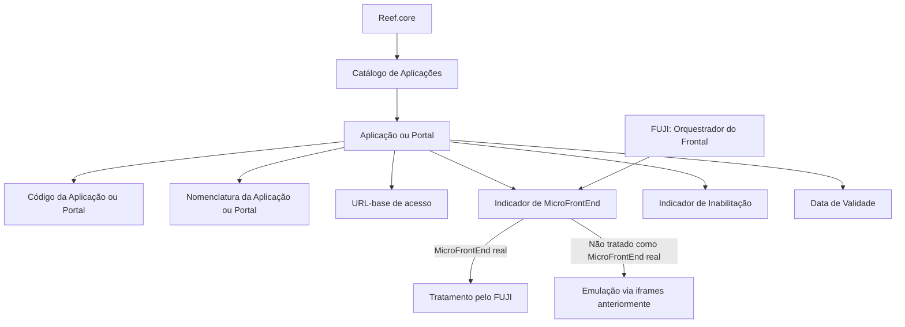

# Catálogo de Aplicações e Portais do Reef.core — Definição de Propriedades Operacionais

## 1. Metadados do Documento
- **Arquivo de Origem:** Não identificado
- **Tipo de Documento:** Especificação Técnica
- **Domínio / Sistema:** Reef.core
- **Público-Alvo:** Desenvolvedores, Arquitetos, Operação e equipes responsáveis pela configuração de catálogos
- **Data/Versão Identificada:** Não identificada

---

## 2. Resumo Executivo & Contexto de Negócio

O documento descreve o **Catálogo de Aplicações do Reef.core**, um repositório de informação destinado a codificar e administrar a relação entre aplicações de software do sistema. O catálogo registra aplicações ou portais por meio de propriedades operativas e outras propriedades de controle.

As propriedades operativas identificadas incluem o código da aplicação ou portal, a nomenclatura associada, a URL-base de acesso e a indicação de que uma aplicação ou portal é um **MicroFrontEnd**. Essas informações permitem caracterizar aplicações como GDC, TSY, LSS e SPL dentro do contexto do Reef.core.

O documento estabelece que o **FUJI**, identificado como orquestrador do frontal do Reef.core, utiliza a propriedade de MicroFrontEnd para determinar se pode tratar uma aplicação como um MicroFrontEnd real. Quando essa condição não é atendida, o texto informa que anteriormente existia emulação por meio de `iframes`.

Também são descritas propriedades de governança: inabilitação da aplicação ou portal e data de validade. A inabilitação controla a disponibilidade funcional de um código nas configurações dos catálogos, enquanto a data de validade determina a partir de quando a aplicação está plenamente operacional e viabiliza o histórico de alterações em suas definições.

O material declara explicitamente que não existe restrição ou recomendação adicional para o uso e a definição do Catálogo de Aplicações do Reef.core. Contudo, o documento não detalha contratos técnicos, métodos HTTP, formatos de integração, regras de validação de URL, mecanismos de persistência ou permissões específicas.

---

## 3. Arquitetura, Componentes & Tecnologias Envolvidas

O documento cita os seguintes componentes e conceitos:

- **Reef.core:** Sistema que possui um repositório específico para codificar a relação de aplicações de software.
- **Catálogo de Aplicações:** Estrutura funcional para definição e configuração de aplicações ou portais no Reef.core.
- **FUJI:** Orquestrador do frontal do Reef.core.
- **Aplicação ou Portal:** Entidade cadastrada no catálogo por código, nomenclatura, URL-base, condição de MicroFrontEnd, inabilitação e data de validade.
- **MicroFrontEnd:** Condição que permite ao FUJI tratar uma aplicação como MicroFrontEnd real.
- **iframes:** Mecanismo de emulação utilizado anteriormente quando a aplicação não era tratada como MicroFrontEnd real.
- **GDC — Generador de Conceptos:** Exemplo de aplicação e nomenclatura.
- **TSY — Nuevo Frontal de Tesorería:** Exemplo de aplicação e nomenclatura.
- **LSS — Nuevo Frontal de Siniestros:** Exemplo de aplicação e nomenclatura.
- **SPL — Nuevo Frontal Órdenes de Servicio:** Exemplo de aplicação e nomenclatura.
- **`https://tron-desa-espejo.mapfre.net`:** Exemplo de URL-base de aplicação ou portal.



**Nota de Análise:** O documento descreve a relação funcional entre Reef.core, o Catálogo de Aplicações e o FUJI, mas não apresenta detalhes de implementação, protocolos de integração, APIs, tecnologias de front-end, persistência de dados ou critérios técnicos para classificar uma aplicação como MicroFrontEnd.

---

## 4. Regras de Negócio, Especificações Funcionais & Processos

### 4.1. Cadastro e identificação de aplicações

1. O Reef.core possui a capacidade de codificar a relação das aplicações de software do sistema em um repositório de informação específico do Reef.core.
2. Cada aplicação ou portal possui uma propriedade que contém o seu **código**.
3. Cada aplicação ou portal possui uma propriedade que contém a sua **nomenclatura**.
4. O documento apresenta os códigos GDC, TSY, LSS e SPL como exemplos de aplicações ou portais.

### 4.2. URL-base de acesso

1. A propriedade **URL Base de la Aplicación** contém a URL de acesso à aplicação ou portal.
2. O documento fornece `https://tron-desa-espejo.mapfre.net` como exemplo de URL-base.
3. O texto não especifica formato obrigatório, protocolo permitido, validações, convenções de hostname ou regras de disponibilidade para URLs.

### 4.3. Tratamento de MicroFrontEnd pelo FUJI

1. A propriedade **La Aplicación o Portal es un MicroFrontEnd** identifica se o FUJI pode tratar a aplicação ou portal como um MicroFrontEnd real.
2. FUJI é identificado como o orquestrador do frontal do Reef.core.
3. O documento informa que aplicações não tratadas como MicroFrontEnd real eram anteriormente emuladas por meio de `iframes`.
4. O texto não especifica os valores aceitos pela propriedade, a regra técnica de decisão do FUJI, nem como a emulação por `iframes` é configurada.

### 4.4. Inabilitação de aplicações ou portais

1. A propriedade **Inhabilitación** estabelece se o código da aplicação ou portal está inabilitado.
2. Quando um código está inabilitado, ele não pode ser utilizado funcionalmente na configuração dos catálogos.
3. O documento não descreve responsáveis pela inabilitação, fluxo de aprovação, valor padrão ou comportamento de reabilitação.

### 4.5. Data de validade e histórico

1. A propriedade **Fecha de Validez** informa ao sistema a data a partir da qual a aplicação está plenamente operativa.
2. O uso correto da data de validade permite manter histórico das alterações realizadas nas definições das aplicações ao longo do tempo.
3. O documento não define formato da data, fuso horário, comportamento para datas futuras, tratamento de sobreposição de validade ou processo de versionamento.

### 4.6. Vínculos e documentação relacionada

1. O documento menciona a existência de vínculos para diretrizes e documentos funcionais.
2. A leitura desses materiais é recomendada para evitar interpretações incorretas decorrentes da análise isolada deste documento.
3. O conteúdo extraído não apresenta os nomes, links ou conteúdos das diretrizes e dos documentos funcionais relacionados.

### 4.7. Restrições declaradas

1. A pergunta frequente apresentada questiona se existe alguma restrição a considerar no uso e na definição do Catálogo de Aplicações do Reef.core.
2. A resposta literal do documento é: **“No existe Restricción o Recomendación alguna.”**
3. Essa ausência de restrições deve ser interpretada apenas no escopo declarado pelo documento; ela não substitui diretrizes ou documentos funcionais vinculados que não foram incluídos no conteúdo extraído.

---

## 5. Tabelas de Parâmetros, Ambientes e Estruturas de Dados

| Item / Parâmetro | Descrição / Função | Tipo / Valores / Formato | Ambiente / Observações |
| :--- | :--- | :--- | :--- |
| Aplicação | Propriedade que contém o código da aplicação ou portal do Reef.core. | Código de aplicação ou portal. | Não são definidos formato, tamanho ou valores permitidos. |
| Nomenclatura da Aplicação | Propriedade que contém a nomenclatura da aplicação ou portal. | Nome ou nomenclatura. | O documento mostra exemplos vinculados a códigos de aplicação. |
| URL Base da Aplicação | Propriedade que contém a URL de acesso à aplicação ou portal. | URL. | Exemplo fornecido: `https://tron-desa-espejo.mapfre.net`. |
| Aplicação ou Portal é um MicroFrontEnd | Identifica se o FUJI pode tratar a aplicação como MicroFrontEnd real. | Indicador não detalhado. | Caso não seja tratado como MicroFrontEnd real, o documento menciona emulação anterior via `iframes`. |
| Inabilitação | Define se o código da aplicação ou portal está inabilitado para uso funcional na configuração dos catálogos. | Propriedade de estado não detalhada. | Não há fluxo de ativação, inativação ou aprovação informado. |
| Data de Validade | Indica a data a partir da qual a aplicação está plenamente operativa no sistema. | Data; formato não informado. | Permite histórico das alterações efetuadas nas definições ao longo do tempo. |
| Vínculos | Relação de diretrizes e documentos funcionais recomendados para leitura. | Referências documentais. | O conteúdo extraído não apresenta a relação efetiva dos vínculos. |
| Roles de Información Parcial por Aplicación | Tópico listado no documento. | Não detalhado. | Não há regras, perfis, permissões ou matriz de acesso disponíveis no texto extraído. |

### Exemplos de aplicações e nomenclaturas

| Código da Aplicação | Nomenclatura | Observações |
| :--- | :--- | :--- |
| GDC | GENERADOR DE CONCEPTOS | Exemplo apresentado no documento. |
| TSY | NUEVO FRONTAL DE TESORERÍA | Exemplo apresentado no documento. |
| LSS | NUEVO FRONTAL DE SINIESTROS | Exemplo apresentado no documento. |
| SPL | NUEVO FRONTAL ÓRDENES DE SERVICIO | Exemplo apresentado no documento. |

### Ambientes, URLs e ferramentas citadas

| Item | Descrição / Função | Tipo / Valores / Formato | Ambiente / Observações |
| :--- | :--- | :--- | :--- |
| `https://tron-desa-espejo.mapfre.net` | Exemplo de URL-base de acesso a uma aplicação ou portal. | URL HTTPS. | O documento não identifica formalmente o ambiente, embora o endereço contenha `desa-espejo`. |
| FUJI | Orquestrador do frontal do Reef.core. | Componente de orquestração. | Atua na identificação do tratamento de aplicações como MicroFrontEnd real. |
| `iframes` | Mecanismo de emulação mencionado para aplicações não tratadas como MicroFrontEnd real. | Técnica de incorporação de interface. | Citado como abordagem utilizada anteriormente. |

---

## 6. Bateria de Perguntas & Respostas para RAG (FAQ Sintético)

### P1: Qual é a finalidade do Catálogo de Aplicações do Reef.core?
**R:** O Catálogo de Aplicações do Reef.core permite codificar a relação das aplicações de software do sistema em um repositório de informação específico do Reef.core. O catálogo concentra propriedades como código, nomenclatura, URL-base, condição de MicroFrontEnd, inabilitação e data de validade.

### P2: Quais propriedades operativas são descritas para uma aplicação ou portal no Reef.core?
**R:** O documento descreve as propriedades de código da aplicação ou portal, nomenclatura da aplicação ou portal, URL-base de acesso e indicação de que a aplicação ou portal é um MicroFrontEnd. Também cita as propriedades de inabilitação e data de validade.

### P3: O que representa a propriedade “Aplicación” no Catálogo de Aplicações?
**R:** A propriedade “Aplicación” contém o código da aplicação ou portal do Reef.core. O documento apresenta GDC, TSY, LSS e SPL como exemplos de códigos de aplicações.

### P4: Para que serve a nomenclatura de uma aplicação no Reef.core?
**R:** A propriedade de nomenclatura contém a denominação da aplicação ou portal. Os exemplos apresentados são GDC — GENERADOR DE CONCEPTOS, TSY — NUEVO FRONTAL DE TESORERÍA, LSS — NUEVO FRONTAL DE SINIESTROS e SPL — NUEVO FRONTAL ÓRDENES DE SERVICIO.

### P5: Qual informação deve ser registrada na URL-base de uma aplicação?
**R:** A propriedade URL-base contém a URL de acesso à aplicação ou portal. O documento fornece `https://tron-desa-espejo.mapfre.net` como exemplo, mas não estabelece convenções de formato, regras de validação ou critérios de ambiente.

### P6: Qual é o papel do FUJI no tratamento de aplicações do Reef.core?
**R:** FUJI é identificado como o orquestrador do frontal do Reef.core. A propriedade que indica se uma aplicação ou portal é um MicroFrontEnd determina se FUJI pode tratá-la como um MicroFrontEnd real.

### P7: O que ocorre quando uma aplicação não é tratada como MicroFrontEnd real?
**R:** O documento informa que, anteriormente, aplicações que não eram tratadas como MicroFrontEnd real eram emuladas por meio de `iframes`. Não há detalhamento adicional sobre a configuração ou o comportamento atual dessa emulação.

### P8: Qual é o efeito da propriedade de inabilitação de uma aplicação?
**R:** A propriedade de inabilitação estabelece se o código da aplicação ou portal está inabilitado para ser utilizado funcionalmente na configuração dos catálogos. O documento não detalha o fluxo de aprovação, responsáveis ou processo de reabilitação.

### P9: Para que serve a data de validade de uma aplicação no Reef.core?
**R:** A data de validade informa ao sistema a data a partir da qual uma aplicação está plenamente operativa. O uso correto dessa propriedade permite manter o histórico de alterações realizadas nas definições das aplicações ao longo do tempo.

### P10: Existem restrições ou recomendações para utilizar e definir o Catálogo de Aplicações do Reef.core?
**R:** Segundo a pergunta frequente do documento, não existe restrição ou recomendação alguma para o uso e a definição do Catálogo de Aplicações do Reef.core. O próprio documento, porém, recomenda a leitura de diretrizes e documentos funcionais vinculados para evitar interpretações isoladas incorretas.

### P11: O documento define papéis de informação parcial por aplicação?
**R:** Não. “Roles de Información Parcial por Aplicación” é apenas listado como um tópico. O conteúdo extraído não apresenta definição de papéis, permissões, matriz de acesso ou regras associadas.

### P12: O documento informa APIs, métodos HTTP ou contratos JSON para o Catálogo de Aplicações?
**R:** Não. O texto não descreve APIs, métodos HTTP, contratos JSON, endpoints, mecanismos de autenticação, banco de dados ou tecnologias de integração para o Catálogo de Aplicações do Reef.core.

---

## 7. Glossário de Termos, Siglas & Conceitos-Chave

- **Reef.core:** Sistema que possui a capacidade de codificar a relação de aplicações de software em um repositório de informação específico.
- **Catálogo de Aplicações:** Estrutura do Reef.core utilizada para definir e configurar aplicações ou portais.
- **Aplicação / Portal:** Entidade cadastrada no Catálogo de Aplicações com propriedades operativas e de controle.
- **GDC:** Código de aplicação associado a **GENERADOR DE CONCEPTOS**.
- **TSY:** Código de aplicação associado a **NUEVO FRONTAL DE TESORERÍA**.
- **LSS:** Código de aplicação associado a **NUEVO FRONTAL DE SINIESTROS**.
- **SPL:** Código de aplicação associado a **NUEVO FRONTAL ÓRDENES DE SERVICIO**.
- **FUJI:** Orquestrador do frontal do Reef.core.
- **MicroFrontEnd:** Classificação que permite ao FUJI tratar uma aplicação ou portal como um MicroFrontEnd real.
- **iframe:** Mecanismo de emulação mencionado como abordagem utilizada anteriormente para aplicações não tratadas como MicroFrontEnd real.
- **Inhabilitación:** Propriedade que define se o código de uma aplicação ou portal está inabilitado para uso funcional na configuração dos catálogos.
- **Fecha de Validez:** Propriedade que indica a partir de quando uma aplicação está plenamente operativa e que permite histórico de alterações de definição.

---

## 8. Notas Críticas, Riscos & Limitações

- **Ausência de detalhes técnicos:** O documento não especifica APIs, endpoints, métodos HTTP, contratos JSON, esquemas de dados, mecanismos de persistência, autenticação ou autorização.
- **MicroFrontEnd sem critério formal:** O texto informa a finalidade da classificação de MicroFrontEnd, mas não define critérios técnicos, valores permitidos ou lógica de decisão aplicada pelo FUJI.
- **Inabilitação sem governança detalhada:** Não há definição de responsáveis, trilha de auditoria, fluxo de aprovação, valores padrão ou processo de reabilitação.
- **Data de validade sem especificação de formato:** O documento não indica formato de data, fuso horário, comportamento para datas futuras ou tratamento de sobreposição entre períodos de validade.
- **Vínculos não disponibilizados:** O documento menciona diretrizes e documentos funcionais relacionados, mas os conteúdos, identificadores e links não estão presentes na extração.
- **Papéis de informação parcial não detalhados:** O tópico “Roles de Información Parcial por Aplicación” é citado sem regras, permissões ou critérios associados.
- **Classificação de ambiente não confirmada:** A URL de exemplo contém o trecho `desa-espejo`, mas o documento não declara explicitamente o ambiente correspondente.
- **Nota de Análise:** O material apresenta propriedades e intenções funcionais do Catálogo de Aplicações do Reef.core, mas não fornece detalhamento suficiente para implementar integrações, validações técnicas ou controles de acesso sem documentação complementar.

---

## 9. Conteúdo Bruto Estruturado (Referência Fiel)

```text
--- [PÁGINA 1 DE 3] ---

DEFINICIÓN de las APLICACIONES
Contexto
Funcionalmente, Reef.core cuenta con la facultad de codificar la relación de Aplicaciones Software
del Sistema en un repositorio de información específico de Reef.core.
Propiedades Operativas
Otras Propiedades
Propiedades Operativas
Aplicación
Esta Propiedad contiene el código de Aplicación o Portal de Reef.core.
Nomenclatura de la Aplicación
Esta Propiedad contiene la nomenclatura de la Aplicación o Portal de Reef.core.
A modo de ejemplo,...
APLICACIÓN NOMENCLATURA
GDC GENERADOR DE CONCEPTOS
 /
 CF
Home Solutions APIs Documentation Zeus
EN


--- [PÁGINA 2 DE 3] ---

APLICACIÓN NOMENCLATURA
TSY NUEVO FRONTAL DE TESORERÍA
LSS NUEVO FRONTAL DE SINIESTROS
SPL NUEVO FRONTAL ÓRDENES DE SERVICIO
... ...
URL Base de la Aplicación
Esta Propiedad contiene la url de acceso a la Aplicación o Portal, como por ejemplo: 'https://tron-
desa-espejo.mapfre.net'
La Aplicación o Portal es un MicroFrontEnd
Esta Propiedad identifica si FUJI, como Orquestador del Frontal de Reef.core, puede o no tratar la
Aplicación como un MicroFrontEnd real y no vía emulación con iframes como se hacía anteriormente.
Otras Propiedades
Inhabilitación
Esta propiedad establece si el Código de la Aplicación o Portal está inhabilitado para poder ser
utilizado funcionalmente en la configuración de los catálogos.
Fecha de Validez
Esta propiedad le indica al Sistema la fecha a partir de la cual la Aplicación está plenamente
operativa en el sistema por lo que su correcto uso permite tener un histórico de los cambios
efectuados en sus definiciones a lo largo del tiempo.
Vínculos
Relación de Directrices y Documentos funcionales cuya lectura recomendada para evitar que la
interpretación aislada del presente documento pueda conducir a error.
Roles de Información Parcial por Aplicación
Preguntas frecuentes


--- [PÁGINA 3 DE 3] ---

(1) ¿Existe alguna restricción que tenga que ser tomada en cuenta en el uso y definición del Catálogo
de Aplicaciones de Reef.core?
No existe Restricción o Recomendación alguna.
```
