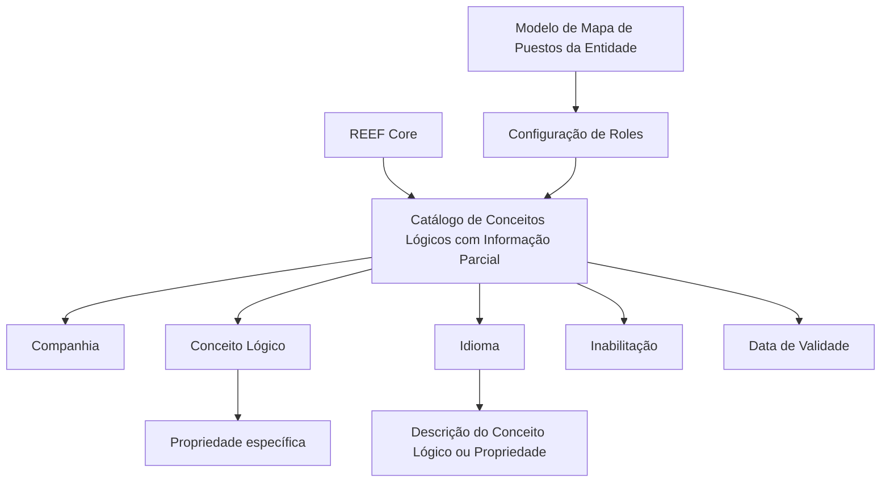
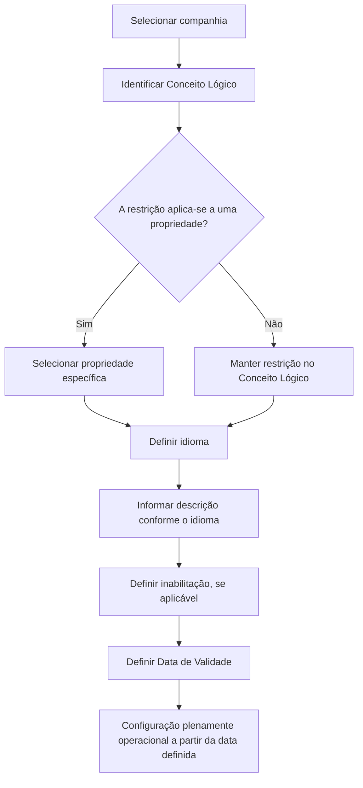

# Configuração de Conceitos Lógicos com Informação Parcial no REEF Core

## 1. Metadados do Documento
- **Arquivo de Origem:** Não identificado no conteúdo fornecido
- **Tipo de Documento:** Especificação Funcional
- **Domínio / Sistema:** REEF Core — Informação Parcial
- **Público-Alvo:** Analistas funcionais, configuradores e equipes de negócio
- **Data/Versão Identificada:** Não identificada

---

## 2. Resumo Executivo & Contexto de Negócio

O documento descreve a configuração de **Conceitos Lógicos com Informação Parcial** no sistema REEF Core. A funcionalidade permite definir, para um Conceito Lógico e/ou para propriedades específicas desse conceito, a existência de restrições de Informação Parcial em um catálogo criado especificamente para essa finalidade.

A configuração é contextualizada por companhia, conceito lógico, propriedade e idioma. Dessa forma, o catálogo permite associar uma restrição de Informação Parcial a um elemento lógico específico e definir a nomenclatura apresentada conforme o idioma empregado na definição.

O catálogo também contém mecanismos operacionais para inabilitar um Conceito Lógico com Informação Parcial e controlar a data a partir da qual a configuração passa a estar plenamente operacional. A data de validade é indicada como recurso para manter histórico das alterações realizadas nas definições.

O documento recomenda que a interpretação não seja isolada: existem diretrizes e documentos funcionais relacionados, especialmente sobre papéis de Informação Parcial por aplicação e por Conceito Lógico. Como boa prática, recomenda-se iniciar a configuração dos papéis de acordo com o modelo de Mapa de Puestos da entidade.

---

## 3. Arquitetura, Componentes & Tecnologias Envolvidas

### Componentes e elementos identificados

| Componente / Elemento | Papel descrito no documento |
| :--- | :--- |
| REEF Core | Sistema que permite configurar restrições de Informação Parcial para Conceitos Lógicos e/ou propriedades. |
| Catálogo de Conceitos Lógicos com Informação Parcial | Catálogo especificamente criado para configurar as restrições de Informação Parcial. |
| Companhia | Identifica o código da companhia para a qual a configuração é realizada. |
| Conceito Lógico | Identifica o código do Conceito Lógico sujeito à restrição. |
| Propriedade | Identifica a propriedade específica do Conceito Lógico que será restringida. |
| Idioma | Chave do idioma utilizada na definição do Conceito Lógico ou propriedade com Informação Parcial. |
| Descrição do Conceito Lógico ou Propriedade | Nomenclatura do Conceito Lógico ou propriedade com Informação Parcial, conforme o idioma de definição. |
| Inabilitação | Define se o Conceito Lógico com Informação Parcial está inabilitado para uso. |
| Data de Validade | Define a data a partir da qual a configuração está plenamente operacional no sistema. |
| Roles de Informação Parcial | Material relacionado recomendado pelo documento. |
| Roles de Informação Parcial por Aplicação | Documento ou diretriz vinculada. |
| Roles de Informação Parcial por Conceito Lógico | Documento ou diretriz vinculada. |
| Mapa de Puestos da Entidade | Modelo recomendado como base para iniciar a configuração dos papéis. |



> **Nota de Análise:** O documento não especifica interfaces, métodos HTTP, contratos JSON, bancos de dados, tecnologias de implementação, URLs ou ambientes técnicos para o catálogo de Informação Parcial.

---

## 4. Regras de Negócio, Especificações Funcionais & Processos

### Configuração de Informação Parcial

1. O REEF Core permite configurar se um Conceito Lógico e/ou uma propriedade de um Conceito Lógico terá algum tipo de restrição de Informação Parcial.
2. A restrição é configurada em um catálogo de informação especificamente criado para esse propósito.
3. A configuração deve identificar a companhia sobre a qual a definição será realizada.
4. A configuração deve identificar o Conceito Lógico a restringir.
5. Quando aplicável, a configuração deve identificar a propriedade específica do Conceito Lógico que será restringida.
6. A definição deve utilizar uma chave de idioma, com exemplos apresentados de espanhol, inglês e português.
7. A descrição do Conceito Lógico ou da propriedade com Informação Parcial deve corresponder ao idioma utilizado na sua definição.
8. Um Conceito Lógico com Informação Parcial pode ser marcado como inabilitado, tornando-o indisponível para utilização.
9. A Data de Validade indica a partir de qual data o Conceito Lógico com Informação Parcial estará plenamente operacional no sistema.
10. O uso correto da Data de Validade permite manter histórico das mudanças realizadas nas definições.
11. O documento recomenda a leitura de diretrizes e documentos funcionais vinculados para evitar interpretação isolada e potencialmente incorreta.
12. Como boa prática, a configuração de Roles no catálogo deve ser iniciada de acordo com o modelo de Mapa de Puestos da entidade.

### Fluxo funcional extraído



---

## 5. Tabelas de Parâmetros, Ambientes e Estruturas de Dados

| Item / Parâmetro | Descrição / Função | Tipo / Valores / Formato | Ambiente / Observações |
| :--- | :--- | :--- | :--- |
| Companhia | Contém o código da companhia sobre a qual é realizada a configuração do Conceito Lógico ou de alguma propriedade. | Código de companhia | Aplicável à configuração do catálogo. |
| Conceito Lógico | Contém o código do Conceito Lógico a restringir. | Código de Conceito Lógico | Pode ser configurado com Informação Parcial. |
| Propriedade | Contém a propriedade específica do Conceito Lógico que se deseja restringir. | Propriedade de Conceito Lógico | Aplicável quando a restrição recai sobre uma propriedade. |
| Idioma | Chave do idioma empregado na definição do Conceito Lógico com Informação Parcial. | Exemplos: espanhol, inglês, português | Utilizado na definição da nomenclatura. |
| Descrição do Conceito Lógico ou Propriedade | Contém a nomenclatura do Conceito Lógico ou propriedade com Informação Parcial conforme o idioma de definição. | Texto / nomenclatura | Associada ao idioma informado. |
| Inabilitação | Estabelece se o Conceito Lógico com Informação Parcial está inabilitado para utilização. | Estado de inabilitação | Um conceito inabilitado não pode ser utilizado. |
| Data de Validade | Indica a data a partir da qual o Conceito Lógico com Informação Parcial está plenamente operativo. | Data | Permite manter histórico dos cambios efetuados nas definições. |
| Roles de Informação Parcial | Diretriz ou documento funcional vinculado. | Referência documental | Leitura recomendada. |
| Roles de Informação Parcial por Aplicação | Diretriz ou documento funcional vinculado. | Referência documental | Leitura recomendada. |
| Roles de Informação Parcial por Conceito Lógico | Diretriz ou documento funcional vinculado. | Referência documental | Leitura recomendada. |
| Mapa de Puestos | Modelo recomendado para iniciar a configuração dos Roles. | Modelo organizacional da entidade | Apresentado como boa prática. |

---

## 6. Bateria de Perguntas & Respostas para RAG (FAQ Sintético)

### P1: O que o REEF Core permite configurar em relação à Informação Parcial?
**R:** O REEF Core permite configurar se um Conceito Lógico e/ou uma propriedade de um Conceito Lógico contará com algum tipo de restrição de Informação Parcial em um catálogo de informação criado especificamente para esse fim.

### P2: Qual é a finalidade do atributo Companhia no catálogo de Informação Parcial?
**R:** O atributo Companhia contém o código da companhia sobre a qual está sendo realizada a configuração do Conceito Lógico ou de alguma de suas propriedades.

### P3: O que deve ser informado no atributo Conceito Lógico?
**R:** O atributo Conceito Lógico deve conter o código do Conceito Lógico que se deseja restringir por meio da configuração de Informação Parcial.

### P4: Quando a propriedade deve ser configurada no catálogo?
**R:** A propriedade deve ser configurada quando a restrição de Informação Parcial for aplicada a uma propriedade específica de um Conceito Lógico.

### P5: Como o idioma é utilizado na definição de Conceitos Lógicos com Informação Parcial?
**R:** O idioma é uma chave usada na definição do Conceito Lógico com Informação Parcial. O documento apresenta espanhol, inglês e português como exemplos de idiomas que podem ser empregados.

### P6: O que representa a descrição do Conceito Lógico ou da propriedade?
**R:** A descrição contém a nomenclatura do Conceito Lógico ou da propriedade com Informação Parcial, de acordo com o idioma utilizado em sua definição.

### P7: Qual é o efeito da Inabilitação?
**R:** A Inabilitação estabelece se o Conceito Lógico com Informação Parcial está inabilitado para ser utilizado. Quando está inabilitado, o Conceito Lógico com Informação Parcial não pode ser usado.

### P8: Para que serve a Data de Validade?
**R:** A Data de Validade informa ao sistema a data a partir da qual o Conceito Lógico com Informação Parcial estará plenamente operacional. Seu uso correto permite manter histórico das mudanças realizadas nas definições.

### P9: Quais documentos relacionados devem ser consultados?
**R:** O documento recomenda a leitura de diretrizes e documentos funcionais vinculados, incluindo Roles de Informação Parcial, Roles de Informação Parcial por Aplicação e Roles de Informação Parcial por Conceito Lógico.

### P10: Qual prática é recomendada para iniciar a configuração de Roles?
**R:** Recomenda-se iniciar a configuração dos Roles no catálogo de acordo com o modelo de Mapa de Puestos da entidade.

---

## 7. Glossário de Termos, Siglas & Conceitos-Chave

- **REEF Core:** Sistema mencionado como capaz de configurar restrições de Informação Parcial para Conceitos Lógicos e/ou propriedades.
- **Informação Parcial:** Tipo de restrição configurável para Conceitos Lógicos e/ou propriedades no catálogo descrito.
- **Conceito Lógico:** Elemento identificado por código que pode ser restringido por Informação Parcial.
- **Propriedade:** Elemento específico pertencente a um Conceito Lógico que também pode receber restrição.
- **Catálogo de Conceitos Lógicos com Informação Parcial:** Catálogo de informação criado especificamente para configurar restrições de Informação Parcial.
- **Inabilitação:** Propriedade que determina se um Conceito Lógico com Informação Parcial pode ser utilizado.
- **Data de Validade:** Data a partir da qual uma definição de Conceito Lógico com Informação Parcial se torna plenamente operacional.
- **Roles de Informação Parcial:** Referência a papéis relacionados ao domínio de Informação Parcial.
- **Mapa de Puestos:** Modelo da entidade recomendado como referência para iniciar a configuração dos Roles.
- **CF:** Sigla exibida no conteúdo bruto, sem definição adicional no documento.
- **Zeus:** Termo exibido no conteúdo bruto, sem detalhamento adicional no documento.

---

## 8. Notas Críticas, Riscos & Limitações

- O documento alerta que a interpretação isolada pode conduzir a erro; por isso, recomenda a leitura das diretrizes e dos documentos funcionais vinculados.
- Não há detalhamento de como as restrições de Informação Parcial são aplicadas em tempo de execução.
- Não são informados contratos de integração, métodos HTTP, estruturas JSON, persistência de dados, permissões técnicas ou mecanismos de autenticação.
- Não há definição adicional para os termos “CF”, “Home Solutions APIs Documentation” e “Zeus”, presentes no conteúdo bruto.
- O documento apresenta a configuração de Roles como boa prática baseada no Mapa de Puestos, mas não descreve o processo detalhado de criação, manutenção ou atribuição desses Roles.
- Não foram identificadas data, versão, autor, nome do arquivo ou paginação total confiável além do conteúdo fornecido.

---

## 9. Conteúdo Bruto Estruturado (Referência Fiel)

```text
--- [PÁGINA 1 DE 2] ---

DEFINICIÓN de los Conceptos Lógicos con
Información Parcial
Contexto
Funcionalmente Reef.core cuenta con la posibilidad de configurar en los Conceptos Lógicos y/o sus
propiedades si van a contar o no con algún tipo de restricción de Información Parcial en un catálogo
de información específicamente creado al efecto.
Propiedades Operativas
Otras Propiedades
Propiedades Operativas
Compañía
Este Atributo del catálogo contiene el código de la compañía sobre la cual se está realizando la
configuración del concepto lógico o alguna de sus propiedades.
Concepto Lógico
Este Atributo del catálogo contiene el código del Concepto Lógico a Restringir.
Propiedad
Este Atributo del catálogo contiene la Propiedad específica del Concepto Lógico que se desea
Restringir.
 /
 CF
Home Solutions APIs Documentation Zeus
EN


--- [PÁGINA 2 DE 2] ---

Idioma.
Esta propiedad es la clave del Idioma empleado en la definición del Concepto Lógico con Información
Parcial como por ejemplo: español, inglés, portugués, ...
Descripción del Concepto Lógico o Propiedad
Este Atributo del catálogo contiene la nomenclatura del Concepto Lógico o Propiedad con
Información Parcial de acuerdo con el idioma de su definición.
Otras Propiedades
Inhabilitación
Esta propiedad establece si el Concepto Lógico con Información Parcial está inhabilitado para poder
ser utilizado.
Fecha de Validez
Esta propiedad le indica al Sistema la fecha a partir de la cual el Concepto Lógico con Información
Parcial está plenamente operativo en el sistema por lo que su correcto uso permite tener un histórico
de los cambios efectuados en sus definiciones.
Vínculos
Relación de Directrices y Documentos funcionales cuya lectura recomendada para evitar que la
interpretación aislada del presente documento pueda conducir a error.
Roles de Información Parcial
Roles de Información Parcial por Aplicación
Roles de Información Parcial por Concepto Lógico
Preguntas frecuentes
(1) ¿Existe alguna recomendación que pueda ser tomada en consideración en el uso y definición del
Catálogo de Conceptos Lógicos con Información Parcial del Sistema?
Puede ser una buena práctica iniciar la configuración de los Roles en este catálogo de acuerdo con
el modelo de Mapa de Puestos de la Entidad.
```
