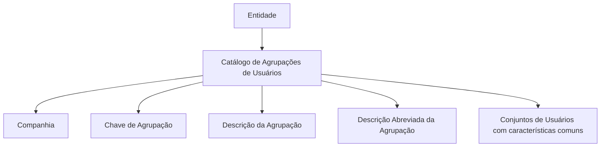

# Definição e Configuração do Catálogo de Agrupações de Usuários por Entidade

## 1. Metadados do Documento
- **Arquivo de Origem:** Não identificado no conteúdo fornecido
- **Tipo de Documento:** Especificação Funcional
- **Domínio / Sistema:** Catálogo de Agrupações de Usuários por Entidade
- **Público-Alvo:** Negócio, administradores funcionais e equipes de configuração
- **Data/Versão Identificada:** Não identificada

---

## 2. Resumo Executivo & Contexto de Negócio

O documento define o conceito de uma **Agrupação de Usuários** como um conjunto de usuários que compartilham características comuns. Essas agrupações são registradas em um catálogo de informações associado a cada entidade.

O núcleo do sistema permite identificar e codificar os conjuntos nos quais os usuários são distribuídos. O catálogo é entregue inicialmente vazio às entidades, que são responsáveis por configurá-lo conforme suas próprias necessidades.

Entre os exemplos de utilização apresentados estão a identificação de domínios hierárquicos, estrutura de trabalho e posições dentro da entidade. A configuração é composta, no mínimo, por companhia, chave da agrupação, descrição e descrição abreviada.

O documento não estabelece recomendações corporativas específicas para o uso ou a configuração do Catálogo de Agrupações de Usuários da Entidade. Também referencia o documento funcional **Usuarios de la Entidad** como leitura recomendada para reduzir riscos de interpretação isolada.

---

## 3. Arquitetura, Componentes & Tecnologias Envolvidas

O conteúdo não descreve arquitetura técnica, tecnologias, integrações, microsserviços, APIs, bancos de dados, ambientes ou contratos de comunicação.

O documento apresenta apenas a relação funcional entre a entidade, o catálogo de usuários e as agrupações configuradas pela entidade.



**Nota de Análise:** O documento não detalha persistência de dados, permissões, interfaces de configuração, métodos HTTP, contratos JSON, fluxos de aprovação ou validações técnicas do catálogo.

---

## 4. Regras de Negócio, Especificações Funcionais & Processos

1. Uma **Agrupação de Usuários** corresponde a um conjunto de usuários que compartilham características comuns.
2. O núcleo do sistema possui capacidade para identificar e codificar os possíveis conjuntos nos quais os usuários são distribuídos.
3. As agrupações são mantidas em um catálogo de informações entregue inicialmente sem conteúdo às entidades.
4. Cada entidade configura o catálogo de acordo com suas próprias necessidades.
5. O catálogo pode ser usado, entre outros exemplos, para identificar:
   - Domínios hierárquicos;
   - Estrutura de trabalho;
   - Posições na entidade.
6. A definição de uma agrupação contém um atributo de **Companhia**, que representa o código da companhia sobre a qual a definição está sendo realizada.
7. A definição contém uma **Chave de Agrupação**, que representa o código da agrupação de usuários.
8. A definição contém uma **Descrição da Agrupação**, que representa a denominação ou descrição da agrupação de usuários.
9. A definição contém uma **Descrição Abreviada da Agrupação**, que representa a denominação ou descrição abreviada da agrupação de usuários.
10. Não existe recomendação corporativa específica para o uso e a configuração do Catálogo de Agrupações de Usuários da Entidade.
11. A leitura do documento funcional **Usuarios de la Entidad** é recomendada para evitar interpretações incorretas decorrentes da consulta isolada deste documento.

---

## 5. Tabelas de Parâmetros, Ambientes e Estruturas de Dados

| Item / Parâmetro | Descrição / Função | Tipo / Valores / Formato | Ambiente / Observações |
| :--- | :--- | :--- | :--- |
| Agrupação de Usuários | Conjunto de usuários que compartilham características comuns. | Conjunto lógico de usuários. | Configurado pela entidade. |
| Catálogo de Agrupações de Usuários | Catálogo que identifica e codifica os conjuntos nos quais os usuários são distribuídos. | Catálogo de informação. | Entregue inicialmente vazio às entidades. |
| Companhia | Código da companhia sobre a qual está sendo realizada a definição da agrupação. | Código de companhia. | Atributo do catálogo de usuários por entidade. |
| Chave de Agrupação | Código que identifica a agrupação de usuários da entidade. | Código de agrupação. | Atributo do catálogo de usuários da entidade. |
| Descrição da Agrupação | Denominação ou descrição da agrupação de usuários. | Texto descritivo. | Exemplos incluem “Usuarios Centros de Emisión” e “Suscriptores Senior”. |
| Descrição Abreviada da Agrupação | Denominação ou descrição abreviada da agrupação de usuários. | Texto abreviado. | Exemplos incluem `EMAA1` e `SI00A`. |
| Domínios Hierárquicos | Exemplo de necessidade que pode ser identificada por meio das agrupações. | Não detalhado. | Exemplo citado no documento. |
| Estrutura de Trabalho | Exemplo de necessidade que pode ser identificada por meio das agrupações. | Não detalhado. | Exemplo citado no documento. |
| Posições na Entidade | Exemplo de necessidade que pode ser identificada por meio das agrupações. | Não detalhado. | Exemplo citado no documento. |
| Documento relacionado | Documento funcional recomendado para leitura complementar. | `Usuarios de la Entidad`. | Recomendado para evitar interpretação isolada. |

| Agrupação | Descrição |
| :--- | :--- |
| 01 | Usuarios Centros de Emisión |
| 02 | Usuarios Centros Tramitadores |
| 03 | Usuarios Central |
| A100 | Suscriptores Junior |
| B100 | Suscriptores Senior |

| Agrupação | Abreviatura / Descrição |
| :--- | :--- |
| 01-EMI-AA1 | EMAA1 - Usuarios Centro de Emisión AA1 |
| 01-EMI-AA2 | EMAA2 - Usuarios Centro de Emisión AA2 |
| 01-SIN-00A | SI00A - Usuarios Tramitación (Madrid) |

---

## 6. Bateria de Perguntas & Respostas para RAG (FAQ Sintético)

### P1: O que é uma Agrupação de Usuários?
**R:** Uma Agrupação de Usuários é um conjunto de usuários que compartilham características comuns entre si.

### P2: Qual é a finalidade do Catálogo de Agrupações de Usuários?
**R:** O Catálogo de Agrupações de Usuários permite identificar e codificar os possíveis conjuntos nos quais os usuários são distribuídos dentro de uma entidade.

### P3: O catálogo já vem preenchido quando é entregue à entidade?
**R:** Não. O catálogo de informações é entregue às entidades inicialmente vazio, para que cada entidade o configure conforme suas necessidades.

### P4: Quem configura o Catálogo de Agrupações de Usuários?
**R:** Cada entidade configura o catálogo de acordo com suas próprias necessidades funcionais e organizacionais.

### P5: Quais são exemplos de uso para as agrupações de usuários?
**R:** O documento cita como exemplos a identificação de domínios hierárquicos, estrutura de trabalho e posições existentes na entidade.

### P6: O que representa o atributo Companhia?
**R:** O atributo Companhia contém o código da companhia sobre a qual está sendo realizada a definição da agrupação de usuários.

### P7: O que é a Chave de Agrupação?
**R:** A Chave de Agrupação é o código da agrupação de usuários da entidade, mantido como atributo do catálogo de usuários da entidade.

### P8: Qual é a diferença entre Descrição da Agrupação e Descrição Abreviada da Agrupação?
**R:** A Descrição da Agrupação informa a denominação ou descrição completa da agrupação. A Descrição Abreviada informa uma forma abreviada dessa denominação ou descrição.

### P9: Existe uma recomendação corporativa específica para configurar o catálogo?
**R:** Não. O documento informa expressamente que não existe uma recomendação corporativa específica para o bom uso e a configuração do Catálogo de Agrupações de Usuários da Entidade.

### P10: Qual documento deve ser consultado junto com esta especificação?
**R:** O documento recomenda a leitura de **Usuarios de la Entidad**, pois a interpretação isolada da presente especificação pode conduzir a erro.

---

## 7. Glossário de Termos, Siglas & Conceitos-Chave

- **Agrupação de Usuários:** Conjunto de usuários com características comuns.
- **Catálogo de Agrupações de Usuários:** Catálogo de informação usado para identificar e codificar conjuntos de usuários em uma entidade.
- **Companhia:** Código da companhia sobre a qual a definição de agrupação está sendo realizada.
- **Chave de Agrupação:** Código que identifica uma agrupação de usuários.
- **Descrição da Agrupação:** Denominação ou descrição completa da agrupação de usuários.
- **Descrição Abreviada da Agrupação:** Denominação ou descrição abreviada da agrupação de usuários.
- **Entidade:** Organização que recebe o catálogo inicialmente vazio e o configura conforme suas necessidades.
- **Usuarios de la Entidad:** Documento funcional relacionado cuja leitura é recomendada.

---

## 8. Notas Críticas, Riscos & Limitações

- O catálogo é entregue vazio; a qualidade, consistência e abrangência da configuração dependem de cada entidade.
- Não há recomendação corporativa específica para orientar o uso ou a configuração do catálogo.
- O documento alerta que sua interpretação isolada pode levar a erro e recomenda a leitura de **Usuarios de la Entidad**.
- Não são detalhados critérios de unicidade, obrigatoriedade, formato de campos, regras de validação ou ciclo de vida das agrupações.
- Não há especificação de arquitetura técnica, interface de usuário, controle de acesso, integração, API, banco de dados ou ambientes.
- **Nota de Análise:** O conteúdo fornece exemplos de códigos e descrições, mas não define formalmente padrões de nomenclatura ou regras de composição para os códigos de agrupação.

---

## 9. Conteúdo Bruto Estruturado (Referência Fiel)

```text
--- [PÁGINA 1 DE 3] ---

DEFINICIÓN de Agrupaciones de Usuarios
Contexto
Se entiende por una Agrupación de Usuarios al Conjunto de Usuarios que comparten características
comunes entre ellos.
Funcionalmente, el núcleo del Sistema cuenta con la posibilidad de identificar y codificar los posibles
Conjuntos en los que se distribuyen los Usuarios en un catálogo de información que se entrega a las
entidades inicialmente vacío de contenido para que las entidades lo configuren de acuerdo con sus
necesidades como por ejemplo parea identificar Dominios Jerárquicos, la Estructura de Trabajo, las
Posiciones en la Entidad, ... etcétera.
Propiedades Operativas
Compañía
Este Atributo del catálogo de Usuarios por Entidad contiene el código de la compañía sobre la cual se
está realizando su definición.
Clave de Agrupación
Este Atributo del catálogo de Usuarios de la Entidad contiene el código de la Agrupación de los
Usuarios.
Descripción de la Agrupación
 /
 CF
Home Solutions APIs Documentation Zeus
EN


--- [PÁGINA 2 DE 3] ---

Esta propiedad le indica al sistema cual es la denominación o descripción de la Agrupación de
Usuarios. A modo de ejemplo ...
AGRUPACIÓN DESCRIPCIÓN
01 Usuarios Centros de Emisión
02 Usuarios Centros Tramitadores
03 Usuarios Central
... ...
A100 Suscriptores Junior
B100 Suscriptores Senior
... ...
Descripción Abreviada de la Agrupación
Esta propiedad le indica al sistema cual es la denominación o descripción abreviada de la
Agrupación de los Usuarios. A modo de ejemplo ...
AGRUPACIÓN ABREVIATURA
01-EMI-AA1 EMAA1 - Usuarios Centro de Emisión AA1
01-EMI-AA2 EMAA2 - Usuarios Centro de Emisión AA2
01-SIN-00A SI00A - Usuarios Tramitación (Madrid)
... ...
Vínculos
Relación de Directrices y Documentos funcionales cuya lectura recomendada para evitar que la
interpretación aislada del presente documento pueda conducir a error.
Usuarios de la Entidad


--- [PÁGINA 3 DE 3] ---

Preguntas frecuentes
(1) ¿Existe alguna recomendación que pueda ser tomada en consideración en el uso y configuración
del Catálogo de Agrupaciones de Usuarios de la Entidad?
No existe una recomendación corporativa específica para el buen uso de este catálogo.
```
