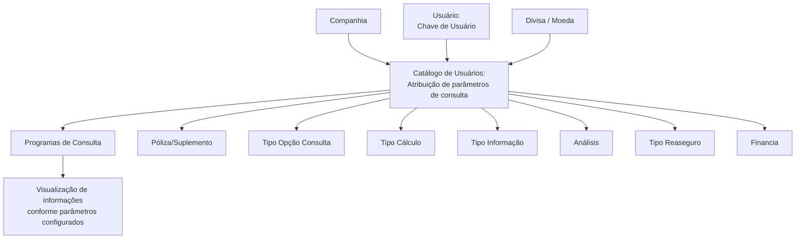

# Atribuição de Parâmetros de Consulta aos Usuários do Sistema

## 1. Metadados do Documento
- **Arquivo de Origem:** Não identificado no conteúdo fornecido
- **Tipo de Documento:** Especificação Funcional
- **Domínio / Sistema:** Catálogo de Usuários do Sistema
- **Público-Alvo:** Negócio, Analistas Funcionais, Desenvolvedores e Operação
- **Data/Versão Identificada:** Não identificada

---

## 2. Resumo Executivo & Contexto de Negócio

O documento descreve a funcionalidade de atribuição de parâmetros de consulta por usuário no núcleo do Sistema. Essa configuração determina como cada usuário visualizará informações em programas de consulta que suportem essa capacidade funcional.

A atribuição é contextualizada por companhia, usuário e divisa/moeda. Além dos dados identificativos, o catálogo possui propriedades operativas que definem agrupamentos, opções de consulta, tipos de cálculo, nível de detalhamento disponível e tratamento econômico relacionado ao resseguro e ao financiamento.

O mecanismo permite que programas de consulta adaptem a apresentação de informações econômicas de acordo com parâmetros previamente associados ao usuário. Entre as possibilidades explicitamente documentadas estão agrupamento por apólice, ramo, setor ou resumo de totais, além da visualização de informações por apólice ou por suplemento.

O documento recomenda que os códigos de usuários no catálogo sejam definidos da mesma forma que os usuários são identificados no diretório ativo da Entidade. Não são detalhados contratos técnicos, telas, métodos HTTP, persistência de dados, permissões de manutenção ou integrações externas.

---

## 3. Arquitetura, Componentes & Tecnologias Envolvidas

Os componentes funcionais identificados são:

- **Núcleo do Sistema:** oferece a capacidade de configurar parâmetros de consulta por usuário.
- **Catálogo de Usuários:** contém os atributos identificativos e operativos da atribuição de parâmetros.
- **Programas de Consulta:** consomem os parâmetros configurados quando contemplam essa funcionalidade.
- **Usuário:** entidade identificada por uma chave/código, para a qual são definidos critérios de visualização.
- **Companhia:** contexto organizacional sobre o qual a atribuição é realizada.
- **Divisa/Moeda:** contexto monetário associado ao parâmetro.
- **Diretório ativo da Entidade:** referência recomendada para padronização da codificação de usuários.



> **Nota de Análise:** O conteúdo não descreve uma arquitetura técnica de software, APIs, bancos de dados, tecnologias, ambientes, protocolos ou contratos de integração. O diagrama representa exclusivamente o relacionamento funcional explicitado no documento.

---

## 4. Regras de Negócio, Especificações Funcionais & Processos

### 4.1 Configuração por usuário

1. O núcleo do Sistema permite configurar, por usuário, a forma de visualização das informações.
2. A configuração é aplicável somente aos programas que realizam consultas sobre informações do Sistema e que contemplem funcionalmente essa capacidade.
3. A atribuição de parâmetros é realizada no contexto de uma companhia.
4. A chave de usuário identifica o usuário ao qual os parâmetros de consulta são atribuídos.
5. O código da divisa/moeda define a moeda sobre a qual o parâmetro é estabelecido.

### 4.2 Visualização de apólices e suplementos

O atributo **Póliza/Suplemento** determina se, nos programas de consulta que contemplem essa configuração, a informação das apólices será apresentada:

- De forma agrupada; ou
- De forma individualizada para cada suplemento emitido sobre a apólice.

O documento não fornece os códigos, valores permitidos ou regras de precedência para essas alternativas.

### 4.3 Opções e cálculos de consulta

- O atributo **Tipo Opción Consulta** deve conter um dos valores dos possíveis tipos de opções pelos quais a informação consultada pode ser visualizada.
- O atributo **Tipo Cálculo** deve conter um dos valores dos possíveis tipos de cálculo pelos quais a informação consultada pode ser visualizada.

> **Nota de Análise:** O documento não enumera os valores permitidos para **Tipo Opción Consulta** nem para **Tipo Cálculo**.

### 4.4 Agrupamento da informação econômica

O atributo **Tipo Información** informa aos programas de consulta que suportam a funcionalidade como a informação econômica deve ser agrupada. As opções documentadas são:

- **P — PÓLIZA**
- **R — RAMO**
- **S — SECTOR**
- **T — RESUMEN TOTALES**

### 4.5 Detalhamento analítico

O atributo **Análisis** determina se o usuário pode aprofundar a análise dos dados. Quando aplicável, o usuário pode acessar um maior nível de detalhe ao clicar em:

- Um registro; ou
- Uma zona interativa da tela.

O documento não especifica os valores usados para representar a permissão ou a negação de aprofundamento analítico.

### 4.6 Tratamento de resseguro

O atributo **Tipo Reaseguro** indica se a informação econômica será apresentada:

- Incluindo as cessões ao resseguro; ou
- Como valores líquidos de resseguro.

O documento não informa códigos de parametrização, fórmulas de cálculo ou critérios de seleção entre as duas opções.

### 4.7 Tratamento de financiamento

O atributo **Financia** indica ao Sistema se a informação consultada inclui ou não os juros de financiamento nos valores apresentados.

### 4.8 Atributo obsoleto

O atributo **Listado** está defasado e não é utilizado.

### 4.9 Recomendação de codificação de usuários

Como boa prática, os usuários devem ser codificados no catálogo da mesma maneira como são identificados no diretório ativo da Entidade.

---

## 5. Tabelas de Parâmetros, Ambientes e Estruturas de Dados

| Item / Parâmetro | Descrição / Função | Tipo / Valores / Formato | Ambiente / Observações |
| :--- | :--- | :--- | :--- |
| Companhia | Código da companhia sobre a qual é realizada a atribuição dos parâmetros ou critérios de consulta. | Código de companhia; formato não informado. | Dado identificativo. |
| Chave de Usuário | Código pelo qual o usuário será identificado. | Código de usuário; formato não informado. | Dado identificativo. Recomenda-se alinhamento com o diretório ativo da Entidade. |
| Código da Divisa | Código da divisa/moeda sobre a qual é estabelecido o parâmetro. | Código de divisa/moeda; formato não informado. | Dado identificativo. |
| Póliza/Suplemento | Define se a informação das apólices é apresentada agrupada ou individualizada por suplemento emitido. | Valores não detalhados. | Aplicável aos programas de consulta que suportem a funcionalidade. |
| Tipo Opción Consulta | Define uma opção pela qual a informação consultada pode ser visualizada. | Um dos possíveis tipos de opções; valores não informados. | Propriedade operativa. |
| Tipo Cálculo | Define um tipo de cálculo pelo qual a informação consultada pode ser visualizada. | Um dos possíveis tipos de cálculo; valores não informados. | Propriedade operativa. |
| Tipo Información | Define o agrupamento da informação econômica. | `P` = PÓLIZA; `R` = RAMO; `S` = SECTOR; `T` = RESUMEN TOTALES. | Aplicável aos programas de consulta que suportem a funcionalidade. |
| Análisis | Define se o usuário pode aprofundar o detalhamento de dados por meio de clique em registros ou zonas interativas. | Permite ou não permite aprofundamento; códigos não informados. | Propriedade operativa. |
| Tipo Reaseguro | Define se a informação econômica é exibida incluindo cessões ao resseguro ou como valores líquidos de resseguro. | Alternativas funcionais; códigos não informados. | Aplicável aos programas de consulta que suportem a funcionalidade. |
| Financia | Define se a informação consultada inclui juros de financiamento nos valores. | Inclui ou não inclui juros; códigos não informados. | Propriedade operativa. |
| Listado | Atributo do catálogo. | Não aplicável. | Defasado; não utilizado. |

### Matriz de Valores de `Tipo Información`

| Código | Descrição literal | Significado funcional |
| :--- | :--- | :--- |
| `P` | PÓLIZA | Agrupamento da informação econômica por apólice. |
| `R` | RAMO | Agrupamento da informação econômica por ramo. |
| `S` | SECTOR | Agrupamento da informação econômica por setor. |
| `T` | RESUMEN TOTALES | Agrupamento da informação econômica em resumo de totais. |

---

## 6. Bateria de Perguntas & Respostas para RAG (FAQ Sintético)

### P1: Qual é o objetivo da atribuição de parâmetros de consulta aos usuários do Sistema?
**R:** A atribuição de parâmetros permite configurar, para cada usuário, como as informações serão visualizadas nos programas de consulta do Sistema que contemplem essa funcionalidade.

### P2: Quais dados identificam uma atribuição de parâmetros de consulta?
**R:** O documento identifica três dados: Companhia, Chave de Usuário e Código da Divisa. A Companhia representa o contexto organizacional da atribuição, a Chave de Usuário identifica o usuário e o Código da Divisa/Moeda identifica a moeda sobre a qual o parâmetro é estabelecido.

### P3: Como o parâmetro Póliza/Suplemento afeta a visualização das informações?
**R:** O parâmetro Póliza/Suplemento define se as informações das apólices são visualizadas de forma agrupada ou individualizada para cada suplemento emitido sobre as apólices, quando o programa de consulta suporta essa configuração.

### P4: Quais valores são permitidos para o atributo Tipo Información?
**R:** O atributo Tipo Información possui os valores `P` para PÓLIZA, `R` para RAMO, `S` para SECTOR e `T` para RESUMEN TOTALES. Esses valores determinam como a informação econômica será agrupada nos programas de consulta aplicáveis.

### P5: O que significa o valor `T` no atributo Tipo Información?
**R:** O valor `T` corresponde a **RESUMEN TOTALES** e indica que a informação econômica deve ser visualizada como um resumo de totais.

### P6: O atributo Análisis controla qual comportamento do usuário?
**R:** O atributo Análisis informa se o usuário pode aprofundar os dados em um maior nível de detalhe mediante clique sobre um registro ou uma zona interativa da tela, nos programas de consulta que contemplem essa possibilidade.

### P7: Como o Tipo Reaseguro altera a informação econômica exibida?
**R:** O Tipo Reaseguro determina se a informação econômica será apresentada incluindo as cessões ao resseguro ou como valores líquidos de resseguro.

### P8: O que o atributo Financia informa ao Sistema?
**R:** O atributo Financia informa se os valores da informação consultada devem incluir ou não os juros de financiamento.

### P9: O atributo Listado deve ser utilizado em novas configurações?
**R:** Não. O documento afirma que o atributo Listado está defasado e não é utilizado.

### P10: Quais valores o documento define para Tipo Opción Consulta e Tipo Cálculo?
**R:** O documento informa que Tipo Opción Consulta e Tipo Cálculo devem conter um dos possíveis valores existentes para opções de visualização e tipos de cálculo, respectivamente. Entretanto, os valores permitidos não são especificados.

### P11: Qual é a recomendação para cadastrar códigos de usuários no catálogo?
**R:** A recomendação é codificar os usuários no catálogo da mesma forma pela qual os usuários são identificados no diretório ativo da Entidade.

### P12: O documento descreve APIs, métodos HTTP ou contratos JSON para o Catálogo de Usuários?
**R:** Não. O documento apresenta uma especificação funcional de atributos e comportamentos de consulta, mas não detalha APIs, métodos HTTP, contratos JSON, tecnologias, persistência ou mecanismos de integração.

---

## 7. Glossário de Termos, Siglas & Conceitos-Chave

- **Análisis:** atributo que define se o usuário pode aprofundar a consulta para acessar um maior nível de detalhe por clique em um registro ou zona interativa.
- **Catálogo de Usuários:** catálogo que contém atributos identificativos e propriedades operativas para configurar parâmetros de consulta por usuário.
- **Chave de Usuário:** código pelo qual o usuário é identificado.
- **Companhia:** código da companhia sobre a qual a atribuição de parâmetros ou critérios de consulta é realizada.
- **Divisa:** moeda sobre a qual o parâmetro de consulta é estabelecido.
- **Financia:** atributo que indica se os valores consultados incluem juros de financiamento.
- **Póliza:** apólice.
- **Ramo:** opção de agrupamento da informação econômica identificada pelo código `R`.
- **Reaseguro:** contexto no qual a informação econômica pode incluir cessões ao resseguro ou ser exibida como valor líquido de resseguro.
- **Sector:** opção de agrupamento da informação econômica identificada pelo código `S`.
- **Suplemento:** emissão associada a uma apólice, cuja informação pode ser visualizada individualmente conforme o parâmetro Póliza/Suplemento.
- **Tipo Cálculo:** atributo que contém um dos possíveis tipos de cálculo para visualização de informação consultada.
- **Tipo Información:** atributo que define o agrupamento da informação econômica.
- **Tipo Opción Consulta:** atributo que contém um dos possíveis tipos de opção para visualização da informação consultada.

---

## 8. Notas Críticas, Riscos & Limitações

- O documento não identifica nome de arquivo, data, versão, responsável, sistema corporativo específico ou ambiente.
- O documento não especifica valores permitidos para **Póliza/Suplemento**, **Tipo Opción Consulta**, **Tipo Cálculo**, **Análisis**, **Tipo Reaseguro** e **Financia**.
- Não há definição de formatos, domínios de dados, validações obrigatórias, mensagens de erro ou regras de precedência entre parâmetros.
- Não são descritos APIs, integrações, banco de dados, tabelas físicas, telas, perfis de acesso, trilha de auditoria ou processo operacional de manutenção do catálogo.
- O atributo **Listado** está defasado e não deve ser considerado uma funcionalidade ativa.
- A aplicabilidade dos parâmetros depende de programas de consulta que “assim o contemplem funcionalmente”; o documento não enumera esses programas.
- A interpretação isolada do documento pode conduzir a erro. O próprio conteúdo recomenda a leitura de documentos funcionais relacionados a **Usuarios** e **Monedas**.

---

## 9. Conteúdo Bruto Estruturado (Referência Fiel)

```text
--- [PÁGINA 1 DE 3] ---

ASIGNACIÓN de Parámetros de Consulta a los
Usuarios del Sistema

Objetivo

Funcionalmente, el núcleo del Sistema cuenta con la posibilidad de configurar por Usuario la forma
en la que éste va a visualizar información, en aquellos programas que realizan Consultas sobre la
información del sistema y así lo contemplan funcionalmente.

Datos Identificativos

Propiedades Operativas

Datos Identificativos

Compañía

Este Atributo del catálogo contiene el código de la compañía sobre la cual se está realizando la
Asignación de los parámetros o criterios de Consulta.

Clave de Usuario

Esta propiedad del catálogo se refiere al código por el cual va a ser identificado el Usuario.

Código de la Divisa

Esta propiedad indica el código de la Divisa/Moneda sobre la que se establece el parámetro.

 /

 CF
Home Solutions APIs Documentation Zeus
EN


--- [PÁGINA 2 DE 3] ---

Propiedades Operativas

Póliza/Suplemento

Esta propiedad indica si la información de las pólizas en los Programas de Consultas que así lo
contemplen se visualiza de manera agrupada o individualizada por cada uno de los Suplementos
emitidos sobre ellas.

Tipo Opción Consulta

Este atributo contendrá uno de los valores de los posibles Tipos de opciones por los que se puede
visualizar la información consultada.

Tipo Cálculo

Este atributo contendrá uno de los valores de los posibles Tipos de Cálculo por los que se puede
visualizar la información consultada.

Tipo Información

Este atributo le indica a los programas de consulta que funcionalmente así lo contemplen si la
información económica se va a mostrar agrupada por una de las siguientes opciones:

TIPO DESCRIPCIÓN
P PÓLIZA
R RAMO
S SECTOR
T RESUMEN TOTALES

Análisis

Este atributo le indica a los programas de consulta que funcionalmente así lo contemplen si el
Usuario puede o no profundizar en los datos con un mayor nivel de detalle al hacer clic sobre un
registro o zona interactiva de la pantalla.

Tipo Reaseguro

Este atributo le indica a los programas de consulta que funcionalmente así lo contemplen si la
información económica se va a mostrar incluyendo las cesiones al Reaseguro o como importes
netos de Reaseguro.


--- [PÁGINA 3 DE 3] ---

Financia

Este atributo le indica al sistema si la información consultada incluye o no los intereses del
financiamiento en los importes.

Listado

Este atributo está desfasado y no se utiliza.

Vínculos

Relación de Directrices y Documentos funcionales cuya lectura recomendada para evitar que la
interpretación aislada del presente documento pueda conducir a error.

Usuarios

Monedas

Preguntas frecuentes

(1) ¿Existe alguna recomendación que pueda ser tomada en consideración en el uso y definición del
Catálogo de Usuarios de la Entidad?

Es una buena práctica codificar a los usuarios en este catálogo de la misma manera con la que se
identifica a los usuarios en el directorio activo de la Entidad.
```
