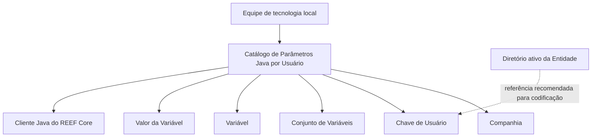

# Definição de Parâmetros Java por Usuário no REEF Core

## 1. Metadados do Documento
- **Arquivo de Origem:** Não identificado no conteúdo fornecido
- **Tipo de Documento:** Especificação Técnica / Procedimento de Configuração
- **Domínio / Sistema:** REEF Core
- **Público-Alvo:** Equipe de tecnologia local, administradores de usuários e operação técnica
- **Data/Versão Identificada:** Não identificada

---

## 2. Resumo Executivo & Contexto de Negócio

O documento descreve o catálogo de **Parâmetros Java por Usuário** no sistema REEF Core. Esse catálogo é utilizado para configurar propriedades que o cliente Java do REEF Core deve considerar individualmente para cada usuário criado nas companhias em que o usuário pode operar.

A definição desses parâmetros ocorre por companhia e por usuário. Os atributos principais identificam a companhia, a chave do usuário, o conjunto de variáveis, a variável específica e o valor concreto atribuído à variável. A estrutura permite organizar parâmetros por taxonomia ou família, relacionando variáveis que compartilham características ou propriedades comuns.

Os exemplos indicam que os parâmetros podem controlar aspectos operacionais e de ambiente do cliente Java, incluindo a imagem de fundo da aplicação, a companhia padrão de conexão, o exercício contábil do usuário, o caminho do compilador instalado no equipamento do usuário e o domínio remetente utilizado para envio de e-mails sem resposta.

A responsabilidade pelas tarefas de configuração é atribuída exclusivamente à equipe de tecnologia local. Como prática recomendada, os códigos de usuários cadastrados nesse catálogo devem seguir a mesma identificação utilizada no diretório ativo da entidade, reduzindo inconsistências entre os sistemas de identidade e configuração.

O documento também alerta que sua leitura isolada pode conduzir a interpretações incorretas. Para complementar o entendimento, recomenda consultar os documentos e diretrizes relacionados a **Usuários da Entidade** e **Configuração de Usuários no Servidor de Aplicações**.

---

## 3. Arquitetura, Componentes & Tecnologias Envolvidas

| Componente / Tecnologia | Papel descrito no documento |
| :--- | :--- |
| REEF Core | Sistema no qual devem ser configuradas as propriedades consideradas pelo cliente Java. |
| Cliente Java do REEF Core | Cliente que consome os parâmetros configurados por usuário e companhia. |
| Catálogo de Parâmetros Java por Usuário | Catálogo utilizado para registrar a companhia, o usuário, a família de variáveis, a variável e seu valor. |
| Equipe de tecnologia local | Equipe com responsabilidade exclusiva pelas tarefas de definição dos parâmetros. |
| Diretório ativo da Entidade | Referência recomendada para padronizar a codificação dos usuários no catálogo. |
| Servidor de Aplicações | Componente citado em documento relacionado de configuração de usuários. |
| Compilador Java | Ferramenta cujo caminho pode ser configurado como parâmetro no equipamento do usuário. |

O documento não fornece uma arquitetura de infraestrutura, topologia de servidores, protocolos de integração, métodos HTTP, contratos JSON ou fluxos detalhados entre componentes. A relação funcional explicitamente descrita é a configuração de parâmetros por usuário e companhia para consumo pelo cliente Java do REEF Core.



---

## 4. Regras de Negócio, Especificações Funcionais & Processos

### Responsabilidade de configuração

1. As tarefas relacionadas à definição dos parâmetros Java por usuário são de responsabilidade exclusiva da equipe de tecnologia local.
2. O catálogo deve ser utilizado para configurar propriedades aplicáveis ao cliente Java do REEF Core.
3. A configuração deve considerar cada usuário criado nas companhias nas quais esse usuário pode operar.

### Identificação do contexto de configuração

1. A **Companhia** identifica o código da companhia sobre a qual a definição de parâmetros está sendo realizada.
2. A **Chave de Usuário** identifica o código do usuário da entidade.
3. O **Conjunto de Variáveis** define a taxonomia ou família da variável, permitindo relacionar variáveis por características ou propriedades comuns.
4. A **Variável** identifica o parâmetro Java específico do usuário.
5. O **Valor da Variável** armazena o valor concreto associado ao parâmetro Java.

### Tipos de parâmetros Java exemplificados

O documento apresenta os seguintes exemplos de parâmetros que podem ser definidos para um usuário:

1. Rota e imagem JPEG utilizada como fundo da aplicação.
2. Companhia padrão com a qual o usuário se conecta na aplicação.
3. Exercício contábil do usuário.
4. Rota do compilador instalada no equipamento do usuário.
5. Domínio do remetente quando o usuário envia e-mail sem resposta.

### Boa prática de identificação de usuários

A codificação de usuários no Catálogo de Parâmetros Java por Usuário deve seguir a mesma identificação adotada no diretório ativo da entidade.

### Dependências documentais

A interpretação do documento deve ser complementada pela leitura dos materiais relacionados:

- **Usuarios de la Entidad**
- **Configuración de Usuarios en el Servidor de Aplicaciones**

---

## 5. Tabelas de Parâmetros, Ambientes e Estruturas de Dados

| Item / Parâmetro | Descrição / Função | Tipo / Valores / Formato | Ambiente / Observações |
| :--- | :--- | :--- | :--- |
| Companhia | Código da companhia sobre a qual está sendo realizada a definição dos parâmetros. | Código de companhia; formato não detalhado. | Aplicável às companhias em que o usuário pode operar. |
| Chave de Usuário | Código do usuário da entidade. | Código de usuário; formato não detalhado. | Recomenda-se utilizar a mesma codificação do diretório ativo da entidade. |
| Conjunto de Variáveis | Taxonomia ou família da variável definida, usada para relacionar variáveis com características ou propriedades comuns. | Classificação ou família; valores não detalhados. | Utilizado para organização dos parâmetros. |
| Variável | Parâmetro Java específico atribuído ao usuário. | Nome ou identificador de parâmetro; formato não detalhado. | Pode representar configuração visual, contábil, de compilador ou de e-mail. |
| Valor da Variável | Valor concreto associado à variável ou parâmetro Java. | Valor textual, numérico ou caminho, conforme a variável. | Consumido pelo cliente Java do REEF Core. |
| Imagem de fundo | Rota e imagem JPEG utilizada como fundo na aplicação. | `"mapfre/trn/images/molecule.jpg"` | Exemplo apresentado no documento. |
| Companhia padrão | Companhia padrão com a qual o usuário se conecta à aplicação. | `1` | Exemplo apresentado no documento. |
| Exercício contábil | Exercício contábil associado ao usuário. | `2024` | Exemplo apresentado no documento. |
| Rota do compilador | Caminho do compilador no equipamento do usuário. | `C:\wtw\jdk1.3\bin\` | Exemplo apresentado no documento. |
| Domínio remetente | Domínio utilizado quando o usuário envia e-mail sem resposta. | `"mapfre.com"` | Exemplo apresentado no documento. |

---

## 6. Bateria de Perguntas & Respostas para RAG (FAQ Sintético)

### P1: Qual é o objetivo do Catálogo de Parâmetros Java por Usuário no REEF Core?
**R:** O catálogo configura as propriedades que o cliente Java do REEF Core deve considerar para cada usuário criado nas companhias em que esse usuário pode operar.

### P2: Quem é responsável por definir os parâmetros Java por usuário?
**R:** As tarefas de definição dos parâmetros são de responsabilidade exclusiva da equipe de tecnologia local.

### P3: Qual informação é registrada no atributo Companhia?
**R:** O atributo Companhia registra o código da companhia sobre a qual está sendo realizada a definição dos parâmetros Java por usuário.

### P4: O que a Chave de Usuário identifica no catálogo?
**R:** A Chave de Usuário contém o código do usuário da entidade para o qual os parâmetros Java estão sendo definidos.

### P5: Para que serve o Conjunto de Variáveis?
**R:** O Conjunto de Variáveis estabelece a taxonomia ou família da variável definida. Essa organização permite relacionar variáveis que possuem características ou propriedades comuns.

### P6: Quais exemplos de parâmetros Java podem ser configurados para um usuário?
**R:** O documento exemplifica a rota e imagem JPEG de fundo da aplicação, a companhia padrão de conexão, o exercício contábil do usuário, a rota do compilador no equipamento do usuário e o domínio remetente para e-mails sem resposta.

### P7: Qual valor de exemplo é fornecido para a imagem de fundo da aplicação?
**R:** O valor de exemplo para a rota e imagem JPEG de fundo é `"mapfre/trn/images/molecule.jpg"`.

### P8: Qual valor de exemplo é fornecido para a rota do compilador?
**R:** O documento apresenta `C:\wtw\jdk1.3\bin\` como exemplo de rota do compilador no equipamento do usuário.

### P9: Como os usuários devem ser codificados no Catálogo de Parâmetros Java por Usuário?
**R:** Recomenda-se codificar os usuários no catálogo da mesma maneira que os usuários são identificados no diretório ativo da entidade.

### P10: Qual é o valor de exemplo para a companhia padrão do usuário?
**R:** O valor de exemplo apresentado para a companhia padrão do usuário é `1`.

### P11: Qual documento complementar deve ser consultado para evitar interpretação isolada incorreta?
**R:** O documento recomenda consultar as diretrizes e documentos funcionais relacionados, incluindo **Usuarios de la Entidad** e **Configuración de Usuarios en el Servidor de Aplicaciones**.

### P12: O documento especifica métodos HTTP, APIs ou contratos JSON do REEF Core?
**R:** Não. O conteúdo fornecido descreve a configuração do Catálogo de Parâmetros Java por Usuário, mas não detalha métodos HTTP, APIs, contratos JSON, portas, URLs ou protocolos de integração.

---

## 7. Glossário de Termos, Siglas & Conceitos-Chave

- **REEF Core:** Sistema no qual são configuradas propriedades consideradas pelo cliente Java para cada usuário e companhia.
- **Cliente Java:** Cliente do REEF Core que considera os parâmetros Java definidos no catálogo.
- **Catálogo de Parâmetros Java por Usuário:** Estrutura de configuração para associar parâmetros Java a usuários e companhias.
- **Companhia:** Código da companhia na qual a definição do parâmetro está sendo realizada.
- **Chave de Usuário:** Código identificador do usuário da entidade.
- **Conjunto de Variáveis:** Taxonomia ou família usada para agrupar variáveis por características ou propriedades comuns.
- **Variável:** Parâmetro Java específico definido para um usuário.
- **Valor da Variável:** Valor concreto atribuído a uma variável ou parâmetro Java.
- **Diretório ativo da Entidade:** Referência de identidade cuja codificação de usuários deve ser seguida no catálogo, conforme recomendação do documento.
- **Exercício contábil:** Ano ou período contábil associado ao usuário; o documento apresenta `2024` como exemplo.
- **Domínio remetente:** Domínio usado quando o usuário envia um e-mail sem resposta.

---

## 8. Notas Críticas, Riscos & Limitações

- **Nota de Análise:** O documento não identifica o nome do arquivo de origem, versão, data de publicação, autor ou área proprietária.
- **Nota de Análise:** O conteúdo não detalha o mecanismo técnico pelo qual o cliente Java do REEF Core lê, valida, armazena ou atualiza os parâmetros.
- **Nota de Análise:** Não são apresentados nomes técnicos das variáveis, formatos obrigatórios, tipos de dados, validações, valores permitidos ou valores padrão.
- **Nota de Análise:** O documento não informa se a configuração exige reinicialização do cliente Java, nova autenticação do usuário ou publicação em servidor de aplicações.
- **Risco operacional:** A divergência entre a Chave de Usuário no catálogo e a identificação no diretório ativo da entidade pode causar inconsistência de configuração. O documento recomenda adotar a mesma codificação.
- **Dependência documental:** A leitura isolada pode conduzir a erro de interpretação. Devem ser consultados os documentos relacionados a usuários da entidade e à configuração no servidor de aplicações.
- **Nota de Análise:** Não há detalhamento adicional sobre permissões de alteração, auditoria, aprovação, trilha de mudanças ou segregação de funções para o catálogo.

---

## 9. Conteúdo Bruto Estruturado (Referência Fiel)

```text
--- [PÁGINA 1 DE 2] ---

DEFINICIÓN de Parámetros Java por Usuario
Contexto
En Reef.core se tienen que configurar las propiedades que debe contemplar el cliente Java de
Reef.core por cada Usuario creado en las compañías en las que estos puedan operar.
Datos Identificativos
Estas tareas son responsabilidad exclusiva del equipo de tecnología local.
Datos Identificativos
Compañía
Este Atributo del catálogo contiene el código de la compañía sobre la cual se está realizando la
definición de los Parámetros.
Clave de Usuario
Este Atributo del catálogo contiene el código del Usuario de la entidad.
Conjunto de Variables
Este Atributo del catálogo establece la Taxonomía o Familia de la Variable Definida a efectos de
relacionarlas de acuerdo a sus características o propiedades comunes.
Variable
 / 
 CF
Home Solutions APIs Documentation Zeus
EN


--- [PÁGINA 2 DE 2] ---

Este Atributo del catálogo establece el parámetro Java del Usuario como por ejemplo:
La ruta e imagen jpeg utilizada de fondo en la aplicación.
La Compañía por Defecto del Usuario con la que se conecta en la aplicación.
El Ejercicio contable del Usuario.
La Ruta del Compilador en el equipo del Usuario.
El Dominio del Remitente cuando el Usuario envía un Correo electrónico sin réplica,
...
Valor de la Variable
Esta Propiedad contiene el valor concreto del parámetro Java. Siguiendo con las variables de
ejemplo anteriores:
"mapfre/trn/images/molecule.jpg"
1
2024
C:\wtw\jdk1.3\bin\
"mapfre.com"
...
Vínculos
Relación de Directrices y Documentos funcionales cuya lectura recomendada para evitar que la
interpretación aislada del presente documento pueda conducir a error.
Usuarios de la Entidad
Configuración de Usuarios en el Servidor de Aplicaciones
Preguntas frecuentes
(1) ¿Existe alguna recomendación que pueda ser tomada en consideración en el uso y definición del
Catálogo de Parámetros Java por Usuario de la Entidad?
Es una buena práctica codificar a los usuarios en este catálogo de la misma manera con la que se
identifica a los usuarios en el directorio activo de la Entidad.
```
