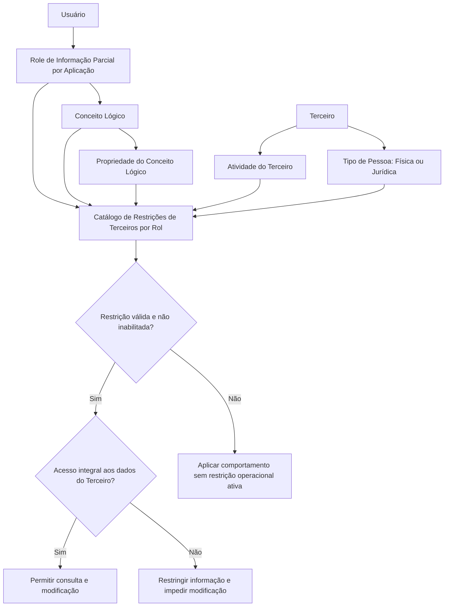

# Catálogo de Restrições de Terceiros por Rol no Reef.core

## 1. Metadados do Documento
- **Arquivo de Origem:** Não identificado no conteúdo fornecido
- **Tipo de Documento:** Especificação Técnica / Procedimento Funcional
- **Domínio / Sistema:** Reef.core — gestão de Terceiros, Roles de Informação Parcial e Conceitos Lógicos
- **Público-Alvo:** Desenvolvedores, Arquitetos, Analistas Funcionais, Operação e Administração de Catálogos
- **Data/Versão Identificada:** Não identificada

---

## 2. Resumo Executivo & Contexto de Negócio

O documento descreve o catálogo de **Restrições de Terceiros por Rol** do sistema **Reef.core**. O objetivo desse catálogo é aprofundar a modulação do comportamento da aplicação quando são atribuídos a usuários determinados Roles e Conceitos Lógicos, restringindo o acesso a informações relacionadas a Terceiros.

As restrições podem considerar a atividade do Terceiro afetado, o Role de Informação Parcial por Aplicação, o Conceito Lógico, uma propriedade específica do Conceito Lógico, o tipo de pessoa — física ou jurídica — e a classificação da restrição. Dessa forma, uma definição de restrição é composta por atributos que delimitam precisamente quando e sobre qual informação a aplicação deve aplicar uma limitação de acesso.

O exemplo apresentado estabelece que um usuário pode possuir um Role que afeta o Conceito Lógico de **Contactos de um Terceiro**, enquanto a restrição se aplica somente à consulta de informações de pessoas físicas. Nesse cenário, a aplicação não apresenta os contactos quando a consulta é feita para uma pessoa física, mas apresenta os contactos quando a consulta é feita para uma pessoa jurídica.

O documento também registra uma regra operacional importante do Reef.core: se um usuário não puder acessar integralmente todos os dados de um Terceiro, esse usuário também não poderá modificar os dados desse Terceiro. A regra busca evitar a incongruência de permitir que um usuário altere dados que não pode consultar.

A interpretação do catálogo não deve ser isolada. O documento recomenda a leitura de diretrizes e documentos funcionais relacionados a Roles de Informação Parcial, incluindo Roles por Aplicação e Roles por Conceito Lógico.

---

## 3. Arquitetura, Componentes & Tecnologias Envolvidas

O conteúdo identifica o **Reef.core** como sistema responsável pela rotina de Terceiros e pela aplicação das restrições de informação. Não são descritos métodos HTTP, contratos JSON, banco de dados, infraestrutura, versões de tecnologia, servidores, URLs, ambientes de execução ou integrações externas.

Os componentes funcionais identificados são:

| Componente / Conceito | Papel descrito |
| :--- | :--- |
| Reef.core | Sistema no qual a rotina de Terceiros aplica as regras de acesso e modificação. |
| Catálogo de Restrições de Terceiros por Rol | Catálogo usado para configurar restrições de informação associadas a Roles. |
| Usuário | Entidade à qual são atribuídos Roles e Conceitos Lógicos. |
| Terceiro | Entidade cujos dados, actividades, contactos ou propriedades podem sofrer restrições. |
| Role de Informação Parcial por Aplicação | Role identificado no catálogo e sobre o qual é configurada a restrição. |
| Conceito Lógico | Elemento associado ao Role de Informação Parcial por Aplicação que pode ser restringido. |
| Propriedade do Conceito Lógico | Propriedade específica de um Conceito Lógico que pode ser restringida. |
| Pessoa Física / Jurídica | Classificação que determina a que tipo de pessoa a restrição se aplica. |
| Tipo de Restrição | Classificação da restrição conforme valores do catálogo do núcleo. |



> **Nota de Análise:** O diagrama representa exclusivamente relações funcionais explicitadas pelo texto. O documento não detalha a implementação técnica, a sequência interna de validações ou os mecanismos de persistência do catálogo.

---

## 4. Regras de Negócio, Especificações Funcionais & Processos

### 4.1 Finalidade das restrições

O Reef.core permite que as restrições associadas à atribuição de Roles e Conceitos Lógicos a Usuários modulem o comportamento da aplicação. As restrições consideram:

1. As actividades dos Terceiros afetadas.
2. A aplicabilidade para pessoas físicas, pessoas jurídicas ou ambos os tipos.
3. A forma pela qual a operação é restringida.
4. O Role de Informação Parcial por Aplicação afetado.
5. O Conceito Lógico e, opcionalmente, a propriedade específica do Conceito Lógico sujeita à restrição.
6. A classificação da restrição, conforme o catálogo do núcleo.
7. A vigência e a inabilitação do registo de restrição.

### 4.2 Regra de visibilidade por tipo de pessoa

Quando uma restrição estiver configurada para consultas de informação de pessoas físicas:

- A aplicação não deve visualizar os Contactos do Terceiro quando a consulta for realizada sobre uma pessoa física.
- A aplicação deve mostrar os Contactos quando a consulta for realizada sobre uma pessoa jurídica.
- O exemplo pressupõe que o usuário possui um Role que afeta o Conceito Lógico de Contactos de um Terceiro.

### 4.3 Regra para ambos os tipos de pessoa

Para aplicar uma restrição simultaneamente a pessoas físicas e pessoas jurídicas:

- O atributo **Pessoa Física/Jurídica** deve possuir o valor **`Z`**.

### 4.4 Regra para todas as propriedades de um Conceito Lógico

Para restringir todas as propriedades de um Conceito Lógico:

- O atributo **Propriedade do Conceito Lógico a restringir** deve receber o valor genérico **`ZZZZ...ZZZZ`**.

O documento não especifica a quantidade de caracteres `Z`, o formato técnico exato do campo, nem a validação usada pelo sistema para reconhecer esse valor genérico.

### 4.5 Regra de inabilitação

A propriedade **Inhabilitación** determina se o registo de restrição está inabilitado para uso. Um registo inabilitado não deve ser utilizado.

### 4.6 Regra de validade e histórico

A propriedade **Fecha de Validez** informa ao sistema a data a partir da qual a definição da restrição está plenamente operacional. O uso correto dessa data permite manter um histórico de alterações realizadas nas definições de restrição.

### 4.7 Regra de consulta e modificação de dados de Terceiros

Na rotina de Terceiros do Reef.core:

1. Se um Usuário não puder acessar completamente todos os dados de um Terceiro, o Usuário não poderá modificar os dados desse Terceiro.
2. A justificativa apresentada é que seria incongruente permitir que um Usuário modificasse dados que não consegue consultar.
3. A regra vincula a capacidade de modificação à capacidade de consulta integral dos dados do Terceiro.

### 4.8 Documentação funcional relacionada

Para evitar interpretações equivocadas devido à leitura isolada do documento, são recomendados os seguintes materiais:

- Roles de Información Parcial.
- Roles de Información Parcial por Aplicación.
- Roles de Información Parcial por Concepto Lógico.

> **Nota de Análise:** O documento menciona esses materiais relacionados, mas não contém o conteúdo deles. Portanto, não é possível inferir regras adicionais sobre atribuição, hierarquia ou precedência de Roles.

---

## 5. Tabelas de Parâmetros, Ambientes e Estruturas de Dados

| Item / Parâmetro | Descrição / Função | Tipo / Valores / Formato | Ambiente / Observações |
| :--- | :--- | :--- | :--- |
| Compañía | Contém o código da companhia na qual a restrição de informação está sendo configurada. | Código de companhia; formato não detalhado. | Propriedade Operativa. |
| Código de Actividad del Tercero | Indica no sistema o código da Actividade do Terceiro. | Código de actividade; formato não detalhado. | Usado para delimitar a actividade do Terceiro afetada. |
| Rol afectado | Contém o código que identifica o Role de Informação Parcial por Aplicação sobre o qual a restrição é configurada. | Código de Role; formato não detalhado. | Associado à configuração da restrição. |
| Persona Física/Jurídica | Indica se a restrição se aplica a pessoas físicas ou pessoas jurídicas. | Inclui o valor `Z` para ambos os tipos de pessoa. | Para ambos os tipos, usar `Z`. |
| Concepto Lógico a restringir | Associa ao Role de Informação Parcial por Aplicação o código do Conceito Lógico sobre o qual é estabelecida uma restrição de informação. | Código de Conceito Lógico; formato não detalhado. | Define o objecto lógico restringido. |
| Propiedad del Concepto Lógico a restringir | Associa ao Role de Informação Parcial por Aplicação uma propriedade concreta do Conceito Lógico que se deseja restringir. | Valor genérico `ZZZZ...ZZZZ` para todas as propriedades. | Para restringir todas as propriedades do Conceito Lógico, usar `ZZZZ...ZZZZ`. |
| Tipo de Restricción | Identifica a classificação da restrição segundo os valores do catálogo do núcleo. | Valores do catálogo do núcleo; valores específicos não informados. | O documento não lista as classificações disponíveis. |
| Inhabilitación | Estabelece se o registo está inabilitado para poder ser utilizado. | Indicador de inabilitação; valores não detalhados. | Outras Propriedades. |
| Fecha de Validez | Informa a data a partir da qual a definição da restrição está plenamente operativa no sistema. | Data; formato não detalhado. | Permite histórico de alterações das definições. |
| Contactos de un Tercero | Conceito Lógico usado no exemplo para demonstrar a restrição de consulta por tipo de pessoa. | Não aplicável. | Não é apresentado como catálogo ou estrutura de dados completa. |
| Reef.core | Sistema que aplica a rotina de Terceiros e a regra de impedir modificação sem acesso integral aos dados. | Não aplicável. | Não são descritos ambientes, versões ou tecnologias. |

> **Nota de Análise:** O conteúdo fornecido não apresenta URLs, rotas de logs, nomes de servidores, portas, variáveis de configuração, contratos de API ou campos técnicos com tipo de dados.

---

## 6. Bateria de Perguntas & Respostas para RAG (FAQ Sintético)

### P1: Qual é o objetivo do Catálogo de Restrições de Terceiros por Rol no Reef.core?
**R:** O Catálogo de Restrições de Terceiros por Rol permite configurar como as restrições associadas a Roles e Conceitos Lógicos atribuídos a Usuários modulam o comportamento da aplicação Reef.core. As configurações podem considerar a actividade do Terceiro, o tipo de pessoa, o Role afetado, o Conceito Lógico, uma propriedade concreta, o tipo de restrição, a inabilitação e a data de validade.

### P2: Como uma restrição pode afetar a visualização de Contactos de um Terceiro?
**R:** O documento apresenta um exemplo em que um Usuário possui um Role que afeta o Conceito Lógico de Contactos de um Terceiro, mas a restrição se aplica somente às consultas de pessoas físicas. Nesse caso, ao consultar os dados de uma pessoa física, a aplicação não visualiza os Contactos; ao consultar uma pessoa jurídica, a aplicação mostra os Contactos.

### P3: Qual valor deve ser usado para aplicar a restrição tanto a pessoas físicas quanto a pessoas jurídicas?
**R:** O atributo **Persona Física/Jurídica** deve receber o valor **`Z`** quando a restrição precisar ser aplicada aos dois tipos de pessoas: físicas e jurídicas.

### P4: Como restringir todas as propriedades de um Conceito Lógico?
**R:** Para realizar uma restrição sobre todas as propriedades de um Conceito Lógico, o atributo **Propiedad del Concepto Lógico a restringir** deve receber o valor genérico **`ZZZZ...ZZZZ`**. O documento não detalha o tamanho exato desse valor nem regras técnicas adicionais de preenchimento.

### P5: O que identifica o atributo Rol afectado?
**R:** O atributo **Rol afectado** contém o código que identifica o Role de Informação Parcial por Aplicação sobre o qual a restrição está sendo configurada.

### P6: Qual é a finalidade do atributo Concepto Lógico a restringir?
**R:** O atributo **Concepto Lógico a restringir** associa ao Role de Informação Parcial por Aplicação o código do Conceito Lógico cuja informação sofrerá alguma restrição.

### P7: O que ocorre se um Usuário não possui acesso completo aos dados de um Terceiro?
**R:** Na rotina de Terceiros do Reef.core, um Usuário que não consegue acessar completamente todos os dados de um Terceiro também não pode modificar os dados desse Terceiro. O documento justifica essa regra afirmando que seria incongruente permitir a modificação de dados que o próprio Usuário não pode consultar.

### P8: Qual é a função da propriedade Inhabilitación?
**R:** A propriedade **Inhabilitación** define se o registo da restrição está inabilitado para utilização. Um registo marcado como inabilitado não pode ser usado pelo sistema.

### P9: Qual é a função da Fecha de Validez em uma definição de restrição?
**R:** A propriedade **Fecha de Validez** informa a data a partir da qual a definição da restrição se torna plenamente operativa no sistema. O seu uso correto permite manter histórico das alterações efetuadas nas definições de restrição.

### P10: O que é o Tipo de Restricción?
**R:** O **Tipo de Restricción** identifica a classificação da restrição de acordo com os valores existentes no catálogo do núcleo. O documento não informa quais são esses valores de classificação.

### P11: Que documentos devem ser consultados para interpretar corretamente o Catálogo de Restrições de Terceiros por Rol?
**R:** O documento recomenda consultar os materiais de Roles de Información Parcial, Roles de Información Parcial por Aplicación e Roles de Información Parcial por Concepto Lógico. A leitura desses documentos é recomendada para evitar interpretações incorretas causadas pela análise isolada do catálogo.

### P12: O documento informa APIs, URLs ou contratos de integração do Reef.core?
**R:** Não. O conteúdo fornecido não descreve métodos HTTP, endpoints, URLs, contratos JSON, servidores, ambientes, tecnologias de implementação ou mecanismos de integração.

---

## 7. Glossário de Termos, Siglas & Conceitos-Chave

- **Reef.core:** Sistema mencionado como responsável pela rotina de Terceiros e pela aplicação da regra de consulta e modificação de dados.
- **Terceiro:** Entidade cujos dados, actividades, contactos e informações podem estar sujeitos a restrições.
- **Role de Informação Parcial:** Role relacionado a restrições de informação; o documento também referencia Roles por Aplicação e por Conceito Lógico.
- **Role de Informação Parcial por Aplicação:** Role identificado por código sobre o qual a configuração de restrição é estabelecida.
- **Conceito Lógico:** Elemento lógico associado a um Role e sujeito a restrição de informação.
- **Propriedade do Conceito Lógico:** Propriedade concreta de um Conceito Lógico que pode ser restringida.
- **Código de Actividade do Terceiro:** Código que representa no sistema a actividade do Terceiro.
- **Pessoa Física:** Tipo de pessoa para o qual uma restrição pode ser configurada.
- **Pessoa Jurídica:** Tipo de pessoa para o qual uma restrição pode ser configurada.
- **`Z`:** Valor do atributo Pessoa Física/Jurídica utilizado para aplicar uma restrição a ambos os tipos de pessoa.
- **`ZZZZ...ZZZZ`:** Valor genérico indicado para restringir todas as propriedades de um Conceito Lógico.
- **Tipo de Restrição:** Classificação da restrição conforme os valores do catálogo do núcleo.
- **Inhabilitación:** Propriedade que indica se um registo de restrição está inabilitado para utilização.
- **Fecha de Validez:** Data a partir da qual uma definição de restrição se torna plenamente operativa.
- **Contactos de um Terceiro:** Conceito Lógico utilizado no exemplo de restrição de consulta por tipo de pessoa.

---

## 8. Notas Críticas, Riscos & Limitações

- O documento não apresenta detalhes técnicos de implementação, tais como arquitetura de software, serviços, APIs, bases de dados, contratos de integração, tecnologias, versões ou mecanismos de autorização.
- Não são enumerados os valores disponíveis para o atributo **Tipo de Restricción**; somente é informado que os valores pertencem ao catálogo do núcleo.
- Não há definição do formato dos códigos de companhia, actividade, Role ou Conceito Lógico.
- O valor genérico **`ZZZZ...ZZZZ`** é apresentado com reticências; o documento não especifica sua extensão, máscara ou regra de validação.
- Não são descritos critérios de precedência ou resolução de conflito entre múltiplas restrições aplicáveis ao mesmo Usuário, Terceiro, Role ou Conceito Lógico.
- Não são detalhados os valores possíveis para **Inhabilitación**, nem o comportamento exato da aplicação para registos inabilitados além de que não podem ser utilizados.
- A data de validade é descrita como marco de operação plena e apoio ao histórico, mas não há regras para expiração, retroatividade, sobreposição de vigências ou fuso horário.
- A regra de impedir modificação quando não há acesso completo aos dados do Terceiro é explícita, mas não há detalhamento de quais operações constituem modificação.
- A interpretação isolada é expressamente desaconselhada; existem dependências funcionais dos documentos sobre Roles de Informação Parcial, Roles por Aplicação e Roles por Conceito Lógico.

---

## 9. Conteúdo Bruto Estruturado (Referência Fiel)

```text
--- [PÁGINA 1 DE 3] ---

ASIGNACIÓN de Restricciones de Terceros por
Rol
Contexto
Reef.core permite profundizar la manera en la que las restricciones, en la asignación de los Roles y
Conceptos Lógicos a los Usuarios, van a modular el comportamiento de la aplicación ya que se
contemplan por una parte las actividades de los Terceros afectadas, si para una actividad en
concreto están afectadas tanto las personas físicas como las personas jurídicas y la forma en que se
restringe la operación.
Por ejemplo, si un usuario tuviera asignado un Rol que afectara al Concepto lógico de los Contactos
de un Tercero y la restricción solamente afectara las consultas de información de las personas
físicas, cuando ese Usuario realizara una consulta a los datos de una persona física La Aplicación
no visualizaría sus Contactos mostrándolos en cambio si la consulta se realizara para una persona
Jurídica.
Propiedades Operativas
Otras Propiedades
Propiedades Operativas
Compañía
Este Atributo del catálogo contiene el código de la compañía en la que se está configurando la
restricción de la información.
 / 
 CF
Home Solutions APIs Documentation Zeus
EN


--- [PÁGINA 2 DE 3] ---

Código de Actividad del Tercero
Esta propiedad indica en el sistema el código de la Actividad del Tercero.
Rol afectado
Este Atributo del catálogo contiene el código que identifica el Rol de Información Parcial por
Aplicación sobre el que se configura la restricción.
Persona Física/Jurídica
Esta propiedad del catálogo indica si la restricción aplica a las personas físicas o a las personas
jurídicas.
NOTA: Si la restricción se quiere realizar a ambos tipos de Personas el valor de este atributo debe
ser 'Z'.
Concepto Lógico a restringir
Este Atributo del catálogo asocia al Rol de Información Parcial por Aplicación el código del concepto
lógico sobre el que se está estableciendo alguna restricción en su información.
Propiedad del Concepto Lógico a restringir
Este Atributo del catálogo asocia al Rol de Información Parcial por Aplicación una Propiedad concreta
del Concepto Lógico que se desea Restringir.
NOTA: Si la restricción se quiere realizar sobre todas las propiedades del Concepto Lógico el valor
de este atributo debe ser el valor genérico'ZZZZ...ZZZZ'.
Tipo de Restricción
Esta propiedad identifica la Clasificación de la restricción de acuerdo con los valores del catálogo del
núcleo.
Otras Propiedades
Inhabilitación
Esta propiedad establece si el registro está inhabilitado para poder ser utilizado.
Fecha de Validez
Esta propiedad le indica al Sistema la fecha a partir de la cual la definición de la restricción está
plenamente operativa en el sistema por lo que su correcto uso permite tener un histórico de los
cambios efectuados en sus definiciones.


--- [PÁGINA 3 DE 3] ---

Vínculos
Relación de Directrices y Documentos funcionales cuya lectura recomendada para evitar que la
interpretación aislada del presente documento pueda conducir a error.
Roles de Información Parcial
Roles de Información Parcial por Aplicación
Roles de Información Parcial por Concepto Lógico
Preguntas frecuentes
(1) ¿Existe alguna recomendación que pueda ser tomada en consideración respecto del uso y
definición del Catálogo de Restricciones de los Terceros por Rol?
Es importante considerar que en la rutina de Terceros de Reef.core se estableció que si un Usuario
no pudiera acceder completamente a todos los datos del Tercero tampoco estaría en disposición de
poder modificarlos; sería incongruente que no pudiera consultar lo que él mismo está modificando.
```
