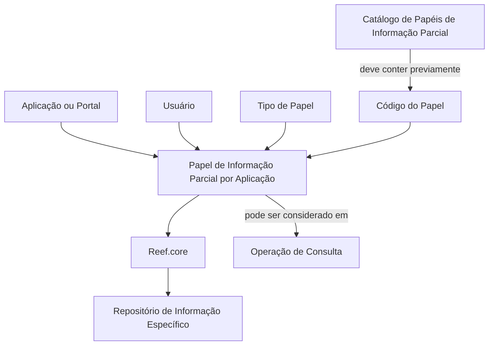

# Definição dos Papéis de Informação Parcial por Aplicação no Reef.core

## 1. Metadados do Documento
- **Arquivo de Origem:** Não identificado
- **Tipo de Documento:** Especificação Funcional
- **Domínio / Sistema:** Reef.core — Catálogo de Papéis de Informação Parcial
- **Público-Alvo:** Negócio, Analistas Funcionais, Desenvolvedores e Operação
- **Data/Versão Identificada:** Não identificada

---

## 2. Resumo Executivo & Contexto de Negócio

O documento descreve a definição de papéis de informação parcial por aplicação no sistema Reef.core. A funcionalidade permite codificar a relação entre papéis de informação parcial que podem ser atribuídos a usuários em um repositório de informação específico.

A configuração associa uma aplicação ou portal, um usuário, um tipo de papel e um código de papel. A aplicação ou portal deve ser identificada por um código existente no catálogo do sistema, enquanto o usuário é a pessoa que utiliza a aplicação ou portal configurado.

O documento também estabelece propriedades para controlar a disponibilidade operacional do papel. A propriedade de inabilitação informa se o código do papel está impedido de ser considerado durante a execução de uma operação de consulta. A data de validade determina a data a partir da qual o papel por aplicação está plenamente operativo e permite manter histórico das alterações nas definições.

A principal restrição explícita é de integridade de configuração: antes de atribuir a um usuário um papel de informação parcial por aplicação, o papel precisa estar previamente configurado no catálogo de Papéis de Informação Parcial.

---

## 3. Arquitetura, Componentes & Tecnologias Envolvidas

Os elementos funcionais identificados no documento são:

- **Reef.core:** Sistema que possui a funcionalidade de codificar relações de papéis de informação parcial.
- **Catálogo de Papéis de Informação Parcial:** Catálogo que deve conter previamente o papel antes de sua atribuição a um usuário por aplicação.
- **Papel de Informação Parcial por Aplicação:** Configuração que relaciona aplicação ou portal, usuário, tipo de papel e papel.
- **Aplicação ou Portal:** Contexto de uso para o qual a funcionalidade do papel é configurada.
- **Usuário:** Entidade que utiliza a aplicação ou portal e recebe o tipo de papel.
- **Repositório de Informação:** Repositório específico no qual os papéis de informação parcial podem ser atribuídos.



**Nota de Análise:** O documento não detalha interfaces técnicas, métodos HTTP, contratos JSON, banco de dados, URLs, ambientes, tecnologias de implementação ou mecanismos de autenticação.

---

## 4. Regras de Negócio, Especificações Funcionais & Processos

1. O Reef.core pode codificar a relação entre papéis de informação parcial atribuíveis a usuários em um repositório de informação específico.

2. A configuração de papel de informação parcial por aplicação deve considerar o código da aplicação ou portal.

3. O código da aplicação ou portal deve estar de acordo com os valores existentes no catálogo do sistema.

4. A configuração deve identificar o usuário que utiliza a aplicação ou portal.

5. A configuração deve conter o tipo de papel atribuído ao usuário.

6. O atributo **Papel** deve conter o código que identifica o papel.

7. A propriedade **Inabilitação** estabelece se o código do papel está inabilitado para ser considerado durante a execução de uma operação de consulta.

8. A propriedade **Data de Validade** indica a data a partir da qual o papel por aplicação está plenamente operativo no sistema.

9. O uso correto da data de validade permite manter um histórico das alterações realizadas nas definições dos papéis por aplicação.

10. Para atribuir um papel de informação parcial por aplicação a um usuário, o papel deve estar previamente configurado no catálogo de Papéis de Informação Parcial.

---

## 5. Tabelas de Parâmetros, Ambientes e Estruturas de Dados

| Item / Parâmetro | Descrição / Função | Tipo / Valores / Formato | Ambiente / Observações |
| :--- | :--- | :--- | :--- |
| Aplicação | Contém o código da aplicação ou portal no qual a funcionalidade do papel de informação parcial é configurada. | Código de aplicação ou portal. | Deve corresponder aos valores do catálogo existente no sistema. |
| Usuário | Contém o usuário que utiliza a aplicação ou portal. | Usuário. | Associado à configuração de papel por aplicação. |
| Tipo de Papel | Contém o tipo de papel atribuído ao usuário. | Tipo de papel. | O documento não detalha valores permitidos. |
| Papel | Atributo do catálogo que contém o código identificador do papel. | Código de papel. | Deve estar previamente configurado no Catálogo de Papéis de Informação Parcial antes da atribuição ao usuário. |
| Inabilitação | Estabelece se o código do papel está inabilitado para ser considerado em uma operação de consulta. | Indicador de inabilitação. | O documento não especifica formato, valores ou comportamento para papéis inabilitados. |
| Data de Validade | Indica a data a partir da qual o papel por aplicação está plenamente operativo. | Data. | Permite manter histórico de alterações nas definições. |
| Repositório de Informação | Repositório específico no qual papéis de informação parcial podem ser atribuídos. | Não especificado. | O documento não identifica repositórios concretos. |
| Catálogo de Papéis de Informação Parcial | Catálogo que contém os papéis necessários para atribuição por aplicação. | Catálogo do sistema. | Dependência obrigatória para configurar um papel para um usuário. |

---

## 6. Bateria de Perguntas & Respostas para RAG (FAQ Sintético)

### P1: Qual é a finalidade da definição de papéis de informação parcial por aplicação no Reef.core?
**R:** A funcionalidade permite ao Reef.core codificar a relação entre papéis de informação parcial que podem ser atribuídos a usuários em um repositório de informação específico.

### P2: Quais dados compõem uma configuração de papel de informação parcial por aplicação?
**R:** O documento identifica os seguintes elementos: código da aplicação ou portal, usuário que utiliza a aplicação ou portal, tipo de papel atribuído ao usuário e código do papel.

### P3: O que representa a propriedade Aplicação?
**R:** A propriedade Aplicação contém o código da aplicação ou portal para o qual está sendo configurada a funcionalidade de papel de informação parcial. O código deve obedecer aos valores existentes no catálogo do sistema.

### P4: Qual é a restrição para atribuir um papel de informação parcial a um usuário?
**R:** Se um usuário tiver atribuído um papel de informação parcial por aplicação, esse papel deve ter sido configurado previamente no Catálogo de Papéis de Informação Parcial.

### P5: Qual é a função da propriedade Inabilitação?
**R:** A propriedade Inabilitação estabelece se o código do papel está inabilitado para poder ser considerado durante a execução de uma operação de consulta.

### P6: O que a Data de Validade controla na configuração do papel por aplicação?
**R:** A Data de Validade informa ao sistema a data a partir da qual o papel por aplicação está plenamente operativo. O uso correto dessa propriedade permite manter histórico das alterações efetuadas nas definições.

### P7: O documento informa quais métodos ou contratos técnicos são expostos pelo Reef.core?
**R:** Não. O documento descreve propriedades funcionais e regras de configuração, mas não detalha métodos HTTP, contratos JSON, serviços, URLs ou interfaces técnicas.

### P8: O que identifica o atributo Papel?
**R:** O atributo Papel contém o código que identifica o papel no catálogo.

### P9: O documento especifica os valores possíveis para Tipo de Papel?
**R:** Não. O documento afirma que a propriedade contém o tipo de papel atribuído ao usuário, mas não apresenta valores, enumerações ou critérios de classificação.

### P10: Qual é a relação entre a aplicação e o usuário na configuração?
**R:** A aplicação ou portal define o contexto da configuração funcional, enquanto o usuário é a entidade que utiliza essa aplicação ou portal e recebe o tipo de papel configurado.

---

## 7. Glossário de Termos, Siglas & Conceitos-Chave

- **Reef.core:** Sistema citado como responsável pela funcionalidade de codificar relações de papéis de informação parcial.
- **Papel de Informação Parcial:** Papel que pode ser atribuído a usuários em um repositório de informação específico.
- **Papel de Informação Parcial por Aplicação:** Configuração que relaciona um papel de informação parcial ao contexto de uma aplicação ou portal e a um usuário.
- **Catálogo de Papéis de Informação Parcial:** Catálogo no qual um papel deve estar previamente configurado antes de sua atribuição a um usuário por aplicação.
- **Aplicação ou Portal:** Sistema ou portal identificado por código e usado como contexto de configuração do papel.
- **Inabilitação:** Propriedade que define se um código de papel pode ser considerado em uma operação de consulta.
- **Data de Validade:** Data a partir da qual um papel por aplicação está plenamente operativo no sistema.
- **Repositório de Informação:** Repositório específico em que papéis de informação parcial podem ser atribuídos.

---

## 8. Notas Críticas, Riscos & Limitações

- O documento exige configuração prévia do papel no Catálogo de Papéis de Informação Parcial; a ausência dessa configuração impede uma atribuição válida de papel por aplicação.
- A propriedade Inabilitação influencia a consideração do código do papel durante operações de consulta, mas o documento não especifica os valores aceitos nem o comportamento detalhado da consulta.
- A Data de Validade é relevante para a operacionalidade do papel e para a manutenção do histórico de mudanças, porém não são detalhadas regras para datas futuras, alteração retroativa ou encerramento de vigência.
- O documento não apresenta detalhes técnicos sobre interfaces, integrações, persistência, validações de formato, permissões de administração ou ambientes.
- Há referência a documentos funcionais relacionados — “Papéis de Informação Parcial” e “Papéis de Informação Parcial por Conceito Lógico” —, mas seus conteúdos não foram fornecidos.

---

## 9. Conteúdo Bruto Estruturado (Referência Fiel)

```text
--- [PÁGINA 1 DE 2] ---

DEFINICIÓN de los Roles de Información
Parcial por Aplicación
Contexto
Funcionalmente, Reef.core cuenta con la facultad de codificar la relación de Roles de información
parcial que se pueden asignar a los Usuarios en un repositorio de información específico.
Propiedades Operativas
Otras Propiedades
Propiedades Operativas
Aplicación
Esta Propiedad contiene el código de Aplicación o Portal sobre el que se está configurando la
funcionalidad del Rol de información parcial, de acuerdo con los valores del catálogo existente en el
Sistema.
Usuario
Esta Propiedad contiene el Usuario que utiliza la Aplicación o Portal.
Tipo de Rol
Esta Propiedad contiene el tipo de rol asignado al Usuario
 /
 CF
Home Solutions APIs Documentation Zeus
EN


--- [PÁGINA 2 DE 2] ---

Rol
Este Atributo del catálogo contiene el código que identifica el Rol.
Otras Propiedades
Inhabilitación
Esta propiedad establece si el Código del Rol está inhabilitado para poder ser considerado en la
ejecución de la operación de consulta.
Fecha de Validez
Esta propiedad le indica al Sistema la fecha a partir de la cual el Rol por Aplicación está plenamente
operativo en el sistema por lo que su correcto uso permite tener un histórico de los cambios
efectuados en sus definiciones.
Vínculos
Relación de Directrices y Documentos funcionales cuya lectura recomendada para evitar que la
interpretación aislada del presente documento pueda conducir a error.
Roles de Información Parcial
Roles de Información Parcial por Concepto Lógico
Preguntas frecuentes
(1) ¿Existe alguna restricción que tenga que ser tomada en cuenta en el uso y definición del Catálogo
de Roles por Aplicación en Reef.core?
Se debe tener en cuenta que si un usuario tiene asignado un rol de información parcial por
Aplicación, este Rol tiene que estar configurado previamente en el catálogo de Roles de Información
Parcial.
```
