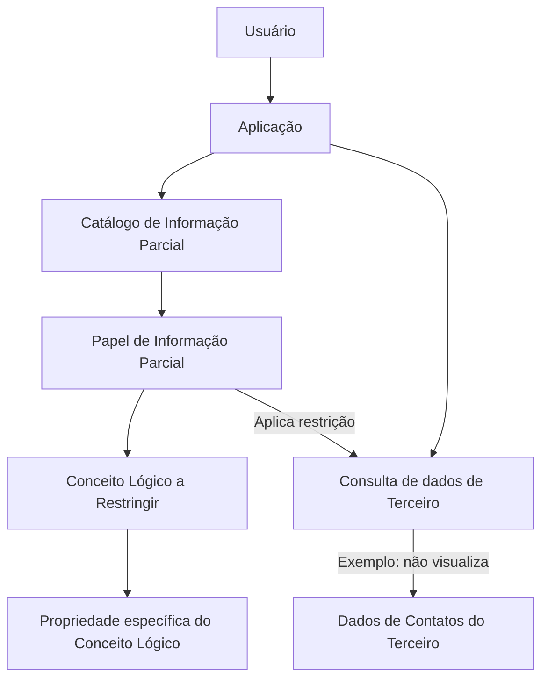

# Atribuição de Papéis de Informação Parcial a Conceitos Lógicos e/ou Propriedades

## 1. Metadados do Documento
- **Arquivo de Origem:** Não identificado
- **Tipo de Documento:** Especificação Funcional
- **Domínio / Sistema:** Reef.core
- **Público-Alvo:** Analistas funcionais, desenvolvedores, administradores de segurança e operação
- **Data/Versão Identificada:** Não identificada

---

## 2. Resumo Executivo & Contexto de Negócio

O documento descreve a capacidade funcional do sistema **Reef.core** para atribuir **Papéis de Informação Parcial** a **Conceitos Lógicos** e, opcionalmente, a propriedades específicas desses conceitos. A atribuição é registrada em um catálogo de informação criado especificamente para controlar acessos e impor restrições sobre dados.

O mecanismo permite restringir a visualização de informações associadas a um conceito lógico. O exemplo fornecido refere-se aos contatos de um terceiro: quando um usuário possui um Papel de Informação Parcial que afeta o conceito lógico de contatos, a aplicação não apresenta os dados de contato de qualquer terceiro consultado por esse usuário.

O catálogo de atribuições identifica a companhia, o papel, o conceito lógico, a propriedade restringida e o módulo funcional relacionado. Também contém propriedades operacionais para inabilitação e vigência, possibilitando controlar se uma definição pode ser utilizada e manter histórico de alterações nas definições.

O documento estabelece uma regra relevante para a rotina de Terceiros do Reef.core: um usuário que não possa acessar integralmente todos os dados de um terceiro também não pode modificar esse terceiro. A restrição de edição evita a inconsistência de permitir que um usuário altere informações que não pode consultar.

---

## 3. Arquitetura, Componentes & Tecnologias Envolvidas

### Componentes e conceitos identificados

| Componente / Conceito | Descrição sustentada pelo documento |
| :--- | :--- |
| Reef.core | Sistema no qual existe a funcionalidade de atribuição de Papéis de Informação Parcial. |
| Catálogo de informação | Catálogo criado especificamente para atribuir Papéis de Informação Parcial a Conceitos Lógicos e/ou propriedades. |
| Papel de Informação Parcial | Papel identificado por código e associado a um Conceito Lógico ou a uma propriedade específica para controlar ou restringir acesso. |
| Conceito Lógico | Elemento sobre o qual pode ser estabelecida uma restrição de informação. |
| Propriedade do Conceito Lógico | Propriedade específica de um Conceito Lógico que pode ser restringida. |
| Rotina de Terceiros | Rotina do Reef.core citada na recomendação funcional relacionada a consulta e modificação de dados de terceiros. |
| Aplicação | Componente que deixa de visualizar dados restritos quando um usuário consulta informações. |
| Tipo de Processo | Propriedade que identifica o módulo funcional ao qual pertencem o Papel de Informação Parcial, o Conceito Lógico e suas propriedades. |



> **Nota de Análise:** O documento não detalha métodos HTTP, contratos JSON, banco de dados, tecnologias de implementação, URLs, ambientes de execução ou integrações externas.

---

## 4. Regras de Negócio, Especificações Funcionais & Processos

### Controle de acesso por Informação Parcial

1. O Reef.core permite atribuir Papéis de Informação Parcial a Conceitos Lógicos sobre os quais se deseja controlar o acesso.
2. O Reef.core também permite limitar o acesso a um Conceito Lógico por algum tipo de restrição.
3. As atribuições são mantidas em um catálogo de informação criado especificamente para esse propósito.
4. Um Papel de Informação Parcial pode afetar um Conceito Lógico completo ou uma propriedade específica de um Conceito Lógico.
5. Quando um usuário possui um Papel de Informação Parcial aplicável a dados consultados, a aplicação não visualiza os dados restringidos.

### Exemplo funcional documentado

1. Existe um Papel de Informação Parcial associado ao Conceito Lógico dos contatos de um terceiro.
2. Um usuário possui esse Papel de Informação Parcial.
3. O usuário consulta os dados de qualquer terceiro.
4. A aplicação não visualiza nenhum dado dos contatos desse terceiro.

### Regra para modificação de Terceiros

| Regra | Condição | Consequência |
| :--- | :--- | :--- |
| Coerência entre consulta e alteração | O usuário não pode acessar completamente todos os dados de um terceiro. | O usuário não pode modificar os dados desse terceiro. |
| Justificativa funcional | Seria incongruente impedir a consulta de informações que o próprio usuário está modificando. | A permissão de alteração depende do acesso completo aos dados do terceiro. |

### Regras de operação do catálogo

| Propriedade | Regra funcional |
| :--- | :--- |
| Inabilitação | Determina se o Conceito Lógico com Informação Parcial está inabilitado para utilização. |
| Data de Validade | Indica a data a partir da qual o Conceito Lógico com Informação Parcial está plenamente operacional no sistema. |
| Histórico | O uso correto da Data de Validade permite manter histórico das alterações efetuadas nas definições. |
| Tipo de Processo | Identifica o módulo funcional em que se enquadram o papel, o conceito lógico e suas propriedades. |

---

## 5. Tabelas de Parâmetros, Ambientes e Estruturas de Dados

| Item / Parâmetro | Descrição / Função | Tipo / Valores / Formato | Ambiente / Observações |
| :--- | :--- | :--- | :--- |
| Companhia | Contém o código da companhia na qual é realizada a atribuição do Papel de Informação Parcial ao Conceito Lógico ou a alguma propriedade. | Código da companhia; formato não detalhado. | Aplicável à atribuição no catálogo. |
| Papel de Informação Parcial | Contém o código que identifica o Papel de Informação Parcial. | Código; formato não detalhado. | Associado ao controle ou restrição de informação. |
| Conceito Lógico a Restringir | Associa ao Papel de Informação Parcial o código do Conceito Lógico sobre o qual existe alguma restrição de informação. | Código do Conceito Lógico; formato não detalhado. | Pode representar a restrição sobre o conceito lógico. |
| Propriedade do Conceito Lógico a Restringir | Associa ao Papel de Informação Parcial a propriedade específica do Conceito Lógico que se deseja restringir. | Propriedade específica; formato não detalhado. | Permite restrição no nível de propriedade. |
| Tipo de Processo | Identifica o módulo funcional em que se enquadram o Papel de Informação Parcial, o Conceito Lógico e suas propriedades. | Módulo funcional; valores não detalhados. | Classificação funcional da atribuição. |
| Inabilitação | Estabelece se o Conceito Lógico com Informação Parcial está inabilitado para uso. | Estado de inabilitação; valores não detalhados. | Propriedade operacional. |
| Data de Validade | Indica a data a partir da qual o Conceito Lógico com Informação Parcial está plenamente operativo. | Data; formato não detalhado. | Permite histórico de mudanças nas definições. |
| Relação de Directrizes e Documentos funcionais | Indica documentos cuja leitura é recomendada para evitar interpretação isolada incorreta. | Referências documentais; títulos parcialmente identificados. | Inclui “Roles de Información Parcial” e “Roles de Información Parcial por Aplicación”. |

> **Nota de Análise:** O documento não informa servidores, URLs, portas, nomes de bases de dados, variáveis de log ou valores permitidos para os campos do catálogo.

---

## 6. Bateria de Perguntas & Respostas para RAG (FAQ Sintético)

### P1: Qual é a finalidade dos Papéis de Informação Parcial no Reef.core?
**R:** Os Papéis de Informação Parcial permitem controlar o acesso a Conceitos Lógicos ou limitar informações por meio de restrições registradas em um catálogo de informação criado especificamente para esse fim.

### P2: Um Papel de Informação Parcial pode restringir somente uma propriedade de um Conceito Lógico?
**R:** Sim. O catálogo possui a propriedade “Propriedade do Conceito Lógico a Restringir”, que associa ao Papel de Informação Parcial a propriedade específica do Conceito Lógico que se deseja restringir.

### P3: O que acontece quando um usuário com restrição de informação consulta um terceiro?
**R:** No exemplo do documento, se o Papel de Informação Parcial do usuário afetar o Conceito Lógico dos contatos de um terceiro, a aplicação não visualizará nenhum dado dos contatos do terceiro consultado.

### P4: Quais dados identificam uma atribuição de Papel de Informação Parcial no catálogo?
**R:** A atribuição é identificada, entre outros elementos, pelo código da companhia, pelo código do Papel de Informação Parcial, pelo código do Conceito Lógico a Restringir e, quando aplicável, pela propriedade específica do Conceito Lógico a Restringir.

### P5: Para que serve o atributo Companhia no catálogo?
**R:** O atributo Companhia contém o código da companhia na qual está sendo realizada a atribuição do Papel de Informação Parcial ao Conceito Lógico ou a uma de suas propriedades.

### P6: Qual é a função do Tipo de Processo?
**R:** O Tipo de Processo identifica o módulo funcional no qual se enquadram o Papel de Informação Parcial, o Conceito Lógico e as propriedades relacionadas.

### P7: O que significa a propriedade Inabilitação?
**R:** A propriedade Inabilitação estabelece se o Conceito Lógico com Informação Parcial está inabilitado para poder ser utilizado.

### P8: Como a Data de Validade é utilizada no catálogo de Informação Parcial?
**R:** A Data de Validade informa ao sistema a data a partir da qual o Conceito Lógico com Informação Parcial está plenamente operativo. O uso correto dessa data permite manter um histórico das mudanças realizadas nas definições.

### P9: Um usuário com acesso parcial aos dados de um terceiro pode alterar esse terceiro?
**R:** Não. Na rotina de Terceiros do Reef.core, se um usuário não puder acessar completamente todos os dados de um terceiro, também não poderá modificá-los.

### P10: Por que o Reef.core impede a alteração de um terceiro quando o usuário não possui acesso completo?
**R:** O documento considera incongruente que um usuário não possa consultar dados que ele próprio está modificando. Por isso, a capacidade de modificação exige acesso completo aos dados do terceiro.

### P11: Quais documentos relacionados são recomendados para interpretação correta da funcionalidade?
**R:** O documento recomenda a leitura de “Roles de Información Parcial” e “Roles de Información Parcial por Aplicación”, pois a interpretação isolada do documento atual pode conduzir a erro.

---

## 7. Glossário de Termos, Siglas & Conceitos-Chave

- **Reef.core:** Sistema que disponibiliza a funcionalidade de atribuição de Papéis de Informação Parcial.
- **Papel de Informação Parcial:** Papel identificado por código, utilizado para controlar ou restringir o acesso a um Conceito Lógico ou a uma propriedade.
- **Conceito Lógico:** Elemento de informação sobre o qual pode haver controle ou restrição de acesso.
- **Propriedade do Conceito Lógico:** Atributo específico de um Conceito Lógico que pode ser restringido.
- **Catálogo de Informação Parcial:** Catálogo criado especificamente para registrar atribuições de Papéis de Informação Parcial a Conceitos Lógicos e propriedades.
- **Terceiro:** Entidade cujos dados são consultados e, conforme a regra documentada, modificados somente por usuários com acesso completo.
- **Tipo de Processo:** Propriedade que identifica o módulo funcional relacionado ao papel, conceito lógico e propriedades.
- **Inabilitação:** Propriedade que determina se um Conceito Lógico com Informação Parcial pode ser utilizado.
- **Data de Validade:** Data a partir da qual uma definição de Conceito Lógico com Informação Parcial está plenamente operacional.

---

## 8. Notas Críticas, Riscos & Limitações

- O documento recomenda consultar diretrizes e documentos funcionais relacionados, pois a interpretação isolada pode conduzir a erro.
- Não há detalhamento de valores válidos, formatos de códigos, regras de precedência entre múltiplos papéis ou comportamento para conflitos de restrições.
- Não há especificação de interfaces técnicas, APIs, métodos HTTP, contratos de dados, persistência, auditoria ou logs.
- A página 3 não possui conteúdo textual funcional identificável.
- A regra de modificação apresentada está explicitamente vinculada à rotina de Terceiros do Reef.core; o documento não confirma sua aplicação a outros conceitos lógicos.
- **Nota de Análise:** O documento menciona “Zeus” apenas em elementos de navegação/rodapé extraídos, sem explicar seu papel funcional ou técnico.

---

## 9. Conteúdo Bruto Estruturado (Referência Fiel)

```text
--- [PÁGINA 1 DE 3] ---

ASIGNACIÓN de Roles de Información Parcial a
Conceptos Lógicos y/o Propiedades
Contexto
Funcionalmente Reef.core cuenta con la posibilidad de asignar a los Roles de Información Parcial los
Conceptos Lógicos sobre los que se quiera controlar el acceso, o limitarlo con algún tipo de
restricción, en un catálogo de información específicamente creado al efecto.
Por ejemplo, si existiera un 'Rol de Información Parcial' que afectara al Concepto lógico de los
Contactos de un Tercero y un Usuario tuviera asignado dicho rol, cuando ese Usuario realizara una
consulta a los datos de un Tercero cualquiera La Aplicación no visualizaría ningún dato de sus
Contactos.
Propiedades Operativas
Otras Propiedades
Propiedades Operativas
Compañía
Este Atributo del catálogo contiene el código de la compañía en la que se está realizando la
asignación del Rol de Información Parcial al concepto lógico o alguna de sus propiedades.
Rol de Información Parcial
Este Atributo del catálogo contiene el código que identifica el Rol de Información Parcial.
 /
 CF
Home Solutions APIs Documentation Zeus
EN


--- [PÁGINA 2 DE 3] ---

Concepto Lógico a Restringir
Este Atributo del catálogo asocia al Rol de Información Parcial el código del Concepto Lógico sobre el
que se ha establecido alguna restricción sobre su información.
Propiedad del Concepto Lógico a Restringir
Este Atributo del catálogo asocia al Rol de Información Parcial la Propiedad específica del Concepto
Lógico que se desea Restringir.
Tipo de Proceso
Esta propiedad identifica el módulo funcional en el que se inscribe el Rol de Información Parcial, el
Concepto Lógico y sus Propiedades.
Otras Propiedades
Inhabilitación
Esta propiedad establece si el Concepto Lógico con Información Parcial está inhabilitado para poder
ser utilizado.
Fecha de Validez
Esta propiedad le indica al Sistema la fecha a partir de la cual el Concepto Lógico con Información
Parcial está plenamente operativo en el sistema por lo que su correcto uso permite tener un histórico
de los cambios efectuados en sus definiciones.
Vínculos
Relación de Directrices y Documentos funcionales cuya lectura recomendada para evitar que la
interpretación aislada del presente documento pueda conducir a error.
Roles de Información Parcial
Roles de Información Parcial por Aplicación
Preguntas frecuentes
(1) ¿Existe alguna recomendación que pueda ser tomada en consideración en el uso y definición del
Catálogo de Conceptos Lógicos con Información Parcial del Sistema?
Es importante considerar que en la rutina de Terceros de Reef.core se estableció que si un Usuario
no pudiera acceder completamente a todos los datos del Tercero tampoco estaría en disposición de
poder modificarlos; sería incongruente que no pudiera consultar lo que él mismo está modificando.


--- [PÁGINA 3 DE 3] ---

[Página em branco ou apenas elementos visuais/imagem]
```
